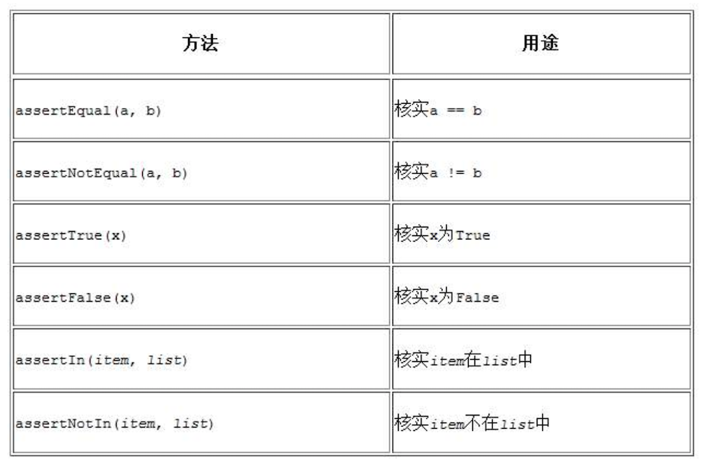

# 11 测试代码

编写函数或类时，还可为其编写测试。通过测试，可确定代码面对各种输入都能够按要求的那样工作。测试让你信心满满，深信即便有更多的人使用你的程序，它也能正确地工作。在程序中添加新代码时，你也可以对其进行测试，确认它们不会破坏程序既有的行为。程序员都会犯错，因此每个程序员都必须经常测试其代码，在用户发现问题前找出它们。

在本章中，你将学习如何使用 Python 模块 unittest 中的工具来测试代码。你将学习编写测试用例，核实一系列输入都将得到预期的输出。你将看到测试通过了是什么样子，测试未通过又是什么样子，还将知道测试未通过如何有助于改进代码。你将学习如何测试函数和类，并将知道该为项目编写多少个测试。

## 11.1 测试函数

要学习测试，得有要测试的代码。下面是一个简单的函数，它接受名和姓并返回整洁的姓名：

name_function.py

```
def get_formatted_name(first, last):

    """Generate a neatly formatted full name."""

    full_name = first + ' ' + last
 
    return full_name.title()
```

函数 get_formatted_name () 将名和姓合并成姓名，在名和姓之间加上一个空格，并将它们的首字母都大写，再返回结果。为核实 get_formatted_name () 像期望的那样工作，我们来编写一个使用这个函数的程序。程序 names.py 让用户输入名和姓，并显示整洁的全名：

names.py

```
from name_function import get_formatted_name

print("Enter 'q' at any time to quit.")

while True:

    first = input("\nPlease give me a first name: ")

    if first == 'q':

        break

    last = input("Please give me a last name: ")

    if last == 'q':

        break

    formatted_name = get_formatted_name(first, last)

    print("\tNeatly formatted name: " + formatted_name + '.')
```

这个程序从 name_function.py 中导入 get_formatted_name () 。用户可输入一系列的名和姓，并看到格式整洁的全名：

```
Enter 'q' at any time to quit.

Please give me a first name: janis

Please give me a last name: joplin

Neatly formatted name: Janis Joplin.

Please give me a first name: bob

Please give me a last name: dylan

Neatly formatted name: Bob Dylan.

Please give me a first name: q
```

从上述输出可知，合并得到的姓名正确无误。现在假设我们要修改 get_formatted_name () ，使其还能够处理中间名。这样做时，我们要确保不破坏这个函数处理只有名和姓的姓名的方式。为此，我们可以在每次修改 get_formatted_name () 后都进行测试：运行程序 names.py，并输入像 Janis Joplin 这样的姓名，但这太烦琐了。所幸 Python 提供了一种自动测试函数输出的高效方式。倘若我们对 get_formatted_name () 进行自动测试，就能始终信心满满，确信给这个函数提供我们测试过的姓名时，它都能正确地工作。

### 11.1.1 单元测试和测试用例

Python 标准库中的模块 unittest 提供了代码测试工具。单元测试用于核实函数的某个方面没有问题；测试用例是一组单元测试，这些单元测试一起核实函数在各种情形下的行为都符合要求。良好的测试用例考虑到了函数可能收到的各种输入，包含针对所有这些情形的测试。全覆盖式测试用例包含一整套单元测试，涵盖了各种可能的函数使用方式。对于大型项目，要实现全覆盖可能很难。通常，最初只要针对代码的重要行为编写测试即可，等项目被广泛使用时再考虑全覆盖。

### 11.1.2 可通过的测试

创建测试用例的语法需要一段时间才能习惯，但测试用例创建后，再添加针对函数的单元测试就很简单了。要为函数编写测试用例，可先导入模块 unittest 以及要测试的函数，再创建一个继承 unittest.TestCase 的类，并编写一系列方法对函数行为的不同方面进行测试。

下面是一个只包含一个方法的测试用例，它检查函数 get_formatted_name () 在给定名和姓时能否正确地工作：

test_name_function.py

```
import unittest

from name_function import get_formatted_name

❶ class NamesTestCase(unittest.TestCase):

    """测试 name_function.py"""

    def test_first_last_name(self):

        """能够正确地处理像 Janis Joplin 这样的姓名吗？"""

        ❷ formatted_name = get_formatted_name('janis', 'joplin')

        ❸ self.assertEqual(formatted_name, 'Janis Joplin')

unittest.main()
```

首先，我们导入了模块 unittest 和要测试的函数 get_formatted_name () 。在 ❶ 处，我们创建了一个名为 NamesTestCase 的类，用于包含一系列针对 get_formatted_name () 的单元测试。你可随便给这个类命名，但最好让它看起来与要测试的函数相关，并包含字样 Test。这个类必须继承 unittest.TestCase 类，这样 Python 才知道如何运行你编写的测试。

NamesTestCase 只包含一个方法，用于测试 get_formatted_name () 的一个方面。我们将这个方法命名为 test_first_last_name () ，因为我们要核实的是只有名和姓的姓名能否被正确地格式化。我们运行 testname_function.py 时，所有以 test 打头的方法都将自动运行。在这个方法中，我们调用了要测试的函数，并存储了要测试的返回值。在这个示例中，我们使用实参 'janis' 和 'joplin' 调用 get_formatted_name () ，并将结果存储到变量 formatted_name 中（见❷）。

在 ❸ 处，我们使用了 unittest 类最有用的功能之一：一个断言方法。断言方法用来核实得到的结果是否与期望的结果一致。在这里，我们知道 get_formatted_name () 应返回这样的姓名，即名和姓的首字母为大写，且它们之间有一个空格，因此我们期望 formatted_name 的值为 Janis Joplin 。为检查是否确实如此，我们调用 unittest 的方法 assertEqual () ，并向它传递 formatted_name 和 'Janis Joplin' 。代码行 self.assertEqual (formatted_name, 'Janis Joplin') 的意思是说：「将 formatted_name 的值同字符串 'Janis Joplin' 进行比较，如果它们相等，就万事大吉，如果它们不相等，跟我说一声！」

代码行 unittest.main () 让 Python 运行这个文件中的测试。运行 test_name_function.py 时，得到的输出如下：

```
.

----------------------------------------------------------------------

Ran 1 test in 0.000s

OK
```

第 1 行的句点表明有一个测试通过了。接下来的一行指出 Python 运行了一个测试，消耗的时间不到 0.001 秒。最后的 OK 表明该测试用例中的所有单元测试都通过了。

上述输出表明，给定包含名和姓的姓名时，函数 get_formatted_name () 总是能正确地处理。修改 get_formatted_name () 后，可再次运行这个测试用例。如果它通过了，我们就知道在给定 Janis Joplin 这样的姓名时，这个函数依然能够正确地处理。

### 11.1.3 不能通过的测试

测试未通过时结果是什么样的呢？我们来修改 get_formatted_name () ，使其能够处理中间名，但这样做时，故意让这个函数无法正确地处理像 Janis Joplin 这样只有名和姓的姓名。

下面是函数 get_formatted_name () 的新版本，它要求通过一个实参指定中间名：

name_function.py

```
def get_formatted_name(first, middle, last):

    """生成整洁的姓名"""

    full_name = first + ' ' + middle + ' ' + last

    return full_name.title()
```

这个版本应该能够正确地处理包含中间名的姓名，但对其进行测试时，我们发现它再也不能正确地处理只有名和姓的姓名。这次运行程序 test_name_function.py 时，输出如下：

```
❶ E

======================================================================

❷ ERROR: test_first_last_name (__main__.NamesTestCase)

----------------------------------------------------------------------

❸ Traceback (most recent call last):

File "test_name_function.py", line 8, in test_first_last_name

formatted_name = get_formatted_name('janis', 'joplin')

TypeError: get_formatted_name() missing 1 required positional argument: 'last'

----------------------------------------------------------------------

❹ Ran 1 test in 0.000s

❺ FAILED (errors=1)
```

其中包含的信息很多，因为测试未通过时，需要让你知道的事情可能有很多。第 1 行输出只有一个字母 E （见 ❶），它指出测试用例中有一个单元测试导致了错误。接下来，我们看到 NamesTestCase 中的 test_first_last_name () 导致了错误（见❷）。测试用例包含众多单元测试时，知道哪个测试未通过至关重要。在 ❸ 处，我们看到了一个标准的 traceback，它指出函数调用 get_formatted_name ('janis', 'joplin') 有问题，因为它缺少一个必不可少的位置实参。

我们还看到运行了一个单元测试（见 ❹）。最后，还看到了一条消息，它指出整个测试用例都未通过，因为运行该测试用例时发生了一个错误（见❺）。这条消息位于输出末尾，让你一眼就能看到 —— 你可不希望为获悉有多少测试未通过而翻阅长长的输出。

### 11.1.4 测试未通过时怎么办

测试未通过时怎么办呢？如果你检查的条件没错，测试通过了意味着函数的行为是对的，而测试未通过意味着你编写的新代码有错。因此，测试未通过时，不要修改测试，而应修复导致测试不能通过的代码：检查刚对函数所做的修改，找出导致函数行为不符合预期的修改。

在这个示例中，get_formatted_name () 以前只需要两个实参 —— 名和姓，但现在它要求提供名、中间名和姓。新增的中间名参数是必不可少的，这导致 get_formatted_name () 的行为不符合预期。就这里而言，最佳的选择是让中间名变为可选的。这样做后，使用类似于 Janis Joplin 的姓名进行测试时，测试就会通过了，同时这个函数还能接受中间名。下面来修改 get_formatted_name () ，将中间名设置为可选的，然后再次运行这个测试用例。如果通过了，我们接着确认这个函数能够妥善地处理中间名。

要将中间名设置为可选的，可在函数定义中将形参 middle 移到形参列表末尾，并将其默认值指定为一个空字符串。我们还要添加一个 if 测试，以便根据是否提供了中间名相应地创建姓名：

name_function.py

```
def get_formatted_name(first, last, middle=''):

"""生成整洁的姓名"""

    if middle:

        full_name = first + ' ' + middle + ' ' + last

    else:

        full_name = first + '  ' + last

    return full_name.title()
```

在 get_formatted_name () 的这个新版本中，中间名是可选的。如果向这个函数传递了中间名（if middle: ），姓名将包含名、中间名和姓，否则姓名将只包含名和姓。现在，对于两种不同的姓名，这个函数都应该能够正确地处理。为确定这个函数依然能够正确地处理像 Janis Joplin 这样的姓名，我们再次运行 test_name_function.py：

```
.


----------------------------------------------------------------------


Ran 1 test in 0.000s


OK
```

现在，测试用例通过了。太好了，这意味着这个函数又能正确地处理像 Janis Joplin 这样的姓名了，而且我们无需手工测试这个函数。这个函数很容易就修复了，因为未通过的测试让我们得知新代码破坏了函数原来的行为。

### 11.1.5 添加新测试

确定 get_formatted_name () 又能正确地处理简单的姓名后，我们再编写一个测试，用于测试包含中间名的姓名。为此，我们在 NamesTestCase 类中再添加一个方法：

import unittest

```
from name_function import get_formatted_name

class NamesTestCase(unittest.TestCase):

    """测试 name_function.py"""

    def test_first_last_name(self):

    """能够正确地处理像 Janis Joplin 这样的姓名吗？"""

        formatted_name = get_formatted_name('janis', 'joplin')

        self.assertEqual(formatted_name, 'Janis Joplin')

    def test_first_last_middle_name(self):

        """能够正确地处理像 Wolfgang Amadeus Mozart 这样的姓名吗？"""

        ❶ formatted_name = get_formatted_name('wolfgang', 'mozart', 'amadeus')

        self.assertEqual(formatted_name, 'Wolfgang Amadeus Mozart')

unittest.main()
```

我们将这个方法命名为 test_first_last_middle_name () 。方法名必须以 test_打头，这样它才会在我们运行 test_name_function.py 时自动运行。这个方法名清楚地指出了它测试的是 get_formatted_name () 的哪个行为，这样，如果该测试未通过，我们就会马上知道受影响的是哪种类型的姓名。在 TestCase 类中使用很长的方法名是可以的；这些方法的名称必须是描述性的，这才能让你明白测试未通过时的输出；这些方法由 Python 自动调用，你根本不用编写调用它们的代码。

为测试函数 get_formatted_name () ，我们使用名、姓和中间名调用它（见 ❶），再使用 assertEqual () 检查返回的姓名是否与预期的姓名（名、中间名和姓）一致。我们再次运行 test_name_function.py 时，两个测试都通过了：

```
..

----------------------------------------------------------------------

Ran 2 tests in 0.000s

OK
```

太好了！现在我们知道，这个函数又能正确地处理像 Janis Joplin 这样的姓名了，我们还深信它也能够正确地处理像 Wolfgang Amadeus Mozart 这样的姓名。

『

动手试一试：

11-1 城市和国家 ：编写一个函数，它接受两个形参：一个城市名和一个国家名。这个函数返回一个格式为 City, Country 的字符串，如 Santiago, Chile 。将这个函数存储在一个名为 city_functions.py 的模块中。

创建一个名为 test_cities.py 的程序，对刚编写的函数进行测试（别忘了，你需要导入模块 unittest 以及要测试的函数）。编写一个名为 test_city_country () 的方法，核实使用类似于'santiago' 和 'chile' 这样的值来调用前述函数时，得到的字符串是正确的。运行 test_cities.py ，确认测试 test_city_country () 通过了。

11-2 人口数量 ：修改前面的函数，使其包含第三个必不可少的形参 population ，并返回一个格式为 City, Country - population xxx 的字符串，如 Santiago, Chile - population 5000000 。运行 test_cities.py，确认测试 test_city_country () 未通过。

修改上述函数，将形参 population 设置为可选的。再次运行 test_cities.py，确认测试 test_city_country () 又通过了。

再编写一个名为 test_city_country_population () 的测试，核实可以使用类似于'santiago' 、'chile' 和 'population=5000000' 这样的值来调用这个函数。再次运行 test_cities.py，确认测试 test_city_country_population () 通过了。

』

## 11.2 测试类

在本章前半部分，你编写了针对单个函数的测试，下面来编写针对类的测试。很多程序中都会用到类，因此能够证明你的类能够正确地工作会大有裨益。如果针对类的测试通过了，你就能确信对类所做的改进没有意外地破坏其原有的行为。

### 11.2.1 各种断言方法

Python 在 unittest.TestCase 类中提供了很多断言方法。前面说过，断言方法检查你认为应该满足的条件是否确实满足。如果该条件确实满足，你对程序行为的假设就得到了确认，你就可以确信其中没有错误。如果你认为应该满足的条件实际上并不满足，Python 将引发异常。

表 11-1 描述了 6 个常用的断言方法。使用这些方法可核实返回的值等于或不等于预期的值、返回的值为 True 或 False 、返回的值在列表中或不在列表中。你只能在继承 unittest.TestCase 的类中使用这些方法，下面来看看如何在测试类时使用其中的一个。

表 11-1 unittest Module 中的断言方法



### 11.2.2 一个要测试的类

类的测试与函数的测试相似 —— 你所做的大部分工作都是测试类中方法的行为，但存在一些不同之处，下面来编写一个类进行测试。来看一个帮助管理匿名调查的类：

survey.py

```
class AnonymousSurvey():

    """收集匿名调查问卷的答案"""

    ❶ def __init__(self, question):

        """存储一个问题，并为存储答案做准备"""

        self.question = question

        self.responses = []

    ❷ def show_question(self):

        """显示调查问卷"""

        print(question)

    ❸ def store_response(self, new_response):

        """存储单份调查答卷"""

        self.responses.append(new_response)

    ❹ def show_results(self):

        """显示收集到的所有答卷"""

        print("Survey results:")

        for response in responses:

    print('- ' + response)
```

这个类首先存储了一个你指定的调查问题（见 ❶），并创建了一个空列表，用于存储答案。这个类包含打印调查问题的方法（见 ❷）、在答案列表中添加新答案的方法（见 ❸）以及将存储在列表中的答案都打印出来的方法（见 ❹）。要创建这个类的实例，只需提供一个问题即可。有了表示调查的实例后，就可使用 show_question () 来显示其中的问题，可使用 store_response () 来存储答案，并使用 show_results () 来显示调查结果。

为证明 AnonymousSurvey 类能够正确地工作，我们来编写一个使用它的程序：

language_survey.py

```
from survey import AnonymousSurvey

#定义一个问题，并创建一个表示调查的 AnonymousSurvey 对象

question = "What language did you first learn to speak?"

my_survey = AnonymousSurvey(question)

#显示问题并存储答案

my_survey.show_question()

print("Enter 'q' at any time to quit.\n")

while True:

    response = input("Language: ")

    if response == 'q':

        break

    my_survey.store_response(response)

# 显示调查结果

print("\nThank you to everyone who participated in the survey!")

my_survey.show_results()
```

这个程序定义了一个问题（"What language did you first learn to speak?" ），并使用这个问题创建了一个 AnonymousSurvey 对象。接下来，这个程序调用 show_question () 来显示问题，并提示用户输入答案。收到每个答案的同时将其存储起来。用户输入所有答案（输入 q 要求退出）后，调用 show_results () 来打印调查结果：

```
What language did you first learn to speak?

Enter 'q' at any time to quit.

Language: English

Language: Spanish

Language: English

Language: Mandarin

Language: q

Thank you to everyone who participated in the survey!

Survey results:

- English

- Spanish

- English

- Mandarin
```

AnonymousSurvey 类可用于进行简单的匿名调查。假设我们将它放在了模块 survey 中，并想进行改进：让每位用户都可输入多个答案；编写一个方法，它只列出不同的答案，并指出每个答案出现了多少次；再编写一个类，用于管理非匿名调查。

进行上述修改存在风险，可能会影响 AnonymousSurvey 类的当前行为。例如，允许每位用户输入多个答案时，可能不小心修改了处理单个答案的方式。要确认在开发这个模块时没有破坏既有行为，可以编写针对这个类的测试。

### 11.2.3 测试 AnonymousSurvey 类

下面来编写一个测试，对 AnonymousSurvey 类的行为的一个方面进行验证：如果用户面对调查问题时只提供了一个答案，这个答案也能被妥善地存储。为此，我们将在这个答案被存储后，使用方法 assertIn () 来核实它包含在答案列表中：

test_survey.py

```
import unittest

from survey import AnonymousSurvey

❶ class TestAnonmyousSurvey(unittest.TestCase):

    """针对 AnonymousSurvey 类的测试"""

    ❷ def test_store_single_response(self):

    """测试单个答案会被妥善地存储"""

    question = "What language did you first learn to speak?"

    ❸ my_survey = AnonymousSurvey(question)

    my_survey.store_response('English')

    ❹ self.assertIn('English', my_survey.responses)

unittest.main()
```

我们首先导入了模块 unittest 以及要测试的类 AnonymousSurvey 。我们将测试用例命名为 TestAnonymousSurvey ，它也继承了 unittest.TestCase （见 ❶）。第一个测试方法验证调查问题的单个答案被存储后，会包含在调查结果列表中。对于这个方法，一个不错的描述性名称是 test_store_single_response () （见 ❷）。如果这个测试未通过，我们就能通过输出中的方法名得知，在存储单个调查答案方面存在问题。

要测试类的行为，需要创建其实例。在 ❸ 处，我们使用问题 "What language did you first learn to speak?" 创建了一个名为 my_survey 的实例，然后使用方法 store_response () 存储了单个答案 English 。接下来，我们检查 English 是否包含在列表 my_survey.responses 中，以核实这个答案是否被妥善地存储了（见 ❹）。

当我们运行 test_survey.py 时，测试通过了：

```
.

----------------------------------------------------------------------

Ran 1 test in 0.001s

OK
```

这很好，但只能收集一个答案的调查用途不大。下面来核实用户提供三个答案时，它们也将被妥善地存储。为此，我们在 TestAnonymousSurvey 中再添加一个方法：

```
import unittest

from survey import AnonymousSurvey

class TestAnonymousSurvey(unittest.TestCase):

    """针对 AnonymousSurvey 类的测试"""

    def test_store_single_response(self):

        """测试单个答案会被妥善地存储"""

--snip--

    def test_store_three_responses(self):

        """测试三个答案会被妥善地存储"""

        question = "What language did you first learn to speak?"

        my_survey = AnonymousSurvey(question)

        ❶ responses = ['English', 'Spanish', 'Mandarin']
        
        for response in responses:

            my_survey.store_response(response)

        ❷ for response in responses:

            self.assertIn(response, my_survey.responses)

unittest.main()
```

我们将这个方法命名为 test_store_three_responses () ，并像 test_store_single_response () 一样，在其中创建一个调查对象。我们定义了一个包含三个不同答案的列表（见 ❶），再对其中每个答案都调用 store_response () 。存储这些答案后，我们使用一个循环来确认每个答案都包含在 my_survey.responses 中（见 ❷）。

我们再次运行 test_survey.py 时，两个测试（针对单个答案的测试和针对三个答案的测试）都通过了：

```
..

----------------------------------------------------------------------

Ran 2 tests in 0.000s

OK
```

前述做法的效果很好，但这些测试有些重复的地方。下面使用 unittest 的另一项功能来提高它们的效率。

### 11.2.4 方法 setUp ()

在前面的 test_survey.py 中，我们在每个测试方法中都创建了一个 AnonymousSurvey 实例，并在每个方法中都创建了答案。unittest.TestCase 类包含方法 setUp () ，让我们只需创建这些对象一次，并在每个测试方法中使用它们。如果你在 TestCase 类中包含了方法 setUp () ，Python 将先运行它，再运行各个以 test_ 打头的方法。这样，在你编写的每个测试方法中都可使用在方法 setUp () 中创建的对象了。

下面使用 setUp () 来创建一个调查对象和一组答案，供方法 test_store_single_response () 和 test_store_three_responses () 使用：

```
import unittest

from survey import AnonymousSurvey

class TestAnonymousSurvey(unittest.TestCase):

    """针对 AnonymousSurvey 类的测试"""

    def setUp(self):

        """创建一个调查对象和一组答案，供使用的测试方法使用"""

        question = "What language did you first learn to speak?"

        ❶ self.my_survey = AnonymousSurvey(question)

        ❷ self.responses = ['English', 'Spanish', 'Mandarin']

    def test_store_single_response(self):

        """测试单个答案会被妥善地存储"""

        self.my_survey.store_response(self.responses[0])

        self.assertIn(self.responses[0], self.my_survey.responses)

    def test_store_three_responses(self):

        """测试三个答案会被妥善地存储"""

        for response in self.responses:

        self.my_survey.store_response(response)

        for response in self.responses:

        self.assertIn(response, self.my_survey.responses)

unittest.main()
```

方法 setUp () 做了两件事情：创建一个调查对象（见 ❶）；创建一个答案列表（见 ❷）。存储这两样东西的变量名包含前缀 self （即存储在属性中），因此可在这个类的任何地方使用。这让两个测试方法都更简单，因为它们都不用创建调查对象和答案。方法 test_store_three_response () 核实 self.responses 中的第一个答案 ——self.responses [0] —— 被妥善地存储，而方法 test_store_three_response () 核实 self.responses 中的全部三个答案都被妥善地存储。

再次运行 test_survey.py 时，这两个测试也都通过了。如果要扩展 AnonymousSurvey ，使其允许每位用户输入多个答案，这些测试将很有用。修改代码以接受多个答案后，可运行这些测试，确认存储单个答案或一系列答案的行为未受影响。

测试自己编写的类时，方法 setUp () 让测试方法编写起来更容易：可在 setUp () 方法中创建一系列实例并设置它们的属性，再在测试方法中直接使用这些实例。相比于在每个测试方法中都创建实例并设置其属性，这要容易得多。

『

注意：运行测试用例时，每完成一个单元测试，Python 都打印一个字符：测试通过时打印一个句点；测试引发错误时打印一个 E ；测试导致断言失败时打印一个 F 。这就是你运行测试用例时，在输出的第一行中看到的句点和字符数量各不相同的原因。如果测试用例包含很多单元测试，需要运行很长时间，就可通过观察这些结果来获悉有多少个测试通过了。

动手试一试：

11-3 雇员 ：编写一个名为 Employee 的类，其方法 __init__() 接受名、姓和年薪，并将它们都存储在属性中。编写一个名为 give_raise () 的方法，它默认将年薪增加 5000 美元，但也能够接受其他的年薪增加量。

为 Employee 编写一个测试用例，其中包含两个测试方法：test_give_default_raise () 和 test_give_custom_raise () 。使用方法 setUp () ，以免在每个测试方法中都创建新的雇员实例。运行这个测试用例，确认两个测试都通过了。

』

## 11.3 小结

在本章中，你学习了：如何使用模块 unittest 中的工具来为函数和类编写测试；如何编写继承 unittest.TestCase 的类，以及如何编写测试方法，以核实函数和类的行为符合预期；如何使用方法 setUp () 来根据类高效地创建实例并设置其属性，以便在类的所有测试方法中都可使用它们。

测试是很多初学者都不熟悉的主题。作为初学者，并非必须为你尝试的所有项目编写测试；但参与工作量较大的项目时，你应对自己编写的函数和类的重要行为进行测试。这样你就能够更加确定自己所做的工作不会破坏项目的其他部分，你就能够随心所欲地改进既有代码了。如果不小心破坏了原来的功能，你马上就会知道，从而能够轻松地修复问题。相比于等到不满意的用户报告 bug 后再采取措施，在测试未通过时采取措施要容易得多。

如果你在项目中包含了初步测试，其他程序员将更敬佩你，他们将能够更得心应手地尝试使用你编写的代码，也更愿意与你合作开发项目。如果你要跟其他程序员开发的项目共享代码，就必须证明你编写的代码通过了既有测试，通常还需要为你添加的新行为编写测试。

请通过多开展测试来熟悉代码测试过程。对于自己编写的函数和类，请编写针对其重要行为的测试，但在项目早期，不要试图去编写全覆盖的测试用例，除非有充分的理由这样做。

