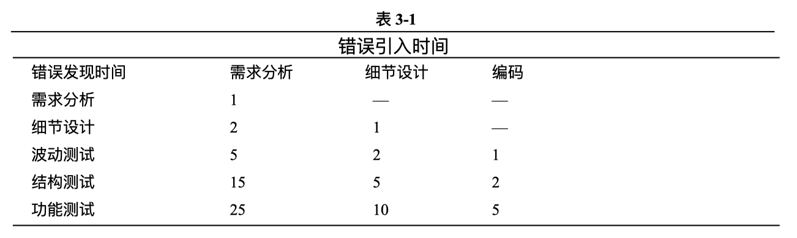
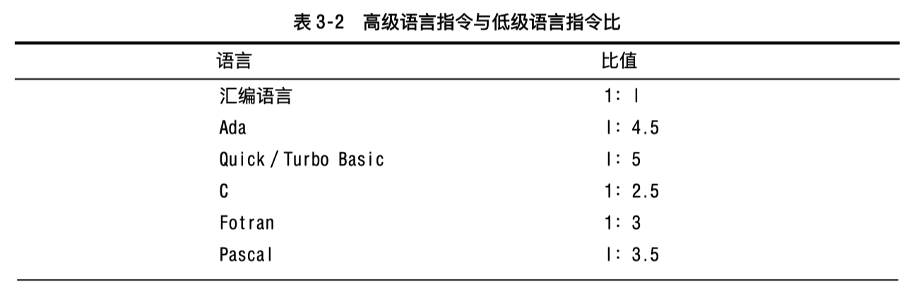
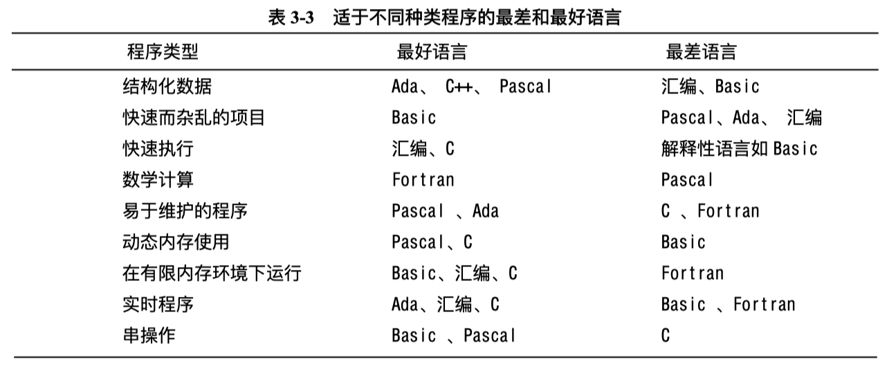

# 03 软件创建的先决条件

### 相关章节

- 不同规模程序的不同条件：见第 21 章。

- 管理创建：见第 22 章。

- 设计：见第 7 章。

在开始修造一幢房屋之前，建筑工人会评审蓝图，确认所有用料已经备齐，并检查房子的地基。建筑工人为修建摩天大楼和修建狗舍所做的准备工作是截然不同的。但不管是什么样的项目，准备工作总是和需要相适应的，并且应在工程正式开始前做完。

本章主要论述在软件创建之前所要做的准备工作，对于建筑业来说，项目的成败往往在开工前就已经决定了。如果基础打得不好，或者项目计划进行得不充分，你所能做的最多也就是防止计划失败，根本谈不上做好。如果你想做一件精美的首饰，那么就得用钻石作原料。如果你用的是砖头，那你所能得到的最好结果不过是块漂亮的砖头而已。

虽然本章讲的是软件创建基础工作，但并没有直接论述创建工作。如果你觉得不耐烦，或是你对软件工程生存期循环已经很熟悉了，那么请跳过本章而直接进入下一章。

## 3.1 先决条件重要性

优秀程序员的一个突出特点是他们采用高质量的过程来创建软件。这种过程在计划的开始、中间和末尾都强调高质量。

如果你只在一个计划即将结束时强调质量，那你注重的只是测试。当某些人一谈起软件质量时，他们首先想到的便是测试。然而，事实上测试只是全部质量控制策略的一部分。而且并不是最重要的部分。测试既不能消除在正确方向上的错误工作，也不能消除在错误方向上的正确工作的错误，这种错误必须在测试开始之前就清除掉，甚至在创建工作开始之前就要努力清除掉它们。

如果你在一个计划的中间强调质量，那么你强调的是创建活动，这一活动是本书论述的中心。

如果在一个计划的开始强调质量，这意味着你计划并要求设计一种高质量的产品。假设你在过程开始时要求设计的是一种菲亚特汽车，你尽可以用你所喜欢的各种手段测试它，但是无论你怎样测试，它也決不会变成一辆罗尔斯一一罗伊斯牌汽车。或许你所得到的是一辆最好的菲亚特汽车，但如果你想要的是罗尔斯一罗伊斯车，你就不得不从计划开始时就提出要求。

在软件开发中，当你进行诸如问题定义、规定解决办法等等计划工作时，你所进行的就是这样的工作。由于创建工作处在一个计划的中间，所以，当你开始创建工作时，早期的工作已经奠定了项目成败的基础。在创建工作中，至少你应该知道自己的处境如何，当你发现失败的乌云从地平线上升起时，赶快返回第一阶段。本章其余部分主要讲述准备工作已经作好了。

### 3.1. 造成准备不足的原因

你也许会认为所有的职业程序员都懂得准备工作的重要性，并且在开始正式工作之前确认所有的先決条件都已得到满足。不幸的是，事实并非如此。

一些程序员并不作准备工作，因为他们抵制不了立刻开始进行编码工作的渴望。如果你就是这种程序员，那我对你有两条忠告。第一，阅读一下，下一部分工作的内容提示，或许你会从中发现一些你没想到的问题。第二，要注意自己的问题。只要创建过几个大的程序，你就会明白强调准备工作的必要性。不要忘记自己的经验教训。

程序员不重视准备工作的另一个原因是管理人员往往不理解那些在创建先决条件上花费时间的程序员。Ed Yourdon 和 Tom Demarco 等人强调准备工作已经有十五年了。在这期间，他们不时地敲响警钟，或许有一天，管理人员们最终会明白软件开发不仅仅是编写代码。

八十年代后期，我曾经在一项军用项目的某一部门中工作。当项目进行到需求分析阶段时，负责这个计划的一位将军前来视察。我们告诉了他目前所处的阶段，并主要谈论了文件编写工作，而这位将军却坚持要看一下代码，我们告诉他目前还没有代码，而他却走进一间正有一百多人工作的房间，转了一圈，企图找到谁在编码。由于未能如愿以偿，他变得有些气急败坏，这位身材高大的将军指着自己身边的工程师喊道：「他在干什么？他一定是在写代码。」事实上，这位软件工程师正在进行文档格式编排的工作，由于这位将军想得到代码，认为那看起来像代码并且想让工程师编码，所以我们不得不骗他说这位工程师写的确实是代码。

这可以称为 WISCA 或 WIMP 现象，即：为什么 Sam 没有正在写代码？或 Mary 为什么没正在编程？

如果你正在从事的项目经理像那个将军一样，命令你立刻开始编码，说声「是，长官」是很容易的。但这是一个坏的反应，你应该还有几个替代办法。

第一，你应该平静地拒绝按照错误顺序工作。如果你与老板的关系很正常的话，那么这太好了。

第二，你可以假装正在编码而事实上没有。把一个旧的程序清单放到桌角上，然后埋头从事你的需求和构想文件编写工作，不管你的老板同不同意。这样你可以把工作做得更快更好。从你老板的观点来看，这个忽视是一个福音。

第三，你可以用技术项目的开发方式来教育一下老板。这是一个好办法因为这可以增加这个世界上开明老板的数量。在下一部分，我们将给出更多在创建活动前做好准备工作的理由。

最后，你可以另找一份工作。优秀的程序员是非常短缺的。可以找到更好的工作，干吗非要呆在一个很不开明的程序店里徒损生命呢？

#### 3.1.2 在进行创建工作之前必须做准备工作的论据

假设你已经登上了问题定义的山峰，与负责需求分析的人并肩走了一英里，在结构设计之泉中，洗净了你沽满灰尘的衣服，并且沐浴在已经作好准备的纯洁之水中。那么你就会知道在实现一个系统之前，你应该清楚需要一个系统干什么和需要怎样去干。

作为一个工程技术人员，教育你周围的人，让他们懂得技术项目的开发过程，也是你工作的一部分。本书的这一部分可以帮你对付那些还不懂得技术项目开发过程的老板和管理人员。它是关于进行构造设计和问题定义设计权利的延伸论据。在你进行编码、测试和调试之前，学会这些论据，并且和你的老板推心置腹地谈谈技术项目的开发过程。

#### 01. 求助于逻辑推理

进行有效程序设计的关键之一就是认识到准备工作是非常重要的。在进行一项大的项目之前，事先做好计划是明智的。项目越大，需要的计划工作量也越大，从管理人员的角度来看，计划是指确定一个项目所需要的时间、人力、物力和财力。从技术人员的观点来看，计划是指弄清楚你想要干什么，以免做出错误的工作而徒耗精力与钱财。有时候你自己并不十分清楚自己想要的到底是什么？起码刚开始是这样。这时，就会比清楚知道用户需求的人要付出更多努力，但是，这总比做出一件错误的东西，然后把它扔掉，再从头开始的成本要低得多。

建造一个系统之前，弄清楚怎样开始和如何建造它也是非常重要的，你当然不希望在完全没有必要的情况下，浪费时间与钱财去钻死胡同而白白增加成本。

#### 02. 求助于类比

创建一个软件系统与其它需要耗费人力与财力的工程是一样的。如果你要造一幢房子，在开始砌第一块砖之前，你必须事先画好建筑图与蓝图。在你开始浇铸水泥之前，你必须让人评审你的蓝图并获得通过，在软件开发中事先做计划也与此类似。

在你把圣诞树立起来后，你才会开始装饰它，在没有修好烟囟之前你也不会点燃炉火的同样，也没有人会打算在油箱空空的情况下踏上旅程，在软件开发中，你也必须按照正确的顺序来进行。

程序员处于软件开发食物链的最后一环。结构设计吃掉需求分析；详细设计者以结构设计者为食，而他自己又成为编码者的食物。

比较软件食物链和真正的食物链，我们会发现如下事实，在一个正常的生态系统中，海鸥以沙丁鱼为食，沙丁鱼吃鲜鱼，鮮鱼吃水虱，其结果会形成一个正常的食物链。在编程工作中，如果软件食物链的每一级都可以吃到健康的食物，其结果是由一群快乐的程序员写出的正确代码。

在一个被污染了的环境中，水虱在受到核沾染的水中游泳，鲫鱼体内积聚了滴滴涕，而沙丁鱼生活的水域又遭受了石油污染，那么，不幸的海鸣由于处在食物链的最后一环，因此，它吃的不仅仅是沙丁鱼体内的石油，还有鲜鱼体内的滴滴涕和水虱体內的核废料。在程序设计中，如果需求定义遭受了污染，那么这又会影响结构设计，而这将最终影响创建活动。这将导致程序员们脾气暴躁而营养不良，同时生产出遭受严重污染而充满缺陷的软件。

#### 03. 求助于数据

过去十五年的研究证明，一次完成是最好的选择，不必要的修改是非常昂贵的。

TKW 的数据表明，在项目的初期阶段进行设计更改，比如在需求定义和结构设计阶段进行更改，与在项目的后期，即创建和维护阶段进行更改相比较，其成本要低 50 到 100 倍（Boehm 和 Pappecio,1988）。

对 IBM 的研究也表明了同样结果。在设计开始阶段，如详细设计、编码或单元测试阶段就消除错误，其成本要比在后期即系统测试和功能强化阶段低 10 到 100 倍（Fagan,1976）。

通常的准则是，一旦引入错误，就尽早发现和消除它。错误在软件食物链中存留的时间越长，它的危害也就传播得越远。因为需求分析是我们做的第一项工作，因此这时引入的错误在系统中存留时间最长，危害最大。在软件开发初期引入的错误往往比后来引入的错误传播的面更广，这也使得早期错误会极大地提高成本。

由 Robert Dunn 总结的表 3-1，给出了由于错误引入和发现时间不同，而产生修复它们所要耗费的相对成本差异。

表 3-1 的数据表明，在需求分析阶段引入的错误，如果马上发现并消除所耗费的成本是 1000 美元的话，那么如果到了功能测试阶段才发现和消除，耗费的成本则会高达 25000 美元。这说明我们应该尽早地发现并消除错误。

如果你的老板不相信这些数据，那你可以告诉他，立刻开始编码的程序员往往要比那些先作计划、而后才编码的程序员花费更长的时间，由 NASA 计算机科学公司和马里兰大学联合建立的软件工程实验室的研究表明，过分地使用计算机（进行编辑、编译、链接、测试等）往往与低生产率紧密相联。而在计算机旁花费较少时间的程序员，往往更快地完成工作。这是由于频繁使用计算机的程序员在进行编码和测试之前，花在计划和设计上的时间较少。

#### 04. 老板的意愿测试

当你认为老板已经理解了在开始创建工作之前进行准备工作的重要性，那么请进行下面的测验以证实这一点。

下面这些说法哪些是正确的？

1. 我们最好马上就开始编码因为我们将会有许多测试工作要做。

2. 我们没有安排许多时间进行测试，因为我们不会发现很多错误。

3. 我们已经在计划和设计上花费了这么多精力，我想我们的编码和测试时不会有什么大问题了。

以上这些都是正确的。在本章的其余部分我们将论述如何确定先决条件是否已经得到满足。

## 3.2 问题定义先决条件

在进行创建工作之前你要满足的第一个先决条件，便是必须弄清楚你想要解决的问题是什么。由于本书的中心内容是创建活动，因此我们不打算在这里论述如何进行问题定义。我们只想告诉读者如何确认问题定义是否完成，这个定义的质量如何，是否足以作为创建活动的基础。

问题定义只描述要解决的问题是什么，根本不涉及解决方法。它应该是一个简短的说明，听起来像一个问题。比如「我们无法跟上指令系统」听起来像一个问题，也是一个好的问题定义。而「我们需要优化数据入口系统以便跟上指令系统」则是一个糟糕的问题定义，它听起来不像是个问题而更像是个解决方案。

问题定义的工作是在需求分析之前进行，后者是对问题的更为详尽的分析。

问题定义应该从用户的观点出发，使用用户的语言进行定义。一般来说，它不应该使用计算机技术术语进行定义。因为最好的解決办法可能并不是一个计算机程序。比如说，你需要一份关于年度利润的报告，而你已经拥有了一套能产生季度利润的计算机报表系统，如果你的思路仅仅局限于计算机，那你可能会让人再写一个产生年度利润报告的程序加到这个系统中。为达到这个目的，你不得不雇用一个程序员编写并调试出一段相应的程序。可是，要是你的思路开阔一些的话，让你的秘书用计算器把四个季度的利润加到一起，问题不就解决了吗？

当然，如果问题是关于计算机本身时，就是个例外了。比如，计算机的编译速度太慢或者编程工具的问题太多，那我们只能用技术术语来说明问题了。问题定义错误的后果是你可能浪费许多时间精力去解决了一个错误问题。这种惩罚往往是双重的，因为真正的问题并没有解決。

## 3.3 需求分析先决条件

需求详细描述了一个软件系统需要解决的问题，这是找到问题答案的第一步。这项活动也被称作「需求分析」、「需求定义」等。

### 3.3.1 为什么要有正式的需求

明确的需求是很重要的，因为：

1、明确的需求可以保证是由用户而不是程序员决定系统的功能。如果需求是很清楚的，那么用户可以对其进行评定，并确认自己是否同意。如果需求不很清楚，那么程序员在编程过程中就不得不自己决定系统功能，明确的需求防止对用户需求进行猜测。

2、明确的需求也可以避免引起争议。在开始编程之前，系统的范围已经明确确定了。如果在编程过程中，两个程序员对系统干什么有争议，那么只要査阅一下写好的需求分析，问题就解决了。

3、注意需求定义，也可以使得在开发工作开始之后，对系统作的改动最小、如果你在编码时发现某几行有误，那么改掉这几行就是了。而如果在编码阶段发现需求有误，那么你很可能不得不改变所有的代码以适应新的需求。

4、一些设计不得不被丢掉，是因为按它们的要求写好的代码不具备兼容性。新设计可能要花费很长的时间，被一同扔掉的还有受到需求变更影响的代码和测试用例，即使未受影响的代码部分也不得不进行重新测试，以确认其他地方的变动没有引入新的错误。

5、IBM、GTE、TRW 的数据表明。修正在总体结构阶段发现的需求错误，将比当时就发现并修正的成本要高出 5 倍，如果是在编码阶段，要高出 10 倍，在单元或系统测试阶段，高 20 倍，在验收测试阶段，高 50 倍，而在维护阶段，竟要比原来高出多达 100 倍！在较小规模的计划中，在维护阶段修正错误的放大因子可能是 20 而不是 100，因为这时管理费用较低。但无论如何没有人愿意从自己的收益中拿出这笔钱来。

6、充分进行需求分析是一个项目成功的关键，很可能比使用有效的创建技术还重要。关于如何进行需求分析有许多好的论著。因此，我们不打算在随后的几部分中探讨如何进行需求分析。我们只想告诉你如何确定需求分析已经完成，如何最充分地利用需求分析。

### 3.3.2 稳定需求的神话

稳定的需求可以说是软件开发的法宝。有了稳定的需求，软件开发工作可能从结构设计到详细设计到编码，都平稳、顺利的进行。这简直是造就了软件开发的天堂。你可以预测开支，不必担心最终会冒出一个让你多花 100 倍钱的错误来。

用户一旦接受了写好的需求文件，便再也不会提出更改需求，这简直是太好了。然而事实上，在实际项目中，用户在代码写出来之前，往往并不能确切可靠地描述出他想要的到底是什么，这倒并不是说用户是一种低级生物。正如随着工作的进行，你对其理解越来越深刻一样，用户对自己想要的东西，也是随着项目的进行而越来越清楚的，这也是需求变动的主要原因。一个从不变更需求的计划，事实上是一个对用户的需求不予理睬的计划。

典型的变动有多少呢？根据 IBM 的调查，对于ー个典型的有一百万字的需求分析，大约 25% 的内容在开发过程中要进行变动。或许你认为卡迪拉克小汽车是空前绝后的，帝国大厦将万古永存，如果真是这样的话，那你就相信你的项目需求永远不会更好了。如果不是这样，那么或许我们可以采取一些措施，使得由于需求变更所造成的冲击最小。

### 3.3.3 在创建阶段如何对付需求变化

以下是在创建阶段，为应付需求变化而应该采取的措施。

1、用本部分后面的检查表来评估你的需求分析质量。如果你的需求分析不是很好，那么，停止继续工作，重新返回到需求分析阶段。当然，这样会使人觉得你已经落后了。但是，如果你在开车从芝加哥到洛杉矶的途中，发现自己到了纽约市郊，那么停下车来看一下地图是浪费时间吗？当然不是。因此，如果你发现方向不对，赶紧停下来检查你的方向。

2、让每个人都知道由于变化需求所付出的代价。雇员们往往由于自己有了新的设计想法而激动不已。在这种兴奋驱使之下，他们往往会热血沸腾，得意忘形。什么讨论需求的会议，什么签约似式、什么需求文件，统統都会被他们扔在一边。对付这种人最简单办法就是对他说「喂，先生，你的想法不错，但是由于它不在需求文件之中，我想先做一个变动后的进度和成本估计，然后我们再決定是立刻就采用这个想法还是以后再说」。「时间进度」和「成本」这两个词往往比咖啡和泼冷水更管用，这样说，往往会把许多「立刻采用」变成「最好采用」。如果你的组织机构还没有认识到需求分析的重要性，那么就请引述本章前面「进行创建活动前满足先决条件的安全和必要论据」一节的内容，告诉他们，在需求阶段变更设计是成本最低的办法。

3、建立一套更改控制过程。如果雇员们坚持更改的热情高涨，则可以考虑建立一个审查这种更改建议的正式委员会。用户改变主意，意识到他们的软件需要更强的功能是非常正常的。但如果他们频繁地改变主意以至于你无法跟上他们的速度，那就不正常了。这时如果拥有一套控制更改的正式过程，那将使大家都会感到宽慰。你感到宽慰是因为现在你只在特定的时候处理变动问题。顾客也感到宽慰是因为有专门机构处理他们的意见，会使他们感到自己倍受重视。

4、用开发的方法来容纳变动。一些开发方法可以极大地扩展你应付变更需求的能力。原型化开发的方法可能帮助你在全力以赴投入工作以前，首先了解系统的需求。渐进开发的方法是指按阶段公布系统。每次你只做一点儿，从用户那里得到一些反馈后，你再做一些调整的改动，然后再增加一些内容。这种方法的关键是使用短周期开发方法，以便你对顾客的需求变更迅速作出反应。

5、放弃项目。如果需求特别稀奇古怪或者反复无常，上面那些办法全都不起作用，那就放弃这个项目。即使你并不能真正地砍掉这个项目，你也可以考虑一下这样做会怎么样。考虑在你砍掉这个项目之前，事情会发展到什么地步。假如在某一情况下，的确可以把这个项目扔进垃圾箱，那么还可以考虑一下有或没有这个项目会造成什么区别。

### 3.3.4 检查表

#### 01. 需求

这个需求检查表包含一系列关于你的项目需求的自测题。本书并没有论及如何提出一份好的需求文件，这个检查表也同样没有。但用这个检查表，你可以检验一下在创建工作时，你的工作基础是否牢固可靠。

并不是表中所列出的每一个问题都适用于你的项目。如果你正在从事一个非正式项目，你会发现根本不需要考虑这个问题，你也会在其中发现一些需要考虑但并不需要回答的问题。但如果你正在从事一个大型的正式项目，我们建议你最好还是仔细考虑每一个问题。

#### 02. 需求内容

1. 系统的所有输入都定义了吗？包括它们的来源、精度、取值范围和频率？

2. 系统所有的输出都定义了吗？包括它们的目标、精度、取值范围、频率和格式？

3. 所有的报告格式都定义了吗？

4. 所有的硬件与软件接口都定义了吗？

5. 所有的通信界面都定义了吗？包括握手、错误检查以及通信约定？

6. 是否从用户的观点出发，定义了所有必要操作的反应时间？

7. 是否定义了时间问题，如处理时间、数据传输率以及系统吞吐能力？

8. 是否对用户所要求完成的任务都作出了规定？

9. 每项任务所需用到和产生的数据都规定了吗？

10. 规定保密级别了吗？

11. 规定可靠性了吗？包括软件出错的后果、在出错时要保护的至关重要的信息、以及错误测试和恢复策略。规定所需最大内存了吗？所需最大存储容量规定了吗？

12. 对系统的维护性是否作出了规定？包括系统对运行环境、精度、性能以其与其它软件的接口等方面变化的适应能力规定了吗？

13. 是否规定了相互沖突的设计之间的折衷原则，例如，在坚固性与准确性之间如何进行折衷？

14. 是否制定了系统成败的标准？

#### 03. 关于需求的完善性

1. 在开发开始前暂时得不到的信息是什么？是否规定了不够完善的区域？

2. 需求定义是否已经完善到了可以成为软件标准的地步？

3. 需求中是否有哪一部分令你感到不安？有没有根本不可能实现，而仅仅为了取悦老板和用户才加进来的内容？

#### 04. 关于需求的质量

1. 需求是否是用用户的语言制定的？用户也这样认为吗？

2. 需求中是否每一条之间都尽量避免沖突？

3. 需求中是否注意了避免规定设计工作？

4. 需求在详细程度方面是否保持了一致性；有没有应该更详细些的需求？有没有应该更简略些的？

5. 需求是否明确得可以分为一些独立的可执行部分，而每一部分又都很明了？

6. 是否每一条都与问题和答案相关？是否每一条都可以追溯到产生它的环境中？

7. 是否每一条需求都可以作为测试依据？是否可以针对每一条进行独立测试以确定是否满足需求？

8. 是否对可能的改动作出了规定？包括每一改动的可能性？

#### 05. 关于需求定义的进一步阅读

以下是一些给出了如何进行需求定义的书：

1. Demarco, Tom K《Structured Analysis and Systems Specification: Tools and Techniques》，Englewood Cliffs, N, J: Prentice Hall,2199, 这是关于需求定义的经典著作。

2. Yourdon, Edward《Modern Structured Analysis》New York: Yourdon Press1989，这本新书论述了许多进行需求定义的文字和图表工具。

3. Hatley, Derek J l Imtiz A. Pirbhai《Strategies for Real-time system Specification》New York Dorset house,1988。这是一本替代 Demarco 或 Yourdon 书的最佳选择。它重点论述了实时系统，并把 Dedarco 和 Yourdon 提出的图表法扩展到了实时系统中。

4. Shlaer, sally l Stephen Mellor《Object Oritented System Analysis-modeling the World in Data》Englen wood Cliffs, NJ: Prentice Hall, 1988。本书讨论了面向对象设计中的需求分析。

5. IEEE Std 830-1984 (Guide for Software Requirements Specifications) in IEEE 1991。这份文献是 IEEE 为编制软件开发需求定义制订的指导性论述。它描述了需求定义中应该包括的内容并给出了几个例子。

6. Gibson, Elizabeth《objects - Born and Bred》Bye,1990 10:245-54。这篇文章是关于面向对象需求分析的入门书。

## 3.4 结构设计先决条件

软件结构设计是较高级意义上的软件设计，它是支持详细设计的框架。结构也被称为「系统结构」、「设计」、「高水平设计」或者「顶层设计」。一般说来，结构体系往往在一个被称为「结构定义」或者「顶层设计」的单一文件中进行描述。

由于本书是关于创建活动的，因此这部分也没有讲述如何开发软件结构。本部分的中心是如何确定一个现存结构质量。因为结构设计比需求定义更接近于创建活动，因此对于结构设计的描述要比需求定义详尽得多。

为什么要把结构设计当成先决条件呢？因为结构设计的质量决定了系统概念上的完整性，而这又会决定系统的最终质量。好的结构设计可能使创建工作变得很容易，而坏的结构设计则使创建活动几乎无法进行。

在创建活动中，对结构设计进行变动也是很昂贵的。一般来说，在创建阶段修复结构设计错误要比修复需求错误耗时少，但比修正编码错误耗时多得多。从这个意义上来说，结构变动与变动需求差不多，所以，无论是出于修正错误还是提高性能的动机，如果要进行结构变动的话，那么越早越好。

### 3.4.1 典型的结构要素

有许多要素是一个好的系统结构所共有的。如果你是一个人在独自开发一个系统，那么你的结构设计工作，或者说顶层设计工作，将与你的详细设计工作重疊。在这种倩况下，至少你应该考虑每一个结构要素。如果你正在从事一项由别人进行结构设计的系统工作，你应该不费什么劲儿就能找到其中的重要部分。下面是一些在两种情况下都需要考虑的要素。

#### 01. 程序的组织形式

一个系统结构首先需要一个总体上的概括性描述。如果没有的话，从成千个细节与几十个独立模块中勾画出一幅完整的图画将是一件十分困难的事情。如果这个程序仅仅是一个由十二块积木组成的小房子，那么或许连你那两岁的儿子也会认为这很容易。然而，对于一个由十个模块组成的软件系统，事情恐怕就困难得多了。因为你很难把它们组合到一起，而如果不能把它们组合到一起，你就不会理解自己所开发的这一个模块对系统有什么贡献。

在结构设计中，你应该能找出最终组织形式的几种方案，并且应该知道为什么选中了现在这种组织形式。如果开发模块在系统中不被重视，会使人产生挫折感。通过描述这些组织形式的替代方案，我们就可以从结构设计中找出选择目前方案的原因，并已知道每一个模块的功能都仔细考虑过了。回顾设计实践发现，设计理由对于维护性来说，与设计本身是同样重要的（Rombach 1990）。

在结构设计中，应该在程序中定义主要模块。在这里，「模块」并不是指子程序。在结构设计中通常不考虑建立模块一级的子程序。一个模块是一个能完成某一高级功能的子程序的组合，例如，对输出结果进行格式化，解释命令，从文件中读取数据等。在需求定义中列出的每项功能，都应该有至少ー个模块覆盖这项功能。如果一项功能由两个或更多的模块覆盖，那么它们之间应该是互补的而不是相互冲突。

每一个模块作什么应该明确定义。一个模块应该只完成一项任务而且圆满完成。对于与它相作用的其它模块情況，你知道得越少越好。通过尽可能地降低模埉之间的了解程度，就可能把设计信息都集中在一个模块中。

每个模块之间的交界面也应该明确定义。结构设计应该规定可以直接调用哪些模块，哪些模块它不能调用。同时，结构设计也应该定义模块传送和从其它模块接收的数据。

#### 02. 变动策略

创建一个软件系统，对于程序员和用户来说，都是一个逐渐学习的过程，因此在这个过程中作出变动是不可避免的。变动产生的原因可能是由于反复无常的数据结构，也可能是由于文件格式和系统功能改变，新的性能等而引起的。这些变动有时是为了增加新的能力以便强化功能，也有时是版本增加而引起的。所以结构设计所面临的主要挑战便是增强系统的灵活性，以便容纳这类变动。

结构设计应该清晰地描述系统应付变动的策略。结构设计应该表明：设计中已经考虑到了可能的功能增强变动，而且，应该使最可能的变动同时也是最容易实现的变动。比如，假设最可能的变动是输入或者输出格式、用户界面的方式或者处理需求，那么结构设计就应表明已经预先考虑到了这些变动，而且，其中每一个单一的变动，只会涉及到数量有限的几个模块。在结构设计中应付变动的手段可能是非常简单的，比如在数据文件中加入版本号，保留一部分区域以备将来使用，或是设计一些可以添加内容的文件。

结构设计中应该说明用于延缓变动的策略。比如，结构设计中可能规定应使用表驱动技术而不是手工编码技术。它还可能规定表所使用的文件应该保存在一个外部文件中，而不是编码在程序中，这样，可以不必重新编译就可以对程序作出调整。

#### 03. 购买而不是建造的决定

创建一个软件的最彻底的办法并不是创建 —— 而是去购买一个软件，你可以购买数据库管理系统、屏幕生成程序、报告生成程序和图形环境。在苹果公司 Macintosh 或者微软公司 Windows 环境下编程的一个主要优点是你可以自动获得许多功能；图形程序，对话框管理程序，键盘输入与处理程序，可以自动与任何打印机或者显示器工作的代码，等等。

如果计划中要求使用已有的程序，那它就该指出如何使这些重新被使用的软件适应新的需求，而且它应该证明这个软件可以通过改动来满足新的需求。

Barry Boehm 在 1984 年指出：从长远观点来看，重新使用旧软件是提高生产率的首要因素。购买代码可以降低计划、详细设计、测试和调试的工作量。Caper Jones 在 1986 年报告如果购买的代码从 0 上升到 50%，那么生产率可以提高一倍。

#### 04. 主要的数据结构

结构设计应该给出使用的主要文件、表和数据结构。同时，还应给出考虑的替代方案并评审作出的选择。在《Software Maintenance Guidebook》一书中，Glass 和 Noiseux 认为数据结构对系统维护有举足轻重的影响，因而，它应该在经过全盘考虑之后，才能选定（1981 年）。如果某一应用需要维护一个用户识别表，而结构设计又选中了顺序存取表来实现，那它就该解释为什么顺序存取表要好于随机存取表、堆栈和哈希表。在创建阶段，这些信息可以使你对结构设计有一个比较深刻的理解。在维护阶段，这些信息也是非常宝贵的。如果没有它们，你就会有一种看一部不帯字幕的外国电影的感觉。

不应该允许一个以上的模块访问数据结构，除非是通过访问子程序，以使得这种访问是抽象的而且是可控的。这将在 6.2「信息隐蔽」部分中详细论述。

如果一个程序使用了数据库，那么结构中应该规定这个数据库的组织形式和内容。最后，应该遵循数据守恒定律：每一个进入的数据都应该出去，或者与其它数据一道出去，如果它不出去，那它就没有必要进来。

#### 05. 关键算法

如果结构设计依赖于某一特定算法，那它应该描述或指出这一算法。同主要数据结构一样结构设计中也应该指出考虑过的算法方案，并指出选中最终方案的原因。比如，如果系统的主要部分是排序，而结构设计中又指定了排序方式是堆排序，那它就要说明为什么采用堆排序的方法，以及未采用快速排序或插入排序的理由。如果是在对数据作出某种假定的基础上才选中堆排序的，那就该给出这个假定。

#### 06. 主要对象

在面向对象的系统中，结构中应指出要实现的主要对象，它应该规定每一个对象的责任并指出每个对象之间是如何相互作用的。其中应包括对于排序层次、状态转换和对象一致性的描述。

结构中还应该指出考虑的其它对象，以及选择这种组织形式的原因。

#### 07. 通用功能

除了特定程序的特定功能，绝大多数程序中都需要几种在软件结构中占有一席之地的通用功能。

1、用户界面。有时用户界面在需求定义阶段便已经规定了。如果没有的话，那就应该在结构设计中作出规定。结构中应该定义命令结构，输入格式和菜单。用户界面的精心结构设计，往往是一个深受欢迎的软件与被人弃之不用的软件间的主要不同之处。这部分结构应该是模块化的，这样，当用新的界面代替旧的时，就不致影响到处理和输出部分。比如，这部分结构应该使得用批处理接口替代交互式界面的工作非常容易。这种能力是很有用的，特别是在单元测试和子系统测试阶段。用户界面设计本身就值得写一部专著，但本书并未涉及这一内容。

2、输入/输出。输入/输出是结构中另一个应引起重视的部分。结构中应规定采用向前看、向后看还是当前规则的查询方式。同时，还应该指出在哪个层次上检查输入/输出错误，是在叉域层次、记录层次还是在文件层次上。

3、内存管理。内存管理是结构设计中应该处理的另一个重要部分，结构中应该对正常和极端情况下所需要的内存作出估计。例如，如果你正在写数据表，那么结构就应估计其中每一个单元所需的内存。它还应估计正常表格和最大表格所需要的内存。在简单情形下，这种估计应表明内存在某项功能的实现环境中是正常的。在复杂情况下，可能不得不建立自己的内存管理系统，如果是这样，那么内存管理程序的设计应和系统其它部分一样，需要认真对待。

4、字符串存储。在交互式系统中，字符串存储也应在结构设计阶段予以重视。在这种系统中，往往包含了大量的提示、帮助信息和状态显示。应该估计被字符串所占用的内存。如果程序是商用的，那么，结构中应该考虑到典型的字符串问题，包括字符串的压缩，不必修改代码即可保持字符串，以及保证在译成外文时对代码的影响将是最小的。结构设计可以决定字符串的使用方法，是编码在程序中，还是把它保存在数据结构中。是需要时通过存取子程序调用，还是把它存在一个源文件中，结构设计应该指明采用哪种方法及其原因。

#### 08. 错误处理

错误处理已成为当代计算机科学中最棘手的问题，没有谁能担负起频繁应付它的负担。有人估计，程序中有 90% 的代码是为了应付例外的错误处理或者内务处理而编写的，就是说仅有 10% 的代码才是处理正常情况的。既然有如此多的代码是用于错误处理，那么在结构中阐明处理错误的策略就是十分必要的了。以下是些需要考虑的问题：

1、错误处理是纠正还是仅仅测试错误？如果是纠正错误，程序可以尝试从错误状态下恢复。如果仅仅是测试，那么程序可以继续运行，就像什么也没有发生一样，或者直接退出运行。但无论在哪种情況下，都应该提醒用户发现了错误。

2、错误测试是主动的还是被动的？系统可以积极地预防错误，如通过检验用户的输入是否合法，当然也可以消极地在无法回避它们时才做出反应。例如，用户的一系列输入产生了溢出，你可以清除，也可以滤除信息。同样，无论哪种方案，都要提醒用户。程序是怎样对付错误的？一旦测试出错误，程序可以立刻抛弃产生错误的数据，也可以把它当作错误而进入错误处理状态，还可以等到全部处理完毕后再通知用户数据有误。

3、处理错误信息的约定是什么呢？如果结构设计中没有规定某种策略。那么用户界面在程序的不同部分就会像迷宫中的通道一样忽东忽西，让人摸不着头脑。为避免出现这类问题，结构设计中应建立一套处理错误信息的约定。

4、在程序中，应该在哪一个层次上处理错误呢？你可以在发现的地方立即处理，也可以把它交给一个错误处理子程序去处理，或者交给更高层次的子程序处理。

5、每一个模块检验输入数据合法性的责任级别有多高？是每一模块仅检验它自己的数据，还是由一级模块来检验整个系统的数据？是否每个层次上的模块都可以假定输入其中的数据是合法的？

#### 09. 坚固性（Robustness）

坚固性是指在发现错误后，一个系统继续运行的能力。在结构设计中需要从几个方面表述坚固性。

1、裕度设计（over-engineering）。在结构设计中应该明确表述所要求的系统裕度有多大。结构设计中规定的裕度往往比需求定义中规定的要大。一个原因是由于系统是由许多部分组成的，这会降低其总体坚固性。在软件链条中，其强度不是由最薄弱的一环决定的，而是由所有薄弱环节的乘积決定的。清楚地表述所要求的裕度级是非常重要的，这是因为程序员出于职业素养，会不自觉地在程序中留出裕度。通过清楚地规定裕度级，可以避免某一部分裕度过大，而另一部分又过小的现象发生。

2、断言（assertions）。结构中还应该规定断言的使用程度。断言是指一段放在代码中，当代码运行时可以使其自检的可执行语句。如果断言显示出正确信息，那么表明一切都正常运行，如果显示出错误信息，那么表明它在程序中发现了错误。比如，系统假定用户信息文件永远不会超过 5000 记录行，那么程序中可能会包含一段说明这个假定的断言。只要这个文件不超过 5000，那么断言就保持沉默，而一旦断言发现此文件超过了 5000 个记录行，那它就会声称已发现了一个错误。为了在程序中加入断言，你必须知道在设计系统时所做的假设，这也是在结构设计中应阐明采用假设的原因之一。

3、容错性（fault tolerance）。结构设计应指明所期望的容错性类型，容错性是指通过测试错误、修正错误或在不能修复时容错等一系列方法，来提高系统可靠性的技术。例如，一个可以采用如下办法来容忍求算术平方根时的错误。

1. 系统可以返回并重新开始。如果发现结构有误，系统可以返回到正常的部分并重新开始。

2. 当发现错误时，系统可以用辅助代码来代替基本代码。如果第一个结果看起来是错的，系统将使用另一个备用求平方根子程序重新计算一遍。

3. 系统可以采取投票算法。可以用三种不同的方法算平方根，每一个子程序求一个平方根，由系统作出比较。根据系统所采用的容错种类，最终结果可能是三者的平均，其中的中间值就是占优势的那一个值。

4. 系统可以用一个假想值来代替错误的结果，以避免对程序其余部分的不良影响。其它的容错方式包括：在测试出错误后，只让系统部分运行或者系统功能降级，关闭自己或者自动重新开始等，这些例子是非常简单的。容错性是一个非常诱人而又复杂的学科，但它也不在本书讨论之列。

#### 10. 性能

如果考虑到性能，那么在性能需求中应该考虑性能目标。性能目标包括速度和内存使用。

结构设计要对这些目标作出估计，并解释为什么这些目标是可以达到的。如果某个域可能有达不到目标的危险，或者，如果某个域要求使用特定的算法或者数据结构来达到某一目标，在结构设计中也应指出这点。结构设计还应该规定每一个模块或目标的时间和存储空间预算。

#### 11. 通用的结构设计质量准则

一个好的结构设计特征包括；对于系统中模块的讨论，每个模块中隐含的信息，选用和不选用某方案的原因。

这个结构应该是一个近乎完美的整体概念。关于软件工程的最权威的著作《The Mythical Man ー Month》，其中心思想便是认为概念完整性是最重要的（Brooks,1975)。一个好的结构设计应满足这一条，当看到这个结构设计时，应该为其解决方案的自然和简单而折服。而不会有把问题和答案生拼硬湊到一起的感觉。

你或许知道在开发过程中变动结构设计的途径。每一次变动都应与总体和设计概念相符。不能使最终完成的结构设计看起来像是一个穿着由各种碎布拼湊起来的百家衣的乞丐。

结构的目标应该清楚地说明。一个以可变性为首要目标的结构设计可能与一个以性能为首要目标的结构设计差之千里，虽然二者的功能可能是完全一样的。

结构中作出每一个决定的动机都要阐明清楚。要当心「我们过去一直是这么干的」的理由。有这样一个故事，会给我们启迪。Beth 想按照她丈夫的家传方法做一道红烧牛肉。她的丈夫 Abdul 告诉她，要先把牛肉放在盐和调料中腌一下，再剁掉肉的两边，把中间部分放进锅里，盖上盖儿炯一下就可以了。Beth 问：「为什么要剁掉肉的两边？」Abdul 说：「我不知道，我总是这样做的，我们问一下妈妈吧」。便打电话问妈妈、Abdul 的妈妈则说是他的外祖母告诉她的。于是电话打到了 Abdul 的外祖母那儿，她的外祖母奇怪地说：「我也不知道你们为什么那样做，我那样做不过是因为肉块太大，放不进锅里」。

好的软件结构往往是机器和语言相互独立。当然，我们不能忽略系统的突现环境。然而，通过尽量減少对实现环境的依赖性，你可以避免过分地结构化系统，并且使你可以在创建阶段把工作做得更好。但如果程序专门是为某一机型或语言设计的，那么本条不适合。

结构设计应该恰好在过分定义和定义不足的分界线上。结构中不应该有任何部分受到了它不应受的重视。设计者不能以牺牲某一部分为代价来重视另一部分。

最后，结构中不应该有任何部分让你感到不舒服。它不应该含有任何仅仅为取悦老板而加上去的部分。你是最终实现它的人，如果你根本读不懂它，又谈何实现呢？

### 3.4.2 检查表

#### 结构设计

一个好的结构设计应该阐明所有问题。这个表并不是用于指导结构设计的，而只是想提供一种方法，通过它，你可以估计处于软件食物链顶层的程序员可以从食物中获得多少营养。它可以作为建立自己的检査表的起点。同需求定义检查表的使用一样，如果你正在从事一个非正式的项目，那么其中有些条款是不必考虑的。但如果你正在开发一个较大的系统，那绝大部分内容都是非常有用的。

1. 软件的总体组织形式是否清晰明了？包括对于结构设计的总体评论与描述。

2. 模块定义是否清楚？包括它们的功能及其与其它模块的接口。

3. 需求定义中所提出的所有功能，是否有恰当数量的模块覆盖？

4. 结构设计是否考虑了可能的更改？

5. 是否包括了必要的购买？

6. 是否阐明了如何改进重新启用的代码来满足现在的结构设计需求？

7. 是否描述并验证了所有主要的数据结构？

8. 主要数据结构是否隐含在存取子程序中？

9. 规定数据库组织形式和其它内容了吗？

10. 是否说明并验证所有关键算法？

11. 是否说明验证所有主要目标？

12. 说明处理用户输入的簽略了吗？

13. 说明并验证处理输入/输出的策略了吗？

14. 是否定义了用户界面的关键方面？

15. 用户界面是否进行了模块化，以使对它所作的改动不会影响程序其它部分？

16. 是否描述并验证了内存使用估算和内存管理？

17. 是否对每一模块给出了存储空间和速度限制？

18. 是否说明了字符串处理策略？

19. 是否提供了对字符串占用空间的估计？

20. 所提供的错误处理策略是不是一致的？

21. 是否对错误信息进行了成套化管理以提供一个整洁的用户界面？

22. 是否指定了坚固性级别？

23. 有没有哪一部分结构设计被过分定义或缺少定义了？

24. 它是否明确说明了？

25. 是否明确提出了系统目标？

26. 整个结构在概念上是否是一致的？

27. 机器和使用实现的语言是否顶层设计依赖？

28. 给出做出每个重要决定的动机了吗？

29. 你作为系统实现者的程序员，对结构设计满意吗？

## 3.5 选择编程语言先决条件

实现系统的语言对你来说是有重大意义的，因为从创建工作开始到结束你都要沉浸其中。研究表明，程序语言选择可以通过几方面影响生产率和编码质量。

当程序员使用自己所熟悉的语言时，其工作效率要比使用陌生的语言高得多。TRW 公司的数据表明，两个水平和经验相当的程序员如果一个用一种他已用了三年的语言编程，而另一个则用一种他所陌生的语言编程，那么前者的效率要比后者高 30%。IBM 的调查表明，一个在某种语言上经验丰富的程序员，其效率要比在这种语言上没什么经验的程序员高三倍（Walston 和 Felix1977)。

使用高级语言编程，其效率和质量要比使用低级语言高得多。Pascal 和 Ada 语言的效率、可靠性、简单性和可懂性是低级语言，如汇编和机器语言的 5 倍（Brooks 1987)。由于不必每次都为机器正确地执行了指令而欢呼，你当然可以节省许多时间。同时，高级语言的表达能力比低级语言要高，这样，它的每一行代码就可以表达更多的内容。表 3-2 给出了在代码量相同的情况下，高级语言所表达的原指令与低级语言的比值（以汇编语言为代表）。

IBM 公司的数据从另一个方面指出了语言特性是如何影响效率的，用解释语言工作的程序员往往比用编译语言工作的程序员的效率更高（Jones1986)。许多种语言都有解释和编译两种形式（如多种版本的 c 语言），你可以用高效率的解释形式，然后再把它们转换成更容易执行的编译形式。

一些语言比其它语言更擅长解释编程思想。你可以把自然语言（如英语）和程序语言（如 Pascal 和汇编语言）进行对比。在自然语言中，语言学家 Sapir 和 Whorf 提出的假想指出，在一种语言的表达能力和其所能思考的问题之间存在着联系，你思考某一问题的能力取决于你所懂得的关于这一问题的词汇。如果你不懂那些词汇，那你也就不能表达那些思想，你甚至根本无法形成那些思想。

程序员也可能同样受到他所懂得的程序语言限制。在某种程序语言方面你所懂得的词汇，当然会决定你如何表达你的编程想法，还很可能決定你将表达什么样的思想。

程序语言影响程序员的思想方法。一个典型的故事是这样说的：「我们正用 Pascal 语言开发一个新的系统，而我们的程序员们却并不熟悉 Pascal 语言，他们都是搞 Fortran 语言出身的。结果他们写出的是用 Pascal 编译的代码，但是他们真正使用的却是变形的 Foran 语言。他们用 Fortran 的不好的特性（goto 语句和全局数据）歪曲了 Pascal 语言，而同时又把 Pascal 丰富的控制和数据结构弃之不用」。这种现象在整个软件业都有报道（Hanson1984, Yourdon1986)。

### 3.5.1 语言描述

某些语言的发展史同其通用功能一样令人感兴趣。以下是关于一些在本书中所举的例程中所岀现的语言的描述。

#### 01. Ada 语言

是一种在 Pascal 语言基础上发展的通用高级语言，它是在国防部的要求和资助下发展起来的，特别适用于实时和嵌入式系统。Ada 强调数据抽象和信息隐蔽，迫使你区分模块的公共和局部部分。把这种语言命名为「Ada」是为了纪念数学家 Ada lovelace，她被公认为世界上的第一个程序员，从 1986 年起，北约组织和国防部的所有关键任务嵌入式系统都采用 Ada 语言。

#### 02. 汇编语言

汇编语言，是一种低级语言，每一条语句都与一条机器指令相对应。由于语句使用特定的机器指令，所以汇编语言是针对特定处理器的，比如 Intel 80x86 或者 Motorala 680x0。汇编是第二代计算机语言，除非是执行速度或代码空间的需要，绝大多数程序员都避免使用它。

#### 03. Basic 语言

Basic 是由 Dartmouth 学院的 John Kemeny 和 Thormas Kurtz 开发的一种高级语言。由字首组成的 BASIC 的意思是初学者的全功能符号指令代码（Beginner' s All-purpos Symbolic Instruction Code），Basic 主要用于教学生们编程。由于  IBM-PC 机包含了它而使其在微机中风行一时，Basic 原来是一种解释性语言，现在则解释性和编译性两种形式都有。

#### 04. C 语言

C 是一种中级通用语言，本来是和 UNX 操作系统相关的。C 有某些高级语言的特点，例如，结构化数据、结构化控制流、对于机器的独立性、丰富的操作指令等。它也被称作「可移植的汇编语言」，因为它广泛地使用了指针和地址，具有某些低级组成部分，如位操作，而且是弱类型的。

C 是在七十年代由贝尔实验室 Dennis Ritchie 开发的。C 本来是为 DEC PDP-11 设计的，它的操作系统、C 编译器和 UNX 应用程序都是用 C 编写的。1988 年，ANSI 公布了 C 的编码标准，这成了微机和工作站编程的通用标准。

#### 05. C++ 语言

C++，是一种面向对象的语言，与 C 相似，由贝尔实验室的 Bjarne Stroustrup 于 1980 年开发，除了与 C 兼容之外，C++ 提供了多态性和函数重载功能，同时，它还提供了比 C 更坚固的类型检查功能。

#### 06. Fortran 语言

Fortran 是一种高级语言，引入变量和高级循环的概念。Fortran 代表 Formula Translation 即公式翻译的意思。Fortran 最初是在五十年代由 Jim Bckus 开发，并且做过几次重大修订，包括 1977 所发表的 Fotran-77，其中增加了块结构化的 IF-THEN-ELSE 语句和字符串操作。Fortran-90 增加由用户定义的数据类型、指针、模块和丰富的数组操作。在写本书的时候（1992 年末）。Fortran 标准是如此引发争议，以致绝大多数语言商都没能最终完成它。本书中所引用的是 Fortran-77 标准。Fortran 语言主要在科学和工程计算中使用。

#### 07. Pascal 语言

Pascal 是为了教学目的而开发的高级语言。其主要特征是严格的类型、结构化控制创建和结构化数据类型。它是在六十年代末由 Niklaus Wirth 开发，到了 1984 年，由于 Borland 国际公司引入了微机使用的低成本编译程序，Pascal 就流行起来了。

### 3.5.2 语言选择快速参考表

表 3-3 给出了关于不同语言适用范围的简略参考。它也可以帮你选择应该进一步了解的语言。但是，不要试图用它来代替对你某一特定计划进行语言选择时的详细评估。以下的排序是很粗略的，因此阅读时应仔细辨别，因为很可能会有许多例外。

## 3.6 编程约定

在高质量软件中，你可以发现结构设计的概念完整性与较低层次实现之间的密切联系。这种联系必须与指导它的结构设计保持一致，而且，这种一致应该是内在的。这就是实现时在给变量和子程序命名、进行格式约定和注释约定时的指导方针。

在复杂的软件中，结构设计指导方针对程序进行结构性平衡，而实现指导方式则在较低层次上实现程序的和谐统一，使得每一个子程序都成为总体设计的一个可以信赖的组成部分。任何一个大的软件系统都需要结构控制，以便把编程语言的细节统一到一起。大型系统的完美之处便是它的每一个细节都体现了它的结构设计风格。如果没有一个统一约束，那么你的软件只能是一个由各种风格不同的子程序拼湊到一起的拼盘而已。

即使你有一个关于一幅画的美妙总体构思，但如果其中一部分是用古典手法的，另一部分是印象派的，其余则是超现实主义风格的，那么，再美妙的构思又有什么用呢？不论其中每一部分是如何密切联系主题的，这幅画的概念完整性都将淓然无存。同样，程序也需要较低层次上的完整性。

在创建工作开始之前，一定要写明你将要采用的编程约定、约定说明一定要写得非常详尽，使得在编程过程中无法对其进行改动。本书提供了许多非常详细的约定。

## 3.7 应花在先决条件上的时间

用于问题定义、需求分析和软件结构设计的时间，随项目需要的不同而不同。一般来说，一个运行良好的项目通常把 20~30% 的时间用于先決条件。这 20~30% 的时间中不包括进行详细设计的时间，因为它是创建活动的一部分。

如果你正从事一个正式项目，而需求又是不稳定的，那么，你将不得不与需求分析员一道解决需求定义问题，拿出你的一部分时间与需求分析员讨论，并给需求分析员一定时间以便让他重新征求用户意见，可以使需求定义更适合项目需要。

如果你从事的是一个非正式项目，而需求是不稳定的，应该给需求分析留出足够的时间，以免反复无常的需求定义影响你的创建工作。

如果需求对于任何项目 一一 不管是正式还是非正式的，都是不稳定的，那你就该亲自从事需求分析工作。当完成需求分析后，再估计从事项目其余部分所需要的时间。这是一个很明智的办法，因为在你知道自己将作些什么之前，你是不可能知道需要多长时间来完成它的。打个比方，假设你是一个建筑承包商，你的顾客问：「这项工程要花多少钱？」你则问他要干些什么，而他却接着说：「我不能告诉你，我只想知道工程要花多少钱？」这时你最好对他说声谢谢，然后吹着囗哨回家吧。

在建筑中，在知道要建什么之前，就进行工程预算显然是荒谬的。在设计师完成草图之前，老板是不会问要用多少水泥、钉子和木材的。但人们对于软件开发的理解往往不是如此清楚的，所以你的老板可能一时还弄不明白为什么要把需求分析当作一个单独的项目，这时你就需要作出解释。

## 3.8 改变先决条件以适应你的项目

先决条件随项目规模和正式性不同而变化。本章指出了大规模和小型项目之间先决条件的判别，可以根据项目的特点对先決条件作出合适的调整。要想详细了解大项目与小项目之间的不同，请参看第 21 章「程序规模是如何影响创建活动的」。

## 3.9 小结

1、如果想开发一个高质量的软件，必须自始至终重视质量问题。在开始阶段强调质量往往比在最后强调质量更为有效。

2、程序员的份内工作之一便是向老板和同事宣传软件的开发过程，包括在编程开始前从事先决条件准备工作的重要性。

3、如果问题定义工作做得不好，那么在创建阶段，所解决的问题可能并不是用户真正要解决的问题。

4、如果需求分析工作做得不好，很可能因此而漏掉要解决问题中的重要细节。在创建工作后更改需求，要比在需求分析阶段进行更改的成本高 20 到 100 倍。所以，在开始编程前一定要确认需求定义工作一切正常。

5、在编程前规定好约定，在创建工作结束后再改变代码来满足约定几乎是不可能的。在创建活动开始之前如果无法完成准备工作，可以尝试在不太稳固的基础上进行创建活动。
