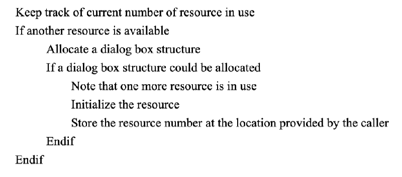
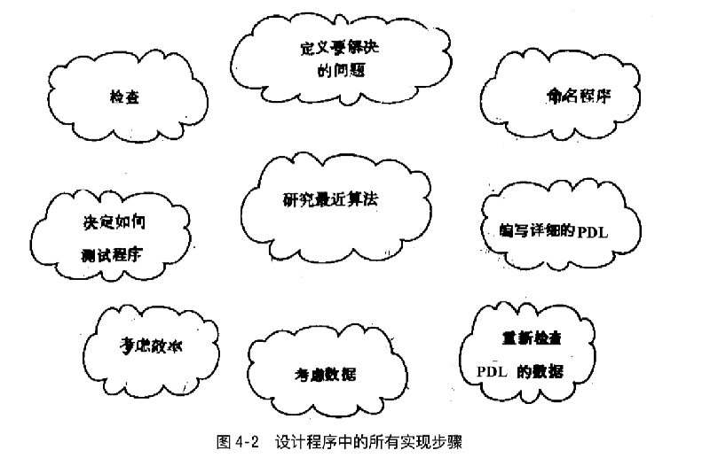
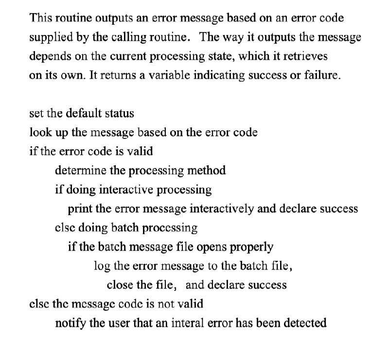
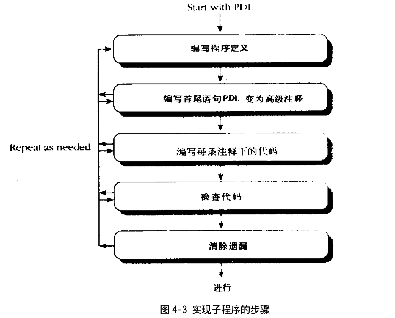
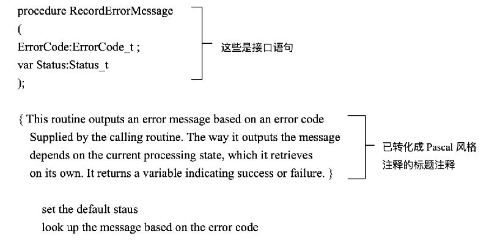
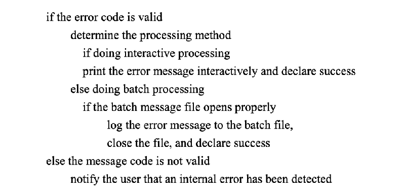
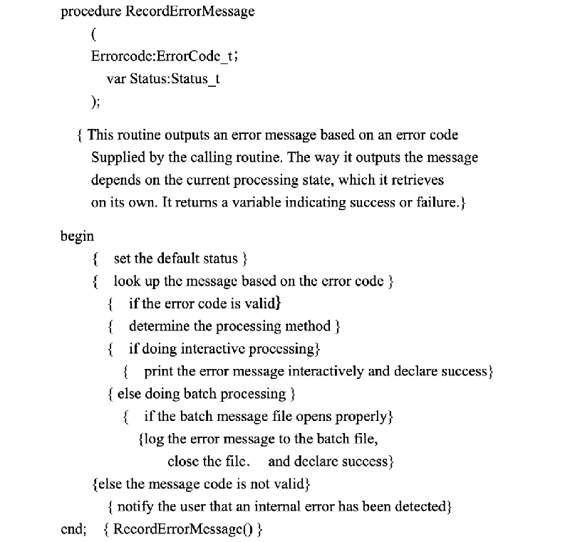
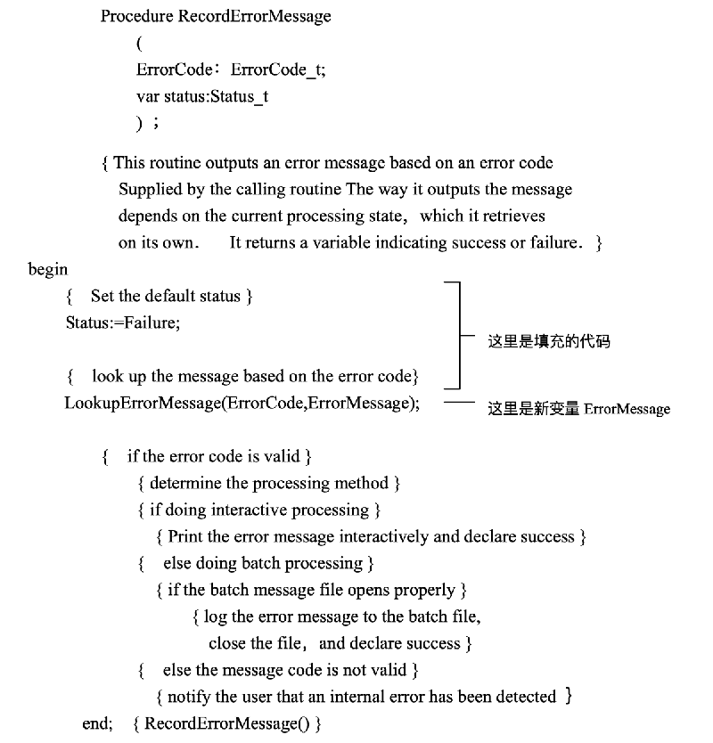
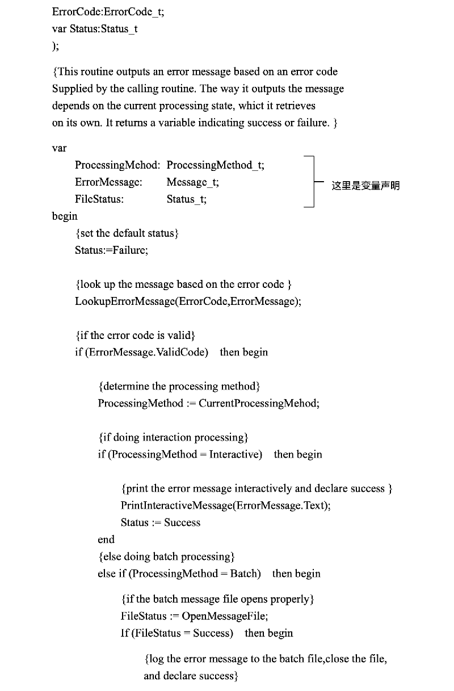
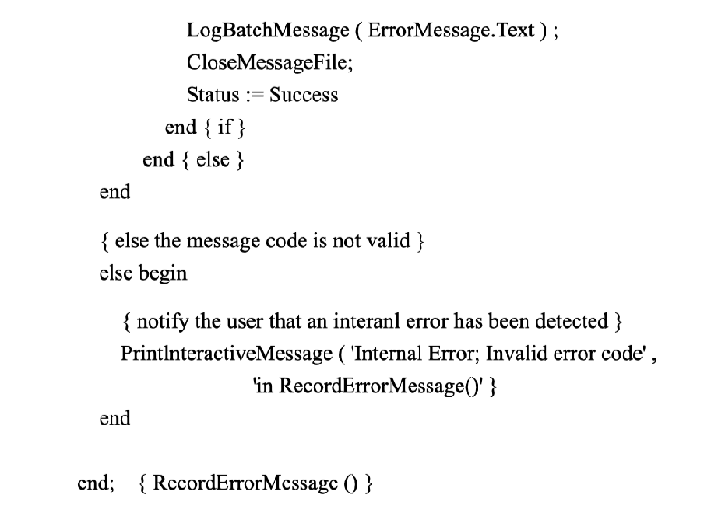

# 04 建立子程序的步骤

### 相关章节

高质量程序的特点：见第 5 章

高层次设计；见第 7 章

注释方式：见第 19 章

创建工作先决条件：见第 3 章

本章详细讲述了在建立一个子程序时的典型步骤。虽然从广义上讲，你可以把本书所有的描述都当作是在讲如何建立程序，但本章把这些步骤放在同一背景下讲述。本章的中心内容是如何编写小规模的程序，以及编写对各种规模项目都十分关键的程序的特定步骤。本章也描述了从程序设计语言（PDL）到编码的转换过程，几乎没有哪些程序员充分利用了这一过程所带来的方便，这部分论述会给大家以启迪。

## 4.1 建立程序步骤概述

在建立程序过程中引入的许多低层次细节问题，并不需要按某一特点顺序来进行，但是些主要活动一设计程序、检查程序、子程序编码、检査代码，则应该按图 4-1 的顺序来进行。

## 4.2 程序设计语言（PDL)

PDL（程序设计语言）是由 Game, Father 和 Gordon 共同开发的，在 1975 年发表之后。曾作过重大修改。因为 PDL 是在模仿英语，所以认为任何像是英语的 PDL，都可以正确表达思想是很自然的。但是，事实上 PDL 之间的好坏是有判别的。下面是有效使用 PDL 的一些方针：

用模拟英语的语句来精确描述每一个特定操作。

避免使用最终程序语言的语句。PDL 使你比在代码稍高级的层次上进行设计工作。当使用程序语言进行创建时，就又回到了低层次上，从而得不到由于在高层次上进行设计的好处，而且会受到不必要的程序语言语法规则的限制。

在设计意向这一层次上写 PDL。说明方法的意义，而不是描述如何用目标语言实现。

在足够低的层次上写出 PDL，它几乎可以自动生成代码。如果 PL 写得太简略，可能会在编码过程中忽略问题细节。应该精确地使用 PDL 以方便编码。

当 PL 写好之后，就可以根据它来编码，而 PL 则成为程序语言的注释。这可以省去大量的注释工作。如果 PL 遵循了这一指导方针，那么注释将是非常完备而且富有意义的。

以下则是一个几乎违背了上述所有原则的错误使用 PL 的例子

Increment resource number by I

allocate a dlg struct using malloc

if malloco returns NULL then return I

invoke Osrsrc init to initialize a resource for the operation system

hrstcptr=resource number

return 0

这个 PDL 的意图是什么？由于它写得很糟糕，因此很难说清楚。之所以称之为一个错误使用 PDL 的典型，是为它使用了像*枷 Rstcptr 这种特定的 c 语言指针标志和 malloc (（）这个特定的语言函数，即它采用了代码语句。这段 PDL 的中心是如何写代码，而不是说明设计意义。不管子程序返回 1 还是返回 0, 这段 PL 都引入了代码细节。如果从是否变为一个好的注释的观点来看这段 PDL，你就会发现它毫无意义。

以下是对同一个操作的设计，使用的是大大改进了的 PDL：

Reture TRUE if a new resource was created; else return FALSE

这段 PL 要好于前一个。因为它完全是用自然语言写成的，没有使用任何目标程序语言语句。在第一段 PL 中，它只能用 C 语言来实现，而第二段却并没有限制所使用的语言。同时，第二段 PL 也是在意图层次上写成的。第二段 PDL 的意图是什么？其意图理解起来比前一个要容易多了。

尽管第二段 PDL 是完全用自然语言写成的，但它却是非常详细和精确的，很容易作为用程序语言编码的基础。如果把这段 PL 转为注释段，那它则可以非常明了地解释代码的意图。

以下是你使用这种风格的 PDL 可以获得的益处

PDL 可以使评审工作变得更容易。不必检査源代码就可以评审详细设计。它可以使详细评审变得很容易，并且减少了评审代码本身的工作。

PDL 可以帮助实现逐步细化的思想。从结构设计工作开始，再把结构设计细化为 PDL，最后把 PL 细化为源代码。这种逐步细化的方法，可以在每次细化之前都检査设计，从而可以在每个层次上都可以发现当前层次的错误，从而避免影响下一层次的工作。PDL 使得变动工作变得很容易。几行 PL 改起来要比一整页代码容易得多。你是愿意在蓝图上改一条线还是在房屋中拆掉一堵墙？在软件开发中差异可能不是这样明显。但是，在产品最容易改动的阶段进行修改，这条原则是相同的。项目成功的关键就是在投资最少时找出错误，以降低改错成本。而在 PL 阶段的投资就比进行完编码、测试、调试的阶段要低得多，所以尽早发现错误是很明智的。

PDL 极大地减少了注释工作量。在典型的编码流程中，先写好代码，然后再加注释。而在 PDL 到代码的编码流程中，PDL 本身就是注释，而我们知道，从代码到注释的花费要比从注释到代码高得多。

PDL 比其它形式的设计文件容易维护。如果使用其它方式，设计与编码是分隔的，假如其中一个有变化，那么两者就毫不相关了。在从 PDL 到代码的流程中，PDL 语句则是代码的注释，只要直接维护注释，那么关于设计的 PDL 文件就是精确的。作为一种详细设计工具，PDL 是无可比拟的。程序员们往往愿意用 PDL 而不愿使用缺陷表。事实上程序员们愿意使用缺陷表以外的任何工具，调查表明，程序员们愿意使用 PDL，是因为它很容易用程序语言实现，而且 PDL 可以帮助发现详细设计中的缺陷，并且 PDL 也很容易写成文件，改动也很方便，PDL 并不是详细设计的唯一工具，但是 PDL 和 PDL 到代码流程的确是有用的工具。不妨试一下。在随后的几部分中，我们将告诉你如何使用它们。

## 4.3 设计子程序

创建一个子程序的第一步是设计。假设想设计一个根据错误代码输出错误信息的子程序，并且把这个子程序称为 Recorderrormessgeo，以下是关于 Recorderrormessage (0 的需求定义

Recorderrormessageo 的输入变量是非法代码，输出是与这个非法代码相对应的错误信息，它负责处理非法代码。如果程序运算方式是交互式，那么这个错误信息就打印给用户。如果运行方式是批处理式的，那么这个信息就送入一个信息文件。在输出信息后，这个子程序应该能返回到一种状态，指出程序是否成功。

在本章的其余部分，用这个子程序作为一个实际例子。这一部分的其余内容将论述如何设计这个子程序，设计这个子程序所需要进行的活动见图 4-2。

检查先決条件。在进行与子程序有关的任何工作之前，首先检查是否定义了这个子程序的工作任务，这项任务是否和整个结构设计融为一体？通过检查确定是否这个子程序被调用了？至少，在项目的需求定义中就涉及到它。

定义这个子程序将要解决的问题。应该足够详尽地规定它需要解決的问题，以便于创建。如果结构设计是非常详尽的，那么这项工作可能已经完成了，结构设计应该至少指出以下这些问题

这个子程序将要隐含的信息

这个子程序的输入。

这个子程序的输出，包括受到影响的全局变量。

这个子程序将如何处理错误？

下面是在 Record Errormessageo 这个子程序中，上述考虑是如何得以阐明的。这个子程序隐含了如下两个事实；错误信息与现存的处理方式（交互式或者批处理），子程序的输入是非法代码，要求两种输出方式：第一是错误信息；第二是 Recorderrormessasso 子程序返回到调用它的程序时的状态。

问题说明之后，并没有直接给出解決方案。假设以这个例子来说，程序约定是在发现错误时立即报告。在这种情况下，这个子程序必须报告它所发现的每一个错误，假定其它错误都已经报告过了。根据要求，这时子程序应把状态变量设置为失败。

给子程序命名。给子程序命名似乎是小事一桩，但好的子程序名字往往是一个高质量软件的标志之ー，而且，命名并不是件容易的事情。一般来说，子程序应该有一清楚的、不容易引起异义的名字。如果在给程序找一个好名字时感到困难，这往往意味着对程序的功能还不十分清楚。一个模棱两可的名字就像是一个在进行竞选论的政治家，似乎他在说着什么，可是当你仔细听时，又分辨不出他的话到底有什么意义、应尽量将名字起得清楚。如果产生一个模棱两可名字的原因是模棱两可的结构设计，那么就应注意这个危险信号，这时应返回去改进结构设计。

在这个例子中，Recorderrormessageo 的含义是很清楚的，因此是个好名字。

决定如何测试子程序。在编写子程序时，最好能同时考虑如何测试。这对进行单元测试工作是很有益处的。

在这个例子中，输入很简单，就是错误代码。因此，可以计划用全部有效错误代码和一系列无效代码来进行测试。

考虑效率。根据所处的情形，你可以用一种或两种方式来说明效率。

在第一种情形下，程序的绝大部分，性能并不是主要的，在这种情况下，应该把子程序作成高度模块化而且具有很强的可读性，以便在今后需要时很容易对其作出改进。如果其模块化程度很高，就可以在需要时，用更好的算法或者汇编语言编写的子程序来代替速度较慢的程序而不致影响程序其它部分。

在第二种情形下，在大部分程序中，性能都是很重要的，这时，结构设计应该对子程序的运行速度和允许使用的内存作出规定，只要按照速度和空间指标设计子程序就可以了。如果速度和空间只有一方面是主要的，则可以牺牲一方面来满足另一方面的要求。在初始创建阶段，对子程序作出足够调整以使它满足速度和空间要求是合理的。

除了以上指明的情況以外，不必浪费精力去考虑个别子程序的执行效率。优化的收益主要来自高层次设计，而不是个别子程序、只有在高层次设计某方面有缺陷时，才需要进行徽观优化，而这点只在程序全部完成时才会知道。除非必要，不要浪费时间进行增量改进。

研究算法和数据结构。同时提高编码质量和效率的最有效办法是重新使用好的代码。在学术文章中，已经有许多种算法被发明、讨论、检验和改进过。因此，与其花费时间去发明种别人已经为之写过博士学位论文的东西，倒不如花几分钟测览一个算法论著，看有多少种算法可供选择。如果想使用某种已有的算法，切记要对其做出改进以适应你的程序语言。

编写 PDL。在做完上述工作之后，编写的时间可能已经不多了。本步骤的主要目的是，建立一种可以在实际编写子程序时提供思想指导的文件。

在主要工作步骤完成之后，可以在高层次 PDL 水平上编写子程序。可以使用编辑程序或者整体环境来编写 PDL，很快，这些 PL 就将成为用程序语言编码的基础。

编写工作应该从抽象到具体。一个子程序最抽象的部分便是最开始的注释部分，这部分将说明要求子程序作什么；因此，首先应该写一个关于编写子程序目的的精确说明。编写这个说明也将帮你更清楚地理解这个子程序。如果在编写这部分说明时感到困难，那说明需要对这个子程序在整个软件中的地位和作用作出更深刻的理解。总之，如果感到编写抽象说明时有困难，应该想到可能是某一环节出了问题。以下是一个精确说明子程序作用的例子：

写完抽象说明后，再编写关于这个子程序的高层次 PDL。下面就是一个关于前述例子的高层次 PDL：

应该注意的是这个 PDL 是在一个相当高的层次上写成的。它使用的不是程序语言，而是用自然语言来精确表达设计思想的。

考虑数据。可以在编写过程中的几个不同地方设计数据。在这个例子中，数据非常简单，因而数据操作并不是程序的主要部分。如果数据操作是程序的主要部分，那么在考虑程序的逻辑结构之前，考虑主要数据是必要的。如果在进行子程序的逻辑设计时，已经有了关键数据结构的定义，那将是大有裨益的。

检查 PL。写好 PL 并设计完数据之后，应该花一点时间来检査一下 PDL。返回来看着所写的 PDL，考虑一下应该怎样向别人说明。

请别人帮助看一下或听一下你的说明。也许你认为请别人看一个只有 11 行的 PDL 是很愚蠢的，但你会对这样作的结果感到惊奇。PDL 使假设和高层次错误比程序语言代码容易被发现。人们往往更愿意检査一个只有几行的 PDL，而不愿去检查一个有 35 行的 C 或 Pascal 子程序

要确认对子程序做什么和将怎样做已经有了清楚透彻的了解。如果在 PL 这一层次上对这点还没有概念上的了解，那么在编码阶段了解它的机会还有多少呢？如果连你都理解不了它的话，又有谁会理解呢？

逐步细化。在开始编码之前，要尽可能多使用 PL 尝试一些想法。一旦开始编码，就会对所写的代码产生爱惜之情，这时，要再想把它扔掉重新开始是非常困难的。

通常的思想是逐步细化用 PL 写成的子程序，直到可以在每行 PDL 语句下面添加一行代码而成为子程序为止，并把原来的 PL 当作注释文件，或许最初的 PDL 的某些部分过于简略，需要进一步说明，那么切记一定要对其作出进一步说明。如果不能确认如何对某一部分编码，么就继续细化 PDL，直到可以确认为止。要不断地细化 PL 并对其作出进一步说明，直到你看到这样作是在浪费时间时，再开始实际的编码工作。

## 4.4 子程序编码

设计好子程序之后，就要开始实现。可以按照标准步骤实现，也可以根据需要作出改动。图 4-3 给出了实现一个子程序时的步骤。

书写子程序说明。编写子程序的接口语句编写过程或函数说明，应采用所需要的语言，无论 Pascal、C 或 Fortran 都可以，只要符合需要。把原来的抽象说明用程序语言实现，把它放在原来写好的 PL 位置之上。以下是前述子程序的接口语句和抽象说明，它是用 Pascal 写成的：

这时是指出接口假设的好时机。在本例中，接口变量 Error Code 和 Status 是简明的，并且根据其特定用途排序，不含任何隐蔽信息。

把 PDL 转变成高层次注释。利用 Pascal I 中的 Begin 和 End，或者 C 中的“{”和“}”，可以把 PDL 变成注释，以下是把前述的 PDL 変成了 Pascal 语言：

这时，子程序的特点已经非常明显了，设计工作已经结束了，没看见任何代码，但已经知道子程序如何工作了。把 PDL 转換成程序语言代码是一件机械、自然、容易的工作。如果你不觉得是这样，那么还需要进一步细化 PDL，直到有这种感觉为止。

在每一行注释下面填上代码。在每一行 PDL 注释语句下面填上代码。这有点像给报纸排版。首先画好轮廓线，然后再把每一篇文章填到空格中，每一个 PDL 注释行都相当于给代码画的轮廓线，而代码相当于文章。同文学文章的长度一样，代码的长度也是由它所要表达的内容多少决定的。程序的质量则取決于它的设计思想的側重点和巧妙程度。

在本例中，前两行 PDL 注释产生了两行代码：

这是一个编码的开始，使用了变量 Errormessage，所以需要说明它。如果是在事后进行注释，那么，用两个注释行来注释两行代码就不必要了。但是，采用目前这种方法，是注释的字面内容而不是它注释了多少行代码。现在，注释行已经存在了，所以还是将其保留。

代码需要变量说明，而且在每一注释行下面都要加入代码，以下是完整的子程序

procedure Recorderrormessage

每一个注释都产生了一行或一行以上的代码，每一块都在注释的基础上形成了一个完整的思想。保留了注释以便提供一个关于代码的高层次解释，在子程序的开始，对使用的所有变量都作了说明。

现在，让我们再回过头来看一下前面的关于这个例子的需求定义和最初的 PDL，从最初的 5 行需求定义到 12 行的初始 PDL，接着这段 PDL 又扩大成为一个较大的子程序。即使需求定义是很详尽的。子程序的创建还是需要在 PDL 和编码阶段进行潜在的设计工作。这种低层次的设计工作正是为什么编码不是一件琐碎事的原因，同时，也说明本书的内容是很重要的。

非正式地检查代码。在注释下面填上代码之后，可以对每一块代码作一简略检査。尽力想下什么因素可能破坏目前的块，然后证明这种情况不会发生。

-旦完成了对某一子程序的实现，停下来检査一下是否有误。在 P 肌 L 阶段，就已经对其作了检查。但是，在某些情况下，某些重大问题在子程序实现之前是不会出现的。

使得问题直到编码阶段才出现的原因是多方面的。在 PDL 阶段引入错误可能到了详尽的实现阶段才会变得明显。一个在 PDL 阶段看起来完美无缺的设计，在用程序语言实现时可能会变得一塌糊涂。在详尽的实现阶段，可能会发现在结构设计或功能分析阶段引入的错误，最后，代码可能存在一种司空见惯的错误一一混用语言，毕竟大家都不是尽善尽美的嘛。由于上述原因，在继续工作之前，要检查一下代码。

进行收尾工作。检查完代码是否存在问题后，再检查一下它是否满足本书所提到的通用质量标准。可以采取几个步骤来确认子程序的质量是否满足要求。

检查子程序的接口。确认所有的输入和输出数据都已作出了解释，并且使用了所有参数。关于细节问题，见 5.7 节“怎样使用子程序参数”。

检查通用设计质量。确认子程序只完成一项任务而且完成得很好，与其它子程序交又是控制不严的表现。并且，应该采用了预防错误的设计。关于细节问题，见第五章“高质量程序的特点”。

检査子程序的数据。査找出不精确的变量名、没有使用的数据、没有说明的数据等等。要了解详情，见关于数据使用的第八到第十二章。

检查子程序的控制结构。査找无限循环、不适当的嵌套等错误。详见关于使用控制结构的第 13 到 17 章。

检査子程序设计。确认已说明了子程序的表达式、参数表和逻辑结构。详见第 18 章“设计与风格”。

检查子程序的文档。确认被翻译成注释的 PDL 仍然是精确的。检査算法描述，查找接口假设和非显式依赖的文件资料，查找不清楚的编码等等。详见第 19 章“自我证明的代码”。

按需要重复步骤。如果程序的质量很差，请返回 PDL 阶段。高质量程序是一个逐步的过程。所以在重新进行设计和实现活动时，不要犹豫不決

## 4.5 检查子程序

在设计并实现了子程序之后，创建活动的第三个主要步骤是进行检查，以确认所实现的软件是正确的。你或许会问，对代码进行的非正式检查和收尾工作难道不足以保证其正确性吗？的确，这两项工作会从某种程度上保证代码正确性，但不能完全保证，在这一阶段工作中漏掉的错误，只有在后面的测试工作中才会被发现。而到那时纠正它们的成本将变得很高，因此，最好现在就进行查错工作。

在心里对子程序进行查错处理。在前面提到过的非正式检査和清扫工作就是两种內心检查方法。另一方法是在心中执行每一个路径。在心中执行一个子程序是比较困难的，这个困难也是造成很困难保持子程序小规模的原因之一。要保证检查到每一个规定路径和中止点，同时还要检查所有的例外情况。可以自己进行这项工作，此时叫作“桌面检查”。也可以与同事们一道检查，这叫作“同事评审”“过一遍”或者“视察”，这要取決于如何进行这项工作。

业余爱好者与职业程序员之间的最大区别就是迷信还是理解。在这里，“迷信”这个词指并不是指在月圆之夜产生各种错误或使你毛骨悚然的一段程序。它指的是你对代码的感觉代替对代码的理解。如果你总是认为编译程序或者硬件系统有故障，那说明你还处在迷信阶段。只有 5% 的错误是由编译程序、硬件或者是操作系统引起的（Brown and sampson,1973, Ostrand and Weyuher,1984)。进入理解境界的程序员总是怀疑自己的工作，因为他们知道 95%的错误出自这里。要理解每一行编码的意义，并且要明白为什么需要它。没有仅仅因为有效便是正确的东西。如果你不知道为什么它是有效的，那么往往它是无效的，只不过你没有发现罢了。

最后，要指出的是有了一个有效的子程序并非就完事大吉了。如果你不知道为什么它是有效的，那就研究并讨论它，或者用替代方案重新实现一次，直到你弄明白为止。

编译子程序。如果检查完了子程序，那就开始编译它。直到现在才开始编译工作，似乎是我们的工作效率太低了，因为早在几页之前程序就完成了。的确，如果早一些开始编译，让计算机去检查没有声明的变量，命名沖突等是可能会节约一些时间。

旦是，如果晚一些开始编译，将会获得许多收益。其中的一个主要原因是，一旦开始编译，那么你脑袋里的秒表便开始嘀嗒作响了，在第一次编译之后，你就开始不停地想：下次编译定让它全对。结果，在这种“就只再编译一次”的压力下，作了许多匆忙的、更易产生错误的修改，反而浪费了更多的时间。所以，在确信子程序是正确的之前，不要急于开始编译。

本书的重点之一，就是想告诉读者如何避免陷入把各种代码拼凑到一起，通过试运行检验它是否有效的怪圈。而在确信程序是正确的之前，就匆忙开始编译，恰恰是陷入了这种怪圈。如果你还没有进入这个怪圏，那最好还是当确信程序正确之后再开始编译。

以下是在编译时，尽可能地检查出全部错误的指导方针：

尽可能把编译程序的警告级别调到最高。只要允许，编译程序应尽量测试，将发现许多难以察觉的错误。

消除所有编译程序指出的错误和提出警告的原因。注意编译程序关于你的代码说了些什么。大量的警告往往意味着代码质量不高，所以应该尽量理解所得到的每个警告。在实际中，反复出现的警告可能产生以下影响：你忽略掉它们，而事实上它们掩盖了更严重的错误。或者它们会变得使人痛苦，就像日本式的灌水酷刑。因此，比较安全或痛苦较小的办法，是消灭这些隐蔽的问题以消除警告。

使用计算机来检査子程序错误。子程序编译之后，将其放入调试程序，逐步运行每一行代码，要保证每一行都是按预期的运行。用这种简单的办法，你可以发现许多错误。

在调试程序中逐步运行程序之后，用在开发子程序时设计的测试用例对其进行测试。或许你将不得不搭些支架来支撑你的子程序一即那些仅在测试阶段用于支持子程序而最终不包括在产品中的代码。这些代码可能是调用子程序的程序，也可能是被子程序所调用的子程序。

消除子程序中的错误。一旦发现有错误，就要消除它。如果开发的子程序此时问题较多，那它将在这一阶段耗费较长的时间。如果发现程序中的错误异乎寻常的多，那就重新开发一个，不要试图修补它。修补往往意味着不充分的理解，而且肯定会在现在和将来产生更多的错误，而进行一个全新的设计将防止这一点。恐怕没有比重新写ー个完美无缺的子程序来代替一个漏洞百出的子程序更能让人满意的事了。

4.5.1 检查表

创建子程序

是否检査过先決条件已经满足了？定义子程序将要解決的问题了吗？

结构设计是否足够清楚，使得你可以给子程序起个好名字？考虑过如何测试子程序了吗？

是否从模块化水平或者满足时间和内存需求角度考虑过效率问题？是否査阅过参考书；以寻找有帮助的算法？是否用详尽的 PDL 设计子程序？

在必要时，是否在逻辑设计步骤前考虑了数据？

是否检查过 PDL，它很容易理解吗？

是否注意到了足以使你返回到结构设计阶段的警告（使用了全局数据，更适合其它子程序的操作，等等）。

是否使用了 PDL 到代码流程，是否把 PL 作为编码基础并把原有的 PDL 转为注释？是否精确地把 PDL 翻译成了代码？在作出假设时，验证它们了吗？

是从几个设计方案中选择了最好的，还是随意选择了一个方案？

是否彻底理解你的代码？它容易理解吗？

## 4.6 小结

要想写好 PDL，首先要用易懂的自然语言，避免拘泥于某种程序语言，其次要在意向

层次上写 PDL，描述设计作什么而不是如何作。

PDL 到代码流程方法是详细设计的有力工具，而且使得编码非常容易。可以把 PDL 直接翻译成注释，但要注意保证注释是精确而有用的。

应该在工作的每一步中都检查子程序，并鼓励同事们检查。这样，可以在投入的资金和工作努力最少时便发现错误，从而极大降低改错成本。

