# 05 高质量子程序特点

### 相关章节

生成子程序的步骤：见第 4 章

高质量模块的特点：见第 6 章

通用设计技术：见 7.5 节

软件结构设计：见 3.4 节

第四章讲述了生成子程序时应该采取的步骤，其重点是创建过程。本章的重点则是子程序本身，即区分好的子程序和低劣子程序的特征。

如果在进入现实而又困难的子程序细节问题之前，想阅读关于高层次设计的问题，那么请首先阅读第七章，然后再阅读本章。由于模块也要比子程序抽象，因此，也可在读完第六章后再阋读本章。

在讨论高质量子程序的细节问题之前，我们首先来考虑两个基本名词。什么子程序”？子程序是具有单一功能的可调用的函数或过程。比如 C 中的函数，Pascal 或 Ada 中的函数或过程，Basic 中的子程序或 Fortran 中的子程序。有时，C 中的宏指令或者 Basic I 中用 GOSUB 调用的代码块也可认为是子程序。在生成上述函数或过程中，都可以使用创建高质量子程序所使用的技术。什么是“高质量的子程序”？这是一个比较难以回答的问题。反过来最简单回答方式是指出高质量子程序不是什么。下面是一个典型的劣质子程序（用 Pascal 写成）：

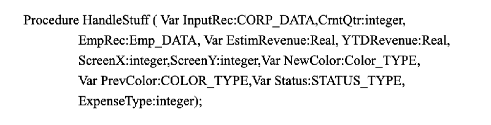

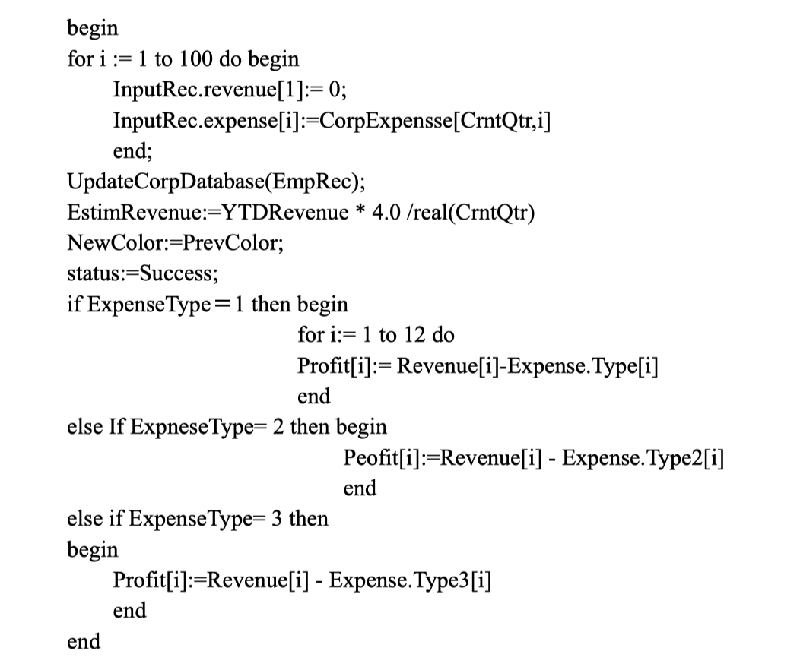

这个子程序有什么问题？给你一个提示：你应该至少从中发现 10 个问题。当你列出所发现的问题后，再看一下下面所列出的问题；

程序的名字让人困惑。Handlestuff（）能告诉我们程序是干什么的吗？

程序没有被说明（关于说明的问题已经超出了个别子程序的范围，详见第 19 章自我说明的子程序”）。

子程序的布局不好。代码的物理组织形式几乎没有给出其逻辑组织形式的任何信息。布局的使用过于随心所欲，程序每一部分的布局都是不一样的。关于这一点。只要比较一下 Expensetype-2 和 Expenselype=3 两个地方的风格就清楚了（关于布局问题，详见第十八章“布局与风格”）。

子程序的输入变量值 Inputrec 被改变过。如果它作为输入变量，那它的值就不该变化。如果要变化它的值，就不该称之为输入变量 Inputrec

子程序进行了全局变量的读写操作。它从 Corpexpense 中读入变量并写给 Profit。它应该与存取子程序通信，而不应直接读写全局变量。

这个子程序的功用不是单一的。它初始化了某些变量。对一个数据库进行写操作，又进行了某些计算工作，而它们又看不出任何联系。一个子程序的功用应该是单一，明了的。

子程序中没有采取预防非法数据的措施。如果 Crntqtr的值为0”, 那么，表达式 YTDREVENUE*4.0/real(Crntqtr）就会岀现被零除的错误。

程序中使用了几个常数：100,4.0,12,2 和 3。关于“神秘”（magic）数的问题见 11.1 节“常数”

在程序中仅使用了域的 CORP DATA 型参数的两个域。如果仅仅使用两个域，那就该仅仅传入特定的域而不是整个结构化变量。

子程序中的一些参数没有使用过。Screen 和 Screeny 在程序中没有涉及。

程序中的一个参数被错误标定了。Prevcolor 被标定为变量型参数，然而在程序中又没有对其赋值。

程序中的参数太多。程序中参数个数的合理上限应该是七个左右。而这个程序中则多达 11 个。程序中的参数多得怕人，恐怕没谁会仔细检查它们，甚至连数一下都不愿意。除了计算机本身之外，子程序可以说是计算机科学最重大的发明。子程序使得程序非常好读而且也非常容易理解，编程语言中的任何特性都不能和这一点相比。像上例中那样使用子程序，简直就是对子程序的践踏，甚至可以说是一种犯罪。

子程序也是节省空间和提高性能的最好手段。想象一下，如果用代码段去代替程序中对子程序的每一次调用，那么程序将会有多么庞大。如果不是把多次重复使用的代码段存放在子程序中，而是直接把它放在程序中，那么对其进行性能改进将是一件很困难的事。是子程序使现代编程成为可能。

现在，你可能有些不耐烦。“是好，子程序的确很了不起，我一直都在使用它”。你说，“你的讨论似乎像是在纠正什么，你到底想让我做什么呢？”

我想说的是：有许多合理的原因使得我们去生成子程序。但是生成方法有好有坏。作为个计算机专业的本科生，可以认为生成子程序的主要原因是避免代码段的重复。我所用的入门课本告诉我说，之所以使用子程序，是因为它可以避免代码段的重复，从而使得一个程序的开发、调试、注释和维护工作都变得非常容易。除了一些关于如何使用参数和局部变量的语法细节之外，这就是那本课本关于子程序理论与实践内容的全部。这实在不是一个完全而合理的解释。下面这节将详细描述为什么和怎样生成子程序。

5.1 生成子程序的原因

以下是关于为什么要生成子程序的一些合理原因，其中有些原因之间可能有互相重叠的地方

降低复杂性。使用子程序的最首要原因是为了降低程序的复杂性，可以使用子程序来隐含信息，从而使你不必再考虑这些信息。当然，在编写子程序时，你还需要考虑这些信息。但是，旦写好子程序，就可能不必再考虑它的内部工作细节，只要调用它就可以了。创建子程序的另外一个原因是尽量减小代码段的篇幅，改进可维护性和正确性。这也是一个不错的解释，但若没有子程序的抽象功能，将不可能对复杂程序进行明智的管理。

个子程序需要从另一个子程序中脱离出来的原因之一是，过多重数的内部循环和条件判断。这时，可以把这部分循环和判断从子程序中脱离出来，使其成为一个独立的子程序，以降低原有子程序的复杂性。

避免代码段重复。无可置疑，生成子程序最普遍的原因是为了避免代码段重复。事实上，如果在两个不同子程序中的代码很相似，这往往意味着分解工作有误。这时，应该把两个子程序中重复的代码都取出来，把公共代码放入一个新的通用子程序中，然后再让这两个子程序调用新的通用子程序。通过使公共代码只出现一次，可以节约许多空间。这时改动也很方便，因为只要在一个地方改动代码就可以了。这时代码也更可靠了，因为只需在一个地方检查代码。而且，这也使得改动更加可靠，因为，不必进行不断地、非常类似地改动，而这种改动往往又是认为自己编写了相同的代码这一错误假设下进行的。

限制了改动帯来的影响。由于在独立区域进行改动，因此，由此带来的影响也只限于一个或最多几个区域中。要把最可能改动的区域设计成最容易改动的区域。最可能被改动的区域包括：硬件依赖部分、输入输出部分、复杂的数据结构和商务规则。

隐含顺序。把处理事件的非特定顺序隐含起来是一个很好的想法。比如，如果程序通常先从用户那里读取数据，然后再从一个文件中读取辅助数据，那么，无论是读取用户数据的子程序，还是读取文件中数据的子程序，都不应该对另一个子程序是否读取数据有所依赖。如果禾用两行代码来读取堆栈顶的数据，并減少ー个 Stacktop 変量，应把它们放入一个 Popstacko 子程序中，在设计系统时，使哪一个都可以首先执行，然后编写一个子程序，隐含哪一个首先执行的信息。

改进性能。通过使用子程序，可以只在一个地方，而不是同时几个地方优化代码段。把相同代码段放在子程序中，可以通过优化这一个子程序而使得其余调用这个子程序的子程序全部受益。把代码段放入子程序也使得用更快的算法或执行更快的语言（如汇编）来改进这段代码的工作变得容易些。

进行集中控制。在一个地方对所有任务进行控制是一个很好的想法。控制可能有许多形式。知道一个表格中的入口数目便是其中一种形式，对硬件系统的控制，如对磁盘、磁带、打印机、绘图机的控制则是其中另外一种形式。使用子程序从一个文件中进行读操作，而使用另一个子程序对文件进行写操作便是一种形式的集中控制。当需要把这个文件转化成一个驻留内存的数据结构时，这一点是非常有用的，因为这一变动仅改变了存取子程序。专门化的子程序去读取和改变内部数据内容，也是一种集中的控制形式。集中控制的思想与信息隐含是类似的，但是它有独特的启发能力，因此，值得把它放进你的工具箱中。

隐含数据结构。可以把数据结构的实现细节隐含起来，这样，绝大部分程序都不必担心这种杂乱的计算机科学结构，而可以从问题域中数据是如何使用的角度来处理数据。隐含实现细节的子程序可以提供相当高的抽象价值，从而降低程序的复杂程度。这些子程序把数据结构、操作集中在一个地方，降低了在处理数据结构时出错的可能性。同时，它们也使得在不改变绝大多数程序的条件下，改变数据结构成为可能。

隐含全局变量。如果需要使用全局变量，也可以像前述那样把它隐含起来、通过存取子程序来使用全局变量有如下优点：不必改变程序就改变数据结构；监视对数据的访问；使用存取子程序的约束还可以鼓励你考虑一下这个数据是不是全局的；很可能会把它处理成针对在一个模块中某几个子程序的局部数据，或处理成某一个抽象数据的一部分。

隐含指针操作。指针操作可读性很差，而且很容易引发错误。通过把它们独立在子程序中，可以把注意力集中到操作意图而不是机械的指针操作本身。而且，如果操作只在一处进行，也更容易确保代码是正确的。如果找到了比指针更好的数据结构，可以不影响本应使用指针的子程序就对程序作改动。

重新使用代码段。放进模块化子程序中的代码段重新使用，要比在一个大型号程序中的代码段重新使用起来容易得多。

计划开发一个程序族。如果想改进一个程序，最好把将要改动的那部分放进子程序中，将其独立。这样，就可以改动这个子程序而不致影响程序的其余部分，或者干脆用一个全新的子程序代替它。几年前，我曾经负责一个替保险推销员编写系列软件的小组，我们不得不根据每个推销员的保险率、报价单格式等等来完成一个特定的程序。但这些程序的绝大部分又都是相同的：输入潜在客户的子程序，客户数据库中存储的信息、査看、计算价格等等。这个小组对程序进行了模块化，这样，随推销员而变化的部分都放在自己的模块中。最初的程序可能要用三个月的时间来开发，但是，在此之后，每来一个推销员，我们只改写其中屈指可数的几模块就可以了。两三天就可能写完一个要求的程序，这简直是一种享受

提高部分代码的可读性。把一段代码放入一个精心命名的子程序，是说明其功能的最好办法。这样就不必阅读这样一段语句：

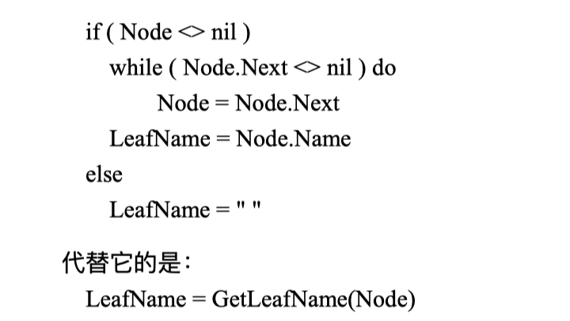

这个程序是如此简短，它所需要的注释仅仅是一个恰当的名字而已。用一个函数调用来代替一个有六行的代码段，使得含有这段代码的子程序复杂性大为降低，并且其功能也自动得到了注释。

提高可移植性。可以使用子程序来把不可移植部分、明确性分析和将来的移植性工作分隔开来，不可移植的部分包括：非标准语言特性、硬件的依赖性和操作系统的依赖性等。

分隔复杂操作。复杂操作包括：繁杂的算法、通信协议、棘手的布尔测试、对复杂数据的操作等等。这些操作都很容易引发错误。如果真的有错误，那么如果这个错误是在某个子程序中，而不是隐藏在整个程序中的话，査找起来要容易得多。这个错误不会影响到其它子程序，因为为了修正错误只要改动一个子程序就可以了。如果发现了一个更为简单迅速的算法，那么用它来代替一个被独立在子程序中的算法是非常容易的。在开发阶段，尝试几种方案并选择其中一个最好的是非常容易的。

独立非标准语言函数的使用。绝大多数实现语言都含有一些非标准的但却方便的扩展。使用这种扩展的影响是两面性的，因为在另外一个环境下它可能无法使用。这个运行环境的差异可能是由于硬件不同、语言的生产商不同、或者虽然生产商相同、但版本不同而产生的。如果使用了某种扩展，可以建立一个作为进入这种扩展大门的子程序。然后，在需要时，可以用订做的扩展来代替这一非标准扩展。

简化复杂的布尔测试。很少有必要为理解程序流程而去理解复杂的布尔测试。把这种测试放入函数中可以提高代码的可读性，因为：

 (1) 测试的细节已经被隐含了。

 (2) 清楚的函数名称已经概括了测试目的。

赋予这种测试一个函数，该函数强调了它的意义，而且这也鼓励了在函数內部增强其可读

性的努力。结果是主程序流和测试本身都显得更加清楚了。

是出于模块化的考虑吗？绝不是。有了这么些代码放入子程序的理由，这个理由是不必要的。事实上，有些工作更适合放在一个大的子程序中完成（关于程序最佳长度的讨论见 5.5 节子程序长度”）。

5.1.1 简单而没有写入子程序的操作

编写子程序的最大心理障碍是不情愿为了一个简单的目的而去编写一个简单的子程序。写只有两或三行代码的子程序看起来是完全没有必要的。但经验表明，小的子程序也同样是很有帮助的。

小型子程序有许多优点，其中之一是改进了可读性。我曾在程序中采用过如下这样一个仅有一行的代码段，它在程序中出现了十几次：

Points =Device Units* (POINTS PER INCH/Deviceunitsperinch O)

这决不是你所读过的最复杂的一行代码。很多人都明白它是用来转换的。他们也会明白程序中的每行这个代码都在作同一件事，但是，它还可以变得更清楚些，所以，我创建了一个恰当命名的子程序来作这些工作。

在用这段子程序来代替那些十几次重复出现的代码行后，这些代码行基本上都成了如下的样子

Points= Deviceunits Topoints (Deviceunits)

这显然更具可读性，甚至已经达到了自我说明的地步。

这个例子还暗示了把简单操作放入函数的另外一个原因：简单操作往往倾向于变成复杂操作。在写这个子程序时我还不知道这一点，但在某种情况下，当某个设备打开时，Deviceunitperlncho 会返回零，这意味着我不得不考虑到被“0”除的情况，这样，又需要另外的三行代码；

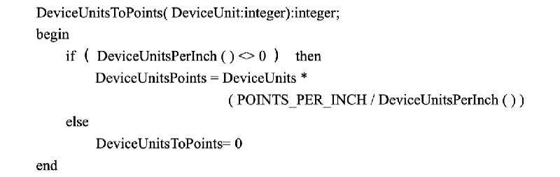

如果原来的代码行仍然在程序中出现十几次，那么这一测试也要重复十几次，需要新増加 36 行代码。而一个简单子程序轻而易举地便把 36 变成了 3。

5.1.2 创建子程序的理由总结

以下是创建子程序理由概述：

降低复杂性

避免重复代码段

限制改动带来的影响隐含顺序改进性能进行集中控制隐含数据结构隐含指针操作隐含全局变量促进重新使用代码段计划开发一个软件族改善某一代码段可读性改善可移植性分隔复杂操作

独立非标准语言函数的使用简化复杂的布尔测试

5.2 子程序名称恰当

一个恰当的子程序名称应该清晰地描述出子程序所作的每一件事。以下是给子程序有效命名的指导方针

对于过程的名字，可以用一个较强的动词带目标的形式。一个带有函数的过程往往是对某目标进行操作。名字应该反映出这个过程是干什么的，而对某一目标进行操作则意味着我们应该使用动宾词组。比如，Printreport), Checkotderlnfo（）等，都是关于过程的比较恰当的名字

在面向对象的语言中，不必加上对象名，因为对象本身在被调用时就已经出现了。这时可求助于诸如 Report. Printo, Orderinfo. Check (0 和 Monthly Revenue. Cafe 等名字。而像 Report. Printreport 这类名字则是冗余的。

对于函数名字，可以使用返回值的描述。一个函数返回到一个值，函数应该用它所返回的值命名，例如 CosO, Printerreadyo, Currentpencoloro 等等都是不错的函数名字，因为它精确地描述了函数将返回什么。

避免无意义或者模棱两可的动词。有些动词很灵活，可以有任何意义，比如 Handle Calculation (, Processlnput（）等子程序名词并没有告诉你它是作什么的。这些名字至多告诉你，它们正在进行一些与计算或输入等有关的处理。当然，有特定技术情形下使用 handle”等词是个例外。

有时，子程序的唯一问题就是它的名字太模糊了，而子程序本身的设计可能是很好的。如果用 Format Andprintoutput0 来代替 Handleoutput0, 这是一个很不错的名字。

在有些情况下，所用的动词意义模糊是由于子程序本身要做的工作太模糊。子程序存在着功能不清的缺陷，其名字模糊只不过是个标志而已。如果是这种情况，最好的解决办法是重新构造这个子程序，弄清它们的功能，从而使它们有一个清楚的、精确描述其功能的名字。

描述子程序所做的一切。在子程序名字中，应描述所有输出结果及其附加结果。如果一个子程序用于计算报告总数，并设置一个全局变量来表示所有的数据都已准备好了，正等待打印，那么，Computereport Total（）就不是一个充分的名字了。而 Compute Report

Total Andsetprintingready Var（）又是一个太长而且太愚蠢的命名。如果子程序带有附加结果，那必然会产生许多又长又臭的名字。解決的办法不应该是使用描述不足名字，而是采用直接实现每件事的原则来编程，从而避免程序带有附加结果。

名字的长度要符合需要。研究表明，変量名称的最佳长度是 9 到 15 个字母，子程序往往比变量要复杂，因而其名字也要长些。南安普敦大学的 Michaelrees 认为恰当的长度是 20 到 35 个字母。但是，一般来说 15 到 20 个字母可能更现实一些，不过有些名称可能有时要比它长

建立用于通用操作的约定。在某些系统中，区分各种不同的操作是非常重要的。而命名约 定可能是区分这些操作最简单也是最可靠的方法。比如，在开发 0 S/2 显示管理程序时，如果子程序是关于直接输入的，就在其名称前面加一个 Get”前缀，如果是非直接输入的则加 Quer 前缀，这样，返回当前输入字符的 Getinput Char（）将清除输入缓冲区。而同样是返回当前输入字符的 Queryln Putchar（）则不清除缓冲区

5.3 强内聚性

内聚性指的是在一个子程序中，各种操作之间互相联系的紧密程度。有些程序员喜欢用强度”一词来代替内聚性，在一个子程序中各种操作之间的联系程度有多强？一个诸如 SinO 之类的函数内聚性是很强的，因为整个子程序所从事的工作都是围绕一个函数的。而像 Sinand Tand 的内聚程度就要低得多了，因为子程序中所进行的是一项以上的工作。强调强相关性的目的是，每一个子程序只需作好一项工作，而不必过分考虑其它任务。

这样作的好处是可以提高可靠性。通过对 450 个 Fortran 子程序的调查表明，50%的强內聚性子程序是没有错误的，而只有 18%的弱内聚性子程序才是无错的（Card, Carch 和 Agresti19860。另一项对另外 450 个子程序的调查则表明，弱內聚性子程序的出错机会要比强内聚性出错机会高 6 倍，而修正成本则要高 19 倍（Selby 和 Basili1991)。

关于内聚性的讨论一般是指几个层次。理解概念要比单纯记住名词重要得多。可以利用这些概念来生成内聚性尽可能强的子程序。

5.3.1 可取的内聚性

内聚性的想法是由 Wayne Stevens, Glenford Myers 和 Larry Constantine 等人在 1974 年发表

的一篇论文中提出来的，从那以后，这个想法的某些部分又逐渐得到了完善。以下是一些通常

认为是可以接受的一些內聚类型

功能内聚性。功能內聚性是最强也是最好的一种内聚，当程序执行一项并且仅仅是一项工作时，就是这种内聚性，这种内聚性的例子有：sinO, Getcustomername@, Erasefileo，

Caldoanpaymento 和 Geticonlocation0 等等。当然，这个评价只有在子程序的名称与其实际内容相符时才成立。如果它们同时还作其它工作，那么它们的内聚性就要低得多而且命名也不恰当。

顺序内聚性。顺序内聚性是指在子程序内包含需要按特定顺序进行的、逐步分享数据而又

不形成一个完整功能的操作，假设一个子程序包括五个操作：打开文件、读文件、进行两个计算、输出结果、关闭文件。如果这些操作是由两个子程序完成的，Dostepi10 打开文件、读文件和计算操作，而 Dostep2 (O 则进行输出结果和关闭文件操作。这两个子程序都具有顺序内聚性。因为用这种方式把操作分隔开来，并没有产生出独立的功能。

但是，如果用一个叫作 Getfile Data）的子程序进行打开文件和读文件的操作，那么这个子程序将具有功能内聚性。当操作来完成一项功能时，它们就可以形成一个具有功能內聚性的子程序。实际上，如果能用一个很典型的动宾词组来命名一个子程序，那么它往往是功能内聚性，而不是顺序内聚性。给一个顺序内聚性的子程序命名是非常困难的，于是便产生了像 Dostep1 o 这种模棱两可的名字。这往往意味着你需要重新组织和设计子程序，以使它是功能内聚性的。

通讯内聚性。通讯内聚性是在一个子程序中，两个操作只是使用相同数据，而不存在其它任何联系时产生的。比如，在 Getnameandchangephone Number（这个子程序中，如果 Name 和 Phonenumber 是放在同一个用户记录中的，那么这个子程序就是通讯内聚性。这个子程序从事的是两项而不是一项工作，因此，它不具备功能内聚性。Name 和 Phonenamber 都存储在用户记录中，不必按照某一特定顺序来读取它们，所以，它也不具备顺序内聚性。

这个意义上的內聚性还是可以接受的。在实际中，一个系统可能需要在读取一个名字的同时变更电话号码。一个含有这类子程序的系统可能有些显得别扭，但仍然很清楚且维护性也不算差，当然从美学角度来说，它与那些只作一项工作的子程序还有一定差距。

临时内聚性。因为同时执行的原因才被放入同一个子程序里，这时产生临时内聚性。典型的例子有；Startup, Completenewemployeeo, Shutdown 等等，有些程序员认为临时内聚性是不可接受的，因为它们有时与拙劣的编程联系在一切，比如，在像 Startup 这类子程序中往往含有东拼西湊的杂烩般的代码。

要避免这个问题，可以把临时内聚性子程序设计成一系列工作的组织者。前述的 Startup 0 子程序进行的操作可能包括：读取一个配置文件、初始化一个临时文件、建立内存管理、显示初始化屏幕。要想使它最有效地完成这些任务，可以让这个子程序去调用其它的专门功能的子程序，而不是由它自己直接来完成这些任务。

5.3.2 不可取的内聚性

其余类型的内聚性，一般来说都是不可取的。其后果往往是产生一些组织混乱而又难以调试和改进的代码。如果一个子程序具有不良的内聚性，那最好重新创建一个较好的子程序，而不要去试图修补它。知道应该避免什么是非常重要的，以下就是一些不可取的内聚性：

过程内聚性。当子程序中的操作是按某一特定顺序进行的，就是过程内聚性。与顺序内聚性不同，过程内聚性中的顺序操作使用的并不是相同数据。比如，如果用户想按一定的顺序打印报告，而所拥有的子程序是用于打印销售收入、开支、雇员电话表的。那给这个子程序命名是非常困难的，而模棱两可的名字往往代表着某种警告。

逻辑内聚性。当一个子程序中同时含有几个操作，而其中一个操作又被传进来的控制标志所选择时，就产生了逻辑内聚性。之所以称之为逻辑内聚性，是因为这些操作仅仅是因为控制流，或者说“逻辑”的原因才联系到一起的，它们都被包括在一个很大的 f 或者 case 语句中，它们之间并没有任何其它逻辑上的联系。

举例来说，一个叫作 Inputallo 的子程序，程序的输入内容可能是用户名字、雇员时间卡信息或者库存数据，至于到底是其中的哪一个，则由传入子程序的控制标志決定。其余类似的子程序还有 Computeallo, Edital), Printall）等等。这类子程序的主要问题是一定要通过传入个控制标志来決定子程序处理的内容。解决的办法是编写三个不同的子程序，每个子程序只进行其中一个操作。如果这三个子程序中含有公共代码段，那么还应把这段代码放入一个较低层次的子程序中，以供三个子程序调用。并且，把这三个子程序放入一个模块中。

但是，如果一个逻辑内聚性的子程序代码都是一系列 f 和 case 语句，并且调用其它子程序那么这是允许的。在这种情况下，如果程序的唯一功能是调度命令，而它本身并不进行任何处理，那么这可以说是一个不错的设计。对这种子程序的专业叫法是“事物处理中心”，事物处理中心往往被用作基础环境下的事件处理，比如，Apple Macintosh 和 Microsoft Windows。

偶然内聚性。当同一个子程序中的操作之间无任何联系时，为偶然内聚性。也叫作“无内聚性”。本章开始时所举的 Pascal 1 例程，就是偶然內聚性。

以上这些名称并不重要，要学会其中的思想而不是这些名词。写出功能内聚性的子程序几乎总是可能的，因此，只要重视功能内聚性以获取最大的好处就可以了。

5.3.3 内聚性举例

以下是几个内聚性的例子，其中既有好的，也有坏的

功能內聚性例子。比如计算雇员年龄并给出生日的子程序就是功能内聚性的，因为它只完成一项工作，而且完成得很好。

顺序内聚性的例子。假设有一个按给出的生日计算雇员年岭、退体时间的子程序，如果它是利用所计算的年龄来确定雇员将要退体的时间，那么它就具有顺序内聚性。而如果它是分别计算年龄和退体时间的，但使用相同生日数据，那它就只具有通讯内聚性。

确定程序存在哪种不良內聚性，还不如确定如何把它设计得更好重要。怎样使这个子程序成为功能内聚性呢？可以分别建立两个子程序，一个根据生日计算年，另外一个根据生日确定退休时间，确定退体时间子程序将调用计算年的程序，这样，它们就都是功能內聚性的，而且，其它子程序也可以调用其中任一个子程序，或这两个部调用。

通讯內聚性的例子。比如有一个打印总结报告，并在完成后重新初始化传进来的总结数据的子程序，这个子程序具有通信内聚性，因为这两个操作仅仅是由于它们使用了相同的数据才联系在一起。

同前例一样，我们考虑的重点还是如何把它变成是功能内聚性，总结数据应该在产生它的地方附近被重新初始化，而不应该在打印子程序中重新初始化。把这个子程序分为两个独立的子程序。第一个打印报告，第二个则在产生或者改动数据的代码附近重新初始化数据。然后，利用一个较高层次的子程序来代替原来具有通讯相关的子程序，这个子程序将调用前面两个分出来的子程序。

逻辑内聚性的例子。一个子程序将打印季度开支报告、月份开支报告和日开支报告。具体打印哪一个，将由传入的控制标志决定，这个子程序具有逻辑內聚性，因为它的內部逻辑是由输进去的外部控制标志决定的。显然，这个子程序不是按只完成一项工作并把它作好的原则。

怎样使这个子程序变为功能内聚性呢？建立三个子程序：一个打印季度报告，一个打印月报告、一个打印日报告，改进原来的子程序，让它根据传送去控制标志来调用这三个子程序之。调用子程序将只有调用代码而没有自己的计算代码，因而具有功能内聚性。而三个被调用的子程序也显然是功能内聚性的。非常巧合，这个只负责调用其它子程序的子程序也是一个事务处理中心。最好用如 Dispatchreportprintingo 之类带有“调度”或“控制”等字眼的词来给事务处理中心命名，以表示它只负责命令的调度，而本身并不做任何工作。

逻辑内聚性的另ー个例子。考虑一个负责打印开支报表、输入新雇员名字并备份数据库的子程序，其具体执行内容将由传入的控制标志控制。这个子程序只具有逻辑内聚性，虽然这个关联看起来是不合逻辑的。

要想使它成为功能内聚性，只要按功能把它分成几部分就可以了。不过，这些操作有些过于凌乱。因此，最好重新建立一个调用各子程序的代码。当拥有几个需要调用的子程序时，重新组织调用代码是比较容易的。

过程內聚性的例子。假设有一个子程序，它产生读取雇员的名字，然后是地址，最后是它的电话号码。这种顺序之所以重要，仅仅是因为它符合用户的需求，用户希望按这种顺序进行屏幕输入。另外一个子程序将读取关于雇员的其它信息。这个子程序是过程內聚性，因为是由个特定顺序而不是其它任何原因，把这些操作组合在一起的。

与以前一样，如何把它变为功能内聚性的答案仍然是把它分为几个部分，并把这几部分分别放入程序中。要保证调用子程序的功能是单一、完善的。调用子程序应该是诸如 Getemployee Data（）这样的子程序，而不该是像 Getfirstpartofemployee Datao 这类的子程序。可能还要改动其余读取数据的子程序。为得到功能内聚性，改动几个子程序是很正常的。

同时具有功能和临时内聚性的程序。考虑一个具有完成一项事物处理所有过程的子程序，从用户那里读取确认信息，向数据存入一个记录，清除数据域，并给计数器加 1。这个程序是功能內聚性的，因为它只从事一项工作，进行事物处理，但是，更确切地说，这个子程序同时也是临时内聚性的，不过当一个子程序具有两种以上内聚性时，一般只考虑最强的内聚性这个例子提出了如何用一个名字恰如其分地抽象描述出程序内容的问题。比如可以称这个子程序为 Confirmentry And Adjustdatao，表示这个干程序仅具有偶然内聚性。而如果称它为 Completetransaction@，那么就可能清楚地表示出这个子程序仅具有一个功能，而已具有功能内聚性。

过程性、临时或者可能的逻辑内聚性。比如一个进行某种复杂计算前 5 个操作，并把中间结果返回到调用子程序。由于 5 项操作可能要用好几个小时，因此当系统瘫痪时，这个子程序将把中间结果存入一个文件中，然后，这个子程序检查磁盘，以确定其是否有足够空间来存储最后计算结果，并把磁盘状态和中间结果返回到调用程序。

这个子程序很可能是过程内聚性的，但你也可能认为它具有临时内聚性，甚至具有逻辑内聚性。不过，不要忘了问题的关键不是争论它具有哪种不好的內聚性，而是如何改善其內聚性

原来的子程序是由一系列令人莫名其妙的操作组成的，与功能内聚性相距甚远，首先，调用子程序不应该调用一个，而应该调用几个独立的子程序：1) 进行前 5 步计算的子程序；2) 把中间结果存入ー个文件；3) 确定可用的磁盘存储空间。如果调用子程序被称作Computeextravagantnumbero，那么它不应该把中间结果写入一个文件，也决不该为后来的操作检查磁盘剩余空间，它所作的就仅限于计算一些数而已。对这个子程序的精心重新设计，将至少影响到一至两个层次上的子程序，对于这顶任务的较好设计，见图 5-1

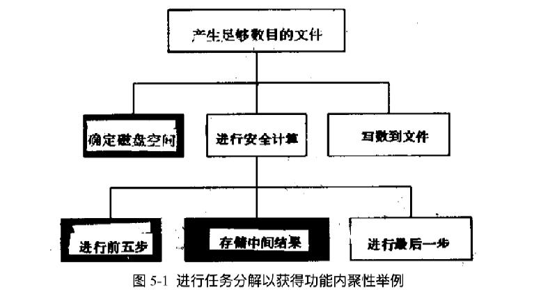

图中画阴影的部分是由原来的子程序从事的工作，在新组织结构中它们位于不同的层次上，这就是为什么为了把这些工作放入恰当的子程序中，要进行这么多重新组织工作的原因。用几个功能内聚性的子程序来代替一个具有不良内聚性的子程序是很平常的。

5.4 松散耦合性

所谓耦合性指的是两个子程序之间联系的紧密程度。耦合性与内聚性是不同的。内聚性是指一个子程序的内部各部分之间的联系程度，而耦合指的是子程序之间的联系程度。研究它们的目的是建立具有内部整体性（强内聚性），而同时与其它子程序之间的联系的直接、可见、松散和灵活的子程序（松散耦合）。

子程序之间具有良好耦合的特点是它们之间的耦合是非常松散的，任一个子程序都能很容易地被其它子程序调用。火车车箱之间的联接是非常容易的，只要把两节车箱推撞到一起，挂钩就会自动挂上，想象一下，用螺栓把它们固定到一起，或者只有特定的车厢之间才能联接到起，那么事情将会有多么麻烦。火车车厢之间的联接之所以非常容易，是因为它们的联接装置非常简单。同样，在软件中，也应该使子程序之间的耦合尽量简单。

在建立一个子程序时，应尽量避免它对其它子程序有依赖性，应该使它们像商业上的伙伴一样相互分离，而不要使它们像连体婴儿一样密不可分。类似 SinO 的函数是松散耦合的，因为它所需要的只是一个传递进去的角度值。而类似 Init Vars (varl, varZ, var3, …, varN）的函数则是紧密耦合的，因为调用程序事实上知道函数内部做什么。依靠使用同一全局变量联系在起的子程序之间，其耦合程度则更高。

5.4.1 耦合标准

以下是几条估计子程序间耦合程度的标准：

耦合规模。所谓耦合规模是指两个子程序之间联系的数量多少。对于耦合来说，联系的数

量越少越好，因为一个子程序的接口越少，那么在把它与其它子程序相连接时，所要做的工作

也越少。一个只有一个参数的子程序与调用它的程序间的耦合程序，要比有 6 个参数的子程序与调用它的程序间的耦合程度松散得多。一个使用整型参数的子程序与其调用程序之间的耦合程度，也要比一个使用有 10 个元素数组或者结构化数据的子程序与其调用程序之间的耦合程度松散得多。同样，使用一个全局变量的子程序与使用十二个全局变量的子程序相比，其耦合程度也要松散得多。

密切性。密切性指的是两个子程序之间联系的直接程度。联系越直接越好，两个子程序之间联系最密切的是参数表中的参数。当两个程序直接通讯时，这个参数就像接吻时的嘴唇。联系密切程度稍低的是作用于同一全局数据的两个子程序。它们之间交流的直接性稍低。全局变量就像是两个子程序之间的爱情，它可能消失在信中，也可能到你想要它到的地方。联系程度最低的是作用于同一数据库记录或文件的两个子程序，它们都需要这个数据但却又羞于通知对方，这个被分享的数据就像是在课堂上传阋着的一张写有“你喜欢我吗？请回答是还是不是”的纸条。

可见性。可见性是指两个子程序之间联系的显著程度。编程不像是在中央情报局中工作，不会因为行动隐蔽而受到表彰，它更像是作广告，干得越是大张旗鼓，受到的表彰也就越多。在参数表中传递数据是明显的，因而也是好的。而通过改动全局数据以便让别的子程序来使用它，则是一个隐蔽的联系因而也是不好的。对全局数据联系进行注释以使其更明显，可能稍好

止比

灵活性。灵活性是指改变两个子程序之间联系的容易程度。形象地说，你更喜欢电话上的快速插口装置，而不会喜欢用电烙铁把铜线焊到一起，灵活性可能有一部分是由其它耦合特性决定的，但也有一些区别。比如，有一个按照给定的被雇用日期和被雇用部门，寻找雇员的第

监工的子程序，并命名它为 Look Upfirstsupervisoro。同时，还有一个对变量 Emprec 进行结构化的子程序，变量 Emprec 包括雇用日期、雇用部门等信息，第二个子程序把这个变量传给第一个子程序。

从其它观点来看，两个子程序之间的耦合是非常松散的。因为处于第一个和第二个子程序之间的变量 Emprec 是公共的，所以它们之间只有一个联系。现在，假设需要用第三个子程序来调用子程序 Lookupfirstsupervisor（，但这个子程序中不含 Emprec，却含有雇用部门和雇用日期信息。这时 Lookupfirstsupervisoro 就不是那么友好了，它不情愿与第三个子程序进行合作。

对于调用 Lookupfirstsupervisoro 的子程序来说，它必须知道 Emprec I 的数据结构。它可以使用一个仅有两个域的变量 Emprec，但这又鸘要知道 Look Upfirstsupervisoro 內部结构，即那些仅供它使用的域，这是一个愚蠢的解決方法。第二个方案是改动 Lookupfirstsupervisor，使它自带雇用部门和雇用日期信息，而不是使用 Emprec。不管采用哪种方案，这个子程序都不像最初看起来那么灵活了。

如果愿意的话，一个不友好的子程序也是可以变为友好的。这种情况可以通过让它明确带有雇用部门和日期信息，而不再使用 Emprec 来达到这一目的。

简而言之，如果一个子程序越容易被其它子程序调用，那么它的耦合程度也就越低。这样的好处是可以增强灵活性和维护性。在建立系统结构时，应该沿着相互耦合程度的最低线将其分开。如果把程序看成一块木头的话，就是要沿着它的纹理把它劈开。

5.4.2 耦合层次

传统上，把耦合层次称为非直觉性（unintuntive）。所以，在以下叙述中，将交替使用这两个名字。在以下叙述中，既有好的耦合，也有不好的耦合。

简单数据耦合。如果两个子程序之间传递的数据是非结构化的，并且全部都是通过参数表进行的，这通常称作“正常耦合”，这也是一种最好的耦合。

数据结构耦合。如果在两个程序之间传递的数据是结构化的，并且是通过参数表实现传递的，它们之间就是数据结构耦合的。这种耦合有时也称之为“邮票耦合”（(stamp coupling)（不过我总觉得这种叫法非常奇怪）。如果使用怡当的话，这种耦合也不错，它与简单耦合的主要区别是它所采用的数据是结构化的。

控制耦合。如果一个子程序通过传入另一个子程序的数据通知它该作什么，那么这两个子程序就是控制耦合的。控制耦合是令人不快的，因为它往往与逻辑内聚性联在一起，并且，通常都要求调用程序了解被调子程序的內容与结构。

全局数据耦合。如果两个子程序使用同一个全局数据，那它就是全局数据耦合的。这也就是通常所说的公共耦合”或“全局耦合”。如果所使用的数据是只读的，那么这种耦合还是可以忍受的，但是，总的来说，全局耦合是不受欢迎的，因为这时子程序之间的联系既不密切，又不可见。这种联系容易被疏漏掉，甚至可以认为它是一种由信息隐含带来的错误一信息丢失

不合理耦合（pathological）。如果一个子程序使用了另外一个子程序中代码，或者它改变了其中的局部变量，那么它们就是不合理耦合的。这种耦合也称之为“内容耦合”。这一类耦合是不能接受的，因为它不满足关于耦合规模、密切性、可见性和灵活性中的任何一条标准。虽然这是一个很紧的联系，但是这种联系却是不密切的。改动另ー个子程序中的数据无异于在其后背桶上一刀，而且，这背后一刀从表面上又是看不出来的。由于它是建立在一个子程序完全了解另一个程序内容的基础之上的，因此其灵活性也是很差的。许多结构化语言中，都有明确禁止不合理耦合的语法规则。但是，在 Basic 或汇编语言中，它却是允许的。因此，在用这种语言编程时，一定要小心！

以上所有类型的耦合，如图 5-2 所示。

5.4.3 耦合举例

以下是上述各种耦合的例子，其中有好的，也有坏的

简单数据耦合的例子。比如，一个程序向 Tan（）子程序传递含有角度值的变量，那它们之间就是简单数据耦合的。

简单数据耦合的另一个例子。两个程序向另一个子程序传递姓名、住址、电话号码、生日和身份证号码等五个变量。

可接受的数据结构耦合的例子。一个程序向另一个子程序传递变量 Emprec, Emprec 是一个结构化的变量，包括姓名、住址、生日等等五个方面的数据，而被调用的子程序则全部使用这五个域。

不可取的数据结构耦合举例。一个程序向另一个子程序传递同样的变量 Emprec，但是，如果被调用的子程序只使用其中两个域，比如电话号码和生日。这虽然还是数据结构耦合，但却不是个很好的应用，如果把生日和电话号码作为简单变量来传递的话，将使联系更加灵活，而且会使它们之间的两个特定域真正联系的可见性更好。

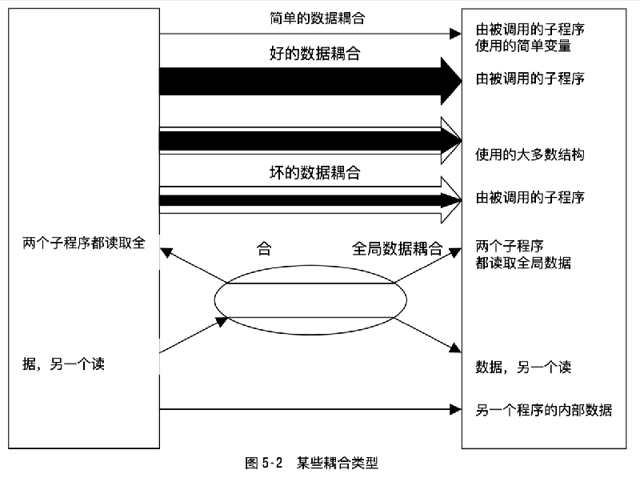

有问题的数据结构耦合的例子。一个程序向另一个子程序传递变量 Officerec。Officerec 有 27 个域，而被调用的子程序使用其中 16 个，这也是数据结构耦合，但是，它是一个好的数据结构耦合吗？決不是。传递 Officerec 使得联系是大规模的，这个事实非常明显，而传递 16 个单独参数，则又再次非常拙劣地表明了这一点，如果被调用子程序仅使用其中的 6 到 7 个域，那么单个地传递它们是个好主意。

在现在这种情形下，可以进一步对 Officerec 进行结构化，以使得在被调用程序中用得到的 16 个域包含在一个或两个亚结构中，这将是最简洁的解決办法。

简单数据耦合或可能数据结构耦合的例子。一个程序调用 Erasefile（）子程序，通过一个含有待删文件名的字符串确定将要删去的文件，这很可能是一个简单数据耦合。但也可以说这是一个数据结构耦合，因为字符串是一个数据结构。我觉得，我们的结论是半斤与八两的关系，这两种叫法都是同样正确的，对其作严格区分是没必要的。

控制耦合的例子。比如，一个程序向另一个子程序传递控制标志，通知它到底是打印月报表、季度报表还是年度报表。

不可取的全局数据耦合的例子。一个程序改动一个表的入口作为全局变量，这个表是以雇员的识别卡作为索引的。然后，这个程序又调用另一个子程序并把雇员识别卡作为一个参数传递给它，而这个被调用的子程序则用雇员识别卡去读全局数据表，这是一个典型的全局数据耦合（虽然仅仅传递雇员识别卡形成的是简单数据耦合，但是第一个程序对表入口的改动，已经决定了这是一种最坏的耦合一全局数据耦合）

可取的全局数据耦合的例子。一个程序把雇员识别卡传递给另一个子程序，两个程序都利用这个识别卡从一个全局表中读取雇员的名字，两个子程序都没有改变全局数据。

这通常也称为“全局数据耦合”，但事实上它更像“简单数据耦合”，我们也可称它为“可取的全局数据耦合”。与前述一个子程序改变另一个程序使用数据的例子不同，这两个程序并不是由全局数据联系在一起的。比较两个例子，这种对相同全局数据的只读使用是良性的。这两个从同一个全局表读取数值的程序，与上述那两个通过使用全局数据来掩盖它们之间联系的程序是完全不同的。

内容耦合的例子。在汇编语言中，一个子程序可以知道另一个子程序中说明为局部变量的表的地址。它可以命名用这个地址直接去改动这个表，而地址在两个子程序间并没有当作参数传递。

内容耦合另ー个例子。一个 Basic7 程序利用 GOSUB 语句来执行另一个子程序中的一段代码。好的耦合关键是它可以提供一个附加的抽象层次日写好它，就可以认为它是独立的。它降低了整个程序的复杂性，并且使你每次只致力于一件事情。如果在使用子程序时要求同时考虑几件事情一知道它的内部内容、对全局数据的改动、不确定的功能等，就会使其丧失抽象能力，那么使用子程序还有什么用呢？子程序本来是用于降低复杂性的工具，如果使用它没有使工作更简单，那说明没有用好它。

5.5 子程序长度

理论上，常把一个子程序的最佳长度定为一两页，即 66 到 132 行。按照这种原则，在七十年代，IBM 公司曾把子程序的长度限制在 50 行以下，而 TRW 公司则把这个标准定为 132 行 Mccabe1976)。几乎没有什么证据证明这一限制是正确的。相反，倒是证明较长子程序更有利的证据更有说服力，请参照以下几点：

Basii 和 Perricone1984 年的研究表明，子程序的长度与错误数量是成反比的。随着子程序长度的增加（长至 200 行的代码），每一行的错误数量开始下降。

另一个由 shen et al1985 年进行的研究表明，程序长度与错误数是无关的，但错误数量会随着结构复杂性和数据数量的增加而增加。

项由 Card、Church 和 Agresti 在 1986 年，以及 Card 和 Glass 在 1990 年进行的调查表明，小型子程序（32 行代码或更少）并不意味着低成本和低错误率，证据表明大型子程序（65 行或更多）的每行成本要低于小型子程序。

对 450 个子程序的一项调査发现小型子程序（包括注释行，少于 143 行源语句）的每行错误率要比大型子程序高 23% (Selby 和 Basili1991)

对计算机专业高年级学生进行的测验表明，学生们对一个被过度模块化的、由许多有 10 行左右代码子程序组成的软件，与同样内容但不含任何子程序的软件的理解程度是相同的。但若把整个程序分解成中等规模的子程序（每个有 25 行代码），学生们的理解程度会上升为 65%。

最近研究发现，当子程序长度是 100 到 150 行时，错误率最低（Lind 和 Variavan

1989)

研究子程序长度有什么好处呢？如果你是一个经理，不要限制程序员们编写长于一页的子程序，刚才引用的资料和程序员们自己的经验都可以证明你这样作是正确的。如果想编写长度是 100 行，150 行或 200 行的子程序，那就按照你想的去作吧。目前的证据表明，这种长度的子程序并不更易引发错误，而其开发更为容易。

如果要开发长于 200 行的子程序，就要小心了（这里的长度不包括注释行和空行）。目前还没有任何证据表明长于 200 行的子程序会带来更低的成本或更少的错误。而这样做却会使你达 到可理解性的上限。在对IBM为OS/360操作系统及其它系统而开发代码研究中发现，最易出错的子程序是那些大于 500 行的子程序。在超过 500 行之后，错误数量会与子程序的长度成正比。而且，对一个有 148,000 行代码软件的研究发现，修改少于 143 行子程序错误所耗费的成本，要比修复长于 143 行的子程序中错误成本低 2.4 倍（Sely 和 Basin1991)。

5.6 防错性编程

防错性编程并不意味着要对自己的程序提高警惕，这一想法是在防错性驾驶的基础上产生的，在这种驾驶方法中，必须在心中时刻认为其它驾驶员的行为都是不可预测的。这样，就可以在他们做出某些危险举动时，确保自己不会因此受伤。在防错性编程中，其中心思想是，即使一个子程序被传入了坏数据，它也不会被伤害，哪怕这个数据是由其它子程序错误而产生的。更一般地说，其思想核心是承认程序中都会产生问题，都要被改动，一个聪明的程序员就以这点为依据开发软件。

作为本书介绍的提高软件质量技术之一，防错性编程是非常有用的。最有效的防错性编码途径是一开始就不要引入错误。可以采用逐步设计方法、在编码前先写好 PDL、进行低层次设计、审查等都可以防止错误引入。因此，应优先考虑它们，而不是防错性编程。不过，你可以把防错性编程与这些技术组合起来使用。

5.6. 使用断言

断言是一个在假设不正确时会大声抗议的函数或宏指令。可以使用断言来验证在程序中作出的假设并排除意外情況。一个断言函数往往大致带有两个内容：假设为真时的布尔表达式和一个为假时要打印出来的信息。以下是一个假定变量 Denominator 不为零时一个 Pascal 断言

Assert  (Denominator <>0, Denominator is unexpected equal to 0.

这个断言假定 Denominator 不等于”0”，第一部分 Denominators>0 是一个布尔表达式，其结果为 True 或 False。第二部分是当第一部分的结果为 False 时，将要打印出来的信息。

即使不愿让用户在最终软件中看到断言信息，在开发和维护阶段，使用断言还是非常方便的。在开发阶段，断言可以消除相互矛盾的假设，消除传入子程序的不良数值等等。在维护阶段，可以表明改动是否影响到了程序其它部分。

断言过程是非常容易写的，下面就是一个用 Pascal 写成的例子：

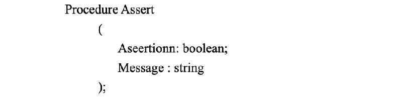

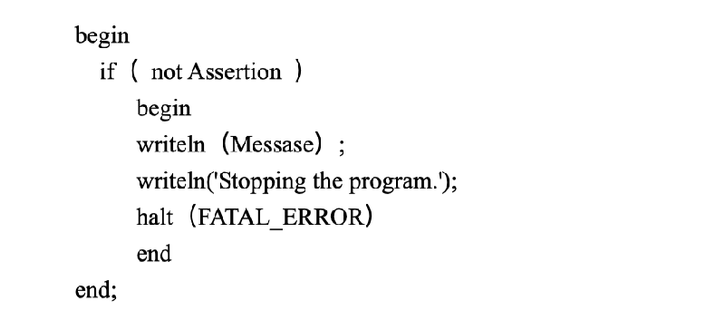

旦写好了这样一个过程，就可以用像第一个例子那样的语句来调用它。下面是使用断言的一些指导方针：

如果有预处理程序的话，使用预处理程序宏指令。如果在开发阶段使用预处理程序处理斷，那么在最终代码中把断言去掉是非常容易的。

在断言中应避免使用可执行代码，把可执行代码放入断言，在关闭断言时，编译程序有可能把断言捎去。请看以下断言；

Assert  (Fileopen  (Inputfile <NULL, Couldn"t Open input file)

这行代码产生的问题是，如果不对断言进行编译，也编译不了打开文件的代码，应把可执行语句放在自己的位置上，把结果赋给一个状态变量，然后再测试状态。以下是一个安全使用断言的例子

Filestatus File Open  (Inputfile

Assert (Filestatus <> NULL, Couldn't Open input file)

5.6.2 输入垃圾不ー定输出垃圾

个好的程序从来不会输出乱七八糟像垃圾似的东西，不管它被输入的是什么。一个好程序的特点是“输入垃圾，什么也不产生”，或“输入垃圾，输出错误信息”，也可以是“不允许垃圾进入”。从现在的观点来看“输入垃圾，输出垃圾”，往往是劣质程序。

检查所有外部程序输入的数值。当从用户文件中读取数据时，要确保读入的数据值在允许范围之内。要保证数值是可以取的，并且字符串要足够短，以便处理。要在代码中注释出输入数据的允许范围。

检查全部子程序输入参数值。检查子程序输入参数值，事实上与检查外部程序数据是一样的，只不过此时由子程序代替了文件或用户。

以下是一个检查其输入参数的子程序的例子，用 c 语言编写

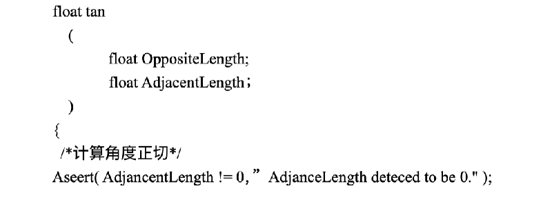

return(Oppsitelenght/Adjancetlength)

决定如何处理非法参数。一旦发现了一个非法参数，该如何处理呢？根据不同情况，可以

希望返回一个错误代码、返回一个中间值、用下ー个合法数据来代替它并按计划继续执行、与上次一样返回一个正确答案、使用最接近的合法值、调用一个处理错误的子程序、从一个子程序中调用错误信息并打印出来或者干脆关闭程序。由于有这样多的方案可供选择，所以当在程序的任一个部分处理非法参数时，一定要仔细，确定处理非法参数的通用办法，是由结构设计决定的，应该在结构设计层次上予以说明。

5.6.3 异常情况处理

应该预先设计好异常处理措施来注意意想不到的情况。异常处理措施应该能使意外情况的出现在开发阶段变得非常明显，而在运行阶段又是可以修复的，例如，在某种情况下使用了个 case 语句，其中只预计到了五种情况，在开发阶段，应该能利用异常情况处理产生一个警告，提示出现了另外一种情况。而在产品阶段，应该利用异常情况处理做一些更完美的工作，比如向一个错误记录文件中写入信息等。总之，应该设计出不必费多大周折，就可以从开发阶段进入产品阶段的程序。

5.6.4 预计改动

改动几乎是每个程序都不可避免的现象。比如，开发一个旧的软件新版本，就需要对原有代码作出许多改动，不过，即使是在开发一个软件的第一版时，也不得不由于加入某些没有预计到的功能而对其进行改动。在开发软件时，应该努力作到使它很容易地进行改动。而且，越是可能的改动，越是要容易进行，把你在其中预想到的改动域隐含起来，是減少由于改动而对程序带来影响的最有力武器之

5..5 计划去掉调试帮助

调试帮助措施包括：断言、内存检查报告、打印语句等及其它一些为方便调试而编写的代码。如果所开发的软件是供自己使用的，那么把它们保留在程序中并无大碍。但是，如果是商用软件，那么这些措施留在程序中，则会影响其速度和占用空间等性能指标。在这种情况下，应事先作好计划，避免调试信息混在程序中，下面是几种方法。

使用版本控制。版本控制工具可以从同一源文件中开发出不同版本的软件。在开发阶段可以设置包含全部调试辅助手段的版本控制工具，这样，到了产品阶段，就可以很容易地去掉在商用版本中所不希望出现的这些辅助手段。

使用內部预处理程序。如果在编程环境中带有预处理程序，如 C 语言，那么仅用一下编译程序开关，就可以加入或去掉这些辅助手段。可以直接使用预处理程序，也可以通过编写宏指令来进行预处理程序定义。下面是一个用 c 语言写成的，直接使用预处理程序的例子：

这种思想可能有几种表现形式。不仅仅是定义 DEBUG，还可以赋给它一个值，然后再测试它的值，而不是测试它是否被定义了。用这种方法可以区分调试代码的不同层次。也可能希望某些调试用代码长期驻存在程序中，这时可以使用诸如# if DEBUG>0 之类的语句，把这段代码围起来，其它一些调试代码可能是有某些专门用途的，这时可以用# if DEBUG

PRINTER ERROR 这样的语句把这段代码围起来，在其它地方，还可能想设置调试层次，可用如如下语句：

H if DEBUEG> LEVEL A

要是不喜欢程序内部充斥着# if defined（）这样的语句的话，可以用一个预处理程序宏指令来完成同一任务。以下是一个例子：

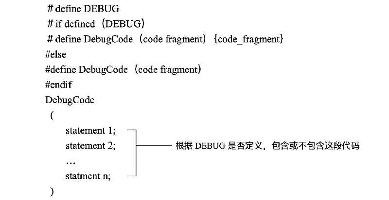

与使用预处理程序的第一个例子一样，这种技术也有多种形式，可以使它更复杂一些，从而不是简单地全部包括或全部排除调试代码。

编写自己的预处理程序。如果编程语言中没有预处理程序，可以自己编写一个加入或去掉调试代码的预处理程序，这项工作是非常容易的。还要建立一个标识调试代码的约定，并编写自己的预编译程序来遵循这一约定。比如，在 Pascal 中，可以编写一个对如下关键字作出反应的预编译程序：/# BEGIN DEBUG/和/# END DEBUG/。并写一个批处理文件来调用这个预处理程序，然后再编译这段已经预处理过的代码。从长远观点来看，这样做可以节约许多时间，因为你不会误编译没有预处理过的代码。

保留使用调试程序。在许多情况下，可以调用一个调试子程序来进行调试工作。开发阶段在控制返回调用程序之前，这个子程序可能进行几项操作。在最终软件中，可以用一个子程序来代替那个复杂的调试子程序，这个子程序将立即返回控制，或者在进行两个快速操作之后，返回控制。使用这种方法，对性能带来的影响很小，与编写自己的预处理程序来相比，其速度也要快得多。所以，有必要保留这个子程序在开发阶段和最终产品阶段的两个版本，以供在将来的开发和产品调试中使用。

比如，可以用一个检查传入其中指针的子程序作为开始：

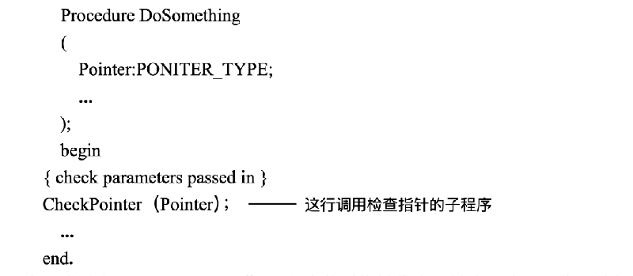

在开发阶段，Checkpointer（）子程序将对指针作全面检查，这项工作可能很费时，但却티 常有效，它很可能是以下这个样子的：

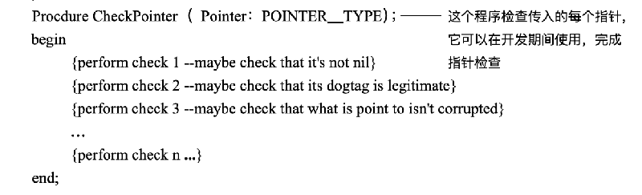

当程序进入最终产品阶段时，可能并不希望所有的内务操作都与指针检查联系到一起，这寸，可以用下面这个子程序来代替刚才那个子程序：

以上这些并不是去掉调试辅助工具的所有方案，但从提供一些在你的环境下能有效工作方案这个思路的角度来说，这些已经是足够的了。

5.6.6 尽早引入调试辅助工具

越早引入调试辅助工具，它们所起的作用也就会越大。一般说来，只有在被某一问题困扰

几次之后，你才会舍得花功夫去编写调试辅助工具，但如果你在第一次遇到问题时就这样做，或者引用一个以前遗留下的调试辅助工具，那么它将在整个项目中都会对你有很大帮助。

5.6.7 使用“防火墙”包容错误带来的危害

“防火墙”技术是一种包容危害策略，在建筑物中，防火墙的作用是防止火灾蔓延，把火隔离在一个地方。在轮船中使用分隔式水密舱也是同样道理，如果船撞上了冰山，那么只有被撞的水密舱才会破损，而其它舱由于是与它分隔开来的，所以不会受到它的影响，这样就避免了由一个洞而带来的全船进水的灾难性后果。

信息隐蔽可以帮助在程序中建立防火墙。对另ー个子程序的内容知道得越少，对它如何操作的假设也就越少，而假设越少，其中ー个假设出错的可能性就会越小。

松散的耦合也是在程序内部修建防火墙的手段之一。两个子程序之间的耦合越松散，那么其中一个子程序中的错误影响到另外一个子程序的机会也越少。相反，如果两个子程序联系得非常紧密，那么一个子程序错误很可能会影响另外一个子程序。

在程序中建防火墙的最好办法是把某些接口标识成“安全”区边界。对穿越安全区边界的数据进行合法性检査，如果是非法的数据，就要作出合理的反应。基于这种想法的另一种技术是手术室技术，在数据被允许进入手术室之前，要对其进行消毒处理，手术室中的一切都认为是无毒安全的。当然，这个手术室是指一段代码，这样，在设计中，要作出的一个关键決定，就是在这个“手术室”中进入些什么？哪些要被放在它外面？应该把门放在哪儿？应该把哪些子程序放在安全区内，哪些放在外面？用什么对数据进行消毒？最简单的办法是在外部数据进入时对其进行消毒，但是，数据往往需要在几个层次上进行消毒，因此，有时需要进行多重消毒

5.6.8 检查函数返回值

如果调用了一个函数，并且可以忽略函数退回值（例如，在 C 语言中，甚至不需要知道函数是否返回一个值），千万不要忽略这个返回值。要对这个值进行检查。如果不想让它出错的话，定要对其进行检查。防错性设计的核心就是防止常错误。

对于系统函数来说，这个原则也是适用的，除非在结构设计中制定了不检查系统调用的返回码，而是在每次调用后检查错误代码。如果发现错误，C 语言中的 Perror (），或其它语言中等效的部分，能同时也查出错误个数和这个错误的说明。

5.6.9 在最终软件中保留多少防错性编程

防错性编程带来的矛盾是，在开发过程中，你希望出现错误时越引人注意越好，惹人讨厌总比冒险忽视它好得多。但在最终产品中，你却希望它越不显眼越好，程序运行不管成功与否都要看起来十分优雅。以下是帮助你決定在最终软件中应该保留哪些防错性编程的一些原则：

保留查找重要错误的代码。首先要确定哪些域可以承受未测试到的错误，而哪些域不能。例如，你正在编写一个表格程序，程序中的屏幕更新区就可以承受未测试到的错误，因为发生这种情况的后果，不过是一个混乱的屏幕而已，而在计算部分，就不能发生这种情况。因为这会在表格中产生难以察觉的错误。绝大多数用户都宁愿忍受一个混乱的屏幕而不是错误的表格。

去掉那些无关紧要错误的代码。如果一个错误的后果是无关紧要的，那就去掉检查它的代码。在上例中，你很可能会去掉检查屏幕更新区错误的子程序。“去掉”并不是指从物理上把这段代码删掉，它指的是版本控制预编译开关，或其它不编译那段特定代码的技术。如果不存在空间限制问题，你也可以保留这段查错代码，并让它向一个错误记录文件隐蔽地传送信息。

去掉那些引起程序终止的代码。在开发阶段，程序发现了一个错误时，你会希望这个错误越引人注意越好，以便你能修复它，通常，达到这一目的最好办法是让一个程序在发现错误时打印出错误信息然后终止。即使对于微小错误来说，这样做也是很有用的。

而在最终软件中，在程序终止前，用户总是希望有机会将其工作存盘。他们往往愿为达到这一目的而忍受一些反常现象，用户们不会感激那些使其工作付诸东流的东西，不管这些东西在调试阶段多么有用，哪怕最终极大提高了软件质量。如果程序中含有会使干百万数据丟失的调试代码，那么在最终产品中应将其去除掉。

保留那些可以使程序延缓终止的代码。同时，那些相反的代码也应该保留。如果程序中含有测试潜在致命错误的信息，那么用户会为能在它们最终发展起来之前将自己的工作存盘而感到高兴。我所使用的文字处理机在溢出内存之前会亮起 SAVE”提示灯进行警告，当发现这情况后就立即存盘并退出。当重新启动程序时，一切又变得正常了。从理论上说，程序不应该溢出内存，而且，在用同一台机器重新启动程序运行同一文件时，它也不应该用更多内存。产生了内存溢出问题说明程序有缺欠，但是，程序员想得很周到，在程序中保留了内存检査代码，我也宁愿得到一个警告信息，而不愿失去我前面所做的工作。

保证留在程序中的错误提示信息是友好的。如果在程序中保留了内部错误提示信息，要确保它是用友好的语言表达。在我早期编程工作中，我曾经收到一个用户的电话，说她在屏幕上看到了这样的信息“你的指针地址有错，笨蛋！”幸亏她还有一些幽默感，这对我来说是很幸运的。通常的办法是通知用户存在“内部错误”，并告诉用户ー个她可以投诉的电话号码。

要对防错性编程提高警惕。过多的防错性编程会帯来它自身的问题，如果你对每一种可以察觉的参数传递，在每一个可以察觉的地方都进行检查，那么程序将变得臃肿而笨拙。更糟的是，附加的用于防错性编程的代码本身并非是完善无缺的，同其它代码一样，你也会在其中发现错误，而且，如果你是随意写它的，那么错误也会更多。考虑好需要在哪里预防错误，然后再使用防错性编程。

5.7 子程序参数

子程序间的接口往往是一个程序中最容易出错的部分，由 Basi 和 Perricone 进行的一项研究表明，程序中 39%的错误都是内部接口错误，即子程序间的通信错误。以下是尽量减少这类错误的一些准则

确保实际参数与形式参数匹配。形式参数，即哑参数，是在子程序定义中说明的变量，实际参数是在调用程序中使用的变量和参数。

常见的错误是在子程序调用时变量类型有误，比如，在需要使用实型数时使用了整型数（这种情况只在像 C 这种弱类型的语言中，才会遇到。例如，在汇编语言或在 C 语言中未使用全部编译程序的全部警告时就可能产生这种问题。而在 Pascal 中，当变量是单纯输入的时候，几乎不会产生这个问题）。通常编译程序在把实参传入子程序之前，会把它转为形参的类型。如果产生这个问题，编译程序通常会产生警告。但是在某些情况下，特别是当变量既用于输入也用于输出时，你可能由于传递了错误的变量类型而受到惩罚。

要养成检查参数表中参数变量类型和注意编译程序关于变量类型不匹配警告的习惯。在 C 语言中，使用 ANSI 函数的原型，以便编译程序会自动检査变量类型，并在发现类型错误时发出警告。

按照输入一修改一输出的顺序排列参数。不要随机地或者按照字母表的顺序排列参数，应该将输入参数放在第一位，既输出又输入的参数第二位，仅供输出的参数第三位这样来排参数。这种排列方法显示了子程序中操作进行的顺序一一输入数据、修改数据、输出一个结果、下面是一个 Ada 语言中的参数排列顺序。

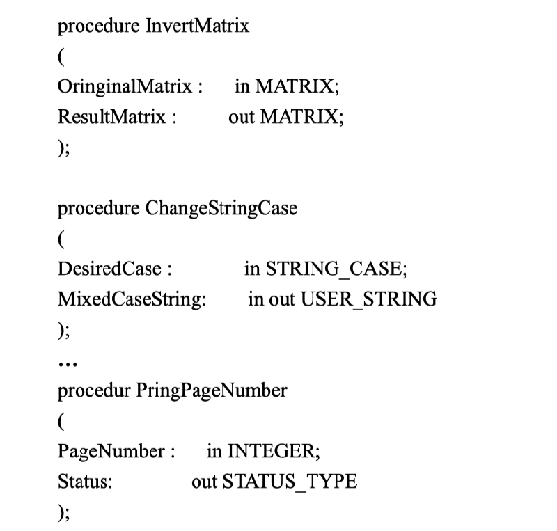

这种排列约定与 C 语言中把被修改的参数放在首位的规定是沖突的。不过我仍然认为上述排列顺序至少对我来说是十分明智的。但如果你一直接某种特定方式对参数排序，这也是可以帮助提高程序可读性的。

如果几个子程序今使用了相似的参数，应按照不变的顺序排列这些参数。子程序中参数的排列顺序可以成为一种助记符，而不停变动的排列，会使得这些参数非常难记。比如，在 C 语言中，f 印 int0 函数与 printf0 函数相比，除了多了一个文件作为第一変量之外，两者其余都是一样的。而函数印 outso 与函数 puts 相比，也只是前者多了ー个文件作为最后变量。这实在是一个糟糕的区别，因为它使得这些函数的参数的难记程度比实际要高多了。

我们来看一个例子，同样是 C 语言中的函数，函数 strncpy（）是按照目标字符率、源字符率和字节的最大数目来排列变量的，而函数 memcpy（）是按同样的顺序来排列变量的，这种相似性使得两个函数中的参数都非常好记了

使用所有的参数。如果向某个子程序中传入了一个参数，那就要在其中使用；如果不用它的话，就把它从子程序接口中去掉。因为出错率是随着未用参数个数的增加而升高的，一项调查表明，在没有未用参数的子程序中，有 46%是完全无错的。而在含有未用参数的子程序中，仅有 17%到 29%是完全正确的（Card, Church, Agresti1986)

不过，这个去掉未用参数的规则有两个特例。首先，如果你使用了 c 语言中的指针函数或 Pascal 中的变量过程，那可能会有一些子程序拥有完全相同的参数表，而在这其中又可能有几个子程序没有完全用到这些参数，这是允许的。其次，当你按照某种条件对程序进行部分编译，可能会使用某些参数编译部分程序。但如果你去掉这部分是正确有效的，那这也是允许的。一般来说，如果你有充分的理由不使用某一参数的话，那就按照你想的大胆去干吧。但如果理由不是很充分的话，就要保留这个参数。

把状态和“错误”变量放在最后。根据约定，状态变量和表示程序中有错误的变量应该放在参数表的最后。这两种变量对于子程序来说是不很重要的。同时又是仅供输出的变量，因此把它们放在最后是非常明智的。

不要把子程序中的参数当作工作变量。把传入子程序中的参数用作工作変量是非常危险的。应该使用局部变量来代替它。比如，在下面这个 Pascal 程序段中，不恰当地使用了 Input val 这个变量来存放中间运算结果。

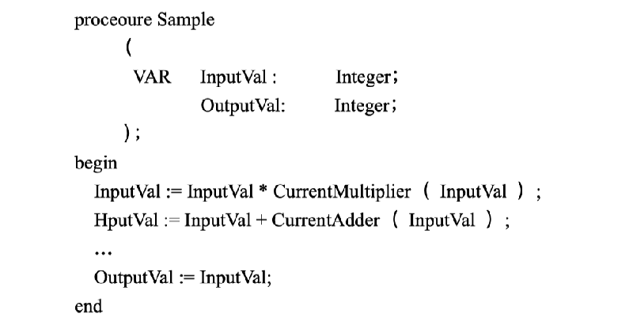

在这个程序段中，对 Inputval 的使用是错误的，因为在程序到达最后一行时，Innut Val 不再保持它输入时的值。这时它的值是程序中计算结果的值，因此，它的名字被起错了。如果你以后在更改程序，需要用到 Inputval 的输入值时，那很可能会在 Input Val 的值已经改变后还错误地认为它保留原有值。

该如何解決这个问题呢？给 Input Val 重新命名吗？恐怕不行。因为假如你将其命名为 Working Val 的话，那么这个名称是无法表示出它的值是来自于程序以外这个事实的。你还可以给它起一个诸如 Inputval Thatbe Comesaworkins Val 之类荒唐的名字或者干脆称之为 X 或者 Vval 但无论哪一种办法，看起来都不是很好。

一个更好的办法是通过显式使用工作变量来避免将来或现在可能由于上述原因而帯来的问题。下面的这个程序段表明了这项技术：

通过引入新变量 Woking Val，即保留了 Input Val 的作用，还消除了在错误的时间使用 Input Val 中值的可能性。在 Ada 语言中，这项原则是通过编译程序进行强化的。如果你给某个参数的变量名前缀是 in，则不允许在函数中改变这个参数的值。不过，不要利用这个理由来解释把一个变量很具文学性地命名为 Working Val，因为这是一个过于模棱两可的名字，我们之所以这样使用它，仅仅是为了使它在这里的作用清楚一些。

在 Fortran 语言中，使用工作变量是一个非常好的习惯。如果在调用子程序参数表中的变量被调用子程序改动了，那么它在调用程序中的值也将被改变。在任何语言中，把输入值赋给工作变量的同时都强调了它的来源。它避免了从参数表中来的变量被偶然改变的可能性。

同样的技术也被用于保持全局变量的值。如果你需要为全局变量计算一个新值，那应该在计算的最后把最终值赋给全局变量，而不要把中间值赋给它。

说明参数的接口假设。如果假定被传入子程序的数据具有某种特性，那么需要对这个假设作出说明。在子程序中和在调用程序的地方都需要说明这一假设，这绝不是浪费时间。不要等到写完子程序后再回过头来说明这些假设，因为那时很可能你已经忘记这些假设了。如果能在代码中放入断言的话，那么其效果要好于说明这些假设

关于参数接口的哪些假设需要作出说明呢？

参数是仅供输入的，修改的还是仅供输出的？

数值参数的单位（英尺、码、还是米等）。

如果没有使用枚举型参数的话，应指出状态参数和错误变量值的意义。

预期的取值范围。

永远不该出现的某些特定值。

应该把一个子程序中的参数个数限制在 7 个左右。7 对于人的理解能力来说是一个富于魔力的数字。心理学研究表明人类很难一次记住超过 7 个方面的信息，这个发现被应用到不计其数的领域中，因此，如果一个子程序中的参数个数超过 7 个，人们就很难记住，这样会更安全一些

在实践中，把一个子程序中的参数个数限制在多少，取决于你所用的程序语言是如何处理复杂数据结构的。如果你所用的是一种支持结构化数据的先进语言，你可以传递一个含有 13 个域的数据结构，而把它只看成是一个独立的信息。如果你使用的是一种比较原始落后的语言。那你就不得不把这个复合数据结构分解成 13 个单独参数分别传送。

如果你发现自己总是在传递比较多的变量，则说明程序之间的耦合就有些过于紧密了。这时应重新设计子程序或子程序群，来降低耦合的紧密性。如果你把同一数据传给不同的子程序，应当把这些子程序组织成一个模块，并把那些经常使用的数据当做模块数据。

考虑建一个关于输入、修改和输出参数的命名约定。如果发现区分输入，修改和输出参数是非常重要的，则你可以建立一个关于命名的约定，以便区分它们，比如可以用 i, m, o 作前缀。要是你不觉得冗长的话，可以用 INPUT, MODIFY 和 OUTPUT 来作前缀。

仅传递子程序需要的那部分结构化变量。如同在 5.4 节关于耦合中讨论过的那样：如果子程序不是使用结构化变量中绝大部分的话，那么就只传递它所用得到的那一部分。如果你精确规定了接口，在别的地方再调用这个子程序会容易些。精确的接口可以降低子程序间的耦合程度，从而提高子程序的使用灵活性。

不过，当我们使用抽象数据类型（ADT）时，这一精确接口规则使不适用了。这种数据类型要求我们跟踪结构化变量，但这时你最好不要过分注意结构內部，在这种情况下，应把抽象数据类型子程序设计成将整个记录作为一个参数来接收的，这可以使你把这个记录当成 ADT 子程序之外的一个目标，并把这个记录的抽象水平保持在与 ADT 子程序的相同高度上，如果你通过利用其中的每一个域来打开结构，那你就丧失了由 ADT 所带来的抽象性。

不要对参数传递作出任何设想。有些程序员总是担心与参数传递有关的內部操作，并绕过高级语言的参数传递机制，这样做是非常危险的，而且使得程序的可移植性变坏。参数一般是通过系统堆栈传输的，但这决不是系统传递参数的唯一方式。即使是以堆栈为基础的传递机制，这些参数的传递顺序也是不同的，而且每一个参数的字长都会有不同程度的改变。如果你直接与参数打交道，事实上就已经注定了你的程序不可能在另一个机器上运行

5.8 使用函数

像 C、Pascal 和 Ada 等先进的语言，都同时支持函数和过程，函数是返回一个值的子程序，而过程则是不返回值的子程序。

5.8.1 什么时侯使用函数，什么时侯使用过程

激进者认为函数应该像数学中的函数一样，只返回一个值。这意味着函数应接受唯一的输入数据并返回一个唯一的值。这种函数总是以它所返回的值来命名的，比如 sin0, cosO, Customerido 等等，而过程对于输入、修改、输出参数的个数则没有限制。

公用编程法是指把一个函数当作过程来使用，并返回一个状态变量。从逻辑上说，它是一个过程，但由于它只返回一个值，因此从名义上说，它又是函数。你可能在语句中使用过如下个称为 Fotmatoutput（）的过程

if (Formatoutput (Input, Formatting, Output) =Success) then

在这个例子中，从它输出参数的角度来看，是一个过程。但是从纯技术角度来说，因为程序返回一个值，它又是一个函数。这是使用函数的合法方式吗？从保护这个方法的角度出发，你可以认为这个函数返回一个值与这个子程序的主要目的一一格式化输出无关。从这个观点来看，虽然它名义上是一个函数，但它运行起来更像是过程。如果一贯使用这种技术的话，那么用返回值来表示这个过程的成功与否并不会使人感到困惑。

一个替換的方案是建立一个用状态变量作为显式参数的子程序，从而产生了如下所示的代码段：

Formatoutput Input, Formatting, Output, Status if  (Status=Success) then

我更赞成使用第二种方法，这倒并不是因为我是个坚持严格区分函数与过程的教条主义者而是因为它明确区分了调用和测试状态变量值的子程序。把调用和测试状态值的语句写成一行增加了语句的代码密度，也增加了其复杂性。以下这种函数用法也是很好的

Status: - Formatoutput Input Formatting Output

f  (Status Success then

5.8.2 由函数带来的独特危险

使用函数产生了可能不怜当值的危险，这常常是函数有几条可能的路径，而其中一条路径又没有返回一个值时产生的。在建立一个函数时，应该在心中执行每一条路径，以确认函数在所有情况下都可以返回一个值。

5.9 宏子程序

特殊情况下，用预处理程序宏调用生成子程序。下面的规则和例子仅限于在 C 中使用预处理程序的情况。如果你使用的是其它语言或处理程序，应调整这些规则以适应你的要求：

把宏指令表达式括在括号中。由于宏指令及其变量被扩展到了代码中，应保证它们是按照你想要的方式被扩展的。在下面这个宏指令中包含了一种最常见的错误

define product  (a, b) a*b

这个宏指令的问题是，如果你向其中传了一个非基本数据（无论对 a 还是 b），它都无法正确地进行乘法运算。如果你使用这个表达式来算（x+1, X+2），它会把它扩展到 X+1*y+2, 由于乘法运算对加法具有优先佳，因此输出结果并不是你想要的结果；一个好一些但并非完美的同样功能的宏指令如下：

define product a, b) (a) * (b) a/***

这一次的情况要稍好些，但还没有完全正确，如果你在 preduct（）中使用比乘法具有优先权的因子。这个乘运算还是要被分割开，为防止这一点，可以把整个表达式放人括号：

H define preduct  (a, b) ((a) * (b))

用斜线将多重语句宏指令包围起来。一个宏指令可能具有多重语句，如果你把它当作多重语句来对待的话就会产生问题，以下是一个会产生麻烦的宏指令例子：

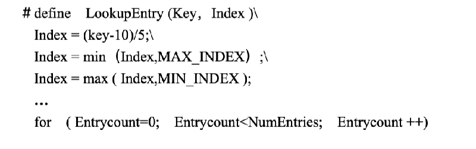

用子程序的命名方法来给扩展为代码的宏命名，以便在必要时用子程序代替它。在 C 语言中给宏命名的规定是应该使用大写字母来命名，如果可以使用子程序来代替它，那么就使用子程序命名规定来代替 C 中的宏命名规定。这样，你只要改变所涉及的子程序，就可以非常容易地对宏和子程序进行互相替换。

采纳这种建议也会带来一些危险。如果你一直使用艹和--，当你误把宏当作子程序来用时就会产生副作用。考虑到副作用带来的问题，如果你采纳这个建议避免副作用的话，你就可以干得更好。

5.9.1 检查表

高质量的子程序

总体问题

创建子程序的理由充分吗？

如果把一个子程序中的某些部分独立成另一个子程序会更好的话，你这样做了吗？是否用了明显而清楚的动宾词组对过程进行命名？是否是用返回值的描述来命名函数数？

子程序的名称是否描述了它做的所有工作？

子程序的内聚性是不是很强的功能内聚性？它只做一件工作并做得很好吗？

子程序的耦合是不是松散的？两个子程序之间的联系是不是小规模、密切、可见和灵活的？

子程序的长度是不是它的功能和逻辑自然地決定的：而不是由人为标准决定的？

防错性编程

断言是否用于验证假设？

子程序对于非法输入数据进行防护了吗？

子程序是否能很好地进行程序终止？

子程序是否能很好地处理修改情况？

是否不用很麻烦地启用或去掉调试帮助？

是否信息隐蔽、松散耦合，以及使用“防火墙”数据检查，以使得它不影响子程序之外的代码？

子程序是否检查返回值？

产品代码中的防错性代码是否帮助用户，而不是程序员？参数传递问题

形式参数与实际参数匹配吗？

子程序中参数的排列合理吗？与相似子程序中的参数排列顺序匹配吗？接口假设说明了吗？

子程序中参数个数是不是 7 个或者更少，

是否只传递了结构化变量中另一个子程序用得到的部分？

是否用到了每一个输入参数？

是否用到了每一个输出参数？

如果子程序是一函数，是否在所有情况下它都会返回一个值？

5.10 小结

建立子程序的最重要原因是加强可管理性（即降低复杂性），其它原因还有节省空间改进正确性、可靠性、可修改性等等。

强调强內聚性和松散耦合的首要原因是它们提供了较高层次的抽象性，你可以认为个具备这种特性的子程序运行是独立的，这可以使你集中精力完成其它任务。有些情况下，放入子程序而带来巨大收益的操作可能是非常简单的。

子程序的名称表明了它的质量，如果名称不好但却是精确的，那么说明它的设计也是非常令人遗憾的。如果一个子程序的名称既不好又不精确，那它根本就无法告诉你程序作了些什么。无论哪种情況，都说明程序需要改进。

防错性编程可以使错误更容易被发现和修复，对最终软件的危害性显著减小。
