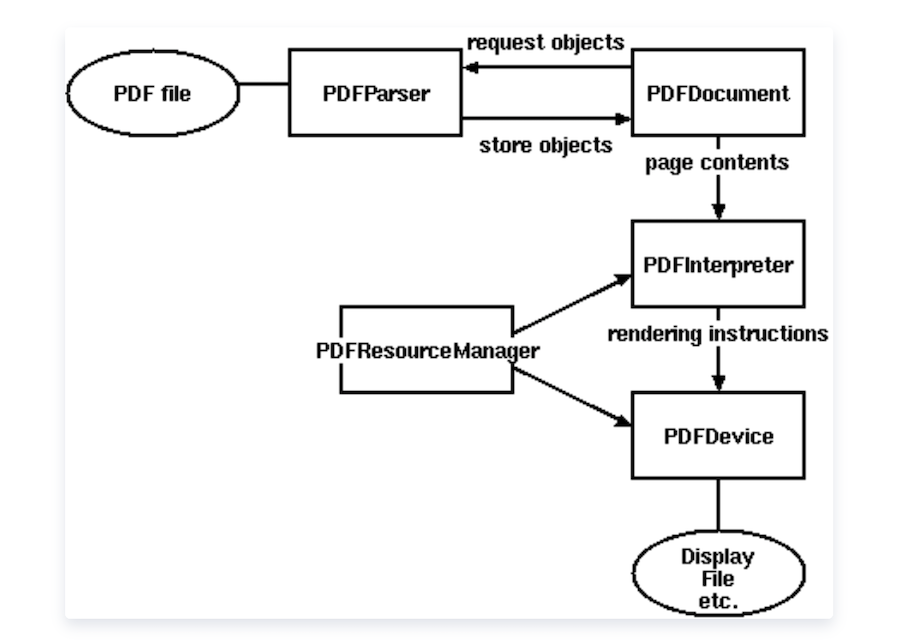
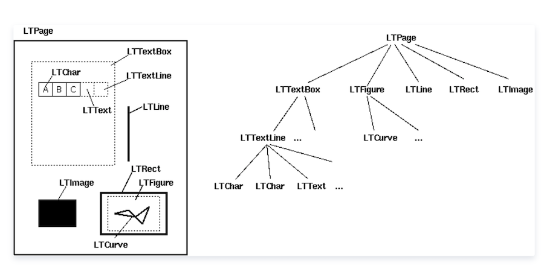

# python 提取 pdf 文本内容

[python 提取 pdf 文本内容 - 云 + 社区 - 腾讯云](https://cloud.tencent.com/developer/article/1406532)

安装：

    pip install pdfminer

## 01. 解析 pdf 文件用到的类

1. PDFParser：从一个文件中获取数据；

2. PDFDocument：保存获取的数据，和 PDFParser 是相互关联的；

3. PDFPageInterpreter 处理页面内容；

4. PDFDevice 将其翻译成你需要的格式；

4. PDFResourceManager 用于存储共享资源，如字体或图像。

##  02. PDFMiner 的类之间的关系图



Layout 布局分析返回的 PDF 文档中的每个页面 LTPage 对象。这个对象和页内包含的子对象，形成一个树结构。如图所示：



LTPage : 表示整个页。可能会含有 LTTextBox，LTFigure，LTImage，LTRect，LTCurve 和 LTLine 子对象。

LTTextBox: 表示一组文本块可能包含在一个矩形区域。注意此 box 是由几何分析中创建，并且不一定表示该文本的一个逻辑边界。它包含 LTTextLine 对象的列表。使用 get_text（）方法返回文本内容。

LTTextLine : 包含表示单个文本行 LTChar 对象的列表。字符对齐要么水平或垂直，取决于文本的写入模式。使用 get_text（）方法返回文本内容。

LTAnno: 在文本中字母实际上被表示为 Unicode 字符串。需要注意的是，虽然一个 LTChar 对象具有实际边界，LTAnno 对象没有，因为这些是「虚拟」的字符，根据两个字符间的关系（例如，一个空格）由布局分析后插入。

LTImage: 表示一个图像对象。嵌入式图像可以是 JPEG 或其它格式，但是目前 PDFMiner 没有放置太多精力在图形对象。

LTLine: 代表一条直线。可用于分离文本或附图。

LTRect: 表示矩形。可用于框架的另一图片或数字。

LTCurve: 表示一个通用的 Bezier 曲线

### 方法 1

```
# -*- coding:utf-8 -*-

import time,os.path,requests,re
time1=time.time()
from pdfminer.pdfinterp import PDFResourceManager, PDFPageInterpreter
from pdfminer.converter import PDFPageAggregator
from pdfminer.layout import LAParams,LTTextBoxHorizontal
from pdfminer.pdfpage import PDFTextExtractionNotAllowed,PDFPage
from pdfminer.pdfparser import PDFParser
from pdfminer.pdfdocument import PDFDocument


class CPdf2TxtManager():

    def changePdfToText(self, filePath):
        # 以二进制读模式打开
        file = open(path, 'rb')
        #用文件对象来创建一个pdf文档分析器
        praser = PDFParser(file)
        # 创建一个PDF文档对象存储文档结构,提供密码初始化，没有就不用传该参数
        doc = PDFDocument(praser, password='')
        ##检查文件是否允许文本提取
        if not doc.is_extractable:
            raise PDFTextExtractionNotAllowed

        # 创建PDf 资源管理器 来管理共享资源，#caching = False不缓存
        rsrcmgr = PDFResourceManager(caching = False)
        # 创建一个PDF设备对象
        laparams = LAParams()
        # 创建一个PDF页面聚合对象
        device = PDFPageAggregator(rsrcmgr, laparams=laparams)
        # 创建一个PDF解析器对象
        interpreter = PDFPageInterpreter(rsrcmgr, device)
        # 获得文档的目录（纲要）,文档没有纲要会报错
        #PDF文档没有目录时会报：raise PDFNoOutlines  pdfminer.pdfdocument.PDFNoOutlines
        # print(doc.get_outlines())

        # 获取page列表
        print(PDFPage.get_pages(doc))
        # 循环遍历列表，每次处理一个page的内容
        for page in PDFPage.create_pages(doc):
            interpreter.process_page(page)
            # 接受该页面的LTPage对象
            layout = device.get_result()
            # 这里layout是一个LTPage对象 里面存放着 这个page解析出的各种对象
            # 一般包括LTTextBox, LTFigure, LTImage, LTTextBoxHorizontal 等等
            for x in layout:
                if hasattr(x, "get_text"):
                    fileNames = os.path.splitext(filePath)
                    with open(fileNames[0] + '.txt','a+') as f:
                        results = x.get_text()
                        print(results)
                        f.write(results + '\n')
                # 如果x是水平文本对象的话
                # if (isinstance(x, LTTextBoxHorizontal)):
                #     text = re.sub(replace, '', x.get_text())
                #     if len(text) != 0:
                #         print(text)

if __name__ == '__main__':
    path = './pdf文本处理/12.pdf'
    pdf2TxtManager = CPdf2TxtManager()
    pdf2TxtManager.changePdfToText(path)
    time2 = time.time()
    print('ok,解析pdf结束!')
    print('总共耗时：' + str(time2 - time1) + 's')
```

### 方法 2

```
# -*- coding: utf-8 -*-
from pdfminer.pdfinterp import PDFResourceManager, PDFPageInterpreter
from pdfminer.converter import TextConverter
from pdfminer.layout import LAParams
from pdfminer.pdfpage import PDFPage
import requests,os,re
try:#python3
    from io import StringIO
    from urllib.request import urlopen
except:#python2
    from urllib import urlopen
    from cStringIO import StringIO


def convert_pdf_to_txt(path,save_name):
    if debug:
        # 加载内存的方式
        retstr = StringIO()
        fp = StringIO(path)
    else:
        #读取文件的方式
        retstr = open(path, 'rb')
        fp = open(path, 'rb')
    # 创建一个PDF资源管理器对象来存储共享资源,caching = False不缓存
    rsrcmgr = PDFResourceManager(caching=False)
    # 创建一个PDF设备对象
    laparams = LAParams()
    device = TextConverter(rsrcmgr, retstr, codec='utf-8', laparams=laparams)
    # 创建一个PDF解析器对象
    interpreter = PDFPageInterpreter(rsrcmgr, device)
    for page in PDFPage.get_pages(fp, pagenos=set(), maxpages=0, password='',caching=True, check_extractable=True):
        interpreter.process_page(page)
    fp.close()#关闭输入流
    device.close()#关闭输出流
    str = retstr.getvalue()
    retstr.close()
    try:
        with open("%s"%save_name,"w") as f:
            for i in str:
                f.write(i)
        print("%s Writing Succeed!"%save_name)
    except:
        print("Writing Failed!")

if __name__ == '__main__':
    try:
        debug=True
        if debug:
            #这种方式暂时还有问题
            url="http://pythonscraping.com/pages/warandpeace/chapter1.pdf"
            pdf_file = urlopen(url).read()  # 也可以换成本地pdf文件，用open rb模式打开
            # pdf_file = requests.get(url).content
            # 加载内存的方式
            convert_pdf_to_txt(pdf_file, "123.txt")
        else:
            #读取文件的方式
            convert_pdf_to_txt('11.pdf',"123.txt")
    except Exception as e:
        import traceback
        ex_msg = '{exception}'.format(exception=traceback.format_exc())
        print(ex_msg)
```

### 批量提取

```
# -*- coding:utf-8 -*-
import os,re
from pdfminer.pdfinterp import PDFResourceManager, PDFPageInterpreter
from pdfminer.pdfpage import PDFPage
from pdfminer.converter import TextConverter
from pdfminer.layout import LAParams

#将一个pdf转换成txt
def pdfTotxt(filepath,outpath):
    try:
        fp = open(filepath, 'rb')
        outfp=open(outpath,'w')
        #创建一个PDF资源管理器对象来存储共享资源,caching = False不缓存
        rsrcmgr = PDFResourceManager(caching = False)
        # 创建一个PDF设备对象
        laparams = LAParams()
        device = TextConverter(rsrcmgr, outfp, codec='utf-8', laparams=laparams,imagewriter=None)
        #创建一个PDF解析器对象
        interpreter = PDFPageInterpreter(rsrcmgr, device)
        for page in PDFPage.get_pages(fp, pagenos = set(),maxpages=0,
                                      password='',caching=False, check_extractable=True):
            page.rotate = page.rotate % 360
            interpreter.process_page(page)
        #关闭输入流
        fp.close()
        #关闭输出流
        device.close()
        outfp.flush()
        outfp.close()
    except Exception as e:
         print("Exception:%s",e)

#一个文件夹下的所有pdf文档转换成txt
def fileTotxt(fileDir):
    files=os.listdir(fileDir)
    tarDir=fileDir+'txt'
    if not os.path.exists(tarDir):
        os.mkdir(tarDir)
    replace=re.compile(r'\.pdf',re.I)
    for file in files:
        filePath=fileDir+'\\'+file
        outPath=tarDir+'\\'+re.sub(replace,'',file)+'.txt'
        pdfTotxt(filePath,outPath)
        print("Saved "+outPath)

if __name__ == '__main__':
    pdfTotxt(u'123.pdf', 'test.txt')
    fileTotxt('这里是目录的路径')
```


