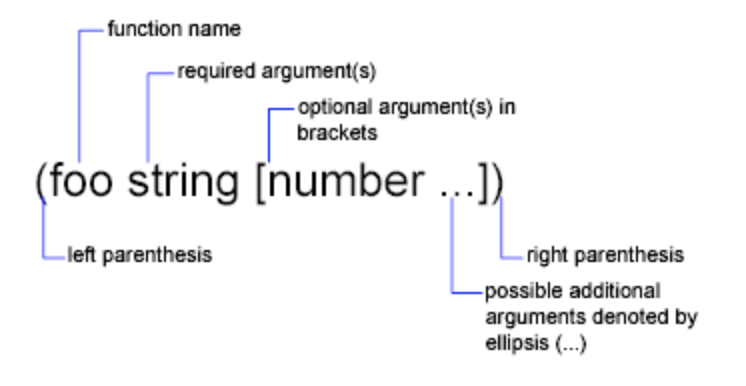
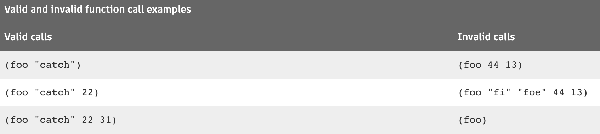

# 0103. About AutoLISP Basics (AutoLISP)

You can use number, string, and list-handling functions to customize AutoCAD.

The following links introduce the basic concepts of the AutoLISP ® programming language. It describes the core components and data types used in AutoLISP, and presents examples of simple number-, string-, output-, and list-handling functions.

AutoLISP code does not need to be compiled, so you can enter the code at a Command line and immediately see the results.

## 01. About Expressions (AutoLISP)

An expression is the basic structure that is used when working with AutoLISP.

AutoLISP expressions have the following form:

(function arguments)

Each expression:

1. Begins with an open (left) parenthesis.

2. Consists of a function name and optional arguments for that function. Each argument can also be an expression.

3. Ends with a close (right) parenthesis.

4. Returns a value that can be used by a surrounding expression. The value of the last interpreted expression is returned to the calling expression.

For example, the following code example involves three functions:

    (fun1 (fun2 arguments)(fun3 arguments))

The first function, fun1, has two arguments, which in this example are expressions. The values returned by the expressions are used by fun1. The other functions, fun2 and fun3, each have one argument. AutoLISP evaluates the innermost expression first, working its way outward. For this example, expressions containing fun2 and fun3 are evaluated before fun1.

The following example shows the use of the * (multiplication) function, which accepts one or more numbers as arguments:

    (* 2 27)

54

Because this code example has no surrounding expression, AutoLISP returns the result to the window from which you entered the code.

Expressions nested within other expressions return their result to the surrounding expression.

The following example uses the result from the + (addition) function as one of the arguments for the * (multiplication) function.

    (* 2 (+ 5 10))

30

In the previous example, (+ 5 10) returns a value of 15. After the innermost expression is evaluated, the AutoLISP interpreter sees the following:

    (* 2 15)

30

### Entering AutoLISP Expressions

AutoLISP expressions can be entered directly at the AutoCAD Command prompt, loaded with an AutoLISP source (LSP) file, or the Visual LISP Editor (Windows only). When you type an open (left) parenthesis, you indicate to AutoCAD that the following text should be passed to the AutoLISP interpreter for evaluation.

If you enter the incorrect number of close (right) parentheses, AutoLISP displays the following prompt:

    (_>

The number of open parentheses in this prompt indicates how many levels of open parentheses remain unclosed. If this prompt appears, you must enter the required number of close parentheses for the expression to be evaluated.

    (* 2 (+ 5 10
    ((_> ) )

30

A common mistake is to omit the closing quotation mark (") in a text string, in which case the close parentheses are interpreted as part of the string and have no effect in resolving the open parentheses. To correct this condition, press Shift+Esc to cancel the function, then re-enter it correctly.

## 02. About Function Syntax (AutoLISP)

Reference topics in the documentation use a consistent convention to describe the proper syntax for an AutoLISP function.

The syntax used is as follows:



In this example, the foo function has one required argument, string of the string data type, and one or more optional arguments of numeric value for number. The number arguments can be of the integer or real data types. Frequently, the name of the argument indicates the expected data type. The examples in the following table show both valid and invalid calls to the foo function.



## 03. About Data Types (AutoLISP)

AutoLISP expressions are processed according to the order and data type of the code within the parentheses. Before you can fully utilize AutoLISP, you must understand the differences among the data types and how to use them.

### 1. About Integers (AutoLISP)

Integers are whole numbers; numbers that do not contain a decimal point.

AutoLISP integers are 32-bit signed numbers with values ranging from +2,147,483,647 to -2,147,483,648. Some functions through, only accept 16-bit numbers ranging from +32767 to -32678. When you explicitly use an integer, that value is known as a constant. Numbers such as 2, -56, and 1,200,196 are valid integers.

If you enter a number that is greater than the maximum integer allowed (resulting in integer overflow), AutoLISP converts the integer to a real number. However, if you perform an arithmetic operation on two valid integers, and the result is greater than the maximum allowable integer, the resulting number will be invalid.

The following examples demonstrate how AutoLISP handles integer overflow.

The largest positive integer value retains its specified value:

    (setq int1 2147483647)

2147483647

If you enter an integer that is greater than the largest allowable value, AutoLISP returns the value as a real:

    (setq int2 2147483648)

2.14748e+009

An arithmetic operation involving two valid integers, but resulting in integer overflow, produces an invalid result:

    (setq int3 (+ 2147483646 3))

-2147483647

In the previous example the result is clearly invalid, as the addition of two positive numbers results in a negative number. But note how the following operation produces a valid result:

    (setq int4 (+ 2147483648 2))

2.14748e+009

In this instance, AutoLISP converts 2147483648 to a valid real before adding 2 to the number. The result is a valid real. The largest negative integer value retains its specified value:

    (setq int5 -2147483647)

-2147483647

If you enter a negative integer larger than the greatest allowable negative value, AutoLISP returns the value as a real:

    (setq int6 -2147483648)

-2.14748e+009

The following operation concludes successfully, because AutoLISP first converts the overflow negative integer to a valid real:

    (setq int7 (- -2147483648 1))

-2.14748e+009

### 2. About Reals (AutoLISP)

A real is a number containing a decimal point. Numbers between -1 and 1 must contain a leading zero.

Real numbers are stored in double-precision floating-point format, providing at least 14 significant digits of precision. Note that AutoLISP does not show you all the significant digits.

Reals can be expressed in scientific notation, which has an optional e or E followed by the exponent of the number (for example, 0.0000041 is the same as 4.1e-6). Numbers such as 3.1, 0.23, -56.123, and 21,000,000.0 are all valid AutoLISP real numbers.

### 3. About Strings (AutoLISP)

A string is a group of characters surrounded by quotation marks. Within quoted strings the backslash (\) character allows control characters (or escape codes) to be included. When you explicitly use a quoted string in an AutoLISP expression, that value is known as a literal string or a string constant.

Examples of valid strings are “string 1” and “\nEnter first point:”.

### 4. About Lists (AutoLISP)

A list is a group of related values separated by spaces and enclosed in parentheses.

Lists provide an efficient method of storing numerous related values. After all, LISP is so-named because it is the LISt Processing language. Once you understand the power of lists, you will find that you can create more powerful and flexible applications. Lists are used to represent 2D and 3D coordinate values, and entity data.

Examples of lists are (1.0 1.0 0.0), ("this" "that" "the other"), and (1 . "ONE").

AutoLISP provides many functions for working with lists. The following are some of the most commonly used functions:

1. list - Creates a new list with any number of values.

2. append - Appends values to an existing list, and returns a new list.

3. cons - Adds an element to the beginning of a list, or constructs a dotted list.

4. length - Returns an integer indicating the number of elements in a list.

5. assoc - Searches an association list for an element and returns that association list entry.

6. car - Returns the first element of a list.

7. cdr - Returns a list containing all but the first element of the specified list.

8. nth - Returns the nth element of a list.

9. subst - Searches a list for an old item and returns a copy of the list with a new item substituted in place of every occurrence of the old item.

#### Creating a List

The list function provides a simple method of grouping related items. These items do not need to be of similar data types and can even be other lists. The following code groups three items as a list:

    (setq lst1 (list 1.0 "One" 1))

(1.0 "One" 1)

A list can also be created using the quote (or ' ) function.

    (setq lst1 '(1.0 "One" 1))

(1.0 "One" 1)

#### Adding to or Changing an Item in a List

The append function allows you to add new items to the end of a list, and the cons function allows you to add new items to the beginning of a list. The subst function can be used to substitute a new item for every occurrence of an old item. These functions do not modify the original list; they return a modified list. If you need to modify the original list, you explicitly replace the old list with the new list.

The append function takes any number of lists and runs them together as one list. Therefore, all arguments to this function must be lists. The following code adds another "One" to the list stored in lst1.

    (setq lst2 (append lst1 '("One")))

(1.0 "One" 1 "One")

1『(setq lst1 (append lst1 '("One"))) 的话就相当于修改 lst1。』

The cons function combines a single element with a list. You can add another string "One" to the beginning of a list, lst2, with the cons function.

    (setq lst3 (cons "One" lst2 ))

("One" 1.0 "One" 1 "One")

You can substitute all occurrences of an item in a list with a new item using the subst function. The following code replaces all strings "One" with the string "one".

    (setq lst4 (subst "one" "One" lst3))

("one" 1.0 "one" 1 "one")

#### Retrieving an Item from a List

You can retrieve a specific item from a list with the nth function. This function accepts two arguments. The first argument is an integer that specifies which item to return. Lists start with a 0 index. A 0 specifies the first item in a list, 1 specifies the second item, and so on. The second argument is the list itself. The following code returns the second item in lst1.

    (nth 1 lst1)

"One"

The car function returns the first item of a list. For example:

    (car lst1)

1.0

The cdr function returns all items from a list as a new list, except the first item. For example:

    (cdr lst1)

("One" 1)

AutoLISP also offers a number of additional functions that are variations of the car and cdr functions. For example, the cadr function returns the second element of a list and the caddr function returns the third item of a list. The cadr function is like using the cdr function on a list and then car on the resulting list.

    (cadr lst1)

"One"

    (car (cdr lst1))

"One"

### 5. About Selection Sets (AutoLISP)

Selection sets are groups of one or more objects (entities). You can interactively add objects to, or remove objects from, selection sets with AutoLISP routines.

The following example uses the ssget function to return a selection set containing all the objects in a drawing.

    (ssget "X")

<Selection set: 1>

1『上面的命名目前没有弄清楚。』

### 6. About Entity Names (AutoLISP)

An entity name is a numeric label assigned to objects in a drawing.

It is actually a pointer into a file maintained by AutoCAD, and can be used to find the object's database record and its vectors (if they are displayed). This label can be referenced by AutoLISP functions to allow selection of objects for processing in various ways. Internally, AutoCAD refers to objects as entities.

Note: You can use the vlax-ename->vla-object function to convert an entity name to a VLA-object when working with ActiveX functions. The vlax-vla-object->ename function converts a VLA-object to an entity name.

The following functions are useful when working with entity names:

1. entget - Retrieves an object's (entity's) definition data.

2. entlast - Returns the name of the last non-deleted main object (entity) in the drawing.

3. ssname - Returns the object (entity) name of the indexed element of a selection set.

4. entsel - Prompts the user to select a single object (entity) by specifying a point.

5. nentsel - Prompts the user to select an object (entity) by specifying a point, and provides access to the definition data contained within a complex object.

6. nentselp - Provides similar functionality to that of the nentsel function without the need for user input.

7. handent - Returns an object (entity) name based on its handle.

The following example uses the entlast function to get the name of the last object created in the drawing.

    (entlast)

<Entity name: 27f0540>

Entity names assigned to objects in a drawing are only in effect during the current editing session. The next time you open the drawing, AutoCAD assigns new entity names to the objects. You can use an object's handle to refer to it from one editing session to another.

### 7. About VLA-objects (AutoLISP/ActiveX)

Objects in a drawing can be represented as ActiveX (VLA) objects.

Note: AutoCAD for Mac does not support ActiveX.

When working with ActiveX methods and properties, you must refer to VLA-objects, not the ename pointer returned by functions such as entlast. VLA-objects can be converted to an ename pointer with vlax-vla-object->ename. You can also use vlax-ename->vla-object to convert an ename pointer to a VLA-object.

2『VLA-object 的概念去多了解下。』

### 8. About File Descriptors (AutoLISP)

A file descriptor is a pointer to a file opened by the AutoLISP open function.

The open function returns this pointer as an alphanumeric label. You supply the file descriptor as an argument to other AutoLISP functions that read, write, or close the file.

You use the following functions when working with a file:

1. open - Opens a file for access by the AutoLISP I/O functions.

2. write-line - Writes a string to the screen or to an open file.

3. write-char - Writes one character to the screen or to an open file.

4. read-line - Reads a string from the keyboard or from an open file, until an end-of-line marker is encountered.

5. read-char - Returns the decimal ASCII code representing the character read from the keyboard input buffer or from an open file.

6. print – Prints an expression to the command line or writes an expression to an open file.

7. prin1 – Prints an expression to the command line or writes an expression to an open file.

8. close – Closes a file opened with the open function.

The following example opens the myinfo.dat file for reading. The open function returns a file descriptor which is stored in the file1 variable:

    (setq file1 (open "c:\\myinfo.dat" "r"))
    #<file "c:\\myinfo.dat">

Files remain open until you explicitly close them in your AutoLISP program. The close function closes a file. The following code closes the file whose file descriptor is stored in the file1 variable:

    (close file1)

nil

## 04. About Source Code Files (AutoLISP)

Although you can enter AutoLISP code at the AutoCAD Command prompt or Visual LISP Console window prompt (Windows only), any functions you define are lost when you close the drawing or session they were created in.

AutoLISP source code can be saved to an ASCII text file with a .lsp extension. Saving AutoLISP source code to a file has the following advantages:

1. Programs are not lost when the drawing they are defined in is closed.

2. Programs can be used in more than one drawing and can be executed on multiple machines.

3. Programs can be shared with others in your organization.

4. Testing and debugging multiple expressions is considerably easier.

AutoLISP source code can also be stored in files with a .mnl extension. A Menu AutoLISP (MNL) file contains custom functions and commands that are required for the elements defined in a customization (CUIx) file. A MNL file is loaded automatically when it has the same name as a customization (CUIx) file that is loaded into the AutoCAD-based product.

For example, on Windows, when acad.cuix is loaded, the file named acad.mnl is also loaded if it is found in one of the folders listed as part of the AutoCAD Support File Search Path. If a CUIx file does not have a corresponding MNL file, no error is displayed, the product just moves and loading other support files.

Note: While AutoLISP source code is commonly saved in files with a .lsp or .mnl extension, AutoLISP code can be loaded from any ASCII text file.

#### Topics in this section

1. About Formatting and Spaces in Code (AutoLISP)

    AutoLISP code can span multiple lines, and contain empty lines and extra spaces. Empty lines and extra spaces do not have any significant meaning, but can make your code easier to read.

2. About Comments in AutoLISP Program Files (AutoLISP)

    Comments are useful to both the programmer and future users who may need to revise a program to suit their needs.

3. To Create and Open AutoLISP Source Code Files (AutoLISP)

    AutoLISP source code files can be created and edited using a plain ASCII text editor.

### 1. About Formatting and Spaces in Code (AutoLISP)

AutoLISP code can span multiple lines, and contain empty lines and extra spaces. Empty lines and extra spaces do not have any significant meaning, but can make your code easier to read.

Multiple spaces between function and variable names, and constants are equivalent to a single space. The end of a line and tab is also treated as a single space. The following two expressions produce the same result:

```
(setq test1 123 test2 456)

(setq
  test1 123
  test2 456
)
```

The extensive use of parentheses in AutoLISP code can make it difficult to read. The traditional techniques for combatting this confusion is indentation, and to align the open and close parentheses of a function. The more deeply nested a line of code is, the farther to the right the line is positioned.

The following two functions are the same code, but the second one is much easier to read and determine visually if the parentheses of the AutoLISP expressions are balanced.

```
(defun c:mycmd ()
(setq old_clayer (getvar "clayer"))
(setq insPt (getpoint "\nSpecify text insertion: "))
(if (/= insPt nil)
(progn
(command "_.UNDO" "_BE")
(command "._-LAYER" "_M" "Text" "_C" "3" "" "")
(command "_.-TEXT" insPt "" "0" "Sample Text")
(command "_.UNDO" "_E")))
(setvar "clayer" old_clayer)
(princ)
)

(defun c:mycmd ()
  (setq old_clayer (getvar "clayer"))

  (setq insPt (getpoint "\nSpecify text insertion: "))

  (if (/= insPt nil)
    (progn
      (command "_.UNDO" "_BE")
      (command "._-LAYER" "_M" "Text" "_C" "3" "" "")
      (command "_.-TEXT" insPt "" "0" "Sample Text")
      (command "_.UNDO" "_E")
    )
  )

  (setvar "clayer" old_clayer)
 (princ)
)
```

### 2. About Comments in AutoLISP Program Files (AutoLISP)

Comments are useful to both the programmer and future users who may need to revise a program to suit their needs.

It is good coding practice to include comments in all AutoLISP program files, small and large. Use comments to do the following:

1. Give a title, authorship, and creation date.

2. Provide instructions on using a routine.

3. Make explanatory notes throughout the body of a routine.

4. Make notes to yourself during debugging.

Comments begin with one or more semicolons ( ; ) and continue through the end of the line.

```
; This entire line is a comment
(setq area (* pi r r)) ; Compute area of circle
```

Any text within ;| ... |; is ignored. Therefore, comments can be included within a line of code or extend for multiple lines. This type of comment is known as an in-line comment.

    (setq tmode ;|some note here|; (getvar "tilemode"))

The following example shows a comment that continues across multiple lines:

```
(setvar "orthomode" 1) ;|comment starts here
and continues to this line,
but ends way down here|; (princ "\nORTHOMODE set On.")
```

### 3. To Create and Open AutoLISP Source Code Files (AutoLISP)

AutoLISP source code files can be created and edited using a plain ASCII text editor.

#### 01. Create a new source code file

#### Windows

1. Do one of the following:

- On Windows 7, click Start  [All] Programs  Accessories  Notepad.

- On Windows 8 and Windows 8.1, Start Screen, type notepad. Click Notepad.

- On Windows 10, click Start  All Apps  Windows Accessories  Notepad.

2. In Notepad, click File  Save As.

3. In the Save As dialog box, click the Save As Type drop-down list and select All Files (*.*).

4. Specify a location for the file and enter a name in the File Name box. Add .lsp after the file name and click Save.

#### Mac OS

1. In Finder, click Go  Applications.

2. In the Applications window, double-click TextEdit.

3. In TextEdit, if you see the ruler and formatting bar along the top of the window, do the following:

- Click TextEdit  Preferences.

- In Preferences, Format, click Plain Text. Click Close.

- Click File  New.

4. Click File  Save As.

5. In the Save As dialog box, specify a location for the file and enter a name in the Save As box. Add .lsp after the file name and click Save.

6. In the Extension dialog box, click Use .LSP.

#### 02. Open an existing source code file

## 05. About Variables (AutoLISP)

Variables are used to store a value or list of values in memory.

The data type of a variable is determined when a value is assigned. Variables retain their value until a new value is assigned or the variable goes out of scope. The scope of a variable can either be global or local. Global variables are accessible by any AutoLISP program that is loaded into a drawing, while local variables are only available within a specific function or command. You use the AutoLISP setq function to assign values to variables.

The syntax of the setq function is as follows:

    (setq variable_name1 value1 [variable_name2 value2 ...])

The setq function assigns the specified value to the variable name given, and returns the last assigned value as its function result. The following example creates two variables: val and abc. val is assigned the value of 3, while abc is assigned the value of 3.875.

    (setq val 3 abc 3.875)

3.875

The following example creates a variable named layr and assigns it the value of “EXTERIOR-WALLS”.

    (setq layr "EXTERIOR-WALLS")

"EXTERIOR-WALLS"

#### Using a Variable with a Function

Once a value is assigned to a variable, it can be used in an expression as the value for an argument of a function. The following uses two of the previously created variables in a few AutoLISP expressions to create a layer and draw a line with a specific length at 0 degrees.

```
(command "_.-layer" "_make" layr "")
(command "_.line" PAUSE (strcat "@" (itoa val) "<0") "")
```

#### Checking the Value of a Variable

You can use the following methods to determine the current value of a variable:

At the AutoCAD Command prompt, add an ! (exclamation point) in front of the variable and press Enter.

Command: (setq val 3 abc 3.875)

3.875

Command: !val

3

At the Visual LISP Console Window prompt, enter the name of the variable and press Enter. (Windows only).

    _$ (setq val 3 abc 3.875)

3.875

    _$ val

3

At the AutoCAD Command prompt or Visual LISP Console Window prompt (Windows only), or in an AutoLISP program, create an expression that uses the princ function and pass it the name of the variable. You should also follow the first expression with a second expression that uses the princ function, but do not pass it an argument to suppress the return value of the first princ function.

Command: (setq val 3 abc 3.875)

3.875

Command: (princ val)(princ)

3

Note: If you do not add the second expression in the above example, a value of 33 appears to be returned. The first 3 is the desired output of the princ function, while the second 3 is the result of the value returned by the princ function. Remember that AutoLISP returns the value of the last function evaluated. In the previous example, no value is returned by the second princ because no argument was provided.

1『autolisp 必定返回最后一个函数计算后的值。』

### 1. About Nil Variables (AutoLISP)

A variable that has not been assigned a value has a default value of nil.

This is different from blank, which is considered a character string, and different from 0, which is a number. So, in addition to checking a variable for its current value, you can test to determine if the variable has been assigned a value.

Each variable consumes a small amount of memory, so it is good programming practice to reuse variable names or set variables to nil when their values are no longer needed. Setting a variable to nil releases the memory used to store that variable's value. If you no longer need the val variable, you can release its value from memory with the following expression:

    (setq val nil)

nil

Another efficient programming practice is to use local variables whenever possible.

### 2. About Predefined Variables (AutoLISP)

AutoLISP has several predefined variables that can be used with your custom functions and commands.

You can change the value of these variables with the setq function. However, other applications might rely on their values being consistent; therefore, it is recommended that you do not modify these variables.

The following variables are predefined for use with AutoLISP applications:

1. PAUSE - Defined as a constant string of a double backslash (\\) character. This variable is used with the command function to pause for user input.

2. PI - Defined as the constant p (pi). It evaluates to approximately 3.14159.

3. T - Defined as the constant T. This is used as a non-nil value.

Note: Visual LISP, by default, protects these variables from redefinition. You can override this protection through the Visual LISP Symbol Service feature or by setting a Visual LISP environment option. Visual LISP is available on Windows only.

## 06. About Number Handling (AutoLISP)

AutoLISP provides functions for working with integers and real numbers.

In addition to performing basic and complex mathematical computations, you can use the number-handling functions to help you in your daily use of AutoCAD. If you are drawing a steel connection detail that uses a 2.5" bolt with a diameter of 0.5" and has 13 threads per inch, you could calculate the total number of threads for the bolt by multiplying 2.5 by 13. In AutoLISP, this is done with the multiplication ( * ) function. Remember, the name of a function comes before the arguments you are passing to a function.

    (* 2.5 13)

32.5

The arithmetic functions that have a number argument (as opposed to num or angle, for example) return different values if you provide integers or reals as arguments. If all arguments are integers, the value returned is an integer. However, if one or all the arguments are reals, the value returned is a real.

    (/ 12 5)

2

    (/ 12.0 5)

2.4

## 07. About Strings and String Handling (AutoLISP)

A string is a group of characters surrounded by quotation marks. Within quoted strings the backslash (\) character allows control characters (or escape codes) to be included.

When you explicitly use a quoted string in AutoLISP, that value is known as a literal string or a string constant.

Examples of valid strings are “string 1” and “\nEnter first point:”.

AutoLISP provides many functions for working with string values. The following are some of the most commonly used functions:

1. strcat – Returns a string that is the concatenation of multiple strings.

2. strcase – Returns a string where all alphabetic characters have been converted to uppercase or lowercase.

3. strlen – Returns an integer that is the number of characters in a string.

4. substr – Returns a substring of a string.

5. vl-string-search – Searches for the specified pattern in a string.

6. vl-string-subst – Substitutes one string for another, within a string.

### 1. Convert the Case of a String

The alphabetic characters of a string can be converted to uppercase or lowercase with the strcase function. It accepts two arguments: a string and an optional argument that specifies the case in which the characters are returned. If the optional second argument is omitted, it evaluates to nil and strcase returns the characters converted to uppercase.

    (strcase "This is a TEST.")

"THIS IS A TEST."

If you provide a second argument of T, the characters are returned as lowercase.

    (strcase "This is a TEST." T)

"this is a test."

Note: The predefined variable T is often used to represent a True value when a function returns or excepts a True/False value. A nil value is used to represent a False value in these conditions.

1『strcase 函数，一般是传递进 2 个参数，第一个参数是要处理的字符串；第二个参数决定如何处理，不输入的话默认为 nil，全大写，输入 T 的话代表 True，全小写。』

### 2. Combine Multiple Strings

You can combine multiple strings into a single string value with the strcat function. This is useful for placing a variable string within a constant string, such as an error message or note in a drawing. The following code example sets a variable to a string value and then uses strcat to insert that string between two other strings.

    (setq str "BIG")

    (setq bigstr (strcat "This is a " str " test."))

"This is a BIG test."

### 3. Return a Substring of a String

The substr function allows you to return a portion of a string. This function requires two arguments and has one optional argument. The first argument is a string and the second argument is an integer that represents the start character of the string that you want to return as the substring. If the third argument is not provided, substr returns all characters including and following the specified start character.

    (substr "Welcome to AutoLISP" 12)

"AutoLISP"

If want to return a substring that is at the beginning or middle of the string provided to the substr function, you can specify an integer for the third argument that represents the number of characters that should be returned. For example, the following example code returns the first 7 characters of the provided string:

    (substr "Welcome to AutoLISP" 1 7)

"Welcome"

Often, when working with a string you might not know how long it is but might know the start position of the substring you want to return. The strlen function returns the number of characters (including spaces) in a string.

    (setq filnam "bigfile.txt")
    (strlen filnam)

11

The following example code returns all the characters in a filename except the last four (the period and the three-letter extension). This is done by using strlen to get the length of the string and subtract 4 from that value. Then substr is used to specify the first character of the substring and its length.

    (setq newlen (- (strlen filnam) 4))

7

    (substr filnam 1 newlen)

"bigfile"

1『上面的方法可以获得一个文件的文件名。』

You can combine the two previous lines of code into one if you do not need the length of the string stored in the newlen variable for other functions.

    (substr filnam 1 (- (strlen filnam) 4))

"bigfile"

### 4. Find and Replace Text in a String

Finding and replacing text can be helpful in updating notes or part numbers. The vl-string-search function allows you to locate a pattern within a string, and return the start position as an integer of the first instance of the specified pattern. If the function returns an integer, you can then use that as the starting position for another search to make sure there is not more than one instance of the pattern in the string.

The vl-string-subst function can be used to replace text within a string. Similar to the vl-string-search function, it can only identify the first instance of a specified pattern. You can use the vl-string-search function after replacing a text string to see if another instance of a pattern is contained in the string returned by vl-string-subst.

1『可以两个函数结合起来用遍历的方法全部替换。』

The following code examples find and replace the text [WIDTH] in a string.

    (setq note "All door openings are [WIDTH] unless otherwise noted.")

"All door openings are [WIDTH] unless otherwise noted."

    (setq position (vl-string-search "[WIDTH]" note))

22

    (setq revised-note (vl-string-subst "36\"" "[WIDTH]" note position))

"All door openings are 36\" unless otherwise noted."

    (prompt revised-note)(princ)

All door openings are 36" unless otherwise noted.

## 08. About List Handling (AutoLISP)

AutoLISP provides functions for working with lists. This section provides examples of the append, assoc, car, cons, list, nth, and subst functions. A summary of all list-handling functions is in AutoLISP Function Synopsis (AutoLISP), under the heading List Manipulation Functions(AutoLISP).

Lists provide an efficient and powerful method of storing numerous related values. After all, LISP is so-named because it is the LISt Processing language. Once you understand the power of lists, you'll find that you can create more powerful and flexible applications.

Several AutoLISP functions provide a basis for programming two-dimensional and three-dimensional graphics applications. These functions return point values in the form of a list.

The list function provides a simple method of grouping related items. These items do not need to be of similar data types. The following code groups three related items as a list:

    (setq lst1 (list 1.0 "One" 1))

(1.0 "One" 1)

You can retrieve a specific item from the list in the lst1 variable with the nth function. This function accepts two arguments. The first argument is an integer that specifies which item to return. A 0 specifies the first item in a list, 1 specifies the second item, and so on. The second argument is the list itself. The following code returns the second item in lst1.

    (nth 1 lst1)

"One"

The cdr function returns all elements, except the first, from a list. For example:

    (cdr lst1)

("One" 1)

The car function provides another way to extract items from a list. For more examples using car and cdr, and combinations of the two, see About Point Lists (AutoLISP).

Three functions let you modify an existing list. The append function returns a list with new items added to the end of it, and the cons function returns a list with new items added to the beginning of the list. The subst function returns a list with a new item substituted for every occurrence of an old item. These functions do not modify the original list; they return a modified list. To modify the original list, you must explicitly replace the old list with the new list.

The append function takes any number of lists and runs them together as one list. Therefore, all arguments to this function must be lists. The following code adds another "One" to the list lst1. Note the use of the quote (or ' ) function as an easy way to make the string "One" into a list.

    (setq lst2 (append lst1 '("One")))

(1.0 "One" 1 "One")

The cons function combines a single element with a list. You can add another string "One" to the beginning of this new list, lst2, with the cons function.

    (setq lst3 (cons "One" lst2 ))

("One" 1.0 "One" 1 "One")

You can substitute all occurrences of an item in a list with a new item with the subst function. The following code replaces all strings "One" with the string "one".

    (setq lst4 (subst "one" "One" lst3))

("one" 1.0 "one" 1 "one")

### 1. About Point Lists (AutoLISP)

AutoLISP utilizes the list data type to represent graphical coordinate values.

Points are expressed as lists with either two or three numerical values.

1. 2D point - List with two integer or real numbers, (X and Y, respectively), as in (3.4 7.52).

2. 3D point – List with three integer or real numbers, (X, Y, and Z, respectively), as in (3.4 7.52 1.0).

You can use the list function to form point lists, as shown in the following examples:

    (list 3.875 1.23)

(3.875 1.23)

    (list 88.0 14.77 3.14)

(88.0 14.77 3.14)

To assign particular coordinates to a point variable, you can use one of the following expressions:

    (setq pt1 (list 3.875 1.23))

(3.875 1.23)

    (setq pt2 (list 88.0 14.77 3.14))

(88.0 14.77 3.14)

    (setq abc 3.45)

3.45

    (setq pt3 (list abc 1.23))

(3.45 1.23)

The latter uses the value of variable abc as the X component of the point list. If all members of a list are constant values, you can use the quote function to explicitly define the list, rather than the list function. The quote function returns an expression without evaluation, as follows:

    (setq pt1 (quote (4.5 7.5)))

(4.5 7.5)

The single quotation mark ( ' ) can be used as shorthand for the quote function. The following code produces the same result as the preceding code.

    (setq pt1 '(4.5 7.5))

(4.5 7.5)

The quote and (‘) functions cannot be used to create a list using values that are stored in a variable. The following code does not return the excepted results:

    (setq abc 3.45)

3.45

    (setq pt4 (quote abc 1.23))

; error: syntax error

1『这里终于弄明白 quote (‘) 与使用 list 的区别，简化函数是有条件的，只能是常数，而不能传入变量。』

#### Retrieve the X, Y, and Z components of a point list

You can retrieve the X, Y, and Z components of a point list using three additional built-in functions; car, cadr, and caddr. The following code examples show how to retrieve values from a 3D point list. The pt variable is set to the point 1.5,3.2,2:

    (setq pt '(1.5 3.2 2.0))

(1.5 3.2 2.0)

The car function returns the first member of a list. In this example, it returns the X value of the point list to the x_val variable.

    (setq x_val (car pt))

1.5

The cadr function returns the second member of a list. In this example it returns the Y value of the point list to the y_val variable.

    (setq y_val (cadr pt))

3.2

The caddr function returns the third member of a list. In this example it returns the Z value of the point list to the z_val variable.

    (setq z_val (caddr pt))

2.0

You can use the following code to define the lower-left and upper-right (pt1 and pt2) corners of a rectangle, as follows:

    (setq pt1 '(1.0 2.0) pt2 '(3.0 4.0))

(3.0 4.0)

You can use the car and cadr functions to set the pt3 variable to the upper-left corner of the rectangle, by extracting the X component of pt1 and the Y component of pt2, as follows:

    (setq pt3 (list (car pt1) (cadr pt2)))

(1.0 4.0)

The preceding statement sets pt3 equal to point (1.0, 4.0).

AutoLISP supports combinations of the car and cdr functions up to four levels deep. Some examples of these functions are caaaar and cadr. Each a represents a call to car and each d represents a call to cdr. For example:

```
(caar x)    is equivalent to  (car (car x)) 
(cdar x)    is equivalent to  (cdr (car x)) 
(cadar x)   is equivalent to  (car (cdr (car x)))
(cadr x)    is equivalent to  (car (cdr x)) 
(cddr x)    is equivalent to  (cdr (cdr x)) 
(caddr x)   is equivalent to  (car (cdr (cdr x)))
```

### 2. About Dotted Pairs (AutoLISP)

Dotted pair lists must always contain two members and is the method AutoLISP uses to maintain entity definition data.

When representing a dotted pair, members of the list are separated by a period ( . ). Most list-handling functions do not accept a dotted pair as an argument, so you should be sure you are passing the right kind of list to a function.

Dotted pairs are an example of an "improper list." An improper list is one in which the last cdr is not nil. In addition to adding an item to the beginning of a list, the cons function can create a dotted pair. If the second argument to the cons function is anything other than another list or nil, it creates a dotted pair.

    (setq sublist (cons 'lyr "WALLS"))

(LYR . "WALLS")

The following functions are useful for handling dotted pairs:

1. car - Returns the first member of the specified dotted pair.

2. cdr - Returns the second member of the specified dotted pair.

3. assoc - Searches an association list for a member and returns that association list entry.

4. nth - Returns the nth element of a list.

The following code creates an association list of dotted pairs:

    (setq wallinfo (list sublist (cons 'len 240.0) (cons 'hgt 96.0)))

((LYR . "WALLS") (LEN . 240.0) (HGT . 96.0))

The assoc function returns a specified list from within an association list regardless of the specified list's location within the association list. The assoc function searches for a specified key element in the lists and returns the first instance, as follows:

    (assoc 'len wallinfo)

(LEN . 240.0)

    (cdr (assoc 'lyr wallinfo))

"WALLS"

    (nth 1 wallinfo)

(LEN . 240.0)

    (car (nth 1 wallinfo))

LEN

## 09. About Basic Output Functions (AutoLISP)

AutoLISP includes functions for controlling the AutoCAD display, including both text and graphics windows. Some functions also display information in the Visual LISP Console window. The major text display functions are:

- prin1

- princ

- print

- prompt

These functions are discussed in the following linked topics. The remaining display functions are covered in About Using AutoLISP to Communicate with AutoCAD (AutoLISP), beginning with the About Display Control (AutoLISP) topic.

### 1. About Displaying Messages (AutoLISP)

AutoLISP programs often need to inform the user of an error or request for input.

Messages that are displayed should try and not interrupt the flow of a command, and when they do the text displayed should be short and precise as to what the problem is or the input that is being requested. AutoLISP offers the following functions to display messages to the user:

1. prompt - Displays string at the AutoCAD Command prompt.

2. princ - Displays a value at the AutoCAD Command prompt or to an open file. Strings are displayed without the enclosing quotation marks.

3. prin1 - Displays a value at the AutoCAD Command prompt or to an open file. Strings are enclosed in quotation marks.

4. print - Displays a value at the AutoCAD Command prompt or to an open file, but a blank line is placed before the value and a space is placed after the value. Strings are enclosed in quotation marks.

5. alert - Displays a dialog box containing an error or warning message.

6. terpri - Prints a newline to the AutoCAD Command prompt.

The write-char, write-line, getXXX, and entsel functions can also display messages at the AutoCAD Command prompt.

When entered from the Visual LISP Console window prompt, the prompt function displays a message (a string) in the AutoCAD Command window and returns nil to the Visual LISP Console window. The princ, prin1, and print functions all display a value (not necessarily a string) in the AutoCAD Command prompt and returns the value to the Visual LISP Console window.

Note: Visual LISP is available on Windows only.

The following examples demonstrate the differences between the basic output functions and how they handle the same string of text.

    (setq str "The \"allowable\" tolerance is \261 \274\"")

    (prompt str)

outputs The "allowable" tolerance is 1/4"

returns nil

    (princ str)

outputs The "allowable" tolerance is 1/4"

returns "The \"allowable\" tolerance is 1/4\""

    (prin1 str)

outputs "The \"allowable\" tolerance is 1/4""

returns "The \"allowable\" tolerance is 1/4\""

    (print str)

outputs<blank line> "The \"allowable\" tolerance is 1/4""<space>

returns "The \"allowable\" tolerance is 1/4\""

### 2. About Exiting a Function Quietly (AutoLISP)

If you invoke the princ function without passing an expression to it, it displays nothing and has no value to return.

So if you add a call to princ without any arguments, after an expression, there is no return value. This is a great way to suppress the nil that is often returned by the last expression within a custom function. This practice is called exiting quietly.

### 3. About Control Characters in Strings (AutoLISP)

Within quoted string values, the backslash (\) character allows control characters (or escape codes) to be included.

The following lists the currently recognized control characters:

图图

The prompt, princ, and getXXX functions expand the control characters in a string and display the expanded string at the AutoCAD Command prompt.

The following example shows displaying a backslash character (\) and quotation mark (") within a quoted string:

    (princ "The \"filename\" is: D:\\ACAD\\TEST.TXT.")

The "filename" is: D:\ACAD\TEST.TXT

Text can be forced across multiple lines with the newline character (\n).

    (prompt "An example of the \nnewline character. ")

An example of the

newline character.

You can also use the terpri function to cause a line break.

The Return character (\r) returns to the beginning of the current line. This is useful for displaying incremental information (for example, a counter showing the number of objects processed during a loop).

1『这里直觉是一个关键点，因为跟循环有关，等遇到应用点的时候在反馈回这里。』

A Tab character (\t) can be used in strings to indent or to provide alignment with other tabbed text strings. In this example, note the use of the princ function to suppress the ending nil.

```
(prompt "\nName\tOffice\n- - - - -\t- - - - -
(_> \nSue\t101\nJoe\t102\nSam\t103\n")(princ)

Name Office
- - - - - - - - - -
Sue 101
Joe 102
Sam 103
```

### 4. About Wild-Card Matching (AutoLISP)

A string can be compared to a wild-card pattern with the wcmatch function.

This can be helpful when needing to build a dynamic selection set (in conjunction with ssget) or to retrieve extended entity data by application name (in conjunction with entget). The wcmatch function compares a single string to a pattern. The function returns T if the string matches the pattern, and nil if it does not. The wild-card patterns are similar to the regular expressions used by many system and application programs.

1『直觉这里又是一个关键点。讲的应该就是通配符的知识点。』

The following rules apply to wild-card patterns:

1. Alphabetic characters and numerals are treated literally in the pattern.

2. Brackets can be used to specify optional characters or a range of letters or digits.

3. A question mark ( ? ) matches a single character.

4. An asterisk ( * ) matches a sequence of characters; and, certain other special characters have special meanings within the pattern. When you use the * character at the beginning and end of the search pattern, you can locate the desired portion anywhere in the string.

In the following examples, a string variable called matchme has been declared and initialized:

    (setq matchme "this is a string - test1 test2 the end")

"this is a string - test1 test2 the end"

The following code checks whether or not matchme begins with the four characters "this":

    (wcmatch matchme "this*")

T

The following code illustrates the use of brackets in the pattern. In this case, wcmatch returns T if matchme contains "test4", "test5", "test6" (4-6), or "test9" (note the use of the * character):

    (wcmatch matchme "*test[4-69]*")

nil

In this case, wcmatch returns nil because matchme does not contain any of the strings indicated by the pattern. However, using the pattern "test[4-61]" does match the string because it contains “test1”.

    (wcmatch matchme "*test[4-61]*")

T

The pattern string can specify multiple patterns, separated by commas. The following code returns T if matchme equals "ABC", or if it begins with "XYZ", or if it ends with "end".

    (wcmatch matchme "ABC,XYZ*,*end")

T

1『上面的几个例子还是有待消化，好几个没弄明白。』

## 10. About Equality and Conditional (AutoLISP)

AutoLISP includes functions that provide equality verification as well as conditional branching and looping. The equality and conditional functions are listed in AutoLISP Function Synopsis (AutoLISP), under the heading Equality and Conditional Functions (AutoLISP).

When writing code that checks string and symbol table names, keep in mind that AutoLISP automatically converts symbol table names to upper case in some instances. When testing symbol names for equality, you need to make the comparison insensitive to the case of the names. Use the strcase function to convert strings to the same case before testing them for equality.

## 11. About Symbol and Function Handling (AutoLISP)

AutoLISP provides a number of functions for handling symbols and variables. The symbol-handling functions are listed in AutoLISP Function Synopsis (AutoLISP), under the heading Symbol-Handling Functions (AutoLISP).

AutoLISP provides functions for handling one or more groups of functions. The links in this topic provides examples of the defun function. The remaining function-handling functions are listed in AutoLISP Function Synopsis (AutoLISP), under the heading Symbol-Handling Functions (AutoLISP).

### 1. About Defining a Function (AutoLISP)

You can define your own functions.

Once defined, these functions can be used at the AutoCAD Command prompt, the Visual LISP Console prompt, or within other AutoLISP expressions, just as you use the standard functions.

Note: Visual LISP is available on Windows only.

You can also create your own commands, because commands are just a special type of function. The defun function combines a multiple expressions into a function or command. This function requires at least three arguments:

1. Name of the function (symbol name).

2. Argument list (a list of arguments and local variables used by the function). The argument list can be nil or an empty list ().

3. AutoLISP expressions to execute with the function or command. There must be at least one expression in a function definition.

```
(defun symbol_name ( arguments / local_variables )
  expressions
)
```

1『/ 后面的就代表是局部变量。arguments 准确的翻译即为函数的形参。』

The following example code defines a simple function that accepts no arguments and displays the message “bye” at the AutoCAD Command prompt. Note that the argument list is defined as an empty list (()):

    (defun DONE ( ) (prompt "\nbye! "))

DONE

Once the DONE function is defined, you can use it as you would any other function. For example, the following code prints a message, then says “bye” at the AutoCAD Command prompt:

    (prompt "The value is 127.") (DONE) (princ)

The value is 127

bye!

Note how the previous example invokes the princ function without an argument to suppress an ending nil and achieves a quiet exit.

1『正巧弄明白了为什么语句最后要加 (princ)，是为了消除字符串尾部的「nil」，否则显示出来的尾部就是 bye!nil 了。』

1『这种代码定义出的命令跟我之前想的有出入，只能在源码里调用，在 CAD 里的话必须使用命令：(DONE)』

Functions that accept no arguments may seem useless. However, you might use this type of function to query the state of certain system variables or conditions and to return a value that indicates those values.

1『这应该也是个关键点。』

#### 2. About Compatibility of Defun with Earlier Releases of AutoCAD (AutoLISP)

The internal implementation of defun changed in AutoCAD 2000.

This change is transparent to the great majority of AutoLISP users upgrading from earlier AutoCAD releases. The change only affects AutoLISP code that manipulated defun definitions as a list structure, such as by appending one function to another, as in the following code:

    (append s::startup (cdr mystartup))

For situations like this, you can use defun-q to define your functions. An attempt to use a defun function as a list results in an error. The following example illustrates the error:


    (defun foo (x) 4)

foo

```
(append foo '(3 4))
; error: Invalid attempt to access a compiled function definition.
You may want to define it using defun-q: #<SUBR @024bda3c FOO>
```

The error message alerts you to the possibility of using defun-q instead of defun. The defun-q function is provided strictly for backward compatibility with earlier releases and should not be used for other purposes.

### 3. About C:XXX Functions (AutoLISP)

If an AutoLISP function is defined with a name of the form C:xxx, it can be issued at the AutoCAD Command prompt in the same manner as a built-in AutoCAD command. This is true regardless of whether you define and load the function in VLISP or at the AutoCAD Command prompt. You can use this feature to add new commands to AutoCAD or to redefine existing commands.

1『解答了前面的疑问。这样的话就可以在 CAD 里跟常规命令一样使用了。』

To use functions as AutoCAD commands, be sure they adhere to the following rules:

1. The function name must use the form C:xxx (upper- or lowercase characters). The C: portion of the name must always be present; the XXX portion is a command name of your choice. C:xxx functions can be used to override built-in AutoCAD commands. (See About Redefining AutoCAD Commands [AutoLISP].)

2. The function must be defined with no arguments. However, local variables are permitted and it is a good programming practice to use them.

1『不能有参数。』

A function defined in this manner can be issued transparently from within any prompt of any built-in AutoCAD command, provided the function issued transparently does not call the command function. When issuing a C:xxx defined command transparently, you must precede the XXX portion with a single quotation mark (').

You can issue a built-in command transparently while a C:xxx command is active by preceding it with a single quotation mark ('), as you would with all commands that are issued transparently. However, you cannot issue a C:xxx command transparently while a C:xxx command is active.

Note: When calling a function defined as a command from the code of another AutoLISP function, you must use the whole name, including the parentheses; for example, (C:HELLO). You also must use the whole name and the parentheses when you invoke the function from the VLISP Console prompt.

1『什么情况下用全称命令 (C:DONE) 还需确认。』

#### 01. About Defining Commands (AutoLISP)

New commands can be defined with the defun function and by prefixing a function name with c:.

Functions prefixed with c: can be accessed directly from the AutoCAD Command prompt and used to redefine an AutoCAD command.

Functions that are defined as commands should not accept arguments directly, instead input for a command should be obtained using one of the getXXX functions.

The following defines a function named HELLO. This function displays a simple message.

    (defun HELLO () (princ "\nHello world.") (princ))

HELLO

Functions can be issued from the AutoCAD Command prompt or an AutoLISP program. The HELLO function can be called from the AutoCAD Command prompt by entering the following:

Command: (hello)

Hello world.

The HELLO function must be wrapped in parentheses since it is not defined as a command. Entering HELLO without the parentheses at the AutoCAD Command prompt, returns the following error message:

Unknown command "HELLO". Press F1 for help.

Adding c: to the front of the HELLO function name results in the function being declared as a command, and can then be entered at the AutoCAD Command prompt without being wrapped with parentheses. For example:

    (defun C:HELLO () (princ "\nHello world.") (princ))

C:HELLO

While HELLO is declared as a command, it is also an AutoLISP function as well. The command can now be entered at the AutoCAD Command prompt, as follows:

Command: hello

Hello world.

The HELLO command can also be used transparently because it does not make a call the command function. At the AutoCAD Command prompt, you could do the following:

Command: line

From point: 'hello

Hello world.

From point:

If an AutoLISP function is declared as a command, you can call the command from an AutoLISP program by wrapping the whole function name with parentheses. For example:

(c:hello)

Note: If you are using the Visual LISP Editor in the Windows release, the Console window does not recognize AutoCAD commands. You must wrap the function name with parentheses.

You cannot usually use an AutoLISP statement to respond to prompts from an AutoLISP-implemented command. However, if your AutoLISP routine makes use of the initget function, you can use arbitrary keyboard input with certain functions. This allows an AutoLISP-implemented command to accept an AutoLISP statement as a response. Also, the values returned by a DIESEL expression can perform some evaluation of the current drawing and return these values to AutoLISP.

#### 02. About Redefining AutoCAD Commands (AutoLISP)

Using AutoLISP, you can undefine and replace the functionality of a built-in AutoCAD command.

The UNDEFINE command allows you to disable a built-in AutoCAD command, and then using AutoLISP it can be replaced by defining a user-defined command of the same name with the defun function. A command remains undefined for the current editing session only. The built-in definition of a command can be restored with the REDEFINE command.

You can execute the built-in definition of a command after it has been undefined by specifying its name prefixed with a period (.). For example, if you undefine QUIT, you can access the command by entering .quit at the AutoCAD Command prompt. This is also the syntax that should be used within the AutoLISP command function to make sure your user-defined functions and commands work predictably even if a built-in command has been undefined.

1『命令失效后，如果在命令前面加个 . 还是可以借着用的。』

It is recommended that you protect your menus, scripts, and AutoLISP programs by using the period-prefixed forms of all commands. This ensures that your applications use the built-in command definitions rather than a redefined command.

Consider the following example. Whenever you use the LINE command, you want AutoCAD to remind you about using the PLINE command. You can define the AutoLISP function C:LINE to substitute for the normal LINE command as follows:

```
(defun C:LINE ( )
  (princ "Shouldn't you be using PLINE?\n")
  (command ".LINE")
 (princ)
)
```

C:LINE

In this example, the function C:LINE is designed to issue its message and then to execute the standard LINE command (using .LINE with the command function). Before AutoCAD can use your definition of the LINE command, you must undefine the built-in LINE command. Enter the following to undefine the built-in LINE command:

    (command ".undefine" "line")

After undefining the command and entering line at the AutoCAD Command prompt, AutoCAD uses the C:LINE AutoLISP function:

Command: line

Shouldn't you be using PLINE?

.LINE Specify first point: Specify first point:

The previous code example assumes the CMDECHO system variable is set to 1 (On). If CMDECHO is set to 0 (Off), AutoCAD does not echo prompts during a command function call. The following code uses the CMDECHO system variable to prevent the LINE command prompt from repeating:

```
(defun C:LINE ( / cmdsave )
  (setq cmdsave (getvar "cmdecho"))
  (setvar "cmdecho" 0)
  (princ "Shouldn't you be using PLINE?\n")
  (command ".LINE")
  (setvar "cmdecho" cmdsave)
 (princ)
)
```

C:LINE

Now if you enter line at the AutoCAD Command prompt, the following text is displayed:

Shouldn't you be using PLINE?

Specify first point:

You can undefined and redefine commands to create a drawing management system, for example. You can redefine the NEW, OPEN, and QUIT commands to write billing information to a log file after a drawing is created and before you terminate an editing session.

### 4. About Local Variables in Functions (AutoLISP)

AutoLISP provides a method for defining a list of symbols (variables) that are available only to your function. These are known as local variables.

#### 01. About Local and Global Variables (AutoLISP)

Variables can be local or global in scope based on how they are defined.

The use of local variables ensures that the variables in your functions are unaffected by other user-defined functions and custom applications. These variables do not remain available after the calling function has completed its task.

When you define a function or a command, any variables that you want to remain local must be added after the forward slash ( / ) in the arguments and local variables list. For example, the following example defines a function named ARGTEST which combines a constant string with other strings values. arg1 and arg2 are populated by the arguments you provide when using the function, but ccc is defined as a local variable for this function.

```
(defun ARGTEST ( arg1 arg2 / ccc )
  (setq ccc "Constant string")
  (strcat ccc ", " arg1 ", " arg2)
)
```

ARGTEST

    (ARGTEST "String 1" "String 2")

"Constant string, String 1, String 2"

Once the function is done, the value of ccc is lost. You can test this by entering the following at the AutoCAD Command prompt:

    !ccc

nil

Tip: Do not make your variables local until after you have done most of the debugging for your function. By not declaring your variables as local right away, you can check the last values assigned to a variable after the function has finished.

Another advantage of using local variables is that AutoCAD can recycle the memory space used by these variables, whereas global variables keep accumulating within AutoCAD memory space.

Global variables can be helpful if you want to retain values in between the uses of a function or command while the function remains loaded, or to use a value across many functions. However, if all or many of your variables are global it becomes increasingly possible that you could end up changing the value of a variable so it is incompatible with another function. This can lead to unpredictable behavior and it can be very difficult to identify the source of a problem. When declaring a global variable, it is good practice to indicate that you intend a variable to be global. A common way of doing this is to add an opening and closing asterisk to the variable name, for example, *default-layer*.

1『前后加星号代表是全局变量。』

All variables when they are initially declared are global. The following code demonstrates the use of both global and local variables.

```
(setq *dr-layer* "Doors")
(defun list-layers ( / cur-layer)
  (setq cur-layer (getvar "clayer"))
  (prompt (strcat "\nCurrent layer: " cur-layer "\nDoor layer: " *dr-layer*))
 (princ)
)
```

LIST-LAYERS

    (list-layers)

Current layer: 0

Door layer: Doors

You can test the values stored in the variables by doing the following:

    !cur-layer

nil

    !*dr-layer*

"Doors"

While a variable can be declared as local in a function, a variable with the same name can also be declared as global. If a variable name is added to the local variables list of a function, the global variable with the same name is ignored. The following example code demonstrates this behavior:

```
(setq var-scope "Global")
(defun list-scope ( / var-scope)
  (if (/= var-scope nil)
    (prompt (strcat "\nScope: " var-scope))
    (prompt (strcat "\nvar-scope is nil"))
  )

  (setq var-scope "Local")
  (prompt (strcat "\nScope: " var-scope))
 (princ)
)
```

    (list-scope)

var-scope is nil

Scope: Local

    !var-scope

"Global"

1『上面例子的代码逻辑有待弄清楚。』

When the function is started, the variable var-scope is declared with a value of nil within the scope of the function. This is why the message var-scope is nil is returned when checking to see if the variable is nil. If var-scope was not added to the local variables list for the function, the message Scope: Global would have been displayed and the value of var-scope changed to "Local".

```
(setq var-scope "Global")
(defun list-scope ( / )
  (if (/= var-scope nil)
    (prompt (strcat "\nScope: " var-scope))
    (prompt (strcat "\nvar-scope is nil"))
  )

  (setq var-scope "Local")
  (prompt (strcat "\nScope: " var-scope))
 (princ)
)
```

    (list-scope)

Scope: Global

Scope: Local

    !var-scope

"Local"

#### To declare local variables (AutoLISP)

Local variables are only accessible within the user-defined function that they are defined in.

In the arguments and variables list of the defun function, add a forward slash ( / ) delimiter to the list.

After the forward slash, list each local variable.

Be certain there is at least one space between the slash and each local variable.

#### 02. Example Using Local Variables (AutoLISP)

The LOCAL function in the following example defines two local variables: aaa and bbb.

At the AutoCAD Command prompt, enter the following code:

```
(defun LOCAL ( / aaa bbb)
  (setq aaa "A" bbb "B")
  (princ (strcat "\naaa has the value " aaa ))
  (princ (strcat "\nbbb has the value " bbb))
  (princ)
)
```

LOCAL

Note: You can also add the example code to an existing or create a new LSP file. Then load the LSP file with the APPLOAD command.

Enter the following code to define two global variables before using the LOCAL function:

    (setq aaa 1 bbb 2)

2

Enter the following code to check the value of the two global variables:

    !aaa

1

    !bbb

2

Enter the following code to check the value of the two local variables:

    (local)

aaa has the value A

bbb has the value B

You will notice the function used the values for aaa and bbb that are local within the function. The current values for aaa and bbb are still set to their global values and can be verified with the following statements:

    !aaa

1

    !bbb

2

### 5. About Functions with Arguments (AutoLISP)

With AutoLISP, many functions require you to pass them values. These values are known as arguments.

1『形参 arguments 的定义。』

There are functions that also accept no arguments, and some in which accept optional arguments. User-defined functions cannot have optional arguments. When you call a user-defined function that accepts arguments, you must provide values for all arguments.

1『注意：自定义的函数是没法使用默认形参的，必须明确掉。』

Note: You can define multiple user functions with the same name, but have each definition accept a different number or type of arguments.

1『同一个名字定义多个函数，每个函数设不同的形参。这倒是个折中的办法。』

The symbols used as arguments are defined in the argument list before the local variables. Arguments are treated as a special type of local variable; argument variables are not available outside the function. You cannot define a function with multiple arguments of the same name.

If you do use the same name for multiple arguments, the following error message is displayed at the AutoCAD Command prompt:

duplicate argument name:

The following code defines a function that accepts two arguments. The code expects the arguments to both be of the string data type. The arguments are combined and returned as the resulting string.

```
(defun ARGTEST ( arg1 arg2 / ccc )
  (setq ccc "Constant string")
  (strcat ccc ", " arg1 ", " arg2)
)
```

ARGTEST

The ARGTEST function returns the desired value because AutoLISP always returns the results of the last expression it evaluates. The last line in ARGTEST uses strcat to concatenate the strings, and the resulting value is returned. This is one example where you should not use the princ function to suppress the return value from your program.

This type of function can be used a number of times within an application to combine two variable strings with one constant string in a specific order. Because it returns a value, you can save the value to a variable for use later in the application.

    (setq newstr (ARGTEST "String 1" "String 2"))

"Constant string, String 1, String 2"

The newstr variable is now set to the value of the three strings combined.

Note that the ccc variable was defined locally within the ARGTEST function. Once the function runs to completion, AutoLISP recaptures the memory allocated to the variable. You can use the following code to check the value assigned to ccc.

    !ccc

nil

If string values are not passed to the ARGTEST function, the strcat function will return the following error:

; error: bad argument type: stringp 1

You can use the type function to verify the data type of an argument and respond appropriately. The vl-catch-apply-all function could also be helpful in catching the error returned by the strcat function. The following example code uses the type function to make sure that the ARGTEST function was passed two string values before trying to combine and return the resulting string.

1『vl-catch-apply-all 是获取错误类型的函数，那么在写测试程序的时候应该很有用。』

```
(defun ARGTEST (arg1 arg2 / ccc retVal)
  (setq ccc "Constant string")

  (if (= (type arg1) 'STR)
    (if (= (type arg2) 'STR)
      (setq retVal (strcat ccc ", " arg1 ", " arg2))
      (prompt "bad argument: arg2 not a string\n")
    )
    (prompt "bad argument: arg1 not a string\n")
  )
  (if retVal
    retVal
    (princ)
  )
)
```

#### About Special Forms (AutoLISP)

Certain AutoLISP functions are considered special forms because they evaluate arguments in a different manner than most AutoLISP function calls.

A typical function evaluates all arguments passed to it before acting on those arguments. Special forms either do not evaluate all their arguments, or only evaluate some arguments under certain conditions.

The following AutoLISP functions are considered special forms:

* AND

* COMMAND
* COND
* DEFUN
* DEFUN-Q
* FOREACH
* FUNCTION
* IF
* LAMBDA
* OR
* PROGN
* QUOTE
* REPEAT
* SETQ
* TRACE
* UNTRACE
* VLAX-FOR (Windows only)
* WHILE

## 12. About Error Handling (AutoLISP)

The AutoLISP language provides several functions for handling errors.

The proper handling of errors allows your program to exit gracefully and with an expected result. Using the error handling functions of the AutoLISP programming language allows you to do the following:


Provide information to users when an error occurs during the execution of a program.

Restore the AutoCAD environment to a known state.

Intercept errors and continue program execution.

The following functions are useful to handle errors encountered by your programs:

*error* - A user-definable error-handling function.
*pop-error-mode* - Error-handling function that ends the previous call to *push-error-using-command* or *push-error-using-stack*.
*push-error-using-command* - Error-handling function that indicates the use of the command function within a custom *error* handler.
*push-error-using-stack* - Error-handling function that indicates the use of variables from the AutoLISP stack within a custom *error* handler.
vl-catch-all-apply - Passes a list of arguments to a specified function and traps any exceptions.
If your program contains more than one error in the same expression, you cannot depend on the order in which AutoLISP detects the errors. For example, the inters function requires several arguments, each of which must be either a 2D or 3D point list. A call to inters like the following:

(inters 'a)
Two errors are encountered: too few arguments and invalid argument type. You will receive either of the following error messages:

; *** ERROR: too few arguments
; *** ERROR: bad argument type: 2D/3D point
Your program should be designed to handle either error.

Note: AutoLISP evaluates all arguments before checking the argument types. In earlier releases of AutoCAD, AutoLISP evaluated and checked the type of each argument sequentially. To see the difference, look at the following code examples:
(defun foo ()
  (print "Evaluating foo")
  '(1 2))

(defun bar ()
  (print "Evaluating bar")
  'b)

(defun baz ()
  (print "Evaluating baz")
  'c)
Observe how an expression using the inters function is evaluated in AutoCAD:

Command: (inters (foo) (bar) (baz))

"Evaluating foo"

"Evaluating bar"

"Evaluating baz"

; *** ERROR: too few arguments

Each argument was evaluated successfully before AutoLISP passed the results to inters and discovered that too few arguments were specified.

In AutoCAD R14 and earlier, the same expression evaluated as follows:

Command: (inters (foo) (bar) (baz))

"Evaluating foo"

"Evaluating bar" error: bad argument type

AutoLISP evaluated (foo), then passed the result to inters. Since the result was a valid 2D point list, AutoLISP proceeds to evaluate (bar), where it determines that the evaluated result is a string, an invalid argument type for inters.

### 1. About Using the *error* Function (AutoLISP)

The *error* function can ensure that AutoCAD returns to a particular state after an error occurs.

This user-definable function can assess the error condition and return an appropriate message to the user. If AutoCAD encounters an error during evaluation, it prints a message in the following form:

Error: text

In this message, text describes the error. However, if the *error* function is defined (that is, if it is not nil), AutoLISP executes *error* instead of printing the message. The *error* function receives text as its single argument. If *error* is not defined or is nil, AutoLISP evaluation stops and displays a traceback of the calling function and its callers. It is beneficial to leave this error handler in effect while you debug your program.

A code for the last error is saved in the system variable ERRNO, where you can retrieve it using the getvar function.

Before defining your own *error* function, save the current contents of *error* so that the previous error handler can be restored upon exit. When an error condition exists, AutoCAD calls the currently defined *error* function and passes it one argument, which is a text string describing the nature of the error. Your *error* function should be designed to exit quietly after an Esc (cancel) or an exit function call. The standard way to accomplish this is to include the following statements in your error-handling routine.

```
(if
  (or
    (= msg "Function cancelled")
    (= msg "quit / exit abort")
  )
 (princ)
 (princ (strcat "\nError: " msg))
)
```

This code evaluates the error message passed to it and ensures that the user is informed of the nature of the error. If the user cancels the command or function while it is running, nothing is returned from this code. Likewise, if an error condition is programmed into your code and the exit function is called, nothing is returned. It is presumed you have already explained the nature of the error by displaying a message. Remember to include a terminating call to princ if you do not want a return value printed at the end of the *error* function.

The main caveat about error-handling routines is they are normal AutoLISP functions that can be canceled by the user. Keep them as short and as fast as possible. This will increase the likelihood that an entire routine will execute if called.

You can also warn the user about error conditions by displaying an alert box, which is a small dialog box containing a message supplied by your program and a single OK button. To display an alert box, call the alert function.

The following call to alert displays an alert box with the message File note found:

(alert "File not found")

### 2. About Catching Errors and Continuing Program Execution (AutoLISP)

Programs should intercept and attempt to process errors instead of allowing control to pass to *error* when possible.

The vl-catch-all-apply function is designed to invoke any function, return a value from the function, and trap any error that may occur. The function requires two arguments:

A symbol identifying a function or lambda expression
A list of arguments to be passed to the called function
The importance of vl-catch-all-apply is the ability to catch errors and allow your program to continue execution. The following example uses vl-catch-all-apply to divide two numbers:

(setq catchit (vl-catch-all-apply '/ '(50 5)))
10
The result from this example is the same as if you had used apply to perform the division or just used / to divide the provided numbers.

The following example uses vl-catch-all-apply to divide two numbers, and one of the numbers being zero:

    (setq catchit (vl-catch-all-apply '/ '(5 0)))
    #<%catch-all-apply-error%>

The result from this example returns a VL-CATCH-ALL-APPLY-ERROR object which can be interpreted using vl-catch-all-error-message. You can use the type function to make sure you are working with an error object before calling vl-catch-all-error-message.

The following example checks for an error object and returns the error message:

(if (vl-catch-all-error-p catchit)
  (vl-catch-all-error-message catchit)
)
"divide by zero"

#### o catch errors with vl-catch-all-apply (AutoLISP)

Errors caused by AutoLISP functions can result in a program ending unexpectedly, make sure to handle all known situations that could cause an error.

Wrap each function that could throw an error with vl-catch-all-apply.
Evaluate the value returned by vl-catch-all-apply with vl-catch-all-error-p to see if an error object or a value was returned.
Use vl-catch-all-error-message to get the message associated with the returned error object.
Load, run, and test the code.

#### Example

The following defines a function named catch-me-if-you-can. This function accepts two number arguments and uses vl-catch-all-apply to divide the first number by the second number. The vl-catch-all-error-p function determines whether the return value from vl-catch-all-apply is an error object. If the return value is an error object, catch-me-if-you-can invokes vl-catch-all-error-message to obtain the message from the error object.

At the AutoCAD Command prompt, enter the following code:
(defun catch-me-if-you-can (dividend divisor / errobj)
  (setq errobj (vl-catch-all-apply '/ (list dividend divisor)))
  (if (vl-catch-all-error-p errobj)
    (progn
      (print (strcat "An error occurred: " (vl-catch-all-error-message errobj)))
      (initget "Yes No")
      (setq ans (getkword "Do you want to continue? [Y/N]: "))
      (if (equal (strcase ans) "YES")
        (print "Okay, I'll keep going")
      )
    )
    (print errobj)
  )
 (princ)
)
Note: You can also add the example code to an existing or create a new LSP file. Then load the LSP file with the APPLOAD command.
Enter the following code:
(catch-me-if-you-can 50 2)
The function returns 25.

Enter the following code:
(catch-me-if-you-can 50 0)
The function issues the following prompt:

"An error occurred: divide by zero" Do you want to continue? [Y/N]:

If you enter y (or yes), catch-me-if-you-can indicates that it will continue processing. Try modifying this example by changing vl-catch-all-apply to apply. Load and run the example with a divide by zero again. When apply results in an error, execution immediately halts and *error* is called, resulting in an error message.

The vl-catch-* functions are especially important when you use ActiveX with AutoLISP. Many of the AutoCAD ActiveX automation methods are designed to be used in the “programming by exception” style. This means they either return useful values if they succeed, or raise an exception if they fail (instead of returning an error value). If your program uses ActiveX methods, you must prepare it to catch exceptions, otherwise the program halts, leaving the user at a Command prompt.

Note: The ActiveX functions are available on Windows only.