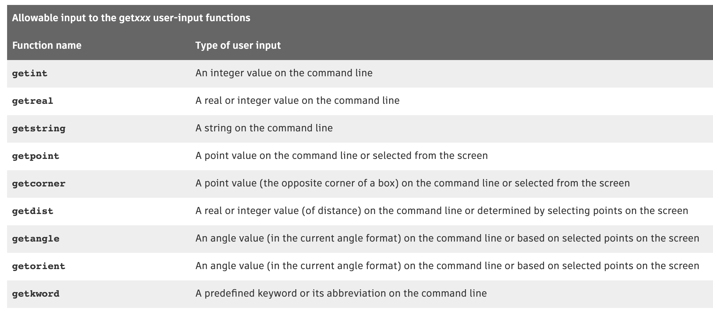
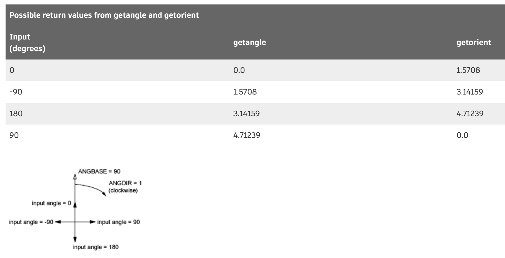
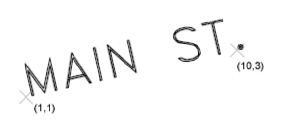
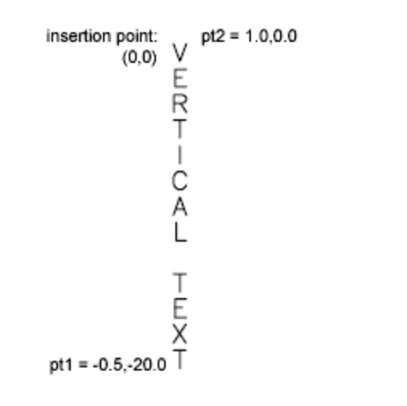
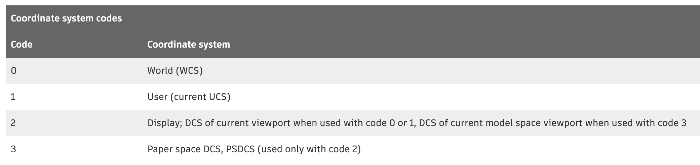
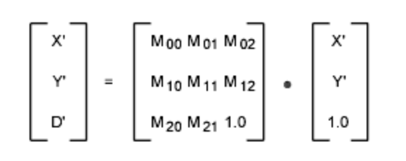
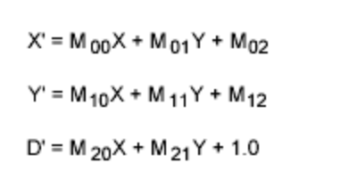

# 0104. About Using AutoLISP to Communicate With AutoCAD (AutoLISP)

[Pomoc: Introduction (AutoLISP)](http://help.autodesk.com/view/OARX/2018/PLK/?guid=GUID-A0E9D801-8BE9-4BF1-85E8-3807E15F3B71)

Query and command functions provide direct access to AutoCAD commands and drawing services.

AutoLISP ® provides various functions for examining the contents of the currently loaded drawing. This chapter introduces these functions and describes how to use them in conjunction with other functions.

## 01. About Accessing Commands and Services (AutoLISP)

The query and command functions described in this section provide direct access to AutoCAD ® commands and drawing services. Their behavior depends on the current state of the AutoCAD system and environment variables, and on the drawing that is currently loaded. See Query and Command Functions (AutoLISP) in AutoLISP Function Synopsis (AutoLISP), for a complete list of query and command functions.

### 1. About Using AutoCAD Commands (AutoLISP)

AutoLISP can execute a built-in AutoCAD command or one that is defined in a loaded ObjectARX or Managed .NET application.

Note: AutoCAD for Mac does not support Managed .NET applications.

The command and command-s functions allow you to start and pass values to an AutoCAD command. The command and command-s functions have a variable-length argument list. The first argument of these functions must be the command you want to execute. All other arguments must correspond to the types and values expected by that command's prompt sequence; these may be strings, real values, integers, points, entity names, or selection set names. Data such as angles, distances, and points can be passed either as strings or as the values themselves (as integer or real values, or as point lists). An empty string ("") is equivalent to pressing the Spacebar or Enter on the keyboard.

The command-s function is faster and more efficient than the command function, but the command being executed within the command-s function must be completed within the same statement. This means that an argument must be provided for each of the command’s prompts, and that it cannot execute any more AutoLISP statements until the function has completed. Unlike the command-s function, you can use AutoLISP functions within the command function and the command that is being executed does not need to be completed to continue execution of the program.

1『两者的区别，不过还是没怎么明白。』

There are some restrictions on the commands that you can use with the command and command-s functions.

The following code fragment shows representative calls to command.

```
(defun c:CircC ()
  (command "._circle" "0,0" "3,3")
  (command "._thickness" 1)
  (command "._circle" PAUSE PAUSE)
 (princ)
)
```

When the CircC command is loaded and executed at the AutoCAD Command prompt, the following actions occur:

1. The first call to command passes points to the CIRCLE command as strings (draws a circle centered at 0.0,0.0 and passes through 3.0,3.0).

2. The second call to command passes an integer to the THICKNESS system variable (changes the current thickness to 1.0).

3. The last call to command prompts the user for a center point and then the radius of the circle.

The following code fragment shows representative calls to command-s.

```
(defun c:CircCS ( / p1 rad)
  (command-s "._circle" "0,0" "3,3")
  (command-s "._thickness" 1)
  (setq p1 (getpoint "\nEnter a center point: "))
  (setq rad (getdist p1 "\nEnter a radius: "))
  (command-s "._circle" p1 rad)
 (princ)
)
```

1『获得点的函数是 getpoint；获得距离的函数是 getdist，得向其传递一个参数「点」。』

The CircCS command is similar to CircC except it prompts the user for a center point and radius before making the last call to the command-s function. With the command-s function, you should avoid the use of the PAUSE token.

1『command-s 函数，最后不需要 PAUSE』

#### 01. About Foreign Language or International Support (AutoLISP)

AutoLISP programs can be used in an AutoCAD release that supports a language other than the original language the program was developed for.

The standard AutoCAD commands and keywords used in an AutoLISP program can be automatically translated if you precede each command or keyword with an underscore (_).

    (command "_line" pt1 pt2 pt3 "_c")

If you are using the dot prefix (to avoid using redefined commands), you can place the dot and underscore in either order. Both "._line" and "_.line" are valid.

Note: It is recommended to always add an underscore (_) in front of a command name or keyword when using the command or command-s functions; this will help your program to work as expected when executed in a language other than it was originally targeted for.

#### 02. About Pausing for User Input During an AutoCAD Command (AutoLISP)

The PAUSE symbol can be used in the command function to interrupt the execution of an AutoCAD command and have the user provide input.

If an AutoCAD command is in progress and the predefined symbol PAUSE is encountered as an argument to command, the command is suspended to allow direct user input (usually point selection or dragging). This is similar to the backslash pause mechanism provided for menus.

The PAUSE symbol is defined as a string consisting of a single backslash. When you use a backslash ( \ ) in a string, you must precede it by another backslash ( \\ ).

Note: You can use two backslashes ( \\ ) instead of the PAUSE symbol. However, it is recommended that you always use the PAUSE symbol rather than the explicit use of two backslashes. Also, if the command function is invoked from a menu item, the backslash suspends the reading of the menu item, which results in partial evaluation of the AutoLISP expression.

For example, the following code begins the CIRCLE command, sets the center point at (5,5), and then pauses to let the user drag the circle's radius. When the user specifies the desired point (or types in the desired radius), the function resumes, and a line is drawn from (5,5) to (7,5), as follows:

    (command "._circle" "5,5" pause "._line" "5,5" "7,5" "")

1『pause 感觉是在两个命令之间设置的。』

If PAUSE is encountered when a command is expecting input of a text string or an attribute value, AutoCAD pauses for input only if the AutoCAD TEXTEVAL system variable is nonzero. Otherwise, AutoCAD does not pause for user input but uses the value of the PAUSE symbol (a single backslash).

When the command function pauses for user input, the function is considered active, so the user cannot enter another AutoLISP expression to be evaluated.

1『上面的信息是关键点。』

The following example code uses the PAUSE symbol to allow the user to specify the block’s insertion point. The layer NEW_LAY and block MY_BLOCK must exist in the drawing prior to testing this code.

```
(setq blk "MY_BLOCK")
(setq old_lay (getvar "clayer"))
(command "._-layer" "set" "NEW_LAY" "")
(command "._-insert" blk PAUSE "" "" PAUSE)
(command "._-layer" "set" old_lay "")
```

The preceding code fragment sets the current layer to NEW_LAY, pauses for an insertion point for the block MY_BLOCK (which is inserted with X and Y scale factors of 1), and pauses again for a rotation angle. The current layer is then reset to the previous layer.

If the command function specifies a PAUSE with the AutoCAD SELECT command and the AutoCAD PICKFIRST system variable set is active, the SELECT command obtains the objects selected before the command is executed and does not pause for the user to select objects.

Note: The Radius and Diameter subcommands of the AutoCAD DIM command issue additional prompts in some situations. This can cause a failure of AutoLISP programs written prior to Release 11 that use these subcommands.

#### Using Transparent Commands

If you issue a transparent command while a command function is suspended, the command function remains suspended. Therefore, users can 'ZOOM and 'PAN while a command is at a pause. The pause remains in effect until AutoCAD gets valid input, and transparent command ends.

The following shows the results of using the ZOOM command transparently when the command function allows the user to provide a radius for the circle:

Command: (command "._circle" "5,5" PAUSE "._line" "5,5" "7,5" "")

circle

Specify center point for circle or [3P/2P/Ttr (tan tan radius)]: 5,5

Specify radius of circle or [Diameter]: 'zoom

>> Specify corner of window, enter a scale factor (nX or nXP), or [All/Center/Dynamic/Extents/Previous/Scale/Window/Object] <real time>:

>> Press ESC or ENTER to exit, or right-click to display shortcut menu.

Resuming CIRCLE command.

Specify radius of circle or [Diameter]:

Command: line

Specify first point: 5,5

Specify next point or [Undo]: 7,5

Specify next point or [Undo]:

Command: nil

#### Accepting Menu Input

Menu input is not suspended when PAUSE is used by the command function. If a menu item is active when the command function pauses for input, that input request can be satisfied by the menu. If you want the menu item to be suspended as well, you must provide a backslash in the menu item. When valid input is provided, both the command function and the menu item resume.

#### 03. About Passing Pick Points to AutoCAD Commands (AutoLISP)

Some AutoCAD commands (such as TRIM, EXTEND, and FILLET) require the user to specify a pick point as well as the object itself.

Object and point data can be passed to the command and command-s functions without the use of a PAUSE, but requires you to first store the values as variables. Points can be passed as strings within the command and command-s functions, or can be defined outside the function and passed as variables, as shown in the following example.

The following example code demonstrates one method of passing an entity name and a pick point to the command function.

```
(command "._circle" "5,5" "2")    ;Draws a circle
(command "._line" "3,5" "7,5" "") ;Draws a line
(setq el (entlast))               ;Gets the last entity 
                                  ;  added to the drawing
(setq pt '(5 7))                  ;Sets the trim point
(command "._trim" el "" pt "")    ;Performs the trim
```

1『代码里很多地方加了空格 ""，因为命令的时候这些节点都需要空格一下？可以在 CAD 里一步步模拟验证。』

If AutoCAD is at an idle Command prompt when these statements are called, AutoCAD performs the following actions:

1. Draws a circle centered at (5,5) with a radius of 2.

2. Draws a line from (3,5) to (7,5).

3. Creates a variable el that is the name of the last object added to the database.

4. Creates a pt variable that is a point on the circle. (This point selects the portion of the circle to be trimmed.)

5. Performs the TRIM command by selecting the el object (the line) and by selecting the point specified by pt.

#### 04. About Undoing Changes Made by a Routine (AutoLISP)

Grouping multiple AutoLISP statements together under a single UNDO group allows you to rollback all the actions performed by using either the AutoCAD U or UNDO commands.

Each command executed with the command and command-s functions explicitly creates its own UNDO group. If a user enters U (or UNDO) at the AutoCAD Command prompt after running an AutoLISP routine, only the last command will be undone. Additional uses of UNDO will step backward further through the commands used in that routine. Users of your routine will expect that all of the operations that it performs can be undone in a single operation, instead of having to undo multiple operations to get back to the previous state of the drawing.

It is recommended to group the commands and operations performed by an AutoLISP routine into a single UNDO group, or if your routine allows the user to repeat operations you might even create UNDO groups for each time the user’s response affects the drawing. You can define an UNDO group by using the Begin and End options of the AutoCAD UNDO command.

The following example code demonstrates how each command executed with the command function has its own UNDO group.

```
(defun c:NoUndo ( / old_osmode el pt)
  (setq old_osmode (getvar "OSMODE"))
  (setvar "OSMODE" 0)
  (command "._circle" "5,5" "2")    ;Draws a circle
  (command "._line" "3,5" "7,5" "") ;Draws a line
  (setq el (entlast))               ;Gets the last entity added 
                                    ; to the drawing
  (setq pt '(5 7))                  ;Sets the trim point
  (command "._trim" el "" pt "")    ;Performs the trim
  (setvar "OSMODE" old_osmode)
)
```

After running the c:NoUndo routine, you will see a semi-circle. Issuing the U or UNDO command after running the c:NoUndo routine results in the AutoCAD TRIM command being undone; you should now see a full circle with a line running through its center. Executing the U or UNDO command again results in the line being undone that was created with the AutoCAD LINE command. A third use of the U or UNDO command results in the AutoCAD CIRCLE command being undone.

The following example code demonstrates how the AutoCAD UNDO command can be used to create an UNDO group that allows the user to rollback all changes back with a single U (or UNDO) command.

```
(defun c:YesUndo ( / old_osmode el pt)
  (command "._UNDO" "_Begin")
  (setq old_osmode (getvar "OSMODE"))
  (setvar "OSMODE" 0)
  (command "._circle" "5,5" "2")    ;Draws a circle
  (command "._line" "3,5" "7,5" "") ;Draws a line
  (setq el (entlast))               ;Gets the last entity added
                                    ; to the drawing
  (setq pt '(5 7))                  ;Sets the trim point
  (command "._trim" el "" pt "")    ;Performs the trim
  (setvar "OSMODE" old_osmode)
  (command "._UNDO" "_End")
)
```

After running the c:YesUndo routine, you will see a semi-circle just like with the c:NoUndo routine. Issuing the U or UNDO command after running the c:YesUndo routine results in the AutoCAD TRIM, LINE, and CIRCLE commands being undone.

### 2. About System and Environment Variables (AutoLISP)

AutoLISP applications can inspect and change the value of AutoCAD system variables with the getvar and setvar functions.

1『这两个函数很重要。』

These functions use a string to specify the variable name. The setvar function requires a second argument that specifies the new value the system variable. AutoCAD system variables accept and return various data types: integers, reals, strings, 2D points, and 3D points.

Values supplied as arguments to setvar must be of the expected type. If an invalid type is supplied, an AutoLISP error is generated.

The following example code demonstrates how to get and set the value of the AutoCAD FILLETRAD system variable:

```
(if (< (getvar "filletrad") 1)
  (setvar "filletrad" 1)
)
```

3『

lisp 里有关条件语句的用法，可参考「2019117Practical_Common_Lisp0701.md」。

As you've already seen, the most basic form of conditional execution--if x, do y; otherwise do z--is provided by the IF special operator, which has this basic form:

    (if condition then-form [else-form])

The condition is evaluated and, if its value is non-NIL, the then-form is evaluated and the resulting value returned. Otherwise, the else-form, if any, is evaluated and its value returned. If condition is NIL and there's no else-form, then the IF returns NIL.

```
(if (> 2 3) "Yup" "Nope") ==> "Nope" 
(if (> 2 3) "Yup") ==> NIL 
(if (> 3 2) "Yup" "Nope") ==> "Yup"
```

However, IF isn't actually such a great syntactic construct because the then-form and else-form are each restricted to being a single Lisp form. This means if you want to perform a sequence of actions in either clause, you need to wrap them in some other syntax. For instance, suppose in the middle of a spam-filtering program you wanted to both file a message as spam and update the spam database when a message is spam. You can't write this:

```
(if (spam-p current-message) 
  (file-in-spam-folder current-message) 
  (update-spam-database current-message))
```

because the call to update-spam-database will be treated as the else clause, not as part of the then clause. Another special operator, PROGN, executes any number of forms in order and returns the value of the last form. So you could get the desired behavior by writing the following:

```
(if (spam-p current-message) 
  (progn 
    (file-in-spam-folder current-message) 
    (update-spam-database current-message)))
```

』

Additional functions, getenv and setenv, provide AutoLISP routines with access to the currently defined operating system environment variables. Unlike system variable names, environment variable names are case specific. For example, MaxHatch and MAXHATCH are not the same. When using the setenv function, you always supply the new value as a string even if it might be a numeric value.

The following example code demonstrates how to set the MaxHatch environment variable:

```
(setq curMaxHatch (getenv "MaxHatch"))
(prompt (strcat "\nCurrent value of MaxHatch: " curMaxHatch))
(setenv "MaxHatch" "50000")
(prompt (strcat "\nNew value of MaxHatch: " (getenv "MaxHatch")))
(setenv "MaxHatch" curMaxHatch)
```

### 3. About Configuration Files (AutoLISP)

AutoCAD uses a configuration file with the name acadxxxx.cfg to store device and application information.

The xxxx in the file name refers to the AutoCAD release number. The AppData section of this file is provided for users and developers to store configuration information pertaining to their applications. The getcfg and setcfg functions allow AutoLISP applications to inspect and change the value of parameters in the AppData section.

The setcfg function requires two strings that represent the section and parameter, and the value to assign. The value returned by setcfg is nil if the value could not be stored or the value that was being assigned to the parameter. The getcfg function requires the section and parameter to retrieve a value from and returns the value if the parameter exists.

The following code creates a section under AppData named ArchStuff with a parameter titled WallThk. The value of ”8” is then assigned to WallThk.

    (setcfg "AppData/ArchStuff/WallThk" "8")

"8"

The following code returns the value assigned to the specified section and parameter.

    (getcfg "AppData/ArchStuff/WallThk")

"8"

Note: It is recommend to store values in the Windows Registry or the AutoCAD property list (HKCU.plist and HKLM.plist) files on Mac OS. This can be done using the vl-registry-read and vl-registry-write functions.

## 02. About Display Control (AutoLISP)

AutoLISP includes functions for controlling the AutoCAD display in both text and graphics windows. Some functions prompt for, or depend on, input from the AutoCAD user.

The prompt, princ, prin1, and print functions are the primary text output functions.

### 1. About Controlling Menus (AutoLISP)

The menucmd function controls the display of the menus on the menu bar, drawing area, or an image title menu.

It displays, modifies, or queries one of the submenus of the current menu, and accepts a string argument that specifies the submenu and the action to perform on that submenu. The menucmd function takes a string argument that consists of two fields, separated by an equal sign, in the following form:

    (menucmd "menu_area=action")

The menu_area field specifies which part of the menu is to receive the action. This field can specify a menu area, such as P0 (for the shortcut menu) or a specific menu item. The action field specifies the action to perform on the menu area or menu item, or a submenu to load into the menu area. The menu areas that can receive an action are the same as those used in customization file submenu references.

Every menu area has a currently loaded submenu. By default, the first submenu following a menu section label is loaded into that menu area.

If menu_area specifies a pull-down menu or image tile menu, action can be an asterisk ( * ). This causes the menu to be displayed; pull-down menus and image tile menus are not automatically displayed when they are called.

Note: In Windows, only the P0 (cursor) menu and image tile menus are displayed with the asterisk. Image tile menus are not supported in AutoCAD for Mac.

The following code loads the menu with the POP0 alias into the P0 (cursor) menu area and displays it.

```
(menucmd "P0=POP0") ; Loads the POP0 menu into the P0 menu area
(menucmd "P0=*")    ; Display it
```

1『上面命令显示的面板，是按住 shift 后右键显示的面板。』

If the correct menu is loaded into a particular menu area, you do not need to load it specifically each time you want to display it.

The following code displays the pull-down menu currently loaded in the P1 (first pull-down menu) location.

    (menucmd "P1=*")

Using "P1=*" without previously loading the menu can result in unexpected behavior. Although you can load virtually any menu at a pull-down or shortcut menu location, it is best to use only menus specifically designed for that menu area. 

For example, if you have a submenu called MORESTUFF, you can load it at the P1 location with the following code:

```
(menucmd "P1=MORESTUFF") ; Loads the MORESTUFF menu in the P1 menu location
(menucmd "P1=*")         ; Displays it
```

1『上面命令显示的面板，是上面菜单里的「文件」。』

This menu remains in this location until you replace it by loading another menu, as in the following:

    (menucmd "P1=POP1")

If your menu uses the disabling (graying-out) and marking features, you can retrieve and change the state of a menu item label with the menucmd function. The following call retrieves the current state of the fourth label in the pull-down menu P2.

    (menucmd "P2.4=#?") ; If disabled returns "P2.4=~"

These function calls enable and disable that same menu item label:

```
(menucmd "P2.4=")  ; Enables the label
(menucmd "P2.4=~") ; Disables the label
```

You can also place and remove marks to the left of menu item labels.

The previously described method of menu item handling works relatively well with a single static menu. However, it becomes unreliable when menu item locations change when you load multiple partial menu files. You can make use of the menu-group and name-tag features to keep track of menu items. Instead of specifying a menu item by its location on a menu, you specify the menu group and name tag associated with the menu item.

When you use the menu group to enable, disable, and mark menu item labels, you must precede the group name with a G, as shown in the following examples.

```
(menucmd "Gacad.ID_New=~") ; Disables the label
(menucmd "Gacad.ID_New=")  ; Enables the label
```

Not only can an AutoLISP function enable and disable menu item labels, it can also modify the text displayed in the label by placing a DIESEL string expression in the label. Because DIESEL accepts only strings as input, you can pass information to the DIESEL expression through a USERS1-5 system variable that has been set to a value returned by your function.

You can also use the menucmd function to evaluate DIESEL string expressions within an AutoLISP function. The following routine returns the current time:

```
(defun C:CTIME ( / ctim)
  (setq ctim
  (menucmd "M=$(edtime,$(getvar,date),H:MMam/pm)"))
  (princ (strcat "\nThe current time is " ctim ))
 (princ)
)
```

1『(princ (strcat "\nThe current time is " ctim )，这种语句使用频次真是高，打印「自定义字符串+变量」。』

### 2. About Controlling the Graphics and Text Windows (AutoLISP)

You can control the display of the graphics and text windows from an application.

Early releases of AutoCAD could be configured to use two different screens; one displayed the graphics screen while the other displayed the contents of the text window. In those early releases, AutoCAD could be installed using a single-screen. With single-screen AutoCAD installations, a call to graphscr displayed the graphics window, and a call to textscr displayed the text window. Using these functions was equivalent to toggling the Flip Screen function key. The function textpage is equivalent to textscr.

1『原来早期的 CAD 文字屏幕和图形屏幕是分开独立的。』

In later and the most recent release, the text window is a floating window that can be independently displayed and resized instead of being a separate screen. A call to graphscr hides the text window and ensures that the graphics window is displayed, while a call to textscr displays the text window. If the text window is already displayed when textscr is called, the window is moved to the foreground in front of the AutoCAD application window.

The redraw function is similar to the AutoCAD REDRAW command, but provides more control over what is displayed. It not only redraws the entire graphics area, but can also specify a single object to be redrawn or undrawn (that is, blanked out). If the object is a complex object such as an old-style polyline or a block, redraw can draw (or undraw) either the entire object or its header. The redraw function can also highlight and unhighlight specified objects.

Related Concepts:

- About Displaying Messages (AutoLISP)

- About Controlling Low-Level Graphics (AutoLISP)

- Display Control Functions Reference (AutoLISP)

### 3. About Controlling Low-Level Graphics (AutoLISP)

Low-level graphics in the drawing area and application window can be controlled using AutoLISP functions.

The following functions can be used to draw temporary objects in the drawing area or display text in the status bar:

1. grtext – Displays text directly in the status bar area, with or without highlighting.

    Note: This function is supported on Mac OS, but does not affect AutoCAD.

2. grdraw – Draws a temporary vector in the current viewport with control over color and highlighting.

3. grvecs – Draws multiple temporary vectors.

4. redraw – Redraws the current viewport or a specified object (entity) in the current viewport.

Note: Because these functions depend on code in AutoCAD, their operation can be expected to change from release to release. There is no guarantee that applications calling these functions will be upward compatible. Also, they depend on current hardware configurations. In particular, applications that call grtext are not likely to work the same on all configurations unless the developer is very careful to use them as described and to avoid hardware-specific features. Finally, because they are low-level functions, they do almost no error reporting and can alter the graphics screen display unexpectedly (see the following example for a way to fix this).

The following sequence restores the default graphics window display caused by incorrect calls to grtext, grdraw, or grvecs:

```
(grtext) ; Restores standard text
(redraw)
```

## 03. About Getting User Input (AutoLISP)

Several functions enable an AutoLISP application to prompt the user for input of data. See User Input Functions (AutoLISP) in AutoLISP Function Synopsis (AutoLISP), for a complete list of user input functions.

### 1. About The Getxxx Functions (AutoLISP)

Each user-input getxxx function pauses for data entry of the indicated type and returns the value entered. The application specifies an optional prompt to display before the function pauses. The following table lists the getxxx functions and the type of user input requested.



Note: Although the getvar, getcfg, and getenv functions begin with the letters g, e, and t, they are not user-input functions. They are discussed in About Accessing Commands and Services (AutoLISP).

The functions getint, getreal, and getstring pause for user input on the AutoCAD command line. They return a value only of the same type as that requested.

The getpoint, getcorner, and getdist functions pause for user input on the command line or from points selected on the graphics screen. The getpoint and getcorner functions return 3D point values, and getdist returns a real value.

Both getangle and getorient pause for input of an angle value on the command line or as defined by points selected on the graphics screen. For the getorient function, the 0 angle is always to the right: “East” or “3 o'clock.” For getangle, the 0 angle is the value of ANGBASE, which can be set to any angle. Both getangle and getorient return an angle value (a real) in radians measured counterclockwise from a base (0 angle), for getangle equal to ANGBASE, and for getorient to the right.

For example, ANGBASE is set to 90 degrees (north), and ANGDIR is set to 1 (clockwise direction for increasing angles). The following table shows what getangle and getorient return (in radians) for representative input values (in degrees).



The getangle function honors the settings of ANGDIR and ANGBASE when accepting input. You can use getangle to obtain a rotation amount for a block insertion, because input of 0 degrees always returns 0 radians. The getorient function honors only ANGDIR. You use getorient to obtain angles such as the baseline angle for a text object. For example, given the preceding settings of ANGBASE and ANGDIR, for a line of text created at an angle of 0, getorient returns an angle value of 90.

The user-input functions take advantage of the error-checking capability of AutoCAD. Trivial errors are trapped by AutoCAD and are not returned by the user-input function. A prior call to initget provides additional filtering capabilities, lessening the need for error-checking.

The getkword function pauses for the input of a keyword or its abbreviation. Keywords must be defined with the initget function before the call to getkword. All user-input functions (except getstring) can accept keyword values in addition to the values they normally return, provided that initget has been called to define the keywords.

All user-input functions allow for an optional prompt argument. It is recommended you use this argument rather than a prior call to the prompt or princ functions. If a prompt argument is supplied with the call to the user-input function, that prompt is reissued in the case of invalid user input. If no prompt argument is supplied and the user enters incorrect information, the following message appears at the AutoCAD prompt line:

Try again:

This can be confusing, because the original prompt may have scrolled out of the Command prompt area.

The AutoCAD user cannot typically respond to a user-input function by entering an AutoLISP expression. If your AutoLISP routine makes use of the initget function, arbitrary keyboard input is permitted to certain functions that can allow an AutoLISP statement as response to a command implemented in AutoLISP.

### 2. About Controlling User-Input Function Conditions (AutoLISP)

The initget function provides a level of control over the next user-input function call.

The initget function establishes various options for use by the next entsel, nentsel, nentselp, or getXXX function (except getstring, getvar, and getenv). This function accepts two arguments, bits and string, both of which are optional. The bits argument specifies one or more control bits that enable or disable certain input values to the next user-input function call. The string argument can specify keywords that the next user-input function call will recognize.

The control bits and keywords established by initget apply only to the next user-input function call. They are discarded after that call. The application does not have to call initget a second time to clear special conditions.

1『目前还是没弄明白 initget 函数的功能。』

#### 01. Setting Input Options

The value of the bits argument of initget restricts the types of user input to the next user-input function call. This reduces error-checking.

The following are some of the available bit values:

- 1 - disallows null input

- 2 - disallows input of 0 (zero)

- 4 - disallows negative input

More than one condition can be set at a time by adding the values together (in any combination) to create a bits value between 0 and 255. If bits is not included or is set to 0, none of the control conditions applies to the next user-input function call. (For a complete listing of initget bit settings.)

As an example, if these values are set before a call to the getint function, the user is forced to enter an integer value greater than 0.

```
(initget (+ 1 2 4))
(getint "\nHow old are you? ")
```

This sequence requests the user's age. AutoCAD displays an error message and repeats the prompt if the user attempts to enter a negative or zero value, or if the user only presses Enter, or enters a string (the getint function rejects attempts to enter a value that is not an integer).

#### 02. Setting Keyword Options

The optional string argument of initget specifies a list of keywords recognized by the next user-input function call. The user-input function returns one of the predefined keywords if the input from the user matches the spelling of a keyword (not case sensitive), or if the user enters the abbreviation of a keyword.

The following example code demonstrates how to define two keywords with initget before a call to getreal. The program checks for these keywords and sets the input value accordingly.

```
(defun C:GETNUM (/ num)
  (initget 1 "Pi Two-pi")
  (setq num (getreal "Pi/Two-pi/<number>: "))
  (cond
    ((eq num "Pi") pi)
    ((eq num "Two-pi") (* 2.0 pi))
    (T num)
  )
)
```

The bits argument of initget is passed a value of 1 which inhibits null input, and the string argument is passed a string value that represents two keywords, "Pi" and "Two-pi". The getreal function is used to obtain a real number, issuing the following prompt:

Pi/Two-pi/<number>:

The result is placed in the local variable symbol num. If the user enters a number, that number is returned by C:GETNUM. However, if the user enters the keyword Pi (or simply P), getreal returns the keyword Pi. The cond function detects this and returns the value of PI in this case. The Two-pi keyword is handled similarly.

Note: You can also use initget to enable entsel, nentsel, and nentselp to accept keyword input.

3『

COND 是 IF 的加强版，可参考「2019117Practical_Common_Lisp0701.md」。

Another time raw IF expressions can get ugly is when you have a multibranch conditional: if a do x, else if b do y; else do z. There's no logical problem writing such a chain of conditional expressions with just IF, but it's not pretty.

```
(if a 
  (do-x) 
  (if b 
    (do-y) 
      (do-z)))
```
And it would be even worse if you needed to include multiple forms in the then clauses, requiring PROGNs. So, not surprisingly, Common Lisp provides a macro for expressing multibranch conditionals: COND. This is the basic skeleton:

```
(cond 
  (test-1 form*) 
  .
  .
  . 
  (test-N form*))
```

Each element of the body represents one branch of the conditional and consists of a list containing a condition form and zero or more forms to be evaluated if that branch is chosen. The conditions are evaluated in the order the branches appear in the body until one of them evaluates to true. 

At that point, the remaining forms in that branch are evaluated, and the value of the last form in the branch is returned as the value of the COND as a whole. If the branch contains no forms after the condition, the value of the condition is returned instead. 

By convention, the branch representing the final else clause in an if/else-if chain is written with a condition of T. Any non-NIL value will work, but a T serves as a useful landmark when reading the code. Thus, you can write the previous nested IF expression using COND like this:

```
(cond (a (do-x)) 
          (b (do-y)) 
          (t (do-z)))
```

』

Related Concepts:

* About Accessing and Requesting User Input (AutoLISP)

* About Arbitrary Keyboard Input (AutoLISP)
* About Control Characters in Strings (AutoLISP)
* About Using AutoCAD Commands (AutoLISP)
* About Passing Pick Points to AutoCAD Commands (AutoLISP)
* About Pausing for User Input During an AutoCAD Command (AutoLISP)
* User Input Functions Reference (AutoLISP)

### 3. About Arbitrary Keyboard Input (AutoLISP)

Arbitrary input allows you to provide a string to most of the getXXX functions as if it is a keyword; control bits and keywords are honored first.

An application using this facility can be written to permit the user to call an AutoLISP function at a getXXX function prompt. You enable arbitrary keyboard input by using the 128 control bit with the initget function.

The following example code defines a command named ARBENTRY and a function named REF. The REF function is used in response to the getpoint function in the ARBENTRY command which is set to allow arbitrary keyboard input.

```
(defun C:ARBENTRY ( / pt1)
  (initget 128)                     ; Sets arbitrary entry bit
  (setq pt1 (getpoint "\nPoint: ")) ; Gets value from user.
  (if (= 'STR (type pt1))           ; If it's a string, convert it
    (setq pt1 (eval (read pt1)))    ; to a symbol, try evaluating
                                    ; it as a function; otherwise,
    pt1                             ; just return the value.
  )
)

(defun REF ( )
  (setvar "LASTPOINT" (getpoint "\nReference point: "))
  (getpoint "\nNext point: " (getvar "LASTPOINT"))
)
```

The following command sequence demonstrates how you can use ARBENTRY and REF together:

Command: arbentry

Point: (ref)

Reference point: Select a point

Next point: @1,1,0

## 04. About Geometric Utilities (AutoLISP)

A group of functions allows applications to obtain pure geometric information and geometric data from the drawing.

The following lists some of the commonly used geometric related functions:

1. angle – Returns the angle, in radians, between a line and the X axis (of the current UCS).

2. distance – Returns the distance between two points.

3. polar – Locates a point by means of polar coordinates (relative to an initial point).

4. inters – Locates the intersection point of two lines.

5. osnap – Returns a 3D point that is the result of applying an Object Snap mode to a specified point.

6. textbox – Measures a specified text object, and returns the diagonal coordinates of the bounding box that encloses the text.

The following code example demonstrates calls to the geometric utility functions:

```
(setq pt1 '(3.0 6.0 0.0))
(setq pt2 '(5.0 2.0 0.0))
(setq base '(1.0 7.0 0.0))
(setq rads (angle pt1 pt2))   ; Angle in XY plane of current UCS - value
                              ; is returned in radians

(setq len (distance pt1 pt2)) ; Distance in 3D space
(setq endpt (polar base rads len))
```

The call to polar sets endpt to a point that is the same distance from (1,7) as pt1 is from pt2, and at the same angle from the X axis as the angle between pt1 and pt2.

2『函数 endpt 的功能去查一下。』

Related Concepts:

* About Object Snaps (AutoLISP)

* About Getting the Extents of Text (AutoLISP)
* About Angular Conversion (AutoLISP)
* About Accessing and Requesting User Input (AutoLISP)
* About Point Lists (AutoLISP)
* About Integers (AutoLISP)
* About Reals (AutoLISP)
* Geometric Functions Reference (AutoLISP)

### 1. About Object Snaps (AutoLISP)

The osnap function can find a point by using one of the AutoCAD Object Snap modes.

You pass the function a three element list that represents a 3D point; if you want to specify a 2D point, set the Z axis to a value of 0 (zero). Snap modes are specified using a string value; multiple Snap modes can be specified by using a comma delimiter.

The following example code looks for the midpoint of an object near pt1:

    (setq pt2 (osnap pt1 "_midp"))

The following example code looks for the midpoint, the endpoint, or the center of an object nearest pt1:

    (setq pt2 (osnap pt1 "_midp,_endp,_center"))

Note: It is recommended to always add an underscore (_) in front of each Snap mode; this will help your program to work as expected when executed on an AutoCAD release other than the English language release.

In both examples, pt2 is set to the snap point if one is found that fulfills the osnap requirements. If more than one snap point fulfills the requirements, the point is selected based on the setting of the AutoCAD SORTENTS system variable. Otherwise, pt2 is set to nil.

Note: The AutoCAD APERTURE system variable determines the allowable proximity of a selected point to an object when you use Object Snap.

### 2. About Getting the Extents of Text (AutoLISP)

The textbox function returns the diagonal coordinates of a box that encloses text.

The textbox function takes an entity definition list of the type returned by entget (an association list of group codes and values) as its single argument. This list can contain a complete association list description of the text object or just a list describing the text string.

The points returned by textbox describe the bounding box (an imaginary box that encloses the text) of the text object, as if its insertion point were located at (0,0,0) and its rotation angle were 0. 

The first list returned is the point (0.0 0.0 0.0), unless the text object is oblique or vertical or it contains letters with descenders (such as g and p). The value of the first point list specifies the offset distance from the text insertion point to the lower-left corner of the smallest rectangle enclosing the text. The second point list specifies the upper-right corner of that box. The returned point lists always describe the bottom-left and upper-right corners of this bounding box, regardless of the orientation of the text being measured.

The following example code shows the minimum allowable entity definition list that textbox accepts. Because no additional information is provided, textbox uses the current defaults for text style and height.

Command: (textbox '((1 . "Hello world")))

((0.0 0.0 0.0) (2.80952 1.0 0.0))

The actual values returned by textbox will vary depending on the current text style.

The following example code demonstrates one method of providing the textbox function with an entity definition list.

Command: text

Specify start point of text or [Justify/Style]: 1,1

Specify height <0.2000>: Press Enter

Specify rotation angle of text <0>: Press Enter

In the in-place text editor, enter test

In the in-place text editor, Press Enter

Command: (setq e (entget (entlast)))

((-1 . <Entity name: 7ffffb05da0>) (0 . "TEXT") (330 . <Entity name:

7ffffb039f0>) (5 . "1D2") (100 . "AcDbEntity") (67 . 0) (410 .

"Model") (8 . "0") (100 . "AcDbText") (10 1.0 1.0 0.0) (40 . 0.2) (1 .

"test") (50 . 0.0) (41 . 1.0) (51 . 0.0) (7 . "Standard") (71 . 0) (72

. 0) (11 0.0 0.0 0.0) (210 0.0 0.0 1.0) (100 . "AcDbText") (73 . 0))

Command: (textbox e)

((0.00491132 -0.00327422 0.0) (0.448295 0.195498 0.0))

1『Entity name 是图元名。』

The following figure shows the results of applying textbox to a text object with a height of 1.0. The figure also shows the baseline and insertion point of the text.


If the text is vertical or rotated, pt1 is still the bottom-left corner and pt2 is the upper-right corner; the bottom-left point may have negative offsets if necessary.

The following figure shows the point values (pt1 and pt2) that textbox returns for samples of vertical and aligned text. In both samples, the height of the letters is 1.0. (For the aligned text, the height is adjusted to fit the alignment points.)



When using vertical text styles, the points are still returned in left-to-right, bottom-to-top order as they are for horizontal styles, so that the first point list will contain negative offsets from the text insertion point.



Regardless of the text orientation or style, the points returned by textbox are such that the text insertion point (group code 10) directly translates to the origin point of the object coordinate system (OCS) for the associated text object. This point can be referenced when translating the coordinates returned from textbox into points that define the actual extent of the text. The following two sample functions use textbox to place a box around selected text regardless of its orientation.

The first routine uses the textbox function to draw a box around a selected text object:

```
(defun C:TBOX ( / textent tb ll ur ul lr)
  (setq textent (car (entsel "\nSelect text: ")))
  (command "._ucs" "Object" textent)
  (setq tb (textbox (list (cons -1 textent)))
        ll (car tb)
        ur (cadr tb)
        ul (list (car ll) (cadr ur))
        lr (list (car ur) (cadr ll))
  )
  (command "._pline" ll lr ur ul "Close")
  (command "._ucs" "p")
 (princ)
)
```

The second routine, which follows, accomplishes the same task as the first routine by performing the geometric calculations with the AutoLISP functions sin and cos. The result is correct only if the current UCS is parallel to the plane of the text object.

```
(defun C:TBOX2 ( / textent ang sinrot cosrot t1 t2 p0 p1 p2 p3 p4)
  (setq textent (entget (car (entsel "\nSelect text: "))))
  (setq p0 (cdr (assoc 10 textent))
        ang (cdr (assoc 50 textent))
        sinrot (sin ang)
        cosrot (cos ang)
        t1 (car (textbox textent))
        t2 (cadr (textbox textent))
        p1 (list
               (+ (car p0)
                 (- (* (car t1) cosrot)(* (cadr t1) sinrot))
               )
               (+ (cadr p0)
                 (+ (* (car t1) sinrot)(* (cadr t1) cosrot))
               )
             )
        p2 (list
               (+ (car p0)
                 (- (* (car t2) cosrot)(* (cadr t1) sinrot))
               )
               (+ (cadr p0)
                 (+ (* (car t2) sinrot)(* (cadr t1) cosrot))
               )
             )
        p3 (list
               (+ (car p0)
                 (- (* (car t2) cosrot)(* (cadr t2) sinrot))
               )
               (+ (cadr p0)
                 (+ (* (car t2) sinrot)(* (cadr t2) cosrot))
               )
             )
        p4 (list
               (+ (car p0)
                 (- (* (car t1) cosrot)(* (cadr t2) sinrot))
               )
               (+ (cadr p0)
                 (+ (* (car t1) sinrot)(* (cadr t2) cosrot))
               )
             )
  )
  (command "._pline" p1 p2 p3 p4 "c")
 (princ)
)
```

## 05. About Data Conversions (AutoLISP)

The listed topics are related to utilities for converting data types and units. See in AutoLISP Function Synopsis (AutoLISP), for a complete list of conversion functions.

### 1. About String Conversions (AutoLISP)

Numeric values can be converted to string values for use in output or textual data.

The following functions can be used to convert real and angle values to strings, and back:

1. rtos – Converts a real number into a formatted string based on a specified linear units mode.

2. distof – Converts a formatted string that represents a distance value into a real (floating-point) value.

3. angtos – Converts an angular value in radians into a formatted string based on a specified angular units mode.

4. angtof – Converts a formatted string representing an angle into a real (floating-point) value in radians.

#### 01. Converting Real Numbers to a String with Linear Units Format

The rtos function converts a real value to a string. The format of the result string can be specified using the arguments of the function, or by the AutoCAD LUNITS and LUPREC system variables then when not provided. The AutoCAD DIMZIN system variable controls how leading and trailing zeros are written to the result string.


The following example code demonstrates the use of rtos and the values returned (assuming the AutoCAD DIMZIN system variable equals 0). Precision (the third argument to rtos) is set to 4 places in the first call and 2 places in the others.

(setq x 17.5)
(setq str "\nValue formatted as ")

(setq fmtval (rtos x 1 4)) ; Mode 1 = scientific
(princ (strcat str fmtval))
Value formatted as 1.7500E+01

(setq fmtval (rtos x 2 2)) ; Mode 2 = decimal
(princ (strcat str fmtval))
Value formatted as 17.50

(setq fmtval (rtos x 3 2)) ; Mode 3 = engineering
(princ (strcat str fmtval))
Value formatted as 1'-5.50"

(setq fmtval (rtos x 4 2)) ; Mode 4 = architectural
(princ (strcat str fmtval))
Value formatted as 1'-5 1/2"

(setq fmtval (rtos x 5 2)) ; Mode 5 = fractional
(princ (strcat str fmtval))
Value formatted as 17 ½
When the AutoCAD UNITMODE system variable is set to 1, units are displayed as entered, the string returned by rtos differs for engineering (mode equals 3), architectural (mode equals 4), and fractional (mode equals 5) units. For example, the first two lines of the preceding sample output would be the same, but the last three lines would appear as follows:

Value formatted as 1'5.50"
Value formatted as 1'5-1/2"
Value formatted as 17-1/2''

#### Converting Strings with Linear Units Format to Real Numbers

The distof (distance to floating point) function is the complement of rtos. All of the following calls return the same value: 17.5. (Note the use of the backslash (\) with modes 3 and 4.)

(distof "1.7500E+01" 1) ; Mode 1 = scientific
(distof "17.50" 2)      ; Mode 2 = decimal
(distof "1'-5.50\"" 3)  ; Mode 3 = engineering
(distof "1'-5 1/2\"" 4) ; Mode 4 = architectural
(distof "17 1/2" 5)     ; Mode 5 = fractional
When you have a string specifying a distance in feet and inches, you must precede the quotation mark with a backslash ( \" ) so it does not look like the end of the string. The preceding examples of distof demonstrates this action.

#### Converting Real Numbers to a String with Angular Units Format

The angtos function converts an angular value to a string. The format of the result string can be specified using the arguments of the function, or by the AutoCAD AUNITS and AUPREC system variables then when not provided. The AutoCAD DIMZIN system variable controls how leading and trailing zeros are written to the result string.

Because the angtos function takes the AutoCAD ANGBASE system variable into consideration, the following example code always returns "0":

(angtos (getvar "angbase"))
There is no AutoLISP function that returns a string version (in the current mode/precision) of either the amount of rotation of ANGBASE from true zero (East) or an arbitrary angle in radians.

The amount of rotation of ANGBASE from AutoCAD zero (East) or the size of an arbitrary angle can be found by doing one of the following:

Add the desired angle to the current ANGBASE, and then check to see if the absolute value of the result is greater than 2pi; (2 * pi). If so, subtract 2pi;, if the result is negative, add 2pi;, then use the angtos function on the result.
Store the value of ANGBASE in a temporary variable, set ANGBASE to 0, evaluate the angtos function, then set ANGBASE to its original value.
Subtracting the result of (atof (angtos 0)) from 360 degrees (2pi; radians or 400 grads) also yields the rotation of ANGBASE from 0.

The following example code demonstrates the use of angtos and the values returned (still assuming that DIMZIN equals 0). Precision (the third argument to angtos) is set to 0 places in the first call, 4 places in the next three calls, and 2 places in the last.

(setq ang 3.14159 str2 "\nAngle formatted as ")
(setq fmtval (angtos ang 0 0)) ; Mode 0 = degrees
(princ (strcat str2 fmtval))
Angle formatted as 180

(setq fmtval (angtos ang 1 4)) ; Mode 1 = deg/min/sec
(princ (strcat str2 fmtval))
Angle formatted as 180d0'0"

(setq fmtval (angtos ang 2 4)) ; Mode 2 = grads
(princ (strcat str2 fmtval)) ; displays Angle formatted as
200.0000g

(setq fmtval (angtos ang 3 4)) ; Mode 3 = radians
(princ (strcat str2 fmtval))
Angle formatted as 3.1416r

(setq fmtval (angtos ang 4 2)) ; Mode 4 = surveyor's
(princ (strcat str2 fmtval))
Angle formatted as W
The UNITMODE system variable also affects strings returned by angtos when it returns a string in surveyor's units (mode equals 4). If UNITMODE equals 0, the string returned can include spaces (for example, "N 45d E"); if UNITMODE equals 1, the string contains no spaces (for example, "N45dE").

#### Converting Strings with Angular Units Format to Real Numbers

The angtof function complements angtos, all of the following calls return the same value: 3.14159.

(angtof "180" 0)       ; Mode 0 = degrees
(angtof "180d0'0\"" 1) ; Mode 1 = deg/min/sec
(angtof "200.0000g" 2) ; Mode 2 = grads
(angtof "3.14159r" 3)  ; Mode 3 = radians
(angtof "W" 4)         ; Mode 4 = surveyor's
When you have a string specifying an angle in degrees, minutes, and seconds, you must precede the quotation mark with a backslash ( \" ) so it does not look like the end of the string. The preceding example of angtof demonstrates this action.

Related Concepts:

About Strings and String Handling (AutoLISP)
About Control Characters in Strings (AutoLISP)
About Angular Conversion (AutoLISP)
String-Handling Functions Reference (AutoLISP)

### 2. About Angular Conversion (AutoLISP)

Angular values returned by most AutoLISP functions and those stored in a drawing are expressed in radians, while angular input is commonly provided in degrees or another angular format than radians.

You can convert angular values directly with a combination of math functions, or use the angtos and angtof functions. The angtos function converts an angular value expressed in radians to degrees or one of the other supported angular formats. This function returns a string value. If you need a real (or floating point) value, you can use the atof function to convert the string value that is returned by angtos.

(setq half-PI (/ PI 2))
1.5708

(setq angstr (angtos half-PI 0 2))
"90.00"

(setq deg (atof angstr))
90.0
The angtof function is the opposite of angtos, it converts a string representing an angular value into a real (or floating point) value in radians.

(setq angstr (angtos 1.5708 1 6))
"90d0'0.76\""

(setq rad (angtof angstr 1))
1.5708
Converting Radians to Degrees and Degrees to Radians with Math Functions
A more efficient method way to convert radians to degrees and degrees to radians than using the angtos and angtof functions is to use math functions.

The math formula to convert radians to degrees is:

(Radians / PI) * 180 = Degrees
In AutoLISP, the same can be achieved using the following function:

; Convert value in radians to degrees
(defun Radian->Degrees (nbrOfRadians)
  (* 180.0 (/ nbrOfRadians pi))
)
RADIAN->DEGREES

(Radian->Degrees PI)
180.0
The math formula to convert degrees to radians is:

(Degrees / 180) * PI = Degrees
In AutoLISP, the same can be achieved using the following function:

; Convert value in degrees to radians
(defun Degrees->Radians (numberOfDegrees)
  (* pi (/ numberOfDegrees 180.0))
)
DEGREES->RADIANS

(Degrees->Radians 180.0)
3.14159

Related Concepts
About Accessing and Requesting User Input (AutoLISP)
About Geometric Utilities (AutoLISP)
About Integers (AutoLISP)
About Reals (AutoLISP)
About Number Handling (AutoLISP)
Conversion Functions Reference (AutoLISP)

### 3. About ASCII Codes (AutoLISP)

ASCII codes are integer values that represent alphanumeric characters.

Numeric values 0 through 127 represent digits 0 through 9, letters of the alphabet, punctuation marks, and other special characters. Some AutoLISP functions return or expect an ASCII code for a single character instead of the string equivalent.

For example, the grread function returns the ASCII code of the key pressed when a user provides keyboard input. The ASCII code in the list returned can then be evaluated or converted for display based on how the program is going to use it.

The following are a few of the AutoLISP functions that are used when working with ASCII codes:

grread – Reads values from any of the AutoCAD input devices.
read-char – Returns the ASCII code representing the character read from the keyboard input buffer or an open file.
write-char – Writes one character to the screen or to an open file.
ascii – Returns the ASCII code for the first character of a string.
chr – Converts an integer representing an ASCII character code into a single-character string.
Converting ASCII Codes and Characters to ASCII Codes
The ascii and chr functions can be used to handle the conversion of ASCII codes. The ascii function returns the ASCII code associated with a character string, and chr returns the character string associated with an ASCII code.

The following code converts an uppercase A to its ASCII code value:

(ascii "A")
65
The following code converts an ASCII code value to the character string it represents:

(chr 65)
"A"
The following example code defines a command named ASCII and a function named BASE that is used by the ASCII command. The ASCII command writes characters with their codes in decimal, octal, and hexadecimal form to the screen and a file named ASCII.txt.

```
; BASE converts from a decimal integer to a string in another base.
(defun BASE (bas int / ret yyy zot)
  (defun zot (i1 i2 / xxx)
    (if (> (setq xxx (rem i2 i1)) 9)
      (chr (+ 55 xxx))
      (itoa xxx)
    )
  )

  (setq ret (zot bas int)
        yyy (/ int bas)
  )
  (setq ret (strcat (zot bas yyy) ret))
  (setq yyy (/ yyy bas))

  (strcat (zot bas yyy) ret)
)

(defun C:ASCII (/)                      ;chk out ct code dec oct hex )
  (initget "Yes")
  (setq chk (getkword "\nWriting to ASCII.TXT, continue? <Y>: "))
  (if (or (= chk "Yes") (= chk nil))
    (progn
      (setq out  (open "ascii.txt" "w")
            chk  1
            code 0
            ct   0
      )
      (princ "\n \n CHAR DEC OCT HEX \n")
      (princ "\n \n CHAR DEC OCT HEX \n" out)
      (while chk
        (setq dec (strcat "  " (itoa code))
              oct (base 8 code)
              hex (base 16 code)
        )
        (setq dec (substr dec (- (strlen dec) 2) 3))
        (if (< (strlen oct) 3)
          (setq oct (strcat "0" oct))
        )

        (princ (strcat "\n " (chr code) " " dec " " oct " " hex))
        (princ (strcat "\n " (chr code) " " dec " " oct " " hex)
               out
        )

        (cond
          ((= code 255) (setq chk nil))
          ((= ct 20)
           (setq
             xxx (getstring
                   "\n \nPress 'X' to eXit or any key to continue: "
                 )
           )
           (if (= (strcase xxx) "X")
             (setq chk nil)
             (progn
               (setq ct 0)
               (princ "\n \n CHAR DEC OCT HEX \n")
             )
           )
          )
        )
        (setq ct   (1+ ct)
              code (1+ code)
        )
      )
      (close out)
      (setq out nil)
    )
  )
 (princ)
)
```

Related Concepts
About Integers (AutoLISP)
About Number Handling (AutoLISP)
About String Conversions (AutoLISP)
About Strings and String Handling (AutoLISP)
Conversion Functions Reference (AutoLISP)

### 4. About Unit Conversion (AutoLISP)

Values that represent distances, volumes, or other forms of measurement can be converted from one real-world unit to another.

The acad.unt file defines various conversions between real-world units such as miles to kilometers, Fahrenheit to Celsius, and so on. The function cvunit takes a value expressed in one system of units and returns the equivalent value in another system. The two systems of units are specified by strings containing expressions of units defined in acad.unt. The cvunit function does not convert measurements of the same type. For example, it does not convert inches into grams.

The first time cvunit converts to or from a unit during a drawing editor session, it must look up the string that specifies the unit in acad.unt. If your routine has many values to convert from one system of units to another, it is more efficient to convert the value 1.0 by a single call to cvunit and then use the returned value as a scale factor in subsequent conversions. This works for all units defined in acad.unt except temperature scales, which involve an offset as well as a scale factor.

The following example code converts a value in inches to centimeters:

(cvunit 1.0 "inch" "cm")
2.54
The following example code converts a value from Fahrenheit to Celsius:

(cvunit 32 "fahrenheit" "celsius")
3.46317e-009
The value returned after converting from Fahrenheit to Celsius is not exactly 0.0, you can use rtos to control the precision of the value returned by cvunit. If you still need a real value, you can convert the string returned by rtos with atof.

(setq temp (cvunit 32 "fahrenheit" "celsius"))
3.46317e-009

(setq temp (rtos temp 2 2))
"0.00"

(setq temp (atof temp))
0.0

Related Concepts
Unit Definition File Reference (AutoLISP)
Example: Convert Inches to Meters (AutoLISP)
Conversion Functions Reference (AutoLISP)

#### 01. Example: Convert Inches to Meters (AutoLISP)

This example demonstrates how a user-specified distance in inches can be converted to meters with the cvunit function.

(defun C:I2M ( / eng_len metric_len eng metric)
  (princ "\nConverting inches to meters. ")
  (setq eng_len
  (getdist "\nEnter a distance in inches: "))
  (setq metric_len (cvunit eng_len "inches" "meters"))
  (setq eng (rtos eng_len 2 4)
           metric (rtos metric_len 2 4))
  (princ
    (strcat "\n\t" eng " inches = " metric " meters."))
 (princ)
)

#### 02. Unit Definition File Reference (AutoLISP)

The AutoCAD unit definition file, acad.unt, allows you to define the factors to convert data one set of units to another set of units.

The acad.unt file is a plain ASCII text format file and is used by the unit-conversion function cvunit. You can add new and modify the unit definitions available by using a text editor. A definition consists of two lines in the file—the unit name and the unit definition. The first line must have an asterisk (*) in the first column, followed by the name of the unit. A unit name can have several abbreviations or alternate spellings, separated by commas. If a unit name has singular and plural forms, you can specify these using the following format:

*[ [common] [ ( [singular.] plural) ] ]...
You can specify multiple expressions (singular and plural). They do not have to be located at the end of the word, and a plural form is not required. The following are examples of valid unit name definitions:

*inch(es)
*milleni(um.a)
*f(oot.eet) or (foot.feet)
The line following the *unit name line defines the unit as either fundamental or derived.

Fundamental Units
A fundamental unit is an expression in constants. If the line following the *unit name line begins with something other than an equal sign (=), it defines fundamental units. Fundamental units consist of five integers and two real numbers in the following form:

c, e, h, k, m, r1, r2
The five integers correspond to the exponents of these five constants:

c Velocity of light in a vacuum

e Electron charge

h Planck's constant

k Boltzman's constant

m Electron rest mass

As a group, these exponents define the dimensionality of the unit: length, mass, time, volume, and so on.

The first real number (r1) is a multiplier, and the second (r2) is an additive offset (used only for temperature conversions). The fundamental unit definition allows for different spellings of the unit (for example, meter and metre); the case of the unit is ignored. An example of a fundamental unit definition is as follows:

*meter(s),metre(s),m
-1,0,1,0,-1,4.1214856408e11,0
In this example, the constants that make one meter are as follows:


Derived Units
A derived unit is defined in terms of other units. If the line following the *unit name line begins with an equal sign ( = ), it defines derived units. Valid operators in these definitions are * (multiplication), / (division), + (addition), - (subtraction), and ^ (exponentiation).

You can specify a predefined unit by naming it, and you can use abbreviations (if provided). The items in a formula are multiplied together unless some other arithmetic operator is specified. For example, the units database defines the dimensionless multiple and submultiple names, so you can specify a unit such as micro-inches by entering micro inch.

The following are examples of derived unit definitions.

; Units of area
*township(s)
=93239571.456 meter^2
The definition of a township is given as 93,239,571.456 square meters.

; Electromagnetic units
*volt(s),v
=watt/ampere
In this example, a volt is defined as a watt divided by an ampere. In the acad.unt, both watts and amperes are defined in terms of fundamental units.

User Comments
Comments can be added to the file by placing a semicolon at the beginning of a line. The comment continues to the end of the line.

; This entire line is a comment.

### 5. About Coordinate System Transformations (AutoLISP)

A point or displacement can be transformed from one coordinate system into another with trans.

The trans function takes three arguments with an optional fourth. The first argument, pt, is either a 3D point or a 3D displacement vector, distinguished by an optional displacement argument called disp. The disp argument must be nonzero if pt is to be treated as a displacement vector; otherwise, pt is treated as a point. The from argument specifies the coordinate system in which pt is expressed, and the to argument specifies the desired coordinate system.

The following is the syntax for the trans function:

(trans pt from to [disp])
Both the from and to arguments can specify a coordinate system in any of the following ways:

As an integer code that specifies the WCS, current UCS, or current DCS (of either the current viewport or paper space).
As an entity name returned by one of the entity name or selection set functions. This specifies the OCS of the named object. If the OCS does not differ, conversion between OCS and WCS is an identity operation.
As a 3D extrusion vector. Extrusion vectors are always represented in World coordinates; an extrusion vector of (0,0,1) specifies the WCS itself.
The following table lists the valid integer codes that can be used as the from and to arguments:



The following example code translates a point from the WCS into the current UCS.

(setq pt '(1.0 2.0 3.0))
(setq cs_from 0) ; WCS
(setq cs_to 1) ; UCS
(trans pt cs_from cs_to 0) ; disp = 0 indicates that pt is a point
If the current UCS is rotated 90 degrees counterclockwise around the World Z axis, the call to trans returns a point (2.0,-1.0,3.0). However, if you swap the to and from values, the result differs as shown in the following code:

(trans pt cs_to cs_from 0) ; the result is (-2.0,1.0,3.0)
Coordinate Systems
WCS
World coordinate system—the reference coordinate system. All other coordinate systems are defined relative to the WCS, which never changes. Values measured relative to the WCS are stable across changes to other coordinate systems.

UCS
User coordinate system—the working coordinate system defined by the user to make drawing tasks easier. All points passed to AutoCAD commands, including those returned from AutoLISP routines and external functions, are points in the current UCS (unless the user precedes them with a * at the AutoCAD Command prompt). If you want your application to send coordinates in the WCS, OCS, or DCS to AutoCAD commands, you must first convert them to the UCS by calling the trans function.

OCS
Object coordinate system—point values returned by entget are expressed in this coordinate system, relative to the object itself. These points are usually converted into the WCS, current UCS, or current DCS, according to the intended use of the object. Conversely, points must be translated into an OCS before they are written to the database by means of the entmod or entmake functions. This is also known as the entity coordinate system.

DCS
Display coordinate system—the coordinate system into which objects are transformed before they are displayed. The origin of the DCS is the point stored in the AutoCAD system variable TARGET, and its Z axis is the viewing direction. In other words, a viewport is always a plan view of its DCS. These coordinates can be used to determine where something will be displayed to the AutoCAD user.

When the from and to integer codes are 2 and 3, in either order, 2 indicates the DCS for the current model space viewport and 3 indicates the DCS for paper space (PSDCS). When the 2 code is used with an integer code other than 3 (or another means of specifying the coordinate system), it is assumed to indicate the DCS of the current space, whether paper space or model space. The other argument is also assumed to indicate a coordinate system in the current space.

PSDCS
Paper space DCS—this coordinate system can be transformed only to or from the DCS of the currently active model space viewport. This is essentially a 2D transformation, where the X and Y coordinates are always scaled and are offset if the disp argument is 0. The Z coordinate is scaled but is never translated. Therefore, it can be used to find the scale factor between the two coordinate systems. The PSDCS (integer code 2) can be transformed only into the current model space viewport. If the from argument equals 3, the to argument must equal 2, and vice versa.

## 06. About File Handling (AutoLISP)

AutoLISP provides functions for handling files and data I/O. See File-Handling Functions (AutoLISP) in AutoLISP Function Synopsis (AutoLISP) topic, for a complete list of file-handling functions.

### 1. About Searching for Files (AutoLISP)

An application can use the findfile function to search for a particular file name.

The application can specify the directory to search, or it can use the current AutoCAD library paths.

In the following example code, findfile searches for the acad.pgp file in the AutoCAD library paths:

```
(setq pgpname "acad.pgp")
(setq fil (findfile pgpname))
(if fil
  (setq pgpname fil)
  (princ (strcat "\nCould not find file " pgpname ". " ))
)
```

If the call to findfile is successful, the variable refname is set to a fully qualified path name string, as follows:

```
; On Windows
"<drive>:\\Users\\<username>\\appdata\\roaming\\autodesk\\
 <product>\\<release>\\<language>\\support\\acad.pgp"

; or

; On Mac
"/Users/<username>/Library/Application Support/Autodesk/Roaming/
 <product>/<release>/<language>/support/acad.pgp "
 ```

When specifying a path name, you must precede the backslash ( \ ) with another backslash so the path name will be recognized by AutoLISP. Alternatively, you can use the slash character ( / ) as a directory separator. 

The getfiled function displays a dialog box containing a list of available files of a specified extension type in the specified directory. This gives AutoLISP routines access to the AutoCAD Get File dialog box, a standard file navigation dialog box.

A call to getfiled takes four arguments that determine the appearance and functionality of the dialog box. The application must specify the following string values, each of which can be nil: a title, placed at the top of the dialog box; a default file name, displayed in the edit box at the bottom of the dialog box; and an extension type, which determines the initial files provided for selection in the list box. The final argument is an integer value that specifies how the dialog box interacts with selected files.

This following example uses getfiled to let the user browse the directory structure and select a file:

```
(defun C:DDIR ( )
  (setq *dfil (getfiled "Directory Listing" "" "" 2))
  (princ (strcat "\nVariable '*dfil' set to selected file " *dfil ))
 (princ)
)
```

The *dfil variable is set to the file you select, which can then be used by other AutoLISP functions or as a response to a command prompt for a file name. To use this variable in response to a command prompt, enter !*dfil.

1『备注：dfil 前面都有一个 *，因为 Markdown 格式的原因显示不出来。』

1『感觉上面的代码是找多个文件的，待确认。』

Related Concepts:

- About File Descriptors (AutoLISP)

- File-Handling Functions Reference (AutoLISP)

### 2. About Accessing and Assigning Help to a Command (AutoLISP)

The help and setfunhelp functions provide access to the product and your custom help files.

The Help facility supports:

1. HyperText Markup Language (.htm/.html) files - Windows and Mac OS

2. Microsoft Compiled HTML Help (.chm) files - Windows only

3. Windows Help (.hlp) files - Windows only

You can use the help function to display a Help file. Depending on the Help file's extension, the help function displays the appropriate viewer for the specified file. The following example code displays the LINE commands topic in the default AutoCAD Help file.

    (help "" "line")

You can create a custom Help file that provides information about your applications and display it with the help function. The following example code displays a custom help file named abcindoorcad.chm:

```
(defun C:ABCINDOORCADHELP ()
  (help "abcindoorcad.chm")
 (princ)
)
```

The setfunhelp function provides contextual help for user-defined commands. After the definition of a new command defined with AutoLISP, add a call to setfunhelp and associate a specific help topic to the command. The following example assigns the help topic “MyCommand” in the abcindoorcad.chm file to the user-defined MYCOMMAND command:

```
(defun C:MYCOMMAND ( )
  ..
  Command definition
  ..
)
```

    (setfunhelp "c:mycommand" "abcindoorcad.chm" "mycommand")

Related Concepts:

- About Defining Commands (AutoLISP)

- About Defining a Function (AutoLISP)

- Query and Command Functions Reference (AutoLISP)

## 07. About Device Access and Control (AutoLISP)

AutoLISP provides the grread and tablet functions for accessing data from the various input devices.

Note that the read-char and read-line file-handling functions can also read input from the keyboard input buffer.

### 1. About Accessing and Requesting User Input (AutoLISP)

AutoLISP can collect raw input from an input device, in addition to offering a set of functions designed to request specific types of input from the user.

The following are some of the functions that can be used to get input from the user:

1. grread – Reads values from any of the AutoCAD input devices.

2. initget – Establishes keywords and controls certain types of input for use by the next user-input function call.

3. getstring – Pauses for the input of a string and returns that string.

4. getpoint – Pauses for the input of a point and returns that point.

5. getint – Pauses for the input of an integer and returns that integer.

6. getdist – Pauses for the input of a distance and returns a real number.

7. getangle – Pauses for the input of an angle and returns the angle expressed in radians.

#### 01. Getting Direct Keyboard and Mouse Input

The grread function returns raw user input, whether from the keyboard or from the pointing device (mouse or digitizer). If the call to grread enables tracking, the function returns a digitized coordinate that can be used for things such as dragging. The value returned by grread is a list and the first character defines the type of input that the user provided.

Note: There is no guarantee that applications calling grread will be upward compatible. Because it depends on the current hardware configuration, applications that call grread are not likely to work in the same way on all configurations.
The following example code uses grread and checks to see if the input provided was from the keyboard.

```
(defun c:GetCharacter ( / code)
  (prompt "\nEnter a single character: ")
  
  (setq code (grread))

  (if (= 2 (car code))
    (progn
      (prompt (strcat "\nCharacter entered was: " (chr (cadr code))))
      (prompt (strcat "\nASCII code: " (itoa (cadr code))))
    )
    (prompt "\nInput was not from the keyboard.")
  )
 (princ)
)
```

Loading and running the example code results in the following prompt being displayed:

Enter a single character:

Pressing a key on the keyboard displays the character and ASCII code of the key at the AutoCAD Command prompt. For example, the following is displayed if you press the F key when prompted for a single character and Caps Lock is not enabled or Shift is not held down:

Character entered was: f

ASCII code: 102

#### 02. Requesting Input with the GetXXX Functions

AutoLISP provides several functions to get basic input from the user at the AutoCAD Command prompt. These functions allow you to request get points, enter text or numbers, and even use keywords to make branching commands. Each user-input getXXX function pauses for data entry of the indicated type and returns the value entered. The application calling one of the functions can specify an optional prompt to display before the function pauses for input. The initget function does not work with all getXXX functions.

The initget function can be used to control the next call to a getXXX function. This function accepts two arguments, bits and keywords, both of which are optional. The bits argument specifies one or more control bits that enable or disable certain input values to the next user-input function call. The keywords argument specifies one or more keywords that the next getXXX function call will recognize. The control bits and keywords established by initget apply only to the next getXXX function call and do not need to be discarded after that call.

The following code uses the getint function to prompt the user for an integer:

```
(defun c:AskForInteger ( / )
  (setq int (getint "\nEnter an integer: "))

  (if int
    (prompt (strcat "\nUser entered: " (itoa int)))
    (prompt "\nUser did not provide an integer.")
  )
 (princ)
)
```

Loading and running the example code results in the following prompt being displayed:

Enter an integer:

Providing a valid integer returns the value entered for the getint function and that value is displayed as part of the prompt “User entered:” at the AutoCAD Command prompt, but if an invalid integer is provided the message “Requires an integer value.” is displayed and the user is requested to provide an integer again. If Enter is pressed before a value is typed, the message “User did not provide an integer.” is displayed.

#### 03. Validating Input

You should protect your code from unintentional user errors. The AutoLISP user input getXXX functions do much of this for you. However, it is important to check for adherence to other program requirements that the getXXX functions do not check for. If you neglect to check input validity, the program's integrity can be seriously affected.

Related Concepts:

* About Control Characters in Strings (AutoLISP)

* About Controlling User-Input Function Conditions (AutoLISP)
* About Arbitrary Keyboard Input (AutoLISP)
* About Using AutoCAD Commands (AutoLISP)
* About Passing Pick Points to AutoCAD Commands (AutoLISP)
* About Pausing for User Input During an AutoCAD Command (AutoLISP)
* About Angular Conversion (AutoLISP)
* About Point Lists (AutoLISP)
* About Geometric Utilities (AutoLISP)
* User Input Functions Reference (AutoLISP)

### 2. About Calibrating Tablets (AutoLISP)

Digitizing tablets can be calibrated using the TABLET command or with the AutoLISP tablet function.

Important: Tablet support is limited to Windows only.

The tablet function enables applications to manage calibration settings directly and by saving those settings for future use. The first argument to the tablet function is an integer code. If code is equal to 0, the function returns the current calibration. If code is equal to 1, the calibration is set according to the remaining arguments. Calibrations are expressed as four 3D points (in addition to the code).

The first three points—row1, row2, and row3—are the three rows of the tablet's transformation matrix. The fourth point, direction, is a vector that is normal to the plane in which the tablet's surface is assumed to lie (expressed in WCS, the World Coordinate System). When the calibration is set with the TABLET command, the tablet's surface is assumed to lie in the XY plane of the current UCS.

Note: The TABMODE system variable controls whether Tablet mode is turned on (1) or off (0). You can control it by using the setvar function.

The following code retrieves the current tablet calibration and stores it in the variable tcal:

```
(defun C:TABGET ()
  (setq tcal (tablet 0))
  (if tcal
    (princ
      (strcat "\nConfiguration saved, "
              "use TABSET to retrieve calibration."
      )
    )
    (princ "\nCalibration not obtainable ")
  )
 (princ)
)
```

If the TABGET command was successful, the tcal variable now contains a list returned by the tablet function. This list might appear as follows:

```
(1 (0.00561717 -0.000978942 -7.5171)
  (0.000978942 0.00561717 -9.17308)
  (0.0 0.0 1.0)
  (0.0 0.0 1.0)
)
```

To reset the calibration to the values retrieved by the preceding routine, you can use the following code:

```
(defun C:TABSET ()
  (if (not (apply 'tablet tcal))
    (princ "\nUnable to reset calibration. ")
    (progn
      (princ "\nTablet calibration reset. ")
      (setvar "tabmode" 1)
      (if (= (getvar "tabmode") 0)
        (princ "\nUnable to turn on tablet mode ")
      )
    )
  )
 (princ)
)
```

#### Defining the Transformation Matrix for a Tablet

1『感觉这是在处理矩阵，目前看不懂。』

Arguments row1, row2, and row3 are passed as a 3×3 transformation matrix which is meant to transform a 2D point. The 2D point is expressed as a column vector in homogeneous coordinates (by appending 1.0 as the third element), so the transformation looks like this:



The calculation of a point is similar to the 3D case. AutoCAD transforms the point by using the following formulas:



The resulting vector from the transformation can be turned back into a 2D point by dividing the first two (X',Y') components by the third component (the scale factor D') yielding. The resulting 2D point looks like (X'/D',Y'/D').

For projective transformations, the most general case, tablet does the full calculation. But for affine and orthogonal transformations, M 20 and M 21 are both 0, so D' would be 1.0. The calculation of D' and the division are omitted; the resulting 2D point is simply (X',Y').

As the previous paragraph implies, an affine transformation is a special, uniform case of a projective transformation. An orthogonal transformation is a special case of an affine transformation: not only are M 20 and M 21 zero, but M 00 = M 11 and M 10 = -M 01 .

Note: When you set a calibration, the list returned does not equal the list provided if the direction is not normalized. AutoCAD normalizes the direction vector before it returns it. Also, it ensures the third element in the third column (row3[Z]) is equal to 1. This situation should not arise if you set the calibration by using values retrieved from AutoCAD by means of tablet. However, it can happen if your program calculates the transformation itself.

Related Concepts:

* About Controlling Menus (AutoLISP)

* About System and Environment Variables (AutoLISP)
* About Configuration Files (AutoLISP)
* Device Access Functions Reference (AutoLISP)

## 08. About Getting and Calculating Date\Time Values (AutoLISP)

The AutoCAD environment provides several system variables that can be used to get the current system date\time along with date\time related information about the current drawing.

Getting the current system date\time can be helpful when populating a date field in a title block, while calculating elapsed time can be beneficial when you want to let a user know how long a process took to complete or provide a basic return on investment (ROI) analysis for a custom program. Date\time values in the AutoCAD environment are stored as real numbers, and those values represent dates\times in two different formats; Gregorian Calendar and Modified Julian Date. The integer part of the real number (what is to the left of the decimal) represents a date, while the fraction part of the real number (what is to the right of the decimal) represents time.

For example, the following is an example of the current system date\time returned by the CDATE system variable:

20170306.15023500
20170306 = Date: 03/06/2017

15023500 = Time: 3:02:25:00 P.M.

Note: Starting with AutoCAD 2017-based products, all date\time related system variables are only accurate to the nearest second with the exception of MILLISECS; whereas in previous releases time also included milliseconds. If you need to track time changes, be warned that you will no longer see a change in time until one second has elapsed even though 0 to 999 milliseconds might have passed. When needing to calculate differences in time smaller than one second, consider using the value returned by the MILLISECS system variable.

#### 01. Date\Time Related System Variables

This section lists the system variables that are related to getting the current system date\time or date\time values associated with the current drawing.

Current System

CDATE - Stores the current date and time in coded decimal format.

DATE - Stores the current date and time in Modified Julian Date format.

MILLISECS - Stores the number of milliseconds that have elapsed since the system was started.

Associated with the Current Drawing

Note: Values returned by these system variables are in Modified Julian Date format.

TDCREATE - Stores the local time and date the drawing was created.

TDINDWG - Stores the total editing time, which is the total elapsed time between saves of the current drawing.

TDUCREATE - Stores the universal time and date that the drawing was created.

TDUPDATE - Stores the local time and date of the last update/save.

TDUSRTIMER - Stores the user-elapsed timer.

TDUUPDATE - Stores the universal time and date of the last update or save.

#### 02. Display the Full Value of a Date\Time Related System Variable

When using the GETVAR function to obtain the value of a system variable that stores a real number, the value when output to the Command prompt is displayed in scientific notation. While scientific notation makes it easier for the AutoCAD program to present large decimal numbers, it doesn't make it easier to read or understand. The RTOS function can be used to display all significant digits of a real number returned by the GETVAR function.

Command: (getvar "cdate")

2.01703e+07

Command: (rtos (getvar "cdate") 2 6)

"20170306.175302"

Note: The third argument of the RTOS function controls the precision in which the real number is returned. A value of 6 indicates that the real number should be returned with six significant digits after the decimal place. Prior to AutoCAD 2017-based products, the value stored in CDATE included milliseconds which were represented by the 7th and 8th significant digits after the decimal place.

#### 03. Format the Date\Time Value Returned by CDATE

The real number stored in CDATE represents the current system date and time in coded decimal format; converting that real number to a string makes it much easier to extract specific digits. Using the SUBSTR function, a portion of a string can be returned.

Command: (setq cdate_val (rtos (getvar "cdate") 2 6))

"20170306.175302"

Command: (substr cdate_val 1 4)

"2017"

The following breaks down the significance of each digit:

* 1-4: Year

* 5-6: Month
* 7-8: Day
* 10-11: Hours
* 12-13: Minutes
* 14-15: Seconds
* 16-17: Milliseconds (AutoCAD 2016-based products and earlier only)

The following sample code shows an example of a function that you might use to extract the different date and time parts of the value returned by CDATE:

```
; Returns or outputs the current date and time
; bOutput = T - Output the string to the Command prompt
; bOutput = nil - Return a string in the MM/DD/YYYY  HH:MM:SS format
; Usage: (CurDate T)
; Usage: (CurDate nil)

(defun CurDate (bOuput / cdate_val YYYY M D HH MM SS)
  ; Get the current date/time
  (setq cdate_val (rtos (getvar "CDATE") 2 6))

  ; Break up the string into its separate date and time parts
  (setq YYYY (substr cdate_val 1 4)
        M    (substr cdate_val 5 2)
        D    (substr cdate_val 7 2)
        HH   (substr cdate_val 10 2)
        MM   (substr cdate_val 12 2)
        SS   (substr cdate_val 14 2)
  )

  ; Output the current date and time to the Command
  ; prompt or return the formatted output as a string
  (if bOuput
    (progn
      (prompt (strcat "\nDate: " M "/" D "/" YYYY
                      "\nTime: " HH ":" MM ":" SS
              )
      )
      (princ)
    )
    (strcat M "/" D "/" YYYY "  " HH ":" MM ":" SS)
  )
)
```

The output or return value of the CurDate function will look similar to the following:

```
(CurDate T)
Date: 02/14/2017
Time: 14:38:57

(CurDate nil)
"02/14/2017  14:39:04"
```

#### 04. Format Modified Julian Date Values

All other date\time related system variables store time in the Modified Julian Date format with the exceptions of CDATE and MILLISECS. The date part of the Modified Julian Date format is the integer part of the number (what is to the left of the decimal) and it represents the number of days since Noon on January 1, 4713 BC, while time is the decimal fraction part of the number (what is to the right of the decimal) and it represents the time that has elapsed since Midnight which can be calculated by multiplying the decimal fraction by 86,400.

The calculations required to convert a value in Modified Julian Date format to something more meaningful can be complex, but there are five date\time related AutoLISP functions in the Express Tools that can be helpful. The date\time related functions are only available after the Julian.lsp file has been loaded into the AutoCAD environment, which can be done by using the DATE command or AutoLISP LOAD function.

These are the date\time related AutoLISP functions that are available after the Julian.lsp file is loaded:

* CTOJ - Converts calendar date and time to Julian date

* DTOJ - Converts AutoCAD calendar date/time to Julian date
* JTOC - Converts Julian date to calendar date list
* JTOD - Converts Julian date to AutoCAD calendar date/time
* JTOW - Determines day of the week for a given Julian day

The following are examples of the JTOC and JTOD functions:

Command: (jtoc (getvar "date"))

(2017 2 22 9 21 27.0)

Command: (rtos (jtod (getvar "date")) 2 6)

"20170222.092127"

#### 05. Calculate Elapsed Time

The calculation of elapsed time can be accomplished by subtracting two different date and time, or just time only values. Based on the precision needed, you can use the value stored in the CDATE or MILLISECS system variables. For very small changes in time, fractions of a second, the value stored in the MILLISECS system variable would be best.

Command: (setq start (getvar "MILLISECS"))

25494432

Command: (setq end (getvar "MILLISECS"))

25499471

Command: (- end start)

5039

The following sample code shows an example of a function that can be used to get the difference between two values that represent different start and end times in milliseconds:

```
; Takes two values that represent milliseconds and returns
; the difference as an integer/long or double/float
;
; bMilliseconds = T   - Return value as milliseconds
; bMilliseconds = nil - Return value as seconds
;
; Usage: (TimeDiff T1 T2 T) - Milliseconds example
; Usage: (TimeDiff T1 T2 nil) - Seconds example

(defun TimeDiff (nStart nEnd bReturnMilliseconds / nDiff)
  
  ; Get the time difference
  (if (> nStart nEnd)
    (setq nDiff (- nStart nEnd))
    (setq nDiff (- nEnd nStart))
  )

  ; Return the time difference in milliseconds or seconds
  (if (= bReturnMilliseconds nil)
    (/ nDiff 1000.0)
    nDiff
  )
)
```

The return value of the TimeDiff function might look similar to the following:

```
(setq T1 24092498)
(setq T2 24188267)
(TimeDiff T1 T2 T)
```

95769

    (TimeDiff T1 T2 nil)

95.769

Related Concepts:

* About Using AutoLISP to Communicate With AutoCAD (AutoLISP)

* About System and Environment Variables (AutoLISP)
* About Device Access and Control (AutoLISP)

