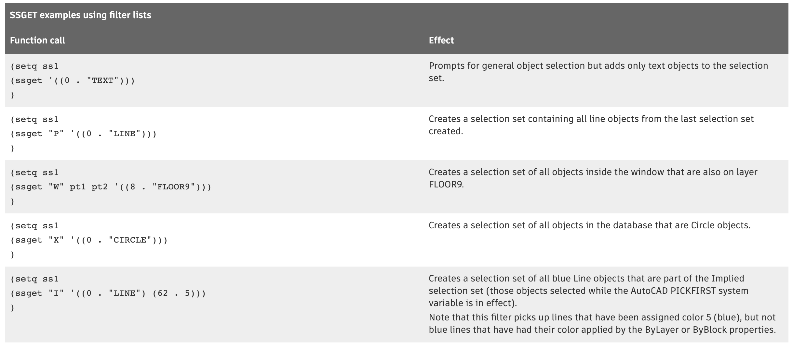
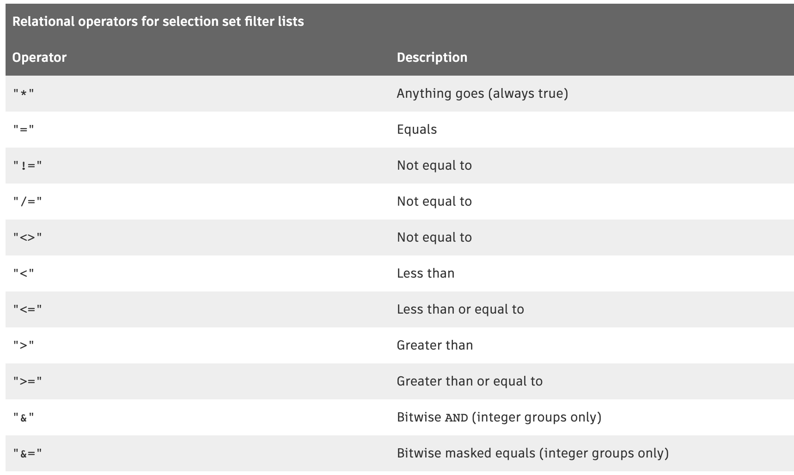
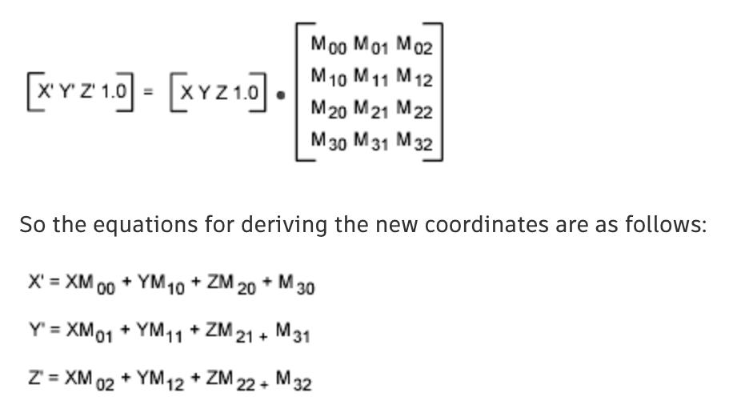
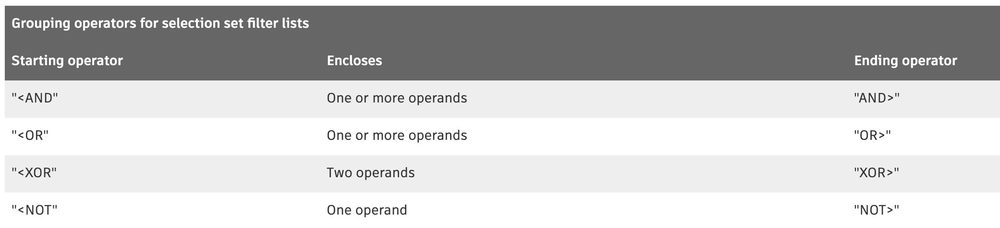
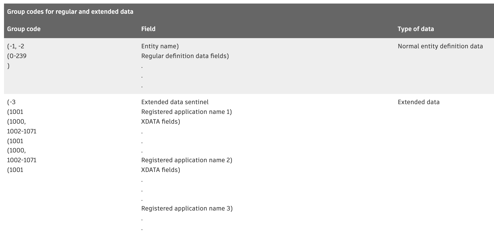
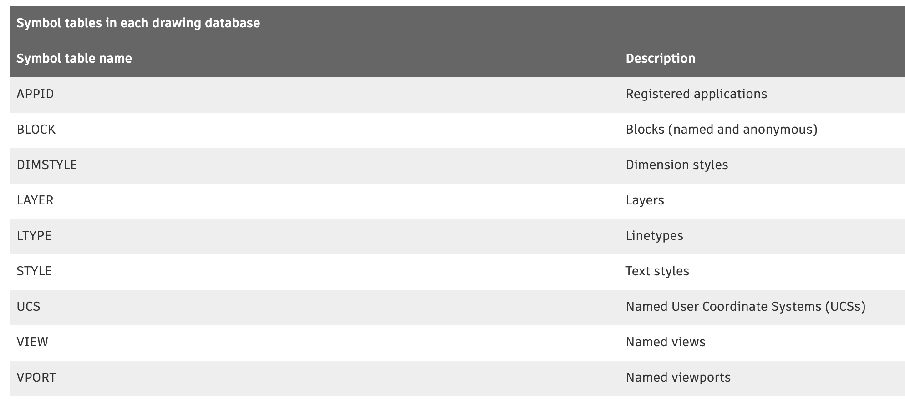

# 0105. About Using AutoLISP to Manipulate AutoCAD Objects (AutoLISP)

[Pomoc: Introduction (AutoLISP)](http://help.autodesk.com/view/OARX/2018/PLK/?guid=GUID-A0E9D801-8BE9-4BF1-85E8-3807E15F3B71)

You can select and handle objects, and use their extended data.

Most AutoLISP ® functions that handle selection sets and objects identify a set or an object by the entity name. For selection sets, which are valid only in the current session, the volatility of names poses no problem, but it does for objects because they are saved in the drawing database. An application that must refer to the same objects in the same drawing (or drawings) at different times can use the objects' handles.

1『处理的逻辑：要么是处理选择集，要么是处理特定的实体。』

AutoLISP uses symbol tables to maintain lists of graphic and non-graphic data related to a drawing, such as the layers, linetypes, and block definitions. Each symbol table entry has a related entity name and handle and can be manipulated in a manner similar to the way other AutoCAD ® entities are manipulated.

1『利用 symbol tables 来定位要操作的实体。』

## 01. About Selecting Objects and Selection Sets (AutoLISP)

Selection sets are groups of one or more selected objects (entities).

You can interactively add objects to, remove objects from, or list objects in a selection set. The following example code uses the ssget function to return a selection set containing all the objects in a drawing.

    (ssget "X")

<Selection set: 1>

AutoLISP provides a number of functions for handling selection sets. The following lists some of the functions available for working with selection sets:

1. ssget - Prompts the user to select objects (entities), and returns a selection set.

2. ssadd - Adds an object (entity) to a selection set, or creates a new selection set.

3. ssdel - Removes an object (entity) from a selection set.

4. ssname - Returns the object (entity) name of the indexed element of a selection set.

5. sslength - Returns an integer containing the number of objects (entities) in a selection set.

The ssget function provides the most general means of creating a selection set. It can create a selection set in one of the following ways:

1. Explicitly specifying the objects to select, using the Last, Previous, Window, Implied, Window Polygon, Crossing, Crossing Polygon, or Fence options.

2. Specifying a single point.

3. Selecting all objects in the database.

4. Prompting the user to select objects.

With any option, you can use filtering to specify a list of properties and conditions that the selected objects must match.

Note: Selection set and entity names do not remain the same between drawing sessions.

1『Selection set and entity names 即使是同一张图，也是在变的。』

The first argument to ssget is a string that describes which selection option to use. The next two arguments, pt1 and pt2, specify point values for the relevant options (they should be left out if they do not apply). A point list, pt-list, must be provided as an argument to the selection methods that allow selection by polygons (that is, Fence, Crossing Polygon, and Window Polygon). The last argument, filter-list, is optional. If filter-list is supplied, it specifies the list of entity field values used in filtering. For example, you can obtain a selection set that includes all objects of a given type, on a given layer, or of a given color.

1『ssget 函数有 3 个形参，第一个形参是内置的参数，各个符号代表各自的意思，详见下表；第二个形参是「点列表」，可以定选择集的范围；第三个形参是「过滤器」，可以用来过滤实体。』

The following table shows examples of calls to ssget:


When an application has finished using a selection set, it is important to release it from memory. This can be done by setting it to nil:

    (setq ss1 nil)

Remember: You can also release the memory used by the values stored in a variable by defining it as a local variable in a function.

Attempting to manage a large number of selection sets simultaneously is not recommended. An AutoLISP application cannot have more than 128 selection sets open at once. (The limit may be lower on your system.) When the limit is reached, AutoCAD will not create more selection sets. Keep a minimum number of sets open at a time, and set unneeded selection sets to nil as soon as possible. If the maximum number of selection sets is reached, you must call the gc function to free unused memory before another ssget will work.

1『要用释放选择集内存、释放变量内存（用局部变量）的概念。』

Related Concepts:

- About Modifying Selection Sets (AutoLISP)

- About Selection Set Filter Lists (AutoLISP)

- About Logical Grouping of Selection Filter Tests (AutoLISP)

- About Relational Tests in Filter Lists for Selection Sets (AutoLISP)

- About Wild-Card Patterns in Selection Set Filter Lists (AutoLISP)

- About Filtering for Extended Data in a Selection Set (AutoLISP)

- Selection Set Manipulation Functions Reference (AutoLISP)

### 1.1 About Selection Set Filter Lists (AutoLISP)

An entity filter list is an association list that uses DXF group codes in the same format as a list returned by entget.

2『「DXF group codes」的概念去了解下。』

The ssget function recognizes all group codes except entity names (group code -1), handles (group code 5), and xdata (group codes greater than 1000). If an invalid group code is used in a filter-list, it is ignored by ssget. Use the group code -3 to search for objects with xdata. When a filter-list is provided as the last argument to ssget, the function scans the selected objects and creates a selection set containing the names of all main entities matching the specified criteria. The filter-list specifies which property (or properties) of the entities are to be checked and which values constitute a match.

For example, you can obtain a selection set that includes all objects of a given type, on a given layer, or of a given color.

The following examples demonstrate different methods of using a filter-list with various object selection options.



If both the group code and the desired value are known, the list may be quoted as shown previously. If either is specified by a variable, the list must be constructed using the list and cons function. For example, the following code creates a selection set of all objects in the database that are on layer FLOOR3:

```
(setq lay_name "FLOOR3")
(setq ss1
  (ssget "X"
    (list (cons 8 lay_name))
  )
)
```

1『list(cons 8 lay_name) 等价于图里的表达式 '((8 . lay_name))』

If the filter-list specifies more than one property, an entity is included in the selection set only if it matches all specified conditions, as in the following example code:

    (ssget "X" (list (cons 0 "CIRCLE")(cons 8 lay_name)(cons 62 3)))

This code selects only Circle objects on layer FLOOR3 that are colored green. This type of test performs a Boolean “AND” operation.

The ssget function filters a selection set by scanning the selected entities and comparing the fields of each main entity against the specified filtering list. If an entity's properties match all specified fields in the filtering list, it is included in the returned selection set. Otherwise, the entity is not included in the selection set. The ssget function returns nil if none of the selected entities match the specified filtering criteria.

Note: The meaning of certain group codes can differ from entity to entity, and not all group codes are present in all entities. If a particular group code is specified in a filter, entities not containing that group code are excluded from the selection set that ssget returns.

When ssget filters a selection set, the selected objects it retrieves might include entities from both paper space and model space. However, when the selection set is passed to an AutoCAD command, only entities from the space that is currently in effect are used. (The space to which an entity belongs is specified by the value of its 67 group code.)

1『实现选择哪个图纸空间里的实体，上面的信息以后应该可以用的到。』

#### 1.1.1 About Wild-Card Patterns in Selection Set Filter Lists (AutoLISP)

Symbol names specified in filtering lists can include wild-card patterns.

1『wild-card 是指通配符。』

The wild-card patterns recognized by ssget are the same as those recognized by the wcmatch function. When filtering for anonymous blocks, you must precede the * character with a reverse single quotation mark ( ` ), also known as an escape character, because the * is read by ssget as a wild-card character.

For example, you can retrieve an anonymous block named *U2 with the following:

    (ssget "X" '((2 . "`*U2")))

1『选择特定名称块的实现方式，mark 一下。可以用来提取块里的基本信息用，做设备表的一个环节。』

1『过滤器的形参必须是一个 list，'() 应该就是一个 list 的简要表达方式。』

#### 1.1.2 About Filtering for Extended Data in a Selection Set (AutoLISP)

You can select all entities containing extended data for a particular application using the filter-list argument of ssget.

2『去了解下「extended data」的概念。』

The filter-list argument must be a list that contains -3 as its first element. The following example code selects all the objects in a drawing that include extended data for the "APPNAME" application:

    (ssget "X" '((-3 ("APPNAME"))))

You can also expand the scope of the filter to filter specific types of objects. The following example code selects all the circles in a drawing that include extended data for the "APPNAME" application:

    (ssget "X" '((0 . "CIRCLE") (-3 ("APPNAME"))))

If more than one application name is included in the -3 group's list, an AND operation is implied and the entity must contain extended data for all of the specified applications. So, the following statement would select all the objects with extended data for both the "APP1" and "APP2" applications:

    (ssget "X" '((-3 ("APP1")("APP2"))))

Wild-card matching is also permitted, so either of the following statements will select all the objects with extended data for either or both of these applications.

    (ssget "X" '((-3 ("APP[12]"))))

    (ssget "X" '((-3 ("APP1,APP2"))))

#### 1.1.3 About Relational Tests in Filter Lists for Selection Sets (AutoLISP)

Unless otherwise specified, an equivalency is implied for each item in the filter-list.

For numeric group codes (integers, reals, points, and vectors), you can specify other relations by including a special -4 group code that specifies a relational operator. The value of a -4 group code is a string indicating the test operator to be applied to the next group in the filter-list.

The following selects all circles with a radius (group code 40) greater than or equal to 2.0:

    (ssget "X" '((0 . "CIRCLE") (-4 . ">=") (40 . 2.0)))

The possible relational operators are shown in the following table:



The use of relational operators depends on the kind of group code value you are testing:

1. All relational operators except for the bitwise operators ("&" and "&=") are valid for both real- and integer-valued groups.

2. The bitwise operators "&" and "&=" are valid only for integer-valued groups.

3. The bitwise AND, "&", is true if ((integer_group & filter) /= 0)—that is, if any of the bits set in the mask are also set in integer_group.

4. The bitwise masked equals, "&=", is true if ((integer_group & filter) = filter)—that is, if all bits set in the mask are also set in integer_group (other bits might be set in the integer_group but are not checked).

4. For point group codes, the X, Y, and Z tests can be combined into a single string, with each operator separated by commas (for example, ">,>,*"). If an operator is omitted from the string (for example, "=,<>" leaves out the Z test), then the “anything goes” operator, "*", is assumed.

5. Direction vectors (group code 210) can be compared only with the operators "*", "=", and "!=" (or one of the equivalent “not equal” strings).

6. You cannot use the relational operators with string group codes; use wild-card tests instead.

#### 1.1.4 About Logical Grouping of Selection Filter Tests (AutoLISP)

You can define test groups with nested Boolean expressions to filter objects from a selection set created with ssget.

The following table lists the grouping operators that you can use to filter selection sets:

The grouping operators are specified by -4 dxf group codes, like the relational operators. They are paired and must be balanced correctly in the filter list or the ssget call will fail.

```
(ssget "X"
  '(
    (-4 . "<OR")
      (-4 . "<AND")
        (0 . "CIRCLE")
        (40 . 1.0)
      (-4 . "AND>")
      (-4 . "<AND")
        (0 . "LINE")
        (8 . "ABC")
      (-4 . "AND>")
    (-4 . "OR>")
  )
)
```

This filter list allows the selection of all circles with a radius of 1.0 plus all lines on layer "ABC". The grouping operators are not case-sensitive; for example, you can specify "and>", "<or", instead of "AND>", "<OR". Grouping operators are not allowed within the -3 dxf group code. Multiple application names specified in a -3 dxf group code use an implied AND operator. If you want to test for extended data using other grouping operators, specify separate -3 dxf group codes and group them as desired.

The following example code demonstrates how to select all circles having extended data for either application "APP1" or "APP2" but not both:

```
(ssget "X"
  '((0 . "CIRCLE")
    (-4 . "<XOR")
      (-3 ("APP1"))
      (-3 ("APP2"))
    (-4 . "XOR>")
  )
)
```

You can simplify the coding of frequently used grouping operators by setting them equal to a symbol. The previous example could be rewritten as follows (notice that in this example you must explicitly quote each list):

```
(setq <xor '(-4 . "<XOR")
         xor> '(-4 . "XOR>"))

(ssget "X"
  (list
    '(0 . "CIRCLE")
    <xor
    '(-3 ("APP1"))
    '(-3 ("APP2"))
    xor>
  )
)
```

#### 1.1.5 About Modifying Selection Sets (AutoLISP)

Once a selection set has been created, you can add entities to it or remove entities from it with ssadd and ssdel.

You can use the ssadd function to create a new selection set or add entities to an existing selection set. The following example code creates a selection set that includes the first and last entities in the current drawing (entnext and entlast):

```
(setq fname (entnext))                 ; Gets first entity in the drawing.
(setq lname (entlast))                 ; Gets last entity in the drawing.
(if (not fname)
  (princ "\nNo entities in drawing. ")
  (progn
    (setq ourset (ssadd fname))        ; Creates a selection set 
                                       ; of the first entity.
    (ssadd lname ourset)               ; Adds the last entity to 
                                       ; the selection set.
  )
)
```

The example runs correctly even if only one entity is in the database (in which case both entnext and entlast set their arguments to the same entity name). If ssadd is passed the name of an entity already in the selection set, it ignores the request and does not report an error.

The following example code removes the first entity from the selection set created in the previous example:

    (ssdel fname ourset)

If there is more than one entity in the drawing (that is, if fname and lname are not equal), then the selection set ourset contains only lname, the last entity in the drawing.

The function sslength returns the number of entities in a selection set, and ssmemb tests whether a particular entity is a member of a selection set. Finally, the function ssname returns the name of a particular entity in a selection set, using an index to the set (entities in a selection set are numbered from 0).

The following example code shows calls to ssname:

```
(setq sset (ssget))                     ; Prompts the user to create
                                        ; a selection set.
(setq ent1 (ssname sset 0))             ; Gets the name of the first
                                        ; entity in sset.
(setq ent4 (ssname sset 3))             ; Gets the name of the fourth
                                        ; entity in sset.
(if (not ent4)
  (princ "\nNeed to select at least four entities. ")
)
(setq ilast (sslength sset))            ; Finds index of the last
                                        ; entity in sset.
                                        ; Gets the name of the last
                                        ; entity in sset.
(setq lastent (ssname sset (1- ilast)))
```

Regardless of how entities are added to a selection set, the set never contains duplicate entities. If the same entity is added more than once, the later additions are ignored. Therefore, sslength accurately returns the number of distinct entities in the specified selection set.

1『选择集里是不会存在重复的实体的。』

### 1.2 About Passing Selection Sets Between AutoLISP and ObjectARX Applications (AutoLISP)

When passing selection sets between AutoLISP and ObjectARX applications, the following should be observed:

If a selection set is created in AutoLISP and stored in an AutoLISP variable, then overwritten by a value returned from an ObjectARX application, the original selection set is eligible for garbage collection (it is freed at the next automatic or explicit garbage collection).

This is true even if the value returned from the ObjectARX application was the original selection set. In the following example, if the adsfunc ObjectARX function returns the same selection set it was fed as an argument, then this selection set will be eligible for garbage collection even though it is still assigned to the same variable.

    (setq var1 (ssget))

    (setq var1 (adsfunc var1))

If you want the original selection set to be protected from garbage collection, then you must not assign the return value of the ObjectARX application to the AutoLISP variable that already references the selection set. Changing the previous example prevents the selection set referenced by var1 from being eligible for garbage collection.

    (setq var1 (ssget))

    (setq var2 (adsfunc var1))

## 02. About Object Handling (AutoLISP)

AutoLISP provides functions for handling objects. The object-handling functions are organized into two categories: functions that retrieve the entity name of a particular object, and functions that retrieve or modify entity data. 

See Object-Handling Functions (AutoLISP) in AutoLISP Function Synopsis (AutoLISP), for a complete list of the object-handling functions.

Related Concepts:

- About Obtaining Entity Information (AutoLISP)

- About Modifying an Entity without the Command Function (AutoLISP)

- About Adding an Entity without Using the Command Function (AutoLISP)

- About Entity Context and Coordinate Transform Data (AutoLISP)

- About Entity Data Functions and the Graphics Screen (AutoLISP)

- About Entity Handles and Their Uses (AutoLISP)

- Object-Handling Functions Reference (AutoLISP)

### 2.1 About Accessing an Object’s Entity Name (AutoLISP)

An AutoLISP routine must obtain an object’s entity name to make subsequent calls to the entity data or selection set functions.

The entsel and nentsel functions prompt the user to interactively select an object in the drawing area and return not only the selected object’s entity name but additional information for the routine's use. The entsel function returns both the entity name of the object selected and the center of the pick box when the pointer button on the input device was clicked.

Some entity operations require knowledge of the point by which the object was selected. Examples from the set of existing AutoCAD commands include: BREAK, TRIM, and EXTEND. The nentsel function returns the same information as the entsel function, except when a complex is selected such as a polyline or block. Both these functions accept keywords if they are preceded by a call to initget.

1『这两个函数提取不了多段线和块。』

The entnext function retrieves entity names sequentially. If entnext is called with no arguments, it returns the name of the first entity in the drawing database. If its argument is the name of an entity in the current drawing, entnext returns the name of the succeeding entity.

The entlast function retrieves the name of the last entity in the database. The last entity is the most recently created main entity, so entlast can be called to obtain the name of an entity that has just been created with a call to command.

1『直觉，提取最近的实体信息，应该大有用处。』

You can set the entity name returned by entnext to the same variable name passed to this function. This “walks” a single entity name variable through the database, as shown in the following example code:

```
(setq one_ent (entnext))         ; Gets name of first entity.
(while one_ent
..
                                 ; Processes new entity.
.
(setq one_ent (entnext one_ent))
)                                ; Value of one_ent is now nil.
```

The following example code illustrates how ssadd can be used in conjunction with entnext to create selection sets and add members to an existing set.

```
(setq e1 (entnext))
(if (not e1)                           ; Sets e1 to name of first entity.
  (princ "\nNo entities in drawing. ")
  (progn
    (setq ss (ssadd))                  ; Sets ss to a null selection set.
    (ssadd e1 ss)                      ; Returns selection set ss with e1 added.
    (setq e2 (entnext e1))             ; Gets entity following e1.
    (ssadd e2 ss)                      ; Adds e2 to selection set ss.
  )
)
```

1『上面的方法实现了，新建选择集并新增实体到这个已有的选择集。』

#### About Entity Context and Coordinate Transform Data (AutoLISP)

The nentsel and nentselp functions are similar to entsel, except they return two additional values to handle entities nested within block references.

Another difference between these functions is that when the user responds to a nentsel call by selecting a complex entity or a complex entity is selected by nentselp, these functions return the entity name of the selected subentity and not the complex entity's header, as entsel does.

For example, when the user selects a 3D polyline, nentsel returns a vertex subentity instead of the polyline header. You can retrieve the polyline header by making successive calls to entnext, stepping forward to the Seqend subentity, and then obtain the name of the header from the Deqend subentity's -2 dxf group code. The same applies when the user selects attributes in a nested block reference.

Selecting an attribute within a block reference returns the name of the attribute and the pick point. When the selected object is a component of a block reference other than an attribute, nentsel returns a list containing the following elements:

1. The selected entity's name.

2. A list containing the coordinates of the point used to pick the object.

3. The Model to World Transformation Matrix. This is a list consisting of four sublists, each of which contains a set of coordinates. This matrix can be used to transform the entity definition data points from an internal coordinate system called the model coordinate system (MCS), to the World Coordinate System (WCS). The insertion point of the block that contains the selected entity defines the origin of the MCS. The orientation of the UCS when the block is created determines the direction of the MCS axes.

4. A list containing the entity name of the block that contains the selected object. If the selected object is in a nested block (a block within a block), the list also contains the entity names of all blocks in which the selected object is nested, starting with the innermost block and continuing outward until the name of the block that was inserted in the drawing is reported.

The list returned from selecting a block with nentsel is summarized as follows:

```
(<Entity Name: ename1>   ; Name of entity.
  (Px Py Pz)             ; Pick point.
  ( (X0 Y0 Z0)           ; Model to World Transformation Matrix.
  (X1 Y1 Z1)
  (X2 Y2 Z2)
  (X3 Y3 Z3)
)
(<Entity name: ename2>   ; Name of most deeply nested block
  .                      ; containing selected object.
  ..
  <Entity name: enamen>) ; Name of outermost block
)                        ; containing selected object.
```

In the following example, create a block to use with the nentsel function.

Command: line

Specify first point:  1,1

Specify next point or [Undo]:  3,1

Specify next point or [Undo]: 3,3

Specify next point or [Close/Undo]:  1,3

Specify next point or [Close/Undo]:  c

Command:  -block

Enter block name or [?]:  square

Specify insertion base point or [Annotative]:  2,2

Select objects: Select the four lines you just drew

Select objects:  Press Enter

Then, insert the block in a UCS rotated 45 degrees about the Z axis:

Command: ucs

Current ucs name: *WORLD*

Specify origin of UCS or [Face/NAmed/OBject/Previous/View/World/X/Y/Z/ZAxis] <World>: z

Specify rotation angle about Z axis <90>: 45

Command: -insert

Enter block name or [?]:  square

Specify insertion point or [Basepoint/Scale/X/Y/Z/Rotate]: 7,0

Enter X scale factor, specify opposite corner, or [Corner/XYZ] <1>:  Press Enter

Enter Y scale factor <use X scale factor>:  Press Enter

Specify rotation angle <0>:  Press Enter

Use nentsel to select the lower-left side of the square.

    (setq ndata (nentsel))

This code sets ndata equal to a list similar to the following:

```
(<Entity Name: 400000a0>   ; Entity name.
  (6.46616 -1.0606 0.0)    ; Pick point.
  ((0.707107 0.707107 0.0) ; Model to World
  (-0.707107 0.707107 0.0) ; Transformation Matrix.
  (0.0 -0.0 1.0)
  (4.94975 4.94975 0.0)
)
  (<Entity name:6000001c>) ; Name of block containing
                           ; selected object.
)
```

Once you obtain the entity name and the Model to World Transformation Matrix, you can transform the entity definition data points from the MCS to the WCS. Use entget and assoc on the entity name to obtain the definition points expressed in MCS coordinates. The Model to World Transformation Matrix returned by nentsel is a 4×3 matrix—passed as an array of four points—that uses the convention that a point is a row rather than a column. The transformation is described by the following matrix multiplication:



The Mij, where 0 le; i, j le; 2, are the Model to World Transformation Matrix coordinates; X, Y, Z is the entity definition data point expressed in MCS coordinates, and X', Y', Z' is the resulting entity definition data point expressed in WCS coordinates.

To transform a vector rather than a point, do not add the translation vector (M30 M31 M32 from the fourth column of the transformation matrix).

Note: This is the only AutoLISP function that uses a matrix of this type. The nentselp function is preferred to nentsel because it returns a matrix similar to those used by other AutoLISP, ObjectARX, and Managed .NET functions.

Using the entity name previously obtained with nentsel, the following example illustrates how to obtain the MCS start point of a line (group code 10) contained in a block definition:

Command: (setq edata (assoc 10 (entget (car ndata))))

(10 -1.0 1.0 0.0)

The following statement stores the Model to World Transformation Matrix sublist in the symbol matrix.

Command: (setq matrix (caddr ndata))

```
((0.707107 0.707107 0.0)   ; X transformation
  (-0.707107 0.707107 0.0) ; Y transformation
  (0.0 -0.0 1.0)           ; Z transformation
  (4.94975 4.94975 0.0)    ; Displacement from WCS origin
)
```

The following statement applies the transformation formula for X' to change the X coordinate of the start point of the line from an MCS coordinate to a WCS coordinate:

```
(setq answer
  (+                                       ; add:
    (* (car (nth 0 matrix))(cadr edata))   ; M00 * X
    (* (car (nth 1 matrix))(caddr edata))  ; M10 * Y
    (* (car (nth 2 matrix))(cadddr edata)) ; M20 * Z
    (car (nth 3 matrix))                   ; M30
  )
)
```

This statement returns 3.53553, the WCS X coordinate of the start point of the selected line.

### 2.2 About Entity Data Functions (AutoLISP)

The functions described in this section operate on entity data and can be used to modify the current drawing database.

#### 2.2.1 About Adding an Entity without Using the Command Function (AutoLISP)

An application can add an entity to the drawing database by calling the entmake function.


Like that of entmod, the argument to entmake is a list whose format is similar to that returned by entget. The new entity that the list describes is appended to the drawing database (it becomes the last entity in the drawing). If the entity is a complex entity (an old-style polyline or a block), it is not appended to the database until it is complete.

The following example code creates a circle on the MYLAYER layer:

```
(entmake '((0 . "CIRCLE") ; Object type
  (8 . "MYLAYER")         ; Layer
  (10 5.0 7.0 0.0)        ; Center point
  (40 . 1.0)              ; Radius
))
```

The following entmake restrictions apply to all entities:

The first or second member in the list must specify the entity type. The type must be a valid DXF group code. If the first member does not specify the type, it can specify only the name of the entity: group -1 (the name is not saved in the database).

AutoCAD must recognize all objects that the entity list refers to. There is one exception: entmake accepts new layer names.

Any internal fields passed to entmake are ignored.

entmake cannot create viewport entities.

For entity types introduced in AutoCAD Release 13 and later releases, you must also specify subclass markers (DXF group code 100) when creating the entity. All AutoCAD entities have the AcDbEntity subclass marker, and this must be explicitly included in the entmake list. In addition, one or more subclass marker entries are required to identify the specific sub-entity type. These entries must follow group code 0 and must precede group codes that are specifically used to define entity properties in the entmake list. For example, the following is the minimum code required to create a MTEXT entity with entmake:

```
(entmake '(
  (0 . "MTEXT")
  (100 . "AcDbEntity") ; Required for all post-R12 entities.
  (8 . "ALAYER")
  (100 . "AcDbMText")  ; Identifies the entity as MTEXT.
  (10 4.0 4.0 0.0)
  (1 . "Some\\Ptext")
))
```

The following table identifies the entities that do not require subentity marker entries in the list passed to entmake:



#### 2.2.2 About Creating Complex Entities without Using the Command Function (AutoLISP)

Complex entities (an old-style polyline or a block) can be created by making multiple calls to entmake, using a separate call for each subentity.

When entmake first receives an initial component for a complex entity, it creates a temporary file in which to gather the definition data and extended data, if present. For each subsequent entmake call, the function checks if the temporary file exists. If it does, the new subentity is appended to the file. When the definition of the complex entity is complete (that is, when entmake receives an appropriate Seqend or Endblk subentity), the entity is checked for consistency; if valid, it is added to the drawing. The file is deleted when the complex entity is complete or when its creation has been canceled. You can cancel the creation of a complex entity by entering entmake with no arguments. This clears the temporary file and returns nil.

No portion of a complex entity is displayed in a drawing until its definition is complete; that is not until the final Seqend or Endblk subentity has been passed to entmake. The entlast function cannot retrieve the most recently created subentity for a complex entity that has not been completed.

As the previous paragraphs imply, entmake can construct only one complex entity at a time. If a complex entity is being created and entmake receives invalid data or an entity that is not an appropriate subentity, both the invalid entity and the entire complex entity are rejected.

Complex entities can exist in either model space or paper space, but not both. If you have changed the current space by invoking either of the AutoCAD MSPACE or PSPACE commands (with command) while a complex entity is being constructed, a subsequent call to entmake cancels the complex entity. This can also occur if the subentity has a 67 dxf group code whose value does not match the 67 dxf group code of the entity header.

#### Working with Polylines

The following example contains five calls to the entmake function which creates a single complex entity, an old-style polyline. The polyline has three vertices located at coordinates (1,1,0), (4,6,0), and (3,2,0), and has a linetype of DASHED and a color of BLUE. All other optional definition data assume default values.

```
(entmake '((0 . "POLYLINE") ; Object type
  (62 . 5)                  ; Color
  (6 . "dashed")            ; Linetype
  (66 . 1)                  ; Vertices follow
 ))

(entmake '((0 . "VERTEX")   ; Object type
  (10 1.0 1.0 0.0)          ; Start point
))

(entmake '((0 . "VERTEX")   ; Object type
  (10 4.0 6.0 0.0)          ; Second point
))

(entmake '((0 . "VERTEX")   ; Object type
  (10 3.0 2.0 0.0)          ; Third point
))

(entmake '((0 . "SEQEND"))) ; Sequence end
```

Note: For the previous example code to execute properly, the linetype DASHED must be loaded.

When defining dotted pairs, as in the above example, there must be a space on both sides of the dot. Otherwise, you will get an invalid dotted pair error message. If you want to use values stored in variables to create a dotted pair, you must use the list and cons functions instead of using the quote ( ‘ ) function.

For example, the following code sets the color and linetype for the polyline object from values to red and dashed using variables:

```
(setq clr 5
         ltype "dashed")

(entmake (list (cons 0 "POLYLINE") ; Object type
  (cons 62 clr)                    ; Color
  (cons 6 ltype)                   ; Linetype
  (cons 66 1)                      ; Vertices follow
))
```

Old-style polyline entities always include a vertices-follow flag (also dxf group code 66). The value of this flag must be 1, and the flag must be followed by a sequence of vertex entities, terminated by a Seqend subentity.

Applications can represent polygons with an arbitrarily large number of sides in polyface meshes. However, the AutoCAD entity structure imposes a limit on the number of vertices that a given face entity can specify. You can represent more complex polygons by dividing them into triangular wedges. AutoCAD represents triangular wedges as four-vertex faces where two adjacent vertices have the same value. Their edges should be made invisible to prevent visible artifacts of this subdivision from being drawn. The AutoCAD PFACE command performs this subdivision automatically, but when applications generate polyface meshes directly, the applications must do this themselves.

The number of vertices per face is the key parameter in this subdivision process. The AutoCAD PFACEVMAX system variable provides an application with the number of vertices per face entity. This value is read-only and is set to 4.

#### Working with Blocks

Block definitions begin with a block entity and end with an Endblk subentity. Newly created blocks are automatically entered into the symbol table where they can be referenced. Block definitions cannot be nested, nor can they reference themselves. A block definition can contain references to other block definitions.

Note: Before you use entmake to create a block, you should use tblsearch to ensure that the name of the new block is unique. The entmake function does not check for name conflicts in the block definitions table, so you could inadvertently redefine an existing block.

Block references can include an attributes-follow flag (dxf group code 66). If present and equal to 1, a series of attribute (Attrib) entities is expected to follow the Insert object. The attribute sequence is terminated by a Seqend subentity.

Related Concepts:

- About Modifying an Entity without the Command Function (AutoLISP)

- About Accessing an Object’s Entity Name (AutoLISP)

- About Obtaining Entity Information (AutoLISP)

- About Deleting an Entity (AutoLISP)

- About Anonymous Blocks (AutoLISP)

- About Non-Graphical Object Handling (AutoLISP)

- FAQ: What is the Difference Between Lightweight Polylines and Old-Style Polylines? (AutoLISP)

- FAQ: How Do I Process Curve-Fit and Spline-Fit Polylines? (AutoLISP)

- Object-Handling Functions Reference (AutoLISP)

##### 1. About Working With Blocks (AutoLISP)

There is no direct method for an application to check whether a block listed in the BLOCK table is actually referenced by an insert object in the drawing. You can use the following code to scan the drawing for instances of a block reference:

    (ssget "x" '((2 . "BLOCKNAME")))

You must also scan each block definition for instances of nested blocks.

##### 2. About Anonymous Blocks (AutoLISP)

The block definitions (BLOCK) table in a drawing can contain anonymous blocks (also known as unnamed blocks), that AutoCAD creates to support dynamic blocks, tables, hatch patterns, and associative dimensions.

The entmake function can create anonymous blocks other than *Tnnn (tables), *Dnnn (dimensions), and *Xnnn (hatch patterns). Unreferenced anonymous blocks are purged from the BLOCK definition table when a drawing is opened. Referenced anonymous blocks (those that have been inserted) are not purged. You can use entmake to create a block reference (insert object) to an anonymous block. (You cannot pass an anonymous block to the INSERT command.) Also, you can use entmake to redefine the block. You can modify the entities in a block (but not the block object itself) with entmod.

The name (dxf group code 2) of an anonymous block created by AutoLISP, ObjectARX, or Managed .NET has the form *Unnn, where nnn is a number generated by AutoCAD. Also, the low-order bit of an anonymous block's block type flag (dxf group code 70) is set to 1. When entmake creates a block whose name begins with * and whose anonymous bit is set, AutoCAD treats this as an anonymous block and assigns it a name. Any characters following the * in the name string passed to entmake are ignored.

Note: Anonymous block names do not remain constant. Although a referenced anonymous block becomes permanent, the numeric portion of its name can change between drawing sessions.

#### 2.2.3 About Obtaining Entity Information (AutoLISP)

The entget function returns the definition data of a specified entity as a list.

Each item in the list is specified by a DXF group code. The first item in the list contains the entity's current name.

In this example, the following (default) conditions apply to the current drawing:

Layer is 0

Linetype is CONTINUOUS

Elevation is 0

The user has drawn a line with the following sequence of commands:

Command:  line

From point:  1,2

To point:  6,6

To point:  Press Enter

An AutoLISP application can retrieve and output the definition data for the line by using the following example code:

```
(defun C:PRINTDXF ( )
  (setq ent (entlast))               ; Set ent to last entity.
  (setq entl (entget ent))           ; Set entl to association list of last entity.
  (setq ct 0)                        ; Set ct (a counter) to 0.
  (textpage)                         ; Switch to the text screen.
  (princ "\nentget of last entity:")
  (repeat (length entl)              ; Repeat for number of members in list:
    (print (nth ct entl))            ; Output a newline, then each list member.
    (setq ct (1+ ct))                ; Increments the counter by one.
  )
 (princ)                             ; Exit quietly.
)
```

This would output the following:

```
entget of last entity:
(-1 . <Entity name: 1bbd1c8>)
(0 . "LINE")
(330 . <Entity name: 1bbd0c8>)
(5 . "69")
(100 . "AcDbEntity")
(67 . 0)
(410 . "Model")
(8 . "0")
(100 . "AcDbLine")
(10 1.0 2.0 0.0)
(11 6.0 6.0 0.0)
(210 0.0 0.0 1.0)
```

The -1 item at the start of the list contains the name of the entity. The entmod function, which is described in this section, uses the name to identify the entity to be modified. The individual dotted pairs that represent the values can be extracted by using assoc with the cdr function.

Sublists for points are not represented as dotted pairs like the rest of the values returned. The convention is that the cdr of the sublist is the group code's value. Because a point is a list of two or three reals, the entire group is a three- (or four-) element list. The cdr of the group code value is the list representing the point, so the convention that cdr always returns the value is preserved.

The group codes for the components of the entity are those used by DXF. As with DXF, the entity header items (color, linetype, thickness, the attributes-follow flag, and the entity handle) are returned only if they have values other than the default. Unlike DXF, optional entity definition fields are returned whether or not they equal their defaults and whether or not associated X, Y, and Z coordinates are returned as a single point variable, rather than as separate X (10), Y (20), and Z (30) group codes.

All points associated with an object are expressed in terms of that object's Object Coordinate System (OCS). For point, line, 3D line, 3D face, 3D polyline, 3D mesh, and dimension objects, the OCS is equivalent to the WCS (the object points are World points). For all other objects, the OCS can be derived from the WCS and the object's extrusion direction (its 210 group code). When working with objects that are drawn using coordinate systems other than the WCS, you may need to convert the points to the WCS or to the current UCS by using the trans function.

When writing functions to process entity lists, make sure the function logic is independent of the order of the sublists; use assoc to guarantee this. The assoc function searches a list for a group code of a specified type. The following code returns the object type "LINE" (0) from the list entl.

(cdr (assoc 0 entl))

If the group code specified is not present in the list (or if it is not a valid group code), assoc returns nil.

Caution: Before performing an entget on vertex entities, you should read or write the polyline entity's header. If the most recently processed polyline entity is different from the one to which the vertex belongs, width information (the 40 and 41 group codes) can be lost.

#### 2.2.4 About Modifying an Entity without the Command Function (AutoLISP)

An entity can be modified directly by changing its entity list and posting the changes back to the database.

The entmod function modifies an entity by passing it a list in the same format as a list returned by entget but with some of the entity group code values (presumably) modified by the application. This function complements entget. The primary mechanism by which an AutoLISP application updates the database is by retrieving an entity with entget, modifying its entity list, and then passing the list back to the database with entmod.

The following example code retrieves the definition data of the first entity in the drawing and changes its layer property to MYLAYER.

```
(setq en (entnext))         ; Sets en to first entity name in the drawing.
(setq ed (entget en))       ; Sets ed to the entity data for entity name en.
(setq ed
  (subst (cons 8 "MYLAYER")
    (assoc 8 ed)            ; Changes the layer group in ed.
    ed                      ; to layer MYLAYER.
  )
)
(entmod ed)                 ; Modifies entity en's layer in the drawing.
```

There are restrictions on the changes to the database that entmod can make; entmod cannot change the following:

The entity's type or handle.

Internal fields. (Internal fields are the values that AutoCAD assigns to certain group codes: -2, entity name reference; -1, entity name; 5, entity handle.) Any attempt to change an internal field—for example, the main entity name in a Seqend subentity (group code -2)—is ignored.

Viewport entities. An attempt to change a viewport entity causes an error.

Other restrictions apply when modifying dimensions and hatch patterns.

AutoCAD must recognize all objects (except layers) that the entity list refers to. The name of any text style, linetype, shape, or block that appears in an entity list must be defined in the current drawing before the entity list is passed to entmod. The one exception is that entmod accepts new layer names. If the entity list refers to a layer name that has not been defined in the current drawing, entmod creates a new layer. The attributes of the new layer are the standard default values used by the New option of the AutoCAD LAYER command.

The entmod function can modify subentities such as polyline vertices and block attributes. If you use entmod to modify an entity in a block definition, this affects all references to that block which exist in model space and paper space. Attributes, unless defined as constant, are not updated for each block reference that exists in a drawing. Also, entities in block definitions cannot be deleted by entdel.

#### 2.2.5 About Deleting an Entity (AutoLISP)

Entities can be deleted using the entdel function or AutoCAD ERASE command (with command).

Entities are not purged from the database until the end of the current drawing session, so if the application calls entdel on an entity that was deleted during that session, the entity is undeleted.

Attributes and old-style polyline vertices cannot be deleted independently of their parent entities. The entdel function and AutoCAD ERASE command only operate on main entities. If you need to delete an attribute or vertex, you can use the AutoCAD ATTEDIT or PEDIT commands with command.

### 2.3 About Entity Handles and Their Uses (AutoLISP)

The handent function retrieves the name of an entity with a specific handle.

As with entity names, handles are unique within a drawing. However, an entity's handle is constant throughout its life. AutoLISP applications that manipulate a specific database can use handent to obtain the current name of an entity they must use. You can use the AutoCAD LIST command to get the handle of a selected object.

The following example code uses handent to obtain and display the entity name that is associated with the handle “5a2”.

```
(if (not (setq e1 (handent "5a2")))
  (princ "\nNo entity with that handle exists. ")
  (princ e1)
)
```

In one particular editing session, this code might display the following:

<Entity name: 60004722>

In another editing session with the same drawing, the fragment might display an entirely different number. But in both cases the code would be accessing the same entity.

The handent function has an additional use. Entities can be deleted from the database with entdel. The entities are not purged until the current drawing ends. This means that handent can recover the names of deleted entities, which can then be restored to the drawing by a second call to entdel.

Note: Handles are provided for block definitions, including subentities.

Entities in drawings that are cross-referenced by way of XREF Attach are not actually part of the current drawing; their handles are unchanged but cannot be accessed by handent. However, when drawings are combined by means of INSERT, INSERT *, XREF Bind (XBIND), or partial DXFIN, the handles of entities in the incoming drawing are lost, and incoming entities are assigned new handle values to ensure each handle in the current drawing remains unique.

### 2.4 About Entity Data Functions and the Graphics Screen (AutoLISP)

Changes to the drawing made by the entity data functions are reflected on the graphics screen, provided the entity being deleted, undeleted, modified, or created is in an area and on a layer that is currently visible.

There is one exception; when entmod modifies a subentity, it does not update the image of the entire (complex) entity. If, for example, an application modifies 100 vertices of an old-style polyline with 100 calls to entmod, the time required to recalculate and redisplay the entire polyline is unacceptably slow. Instead, an application can perform a series of subentity modifications, and then redisplay the entire entity with a single call to the entupd function.

Consider the following; if the first entity in the current drawing is an old-style polyline with several vertices, the following code modifies the second vertex of the polyline and regenerates its display.

```
(setq e1 (entnext))    ; Sets e1 to the polyline's entity name.
(setq v1 (entnext e1)) ; Sets v1 to its first vertex.
(setq v2 (entnext v1)) ; Sets v2 to its second vertex.
(setq v2d (entget v2)) ; Sets v2d to the vertex data.
(setq v2d
  (subst
    '(10 1.0 2.0 0.0)
    (assoc 10 v2d)     ; Changes the vertex's location in v2d
    v2d                ; to point (1,2,0).
  )
)
(entmod v2d)           ; Moves the vertex in the drawing.
(entupd e1)            ; Regenerates the polyline entity e1.
```

The argument to entupd can specify either a main entity or a subentity. In either case, entupd regenerates the entire entity. Although its primary use is for complex entities, entupd can regenerate any entity in the current drawing.

Note: To ensure that all instances of the block references are updated, you must regenerate the drawing by invoking the AutoCAD REGEN command (with command). The entupd function is not sufficient if the modified entity is in a block definition.

### 2.5 About Non-Graphical Object Handling (AutoLISP)

A drawing database contains two types of non-graphical objects: dictionary and symbol table objects.

Although there are similarities between these object types, they are handled differently. All object types are supported by the entget, entmod, entdel, and entmake functions, although object types individually dictate their participation in these functions and may refuse any or all processing. With respect to AutoCAD built-in objects, the rules apply for symbol tables and for dictionary objects.

All rules and restrictions that apply to graphical objects apply to non-graphical objects as well. Non-graphical objects cannot be passed to the entupd function. When using entmake, the object type determines where the object will reside. For example, if a layer object is passed to entmake, it automatically goes to the layer symbol table. If a graphical object is passed to entmake, it will reside in the current space (model or paper).

## 03. About Extended Data - Xdata (AutoLISP)

Several AutoLISP functions are provided to handle extended data (xdata), which is created by routines written with AutoLISP, ObjectARX, or Managed .NET.

If an entity contains xdata, it follows the entity's regular definition data. You can retrieve an entity's extended data by calling entget. The entget function retrieves an entity's regular definition data and the xdata for those applications specified in the entget call.

When xdata is retrieved with entget, the beginning of extended data is indicated by a -3 dxf group code. The -3 dxf group code is in a list that precedes the first 1001 dxf group code. The 1001 dxf group code contains the application name of the first application retrieved, as shown in the table and as described in the topics in this section.



Related Concepts

About Attaching Extended Data to an Entity (AutoLISP)

About Extended Data Group Codes (AutoLISP)

About Filtering for Extended Data in a Selection Set (AutoLISP)

About Handles in Extended Data (AutoLISP)

About Management of Extended Data Memory Use (AutoLISP)

About Retrieving Extended Data (AutoLISP)

About Modifying an Entity without the Command Function (AutoLISP)

About Registered Applications (AutoLISP)

Extended Data-Handling Functions Reference (AutoLISP)

### 3.1 About Extended Data Group Codes (AutoLISP)

Extended data consists of one or more 1001 group codes, each of which begin with a unique application name.

The xdata groups returned by entget follow the definition data in the order in which they are saved in the database. Within each application's group, the contents, meaning, and organization of the data are defined by the application. AutoCAD maintains the information but does not use it. The table also shows that the group codes for xdata are in the range 1000-1071. Many of these group codes are for familiar data types, as follows:

String

1000. Strings in extended data can be up to 255 bytes long (with the 256th byte reserved for the null character).

Application Name

1001 (also a string value). Application names can be up to 31 bytes long (the 32nd byte is reserved for the null character) and must adhere to the rules for symbol table names (such as layer names). An application name can contain letters, digits, and the special characters $ (dollar sign), - (hyphen), and _ (underscore). It cannot contain spaces.

Layer Name

1003. Name of a layer associated with the xdata.

Database -Handle

1005. Handle of an entity in the drawing database.

3D Point

1010. Three real values, contained in a point.

Real

1040. A real value.

Integer

1070. A 16-bit integer (signed or unsigned).

Long

1071. A 32-bit signed (long) integer. If the value that appears in a 1071 group code is a short integer or real value, it is converted to a long integer; if it is invalid (for example, a string), it is converted to a long zero (0L).

Note: AutoLISP manages 1071 group codes as real values. If you use entget to retrieve an entity's definition list that contains a 1071 group code, the value is returned as a real, as shown in the following example:

(1071 . 12.0)

If you want to create a 1071 group code in an entity with entmake or entmod, you can use either a real or an integer value, as shown in the following example:

```
(entmake '((..... (1071 . 12) .... )))
(entmake '((..... (1071 . 12.0) .... )))
(entmake '((..... (1071 . 65537.0) .... )))
(entmake '((..... (1071 . 65537) .... )))
```

But AutoLISP still returns the group code value as a real:

(entmake '((..... (1071 . 65537) .... )))

The preceding statement returns the following:

(1071 . 65537.0)

ObjectARX and Managed .NET always manages 1071 group codes as long integers.

Several other extended data group codes have special meanings in this context (if the application chooses to use them):

Control String

1002. An xdata control string can be either "{" or "}". These braces enable the application to organize its data by subdividing it into lists. The left brace begins a list, and the right brace terminates the most recent list. Lists can be nested.

Note: If a 1001 group code appears within a list, it is treated as a string and does not begin a new application group code.

Binary Data

1004. Binary data that is organized into variable-length chunks, which can be handled in ObjectARX and Managed .NET with the ads_binary structure. The maximum length of each chunk is 127 bytes.

Note: AutoLISP cannot directly handle binary chunks, so the same precautions that apply to long (1071) group codes apply to binary group codes as well.

World Space Position

1011. Unlike a simple 3D point, the WCS coordinates are moved, scaled, rotated, and mirrored along with the parent entity to which the extended data belongs. The WCS position is also stretched when the AutoCAD STRETCH command is applied to the parent entity and when this point lies within the select window.

World Space -Displacement

1012. A 3D point that is scaled, rotated, or mirrored along with the parent, but not stretched or moved.

World -Direction

1013. A 3D point that is rotated or mirrored along with the parent, but not scaled, stretched, or moved. The WCS direction is a normalized displacement that always has a unit length.

Distance

1041. A real value that is scaled along with the parent entity.

Scale Factor

1042. Also a real value that is scaled along with the parent.

### 3.2 About Registered Applications (AutoLISP)

An application must register its name or names to be recognized by AutoCAD.

Extended data must contain an application name before it can be attached to an entity and that application name must also exist in the APPID symbol table. Registration is done with the regapp function, which specifies a string to use as an application name. If it successfully adds the name to APPID, it returns the name of the application; otherwise it returns nil. A result of nil indicates that the name is already present in the symbol table. This is not an actual error condition but an expected return value, because the application name needs to be registered only once per drawing.

Before you register an application, you should first check to see if the name is not already in the APPID symbol table. If the name is not there, the application must register it. Otherwise, it can simply go ahead and attach the extended data to an entity for the application.

The following example code demonstrates the typical use of regapp.

```
(setq appname "MYAPP_2356")                            ; Unique application name.
(if (tblsearch "appid" appname)                        ; Checks if already registered.
  (princ (strcat "\n" appname " already registered."))

  (if (= (regapp appname) nil)                         ; Some other problem.
    (princ (strcat "\nCan't register XDATA for " appname ". "))
  )
)
```

The regapp function provides a measure of security, but it cannot guarantee that two separate applications have not chosen the same name. One way of ensuring this is to adopt a naming scheme that uses the company or product name and a unique number (like your telephone number or the current date and time).

### 3.3 About Retrieving Extended Data (AutoLISP)

An application can obtain the extended data (xdata) that it has attached to an entity with entget.

The entget function can return an entity’s definition data and the xdata for the applications it requests. It requires an additional argument, application, that specifies the application names. The names passed to entget must correspond to applications registered by a previous call to regapp; they can also contain wild-card characters.

By default, associative hatch patterns contain xdata. The following example code demonstrates the association list of this xdata. Before you can use the code, create a closed boundary and apply an associative hatch object to the boundary.

(entget (car (entsel)) '("ACAD"))

Select object: Select an associative hatch

Entering the preceding code at the command line returns a list that looks something like this:

```
((-1 . <Entity name: 7ffffb05e10>) (0 . "HATCH") (330 . <Entity name: 7ffffb039f0>) (5 . "1D9") (100 . "AcDbEntity") (67 . 0) (410 . "Model") (8 . "0") (100 . "AcDbHatch") (10 0.0 0.0 0.0) (210 0.0 0.0 1.0) (2 . "ANSI31") (70 . 0) (71 . 1) (91 . 1) (92 . 7) (72 . 0) (73 . 1) (93 . 4) (10 31.2567 17.3197 0.0) (10 7.77575 17.3197 0.0) (10 7.77575 8.83313 0.0) (10 31.2567 8.83313 0.0) (97 . 1) (330 . <Entity name: 7ffffb05d50>) (75 . 1) (76 . 1) (52 . 0.0) (41 . 3.0) (77 . 0) (78 . 1) (53 . 0.785398) (43 . 0.0) (44 . 0.0) (45 . -0.265165) (46 . 0.265165) (79 . 0) (47 . 0.0289642) (98 . 1) (10 21.1106 14.5391 0.0) (-3 ("ACAD" (1010 0.0 0.0 0.0))))
```
The following example code demonstrates a typical sequence for retrieving xdata for two specified applications. Note that the application argument accepts application names in list form:

```
(setq working_elist
  (entget ent_name
    '("MY_APP_1" "SOME_OTHER") ; Only xdata from "MY_APP_1"
  )                            ; and "SOME_OTHER" is retrieved.
)
(if working_elist
  (progn
    ...                        ; Updates working entity groups.
    (entmod working_elist)     ; Only xdata from registered
  )                            ; applications still in the
)                              ; working_elist list are modified.
```

As the example code demonstrates, you can modify xdata retrieved by entget by using a subsequent call to entmod, just as you can use entmod to modify normal entity definition data. You can also create xdata by defining it in the entity list passed to entmake. Returning the xdata of only those applications specifically requested protects one application from corrupting another application's data. It also controls the amount of memory that an application needs to use and simplifies the xdata processing that an application needs to perform.

Note: Because the strings passed by application can include wild-card characters, an application name of "*" will cause entget to return all extended data attached to an entity.

### 3.4 About Attaching Extended Data to an Entity (AutoLISP)

You can use extended data (xdata) to store any type of information you want on an entity.

The xdata attached to an entity might be a record in an external database, a date and time stamp when an entity was added or modified, or contain information that represents an item in the real-world such as a telephone or workstation. Since xdata is hidden from the user, it makes it harder to modify without using a custom application.

Note: Xdata attached to an entity is maintained when an object is copied in the current drawing or between drawings.

The following example code demonstrates the basics of attaching xdata to the last entity added to a drawing. Before executing the following example code, draw an entity (such as a line or a circle):

```
; Gets the association list of definition data
; for the last entity.
(setq lastent (entget (entlast)))

; Registers the application name.
(regapp "NEWDATA")

(setq exdata                        ; Sets the variable
  '((-3 ("NEWDATA"                  ; exdata equal to the
    (1000 . "This is a new thing!") ; new extended data—
  )))                               ; in this case, a text
)                                   ; string.

; Appends new data list to entity's list.
(setq newent
  (append lastent exdata)) 

; Modifies the entity with the new definition data.
(entmod newent)
```

The following example code can be used to verify that your new xdata has been attached to the entity:

(entget (car (entsel)) '("NEWDATA"))

### 3.5 About Management of Extended Data Memory Use (AutoLISP)

Extended data is limited to 16K per entity.

Because the xdata of an entity can be created and maintained by multiple applications, problems can result when the size of the xdata approaches its limit. The following functions can be used to help manage the memory that xdata occupies.

xdsize - Returns the amount of memory (in bytes) that the xdata in a list occupies.

xdroom - Returns the remaining number of free bytes that can still be appended to the entity.

The xdsize function can be slow when reading a large extended data list, so it is not recommended that you call it frequently. A better approach is to use it (in conjunction with xdroom) in an error handler. If a call to entmod fails, you can use xdsize and xdroom to find out whether the call failed because the entity did not have enough room for the xdata.

### 3.6 About Handles in Extended Data (AutoLISP)

Extended data can contain handles (dxf group code 1005) to save relational structures within a drawing.

This allows you to build relationships between two or more entities by saving the handle of one object to another objects’s xdata. The handle can be retrieved later from the xdata and passed to handent to obtain the other entity. Because more than one entity can reference another, handles in xdata might not necessarily be unique. The AutoCAD AUDIT command does require that handles in extended data either be NULL or valid entity handles (within the current drawing). The best way to ensure that xdata entity handles are valid is to obtain a referenced entity's handle directly from its definition data by means of entget. The handle value is in dxf group code 5.

When you reference entities in other drawings (for example, entities that are attached with AutoCAD XREF command), you can avoid protests from the AutoCAD AUDIT command by using extended entity strings (dxf group code 1000) rather than handles (dxf group code 1005). The handles of cross-referenced entities are either not valid in the current drawing, or they conflict with valid handles. However, if an xref attachment changes to a bound xref or is combined with the current drawing in some other way, it is up to the application to revise the entity references accordingly.

When drawings are combined by means of INSERT, INSERT*, or XREF Bind (XBIND), or partial DXFIN, handles are translated so they become valid in the current drawing. (If the incoming drawing did not employ handles, new ones are assigned.) Extended entity handles that refer to incoming entities are also translated when these commands are invoked.

When an entity is placed in a block definition (with the AutoCAD BLOCK command), the entity within the block is assigned new handles. (If the original entity is restored by means of the AutoCAD OOPS command, it retains its original handles.) The value of any xdata handles remains unchanged. When a block is exploded (with the AutoCAD EXPLODE command), xdata handles are translated in a manner similar to the way they are translated when drawings are combined. If the xdata handle refers to an entity that is not within the block, it is unchanged. However, if the xdata handle refers to an entity that is within the block, the data handle is assigned the value of the new (exploded) entity's handle.

## 04. About Xrecord Objects (AutoLISP)

Xrecord objects are used to store and manage arbitrary data.


They are composed of DXF group codes with normal object group codes (that is, non-xdata group codes), ranging from 1 through 369 for supported ranges. These objects are similar in concept to xdata but are not limited by size or order.

The following code examples create and list xrecord data in a custom dictionary named XRECLIST.

(defun C:MAKEXRECORD( / xrec xname )

  ; create the xrecord's data list.

  (setq xrec '((0 . "XRECORD")(100 . "AcDbXrecord")

    (1 . "This is a test xrecord list")

    (10 1.0 2.0 0.0) (40 . 3.14159) (50 . 3.14159)

    (62 . 1) (70 . 180))

  )

  ; use entmakex to create the xrecord with no owner.

  (setq xname (entmakex xrec))

  ; add the new xrecord to the named object dictionary.

  (dictadd (namedobjdict) "XRECLIST" xname)

 (princ)

)

(defun C:LISTXRECORD ( / xlist )

  ; find the xrecord in the named object dictionary.

  (setq xlist (dictsearch (namedobjdict) "XRECLIST"))

  ; print out the xrecord's data list.

  (princ xlist)

 (princ)

)

The results of the LISTXRECORD command will look similar to the following:

((-1 . <Entity name: 7ffffb05ee0>) (0 . XRECORD) (5 . 1E6) (102 . {ACAD_REACTORS) (330 . <Entity name: 7ffffb038c0>) (102 . }) (330 . <Entity name: 7ffffb038c0>) (100 . AcDbXrecord) (280 . 1) (1 . This is a test xrecord list) (10 1.0 2.0 0.0) (40 . 3.14159) (50 . 3.14159) (62 . 1) (70 . 180))

## 05. About Symbol Table and Dictionary Access (AutoLISP)

AutoLISP provides functions for accessing symbol table and dictionary entries. Examples of the tblnext and tblsearch functions are provided in the following sections. For a complete list of the symbol table and dictionary access functions, see About Symbol Table and Dictionary-Handling Functions (AutoLISP) in the AutoLISP Function Synopsis (AutoLISP) topic.

For additional information on non-graphic objects see, About Non-Graphic Object Handling (AutoLISP).

### 1. About Symbol Tables (AutoLISP)

Symbol tables are used to store non-graphical information in a drawing’s database.

The symbol tables that exist in a drawing database are:



Symbol table entries can be manipulated using the following functions:

tblobjname - Returns the entity name of a specified symbol table entry.

tblsearch - Searches a symbol table for a symbol name.

tblnext - Returns the next item in a symbol table.

entdel - Deletes objects (entities) or restores previously deleted objects.

entget - Retrieves an object's (entity's) definition data list.

entmake - Creates a new entity in the drawing.

entmod - Modifies the definition data of an object (entity).

handent - Returns an object (entity) name based on its handle.

Symbol Table Limitations

The following rules apply to symbol tables:

Symbol table entries can be created using entmake with a few restrictions, other than being valid record representations, and name conflicts can only occur in the VPORT table. *ACTIVE entries cannot be created.

Renaming symbol table entries to duplicate names is not acceptable, except for the VPORT symbol table.

Symbol table entries cannot be deleted with entdel.

The object states of symbol tables and symbol table entries may be accessed with entget by passing the entity name. The tblobjname function can be used to retrieve the entity name of a symbol table entry.

Symbol tables themselves cannot be created with entmake; however, symbol table entries can be created with entmake.

Handle group codes (5, 105) cannot be changed in entmod, nor specified in entmake.

Symbol table entries that are not in the APPID symbol table can have many of their fields modified with entmod. Modifying a symbol table record list must include its entity name, which can be obtained from entget but not from the tblsearch and tblnext functions. The 70 group code of symbol table entries is ignored in entmod and entmake operations.

Accessing Symbol Table Entries

The tblnext function sequentially scans symbol table entries, and the tblsearch function retrieves specific entries. Symbol table names are specified by strings. Both functions return lists with DXF group codes that are similar to the entity data returned by entget.

The first call to tblnext returns the first entry in the specified symbol table. Subsequent calls that specify the same table return successive entries, unless the second argument to tblnext (rewind) is nonzero, in which case tblnext returns the first entry again.

In the following example code, the function GETBLOCK retrieves the symbol table entry for the first block (if any) in the current drawing, and then displays it in a list format.

(defun C:GETBLOCK (/ blk ct)

  (setq blk (tblnext "BLOCK" 1))      ; Gets the first BLOCK entry.

  (setq ct 0)                         ; Sets ct (a counter) to 0.

  (textpage)                          ; Switches to the text screen.

  (princ "\nResults from GETBLOCK: ")

  (repeat (length blk)                ; Repeats for the number of

                                      ; members in the list.

    (print (nth ct blk))              ; Prints a new line, then each

                                      ; list member.

    (setq ct (1+ ct))                 ; Increments the counter by 1.

  )

 (princ)                              ; Exits quietly.

)

Entries retrieved from the BLOCK table contain a -2 group code that contains the name of the first entity in the block definition. If the block is empty, this is the name of the block's Endblk entity, which is never seen on occupied blocks. In a drawing with a single block named BOX, a call to GETBLOCK displays the following. (The name value varies from session to session.)

Results from GETBLOCK:

(0 . "BLOCK")

(2 . "BOX")

(70 . 0)

(10 9.0 2.0 0.0)

(-2 . <Entity name: 40000126>)

As with tblnext, the first argument to tblsearch is a string that names a symbol table, but the second argument is a string that names a particular symbol table entry in the table. If the symbol table entry is found, tblsearch returns its data. This function has a third argument, setnext, that you can use to coordinate operations with tblnext. If setnext is nil, the tblsearch call has no effect on tblnext, but if setnext is non-nil, the next call to tblnext returns the symbol table entry following the symbol table entry found by tblsearch.

The setnext option is useful when you are handling the VPORT symbol table, because all viewports in a particular viewport configuration have the same name (such as *ACTIVE). If the VPORT symbol table is accessed when the AutoCAD TILEMODE system variable is turned off, any changes have no visible effect until TILEMODE is turned on. Do not confuse VPORTS, which is described by the VPORT symbol table with paper space viewport entities.

The following processes all viewports in the 4VIEW configuration:

(setq v (tblsearch "VPORT" "4VIEW" T))         ; Finds first VPORT entry.

  (while (and v (= (cdr (assoc 2 v)) "4VIEW"))

  ..

                                               ; ... Processes entry ...

  .

  (setq v (tblnext "VPORT"))                   ; Gets next VPORT entry.

)

Parent topic: About Symbol Table and Dictionary Access (AutoLISP)

Related Concepts

About Non-Graphical Object Handling (AutoLISP)

FAQ: What Symbol Table Entries Cannot Be Renamed or Modified? (AutoLISP)

About Creating Complex Entities without Using the Command Function (AutoLISP)

About Anonymous Blocks (AutoLISP)

About Accessing an Object’s Entity Name (AutoLISP)

About Dictionary Objects and Entries (AutoLISP)

Symbol Table and Dictionary-Handling Functions Reference (AutoLISP)

### 2. About Dictionary Objects and Entries (AutoLISP)

A dictionary is a container object, similar to symbol tables.

Dictionaries are stored in the drawing’s named object dictionary, which is the root of all non-graphical objects in a drawing, or as an extension dictionary attached to an object. Each drawing can contain different dictionaries, so a routine should not expect that a specific dictionary might exist in a drawing. The dictionaries in a drawing’s named object dictionary can be accessed using namedobjdict, which returns an entity name. Use entget to access the entity list that represents all of the dictionaries in the drawing.

The following rules apply to dictionary objects:

Dictionary objects can be examined with entget and their xdata modified with entmod. Their entries cannot be altered with entmod. All access to their entries are made through the dictsearch and dictnext functions.

Dictionary entry contents cannot be modified through entmod, although xdata can be modified.

Dictionary entries that begin with ACAD* cannot be renamed.

Dictionary entries can be queried with the dictsearch and dictnext functions. Each dictionary entry consists of a text name key plus a hard ownership handle reference to the entry object. Dictionary entries may be removed by directly passing entry object names to the entdel function. The text name key uses the same syntax and valid characters as symbol table names. A key name can be changed using the dictrename function.

The following example code lists each of the dictionaries in the drawing’s named object dictionary and their entries:

(defun c:ListDictionaries ( / ed ed1)

  (prompt "\nDictionaries in current drawing: ")

  (foreach ed (entget (namedobjdict))

    (progn

      (cond ((= (car ed) 3)

        (prompt (strcat "\n" (cdr ed))))

            ((= (car ed) 350)

        (progn

          (foreach ed1 (entget (cdr ed))

            (if (= (car ed1) 3)

              (prompt (strcat "\n  " (cdr ed1)))

            )

          )

        ))

      )

    )

  )

 (princ)

)

The following is an example of the output you might see in Text History window after c:ListDictionaries is executed.

Dictionaries in current drawing:

ACAD_CIP_PREVIOUS_PRODUCT_INFO

ACAD_COLOR

ACAD_DETAILVIEWSTYLE

  Imperial24

ACAD_GROUP

ACAD_LAYOUT

  Layout1

  Layout2

  Model

ACAD_MATERIAL

  ByBlock

  ByLayer

  Global

ACAD_MLEADERSTYLE

  Annotative

  Standard

ACAD_MLINESTYLE

  Standard

ACAD_PLOTSETTINGS

ACAD_PLOTSTYLENAME

  Normal

ACAD_SCALELIST

  A0

  A1

  A2

  A3

  A4

  A5

  A6

  A7

  A8

  A9

  B0

  B1

  B2

  B3

  B4

  B5

  B6

  B7

  B8

  B9

  C0

  C1

  C2

  C3

  C4

  C5

  C6

  C7

  C8

  C9

  D0

  D1

  D2

ACAD_SECTIONVIEWSTYLE

  Imperial24

ACAD_TABLESTYLE

  Standard

ACAD_VISUALSTYLE

  2dWireframe

  Basic

  Brighten

  ColorChange

  Conceptual

  Dim

  EdgeColorOff

  Facepattern

  Flat

  FlatWithEdges

  Gouraud

  GouraudWithEdges

  Hidden

  JitterOff

  Linepattern

  OverhangOff

  Realistic

  Shaded

  Shaded with edges

  Shades of Gray

  Sketchy

  Thicken

  Wireframe

  X-Ray

AcDbVariableDictionary

  CANNOSCALE

  CMLEADERSTYLE

  CTABLESTYLE

  CVIEWDETAILSTYLE

  CVIEWSECTIONSTYLE

  DIMASSOC

  HIDETEXT

  LAYEREVAL

  LAYERNOTIFY

#### Example: Accessing AutoCAD Groups (AutoLISP)

This example demonstrates one method for accessing the entities contained in a group.

This example assumes a group named G1 exists in the current drawing.

(setq objdict (namedobjdict))

(setq grpdict (dictsearch objdict "ACAD_GROUP"))

This sets the grpdict variable to the entity definition list of the ACAD_GROUP dictionary and returns the following:

((-1 . <Entity name: 8dc10468>) (0 . "DICTIONARY") (5 . "D")

(102 . "{ACAD_REACTORS") (330 . <Entity name: 8dc10460>)

(102 . "}") (100 . "AcDbDictionary") (3 . "G1")

(350 . <Entity name: 8dc41240>))

The following code sets the variable group1 to the entity definition list of the G1 group:

(setq group1 (dictsearch (cdar grpdict) "G1"))

((-1 . <Entity name: 8dc10518>) (0 . "GROUP") (5 . "23")

(102 . "{ACAD_REACTORS") (330 . <Entity name: 8dc10468>)

(102 . "}") (100 . "AcDbGroup") (300 . "line and circle") (70 . 0) (71

. 1) (340 . <Entity name: 8dc10510>)(340 . <Entity name: 8dc10550>))

The 340 group codes are the entities that belong to the group.

