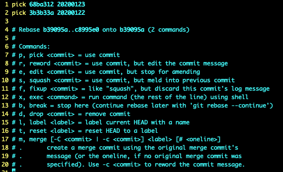

# 0201. 常用场景

## 2.1 怎么删除不需要的分支？

如何去清除自己不想要的分支呢？

```
git branch -d [分支名]
```

有时会提示 -d 清除不了，如果你确定是要清除掉这个分支的话，改成 -D 即可清除。图形化显示的命令需要经常用的：

```
gitk --all
```

## 2.2 怎么修改最新 commit 的 message？

```
git commit --amend
```

进入一个文件的 vim 界面。第一行的字符就是最新 commit 的 message 内容，直接修改即可。

1『一个小细节，vim 文件里有多行叠在一起成了一个「+」，点删除键「delete」键展开。』

## 2.3 怎么修改老旧 commit 的 message？

message 是 commit 数据结构的一个属性。首先，要变更的话，该 commit 的 ID 号肯定是要变的。其次，rebase 变更的时候一定要选择该 commit 的父基（上一个）。

```
git rebase -i 8a5da0636
```

进入一个文件的 vim 界面。



比如修改第一行：

```
r 68ba312 20200123
```

注意，只需把 pick 修改为 reword 或者 r 即可。保存退出，退出后又自动进入一个交互界面。在这个界面里修改 commit 的 message 信息。变基操作是离不开分离头指针（detached HEAD）的。

一个完整的变基过程：git 先分离头指针，然后在上面做调整，调整完后还把最新的 commit 产生后用一个指针指向它。即当前工作的 master 分支已经肯定变了。

1『第一次修改时用的 r，失败了，第二次用的 reword 成功了，以后最好还是用 reword。』

注意：上面所说的变基的行为，只针对在自己的分支上做变更，还没有贡献到团队的集成分支上，如果已经贡献上去，就不能这样轻易的变基了，否者会影响到团队其他成员。

## 2.4 怎样把连续的多个 commit 整理成 1 个？

会遇到需要我们整理自己过去所创建的 commit 的场景。

```
git log --graph
```

查看分支可以经常带上后面的选项，好看很多，哈哈。

要合并之前的几个 commit，先变基到倒数第 4 个 commit（如果想要去除之前的 3 个 commit，就得定位到倒数第 4 个 commit）：

```
git rebase -i 7f884b4
```

会弹出：

```
  1 pick b2f2d5a 20200914
  2 s 7d5d6a6 20200914
  3 s 22f418e 20200914
  4
  5 # Rebase 7f884b4..22f418e onto 7f884b4 (3 commands)
  6 #
  7 # Commands:
  8 # p, pick <commit> = use commit
  9 # r, reword <commit> = use commit, but edit the commit message
 10 # e, edit <commit> = use commit, but stop for amending
 11 # s, squash <commit> = use commit, but meld into previous commit
 12 # f, fixup <commit> = like "squash", but discard this commit's log message
 13 # x, exec <command> = run command (the rest of the line) using shell
 14 # b, break = stop here (continue rebase later with 'git rebase --continue')
 15 # d, drop <commit> = remove commit
 16 # l, label <label> = label current HEAD with a name
 17 # t, reset <label> = reset HEAD to a label
 18 # m, merge [-C <commit> | -c <commit>] <label> [# <oneline>]
 19 # .       create a merge commit using the original merge commit's
 20 # .       message (or the oneline, if no original merge commit was
 21 # .       specified). Use -c <commit> to reword the commit message.
 22 #
 23 # These lines can be re-ordered; they are executed from top to bottom.
 24 #
 25 # If you remove a line here THAT COMMIT WILL BE LOST.
 26 #
 27 # However, if you remove everything, the rebase will be aborted.
 28 #
 29 # Note that empty commits are commented out
```

注意看，如果想到倒数第一个、第二个的 commit 合并到倒数第三个的 commit（b2f2d5a）上，那么需要用下面提示里的「squash」选项，把第一个、第二个的 commit 前面的「pick」更改为「s」。vim 里保存并退出。

接着查看日志「git log --graph」，可以看到：

```
* commit d2927365e32c632b45149dcb4bc70c1aef9d7e32 (HEAD -> master)
| Author: dalong <dalong0514@126.com>
| Date:   Mon Sep 14 19:01:19 2020 +0800
|
|     create a merged commit
|
|     20200914
|
|     20200914
|
|     20200914
|
* commit 7f884b4b08db0af34b2a72026a2b14fc9ba9c635
```

哈哈，很赞！

### 黑板墙

git rebase -i 开始commit [结束commit]，在执行这个命令时，如果没有指定结束 commit，那么结束 commit 默认为当前分支最新的 commit，那么rebase 结束后会自动更新当前分支指向的 commit，如果指定了结束 commit，而且结束 commit 不是当前分支最新的 commit，那么 rebase 后会有生成一个游离的 head，而且当前分支指向的 commit 不会更新。2018-12-15

如果想撤销这次合并，应该怎么做呢？作者回复：你指不想要本地刚 merge 出来的commit，对吗？如果工作区、暂存区和 HEAD 一起回到 merge 前，执行 git reset --hard HEAD^ 就行啦。2018-12-15

合并commit时，常规语法是：git rebase -i 父节点 commitID，如果前面没有父节点怎么写呢？作者回复：好问题。命令行没法写出来（因为自己本身已经是最根的那个 commit 了），当交互命令回车后，会出现设置界面，我们不妨自己手工把最根部的那个 commit 添加进来，并配置好对应的策略。2019-02-09

应用场景。只要不影响到其他同事的分支，都可以自行整理。公共的分支坚决不行，不然会给他人带去及其不必要的痛苦，打人的心都会有。2020-02-29

老师演示了将 4 个 commit 合并成了一个，那如果有一个分支是从其中的一个 commit 分出去的，合并完成后，之前的分支会怎么样呢？作者回复：好问题，可以实践一下。我估摸着从那个有分叉的 commit 及之前的 commit 都会保留的，即使其他分支做了合并。2018-12-15

rebase 之前的 head commit 还在吗，还是已经被 git 删除了？作者回复：没做 git gc 的话，被 rebase 的那些 commit 在 .git 里面还在的。不用担心。你可以用 git reflog 命令看一下。或者用 gitk —all 看一下。2020-06-14

## 2.5 怎样把间隔的几个 commit 整理成 1 个？

这里用到好几个小技巧。1）如果目前只有 4 个 commit，想要筛出全部 4 个 commit 的话，git rebase -i [commit] 即使写第 4 个也只能筛出 3 个来，这时候可以把倒数第 4 个 commit 直接 copy 进 rebase 命令后出现的 vim 文件里，哈哈，这样竟然也行的。2）合并间隔的技巧。比如我想合并倒数第一个和倒数第三个，一定要把这两个移到一起，这时候需要把倒数第一个移到倒数第三个下面来（越早的 commit 在这个 vim 里越靠上）。3）然后跟之前合并连续的 commit 一样，把要合并进去的 commit 前面的 pick 更改为 s 即可。

```
倒数第 4 个 commit
倒数第 3 个 commit
倒数第 2 个 commit
倒数第 1 个 commit
```

更改后：

```
倒数第 4 个 commit
倒数第 3 个 commit
倒数第 1 个 commit
倒数第 2 个 commit
```

这里有个小插曲。试验完后，发现 HEAD 不是指向 master 的，而是指向一个具体的 commit「readnotes git:(0514cd8)」，这就是前面提到的分离头指针状态，用命令「git checkout master」切换回主分支，切不回来，显示说有冲突。接着使用命令「git status」查看了下，发现有修改。那么直接放弃修改「git reset --hard」，然后就可以切换回主分支了。

### 黑板墙

如果要重写根提交（第一个提交），它并没有父节点，该怎么办？在提交列表中，可以手工将根提交添加进来。更简单的方式是使用 `git rebase -i --root` 命令，该命令允许你在分支上变基根提交。也就是说，Git 提供的提交列表会包含从根提交直到当前提交的所有提交。2019-05-22

老师用 -s 改变顺序并且合并，我理解应该会产生冲突的，不知道老师能从底层原理讲解下冲突的情况吗？作者回复：咱们为了给新手演示 squash 的功能，故意做了这个小设计。这个视频有一个 commit 是创建新文件，另一个 commit 是变更文件名（并未变更文件内容），所以就不会出现内容冲突了。咱们以后的课程对 rebase 冲突及解决步骤会详细做演示。2018-12-14

老师，整理不连续的 commit，调整顺序及策略保存退出后，界面为何没有直接进去添加 message 界面呢？而是直接退到 shell 界面，需要重新进入呢？这个好像跟 17 节整理连续的 commit 操作结果不太一样，视频里老师也没说明为何，直接查看状态后再次进入 rebase 交互呢。不知道老师能从底层原理讲解下吗？作者回复：退出放到 shell 后，你可以执行 git status 看一下，看看是不是出现报错导致的？如果不像报错，即只需再执行 git rebase --continue ，后面也会跳到修改 message 的界面。2020-05-30

老师，操作完第一步以后，后悔了不想 continue 了该如何操作？作者回复：git rebase --abort。2018-12-27

合并不连续的 commit 没有成功过，一直提示有冲突。作者回复：冲突属于正常现象，git 需要我们自己选择哪一行用哪个变更的内容。只要把有冲突的地方解决掉，就能继续整理 commit 了。2018-12-18

完全没理解把几个不连续的 commit 整合到一起这个过程和最终的效果，不连续的 commit 整合到一起后，原本插在这些被整合的 commit 中间的，那些没被整合的 commit，该如何自处？是排在新 commit 之前吗，时间顺序不奇怪吗？作者回复：rebase -i 的时候，弹出的交互界面，上下 commit 的顺序是有讲究的，先处理上面的，再处理下面的 commit。原先历史树上的 commit 顺序是可以根据自己的需求调整的。git 的掌握还是需要多实践的，用来演练的 git 仓库，尽可能多操练，反正试错了又没损失。2018-12-16

执行 git rebase 多了话，会使的提交树感觉很乱，能不能系统的讲解一下 rebase 原理。方便理解提交树。作者回复：我用动态演变图加具体操作结合着讲。2018-12-15

## 2.6 怎么比较暂存区和 HEAD 所含文件的差异？

20 | 怎么比较工作区和暂存区所含文件的差异？

21 | 如何让暂存区恢复成和 HEAD 的一样？

22 | 如何让工作区的文件恢复为和暂存区一样？

23 | 怎样取消暂存区部分文件的更改？

24 | 消除最近的几次提交

25 | 看看不同提交的指定文件的差异

26 | 正确删除文件的方法

27 | 开发中临时加塞了紧急任务怎么处理？

28 | 如何指定不需要 Git 管理的文件？

29 | 如何将 Git 仓库备份到本地？


