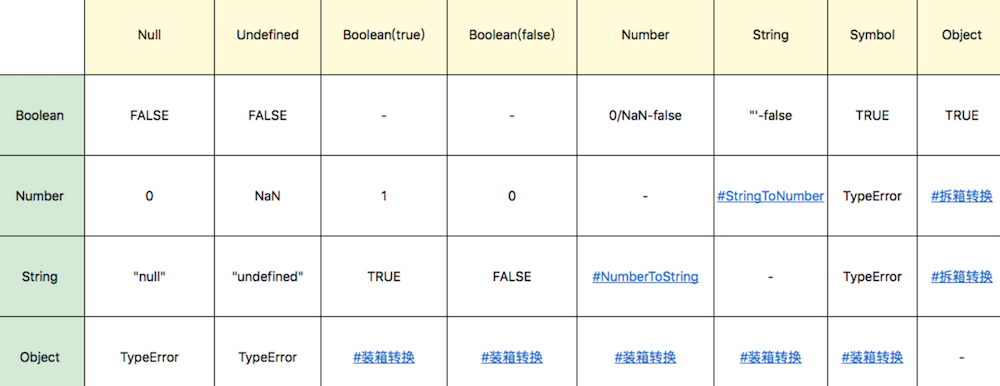
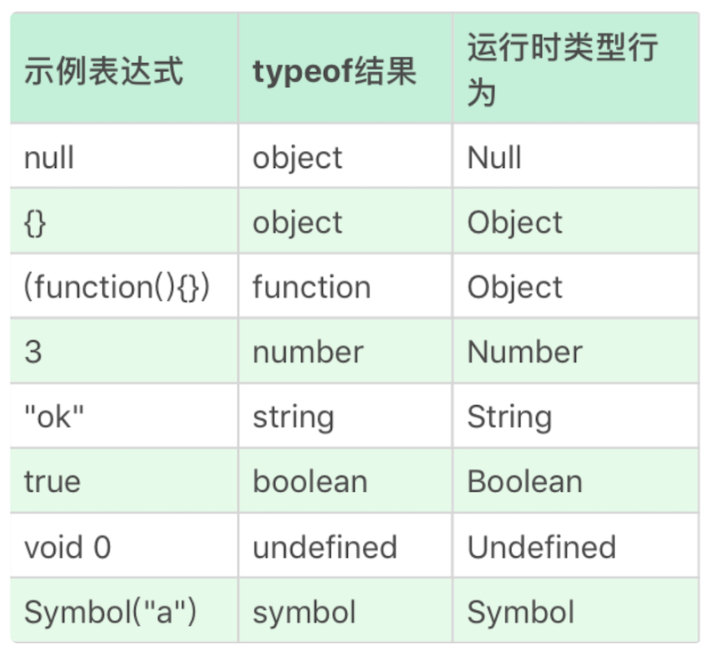

# 0101. JavaScript 类型：关于类型，有哪些你不知道的细节？
> winter 2019-01-26

今天我们来讲讲 JavaScript 的内容，在这个部分，我首先想跟你聊一聊类型。

JavaScript 类型对每个前端程序员来说，几乎都是最为熟悉的概念了。但是你真的很了解它们吗？我们不妨来看看下面的几个问题。

1. 为什么有的编程规范要求用 void 0 代替 undefined？

2. 字符串有最大长度吗？

3. 0.1 + 0.2 不是等于 0.3 么？为什么 JavaScript 里不是这样的？

4. ES6 新加入的 Symbol 是个什么东西？

5. 为什么给对象添加的方法能用在基本类型上？

如果你答起来还有些犹豫的地方，这就说明你对这部分知识点，还是有些遗漏之处的。没关系，今天我来帮你一一补上。

我在前面提到过，我们的 JavaScript 模块会从运行时、文法和执行过程三个角度去剖析 JS 的知识体系，本篇我们就从运行时的角度去看 JavaScript 的类型系统。

运行时类型是代码实际执行过程中我们用到的类型。所有的类型数据都会属于 7 个类型之一。从变量、参数、返回值到表达式中间结果，任何 JavaScript 代码运行过程中产生的数据，都具有运行时类型。

## 01. 类型

JavaScript 语言的每一个值都属于某一种数据类型。JavaScript 语言规定了 7 种语言类型。语言类型广泛用于变量、函数参数、表达式、函数返回值等场合。根据最新的语言标准，这 7 种语言类型是：

1. Undefined；

2. Null；

3. Boolean；

4. String；

5. Number；

6. Symbol；

7. Object。

除了 ES6 中新加入的 Symbol 类型，剩下 6 种类型都是我们日常开发中的老朋友了，但是，要想回答文章一开始的问题，我们需要重新认识一下这些老朋友，下面我们就来从简单到复杂，重新学习一下这些类型。

## 02. Undefined、Null

我们的第一个问题，为什么有的编程规范要求用 void 0 代替 undefined？现在我们就分别来看一下。

Undefined 类型表示未定义，它的类型只有一个值，就是 undefined。任何变量在赋值前是 Undefined 类型、值为 undefined，一般我们可以用全局变量 undefined（就是名为 undefined 的这个变量）来表达这个值，或者 void 运算来把任意一个表达式变成 undefined 值。

但是呢，因为 JavaScript 的代码 undefined 是一个变量，而并非是一个关键字，这是 JavaScript 语言公认的设计失误之一，所以，我们为了避免无意中被篡改，我建议使用 void 0 来获取 undefined 值。

Undefined 跟 Null 有一定的表意差别，Null 表示的是：「定义了但是为空」。所以，在实际编程时，我们一般不会把变量赋值为 undefined，这样可以保证所有值为 undefined 的变量，都是从未赋值的自然状态。

Null 类型也只有一个值，就是 null，它的语义表示空值，与 undefined 不同，null 是 JavaScript 关键字，所以在任何代码中，你都可以放心用 null 关键字来获取 null 值。

## 03. Boolean

Boolean 类型有两个值，true 和 false，它用于表示逻辑意义上的真和假，同样有关键字 true 和 false 来表示两个值。这个类型很简单，我就不做过多介绍了。

## 04. String

我们来看看字符串是否有最大长度。

String 用于表示文本数据。String 有最大长度是 2^53 - 1，这在一般开发中都是够用的，但是有趣的是，这个所谓最大长度，并不完全是你理解中的字符数。

因为 String 的意义并非「字符串」，而是字符串的 UTF16 编码，我们字符串的操作 charAt、charCodeAt、length 等方法针对的都是 UTF16 编码。所以，字符串的最大长度，实际上是受字符串的编码长度影响的。

Note：现行的字符集国际标准，字符是以 Unicode 的方式表示的，每一个 Unicode 的码点表示一个字符，理论上，Unicode 的范围是无限的。UTF 是 Unicode 的编码方式，规定了码点在计算机中的表示方法，常见的有 UTF16 和 UTF8。Unicode 的码点通常用 U+??? 来表示，其中 ??? 是十六进制的码点值。0-65536（U+0000 - U+FFFF）的码点被称为基本字符区域（BMP）。

JavaScript 中的字符串是永远无法变更的，一旦字符串构造出来，无法用任何方式改变字符串的内容，所以字符串具有值类型的特征。

JavaScript 字符串把每个 UTF16 单元当作一个字符来处理，所以处理非 BMP（超出 U+0000 - U+FFFF 范围）的字符时，你应该格外小心。

JavaScript 这个设计继承自 Java，最新标准中是这样解释的，这样设计是为了「性能和尽可能实现起来简单」。因为现实中很少用到 BMP 之外的字符。

## 05. Number

下面，我们来说说 Number 类型。Number 类型表示我们通常意义上的「数字」。这个数字大致对应数学中的有理数，当然，在计算机中，我们有一定的精度限制。

JavaScript 中的 Number 类型有 18437736874454810627 (即 2^64-2^53+3) 个值。

JavaScript 中的 Number 类型基本符合 IEEE 754-2008 规定的双精度浮点数规则，但是 JavaScript 为了表达几个额外的语言场景（比如不让除以 0 出错，而引入了无穷大的概念），规定了几个例外情况：

1. NaN，占用了 9007199254740990，这原本是符合 IEEE 规则的数字；

2. Infinity，无穷大；

3. -Infinity，负无穷大。

另外，值得注意的是，JavaScript 中有 +0 和 -0，在加法类运算中它们没有区别，但是除法的场合则需要特别留意区分，「忘记检测除以 -0，而得到负无穷大」的情况经常会导致错误，而区分 +0 和 -0 的方式，正是检测 1/x 是 Infinity 还是 -Infinity。

根据双精度浮点数的定义，Number 类型中有效的整数范围是 -0x1fffffffffffff 至 0x1fffffffffffff，所以 Number 无法精确表示此范围外的整数。

同样根据浮点数的定义，非整数的 Number 类型无法用 ==（=== 也不行） 来比较，一段著名的代码，这也正是我们第三题的问题，为什么在 JavaScript 中，0.1+0.2 不能 =0.3：

    console.log( 0.1 + 0.2 == 0.3);

这里输出的结果是 false，说明两边不相等的，这是浮点运算的特点，也是很多同学疑惑的来源，浮点数运算的精度问题导致等式左右的结果并不是严格相等，而是相差了个微小的值。

所以实际上，这里错误的不是结论，而是比较的方法，正确的比较方法是使用 JavaScript 提供的最小精度值：

    console.log( Math.abs(0.1 + 0.2 - 0.3) <= Number.EPSILON);

检查等式左右两边差的绝对值是否小于最小精度，才是正确的比较浮点数的方法。这段代码结果就是 true 了。

## 06. Symbol

Symbol 是 ES6 中引入的新类型，它是一切非字符串的对象 key 的集合，在 ES6 规范中，整个对象系统被用 Symbol 重塑。

在后面的文章中，我会详细叙述 Symbol 跟对象系统。这里我们只介绍 Symbol 类型本身：它有哪些部分，它表示什么意思，以及如何创建 Symbol 类型。

Symbol 可以具有字符串类型的描述，但是即使描述相同，Symbol 也不相等。

我们创建 Symbol 的方式是使用全局的 Symbol 函数。例如：

    var mySymbol = Symbol("my symbol");

一些标准中提到的 Symbol，可以在全局的 Symbol 函数的属性中找到。例如，我们可以使用 Symbol.iterator 来自定义 for…of 在对象上的行为：

    var o = new Object

    o[Symbol.iterator] = function() {
        var v = 0
        return {
            next: function() {
                return { value: v++, done: v > 10 }
            }
        }        
    };

    for(var v of o) 
        console.log(v); // 0 1 2 3 ... 9

代码中我们定义了 iterator 之后，用 for (var v of o) 就可以调用这个函数，然后我们可以根据函数的行为，产生一个 for…of 的行为。

这里我们给对象 o 添加了 Symbol.iterator 属性，并且按照迭代器的要求定义了一个 0 到 10 的迭代器，之后我们就可以在 for of 中愉快地使用这个 o 对象啦。

这些标准中被称为「众所周知」的 Symbol，也构成了语言的一类接口形式。它们允许编写与语言结合更紧密的 API。

## 07. Object

Object 是 JavaScript 中最复杂的类型，也是 JavaScript 的核心机制之一。Object 表示对象的意思，它是一切有形和无形物体的总称。

下面我们来看一看，为什么给对象添加的方法能用在基本类型上？

在 JavaScript 中，对象的定义是「属性的集合」。属性分为数据属性和访问器属性，二者都是 key-value 结构，key 可以是字符串或者 Symbol 类型。

关于对象的机制，后面会有单独的一篇来讲述，这里我重点从类型的角度来介绍对象类型。

提到对象，我们必须要提到一个概念：类。

因为 C++ 和 Java 的成功，在这两门语言中，每个类都是一个类型，二者几乎等同，以至于很多人常常会把 JavaScript 的「类」与类型混淆。

事实上，JavaScript 中的「类」仅仅是运行时对象的一个私有属性，而 JavaScript 中是无法自定义类型的。

JavaScript 中的几个基本类型，都在对象类型中有一个「亲戚」。它们是：

- Number；

- String；

- Boolean；

- Symbol。

所以，我们必须认识到 3 与 new Number (3) 是完全不同的值，它们一个是 Number 类型，一个是对象类型。

Number、String 和 Boolean，三个构造器是两用的，当跟 new 搭配时，它们产生对象，当直接调用时，它们表示强制类型转换。

Symbol 函数比较特殊，直接用 new 调用它会抛出错误，但它仍然是 Symbol 对象的构造器。

JavaScript 语言设计上试图模糊对象和基本类型之间的关系，我们日常代码可以把对象的方法在基本类型上使用，比如：

    console.log("abc".charAt(0)); //a

甚至我们在原型上添加方法，都可以应用于基本类型，比如以下代码，在 Symbol 原型上添加了 hello 方法，在任何 Symbol 类型变量都可以调用。

    Symbol.prototype.hello = () => console.log("hello");

    var a = Symbol("a");
    console.log(typeof a); //symbol，a并非对象
    a.hello(); //hello，有效

所以我们文章开头的问题，答案就是。运算符提供了装箱操作，它会根据基础类型构造一个临时对象，使得我们能在基础类型上调用对应对象的方法。

## 09. 类型转换

讲完了基本类型，我们来介绍一个现象：类型转换。

因为 JS 是弱类型语言，所以类型转换发生非常频繁，大部分我们熟悉的运算都会先进行类型转换。大部分类型转换符合人类的直觉，但是如果我们不去理解类型转换的严格定义，很容易造成一些代码中的判断失误。

其中最为臭名昭著的是 JavaScript 中的「==」运算，因为试图实现跨类型的比较，它的规则复杂到几乎没人可以记住。

这里我们当然也不打算讲解 == 的规则，它属于设计失误，并非语言中有价值的部分，很多实践中推荐禁止使用「==」，而要求程序员进行显式地类型转换后，用 === 比较。

其它运算，如加减乘除大于小于，也都会涉及类型转换。幸好的是，实际上大部分类型转换规则是非常简单的，如下表所示：



在这个里面，较为复杂的部分是 Number 和 String 之间的转换，以及对象跟基本类型之间的转换。我们分别来看一看这几种转换的规则。

### 1. StringToNumber

字符串到数字的类型转换，存在一个语法结构，类型转换支持十进制、二进制、八进制和十六进制，比如：

- 30；

- 0b111；

- 0o13；

- 0xFF。

此外，JavaScript 支持的字符串语法还包括正负号科学计数法，可以使用大写或者小写的 e 来表示：

- 1e3；

- -1e-2。

需要注意的是，parseInt 和 parseFloat 并不使用这个转换，所以支持的语法跟这里不尽相同。

在不传入第二个参数的情况下，parseInt 只支持 16 进制前缀「0x」，而且会忽略非数字字符，也不支持科学计数法。

在一些古老的浏览器环境中，parseInt 还支持 0 开头的数字作为 8 进制前缀，这是很多错误的来源。所以在任何环境下，都建议传入 parseInt 的第二个参数，而 parseFloat 则直接把原字符串作为十进制来解析，它不会引入任何的其他进制。

多数情况下，Number 是比 parseInt 和 parseFloat 更好的选择。

### 2. NumberToString

在较小的范围内，数字到字符串的转换是完全符合你直觉的十进制表示。当 Number 绝对值较大或者较小时，字符串表示则是使用科学计数法表示的。这个算法细节繁多，我们从感性的角度认识，它其实就是保证了产生的字符串不会过长。

具体的算法，你可以去参考 JavaScript 的语言标准。由于这个部分内容，我觉得在日常开发中很少用到，所以这里我就不去详细地讲解了。

### 3. 装箱转换

每一种基本类型 Number、String、Boolean、Symbol 在对象中都有对应的类，所谓装箱转换，正是把基本类型转换为对应的对象，它是类型转换中一种相当重要的种类。

前文提到，全局的 Symbol 函数无法使用 new 来调用，但我们仍可以利用装箱机制来得到一个 Symbol 对象，我们可以利用一个函数的 call 方法来强迫产生装箱。

我们定义一个函数，函数里面只有 return this，然后我们调用函数的 call 方法到一个 Symbol 类型的值上，这样就会产生一个 symbolObject。

我们可以用 console.log 看一下这个东西的 type of，它的值是 object，我们使用 symbolObject instanceof 可以看到，它是 Symbol 这个类的实例，我们找它的 constructor 也是等于 Symbol 的，所以我们无论从哪个角度看，它都是 Symbol 装箱过的对象：

    var symbolObject = (function(){ return this; }).call(Symbol("a"));

    console.log(typeof symbolObject); //object
    console.log(symbolObject instanceof Symbol); //true
    console.log(symbolObject.constructor == Symbol); //true

装箱机制会频繁产生临时对象，在一些对性能要求较高的场景下，我们应该尽量避免对基本类型做装箱转换。

使用内置的 Object 函数，我们可以在 JavaScript 代码中显式调用装箱能力。

    var symbolObject = Object(Symbol("a"));

    console.log(typeof symbolObject); //object
    console.log(symbolObject instanceof Symbol); //true
    console.log(symbolObject.constructor == Symbol); //true

每一类装箱对象皆有私有的 Class 属性，这些属性可以用 Object.prototype.toString 获取：

    var symbolObject = Object(Symbol("a"));

    console.log(Object.prototype.toString.call(symbolObject)); //[object Symbol]

在 JavaScript 中，没有任何方法可以更改私有的 Class 属性，因此 Object.prototype.toString 是可以准确识别对象对应的基本类型的方法，它比 instanceof 更加准确。

但需要注意的是，call 本身会产生装箱操作，所以需要配合 typeof 来区分基本类型还是对象类型。

### 4. 拆箱转换

在 JavaScript 标准中，规定了 ToPrimitive 函数，它是对象类型到基本类型的转换（即，拆箱转换）。

对象到 String 和 Number 的转换都遵循「先拆箱再转换」的规则。通过拆箱转换，把对象变成基本类型，再从基本类型转换为对应的 String 或者 Number。

拆箱转换会尝试调用 valueOf 和 toString 来获得拆箱后的基本类型。如果 valueOf 和 toString 都不存在，或者没有返回基本类型，则会产生类型错误 TypeError。

    var o = {
        valueOf : () => {console.log("valueOf"); return {}},
        toString : () => {console.log("toString"); return {}}
    }

    o * 2
    // valueOf
    // toString
    // TypeError

我们定义了一个对象 o，o 有 valueOf 和 toString 两个方法，这两个方法都返回一个对象，然后我们进行 o*2 这个运算的时候，你会看见先执行了 valueOf，接下来是 toString，最后抛出了一个 TypeError，这就说明了这个拆箱转换失败了。

到 String 的拆箱转换会优先调用 toString。我们把刚才的运算从 o*2 换成 String (o)，那么你会看到调用顺序就变了。

```
var o = {
    valueOf : () => {console.log("valueOf"); return {}},
    toString : () => {console.log("toString"); return {}}
}

String(o)
// toString
// valueOf
// TypeError
```

在 ES6 之后，还允许对象通过显式指定 @@toPrimitive Symbol 来覆盖原有的行为。

    var o = {
        valueOf : () => {console.log("valueOf"); return {}},
        toString : () => {console.log("toString"); return {}}
    }

    o[Symbol.toPrimitive] = () => {console.log("toPrimitive"); return "hello"}

    console.log(o + "")
    // toPrimitive
    // hello

## 结语

在本篇文章中，我们介绍了 JavaScript 运行时的类型系统。这里回顾一下今天讲解的知识点。

除了这七种语言类型，还有一些语言的实现者更关心的规范类型。

List 和 Record： 用于描述函数传参过程。

Set：主要用于解释字符集等。

Completion Record：用于描述异常、跳出等语句执行过程。

Reference：用于描述对象属性访问、delete 等。

Property Descriptor：用于描述对象的属性。

Lexical Environment 和 Environment Record：用于描述变量和作用域。

Data Block：用于描述二进制数据。

有一个说法是：程序 = 算法 + 数据结构，运行时类型包含了所有 JavaScript 执行时所需要的数据结构的定义，所以我们要对它格外重视。

最后我们留一个实践问题，如果我们不用原生的 Number 和 parseInt，用 JavaScript 代码实现 String 到 Number 的转换，该怎么做呢？

## 补充阅读

事实上，「类型」在 JavaScript 中是一个有争议的概念。一方面，标准中规定了运行时数据类型； 另一方面，JavaScript 语言中提供了 typeof 这样的运算，用来返回操作数的类型，但 typeof 的运算结果，与运行时类型的规定有很多不一致的地方。我们可以看下表来对照一下。



在表格中，多数项是对应的，但是请注意 object——Null 和 function——Object 是特例，我们理解类型的时候需要特别注意这个区别。

从一般语言使用者的角度来看，毫无疑问，我们应该按照 typeof 的结果去理解语言的类型系统。但 JavaScript 之父本人也在多个场合表示过，typeof 的设计是有缺陷的，只是现在已经错过了修正它的时机。

## 精选留言

2019-01-28

### 01

但是本文有两点是值得商榷的。

其一：原文：Undefined 跟 null 有一定的表意差别，null 表示的是：「定义了但是为空」。私以为，undefined 表示的是：「定义了但是为空」。而非 null。

二：原文：

```
var o = {
        valueOf : () => {console.log("valueOf"); return {}},
        toString : () => {console.log("toString"); return {}}
    }

    o + ""
    // toString
    // valueOf
    // TypeError
```

很多朋友已经提出来了，应该是先执行 valueof，再执行 toString。这个问题，可以从 ecmascript 规范中寻找答案：

规范指出，类型转换的内部实现是通过 ToPrimitive (input [ , PreferredType] ) 方法进行转换的，这个方法的作用就是将 input 转换成一个非对象类型。参数 preferredType 是可选的，它的作用是，指出了 input 被期待转成的类型。如果不传 preferredType 进来，默认的是 'number'。如果 preferredType 的值是 "string"，那就先执行 "toString", 后执行 "valueOf"。否则，先执行 "valueOf", 后执行 "toString"。由此可见，"toString", "valueOf" 的执行顺序，取决于 preferred 的值。

规范原文请移步：http://www.ecma-international.org/ecma-262/#sec-toprimitive

再回到我们的例子：

```
var o = {
        valueOf : () => {console.log("valueOf"); return {}},
        toString : () => {console.log("toString"); return {}}
}

o + ""
```

类型转换时，把对象 o 进行转换，调用 toPrimitive 方法，即 toPrimitive (o [ , PreferredType] )。关键的点是，preferredType 是否被传值，传的是什么值？我们再去看下规范，看看加法运算符的规则。加法运算符运算过程中有两行代码很重要，如下：

    Let lprim be ? ToPrimitive(lval).
    Let rprim be ? ToPrimitive(rval).

可以看出，调用 ToPrimitive 方法时，第二个参数是没有传参的。所以 preferredType 取默认的值 "number"。最终先执行 "valueOf", 后执行 "toString"。

作者回复：1、undefined 确实是表示未定义，从字面即可看出来。取 JavaScript 对象的未定义过的属性得到的都是 undefined。2、这个地方我确实写错了，等下改过来。

### 03

我发现有很多同学都在纠结 undefined 问题，为什么不去读一下 mdn 呢（[undefined - JavaScript | MDN](https://developer.mozilla.org/en-US/docs/Web/JavaScript/Reference/Global_Objects/undefined)）。前两段写的很明确了。

undefined is a property of the global object; i.e., it is a variable in global scope. The initial value of undefined is the primitive value undefined. In modern browsers (JavaScript 1.8.5 / Firefox 4+), undefined is a non-configurable, non-writable property per the ECMAScript 5 specification. Even when this is not the case, avoid overriding it.

在 ES5 之前的时候，undefined 是可以被赋值的。在现代浏览器当中已经把 undefined 设置为一个 non-configurable, non-writable 属性的值了。

### 04

1. 实现字符串转数字的同学，不要单纯考虑这个字符串一定全是数字而用运算符来实现。放在实际场景会出现大量 NaN。

2. 「需要注意的是，parseInt 和 parseFloat 并不使用这个转换，所以支持的语法跟这里不尽相同。」使用是不是打错了？应该是适用？

3. 代码 Object ((Symbol (‘a’)) 要么左边多了括号要么右边少了括号。

4. 希望类似装箱转换、拆箱转换这样的专属名词如果有英文单词可以补充下方便检索更多信息。

2019-01-29

### 05

关于 Number 类型，如果想要进一步理解可以去参考 IEEE 754 中关于浮点数的表达规范，了解这 64 位中各个位数段表达的含义。文中有几个叙述不清的地方：

1、NaN 和 + Infinity 的规定实际是 IEEE 754 标准规定的特殊值：

（e 为指数的位数，双精度中 e=11）

- 指数为 2^e – 1 且尾数的小数部分全 0，这个数字是 ±∞。（符号位决定正负）

- 指数为 2^e – 1 且尾数的小数部分非全 0，这个数字是 NaN，比如单精度浮点数中按位表示：S111 1111 1AXX XXXX XXXX XXXX XXXX XXXX，S 为符号位值无所谓，A 是小数位的最高位（整数位 1 省略），其取值表示了 NaN 的类型：X 不能全为 0，并被称为 NaN 的 payload。

2、NaN，占用了 9007199254740990，这个叙述不对。

留言里很多童鞋都提出了 9007199254740990 被占用是什么意思的疑问，实际是第一点描述的关于 NaN 规定和参考双精度浮点数的表达方式，尾数共有 53 位，指数固定为 2^e – 1 并去掉 ±∞ 两个值，那么 NaN 其实是 2^53-2 个特殊数字的合集（2^53-2 = 9007199254740990 ）；并不是 9007199254740990 被占用，而是 9007199254740990 个特殊值被占用来表示 NaN。扩展一下，我们就可以理解为什么 NaN !== NaN 了，它确实不是一个值，而是一群值呢 0 0！

2019-02-04

### 06

null 的类型是 object，这是由于历史原因造成的。1995 年的 JavaScript 语言第一版，只设计了五种数据类型（对象、整数、浮点数、字符串和布尔值），没考虑 null，只把它当作 object 的一种特殊值。后来 null 独立出来，作为一种单独的数据类型，为了兼容以前的代码，typeof null 返回 object 就没法改变了。

来自：https://wangdoc.com/javascript/types/general.html

2019-01-27

### 07

重写十进制的 parseInt/parseFloat

```
var myParse = function (val) {
    if (val) {
        var num = val.match(/^\d*\.?\d+/);
        if (num !== null) {
            return num[0] - 0;
        }else{
            return NaN;
        }
    }else{
        return NaN;
    }
}
```

作者回复：不错。不过用正则和剑法自动转换可就偷懒了，而且这些东西有太多你没搞清楚的细节了。比如你看看我写的十进制的正则：

    /\.[0-9]+|(?:[1-9]+[0-9]*|0)(?:\.[0-9]*|\.)?)(?:[eE][+-]{0,1}[0-9]+)?(?![_$a-zA-Z0-9])/

2019-02-19

winter 老师，您写的正则多了个括号：

原来的：

    /\.[0-9]+|(?:[1-9]+[0-9]*|0)(?:\.[0-9]*|\.)?)(?:[eE][+-]{0,1}[0-9]+)?(?![_$a-zA-Z0-9])/

去掉括号后的：

    /\.[0-9]+|(?:[1-9]+[0-9]*|0)(?:\.[0-9]*|\.)?(?:[eE][+-]{0,1}[0-9]+)?(?![_$a-zA-Z0-9])/

2019-06-18