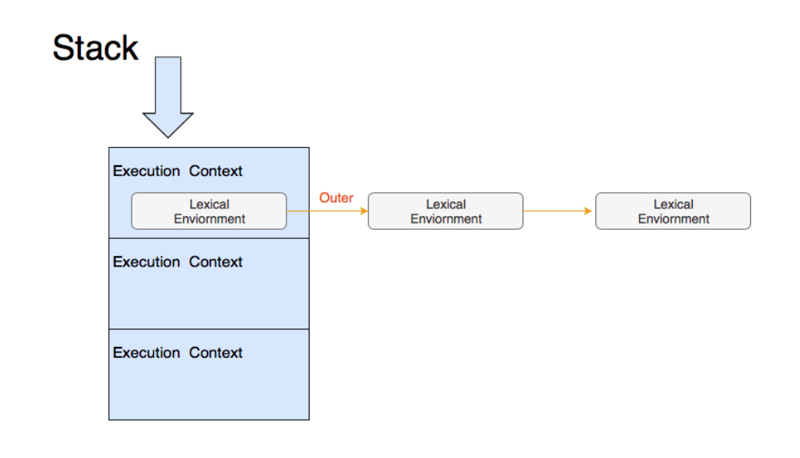
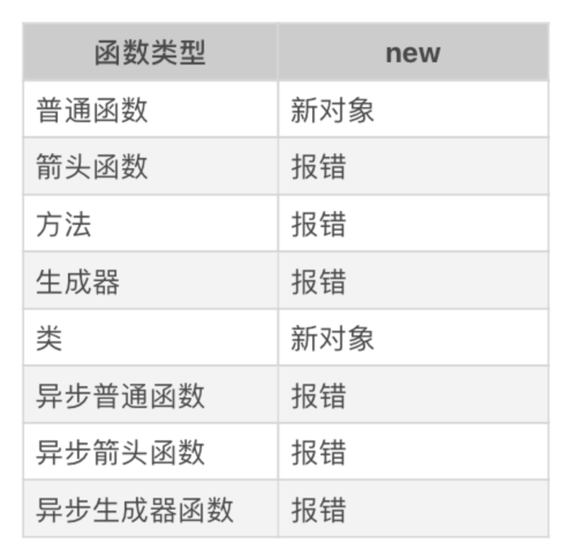

# 0107. JavaScript 执行 3：你知道现在有多少种函数吗？
> winter 2019-02-28

在前一篇文章中，我们大致了解了执行上下文是什么，也知道了任何语句的执行都会依赖特定的上下文。一旦上下文被切换，整个语句的效果可能都会发生改变。那么，切换上下文的时机就显得非常重要了。

在 JavaScript，切换上下文最主要的场景是函数调用。在这一课，我们就来讲讲函数调用切换上下文的事情。我们在讲函数调用之前，首先来认识一下函数家族。

## 01. 函数

在 ES2018 中，函数已经是一个很复杂的体系了，我在这里整理了一下。

第一种，普通函数：用 function 关键字定义的函数。

示例：

```
function foo(){
    // code
}
```

第二种，箭头函数：用 => 运算符定义的函数。

示例:

```
const foo = () => {
    // code
}
```

第三种，方法：在 class 中定义的函数。

示例：

```
class C {
    foo(){
        //code
    }
}
```


第四种，生成器函数：用 function * 定义的函数。

示例：

```
function* foo(){
    // code
}
```

第五种，类：用 class 定义的类，实际上也是函数。

示例：

```
class Foo {
    constructor(){
        //code
    }
}
```


第六 / 七 / 八种，异步函数：普通函数、箭头函数和生成器函数加上 async 关键字。

示例：

```
async function foo(){
    // code
}
const foo = async () => {
    // code
}
async function foo*(){
    // code
}
```

ES6 以来，大量加入的新语法极大地方便了我们编程的同时，也增加了很多我们理解的心智负担。要想认识这些函数的执行上下文切换，我们必须要对它们行为上的区别有所了解。

对普通变量而言，这些函数并没有本质区别，都是遵循了「继承定义时环境」的规则，它们的一个行为差异在于 this 关键字。

那么，this 关键字是什么呢，我们一起来看一看。

## 02. this 关键字的行为

this 是 JavaScript 中的一个关键字，它的使用方法类似于一个变量（但是 this 跟变量的行为有很多不同，上一节课我们讲了一些普通变量的行为和机制，也就是 var 声明和赋值、let 的内容）。this 是执行上下文中很重要的一个组成部分。同一个函数调用方式不同，得到的 this 值也不同，我们看一个例子：

```
function showThis(){
    console.log(this);
}

var o = {
    showThis: showThis
}

showThis(); // global
o.showThis(); // o
```

在这个例子中，我们定义了函数 showThis，我们把它赋值给一个对象 o 的属性，然后尝试分别使用两个引用来调用同一个函数，结果得到了不同的 this 值。

普通函数的 this 值由「调用它所使用的引用」决定，其中奥秘就在于：我们获取函数的表达式，它实际上返回的并非函数本身，而是一个 Reference 类型（记得我们在类型一章讲过七种标准类型吗，正是其中之一）。Reference 类型由两部分组成：一个对象和一个属性值。不难理解 o.showThis 产生的 Reference 类型，即由对象 o 和属性「showThis」构成。

当做一些算术运算（或者其他运算时），Reference 类型会被解引用，即获取真正的值（被引用的内容）来参与运算，而类似函数调用、delete 等操作，都需要用到 Reference 类型中的对象。在这个例子中，Reference 类型中的对象被当作 this 值，传入了执行函数时的上下文当中。

至此，我们对 this 的解释已经非常清晰了：调用函数时使用的引用，决定了函数执行时刻的 this 值。

实际上从运行时的角度来看，this 跟面向对象毫无关联，它是与函数调用时使用的表达式相关。这个设计来自 JavaScript 早年，通过这样的方式，巧妙地模仿了 Java 的语法，但是仍然保持了纯粹的「无类」运行时设施。如果，我们把这个例子稍作修改，换成箭头函数，结果就不一样了：

```
const showThis = () => {
    console.log(this);
}

var o = {
    showThis: showThis
}

showThis(); // global
o.showThis(); // global
```

我们看到，改为箭头函数后，不论用什么引用来调用它，都不影响它的 this 值。接下来我们看看「方法」，它的行为又不一样了：

```
class C {
    showThis() {
        console.log(this);
    }
}
var o = new C();
var showThis = o.showThis;

showThis(); // undefined
o.showThis(); // o
```

这里我们创建了一个类 C，并且实例化出对象 o，再把 o 的方法赋值给了变量 showThis。这时候，我们使用 showThis 这个引用去调用方法时，得到了 undefined。所以，在方法中，我们看到 this 的行为也不太一样，它得到了 undefined 的结果。按照我们上面的方法，不难验证出：生成器函数、异步生成器函数和异步普通函数跟普通函数行为是一致的，异步箭头函数与箭头函数行为是一致的。

## 03. this 关键字的机制

说完了 this 行为，我们再来简单谈谈在 JavaScript 内部，实现 this 这些行为的机制，让你对这部分知识有一个大概的认知。函数能够引用定义时的变量，如上文分析，函数也能记住定义时的 this，因此，函数内部必定有一个机制来保存这些信息。

在 JavaScript 标准中，为函数规定了用来保存定义时上下文的私有属性 [[Environment]]。当一个函数执行时，会创建一条新的执行环境记录，记录的外层词法环境（outer lexical environment）会被设置成函数的 [[Environment]]。这个动作就是切换上下文了，我们假设有这样的代码：

```
var a = 1;
foo();

在别处定义了foo：

var b = 2;
function foo(){
    console.log(b); // 2
    console.log(a); // error
}
```

这里的 foo 能够访问 b（定义时词法环境），却不能访问 a（执行时的词法环境），这就是执行上下文的切换机制了。JavaScript 用一个栈来管理执行上下文，这个栈中的每一项又包含一个链表。如下图所示：



当函数调用时，会入栈一个新的执行上下文，函数调用结束时，执行上下文被出栈。而 this 则是一个更为复杂的机制，JavaScript 标准定义了 [[thisMode]] 私有属性。[[thisMode]] 私有属性有三个取值。1）lexical：表示从上下文中找 this，这对应了箭头函数。2）global：表示当 this 为 undefined 时，取全局对象，对应了普通函数。3）strict：当严格模式时使用，this 严格按照调用时传入的值，可能为 null 或者 undefined。

非常有意思的是，方法的行为跟普通函数有差异，恰恰是因为 class 设计成了默认按 strict 模式执行。我们可以用 strict 达成与上一节中方法的例子一样的效果:

```
"use strict"
function showThis(){
    console.log(this);
}

var o = {
    showThis: showThis
}

showThis(); // undefined
o.showThis(); // o
```

函数创建新的执行上下文中的词法环境记录时，会根据 [[thisMode]] 来标记新纪录的 [[ThisBindingStatus]] 私有属性。代码执行遇到 this 时，会逐层检查当前词法环境记录中的 [[ThisBindingStatus]]，当找到有 this 的环境记录时获取 this 的值。这样的规则的实际效果是，嵌套的箭头函数中的代码都指向外层 this，例如：

```
var o = {}
o.foo = function foo(){
    console.log(this);
    return () => {
        console.log(this);
        return () => console.log(this);
    }
}

o.foo()()(); // o, o, o
```

这个例子中，我们定义了三层嵌套的函数，最外层为普通函数，两层都是箭头函数。这里调用三个函数，获得的 this 值是一致的，都是对象 o。JavaScript 还提供了一系列函数的内置方法来操纵 this 值，下面我们来了解一下。

## 04. 操作 this 的内置函数

Function.prototype.call 和 Function.prototype.apply 可以指定函数调用时传入的 this 值，示例如下：

```
function foo(a, b, c){
    console.log(this);
    console.log(a, b, c);
}
foo.call({}, 1, 2, 3);
foo.apply({}, [1, 2, 3]);
```

这里 call 和 apply 作用是一样的，只是传参方式有区别。此外，还有 Function.prototype.bind 它可以生成一个绑定过的函数，这个函数的 this 值固定了参数：

```
function foo(a, b, c){
    console.log(this);
    console.log(a, b, c);
}
foo.bind({}, 1, 2, 3)();
```

有趣的是，call、bind 和 apply 用于不接受 this 的函数类型如箭头、class 都不会报错。这时候，它们无法实现改变 this 的能力，但是可以实现传参。

## 结语

在这一节课程中，我们认识了 ES2018 中规定的各种函数，我一共简单介绍了 8 种函数。

我们围绕 this 这个中心，介绍了函数的执行上下文切换机制。同时我们还讲解了 this 中的一些相关知识。包括了操作 this 的内置函数。

最后，留给你一个问题，你在日常开发中用过哪些函数类型呢？欢迎给我留言，我们一起讨论。

## 补充阅读：new 与 this

我们在之前的对象部分已经讲过 new 的执行过程，我们再来看一下：1）以构造器的 prototype 属性（注意与私有字段 [[prototype]] 的区分）为原型，创建新对象；2）将 this 和调用参数传给构造器，执行；3）如果构造器返回的是对象，则返回，否则返回第一步创建的对象。显然，通过 new 调用函数，跟直接调用的 this 取值有明显区别。那么我们今天讲的这些函数跟 new 搭配又会产生什么效果呢？

这里我整理了一张表：



我们可以看到，仅普通函数和类能够跟 new 搭配使用，这倒是给我们省去了不少麻烦。

## 精选留言

### 01

关于 this，Kyle Simpson 有四条总结：

1. 由 new 调用？绑定到新创建的对象。

2. 由 call 或者 apply (或者 bind) 调用？绑定到指定的对象。

3. 由上下文对象调用？绑定到那个上下文对象。

4. 默认：在严格模式下绑定到 undefined，否则绑定到全局对象。

例外：箭头函数不适用以上四条规则，它会继承外层函数调用的 this 绑定 (无论 this 绑定到什么)。

2019-02-28

### 02

老师写的 "在别处定义了 foo" 的意思是，这句话上下两部分的代码，不在同一个文件哒。已经有同学贴了代码，是这样的：

```js
// 这是 foo.js 文件里的代码
var b = 2;
module.exports = function() { // 导出function
  console.log(b);
  console.log(a);
};
```
```js
// 这是test.js 文件里的代码
var foo = require("./foo.js"); // 引入function 为foo
var a = 1;
foo();
// node 执行 test.js 输出：
// -> 2
// -> ReferenceError: a is not defined
```

2019-03-02
