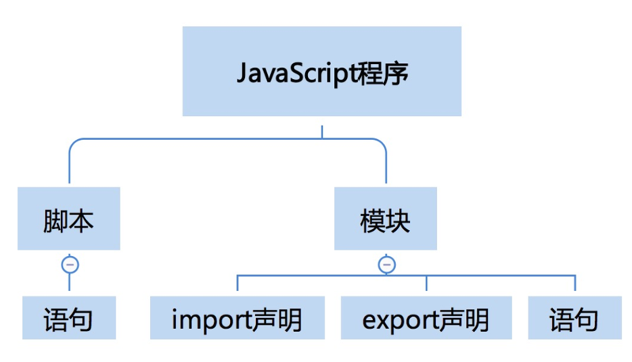
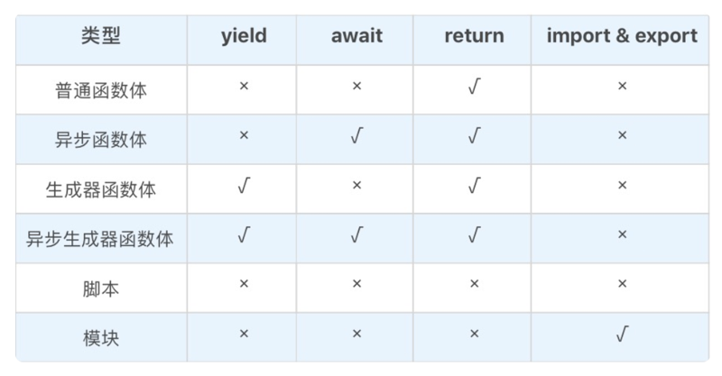

# 0112. JavaScript 语法 1：在 script 标签写 export 为什么会抛错？
> winter 2019-03-28

你好，我是 winter，今天我们进入到语法部分的学习。在讲解具体的语法结构之前，这一堂课我首先要给你介绍一下 JavaScript 语法的一些基本规则。

## 01. 脚本和模块

首先，JavaScript 有两种源文件，一种叫做脚本，一种叫做模块。这个区分是在 ES6 引入了模块机制开始的，在 ES5 和之前的版本中，就只有一种源文件类型（就只有脚本）。

脚本是可以由浏览器或者 node 环境引入执行的，而模块只能由 JavaScript 代码用 import 引入执行。

从概念上，我们可以认为脚本具有主动性的 JavaScript 代码段，是控制宿主完成一定任务的代码；而模块是被动性的 JavaScript 代码段，是等待被调用的库。

我们对标准中的语法产生式做一些对比，不难发现，实际上模块和脚本之间的区别仅仅在于是否包含 import 和 export。

脚本是一种兼容之前的版本的定义，在这个模式下，没有 import 就不需要处理加载「.js」文件问题。

现代浏览器可以支持用 script 标签引入模块或者脚本，如果要引入模块，必须给 script 标签添加 type=「module」。如果引入脚本，则不需要 type。

    <script type="module" src="xxxxx.js"></script>

这样，就回答了我们标题中的问题，script 标签如果不加 type="module"，默认认为我们加载的文件是脚本而非模块，如果我们在脚本中写了 export，当然会抛错。

脚本中可以包含语句。模块中可以包含三种内容：import 声明，export 声明和语句。普通语句我们会在下一课专门给你讲解，下面我们就来讲讲 import 声明和 export 声明。



### 1. import 声明

我们首先来介绍一下 import 声明，import 声明有两种用法，一个是直接 import 一个模块，另一个是带 from 的 import，它能引入模块里的一些信息。

```
import "mod"; // 引入一个模块
import v from "mod";  // 把模块默认的导出值放入变量 v
```

直接 import 一个模块，只是保证了这个模块代码被执行，引用它的模块是无法获得它的任何信息的。带 from 的 import 意思是引入模块中的一部分信息，可以把它们变成本地的变量。带 from 的 import 细分又有三种用法，我们可以分别看下例子：

- import x from "./a.js" 引入模块中导出的默认值。

- import {a as x, modify} from "./a.js"; 引入模块中的变量。

- import * as x from "./a.js" 把模块中所有的变量以类似对象属性的方式引入。

第一种方式还可以跟后两种组合使用。

- import d, {a as x, modify} from "./a.js"

- import d, * as x from "./a.js"

语法要求不带 as 的默认值永远在最前。注意，这里的变量实际上仍然可以受到原来模块的控制。

我们看一个例子，假设有两个模块 a 和 b。我们在模块 a 中声明了变量和一个修改变量的函数，并且把它们导出。我们用 b 模块导入了变量和修改变量的函数。

模块 a：

```
export var a = 1;

export function modify(){
    a = 2;
}
```

模块 b：

```
import {a, modify} from "./a.js";

console.log(a);

modify();

console.log(a);
```

当我们调用修改变量的函数后，b 模块变量也跟着发生了改变。这说明导入与一般的赋值不同，导入后的变量只是改变了名字，它仍然与原来的变量是同一个。

### 2. export 声明

我们再来说说 export 声明。与 import 相对，export 声明承担的是导出的任务。模块中导出变量的方式有两种，一种是独立使用 export 声明，另一种是直接在声明型语句前添加 export 关键字。

独立使用 export 声明就是一个 export 关键字加上变量名列表，例如：

    export {a, b, c};

我们也可以直接在声明型语句前添加 export 关键字，这里的 export 可以加在任何声明性质的语句之前，整理如下：

var

function (含 async 和 generator)

class

let

const

export 还有一种特殊的用法，就是跟 default 联合使用。export default 表示导出一个默认变量值，它可以用于 function 和 class。这里导出的变量是没有名称的，可以使用 import x from "./a.js" 这样的语法，在模块中引入。

export default 还支持一种语法，后面跟一个表达式，例如：

```
var a = {};
export default a;
```

但是，这里的行为跟导出变量是不一致的，这里导出的是值，导出的就是普通变量 a 的值，以后 a 的变化与导出的值就无关了，修改变量 a，不会使得其他模块中引入的 default 值发生改变。在 import 语句前无法加入 export，但是我们可以直接使用 export from 语法。

    export a from "a.js"

JavaScript 引擎除了执行脚本和模块之外，还可以执行函数。而函数体跟脚本和模块有一定的相似之处，所以接下来，给你讲讲函数体的相关知识。

### 3. 函数体

执行函数的行为通常是在 JavaScript 代码执行时，注册宿主环境的某些事件触发的，而执行的过程，就是执行函数体（函数的花括号中间的部分）。我们先看一个例子，感性地理解一下：

```
setTimeout(function(){
    console.log("go go go");
}, 10000)
```

这段代码通过 setTimeout 函数注册了一个函数给宿主，当一定时间之后，宿主就会执行这个函数。你还记得吗，我们前面已经在运行时这部分讲过，宿主会为这样的函数创建宏任务。当我们学习了语法之后，我们可以认为，宏任务中可能会执行的代码包括「脚本」 (script)「模块」（module）和「函数体」（function body）。正因为这样的相似性，我们把函数体也放到本课来讲解。

函数体其实也是一个语句的列表。跟脚本和模块比起来，函数体中的语句列表中多了 return 语句可以用。函数体实际上有四种，下面，我来分别介绍一下。

1、普通函数体，例如：

```
function foo(){
    //Function body
}
```

2、异步函数体，例如：

```
async function foo(){
    //Function body
}
```

3、生成器函数体，例如：

```
function *foo(){
    //Function body
}
```

4、异步生成器函数体，例如：

```
async function *foo(){
    //Function body
}
```

上面四种函数体的区别在于：能否使用 await 或者 yield 语句。关于函数体、模块和脚本能使用的语句，我整理了一个表格，你可以参考一下：



讲完了三种语法结构，我再来介绍两个 JavaScript 语法的全局机制：预处理和指令序言。这两个机制对于我们解释一些 JavaScript 的语法现象非常重要。不理解预处理机制我们就无法理解 var 等声明类语句的行为，而不理解指令序言，我们就无法解释严格模式。

## 02. 预处理

JavaScript 执行前，会对脚本、模块和函数体中的语句进行预处理。预处理过程将会提前处理 var、函数声明、class、const 和 let 这些语句，以确定其中变量的意义。因为一些历史包袱，这一部分内容非常复杂，首先我们看一下 var 声明。

### 1. var 声明

var 声明永远作用于脚本、模块和函数体这个级别，在预处理阶段，不关心赋值的部分，只管在当前作用域声明这个变量。我们还是从实例来进行学习。

```
var a = 1;

function foo() {
    console.log(a);
    var a = 2;
}

foo();
```

这段代码声明了一个脚本级别的 a，又声明了 foo 函数体级别的 a，我们注意到，函数体级的 var 出现在 console.log 语句之后。但是预处理过程在执行之前，所以有函数体级的变量 a，就不会去访问外层作用域中的变量 a 了，而函数体级的变量 a 此时还没有赋值，所以是 undefined。我们再看一个情况：

```
var a = 1;

function foo() {
    console.log(a);
    if(false) {
        var a = 2;
    }
}

foo();
```

这段代码比上一段代码在 var a = 2 之外多了一段 if，我们知道 if (false) 中的代码永远不会被执行，但是预处理阶段并不管这个，var 的作用能够穿透一切语句结构，它只认脚本、模块和函数体三种语法结构。所以这里结果跟前一段代码完全一样，我们会得到 undefined。

1『var 的作用能够穿透一切语句结构，它只认脚本、模块和函数体三种语法结构。这个概念很重要，做一张信息卡片。』

我们看下一个例子，我们在运行时部分讲过类似的例子。

```
var a = 1;

function foo() {
    var o= {a:3}
    with(o) {
        var a = 2;
    }
    console.log(o.a);
    console.log(a);
}

foo();
```

在这个例子中，我们引入了 with 语句，我们用 with (o) 创建了一个作用域，并把 o 对象加入词法环境，在其中使用了 var a = 2; 语句。在预处理阶段，只认 var 中声明的变量，所以同样为 foo 的作用域创建了 a 这个变量，但是没有赋值。在执行阶段，当执行到 var a = 2 时，作用域变成了 with 语句内，这时候的 a 被认为访问到了对象 o 的属性 a，所以最终执行的结果，我们得到了 2 和 undefined。

这个行为是 JavaScript 公认的设计失误之一，一个语句中的 a 在预处理阶段和执行阶段被当做两个不同的变量，严重违背了直觉，但是今天，在 JavaScript 设计原则「don’t break the web」之下，已经无法修正了，所以你需要特别注意。

因为早年 JavaScript 没有 let 和 const，只能用 var，又因为 var 除了脚本和函数体都会穿透，人民群众发明了「立即执行的函数表达式」（IIFE）这一用法，用来产生作用域，例如：

```
for(var i = 0; i < 20; i ++) {
    void function(i){
        var div = document.createElement("div");
        div.innerHTML = i;
        div.onclick = function(){
            console.log(i);
        }
        document.body.appendChild(div);
    }(i);
}

```

这段代码非常经典，常常在实际开发中见到，也经常被用作面试题，为文档添加了 20 个 div 元素，并且绑定了点击事件，打印它们的序号。

我们通过 IIFE 在循环内构造了作用域，每次循环都产生一个新的环境记录，这样，每个 div 都能访问到环境中的 i。

如果我们不用 IIFE：

```
for(var i = 0; i < 20; i ++) {
    var div = document.createElement("div");
    div.innerHTML = i;
    div.onclick = function(){
        console.log(i);
    }
    document.body.appendChild(div);
}
```

这段代码的结果将会是点每个 div 都打印 20，因为全局只有一个 i，执行完循环后，i 变成了 20。

### 2. function 声明

function 声明的行为原本跟 var 非常相似，但是在最新的 JavaScript 标准中，对它进行了一定的修改，这让情况变得更加复杂了。在全局（脚本、模块和函数体），function 声明表现跟 var 相似，不同之处在于，function 声明不但在作用域中加入变量，还会给它赋值。我们看一下 function 声明的例子：

```
console.log(foo);
function foo(){

}
```

这里声明了函数 foo，在声明之前，我们用 console.log 打印函数 foo，我们可以发现，已经是函数 foo 的值了。function 声明出现在 if 等语句中的情况有点复杂，它仍然作用于脚本、模块和函数体级别，在预处理阶段，仍然会产生变量，它不再被提前赋值：

```
console.log(foo);
if(true) {
    function foo(){

    }
}
```

这段代码得到 undefined。如果没有函数声明，则会抛出错误。这说明 function 在预处理阶段仍然发生了作用，在作用域中产生了变量，没有产生赋值，赋值行为发生在了执行阶段。出现在 if 等语句中的 function，在 if 创建的作用域中仍然会被提前，产生赋值效果，我们会在下一节课继续讨论。

### 3. class 声明

class 声明在全局的行为跟 function 和 var 都不一样。在 class 声明之前使用 class 名，会抛错：

```
console.log(c);
class c{

}
```

这段代码我们试图在 class 前打印变量 c，我们得到了个错误，这个行为很像是 class 没有预处理，但是实际上并非如此。我们看个复杂一点的例子：

```
var c = 1;
function foo(){
    console.log(c);
    class c {}
}
foo();
```

这个例子中，我们把 class 放进了一个函数体中，在外层作用域中有变量 c。然后试图在 class 之前打印 c。执行后，我们看到，仍然抛出了错误，如果去掉 class 声明，则会正常打印出 1，也就是说，出现在后面的 class 声明影响了前面语句的结果。这说明，class 声明也是会被预处理的，它会在作用域中创建变量，并且要求访问它时抛出错误。class 的声明作用不会穿透 if 等语句结构，所以只有写在全局环境才会有声明作用，这部分我们将会在下一节课讲解。

这样的 class 设计比 function 和 var 更符合直觉，而且在遇到一些比较奇怪的用法时，倾向于抛出错误。按照现代语言设计的评价标准，及早抛错是好事，它能够帮助我们尽量在开发阶段就发现代码的可能问题。

## 03. 指令序言机制

脚本和模块都支持一种特别的语法，叫做指令序言（Directive Prologs）。这里的指令序言最早是为了 use strict 设计的，它规定了一种给 JavaScript 代码添加元信息的方式。

```
"use strict";
function f(){
    console.log(this);
};
f.call(null);
```

这段代码展示了严格模式的用法，我这里定义了函数 f，f 中打印 this 值，然后用 call 的方法调用 f，传入 null 作为 this 值，我们可以看到最终结果是 null 原封不动地被当做 this 值打印了出来，这是严格模式的特征。如果我们去掉严格模式的指令需要，打印的结果将会变成 global。

"use strict" 是 JavaScript 标准中规定的唯一一种指令序言，但是设计指令序言的目的是，留给 JavaScript 的引擎和实现者一些统一的表达方式，在静态扫描时指定 JavaScript 代码的一些特性。例如，假设我们要设计一种声明本文件不需要进行 lint 检查的指令，我们可以这样设计：

```
"no lint";
"use strict";
function doSth(){
    //......
}
//......
```

JavaScript 的指令序言是只有一个字符串直接量的表达式语句，它只能出现在脚本、模块和函数体的最前面。我们看两个例子：

```
function doSth(){
    //......
}
"use strict";
var a = 1;
//......
```

这个例子中，"use strict" 没有出现在最前，所以不是指令序言。

```
'use strict';
function doSth(){
    //......
}
var a = 1;
//......
```

这个例子中，'use strict' 是单引号，这不妨碍它仍然是指令序言。

## 结语

今天，我们一起进入了 JavaScript 的语法部分，在开始学习之前，我先介绍了一部分语法的基本规则。

我们首先介绍了 JavaScript 语法的全局结构，JavaScript 有两种源文件，一种叫做脚本，一种叫做模块。介绍完脚本和模块的基础概念，我们再来把它们往下分，脚本中可以包含语句。模块中可以包含三种内容：import 声明，export 声明和语句。

最后，我介绍了两个 JavaScript 语法的全局机制：预处理和指令序言。

最后，给你留一个小任务，我们试着用 babel，分析一段 JavaScript 的模块代码，并且找出它中间的所有 export 的变量。

## 精选留言

### 01

首先讲了脚本和模块，而这次老师讲的模块补缺我近段时间用模块时的一些疑问，Js 的预处理语法让我更加理解了以前经常用到的作用域。

2019-03-30

### 02

通过 @babel/parser 解析模块文件，然后通过遍历 ExportNamedDeclaration，找出所有 export 的变量，

spec 参考：https://github.com/babel/babel/blob/master/packages/babel-parser/ast/spec.md#exports

https://github.com/aimergenge/get-exported-names-via-babel

2019-03-28

### 03

相反，我看了老师的文章后，以前觉得是语言 bug 的地方，现在觉得不是 bug 了。

2019-03-28

### 04

* 预处理机制让我对 js 中的声明有了更全面的认识，很多文章中提到的一个词是「提升」，与这里提到的预处理机制不无关联。

* 关于声明这块儿，这篇文章讲得也有点意思，不知道 winter 老师怎么看：[我用了两个月的时间才理解 let - 知乎](https://zhuanlan.zhihu.com/p/28140450)。

* 在我看来，if 中的 function 声明在预处理阶段的「赋值」行为好像被 if 形成的块级作用域「拦截」了，导致这个赋值行为推迟到 if 语句块执行开始之前。（这里只是一种隐喻，并不准确）。

* let, const, class 这些在 js 中的「后来者」由于没有历史包袱，行为大多更加正常（符合直觉，及早抛错）。这让我想到了一篇文章中介绍的 temporal dead zone 机制：[let 和 const 命令 - ECMAScript 6入门](https://es6.ruanyifeng.com/#docs/let#%E6%9A%82%E6%97%B6%E6%80%A7%E6%AD%BB%E5%8C%BA)。

2019-03-28