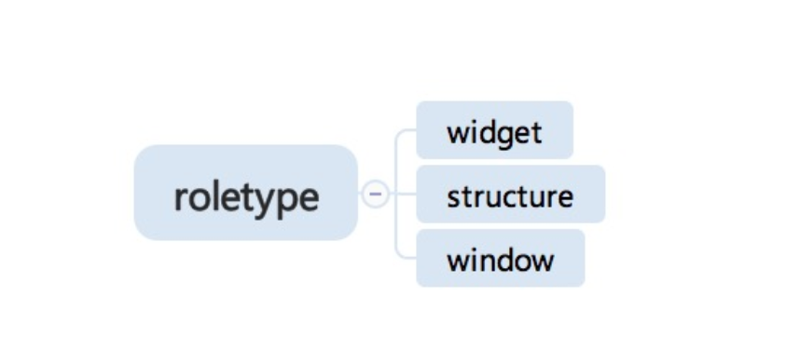
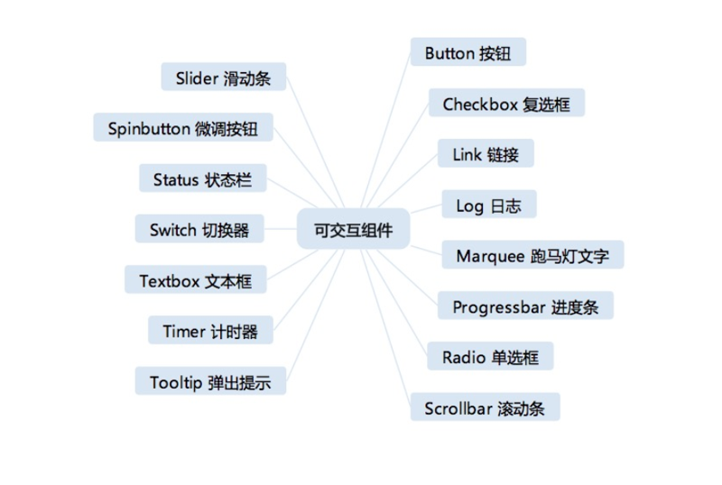
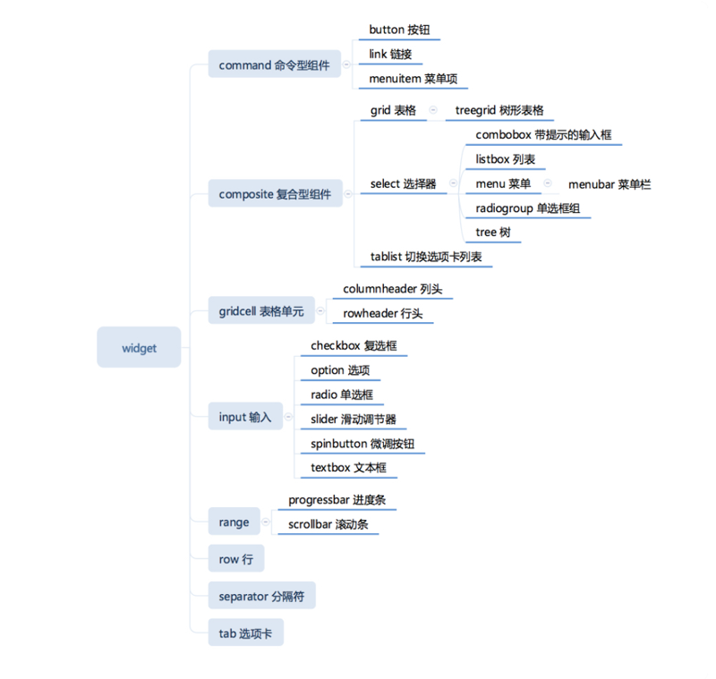
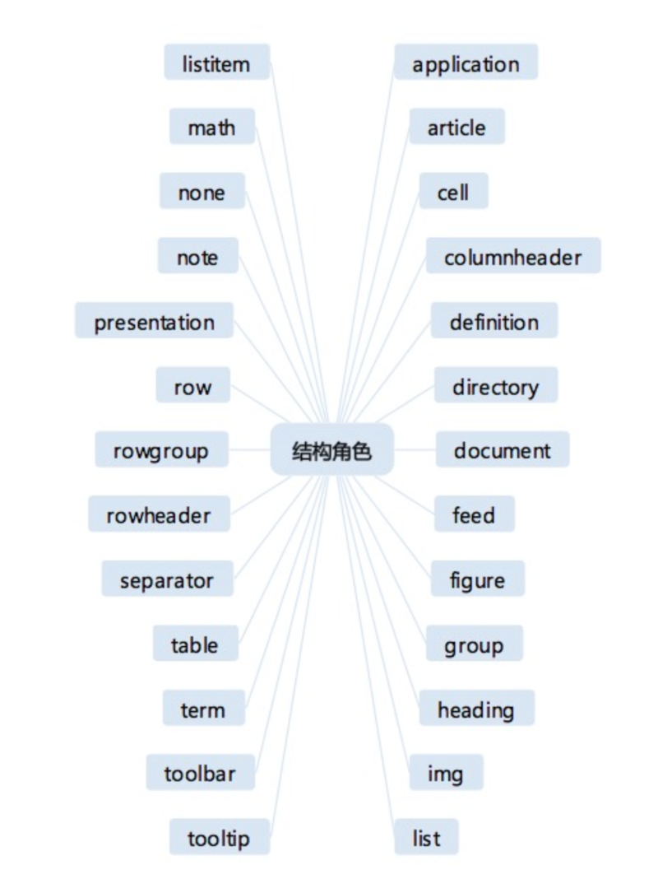
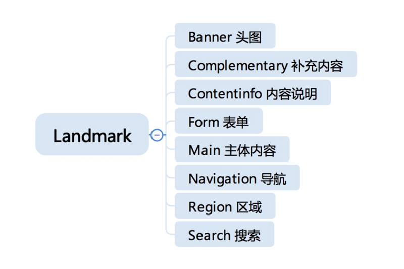

# 0216. HTML·ARIA：可访问性是只给盲人用的特性么？
> winter 2019-05-07

HTML 已经是一个完整的语义系统。在前面的课程中，我们围绕着 HTML 本身做了讲解，但是在实际应用中，我们还会用到一些它的扩展。今天我们要讲的 ARIA 就是其中重要的一部分。ARIA 全称为 Accessible Rich Internet Applications，它表现为一组属性，是用于可访问性的一份标准。关于可访问性，它被提到最多的，就是它可以为视觉障碍用户服务，但是，这是一个误解。

实际上，可访问性其实是一个相当大的课题，它的定义包含了各种设备访问、各种环境、各种人群访问的友好性。不单单是永久性的残障人士需要用到可访问性，健康的人也可能在特定时刻处于需要可访问性的环境。

我们今天讲的 ARIA，是以交互形式来标注各种元素的一类属性，所以，在 ARIA 属性中，你可以看到很多熟悉的面孔，交互形式往往跟我们直觉中的「控件」非常相似。所以我们的课程，特意把 ARIA 加入还有一个原因：ARIA 的角色对于我们 UI 系统的设计有重要的参考意义。

## 16.1 综述

我们先整体来看看，ARIA 给 HTML 元素添加的一个核心属性就是 role，我们来看一个例子：

```html
<span role="checkbox" aria-checked="false" tabindex="0" aria-labelledby="chk1-label">
</span> <label id="chk1-label">Remember my preferences</label>
```

这里我们给一个 span 添加了 checkbox 角色，这样，表示我们这个 span 被用于 checkbox，这意味着，我们可能已经用 JS 代码绑定了这个 span 的 click 事件，并且以 checkbox 的交互方式来处理用户操作。

同时，ARIA 系统还提供了一系列 ARIA 属性给 checkbox 这个 role，这意味着，我们可以通过 HTML 属性变化来理解这个 JavaScript 组件的状态，读屏软件等三方客户端，就可以理解我们的 UI 变化，这正是 ARIA 标准的意义。

role 的定义是一个树形的继承关系，我们先来理解一下它的整体结构：



其中，widget 表示一些可交互的组件，structure 表示文档中的结构，window 则代表窗体。接下来，让我们分类了解一下重要的 ARIA 角色。

## 16.2 Widget 角色

我们刚刚已经讲过一个 widget role，就是 checkbox。这一类角色跟我们桌面开发中的控件类似，它表示一个可交互的组件，它们有：



我们这里按照继承关系给出一份列表和简要说明：



ARIA role 允许多继承，这里有些角色我没有重复写。注意，这些 role 可以出现在任何一个 HTML 元素之上，同时要注意，这些 ARIA 属性，不会真实地改变任何一个元素的行为，比如，我们刚才讲的 checkbox，即使我们给一个 span 添加了 Checkbox 角色，我们也需要用 JavaScript 编写相应的逻辑。

这些 widget 同时还会带来对应的 ARIA 属性，比如，我们的 Checkbox 角色，会带来两个属性：1）aria-checked 表示复选框是否已经被选中；2）aria-labelledby 表示复选框对应的文字。

而 Button 角色，则会带来另外两个属性：1）aria-pressed 按钮是否已经被按下；2）aria-expanded 按钮控制的目标是否已经被展开。

除了它们本身的属性之外，可交互组件还有继承来的属性，比如，switch 角色继承了 checkbox，因此，它也可以使用 aria-checked 属性。在 WAI-ARIA 标准中，你可以找到所有的角色和对应的属性，我们这里就不一一列举了。（[Accessible Rich Internet Applications (WAI-ARIA) 1.1](https://www.w3.org/TR/wai-aria/)）

很多这些 ARIA 属性都是需要在 JavaScript 中维护的。如果我们要实现一份组件库，这些 widget role 和它们对应的 aria 属性是非常好的参考。如果你是组件的实现者，也希望你在实现组件时把对应的 ARIA 属性自动维护好。

除了简单的 widget，还有一些比较复杂的角色，需要多个角色一起配合。我们来逐个了解一下。1）Combobox 是一个带选项的输入框，我们常见的搜索引擎，一般都会提供这样的输入框，当输入时，它会提供若干提示选项。2）Grid 是一个表格，它会分成行、列，行列又有行头和列头表示行、列的意义。3）Tablist 是一个可切换的结构，一般被称为选项卡，它包含了 tab 头和 tabpanel，在 tab 容器中，可能包含各种组件。4）Listbox 是一个可选中的列表，它内部具有角色为 Option 的选项。5）Menu 是指菜单，菜单中可以加入嵌套的菜单项（Menuitem 角色），除了普通菜单项，还可以有 Menuitemcheckbox 带复选框的菜单栏和 Menuitemradio 带单选框的菜单栏。6）Radiogroup 是一组互斥的单选框的容器，它的内部可以由若干个角色为 radio 的单选框。7）Tree 是树形控件，它的内部含有 Treeitem 树形控件项，它还有一种升级形式是 Treegrid。

## 16.3 structure 角色

结构角色其实跟 HTML5 中不少新标签作用重合了，这里建议优先使用 HTML5 标签。这部分角色的作用类似于语义化标签，但是内容稍微有些不同，我们这里就不详细讲解了，仅仅给出一张图供你参考：



注：separator 在允许焦点时属于组件，在不允许焦点时属于文档结构。

这里我们需要特别提出 Landmark 角色这个概念，Landmark 角色直接翻译是地标，它是 ARIA 标准中总结的 Web 网页中最常见的 8 个结构，Landmark 角色实际上是 section 的子类，这些角色在生成页面摘要时有很大可能性需要被保留，它们是：



## 16.4 window 角色

在我们的网页中，有些元素表示「新窗口」，这时候，会用到 window 角色。window 系角色非常少，只有三个角色：window、dialog、alertdialog。dialog 可能会产生「焦点陷阱」，也就是说，当这样的角色被激活时，焦点无法离开这个区域。

## 总结

介绍了 ARIA 相关的知识，我们分几个部分学习了如何使用 ARIA 属性来提高页面的可访问性。以 ARIA 角色为中心，讲解了 ARIA 定义的语义体系。我们可以把 ARIA 分为三类。1）Widget 角色：主要是各种可交互的控件。2）结构角色：文档的结构。3）窗体角色：弹出的窗体。

课后问题是：请找一个支持图结构可视化的 JS 库，把所有 ARIA 的继承关系用可视化的方式展现出来。

## 黑板墙

感觉 ARIA 应该算一份前端 UI 组件库的实现标准吧，实际项目中除了一些简单的网页以外，大都直接用组件库了。以前专门学习了 mdn 里可访问性相关的文档，但实际项目还是从来没用到过，可能也和项目并非面向大众有关吧。感觉很多东西你知道它好，也花时间学习了，但是实际项目就是不会去用。

最近react项目有这个需求，头痛。