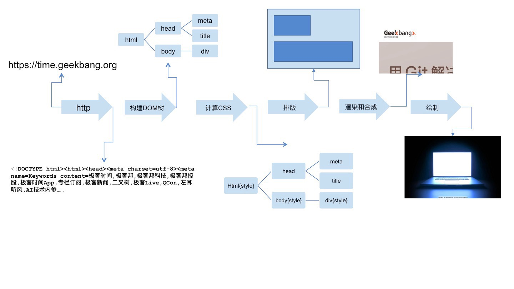

# 0301. 浏览器：一个浏览器是如何工作的？（阶段一）

> winter 2019-02-09

对于前端开发来说，我们平时与浏览器打交道的时间是最多的。可浏览器对前端同学来说更多像一个神秘黑盒子的存在。我们仅仅知道它能做什么，而不知道它是如何做到的。

在我面试和接触过的前端开发者中，70% 的前端同学对这部分的知识内容只能达到「一知半解」的程度。甚至还有一部分同学会质疑这部分知识是否重要：这与我们的工作相关吗，学多了会不会偏移前端工作的方向？

事实上，我们这里所需要了解的浏览器工作原理只是它的大致过程，这部分浏览器工作原理不但是前端面试的常考知识点，它还会辅助你的实际工作，学习浏览器的内部工作原理和个中缘由，对于我们做性能优化、排查错误都有很大的好处。

在我们的课程中，我也会控制浏览器相关知识的粒度，把它保持在「给前端工程师了解浏览器」的水准，而不是详细到「给浏览器开发工程师实现浏览器」的水准。

那么，我们今天开始，来共同思考一下。一个浏览器到底是如何工作的。

实际上，对浏览器的实现者来说，他们做的事情，就是把一个 URL 变成一个屏幕上显示的网页。这个过程是这样的：

1. 浏览器首先使用 HTTP 协议或者 HTTPS 协议，向服务端请求页面；

2. 把请求回来的 HTML 代码经过解析，构建成 DOM 树；

3. 计算 DOM 树上的 CSS 属性；

4. 最后根据 CSS 属性对元素逐个进行渲染，得到内存中的位图；

5. 一个可选的步骤是对位图进行合成，这会极大地增加后续绘制的速度；

6. 合成之后，再绘制到界面上。



我们在开始详细介绍之前，要建立一个感性认识。我们从 HTTP 请求回来开始，这个过程并非一般想象中的一步做完再做下一步，而是一条流水线。

从 HTTP 请求回来，就产生了流式的数据，后续的 DOM 树构建、CSS 计算、渲染、合成、绘制，都是尽可能地流式处理前一步的产出：即不需要等到上一步骤完全结束，就开始处理上一步的输出，这样我们在浏览网页时，才会看到逐步出现的页面。

首先我们来介绍下网络通讯的部分。

## 01. HTTP 协议

浏览器首先要做的事就是根据 URL 把数据取回来，取回数据使用的是 HTTP 协议，实际上这个过程之前还有 DNS 查询，不过这里就不详细展开了。

我先来了解下 HTTP 的标准。

HTTP 标准由 IETF 组织制定，跟它相关的标准主要有两份：

1. HTTP1.1 —— [RFC 2616 - Hypertext Transfer Protocol -- HTTP/1.1](https://tools.ietf.org/html/rfc2616)

2. HTTP1.1 —— [RFC 7234 - Hypertext Transfer Protocol (HTTP/1.1): Caching](https://tools.ietf.org/html/rfc7234)

HTTP 协议是基于 TCP 协议出现的，对 TCP 协议来说，TCP 协议是一条双向的通讯通道，HTTP 在 TCP 的基础上，规定了 Request-Response 的模式。这个模式决定了通讯必定是由浏览器端首先发起的。

大部分情况下，浏览器的实现者只需要用一个 TCP 库，甚至一个现成的 HTTP 库就可以搞定浏览器的网络通讯部分。HTTP 是纯粹的文本协议，它是规定了使用 TCP 协议来传输文本格式的一个应用层协议。

下面，我们试着用一个纯粹的 TCP 客户端来手工实现 HTTP 一下：

## 02. 实验

我们的实验需要使用 telnet 客户端，这个客户端是一个纯粹的 TCP 连接工具（安装方法）。

首先我们运行 telnet，连接到极客时间主机，在命令行里输入以下内容：

	telnet time.geekbang.org 80

这个时候，TCP 连接已经建立，我们输入以下字符作为请求：

```

GET / HTTP/1.1
Host: time.geekbang.org

```

按下两次回车，我们收到了服务端的回复：

```
HTTP/1.1 301 Moved Permanently
Date: Fri, 25 Jan 2019 13:28:12 GMT
Content-Type: text/html
Content-Length: 182
Connection: keep-alive
Location: https://time.geekbang.org/
Strict-Transport-Security: max-age=15768000

<html>
<head><title>301 Moved Permanently</title></head>
<body bgcolor="white">
<center><h1>301 Moved Permanently</h1></center>
<hr><center>openresty</center>
</body>
</html>

```

这就是一次完整的 HTTP 请求的过程了，我们可以看到，在 TCP 通道中传输的，完全是文本。

在请求部分，第一行被称作 request line，它分为三个部分，HTTP Method，也就是请求的「方法」，请求的路径和请求的协议和版本。

在响应部分，第一行被称作 response line，它也分为三个部分，协议和版本、状态码和状态文本。

紧随在 request line 或者 response line 之后，是请求头 / 响应头，这些头由若干行组成，每行是用冒号分隔的名称和值。

在头之后，以一个空行（两个换行符）为分隔，是请求体 / 响应体，请求体可能包含文件或者表单数据，响应体则是 HTML 代码。

## 03. HTTP 协议格式

根据上面的分析，我们可以知道 HTTP 协议，大概可以划分成如下部分。


我们简单看一下，在这些部分中，path 是请求的路径完全由服务端来定义，没有很多的特别内容；而 version 几乎都是固定字符串；response body 是我们最熟悉的 HTML，我在后面会有专门的课程介绍，这里也就不多讲了。

下面我们就来逐个给你介绍其它部分。

## 04. HTTP Method（方法）

我们首先来介绍一下 request line 里面的方法部分。这里的方法跟我们编程中的方法意义类似，表示我们此次 HTTP 请求希望执行的操作类型。方法有以下几种定义：

- GET

- POST

- HEAD

- PUT

- DELETE

- CONNECT

- OPTIONS

- TRACE

浏览器通过地址栏访问页面都是 GET 方法。表单提交产生 POST 方法。

HEAD 则是跟 GET 类似，只返回请求头，多数由 JavaScript 发起。

PUT 和 DELETE 分别表示添加资源和删除资源，但是实际上这只是语义上的一种约定，并没有强约束。

CONNECT 现在多用于 HTTPS 和 WebSocket。

OPTIONS 和 TRACE 一般用于调试，多数线上服务都不支持。

## 05. HTTP Status code（状态码）和 Status text（状态文本）

接下来我们看看 response line 的状态码和状态文本。常见的状态码有以下几种。

1xx：临时回应，表示客户端请继续。

2xx：请求成功。200：请求成功。

3xx: 表示请求的目标有变化，希望客户端进一步处理。301&302：永久性与临时性跳转；304：跟客户端缓存没有更新。

4xx：客户端请求错误。403：无权限；404：表示请求的页面不存在；418：It’s a teapot. 这是一个彩蛋，来自 ietf 的一个愚人节玩笑。（超文本咖啡壶控制协议）

5xx：服务端请求错误。500：服务端错误；503：服务端暂时性错误，可以一会再试。

对我们前端来说，1xx 系列的状态码是非常陌生的，原因是 1xx 的状态被浏览器 HTTP 库直接处理掉了，不会让上层应用知晓。2xx 系列的状态最熟悉的就是 200，这通常是网页请求成功的标志，也是大家最喜欢的状态码。3xx 系列比较复杂，301 和 302 两个状态表示当前资源已经被转移，只不过一个是永久性转移，一个是临时性转移。实际上 301 更接近于一种报错，提示客户端下次别来了。304 又是一个每个前端必知必会的状态，产生这个状态的前提是：客户端本地已经有缓存的版本，并且在 Request 中告诉了服务端，当服务端通过时间或者 tag，发现没有更新的时候，就会返回一个不含 body 的 304 状态。

## 06. HTTP Head (HTTP 头)

HTTP 头可以看作一个键值对。原则上，HTTP 头也是一种数据，我们可以自由定义 HTTP 头和值。不过在 HTTP 规范中，规定了一些特殊的 HTTP 头，我们现在就来了解一下它们。在 HTTP 标准中，有完整的请求 / 响应头规定，这里我们挑几个重点的说一下：

我们先来看看 Request Header。


接下来看一下 Response Header。


这里仅仅列出了我认为比较常见的 HTTP 头，这些头是我认为前端工程师应该做到不需要查阅，看到就可以知道意思的 HTTP 头。完整的列表还是请你参考我给出的 rfc2616 标准。

## 07. HTTP Request Body

HTTP 请求的 body 主要用于提交表单场景。实际上，HTTP 请求的 body 是比较自由的，只要浏览器端发送的 body 服务端认可就可以了。一些常见的 body 格式是：

- application/json

- application/x-www-form-urlencoded

- multipart/form-data

- text/xml

我们使用 HTML 的 form 标签提交产生的 HTML 请求，默认会产生 application/x-www-form-urlencoded 的数据格式，当有文件上传时，则会使用 multipart/form-data。

## 08. HTTPS

在 HTTP 协议的基础上，HTTPS 和 HTTP2 规定了更复杂的内容，但是它基本保持了 HTTP 的设计思想，即：使用上的 Request-Response 模式。

我们首先来了解下 HTTPS。HTTPS 有两个作用，一是确定请求的目标服务端身份，二是保证传输的数据不会被网络中间节点窃听或者篡改。HTTPS 的标准也是由 RFC 规定的，你可以查看它的详情链接：[RFC 2818 - HTTP Over TLS](https://tools.ietf.org/html/rfc2818)

HTTPS 是使用加密通道来传输 HTTP 的内容。但是 HTTPS 首先与服务端建立一条 TLS 加密通道。TLS 构建于 TCP 协议之上，它实际上是对传输的内容做一次加密，所以从传输内容上看，HTTPS 跟 HTTP 没有任何区别。

## 09. HTTP 2

HTTP 2 是 HTTP 1.1 的升级版本，你可以查看它的详情链接：[RFC 7540 - Hypertext Transfer Protocol Version 2 (HTTP/2)](https://tools.ietf.org/html/rfc7540)

HTTP 2.0 最大的改进有两点，一是支持服务端推送，二是支持 TCP 连接复用。服务端推送能够在客户端发送第一个请求到服务端时，提前把一部分内容推送给客户端，放入缓存当中，这可以避免客户端请求顺序带来的并行度不高，从而导致的性能问题；TCP 连接复用，则使用同一个 TCP 连接来传输多个 HTTP 请求，避免了 TCP 连接建立时的三次握手开销，和初建 TCP 连接时传输窗口小的问题。

Note：其实很多优化涉及更下层的协议。IP 层的分包情况，和物理层的建连时间是需要被考虑的。

## 结语

在这一节内容中，我们一起学习了浏览器的第一步工作，也就是「浏览器首先使用 HTTP 协议或 HTTPS 协议，向服务端请求页面」的这一过程。

在这个过程中，掌握 HTTP 协议是重中之重。我从一个小实验开始，带你体验了一次完整的 HTTP 请求过程。我们一起先分析了 HTTP 协议的结构。接下来，我分别介绍了 HTTP 方法、HTTP 状态码和状态文本、HTTP Head 和 HTTP Request Body 几个重点需要注意的部分。

最后，我还介绍了 HTTPS 和 HTTP 2 这两个补充版本，以便你可以更好地熟悉并理解新的特性。

你在工作中，是否已经开始使用 HTTPS 和 HTTP 2 协议了呢？用到了它们的哪些特性。

## 黑板墙

### 01

CC：

现在工作中暂时只使用到 HTTPS。去年，看到一些公司已经开始着手更新 HTTP2，不少敬佩的前端高手做了分享。他们利用 HTTP2 服务端推送，以及 TCP 连接复用的特性，把 CSS 和 JS 文件分拆成更小的文件，分批下载。更小的文件意味着用户可以更快看到页面，以及性能的改善。与此同时，这种处理方式也对生产环境的工具链带来调整和改变。

很有意思的变化。

2019-02-09

### 02

yy 不会笑：

自己可以扩展补充以下

> DNS 查询得到 IP

> tcp/ip 的并发限制

> get 和 post 的区别

> 五层因特网协议栈

> 长连接与短连接

> http2.0 与 http1.1 的显著不同点：

> 强缓存与协商缓存

2019-02-09

### 03

一步：

HTT2 还有一个很重要的特性：使用二进制代理文本进行传输，极大提高了传输的效率。

作者回复：嗯 是 这块每太细讲 我觉得大家了解即可 主要是服务端的工作。

2019-02-23

### 04

瞧，这个人：

当 5G 来临，http 小优化都不用找了。

作者回复：这完全是一种误解，物理层优化没法解决上层协议的问题。

2019-02-16

