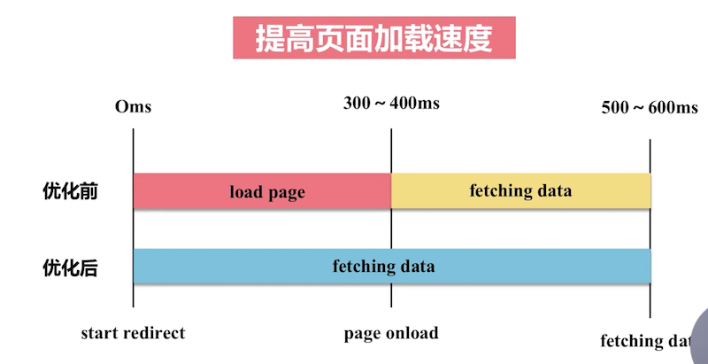

# 0801小程序开发实战注意事项及进阶

## 02. 性能优化

由于小程序开发框架本身的策略原因，从而限制了小程序在页面跳转时的加载速度。

### 1. 页面跳转优化

优化策略：



优化前，从用户点击的跳转行为触发，到下一个页面 onload 的生命周期函数内，中间的时间差大概有 300-400ms，再下一个页面的 onload 函数内我们才能够进行页面的请求。数据从请求到相应大概需要 200ms 的时间。这么来说就造成了从触发跳转到下一个页面的拉取数据之间，有 500-600ms 的时长。

2『把加载所需时间的方法学会。』

小程序每个页面方法都接受一个 object 的参数，小程序启动的时候会将需要调用的 object 方法存入队列，在每次页面访问时，小程序都会创建一个新的对象实例。这里创建对象实例的方式是通过生拷贝实现的，基于这样的方式也就给了我们优化的空间。在我们跳转下一个页面触发的时候，我们可以预先去加载下一个页面的数据。在下一个页面 onload 函数生命周期阶段就可以直接使用上一个页面预存的数据。

1『插一句，MDN 教程里 JS 的缩进是 2 个空格。在书籍「2020096JavaScript-The-Good-Parts」里，作者用的是 4 个空格。因为还得写 python、php，以后 JS 统一也用 4 个空格。』

在示例文件里先引用：

```js
const pageManager = require('../../utils/pageManager');
const { fPromise } = require('../../utils/util');

const app = getApp();
```

在 utils 文件夹下创建一个 pageManager.js 文件：

```js
const promiseList = {};
module.exports = {
  // 往 promiseList 里塞数据
  putData: function (pageName, data) {
    promiseList[pageName] = data;
  },
  getData: function (pageName) {
    return promiseList[pageName];
  }
}
```

在 utils 文件夹里面的 util 文件里新增下面的方法。

```js
// 封装小程序异步函数的回调
const fPromise = fn => obj => {
  return new Promise((resolve, reject) => {
    obj.complete = obj.success = (res) => {
      // console.log(res,'>')
      resolve(res)
    }
    obj.fail = (err) => {
      reject(err)
    }
    fn(obj);
  })
}
```

ES6 语法中 Promise 回调的使用。Promise 是 ES6 中提供的一个异步操作的语法糖，简单来说就是一个容器，这个容器里保存着某个未来才会结束的某个事件的结果。fPromise 函数对原本的 Promise 进行了封装，可以实现所有异步操作的链式调用，解决了异步调用函数深度嵌套的烦劳。

Promise 异步操作函数有 2 个特点：1）Promise 函数有 3 个状态，第一个状态是 panding 进行中状态，表示当前异步操作是在进行中。第二个是 resolve 状态，表示当前异步操作已完成的状态。第三个状态是 reject 状态，表示异步操作失败的状态。需要说明的是，只有异步操作的结果才能说明当前异步操作是在哪一个状态，其他任意操作都不能改变其对应的状态的。2）第 2 个特点是，一旦 Promise 状态发生改变后它不会再发生其他任何的改变了，在其他任何时候都可以得到这个结果。对于 Promise 的状态改变只有两种结果：一是从 panding 状态变更为 resolve 状态；二是从 resolve 状态变更为 reject 状态。

上面的方法是 return 了一个 Promise 对象，这个对象里面我们通过用户调用一些异步函数时所传入的 sucess 回调函数、fail 回调函数以及 complete 回调函数，complete 和 sucess 函数我们对应的去 resolve 它的结果，即将它的结果变成已完成的状态。如果传入的是一个 fail 回调函数，那么将它的结果置为一个已失败的状态。同时返回给我们的调用端。这里就可以通说引入 fPromise 方法来链式调用它的一个返回结果。

```js
// pages/pageIndex/pageIndex.js
const pageManager = require('../../utils/pageManager');
const { fPromise } = require('../../utils/util');

const app = getApp();

const indexPageObj = {
  onload: function () {
    //
  },
  onNavigate: function () {
    const that = this;
    const promiseBooks = fPromise(wx.request) ({
      url: 'api'
    }).then(function (res) {
      return res.data;
    });

    pageManager.putData('getBooks', promiseBooks);
  },

  gotoPageC: function () {
    this.onNavigate();
    const currentTime = +new Date();
    console.log('Navigate to PageC', currentTime);
    app.setNavigateTime(currentTime);
    wx.navigateTo({
      url: '../pageC/index'
    })
  }
}

Page(indexPageObj);
```

### 2. 图片优化

1、首屏图片本地加载。

2、内容类图片迁移至 cdn。

### 3. 分包加载的优化方案

1、首次使用小程序，先下载小程序主包。

2、进入某个分包页面时，下载对应的分包。

绝大多数小程序是由多个功能模块组成的，通常这几个功能模块是相互独立的。代码可以通过功能及页面的划分。当我们用到某个功能时再按需加载它对应的代码包。采用分包加载是增加小程序的代码量来获得更多的扩展和服务。

分包是通过 app.json 文件里的 subpages 字段来设置的。可以去看官方的实例源码。

### 黑板墙

promiseBooks=fPromise()() 和 fPromise=fn=>obj=>{……fn(obj)} 这语法怎么理解？

作者回复：fPromise 返回了一个函数，调用 fPromise()() 相当于对 fPromise 返回的函数再次调用。

2018-05-20

练习的时候发现 POST 请求传递不了参数，GET 可以，我后台用的 java。还有那个日期格式化问题还望老师能够解答。

作者回复：我这里只是演示哈，如果你想要支持 post 和 get 两种请求方式，可以把请求入参放入请求头 header，然后后端就不用判断请求方式来进行相应的操作。

2018-05-09

util.js 文件内格式日期的方法要怎么调用呢？评论列表是个集合，难道要循环遍历调用吗？

作者回复：对呀，你不是用到了 wx:for 吗，循环调用格式化日期。

2018-05-09

那个可以把本机 ip 改成 https 的域名地址的软件叫什么，忘记了。

作者回复：不是改哈，是代理。whistle。
