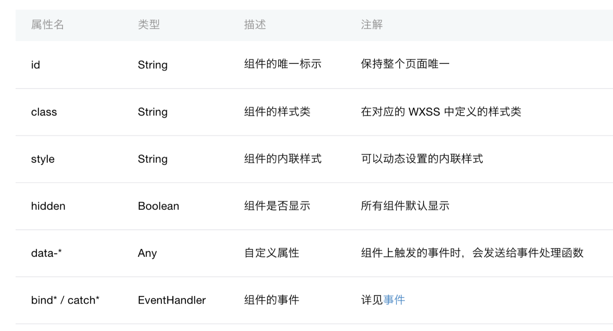
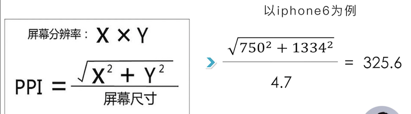
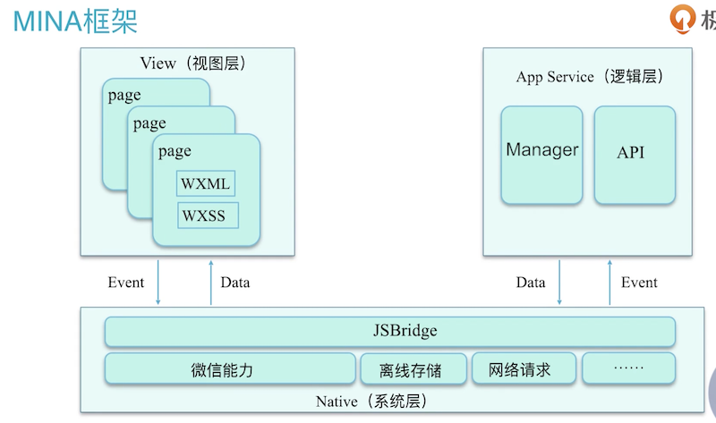

# 0301. 微信小程序开发框架

## 01. 开发框架组成介绍

基本框架是四个：WXML、WXSS、WXS 和 Java Script。

WXML 描述页面内容；WXSS 描述页面样式；Java Script 处理页面的交互逻辑以及数据通信；WXS 是对 WXML 能力增强的一种脚本语言，比如可以把我们请求到的数据进行一个 filter 或者一个计算处理，帮助 WXML 快速构建出页面的内容结构。

### 黑板墙

服务器配置的自签名的免费的 ssl，在开发工具里 web-view 预览没有问题，但是手机预览出现「网络出错，轻按屏幕重新加载-1202」，这是什么原因呢。

作者回复: 1）确认手机没有设置代理。2）检测下站点证书和服务器配置是否有误（https://cloud.tencent.com/product/tools#userDefined12）。3）ssl 证书与协议详细检测（https://www.ssllabs.com/ssltest/analyze.html）。4）web-view 组件需要配置业务域名哦。(2018-03-30)

有免费 ssl 证书服务吗?作者回复: 腾讯云提供 DV 免费 ssl 证书哈。(2018-05-15)

## 02. WXML 之语法

WXML（WeiXin Markup Language），是框架设计的⼀套标签语⾔，结合组件、 WXS 和事件系统，可以构建出⻚页⾯的结构。注意两点：一是 WXML 里的标签严格闭口；二是属性名大小写敏感。

WXML 有 4 个语言特性：1）数据绑定。2）列表渲染。3）条件渲染。4）模板引用。

### 1. 数据绑定

页面里的数据如果是绑定的，数据来源都是 js 文件里 Page() 方法中的 data 对象。数据绑定是通过 Mustache 语法，即 {{}} 来实现。数据绑定可以绑定文本值，可以绑定组件里的属性值，可以绑定运算符，还可以进行字符串运算绑定、组合式绑定和扩展运算符绑定等等。

注意：所有的属性和组件名字都要小写。

微信⼩程序开发框架 —— 属性：



1）id 属性；2）class 属性；3）style 是组件的内联样式，可以动态的设置内联样式，即可以直接在标签上写入我们想要的样式属性。与 class 的区别是它可以动态的设置样式属性，而 class 只能在 wxss 文件里设置，是静态属性。4）hidden 属性，控制组件是否显示，true 时隐藏组件，flase 时显示，默认是 flase 显示组件。5）data-* 属性，自定义属性，组件上触发的事件时，会发送给事件处理函数。可以通过 data 属性将页面里的数据、信息传递给 js 文件（逻辑层），当我们在组件上绑定一些事件触发时，可以通过事件回调函数来获取到我们所传入到 data 属性对应的数据。6）bind* / catch* 属性，组件的事件，通过绑定一些事件回调函数来进行一些操作。

1『data 属性是个关键知识点，目前没吃透。（2020-02-29）』

### 黑板墙

Hidden 隐藏是通过什么方式？是 opacity ，visibility ，还是 display ？作者回复: 肯定不是前两者，前两者虽然不可见，但是会占用页面布局，这里 hidden 你可以理解为节点对象已经生成，只是没有插入到父节点中。

数据绑定用的是 vue 框架吗？作者回复: 不是，是类 vue 框架，采用的都是 MVVM 的设计模式。

### 2. 列表渲染

对应于 html 里的列表 li。

在 js 文件里的 data 对象内定义一个 items 数组，数组里有 2 个变量 index 和 item，这个数组其实就是一个字典，「键-值」对嘛。可以通过 wx:for-item="item" 来设置变量名，wx:key="index" 来设置索引。注意，key 代码了列表中项目得的唯一标识符，如果列表是一个静态列表或者并不想维护这个列表里的状态，那么可以忽略这个属性设置。但是，我们希望在列表属性发生改变的时候，即重新出发页面渲染的时候，列表中的项目它能保持自身的一个状态。比如在 input 组件里输入了一个我们想要的内容后，在页面渲染时不希望 input 组件里的内容发生改变，这时候就需要用到 wx:key 属性了，这个属性它会在页面重新渲染的时候，确保带有 key 的组件会重新排序，而不是重新渲染，从而提升了页面渲染的效率。例子里用了 index 值作为 wx:key 的属性值，但不推荐，应该使用列表元素其具有唯一值的属性来标识这个唯一性。

接着 wxml 里，在 block 包装元素里设置 wx:for 属性，属性值赋值 items。注意，block 标签不是一个组件，只是一个包装元素，页面渲染后不显示的。

2『例子的代码有时间自己码下。』

### 3. 条件渲染

另外小知识点：

```js
Page({
    data: {
        condition: Math.floor(Math.random()*3+1)
    }
})
```

Math.floor() 函数是生成一个 0-1 的随机浮点数，另一个 Math.random() 是对一个浮点数向下取整的一个操作。

hidden 也可以控制元素内容的显示和隐藏，那么和条件渲染有什么区别呢？wx:if 条件渲染在切换时，框架局部会有一个渲染过程，可以保证切换时销毁和重新渲染。而 hidden 属性它始终都会渲染，只是通过 hidden 属性控制其在视图上的显示。一般来说条件渲染有更高的切换消耗，而 hidden 有更高的初始化渲染消耗。所以这两个要根据具体的应用场景去选择，一般如果需要频繁去切换显示的话用 hidden 更好。

### 4. 模板及应用

可以在模板里定义自己的代码片段，然后在其他地方反复调用。

```js
<template name="tempItem">
  <view>
    <view>收件人：{{name}}</view>    
    <view>联系方式：{{phone}}</view>    
    <view>地址：{{address}}</view>    
  </view>
</template>

<template is="tempItem" data="{{...item}}"></template>
```

```
// pages/test/test.js
Page({

  /**
   * 页面的初始数据
   */
  data: {
    item: {
      name: "dalong",
      phone: "18845673245",
      address: "中国杭州"
    }

  },
})
```

怎么来调用模板？通过使用 is 属性来申明我们需要的是哪个模板。调用模板时需要传入我们要调用的数据，通过 data 属性来传入，因为模板拥有自己的定义域，只能通过 data 属性去传入。这里还有个知识点，是通过扩展运算符传入数据的。

除了直接调用模板还可以通过「文件引用」来调用模板，有 2 种方式：import 和 include。import 来调用 test.wxml 里的内容的话，只能调用 test.wxml 里 template 的内容，模板外的内容是调用不了的。它有个作用域的概念，只能引用目标文件里的模板里的内容，如果目标文件里嵌套了其他文件的模板，这些模板时不会被引用的。其实是为了避免循环调用成死循环的情况。

```js
<import src="test.wxml"></import>
<template is="tempItem"></template
```

而 include 是调用目标文件里除了模板之外的所有内容，相当于拷贝到了 include 位置这里。

### 黑板墙

两种引用模板的方式：include 和 template。区别：include 只会引用除 template 内容外的内容，import 只会引用 template 内的的内容，动态的传入数据，is 表示引用的模板名称，data 表示传入模板的数据。

{{...item}}中前面那三个点是什么意思？作者回复: es6 语法，扩展运算符，可以将对象或数组进行解构赋值。

求教一个问题，像轻芒咋杂志的小程序，顶部导航栏（左右滑动的）是如何实现的？主页面不可以下拉刷新，每个 tab 对应的页面可以下拉刷新，tab 对应的页面是 scroll/view 吗？作者回复: 他这个应该是一个页面，然后使用了一个导航栏的组件（非原生），主 tab 那里通过 js 控制不开启页面下拉刷新，切换到其他 tab 时再开启下拉刷新，下拉刷新的那个 loading 态是他们自己做的。

## 03. WXSS 特性

### 1. 响应式像素

wxss 全称是 WeiXin Style Sheets。几个常用的属性：width、height、position、color、border。

wxss 跟 web 的 css 相比，有一些调整：1）尺寸单位 rpx。2）样式导入。3）内联样式。4）选择器。

设备像素（device pixels），设备能控制显示的最小物理单位，物理单元是显示屏幕上的一个个点，这些点是固定不变的；CSS 像素（CSS pixels），是一个 web 编程的概念，是 css 代码里使用的一个逻辑像素；PPI/DPI  (pixel per inch），表示每英寸所拥有的像素数目，数值越高代表显示屏能够以更高的密度去显示图像；DPR (devicepixe Ratio），是指在某一方向上设备像素与 CSS 像素之比，小程序模拟器上面显示了各个尺寸手机的 DPR，wxss 刚开始是不能识别各种设备的，虽然 wxss 支持 rem，但 rem 是依赖 html 根元素的，但 wxss 不支持根元素里的样式属性，所以微信团队推出了 rpx，它规定了屏幕宽度为 750 个 rpx，从而让我们可以根据屏幕宽度来自适应。rpx 的实现原理跟 rem 很相似，而且 rpx 最终也是转化成了 rem。

PPI 的计算公式：



### 黑板墙

rpx 单位是微信小程序中 css 的尺寸单位，rpx 可以根据屏幕宽度进行自适应。规定屏幕宽为 750rpx。如在 iPhone6 上，屏幕宽度为 375px，共有 750 个物理像素，则 750rpx = 375px = 750 物理像素，1rpx = 0.5px = 1 物理像素。

rem（font size of the root element）是指相对于根元素的字体大小的单位。简单的说它就是一个相对单位。看到 rem 大家一定会想起 em 单位，em（font size of the element）是指相对于父元素的字体大小的单位。它们之间其实很相似，只不过一个计算的规则是依赖根元素一个是依赖父元素计算。

为啥 width 的像素单位为 rpx，height 的像素单位为 px？作者回复: 一般就是内容做宽度适配，如果高度适配的话，也可以用 rpx，这里我只是简单的举个例子。表示 px 和 rpx 都是支持的。

屏幕宽度是 750rpx， 那么高度是多少 rpx 呢？作者回复：一般我们指宽度自适应，所以会用 750rpx 来表示屏幕整屏宽度。

### 2. 样式

支持外联样式的导入（@import）。注意：样式文件的执行是有顺序的，它是从上到下，从左到右来执行的。

同时支持内联样式。一般把静态属性写入 class 中，而把动态属性写入内联样式中。

```js
<view style="width:500rpx;height:30px;background-color:{{colorValue}};">
  Hello World
</view>
```

### 3. 选择器


选择器本质上说是，用于选择你想要的样式的一个模式。class 只是选择器的一种，还支持 id 选择器、element 选择器等。「view::after」 在 view 组件后边插入内容，「view::before」在 view 组件前边插入内容。

选择器是有优先级的。优先级以及权重分别为：!important（∞）、style（1000）、#element（100）、.element（10）、element（1）。

当在一个样式中声明了 !important 的选择器，这个规则会覆盖其他的任何声明，因为它的权重值最高，所以使用它得小心，它会破坏样式表中的一些既有规则。什么时候使用它？最近小程序出了一个插件功能，可以把一个插件封装起来给别人使用，当使用别人的插件后，想要修改插件里的一些样式，除了直接在插件源码里修改样式外，也可以在插件的外层使用 !important 的声明规则。

```
.title{
    color: red !important;
}
```

### 黑板墙

我使用了nth-type-of 选择器也起作用了？这是怎么回事？列表里并没有支持。作者回复：看了下是支持 nth-of-type 的，这里以实际表现为准，官方文档漏缺的地方可以在开发者社区反馈。

## 04. JavaScript

### 1. JavaScript 介绍

Javascript 是一种轻量的、解释型的、面向对象的头等函数语言，是一种动态的基于原型和多范式的脚本语言，支持面向对象、命令式和函数式的编程风格。Javascript 和 Java 关系就如同雷锋和雷峰塔。

1『又见「函数式」编程风格。』

推荐了 2 本书：《Javascript 高级程序设计》和《Javascript 权威指南》。

2『已下载书籍「2019105JavaScript高级程序设计3Ed」、「2020010JavaScript权威指南」，可以先看犀牛书权威指南。』

### 2. 小程序JavaScript 实现

Nodejs 中的 JavaScript 实现有 3 大块内容：ECMAScript、Native 和 NPM。Native 是一个原生模块，可以通过它来使用 JavaScript 本身不具有的能力。NPM 是包管理系统。Nodejs 是基于 Google 的 V8 引擎实现的 JavaScript 运行时，它使用了高效轻量级的事件驱动以及非阻塞的 ls 模型。

小程序的 JavaScript 实现有 3 大块内容：ECMAScript、小程序框架和小程序 API。浏览器的 JavaScript 实现有 3 大块内容：ECMAScript、DOM 和 BOM。

ECMAScript 这门脚本语言需要了解。语法、类型、语句、关键字、操作符、对象。JavaScript 是对 ECMAScript 的一种实现，ECMAScript 好比是普通话，JavaScript 是众多方言中的一种（最流行的）。

### 3. 小程序宿主环境差异

小程序，不同平台 JavaScript 运行的环境也是不同的。三个平台的运行环境不一致：1）IOS 是 JavaCore 解析，由 wky 来渲染。2）Android 是由 X5SCore 解析，X5 内核渲染。3）IDE 是 nwjs。

ES 目前有 8 个版本。同样的代码，开发环境和真机表现是不一样的，所以得使用远程调试功能来进行真机的调试。

## 05. 学会使用 WXS

除了在逻辑层使用的 JavaScript 脚本语言外，小程序还有自己的一套脚本语言 wxs。

模块、变量、注释、运算符、语句、数据类型、基础类库。

wxs 的模块，可以通过一个标签来声明，也可以通过一个文件来声明。文件需要将其命名为「.wxs」。在 wxs 模块里有自己独立的作用域，模块里定义的变量都是私有的，对模块外不可见。

通过标签来声明：

```js
<wxs module="m1">
// 暴露给外面使用
  module.exports = {
    message: "Hello, dalong"
  }
</wxs>

<text class="title">{{m1.message}}</text>
```

通过文件来引用：

```js
<text class="title">{{m1.message}}</text>

<wxs src="./m2.wxs" module="m2"></wxs>
<text class="title">{{m2.message}}</text>

// m2.wxs
module.exports = require('./m1.wxs')

// m1.wxs
module.exports = {
  message: "Hello, dalong"
}
```

注意一点：在同一个页面不要重复的声明 wxs 模块名，否者后面的 wxs 会覆盖掉前面的。

wxs 里是不支持 try - catch 语句的。说白了，wxs 就是对 JS 做了一些封装和限制。

### 黑板墙

有了 es5 做逻辑运算，要 wxs 干什么呢？wxs 类似于 react 的 jsx？作者回复：wxs 就是为了方便进行运算处理而生的，和 jsx 不一样，是单纯的 script。

2018-06-20

## 06. MINA 框架讲解




### 黑板墙

新老版本在不兼容的情况下「db 数据结构变化，或接口返回值有不兼容的变化」，如何在不停服的情况， 既可以让微信审核人员进行审核，也能支持线上的小程序正常使用。作者回复：db 数据结构变化也要兼容旧业务吧，更换接口返回值的话可以考虑写个中间件，在请求的时候带上接口版本标识，如果想更换整条接口，可以采用接口地址配置下发的方式，在小程序启动的时候下发相关接口地址。

数据处理放在主线程，不会导致页面卡顿吗？作者回复：ui 线程和 js 线程是独立开的，页面渲染是在 ui 线程里处理的，所以不会造成阻塞。

为避免跨线程的消耗， 会把在逻辑层做的类似 Filter 的计算放到视图层来计算， 这一块没太听的清楚， 能给个具体例子吗？作者回复：如果你之前有用过 vue，会比较好理解，类似 vue 的 computed 属性一样，在小程序里可以用 wxs 来进行这类操作。

1『所以这就是 wxs 的价值，页面层那边分担一些逻辑计算。』

## 15. 小程序运行机制


### 黑板墙

讲师，连续两次的系统报警，是什么报警？微信的？还是小程序的？还是操作系统的？
作者回复：微信小程序的内存告警。

## 16. 小程序加载机制


## 17. 生命周期


## 18. 页面路由


## 19. 小程序事件流


