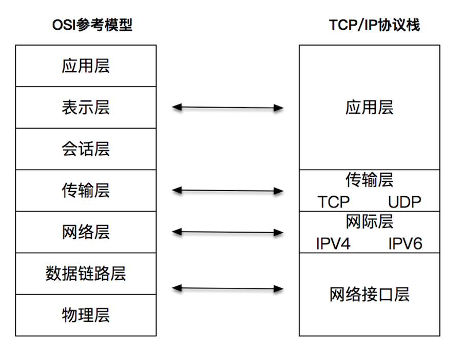
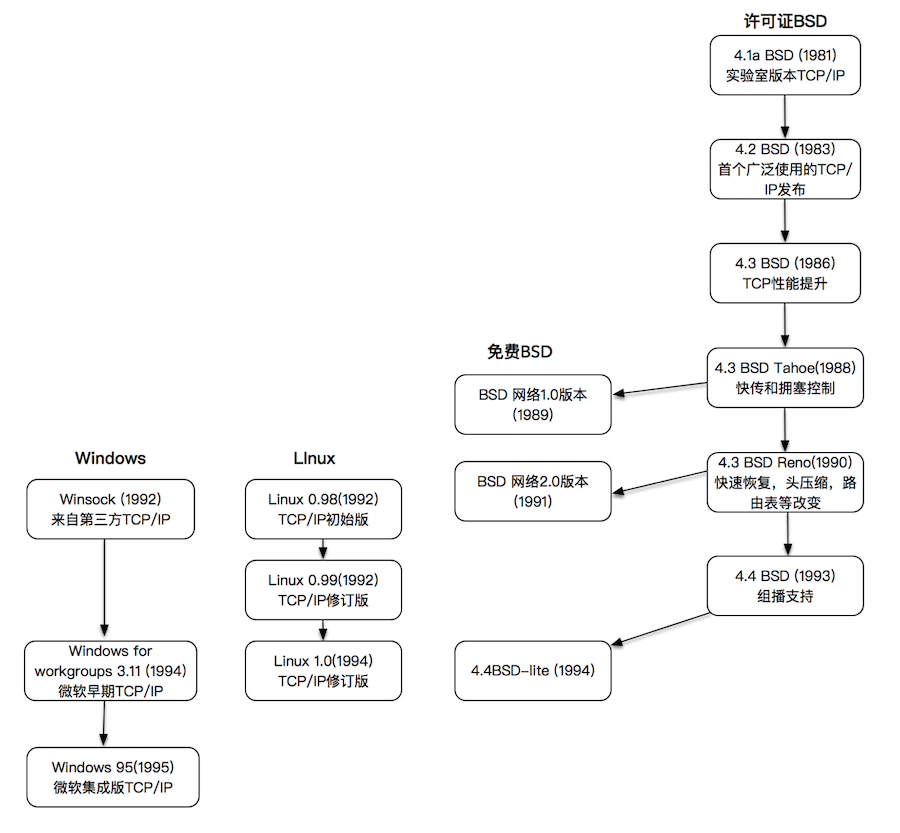

# 第 195 期 | TCP/IP 和 Linux 是如何改变世界的？

2020-01-31 池建强

你好，这里是卖桃者说。今天是大年初七，我已经开始工作了，没上班的也该收收心，准备· 下把心思放到工作和学习上来。这是春节期间最后一期精选，来自《网络编程实战》，讲的是 2TCP/P 和 Linux 是如何改変世界的。以下是全文。

你好，我是盛延敏。今天是网络编程课程的第一课，我想你一定满怀热情，期望快速进入到技术细节里，了解那些你不熟知的编程技能。而今天我却想和你讲讲历史，虽然这些事情看着不是「干货」，但它可以帮助你理解网络编程中各种技术的来龙去脉。

你我都是程序员，说句实在话，我们正处于ー个属于我们的时代里，我们也正在第一线享受着这个时代的红利。在我看来，人类历史上还从来没有一项技术可以像互联网一样深刻地影响人】生活的方方面面。

而具体到互联网技术里，有两件事最为重要，一个是 TCP/IP 协议，它是万物互联的事实标准；另一个是 Linux 操作系统，它是推动互联网技术走向繁策的基石。

今天，我就带你穿越时间的走廊，看一看 TCP/IP 事实标准和 Linux 操作系统是如何一步一步发展到今天的。

## TCP 发展历史

一般来说，我们认为互联网起源于阿帕网（ARPANET）。

最早的阿帕网还是非常简陋的，网络控制协议（Network Control Protocol，缩写 NCP）是阿白网中连接不同计算机的通信协议。

在构建阿帕网（ARPANET）之后，其他数据传输技术的研究又被摆上案头。NCP 诞生两年后，NCP 的开发者温特·瑟夫（Vinton Cerf）和罗伯特·卡恩（Robert E. Kahn）一起开发了个阿帕网的下一代协议，并在 1974 年发表了以分组、序列化、流量控制、超时和容错等为 核心的一种新型的网络互联协议，一举奠定了 TCP/IP 协议的基础。

OSI& TCP/IP


在这之后，TCP/IP 逐渐发展。咱们话分两头说，一头是一个叫 ISO 的组织发现计算机设备的互联互通是一个值得硏究的新领域，于是，这个组织出面和众多厂商游说，「我们一起定义，出一个网络互联互通的标准吧，这样大家都遵守这个标准，一起把这件事情做大，大家就有钱赚了」。众多厂商觉得可以啊，于是 ISO 组织就召集了一帮人，认真研究起了网络互联这件事情，还真的搞出来一个非常强悍的标准，这就是 OSl 参考模型。这里我不详细介绍 OSI 参考模型了，你可以阅读 2 罗剑锋老师的专栏，他讲得很好。

这个标准发布的时候已经是 1984 年了，有点尴尬的是，OS 搞得是很好，大家也都很满意

不过，等它发布的时候，SO 组织却惊讶地发现满世界都在用一个叫做 TCP/IP 协议栈的东西，而且，跟 OSl 标准半毛钱关系都没有。

这就涉及到了另一头 - TCP/IP 的发展。

事实上，我在前面提到的那两位牛人卡恩和瑟夫，一直都在不遗余力地推广 TCP/IP。当然，

TCP/P 的成功也不是偶然的，而是综合了几个因素后的结果：

1.TCP/IP 是免费或者是少量收费的，这样就扩大了使用人群；

2.TCP/IP 搭上了 UNX 这辆时代快车，很快推出了基于套接字 (socket）的实际编程接口；

3. 这是最重要的一点，TCP/IP 来源于实际需求，大家都在翘首盼望出一个統一标准，可是在

此之前实际的问题总要解決啊，TCP/IP 解決了实际问题，并且在实际中不断完善。

回过来看，OSI 的七层模型定得过于复杂，并且没有参考实现，在一定程度上阻碍了普及。

不过，OSl 教科书般的层次模型，对后世的影响很深远，一般我们说的 4 层、7 层，也是遵从了 oSl 模型的定义，分别指代传输层和应用层。

我们说 TCP/IP 的应用层对应了 OSl 的应用层、表示层和会话层；TCP/IP 的网络接口层对应了 OSl 的数据链路层和物理层。



## UNX 操作系统发展历史

前面我们提到了 TCP/IP 协议的成功，离不开 UNX 操作系统的发展。接下来我们就看下

UNX 操作系统是如何诞生和演变的。

下面这张图摘自 [File:Unix timeline.en.svg - Wikipedia](https://en.wikipedia.org/wiki/File:Unix_timeline.en.svg)，它将 UNX 操作系统几十年的发展历史表述得非常清楚。

UNX 的各种版本和变体都起源于在 PDP-11 系统上运行的 UNX 分时系统第 6 版（1976 年）和第 7 版（1979 年），它们通常分别被称为 V6 和 V7。这两个版本是在贝尔实验室以外首先得到广泛应用的 UNX 系统。

这张图画得比较概括，我们主要从这张图上看 3 个分支

图上标示的 Research 橘黄色部分，是由 AT&T 贝尔实验室不断开发的 UNX 研究版本从此引出 UNX 分时系統第 8 版、第 9 版，终止于 1990 年的第 10 版（10.5)。这个版本可以说是操作系统界的少林派。天下武功皆出少林，世上 UNX 皆出自贝尔实验室。图中最上面所标识的操作系统版本，是加州大学伯克利分校（BSD）研究出的分支，从此引出 4. XBSD 实现，以及后面的各种 BSD 版本。这个可以看做是学院派。在历史上，学院派有力地推动了 UNX 的发展，包括我们后面会谈到的 socket 套接字都是出自此派。

图中最下面的那一个部分，是从 AT&T 分支的商业派，致力于从 UNX 系统中谋取商业利润。从此引出了 System 和 System V（被称为 UNX 的商用版本），还有各大公司的 UNX 商业版。

下面这张图也是源自维基百科，将 UNX 的历史表达得更为详细。

个基本事突是，网络编程套接字接口，最早是在 BSD4.2 引入的，这个时间大概是 1983 年，几经演变后，成为了事实标准，包括 System Il/V 分支也吸收了这部分能力，在上面这张大图上也可以看出来。

其实这张图也说明了一个很有意思的现象，BSD 分支、System Ill/System V 分支、正统的 UNX 分时系统分支都是互相借鉴的，也可以说是互相「抄袭」吧。但如果这样发展下去，互相不买对方的账，导致上层的应用程序在不同的 UNX 版本间不能很好地兼容，这该怎么办？这里先留一个疑问，你也可以先想一想，稍后我会给你解答。

下面我再介绍几个你耳熟能详的重要 UNX 玩家。

SVR 4


SVR4 (UNX System V Release4) 是 AT&T 的 UNX 系统实验室的一个商业产品。它基本上是一个操作系統的大杂烩，这个操作系统之所以重要，是因为它是 System Ill/V 分支各家商业化 UNX 操作系统的「先祖」，包括 IBM 的 AX、HP 的 HP-UX、SG 的 IRIX、Sun（后被 Oracle 收购）的 Solaris 等等。

Solaris


Solaris 是由 Sun Microsystems（现为 Oracle）开发的 UNX 系统版本，它基于 SVR4, 并且在商业上获得了不俗的成绩。2005 年，Sun Microsystems 开源了 Solaris 操作系统的大部分源代码，作为 Opensolaris 开放源代码操作系统的一部分。相对于 Linux，这个开源操作系统的进展比较一般。

BSD


BSD (Berkeley Software Distribution），我们上面已经介绍过了，是由加州大学伯克利分校的计算机系统研究组（CSRG）研究开发和分发的。4.2 BSD 于 1983 年问世，其中就包括了 网络编程套接口相关的设计和实现，4.3BSD 则于 1986 年发布，正是由于 TCP/P 和 BSD 操作系统的完美拍档，オ有了 TCP/IP 逐渐成为事实标准的这一历史进程

macos X


用 mac 笔记本的同学都有这样的感觉：macos 提供的环境和 Linux 环境非常像，很多代码可以在 macos 上以接近线上 Linux 真实环境的方式运行。

有心的同学应该想过背后有一定的原因。

答案其实很简单，macos 和 Linux 的血缘是相近的，它们都是 UNX 基础上发展起来的，或者说，它们各自就是一个类 UNX 的系统。

Macos 系统又被称为 Darwin，它已被验证过就是一个 UNX 操作系统。如果打开 Mac 系统的 socket. H 头文件定义，你会明显看到 macos 系统和 BSD 干丝万缕的联系，说明这就是从 BSD 系统中移植到 macos 系统来的。

Linux


我们把 Linux 操作系统单独拿出来讲，是因为它实在太重要了，全世界绝大部分数据中心操作系统都是跑在 Linux 上的，就连手机操作系统 Android，也是一个被「裁剪」过的 Linu 操作系

Uo


Linux 操作系统的发展有几个非常重要的因素，这几个因素迭加在一起，造就了如今 Linux 非凡的成就。我们一一来看。

UNX 的出现和发展

第一个就是 UNX 操作系统，要知道，Linux 操作系统刚出世的时候，4.2/4.3 BSD 都已经出现快 10 年了，这样就为 Linux 系统的发展提供了一个方向，而且 Linux 的开发语言是 C 语言，C 语言也是在 UNX 开发过程中发明的一种语言。

POSX 标准

UNX 操作系统虽然好，但是它的源代码是不开源的。那么如何向 UNX 学习呢？这就要讲下 POSIⅨ 标准了，POSX (Portable Operating System Interface for Computing Systems）这个标准基于现有的 UNX 实践和经验，描述了操作系统的调用服务接口。有了这么一个标准，Linux 完全可以去实现并兼容它，这从最早的 Linux 内核头文件的注释可见。

这个头文件里定义了一堆 POSX 宏，并有一句注释：「嗯，也许只是一个玩笑，不过我正在完成它。」

```

# ifndef _UNISTD_H

# define _UNISTD_H


/* ok, this may be a joke, but I'm working on it */

# define _POSIX_VERSION  198808L


# define _POSIX_CHOWN_RESTRICTED /* only root can do a chown (I think..) */

/* #define _POSIX_NO_TRUNC*/ /* pathname truncation (but see in kernel) */

# define _POSIX_VDISABLE '\0' /* character to disable things like ^C */

/*#define _POSIX_SAVED_IDS */ /* we'll get to this yet */

/*#define _POSIX_JOB_CONTROL */ /* we aren't there quite yet. Soon hopefully */
```

POSX 相当于给大厦画好了图纸，给 Linux 的发展提供了非常好的指引。这也是为什么我的程序在 macos 和 Linux 可以兼容运行的原因，因为大家用的都是一张图纸，只不过制造商不同，程序当然可以兼容运行了。

Miniⅸ 操作系统

刚才提到了 UNX 操作系统不开源的问题，那么有没有一开始就开源的 UNX 操作系统呢？这里就要提到 Linux 发展的第三个机遇，Miniⅸ 操作系统，它在早期是 Linux 发展的重要指引。这个操作系统是由一个叫做安迪·塔能鲍姆（Andy Tanenbaun）的教授开发的，他的本意是用来做 UNX 教学的，甚至有人说，如果 Minⅸ 操作系统也完全走社区开放的道路，那么未必有现在的 Linux 操作系统。当然，这些话咱们就权当做是马后炮了。Linux 早期从 Minix 中借鉴了一些思路，包括最早的文件系统等

GNU


Linux 操作系统得以发展还有一个非常重要的因素，那就是 GNU (GNU' S NOT UNX），它的创始人就是鼎鼎大名的理查·斯托曼（Richard Stallman）。斯托曼的想法是设计一个完全自由的软件系统，用户可以自由使用，自由修改这些软件系统。

GNU 为什么对 Linux 的发展如此重要呢？事实上，GNU 之于 Linux 是要早很久的，GNU 在 1984 年就正式诞生了。最开始，斯托曼是想开发一个类似 UNX 的操作系统的。

```
From CSvax:pur-ee:inuxc!ixn5c!ihnp4!houxm!mhuxi!eagle!mit-vax!mit-eddie!RMS@ MIT-OZ
From: RMS% MIT-OZ@ mit-eddie
Newsgroups: net.unix-wizards,net.usoft
Subj ect: new UNIX implementation
Date: Tue, 27-Sep-83 12:35:59 EST
Organization: MIT AI Lab, Cambridge, MA
Free Unix!
Starting this Thanksgiving I am going to write a complete Unix-compatible software system called GNU (for Gnu’s Not Unix), and give it away free to everyone who can use it. Contributions of time,money, programs and equipment are greatly needed.
To begin with, GNU will be a kernel plus all the utilities needed to write and run C programs: editor, shell, C compiler, linker, assembler, and a few other things. After this we will add a text formatter, a YACC, an Empire game, a spreadsheet, and hundreds of other things. We hope to supply, eventually, everything useful that normally comes with a Unix system, and anything else useful, including on-line and hardcopy documentation.
…
```

在这个设想宏大的 GNU 计划里，包括了操作系统内核、编辑器、shel、编译器、链接器和汇编器等等，每一个都是极其难啃的硬骨头

不过斯托曼可是个牛人，单枪匹马地开发出世界上最牛的编辑器 Emacs，继而组织和成立了自由软件基金会（the Free Software Foundation-FSF)

GNU 在自由软件基金会统一组织下，相继续推出了编译器 GCC、调试器 GDB、Bash Shell

等运行于用户空间的程序。正是这些软件为 Linux 操作系统的开发创造了一个合适的环境，比

如编译器 GCC、Bash Shell 5 就是 Linux 能够诞生的基础之

你有没有发现，GNU 独缺操作系统核心？

实际上，1990 年，自由软件基金会开始正式发展自己的操作系統 Hurd，作为 GNU 项目中的操作系統。不过这个项目再三耽搁，1991 年，Linux 出现，1993 年，Freebsd 发布，这样 GNU 的开发者开始转向于 Linux 或 FREEBSD，其中，Linux 成为更常见的 GNU 软件运行平台

斯托曼主张，Linux 操作系统使用了许多 GNU 软件，正式名应为 GNU/ Linux，但没有得到 inux 社群的一致认同，形成著名的 GNU/ Linux 命名争议。

GNU 是这么解释为什么应该叫 GNU/ Linux 的：「大多数基于 Linux 内核发布的操作系统，基本上都是 GNU 操作系统的修改版。我们从 1984 年就开始编写 GNU 软件，要比 Linus 开始编写它的内核早许多年，而且我们开发了系统的大部分软件，要比其它项目多得多，我们应该得到公平对待。」

从这段话里，我们可以知道 GNU 和 GNU/ Linux 互相造就了对方，没有 GNU 当然没有 inux，不过没有 Linux, GNU 也不可能大发光彩。

在开源的世界里，也会发生这种争名夺利的事情，我们也不用觉得惊奇。

## 操作系统对 TCP/P 的支持

井了这么多操作系统的内容，我们再来看下面这张图。图中展示了 TCP/IP 在各大操作系统的演变历史。可以看到，即使是大名鼎鼎的 Linux 以及 90 年代大发光彩的 Windows 操作系 统，在 TCP/P 网络这块，也只能算是一个后来者。



## 总结

这是我们专栏的第一讲，我没有直接开始讲网络编程，而是对今天互联网技术的基石，TCP 和

Linux 进行了简单的回顾。通过这样的回顾，熟悉历史，可以指导我们今后学习的方向，在后面的章节中，我们都将围绕 Linux 下的 TCP/IP 程序设计展开。

最后你不妨思考一下，Linux TCP/IP 网络协议栈最初的实现「借鉴」了多少 BSD 的实现呢？Linux 到底是不是应该被称为 GNU/ Linux 呢？

欢迎你在评论区写下你的思考，我会和你一起讨论这些问题。如果这篇文章帮你厘清了 TCP/P 和 Linux 的发展脉络，欢迎把它分享给你的朋友或者同事

