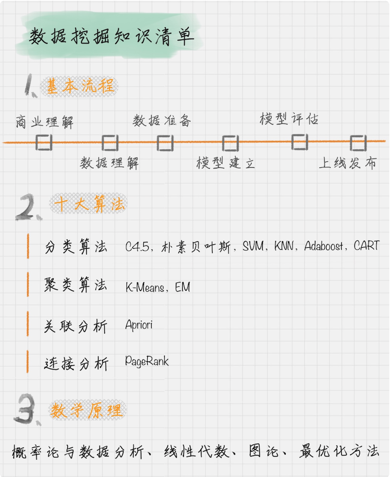

# 0102. 学习数据挖掘的最佳路径是什么？
> 陈旸 2018-12-19

上一节中，我给你分享了数据分析的全景图，其中最关键的部分就是数据挖掘，那什么是数据挖掘呢？想象一下，茫茫的大海上，孤零零地屹立着钻井，想要从大海中开采出宝贵的石油。对于普通人来说，大海是很难感知的，就更不用说找到宝藏了。但对于熟练的石油开采人员来说，大海是有坐标的。他们对地质做勘探，分析地质构造，从而发现哪些地方更可能有石油。然后用开采工具，进行深度挖掘，直到打到石油为止。

大海、地质信息、石油对开采人员来说就是数据源、地理位置、以及分析得到的结果。而我们要做的数据挖掘工作，就好像这个钻井一样，通过分析这些数据，从庞大的数据中发现规律，找到宝藏。

## 01. 数据挖掘，从知识清单开始

我们第一天学开车的时候一定不会直接上路，而是要你先学习基本的知识，然后再进行上车模拟。只有对知识有全面的认知，才能确保在以后的工作中即使遇到了问题，也可以快速定位问题所在，然后找方法去对应和解决。所以我列了一个数据挖掘的知识清单，分别是数据挖掘的基本流程、十大算法和数学原理，以此来开启我们的学习之旅。

## 02. 数据挖掘的基本流程

在正式讲数据挖掘知识清单之前，我先和你聊聊数据挖掘的基本流程。数据挖掘的过程可以分成以下 6 个步骤。

1. 商业理解：数据挖掘不是我们的目的，我们的目的是更好地帮助业务，所以第一步我们要从商业的角度理解项目需求，在这个基础上，再对数据挖掘的目标进行定义。

2. 数据理解：尝试收集部分数据，然后对数据进行探索，包括数据描述、数据质量验证等。这有助于你对收集的数据有个初步的认知。

3. 数据准备：开始收集数据，并对数据进行清洗、数据集成等操作，完成数据挖掘前的准备工作。

4. 模型建立：选择和应用各种数据挖掘模型，并进行优化，以便得到更好的分类结果。

5. 模型评估：对模型进行评价，并检查构建模型的每个步骤，确认模型是否实现了预定的商业目标。

上线发布：模型的作用是从数据中找到金矿，也就是我们所说的「知识」，获得的知识需要转化成用户可以使用的方式，呈现的形式可以是一份报告，也可以是实现一个比较复杂的、可重复的数据挖掘过程。数据挖掘结果如果是日常运营的一部分，那么后续的监控和维护就会变得重要。

## 03. 数据挖掘的十大算法

为了进行数据挖掘任务，数据科学家们提出了各种模型，在众多的数据挖掘模型中，国际权威的学术组织 ICDM （the IEEE International Conference on Data Mining）评选出了十大经典的算法。

按照不同的目的，我可以将这些算法分成四类，以便你更好的理解。

l 分类算法：C4.5，朴素贝叶斯（Naive Bayes），SVM，KNN，Adaboost，CART

l 聚类算法：K-Means，EM

l 关联分析：Apriori

l 连接分析：PageRank

### 1. C4.5

C4.5 算法是得票最高的算法，可以说是十大算法之首。C4.5 是决策树的算法，它创造性地在决策树构造过程中就进行了剪枝，并且可以处理连续的属性，也能对不完整的数据进行处理。它可以说是决策树分类中，具有里程碑式意义的算法。

### 2. 朴素贝叶斯（Naive Bayes）

朴素贝叶斯模型是基于概率论的原理，它的思想是这样的：对于给出的未知物体想要进行分类，就需要求解在这个未知物体出现的条件下各个类别出现的概率，哪个最大，就认为这个未知物体属于哪个分类。

### 3. SVM

SVM 的中文叫支持向量机，英文是 Support Vector Machine，简称 SVM。SVM 在训练中建立了一个超平面的分类模型。如果你对超平面不理解，没有关系，我在后面的算法篇会给你进行介绍。

### 4. KNN

KNN 也叫 K 最近邻算法，英文是 K-Nearest Neighbor。所谓 K 近邻，就是每个样本都可以用它最接近的 K 个邻居来代表。如果一个样本，它的 K 个最接近的邻居都属于分类 A，那么这个样本也属于分类 A。

### 5. AdaBoost

Adaboost 在训练中建立了一个联合的分类模型。boost 在英文中代表提升的意思，所以 Adaboost 是个构建分类器的提升算法。它可以让我们多个弱的分类器组成一个强的分类器，所以 Adaboost 也是一个常用的分类算法。

### 6. CART

CART 代表分类和回归树，英文是 Classification and Regression Trees。像英文一样，它构建了两棵树：一棵是分类树，另一个是回归树。和 C4.5 一样，它是一个决策树学习方法。

### 7. Apriori

Apriori 是一种挖掘关联规则（association rules）的算法，它通过挖掘频繁项集（frequent item sets）来揭示物品之间的关联关系，被广泛应用到商业挖掘和网络安全等领域中。频繁项集是指经常出现在一起的物品的集合，关联规则暗示着两种物品之间可能存在很强的关系。

### 8. K-Means

K-Means 算法是一个聚类算法。你可以这么理解，最终我想把物体划分成 K 类。假设每个类别里面，都有个「中心点」，即意见领袖，它是这个类别的核心。现在我有一个新点要归类，这时候就只要计算这个新点与 K 个中心点的距离，距离哪个中心点近，就变成了哪个类别。

### 9. EM

EM 算法也叫最大期望算法，是求参数的最大似然估计的一种方法。原理是这样的：假设我们想要评估参数 A 和参数 B，在开始状态下二者都是未知的，并且知道了 A 的信息就可以得到 B 的信息，反过来知道了 B 也就得到了 A。可以考虑首先赋予 A 某个初值，以此得到 B 的估值，然后从 B 的估值出发，重新估计 A 的取值，这个过程一直持续到收敛为止。

EM 算法经常用于聚类和机器学习领域中。

### 10. PageRank

PageRank 起源于论文影响力的计算方式，如果一篇文论被引入的次数越多，就代表这篇论文的影响力越强。同样 PageRank 被 Google 创造性地应用到了网页权重的计算中：当一个页面链出的页面越多，说明这个页面的「参考文献」越多，当这个页面被链入的频率越高，说明这个页面被引用的次数越高。基于这个原理，我们可以得到网站的权重划分。

算法可以说是数据挖掘的灵魂，也是最精华的部分。这 10 个经典算法在整个数据挖掘领域中的得票最高的，后面的一些其他算法也基本上都是在这个基础上进行改进和创新。今天你先对十大算法有一个初步的了解，你只需要做到心中有数就可以了，具体内容不理解没有关系，后面我会详细给你进行讲解。

## 04. 数据挖掘的数学原理

我说了这么多数据挖掘中的经典算法，但是如果你不了解概率论和数理统计，还是很难掌握算法的本质；如果你不懂线性代数，就很难理解矩阵和向量运作在数据挖掘中的价值；如果你没有最优化方法的概念，就对迭代收敛理解不深。所以说，想要更深刻地理解数据挖掘的方法，就非常有必要了解它后背的数学原理。

### 1. 概率论与数理统计

概率论在我们上大学的时候，基本上都学过，不过大学里老师教的内容，偏概率的多一些，统计部分讲得比较少。在数据挖掘里使用到概率论的地方就比较多了。比如条件概率、独立性的概念，以及随机变量、多维随机变量的概念。

很多算法的本质都与概率论相关，所以说概率论与数理统计是数据挖掘的重要数学基础。

### 2. 线性代数

向量和矩阵是线性代数中的重要知识点，它被广泛应用到数据挖掘中，比如我们经常会把对象抽象为矩阵的表示，一幅图像就可以抽象出来是一个矩阵，我们也经常计算特征值和特征向量，用特征向量来近似代表物体的特征。这个是大数据降维的基本思路。

基于矩阵的各种运算，以及基于矩阵的理论成熟，可以帮我们解决很多实际问题，比如 PCA 方法、SVD 方法，以及 MF、NMF 方法等在数据挖掘中都有广泛的应用。

### 3. 图论

社交网络的兴起，让图论的应用也越来越广。人与人的关系，可以用图论上的两个节点来进行连接，节点的度可以理解为一个人的朋友数。我们都听说过人脉的六度理论，在 Facebook 上被证明平均一个人与另一个人的连接，只需要 3.57 个人。当然图论对于网络结构的分析非常有效，同时图论也在关系挖掘和图像分割中有重要的作用。

### 4. 最优化方法

最优化方法相当于机器学习中自我学习的过程，当机器知道了目标，训练后与结果存在偏差就需要迭代调整，那么最优化就是这个调整的过程。一般来说，这个学习和迭代的过程是漫长、随机的。最优化方法的提出就是用更短的时间得到收敛，取得更好的效果。

## 总结

今天我列了下学习数据挖掘你要掌握的知识清单，只有你对数据挖掘的流程、算法、原理有更深的理解，你才能在实际工作中更好地运用，我将在后面的章节中对它们进行一一介绍。

今天我给你讲了如何学习数据挖掘，你从中有什么样的体会呢？如果某电商网站想挖掘商品之间的关联关系，从而提升销售额，你觉得可以采用上面的哪个算法？为什么？

## 精选留言

### 01

课后思考：对于思考题，我想到了沃尔玛「啤酒和尿布」经典案例。沃尔玛正是将 Apriori 算法引入到 POS 机数据分析中，从而获得了营销上奇迹。简单说来就是在一个数据集中，找到经常出现的商品组合。当然 Apriori 算法的计算量很大，当商品数据量大时效率低，FP-Tree 算法优化了该算法。

2018-12-19

### 02

1）数据挖掘学习方法体会：有了知识清单，相当于有了一个系统思维在那，对快速识别问题的确很有帮助～很好的方法方便实践，就像巴菲特和芒格的投资是使用的公司尽调清单一样，MECE 的解决问题。

2）基于电商商品的关联进行推荐从而提高销售的话，个人认为是 Apriori 算法，其为了提取频繁项集和一定置信度的关联规则，即用户购买了 X 产品有多大概率去买 Y，根据置信度高的原则推荐

作者回复：总结的很好，大家可以看下。尤其是用到了 MECE 原则。

2018-12-19

### 03

作者回复：不用担心，很多人都有这个问题。我觉得你可以尝试：

1、培养兴趣：兴趣是最好的老师，我们大自然的很多科学都是和数学相关，比如为什么雪花是六边形？

2、刻意训练：你不需要通过做项目来做完整的数学训练，比如你和朋友去吃饭的时候，你可以脑算下一共花了多少钱？很多时候，心算是数学的一个能力。

3、价值暗示：数学可以帮你很多，尤其是在算法效率、代码质量上。很明显，数学好的人，写出来的算法效率也更高。

所以一个代码完成后，你可以问自己个问题：还有没有更好的方法？

2018-12-19

Key.

理解了数据比选择算法建立模型更重要。我觉得电商网站可以采用 Apriori 算法，因为通过挖掘频繁项集，可以探索到物品之间的联系，从而为商家提供销售思路！

作者回复：是的，Aprior 是个挖掘商品关联关系的常用算法

2018-12-19

五岳寻仙

总结与思考：

1. 商业理解：如老师之前所讲，数据挖掘是工具，要么帮我批处理，要么拓展我们思考的规模。也就是说问题本身是人能够处理得了的，只是受限与时间太长或者规模太大，需要借助计算机。人工智能是人思考的放大，如果一个问题人都想不通，指望借助人工智能算法解决，目前恐怕还不现实。遇到问题，首先要「商业理解」，形成一个思路，然后考虑如何借助算法。

2. 问题归类：要解决的问题是属于分类，回归，聚类，还是关联分析等。每种类别的问题都有相对应的算法。不过有时候，对数据做不同的处理，能使问题适用于不同的算法。

3. 数据准备：数据准备已经能提现个人思想了，处理常规的缺失值处理、标准化 / 归一化，更重要的是所谓的「特征工程」，它决定了数据呈现的方式。同样的数据，呈现方式不同，算法学到的东西也不同。

4. 模型评估。有很多不同的评估指标，需要根据具体问题选择。模型的训练是一个最优化问题，目标不同，优化的方向也不同。

课后思考题：

根据老师文中讲到的方法，我觉得有如下这些方法可以用来做商品间关联分析：

1. Apriori：文中提到是通过挖掘频繁项集，来揭示商品间关系。(不太了解这个算法，期待后续学习)

2. KNN：通过临近商品，判断该商品的特征。我不确定是否试用，但感觉应该能解释商品间的相似性。

以上是自己对课程的理解，有不对的地方，请老师和大家指正。

2018-12-19

HxScript

文中的引子我深有体会：

我本科就是学的石油工程。油藏的勘探、储量预测、钻井、采油的确对应了数据挖掘的发现业务中的 key points、收集业务中的相关数据并建模、再将模型反代入业务进行模型持续的评估、输出可视化的数据分析结论以及报告。

我们在储量预测（数据建模）的时候，也有很多针对不同应用场景的不同方法，增产期用什么、断块油藏用什么模型（将数据分类用什么、对数据进行关联分析用什么算法）

再回答电商网站挖掘商品间的关联关系，提高销售额的问题：

根据 Apriori 算法的描述，电商的推荐系统（大家熟知的啤酒尿片）应该就是用其建立的。

当然也可能不止这一种，可能还会用分类算法，对用户分群建立用户画像，某一类用户画像，又通过 pagerank 算法，发现该用户画像下，出现概率高的商品，并进行推荐。

以上是自己的浅薄理解，有误还望童靴们和老师指正～

2018-12-19

captain

陈老师好～我是一名产品经理。目前掌握了简单的 python 语法，sql 语句，在工作中主要使用 Tableau 作为数据分析工具。希望陈老师推荐下一些书籍（数据分析和统计学）谢谢

作者回复: 《利用 Python 进行数据分析》（使用 Python 的人可以看看）

《Pentaho Kettle 解决方案》（ETL 工程师会用到）

《精益数据分析》（商业模式画布，如何构建数据指标体系）

《Tableau 数据可视化实战》（这个你应该会了）

《看穿一切数字的统计学》

《写给所有人的极简统计学》

2018-12-19

花生

觉得最难的不是算法，而是数据到算法选择过程中的衔接工作，比如特征工程。还有就是得到分析结果并不难，解释结果怎么来的，合理性分析很难。

2019-02-11

Robin

apriori

2018-12-20

Chen

决策树这块，C4.5 和 CART 主要不同在哪呢？一般什么时候用 C4.5，什么时候用 CART 呢？

CART 即是分类树，又是回归树，是即可以解决分类问题，又可以解决回归问题吗？怎么用呢？

2018-12-26

sarach

一直对数据挖掘感兴趣，但没有找到合适的学习方法，通过这节课 系统的对数据挖掘算法整体有了个认识；希望之后的每一天都可以进步·～

课后思考题：

我觉得可以采用 ‘朴素贝叶斯（Naive Bayes）’ 对商品进行分类；

‘ KNN ’ 商品的分类 邻近算法 知道有哪些相关的 分类；

使用关联 Apriori 算法 对购买过相关品类的人进行推荐；来提升销售额；

麻烦老师点评是否正确？

2018-12-19

凛冬里的匍匐者

C4.5 算法中的剪枝是什么意思？机器学习中的梯度下降法是不是也是以最优化方法为数学基础的？

2018-12-19

双木公子

发现我天然具有学数据挖掘的条件，基础数学理论知识掌握的比较牢固，算法中的图论知识也比较感兴趣。

作者回复：很好！

2019-01-20

香ᝰAmyTian

强烈要求老师整理一篇「白话数学基础：数学基础不好的人，如何理解数据挖掘算法」，不然感觉后来会越来越迷茫的。谢谢老师

作者回复：可以 多谢反馈 我和运营沟通下 争取做个专题出来

2018-12-24

十二先森

我大学不是计算机专业，学习这个概率和统计学从哪方面下手

作者回复：感谢关注，其实高中的时候，我们也会接触简单的概率论知识。这里你可以带着问题，去思考。先知道每个概念代表的意义即可，如果不能推导公式，没有关系。不影响你对「条件概率」「联合概率」的理解，也不会影响你使用这些工具，因为在 python 中都有相应的类库

在使用的基础上，如果你想进一步探索概率论的原理，可以自己推导下这些公式，也可以多做一些相关练习，来加强自己的理解

2018-12-19

追梦小乐

咦 ，怎么没有隐马尔科夫 HMM？

作者回复：这里只介绍十大经典算法，有一些算法没有放进去，深度学习，HMM 这些确实用的也比较多

2019-01-01

denzel.mffl

https://mubu.com/doc/fplKTT3Gln

楼上推荐的幕布真是个好应用，总结特别方便，理解也更加深刻了，还可以导出思维导图。

作者回复：幕布确实很好用，我也是看到留言中不少人在用👍

2018-12-23

Louie Zhang

可以使用 Apriori 算法得到各样品之间关联的程度大小，关联性越大，那么可将该对应商品捆绑销售，可达到提升销售额的目的。还望老师批评指正，谢谢！

2018-12-21

寒天

这些算法都不会啊，好怕自己跟不上课程

作者回复：没事的 跟着学 跟着练 不懂就问 也可以看下大家的笔记整理 懂的就越来越多

2018-12-19

苏墨安 Anny

随机森林，xgboost 这种在经典算法基础上衍生出来的算法老师能不能在讲基础算法的时候拓展介绍一下啊。

应该可以通过 Apriori 将相关商品关联起来，比如亚马逊「购买过此类商品的人通常也会购买」这种商品推荐。

作者回复：很好的建议！其实不光是随机森林，xgboost，还有逻辑回归都是很常用的算法，有时间一起介绍下

2018-12-19

hillw4h

最难的部分应该是数据获取吧？

作者回复：不同阶段，各有各的难点。数据获取是前提，在数据获取中，更主要的是各个网站的反爬虫机制。尤其针对手机，你还需要进行模拟。切换不通的 IP，有些网站需要多个账号登录，你就需要准备多个账号轮流切换。

另外在数据挖掘过程中，模型算法的选择也很重要。有时候选择比努力更重要，不是说你参数优化调整不好，而是在最开始的时候，就可以选择一种适合的算法模型，这也是为什么，很多人针对一个项目，会使用多种算法，看下哪个算法的效果好，再确定采用哪个模型

2018-12-19

飞鸟与鱼

我想咨询一下老师，在数据挖掘方面，有什么适合本科生研究的课题嘛，方向指点也行？

作者回复：你可以关注下 RS（Recommended System 推荐系统），基本上在 AI 领域是 CV，NLP，RS 三分天下，RS 和商业、预测 / 决策相关，使用面更宽。算法模型的话，你可以关注下 Graph Embedding 等技术的使用，这两年很火，顶会很多研究成果都是基于这个的，另外在工业界也有很多应用场景。

2019-12-10

月亮上的熊猫_lv

用 apriori 关联分析算法，找到物品之间的强联系，然后根据一个购买记录推荐另一个相关联的物品，可以有效提高销售额。因为根据大量数据的积累和挖掘，可以得到购买了 A 的顾客，也有极大的概率购买 B。这样的推荐更有效率。

作者回复：对的 解释的正确

2019-01-24

Becky

思考题回答：

商业理解：商业目的是为了提升销售额。

数据理解：搜集电商网站部分数据，进行数据探索。

数据准备：搜集电商网站数据，将用户按性别、消费额等类别分类。

模型建立：将用户分成的类别所购买的产品使用分类算法（KNN）将产品分类；使用关联分析（Apriori）挖掘产品间的关联关系。

模型评估：（略，不会）

上线发布：将有关联关系的产品做成报告，可供 Marketing 使用，也可附相关建议（如产品组合策略…）

2019-01-08

蜘蛛的梦呓

数据挖掘是把预处理后的数据根据业务合理的分类。

首先通过分类算法根据某种特性，按业务需求分类。

然后通过连接算法，找出影响力最强的商品，合理的分配投入资源。

最后通过关联算法，合理的推荐商品或者陈列商品。

2018-12-27

Seventeen

第一个想到的是 apriori 算法，关联算法。听完之后有去百度每个算法，给自己一个大概的认知，但是每个算法都是各种函数各种算，数学已经扔了好多年了，有什么基础的数学书籍可以开始补吗

2018-12-19

竹墨轩

老师，我自己是计算机专业，工作上做的事情没用到多复杂的数学知识及算法，很多东西在框架上都帮我们实现了，更多的是代码的堆砌。每每看到数学能力比我好的人，都心生嫉妒与不平，感觉自己的数学很差，学了也提不上来，高中及大学学的知识都还给老师了。刚在听你对十大算法的介绍听完就有点晕乎乎了，希望能指点迷津！

作者回复：做就比不做要强。我也接触过一些公司，发现一个怪现象：他们都会建数据团队，但是做算法的很少，大部分都是做数据集成的。实际上算法没有想象的那么难，而且价值也会更大。所以在专栏里，我把算法放到了主要的部分，也希望通过对算法的讲解，能带大家掌握他们，并且进行项目实战

2018-12-19

●

体会：通过知识清单进阶结构化的学习，理解各个知识点的特性，能够快速建立知识脑图。

问题：在查漏补缺的过程中，发现有不少概率论和线性代数的知识遗忘了，还要针对性的补漏。

课后题：通过 Apriori 来挖掘商品之间的关联关系，从提升销售额上，还可以通过朴素贝叶斯算法进行商品分类，通过 K-Means 进行聚类推荐给用户。（实际应用中，会使用多种算法来修正参数吧？）

2018-12-19

印第安老斑鸠

没有接受过概率论和线性代数的学习，能跟上课程吗

作者回复：可以的 放心吧

2018-12-19

草莓味冰糕

①知识体系的构建非常重要，通过数据挖掘的基本流程，将算法与实际应用连接起来的能力对一个数据分析师是十分重要的。

②电商想挖掘的商品之间的联系，很像以前所听说过的购物篮子分析，记得的例子有为什么超市将啤酒和纸尿裤、面包和牛奶放在临近的地方，利用的算法 Apriori 算法，计算各频繁项同时发生的概率，就能很好的给客户推荐其想要一起购买的商品。也可以利用 Apriori 算法，组建电商针对客户的购物套餐等。

2018-12-19

AaronYu

体会：数据挖掘需要概率论与数理统计，线性代数等底层数学知识作为基础。另外，数据挖掘只是一个手段，工具，是要来完成我们对业务的诉求的，不可本末倒置。

思考题：采用 Apriori 算法，通过挖掘频繁项集来揭示商品间的关联关系，很适用于电商网站分析商品。

作者回复：同意你的分享，很多人不知道如何解决业务问题，就认为是工具没掌握，或者工具使用有问题。其实这些工具就是分类器。他们只是工具，还是要从「业务」角度去理解

2018-12-19

微光 lu

关联分析，用来探究商品之间的潜在联系

2018-12-19

李跃爱学习

老师的思路非常清晰，期待后续更精彩的内容。

另外我想问一个无关的问题，老师图为什么做得做么漂亮？是工具好，还是和思路有关系？有没有什么经验可以介绍下？

作者回复：首先你需要确定一个图片的风格，比如小清新的风格，以及相应的色调

制作上：你可以使用 XMind 思维导图工具，它帮你做一些简单的美化

当然，最好的体验，还是要自己亲自动手，专栏的图片都是编辑自己手工制作的，这里要感谢下编辑。里面用到了一些手写字体

2018-12-19

🐠兮非兮～瑜本瑜😄

APRIORI？不知道对不对，但是看起来这个是最符合的，这章节内容对于我来说完全没有一个词是熟悉的。

2020-01-21

飘

关联分析：apriori

2020-01-08

Geek_c45626

统计学和概率学平时生活中使用的比较少，有什么比较好的方法能够加深记忆 ？

计算商品之间的联系，使用 Aprior 关联算法比较好。

作者回复：我的体会是以场景驱动，也就是问题导向，当你需要了某个场景的需求，自然而然想到 用什么方法啦解决，统计概率只是其中一种方式，在数据分析领域还有很多其他的数据思维，比如 embedding，矩阵分解，时间序列等

2019-12-05

Geek_f65511

目前我工作的大部分时间是，数据收集，出具处理，数据分析还欠缺，不知道怎么去找各维度数据的关系，脑子里面没货，需要跟老师多学习。

作者回复：加油～数据源有几种维度：

1）公开数据源，一般来自政府、高校、企业

2）爬虫抓取，需要使用第三方工具，或者自己编写爬虫

3）传感器，如果是 AIot 场景，可以通过传感器获得

4）日志采集，日志记录了用户的行为记录，日志采集有两种方式：前端埋点，后端脚本

希望能对你有所帮助

2019-11-25

小犀牛

我可以调试一段代码，但是没有什么耐心看文字

作者回复：代码和总结都很重要

2019-11-23

GS

老师喜欢讲模型，我喜欢。留言区也是卧虎藏龙，看留言也能学习，MECE 分析法，全称 Mutually Exclusive Collectively Exhaustive，中文意思是「相互独立，完全穷尽」。

作者回复：对的 留言区也有很多不同学见解，值得一起学习交流 MECE 这个在工作中用的也挺多的，一种思维方式

2019-11-11

南楠囡喃

1. 什么是数据挖掘？

如同利用钻井在大海中开采石油一样，数据挖掘也是一种工具，在庞大的数据中发现规律，得到分析结果。

2. 为什么需要先了解数据挖掘的知识清单？

如同我们学开车需要先对方向盘、刹车、离合等配件以及开车的基本操作等基本的知识，学习数据挖掘，也需要对数据挖掘的基础知识有全面的了解。包括数据挖掘的基本流程、十大算法、用到的数学知识等。

3. 数据挖掘的基本流程？

*

商业理解：从业务的角度理解项目的基本需求（包括项目的目标，需要用到的指标等）

*

数据理解：尝试收集部分数据，对数据进行探索。（包括数据描述，数据质量检验等）

*

数据采集：开始收集数据并对数据进行清洗、数据集成等准备工作。（例如数据归一化、缺失值处理等）

*

模型建立：选择和应用各种数据挖掘模型，并进行优化。

*

模型评估：对模型进行评价，检查建模的每个步骤，确认模型是否实现了预定的商业目标。

*

上线发布：可能是得到一份报告，也可能一个可以重复的数据挖掘过程等。

4. 数据挖掘的十大算法？

*

分类：C4.5、SVM、朴素贝叶斯、CART、KNN、Adaboost

*

聚类：K-Means、EM

*

关联分析：Apriori

*

连接分析：PageRank

5. 数据挖掘涉及到的数学原理？

*

概率论与数理统计

*

线性代数 —— 矩阵和向量

*

图论 —— 社交网络

*

最优化方法 —— 自我学习，迭代调整

作者回复：整理的不错 也可以总结成思维导图放到自己的 GitHub 上

2019-10-31

二爷

毕业几年了，总觉得学习能力真的的不行了（主要是记忆力，所以这些课的内容，我都是边看边把重点内容在笔记本上抄写一遍），准确的说从大学开始就有这个感觉。当然这也有可能是我的自我暗示。看很多同学说到数学的问题，这也是我的担心之一。不过最近今天我想明白了：生命还很长，我想试一试，想要打破自己数学不好的这个魔咒（大学之前的物理和数学也都是杠杠滴啊）。最后说课后思考题：关联分析算法 --Apriori，可以找出商品购买时的关联关系，然后可以做一些这样的产品组合。也可以用分类算法，将商品分裂，然后对同一类商品的成列优化，避免给客户太多的选择，而让其陷入选择疲劳。

作者回复：加油 我自己的体会还是需求导向，有目标需求了，就会有动力

2019-10-22

潘亮

老师数学基础讲讲吧。基础差

作者回复：我的经验就是遇到某个算法，第一次想要搞明白的时候，可以关注下数学推导。后面就会关注算法的使用场景和工具使用

2019-10-15

①②③④⑤⑥⑦

老师有没有比较好的推荐的 python 基础学习的书，或者课程。谢谢

作者回复：推荐两本 Python 书：《Python 编程：入门到实践》《流畅的 Python》

2019-09-27

徐栩栩 good samaritan...

我的数学基础也不好，之前还报了了班学数据分析，感觉学完了一点数据分析的思想都没有，只会用些基础的工具，我想问下老师，我需要在哪方面进行提升？

作者回复：根据你的情况，你可以平时多观察多找规律，培养自己的数据化思维。另外分享是个很好的学习方式，我在专栏里也讲过分享的重要性。如果你学一个内容，最好的方式是把它分享出来，比如你的同学或者同事，或者把笔记放到 Blog 里，因为分享出来才能证明知识是你的

2019-08-07

鱼儿

1) 对数据挖掘的体会，

首先就是老师所说的商业理解，明确自己进行数据分析的目的，比如是想看用户的活跃程度，还是想提高销售额，或是识别作弊用户，不同的目的要采取不同的策略；然后就是获取数据，考虑数据可以来自哪些渠道，可以通过什么方式获取；接下来就是数据预处理，怎么选取最能反映目的的特征，缺失值，异常值怎么处理，脏数据去除等等；然后选择合适的数据挖掘算法以及算法的优化；最后就是分析结果的展示，可视化呈现，生成报告等。

2) 课后思考

我觉得应该采用 Apriori 算法，找出频繁项集，发现哪些物品之间经常一起购买，可以在商品摆放时将它们放在一起，刺激消费。

以上就是我的想法，希望老师给些意见，指出不足，谢谢 ^_^

作者回复：思考题正确

2019-07-27

眼角的笑意

看了老师的课程，课后的作业我我觉得可以运用 Adaboost,EM,K-Means, 还有 Apriori 四种算法结合，首先对所有的商品信息进行一个总体的了解，看看商品最原始的分布情况，这个可以选择分类算法里面的 Adaboost, 或者作 pca 之类的，去掉冗余的信息，然后再去进行聚类分析，我会选择两种聚类都进行，一是我不知道哪种方法好，或者适合数据分布情况，而是两种方法的结果可以互相印证和比较，最后去做一个关联分析，看看根据我的分类算法和聚类算法得出来的结果是否一致，是否具有可行性，能否真正的去提高销售额。另外我觉得老师说的特别对的就是在数据挖掘中，把各种方法结合起来多角度的去分析，去从多个层次深入了解数据的分布应该是每个学数据分析的应该有的意识。

作者回复：总结整理的不错

2019-07-18

蜗牛

老师，我想问下，您这儿提到的数据挖掘的基本流程是不是就是数据分析的基本流程。我有点困惑，其实这里的流程从商业背景，导最后模型评估，已经完成了分析。谢谢～

作者回复：对的 一样的，数据挖掘就是从数据中挖掘价值，找到规律，数据分析也是一样的道理

2019-07-17

温文墨客

最大的体会是想学习除了要匡正学习态度，找对学习方法很重要。之前自学数据分析做毕业设计总是出现各种问题，除了基础技能的牢靠，现在看来具体的流程也是没搞清楚，希望通过这段时间的学习好好掌握数据分析，数据挖掘。

老师之后提出的那个电商网站的案例应该采用的算法是关联分析：Apriori 算法。因为 Apriori 通过挖掘频繁项集来揭示物品之间的关联关系，本案例正可以按照商品之间的这些关系总结销售策略，进而提升销售额，就像纸尿裤和啤酒那个案例一样。

作者回复：对的 慢慢来 收获会很多的

2019-07-17

Ouyang_w

期待后续有具体的 算法 实施和应用 分析 的案例

作者回复：加油～

2019-07-14

内存爆了

思考题：先到了啤酒和尿不湿的经典故事，使用的应该是 Apriori 算法进行物品的关联分析。

作者回复：对的

2019-06-30

Zee

我觉得挖掘商品之间的关联关系应该是用 apriori 算法

作者回复：对的 Apriori 算法是常用的关联分析算法之一。

2019-06-24

2525

像盒马这些购物完成后推荐的优惠打折品，猜想应该就是根据已选购商品在数据中，其余用户同时选购的关联度来做推荐的。也可能是根据商品复购频率，结合用户过往购买记录推荐的

作者回复：对 结合用户历史行为来进行的分析，这里有很多种算法模型，可以了解下推荐算法（FM, wide & Deep, DeepFM, DCN, xDeepFM, DIN, DIEN, DSIN）

2019-06-24

walleipt

Apriori 算法

另外有没有什么资料可以快速理解和掌握概率学和线性代数等，基本都还给老师

作者回复：这个就要看看数学基础，不过如果要手上的话，不一定完全了解这些数学原理，知道概念，和使用工具，同样可以上手的

2019-06-21

懿竹

关联分析来做

作者回复：对的

2019-06-19

梦幻之梦想

先掌握数学基础，再通过具体事例熟悉算法，根据具体业务场景选择合适算法

作者回复: Good Share

2019-06-19

Jun.

其实业务理解非常重要，你要懂市场，懂心理学，懂社会学，懂经济学。马云不会数据挖掘，但是人商业理解力超凡。作为我们数据工作从事者，对半是论证公司领导观念，等自己有了自己理解力，这个时候再做算法，会有质的突破。总之一个是思维，一个是器物，都要学

2019-06-19

孙岩_ifbrain

老师，白话数学基础：数学基础不好的人，如何理解数据挖掘算法」这个篇章什么时候出来，我数学不好

2019-06-18

刘莫莫

老师你好 你的数学白话篇在哪里可以看

2019-06-17

Yt

sum(list(range(100)))

2019-06-16

咖啡成因者

作为一个淘宝店经营者，预计认为是 Apriori，

因为要尽量使得一个顾客在一家店里购买到关联性产品，诸如垃圾桶配垃圾袋

2019-06-08

Andre

聚类算法吧，排在前面的精品留言也有说到

作者回复: Apriori 算法会更直接

2019-06-01

星豪

数据挖掘 6 个步骤：

1. 商业理解 目的是更好帮助业务，所以首先从商业角度理解业务需求，并在这个基础上再对数据挖掘的目标进行定义

2. 数据理解 收集部分数据，并对这些数据进行探索，包括数据描述、质量验证等

3. 数据准备 开始收集数据，并对数据进行清洗和集成等，完成数据挖掘前的准备

4. 模型建立 选择和使用各种数据挖掘模型，并进行优化，以便得到更好分类结果

5. 模型预测 对模型进行评价，并检查构建模型的每个步骤，确认模型是否达到了预定的商业目标

6. 模型上线 将构建好的模型进行上线，为用户使用

数据挖掘十大算法

分类算法：C4.5、朴素贝叶斯（Naive Bayes）、SVM、KNN、Adaboost、CART

聚类算法：K-Means、EM

关联分析：Apriori

连接分析：PageRank

1.C4.5 C4.5 是决策树算法，它在构造树的过程中就进行剪枝，可处理连续的属性，也可处理不完整的数据

2. 朴素贝叶斯 基于概率论的原理，思想：若对给出的未知物体进行分类，需要求解在这个未知物体的条件下各个类别出现的概率，并将其划分为概率大的那个分类。

3.SVM 中文名为支持向量机，在训练中建立一个超平面分类模型。

4.KNN K 最近邻算法。如果某个样本它的 K 个最近邻居都属于 A 类，那么它也属于 A 类

5.Adaboos 是个构建分类器的提升算法，可以将多个弱分类器组合成一个强分类器，也是一个常用的分类算法。

6.CART 分类和回归树。构建了两颗树，一颗是分类树，一颗是回归树，和 C4.5 一样是决策树算法

7.Apriori 是一种挖掘关联规则的算法，通过挖掘频繁项集，来揭示物品之间的关联关系。频繁项集是指经常出现在一起的物品的集合

8.K-Means 是一个聚类算法。它的意思是指当某个样本点需要划分到全集为 K 类的某个类别时，只需要计算出该点到这 K 个类的中心点的距离，哪个距离最短，它就被划分到哪个类别中

9.EM EM 算法也叫最大期望算法，是求参数的最大似然估计的一种方法。原理过程：假设我们评估两个相互有关联且未知的变量 A 和 B，首先赋予 A 某个初值，得出 B 的估值，然后从 B 估值出发，重新估算 A 的值，直到收敛为止。

10.PageRank 当一个页面链出的页面越多，说明这个页面的「参考文献」越多，当这个页面被链入的频率越高，说明这个页面被引用的次数越高。基于这个原理，我们可以得到网站的权重划分。

思考题：我觉得选择 Apriori 关联规则算法更好一些，因为电商可以挖掘出物品和物品之间的关系，跟 Apriori 的原理不谋而合，而且根据频繁项集的集合也更好的找出购买某一个物品，它和那些物品一起购买的概率更大

我的问题：

1. 数据清洗我理解的就是对数据缺失值处理的过程，那么数据集成是什么意思呢？

2. 数据挖掘模型指的是利用不同的算法吗？然后老师你说的对模型进行优化是指的什么呢？能大概说一下吗？

2019-06-01

未曾沧海

应该用 A 开头的关联分析算法！刚开始学，这些名词都抓瞎哈哈。只懂一点概统和线代

2019-05-24

几何

老师，分类算法是有监督学习，聚类算法是无监督学习对吗，那关联算法和链接算法对区别是什么呢，然后关联算法和链接算法还有其他的吗。谢谢老师。

作者回复：机器学习算法 总的来说就是帮你找到规律，然后使用这个规律解决问题，一句话叫做：Using data to solve problems，除了分类、聚类、关联分析、连接分析以外，还有回归，时间序列，矩阵分解，Attention 模型，Embedding 等等

2019-05-12

SmartAn

第一个想到的是关联分析，大学学过一点皮毛，现在。。。

作者回复：慢慢来，结果正确

2019-05-10

羊小看

数据分析的起点是理解业务，并且目标是指导业务，解决问题才是关键。

电商做关联分析，用 apriori 算法，看两个商品同时买的概率有多高，买了一个商品的人同时买另一个商品的概率有多高。分析出来可以做捆绑促销，也可以做智能推荐。

作者回复：对 Apriori 可以做捆绑销售

2019-05-06

RyanAster

想问问老师，现在为了学习数据分析想选购一台电脑，是买 thinkpad 好还是买 mac 好呢？它们各自在做数据分析的日常工作中有哪些优势和劣势？或者说从未来求职的角度，选哪个入门会更适用一点？纠结很久了，盼解答，多谢

作者回复：买什么都可以，有钱的话就买个 mac，另外你可以尝试用云端的 notebook，我最近买了阿里云的 DSW，感觉还不错，折扣的话是 500 元 / 月

2019-04-23

🌻

如果某电商网站想挖掘商品之间的关联关系，从而提升销售额，你觉得可以采用上面的哪个算法？为什么？

我觉得可以采用 KNN 算法，从概念出发：每个样本都可以用它最接近的 K 个邻居来代表。如果一个样本，它的 K 个最接近的邻居都属于分类 A，那么这个样本也属于分类 A。

从一商品 A 可以找到商品 A 的所有的邻居并且都属于 A 类，可以把这个商品归为 A 类，把 A 类商品都摆放在一个区域，来提高销售量

也可以用 Apripori 算法，找出一个商品经常与那一个商品一起被购买，在商品下推荐另一个商品

总结：

数据挖掘的基本流程：

1. 商业理解：先理解商业需求目的

2. 数据理解：先准备一些少量数据，理解数据定义，看能否满足商业理解

3. 数据准备：开始进行数据收集，数据清洗

4. 建立模型：选择模型，对于收集到的数据进行数据分析

5. 模型评估：评估数据分析结果，看模型有没有满足商业需求目的

6. 上线发布

作者回复：加油 总结的不错

2019-04-23

一眼看穿你😏

老师你好，数学很多都忘记了，有需要花时间去把概率论和线性代数过一遍吗？

作者回复：我觉得没必要，这个肯定是兴趣驱动，如果不是兴趣，还是放到业务场景里使用工具，更有成就感

2019-04-18

kevenxi

通过挖掘销售商品的关联关系，如同一顾客购买的商品直接的关联关系；再比如类似顾客购买商品的关联关系；不同时间段与销售商品直接的关联关系；不同位置对销售商品直接的关联等，利用这些关联关系，可以提高相关商品的销售额。可以采用关联规则算法 Apriori

作者回复：对的

2019-04-14

Hunter Liu

数据是蓝海，是石油，是金矿，只有具备相应的商业挖掘思想和数据挖掘的理论知识，才能发现其中的价值，这样数据才真的会变成石油和金矿。

电商想从物品的关联关系提升销量，可以使用 Apriori 算法，老师已经将概念总结得很清楚了，这是一个广泛应用于揭示物品之间关联关系的算法。现实的场景可能是，比如一位准妈妈搜索了纸尿裤并加到购物车，在页面的推荐物品中可以存在奶粉，婴儿衣物，玩具，婴儿床等一系列通过关联和其他大数据分析得到的结果生成推荐页面。类似的场景还有购买手机，推荐手机保护套，屏幕保护膜，蓝牙耳机等。

2019-04-11

林子琪

使用 Apriori 算法

作者回复：对的

2019-04-04

Holiday

关联算法 Apriori

作者回复：对的

2019-04-03

_xiongyi

Apriori

作者回复：对的

2019-03-29

汪照坤 (KhunOne)

概率论里还有统计相关的知识？

2019-03-27

曹舰航

https://mubu.com/edit/yIg8OK-3pr

看评论幕布真的不错，总结了截止到本节课的一些收获

作者回复：不错！

2019-03-22

蛋皮

pagerank 在推荐方面用的多吗？

作者回复：会有用到，Graph Embedding 最近很火，可以关注下，也可以用于 RS 场景

2019-03-13

蛋皮

棒呢！

作者回复：加油 蛋皮

2019-03-13

啦啦啦

听了之后，我觉得要学习很多东西，然后商品销售应该用到关联关系算法和分类算法

作者回复：加油～

2019-03-12

行者

数学思维是硬伤，老师...

作者回复：没事 慢慢来 你可以理解概念，掌握工具使用

2019-03-07

窝窝头

通过 Aprioir 挖掘商品之间的关键性，通过 pagerank 挖掘商品的权重

作者回复：对的 Apriori 可以做捆绑销售策略

2019-03-06

阿根

一个文科生来学习了。尽管目标不是数据产品经理，但是深感需要有数据知识。看到大家前几课留言就这么专业，学渣感出来了。好好学习，笨鸟先飞

2019-03-01

高若峰

老师我记得我在书上看到过，C4.5 和 ID3sl 算法都只能对离散型因变量进行预测，这和 C4.5 可以处理连续型属性是不矛盾的对吧，那我想知道，C4.5 处理连续型属性的时候和 CART 算法一样吗？

2019-02-28

youngcc

Apriori 算法，分析关联性

作者回复：对的

2019-02-24

vic

结构性思维比较强，文章内容脉络清晰，

1. 对于抽象的概念，使用类比能够比较好的了解一些细节

2. 首先知道一个全景图，然后按图索骥进行深入学习，是一个比较好的学习方法

Apriori,

数据小白，根据介绍觉得 Apriori 比较靠谱，而且它的分类也是 关联分析

感觉评论区也是卧虎藏龙，看评论也能学到好多

作者回复：是的 评论区卧虎藏龙

2019-02-21

还有我

近半年一直在学习吴恩达机器学习方面的课程，期间也准备对算法、数据结构、线性代数进行深入学习，但是感觉怎么都不能系统串联。看了老师这节课，突然对学习方向有了清楚的认知。

记得再上一家公司协助埃森哲咨询顾问使用 tableau 做数据可视化报表专题给领导进行战略定位时，顾问会根据专题分析的核心内容，把他需要的数据整理出来，我再通过 sql 按时间、按位置等提供明细数据，现在想想这应该也算是数据挖掘提取的一部分吧。

最近学习了金字塔思维结构，联想到以前做的专题报表，都是用数据分析的手段从多维度来论证主题思想的。

作者回复：嗯 多维度论证

2019-02-20

远山

这些算法第一次接触，看的云里雾里，老师出的思考题，觉得应该用那个关联算法，见 aproiro

作者回复：对的

2019-02-13

三硝基甲苯

感觉 Apriori 和 C4.5 比较需要 ，先分类，然后在关联吧 大概这样

2019-02-11

杰之 7

通过这一节的阅读学习，整个数据挖掘的核心是在理解商业目的和数据理解的前提下使用合适的算法进行数据挖掘，得到一套数据模型并不断优化的产物。

在算法这块，主要涉及到分类，聚类，回归，关联等，而这些算法的本质是对统计概率和线性代数的理解。

python 等是工具，算法是内核，数学是抽象的灵魂，用好工具，不断训练算法，分享自己的感悟就是提升数据挖掘的路径。

作者回复：加油～付出就会有收获

2019-02-08

大圣归来

整理了一下学习笔记：https://mubu.com/doc/muHN1aoFE0

1、老师给了一个整体的概述，对数据分析怎么学有认识，一个一个打怪去学习他们，算是自上而下的学习方式吧。感觉数据分析的前的业务理解，沟通很重要，才能更好利用算法解决问题。最后数学的基础很重要，要慢慢补上去

2、物与物之间的联系适用 Apriori 算法。

记得之前的公司的，是一个 K12 教育的，题目的分类用的是聚类算法，不是知识点的堆砌，而是运用算法认为做出这些题目，相类似的题目一定可以做出来。

作者回复：做笔记不错，加油～

2019-01-30

五只羊

没有基础的情况下 听这篇太飘渺了

作者回复：慢慢来 take it easy

2019-01-30

杰之 7

通过这一节的阅读学习，对数据挖掘的本质有了清晰的认识，挖掘的背后是对商业现象的理解，通过算法计算，挖掘出有用的价值。算法的理论基础是概率统计和线性代数。

回到老师的问题，挖掘商品之间的关联，提升销量的算法，我认为首先是 Apriori 关联算法，然后朴素贝叶斯，KNN 分类算法。因为 Apriori 算法是计算物品之间的关联关系的算法，而分类算法首先可以通过对商品进行分类处理，为关联关系挖掘提供了前提保证。期望老师给予点评更正。

作者回复：对 Apriori 可以做捆绑销售

2019-01-27

城市部落一角

Apriori，关联规则暗示着两种物品之间可能存在很强的关系。可以从以往销售记录中寻找购买物品的搭配关系，从而在进货数量、摆放位置进行预测和把控。

作者回复：对的

2019-01-26

******

你好，针对数据挖掘背后的数学原理，麻烦推荐一下相关数学自学书籍或者其他资源，由于大学没有学习数学课程，谢谢你。

作者回复：数学这个可以基于算法需求来进行学习

2019-01-26

余二

听完感觉一脸懵逼，里面的名词都没听过。不知道再听一遍会不会好点？

作者回复：会的 慢慢来 努力就会有收获

2019-01-24

双木公子

https://mubu.com/edit/y0Am9vcG3I，阅读知识整理

作者回复：不错的整理

2019-01-20

……

数学比较差，，老师有没有什么建议？

作者回复：扬长避短，先找找感觉

2019-01-16

柚子

这一段时间在摸索着学数据挖掘的知识，但一看到那么多的数学知识和复杂的算法原理就头大，看不下去就歇歇再接着看，希望这次老师的系统化讲解能给我拨开迷雾。

作者回复：加油～你可以的

2019-01-16

灰灰静静

老师的数据挖掘经典算法结构非常清晰，数学比较薄弱，同学们的留言也很有启发呢，希望后面能跟上。

商品关联可选择关键算法 Apriori 来实现。

作者回复：谢谢灰灰静静

答案正确

2019-01-14

叶えなくちゃ

商业理解和数据理解是思维上的工作，数据准备到上线发布是实践的工作。

电商网站挖掘商品间的关联关系，使用关联分析。

2019-01-08

白夜

平均一个人与另一个人的连接，只需要 3.57 个人。这个只是 Facebook 上，没考虑那些不玩 Facebook 的人群。不过随着数字化的加深，这个六度迟早变成五度四度。

这些算法，其实也是一种哲学思想，比如，先分细的，再把相似的小类放在一起成为大类。生活中也都是这样干的，只是数据量大了，就产生质变了。

EM 算法，文章的这个解释不太懂 - .- 看起来有点像遗传算法，取极限值，明天看看？

数学原理，这是要学高数了。。

最后这个问题，用 Apriori 吧，有些人一起打包买的东西，说明之间有关联性，给其他人也打包再加个折扣卖，稳稳的。虽然啤酒与尿布的故事是卖软件的公司编的，但这个思路感觉还是对的。

2019-01-08

Sunway.

1. 我对于数据挖掘的 6 步基本流程以及算法有了初步的认识，之前在学校学习商务智能课程时运用过 C5.0，K-means 和 Apriori 算法做实验，但是只是知道如何去用了，并没有完全理解算法背后的含义，知识没有打牢，通过这一次的梳理我对于十大算法的用途以及含义都加深了理解。

2. 可以采用 Apriori 算法，分析不同商品的销售额，从而得出哪几项商品的关联度最高，形成新的捆绑营销策略，从而提示销售额～

2019-01-07

少年不识钱滋味

第二讲笔记

https://mubu.com/doc/3QadR_xU7v

2019-01-07

七步

这一课让我对数据分析这门课有了更深的认识，深在哪里？第一，我原来以为的算法是通过自己的发现或者利用一些统计模型来做的，而现在光是评选出来的顶级算法就有 10 个之多，并且其中的原理，自己还未了解过，有些心慌；第二，数据也需要通过 6 个步骤来分析是否为有用的数据而不是随意拿来的数据；第三，数据分析所用的数学知识，都已经忘得七七八八了，尤其是线性代数，几乎就没怎么用，而图论和最优化方法更是没怎么接触，这一点对现在的我来说是个不小的挑战。

老师最后提到的「电商网站想要挖掘商品之间的关联关系，从而提升销售额，用哪种算法好？为什么？」通过对课件中，老师对十大算法的描述，在未翻阅资料的情况下，我认为第十种算法「PageRank」会更适用一些。首先，因为电商网站是通过页面点击进入而购买商品的，那么就可以通过点击某商品页面后而跳转到另外一商品页面的关联统计，就可以得到某商品网站跳转其他商品页面的权重；然后通过权重分析，来找到商品与商品的关联度；最后，通过找到的关系，利用营销刺激的方式，在提高某一种商品销售的同时来带动另一种商品的销售。

2019-01-06

王彬成

一、学习总结：

1、数据挖掘六步骤：商业理解 —— 数据理解 —— 数据准备 —— 模型建立 —— 模型评估 —— 上线发布

2、数据挖掘的十大算法

3、数据挖掘涉及的数学原理

二、思考题回答

如果某电商网站想挖掘商品之间的关联关系，从而提升销售额，你觉得可以采用上面的哪个算法？为什么？

1、体会：看到数据挖掘涉及的知识点，一开始因为高深的知识点对他望而却步，但是既然老师能把高深的知识点总结出来，那么之后只要跟随老师的步伐，一定可以克服知识的障碍，并最终掌握数据挖掘。

2、在挖掘商品见的关系，关联算法是比较合适的。「啤酒和尿布」是经典的商品存在关联的案例。可以应用到结算后的商品推荐服务中

2019-01-03

狒狒呀狒狒呀

https://mubu.com/edit/ic1VE6fcc4

感觉在学习的过程中，可以代入自己在做数据分析这件事情，了解自己的需求：我做这件事情的目的，方法，期望结果，然后再去理解知识点，会清晰很多。

老师的提问关于电商挖掘商品关联关系用到的算法应该是关联分析中的 Apriori

作者回复：用幕布这种方式不错，不过你这个是私有的，还需要共享出来才能看到

2019-01-03

风

Apriori 可以通过挖掘频繁项集来揭示物品之间的关联关系，这个方法比较合适。

2019-01-02

灵灵

老师，你好，学习了这个章节有以下几个想法，想请教一下：

1、朴素贝叶斯算法是不是可以理解为：对未知物体的分类，在同样的条件下，所有存在物体的分类占比中，占比最大的分类会是未知物体的分类？

2、k-means 算法，在新的点进入这个类别后，会对中心点进行修正吗？

2019-01-02

灵灵

课后习题：

apriori 算法，即买什么的用户更有可能买什么商品。

想要问一下：经典的啤酒和尿布是不是也是类似的关系？

2019-01-02

caidy

十大算法都没有接触过，老师又给我打开了另一个门，线性代数，概率论都还给老师了，挖掘电商商品之间的关联关系，我会使用 Apriori 算法，原因是他是通过挖掘频繁项集来揭示物品之间的关联关系，通过这个算法，可以给客户推荐关联性大的商品。

作者回复：加油，十大经典算法算是数据挖掘的核心，后面很多算法都是在这个接触上衍生的。而且 sklearn 给我们提供好了封装的 KPI，可以直接使用。后面我会讲到

2018-12-30

.

用 Apriori

2018-12-30

米可哲

没有找到社群跟题库啊😂

2018-12-29

米可哲

https://mubu.com/doc/p8vyO1PGx0

课后答案：apriori 算法，是一种关联算法。揭示物品之前的关联关系

2018-12-29

Enlorevy

先分类，用 c4.5

然后再用关联分析法分析关联关系

2018-12-29

xfoolin

1. 底层逻辑是商业思维

2. 所有的数据分析都是为了实现商业目的而做的

3. 要实现目的，就要有相应的知识（数学原理等），核心就是算法

4. 知道算法后，利用工具来实现

5. 这个工具就是 Python

---

通过 apriori 算法来挖掘购买产品的相关性。

2018-12-28

岳麓

总结得很好，接下来学习中可以边对照，边掌握。

2018-12-28

hufox

电商网站想挖掘商品之间的关联关系，提升销售额，应该是使用 Apriori

2018-12-28

修.

看完需要掌握的数学知识，发现一个不会，我还能继续学下去么？

2018-12-28

文武

在数据挖掘的过程中，商业理解我理解应该是贯穿始终的，真正的了解业务流程，是需要一次次的调整和讨论才能逐渐明白的。

如果某电商网站想挖掘商品之间的关联关系，从而提升销售额。

按照数据挖掘的过程，首先是商业理解：挖掘商品之间的关系，是为了推荐给用户在购买某一商品的时候，可以推荐给他其他不同关联度大的商品，进而提升销售额。根据上面 10 大算法的介绍，Apriori 是一种挖掘关联规则的算法，应该是首选尝试这个算法；挖掘一下历史数据中，哪些商品容易被一起购买，找到某些商品的关联关系进行推荐。

2018-12-27

周飞

挖掘商品之间的关系我觉得应该用 Apriori 算法。虽然不了解这个算法，但看本节课程的内容知道适合挖掘关联关系。

2018-12-26

亚东

7. Apriori，使用这个算法，商品之间的关联关系

2018-12-26

zengyunda

希望老师加餐一篇关于线性代数，统计学，概率论的内容！谢谢！

最后的问题使用的是关联分析！

有个很著名的故事，啤酒与尿布！

作者回复：这个我也在计划中，和运营同学联系下做个专题

2018-12-25

易平

通过老师的讲解对数据挖掘有一个整体的认知。尤其是数据流的处理和十大算法。

如果是要通过商品之间的关联关系做推荐算法的话我是这么理解的:

1. 如果是通过商品和商品直接建立关联，Apriori 算法是最直接的。用于客户购买过一个商品，推荐一个用户可能会感兴趣的另一个商品

2. 所有分类的算法：C4.5, 朴素贝叶斯，SVM, KNN, Adaboost, CART，可以进行更粗颗粒的来建立关联关系。如果判断通过商品的分类，再关联到这个类别下相关商品的特点。

2018-12-25

闫东汉

我觉得应该用 Apriori（关联分析），买了一个商品之后推荐一个强关联的，可以提升销售额

2018-12-24

wolfog

能想到就是使用 apriori 算法，这个可以找到频繁项集的关联关系。我想到了之前看到的一个故事：沃尔玛一位经理发现啤酒和纸尿裤在周末的时候销量增加明显。经理就通过观察发现：一般是周末出现这种情况；购买者多是已婚男性，家里有不到两岁的宝宝；他们喜欢看比赛节目，而且是边喝边看；周末是比赛扎堆的日子。由于上面的发现，经理将妇婴用品和饮料用法和零食用品货架放到一起，引起了销售额明显的增长。这个故事就是由于发现了尿不湿和啤酒，啤酒喝零食的关联关系，对货架进行了处理，导致的销售额的增加。

2018-12-23

司艳

Apriori

2018-12-23

Geek_9c00d6

90 年代的文科生，没有统计学和概率的基础，网上哪里有比较好的这方面的课程呢？

作者回复：之前有个同学说，需要有个白话数学基础的专题，我在思考这个，给专栏做个专题。到时候可以一起学习下

2018-12-23

晴天小雨

请问陈老师，图片的笔记时手写的么？感觉好 Q！如果是用工具制作的话，可以推荐一下么？

编辑回复：字体是手书体，软件用的是 SketchBook。

2018-12-23

爱极客

对于就如何进行数据分析学习，我的答案是：从实际需求出发，在数据中找到需求的满足点，要找到满足点，就要用数学理论工具或者是已有的经典算法。

问题 2：从商品到销售额的提升。我个人认为用 Apriori 算法，因为它的频繁项集，就能满足热销这个分析需求。或者是 EM 算法，因为 EM 算法叫最大期望至算法，能够让商品和销售额之间有预测。

希望得到老师的回馈。谢谢。

2018-12-23

印宏宇

虽然学这个专栏的绝大多数都是技术人员，但在数据挖掘中商业理解是第一位的，我觉得商业理解是数据挖掘的灯塔和方向，只有有了商业理解数据挖掘才有意义。

另外大学的基础课程不是白学的，如果白学了，那么现在这条路还要重新走。

作者回复：对的 总结的很好

2018-12-23

Kevin.zhang🌏

作业：

1、体会：老师整理的这些知识精华，一下帮我梳理了知识点，让我有了全局的认识！

2、某电商网站想挖掘商品之间的关联关系，从而提升销售额，我觉得得采用关联算法 Apriori，因为通过挖掘频繁项集，可以很好的分析两件商品的关联情况，eg. 刘润曾经讲述一个案例，说是超市经营者通过对每天账单的分析，得出了一个潜在的规律：买啤酒的顾客会顺带着买尿不湿，或者买尿不湿的顾客会顺带买啤酒，单独看这两样商品很难有联系，但是超市随即把两者放在一起进行做活动，结果出奇的好！

2018-12-23

大谦

在第一课的时候，提到了有 3 个部分，数据采集，数据挖掘，数据展示，我原来的理解是这 3 个部分是有时序关系的。在这一课，数据挖掘基本流程的数据理解和数据准备又谈到了数据采集，那么是不是数据采集是数据挖掘的内含步骤，而并不是我原来的理解（先于数据挖掘的一个步骤）。还请老师解惑😁

作者回复：如果你把数据挖掘作为你的目标的话，那么数据采集，数据清洗就是你做数据挖掘前的准备工作

这就好比 做菜和买菜、洗菜是一样的。你可以理解做菜包括了买菜、洗菜。也可以理解做菜之前需要买菜和洗菜

所以你的理解没有错，数据采集、数据清洗肯定是在数据挖掘之前。同时这个章节，我把 数据挖掘作为了一个更大的概念，就是如果我们想通过数据挖掘得到模型，发挥更大价值的时候，都需要从哪些步骤进行考虑。当然其中有个关键的步骤就是模型建立

2018-12-22

Cheer

从算法介绍来看，应该是 Apriori 算法，但是数学基础基本已经还给原来的老师，所以不明白为什么，以及这个算法的原理。有幸陈老师的课程中会讲，给老师点赞

作者回复：谢谢 温故而知新 多看几遍就会有体会

2018-12-21

孑

课后思考，第一反应是 Apriori 算法，这个用排除法，十个算法中其他算法要么是归类，要么是聚类，只有 Apriori 算法是关联算法，既然是提高销量，自然推算相关组合，买一个给推荐另一个，成交率高，或者根据关联放置商品的位置。

看评论里提到的沃尔玛啤酒与尿布好像在管理学里听过这个案例，要不是有人提真真没想到这个是关联算法

2018-12-21

跳跳

体会：

很多职业的本质都是发现问题、分析问题、解决问题的思路。只是数据分析师用的是数学的工具、算法工具。

算法：可以先分析受欢迎商品的特征属性，分析其他商品与受欢迎商品之间的关系，来做相应的推荐曝光操作。

2018-12-21

楠溪

体会：学习数据挖掘，最好要有数学原理的支撑，充分了解数据挖掘流程，掌握各种核心算法。

电商应用算法：Apriori，通过频繁项来揭示物品之间的关联关系

2018-12-20

阳黎明

关联分析 Apriori 算法，啤酒和尿布的经典案例

2018-12-20

楠溪

毕业 10 多年了，上大学时候数学还是不错的，但工作之后就再没用到过，不知道还能不能跟上老师的节奏

2018-12-20

captain

陈老师好，遇到两个实际问题：一是有一组时间序列的离散度量值，如何计算这组数据的上升下降趋势，或者说斜率？ 二是有什么比较合适的算法去衡量一组数据的离散波动程度，目前我只知道方差标准差，谢谢。

2018-12-20

Robin

apriori 关联分析

2018-12-20

feng

请问老师数据分析和数据挖掘及大数据直接的区别和联系是什么？

2018-12-19

小灰灰

挖掘关联关系，用算法 Apriori

2018-12-19

细雨梧桐

商品与商品哪种搭配销售最受欢迎，可以用关联模型来挖掘；购买不同商品或商品组合的用户分别属于什么群体，可以用 K-means 聚类分析分群；竞品或者关联较强的商品之间做销售预测可以用 EM 最大期望值算法；通过社交圈购买商品偏好来推测目标客户的偏好，可以用 KNN 最近邻算法。不知道对不对？

2018-12-19

HomeyLiu

买你这个课程太值了！谢谢🙏的分享。打算深入

作者回复：加油 系统梳理 + 专属题库 + 不懂就问 👍

2018-12-19

夜路破晓

学习打卡 https://mubu.com/doc/hssKaWgtA0。

跟许多人类似，担心数学是个不好迈过去的坎。不过只是应用的话应该问题不大，要是想举一反三、灵活运用就需要下点功夫了。

这一点后期要视具体情况而定，工作需要的话再去学也不迟，关键是先领悟原理与分析思维，万变不离其宗。知识类的学习说起来难度并不大，理解与掌握知识背后的逻辑与代表的规律才是痛点、难点与易跑偏的地方，如何应对是关键。

2018-12-19

Conan

想要挖掘商品之间的关联关系，我认为可以用 Apriori 方法。可以分析出两种物品间的强相关关系。类似于啤酒和尿不湿的例子应该就可以通过这种方法找到。

除此之外，我感觉还可以用 K-Means 方法，新点和中心点的距离和两个商品的关系有点像；

还有 PageRank 方法，两个商品如果看成两篇论文或是两个网页，那么相互引用最多的就是相关性最强。

2018-12-19

任欣

那个大海，地质信息，石油的比喻解释的深入浅出，数据挖掘的流程，以及常用的算法，还有算法背后的数学原理。也是一步步的从实践到理论，刚刚好，怕太深入原理难得自己就放弃了，想问下老师产品经理了解数据分析知识的话到什么程度就可以了，需要了解数学原理吗

课后的问题，用到关联分析 apriori 算法，经典的啤酒与尿布的分析算法，用在电商领域原理也差不多吧。后面课程会有每个算法的实践吗

作者回复：后面课程会有每个算法的实战。产品经理应该先从认知出发，可以的话，还是希望能了解更多工具的使用。当然如果你有兴趣的话，可以跑下我案例中的代码。如果是 PM 的话，自己就算是不写代码，能运行一遍也是不错的。增加你的认知

2018-12-19

绿茶

前段时间看了下吴恩达的机器学习课程，虽然是入门课，但是也不简单。特别羡慕数学好的人。

商业理解，数据理解，数据准备，建模，评估，上线

作者回复：数学是科学的基础，所以想要进阶的话，确实可以补一下数学。不过总的来说，不影响你对概念的认知，和工具的使用。

2018-12-19

wtrsakura

我觉得这个语速可以

作者回复：谢谢

2018-12-19

浩然

Apriori

2018-12-19

kevin

请问从事该方向的研究，对于线代和概率论等数学课程要理解到什么程度？

作者回复：从理解和应用的层面出发即可。就像我们写论文的时候，大部分人都不是原始创新，基本上都是组合式创新，所以在于理解和应用。

如果想要做大牛，做原始性的创新，比如何凯明提出 ResNet 模型，就需要较强的数据功底了。

2018-12-19

七花

老师，语速可以稍微慢一点点吗？上一句还在理解过程中，下一句接上来了.(我是小白听客) 感谢感谢🙏!

2018-12-19

Tommy

关联分析，电商需要客户购买更多的东西。我做过这样分析，但不是算法做出来的，我叫品牌关联

2018-12-19

WZP

数学基础太差，很担心不能跟上课程。。。

思考题的话感觉应该是用 Aprior 这个算法，因为文章提到 Aprior 是一种挖掘关联关系的算法，可以揭示物品之间的关联关系，正好符合题目的要求，即寻找商品之间的关联关系。

作者回复：不用担心，这些算法在 Python 中就是几行语句。理解概念 + 使用工具对你来说更重要。

2018-12-19

Octans

数据挖掘感觉是整个流程中类似发动机引擎一样的作用，应该要先要针对自己想要分析的问题的进行抽象出来后，再想要去挖掘哪方面的数据吧。那么多算法，还不怎么了解，看起来得自己先补补课。。

作者回复：慢慢来 每次课程都跟上 及时整理笔记 养成好习惯

2018-12-19

蒋三折

感谢老师，让我这样只学过一点医药统计学，转型无门的小白有机会系统地学习数据分析。

以下是几点疑问：

1 可以看到分类算法最多，也就是说分类是数据挖掘中最难的？或者说不同的需求下分类的要求不同导致了不同分类方法的产生？是不是用不同的分类方法做同一个项目得出的结果也会不同呢？

2 什么叫「减枝」？连续的属性，是不是指身高之类的具有连续性的数据？

3 KNN 算法中，怎么样算作「近邻」呢？那「分散的」数据也能用这种算法吗？是不是只适用于有序的数据呢？

4 Apriori 在网络安全中的应用，是不是可以实现类似于米国当年波士顿爆炸案之后，因为买了个高压锅被查水表，这样的操作？

以上，谢谢！~

作者回复: 1、关于分类算法

这些分类算法都是工具，出发点是他们看待「分类」的视角不同，并不代表这些结构是不同的，当然模型算法有适合与否，需要你来验证哪个算法针对你的问题是有效的

分类算法涉及到数学原理，也不能说是最难的，当你懂了这些原理之后，就会容易很多

2、关于连续属性和剪枝

你说的没错，身高这种存在可以无限分割的数值可能时，就是连续属性。

剪枝，是避免过拟合的一种方式。这个在决策树里，我会讲到。你先记住这个概念就好

3、关于 KNN

你可以想象一幅画面，如果一个画面上有很多点。那么距离点 A，一定会有 K 个邻居。当然这个距离你可以自己来定义（通常使用欧氏距离或曼哈顿距离）。在实际操作工程中，你也会给出定义距离的计算方式，这样就可以比较远近了

4、关于 Apriori 案例

你说的这个是个有趣的例子！把高压锅和爆炸物进行了关联

感谢你的分享😄

2018-12-19

程序员小熊猫

请问有哪些书单或者网站可以推荐呢？希望后面能出一节介绍下一些书单和网站

2018-12-19

荔枝先生

我觉得应该是关联分析算法，比如说 Apriori 关联规则算法，一般提到这一挖掘算法就想到经典的「啤酒鱼尿布」的案例，这跟老师所提出的某电商网站想挖掘商品之间的关联关系，从而提升销售额的问题是类似的。此外，目前应用的比较热的就是协同过滤方法，包括基于用户的和基于商品的，这个应用也是十分广泛。此外，想请教老师：商品推荐中冷启动的问题有什么比较好的方法？谢谢

2018-12-19

鱼鱼鱼培填

感觉要学习的东西还很多，算法的理解需要数学原理的支撑，老师讲解算法的时候是否会详解运用的数学原理呢？

思考题：关联关系首先就想到使用 Apriori，觉得朴素贝叶斯也可以，因为这个算法也可以对商品分类，挖掘商品的关联。刚学习，对算法理解不深，希望老师指正

在 @Alex 王伟健的基础上整理了笔记 https://mubu.com/doc/iAUqDB8iIf，希望大家能相互交流

作者回复：感谢分享，Apriori 和贝叶斯网络 都是不错的思路。基于贝叶斯网络也可以做推荐算法。Apriori 应该算是「购物篮问题」中常用的算法

2018-12-19

告别流浪的喵

K-Means（先聚类）、（KNN）再分类、以及 Apriori 算法，可以用来做商品分析。

2018-12-19

Destroy、

EM 算法也叫最大期望算法，是求参数的最大似然估计的一种方法。这句话中的最大似然估计我一开始还以为是写错了，后来查了下原来‘最大似然估计’是一种统计方法。

课后题：Apriori

作者回复：对的 似然就是可能性的意思，其实如果说「最大可能性估计」一般人都能理解，不过术语上，我们还是叫「最大似然估计」

2018-12-19

Non-constant

一、关联分析：Apriori 算法。理由是它通过挖掘经常一起出现的事物，来揭示他们之间某种强相关性，那么商品之间的关系也可以利用此算法，就好比牙膏和牙刷，把二者放在同一个区域肯定是符合逻辑的。

二、连接分析：PageRank 算法。这种算法更多应该是电商商品的相关性分析，例如淘宝，它在下面有一栏是猜你喜欢，链接到别的商品。

数据挖掘最关键的点：算法及其背后的数学原理。

难点：如何选择挖掘模型，我觉得这个需要通过实践→总结思考→再实践→再总结思考→......，不断地循环迭代的过程。

作者回复：感谢分享，PageRank 你可以抽象是 PR 的缩写，你应该知道 PR 值代表的什么？PR 值是衡量一个事物影响力的指标。比如网站的 PR 值

Apriori 算法是最直观的关联分析算法，它的提出是用来解决「购物篮问题」。同样你提到了「猜你喜欢」，这是个很好的思路，一般在电商网站里使用的是推荐算法，这个在后面我会讲到

2018-12-19

德胜

KNN，Apriori，K-Means，EM 感觉都可以用于电商物品关联

作者回复: Apriori 是更常用的「购物篮问题」解决方案，它的提出就是解决商品之间的关联关系。KNN 是分类算法，和 K-Means, EM 这两种聚类算法还是有些区别。K-Means, EM 这两个聚类方法在电商里做客群聚类比较多

2018-12-19

tinn

老师有推荐的关于数据分析方面的学习论坛或者博客吗？谢谢老师回复：）

2018-12-19

NaNa

Apriori 和 Pagerank

2018-12-19

frazer

关联算法 Apriori 肯定是要用的

作者回复：是的 这个场景是最常用的

2018-12-19

可乐不甜

用朴素贝叶斯对商品关系进行分类

2018-12-19

可乐不甜

数据挖掘算法很多，对其中一些算法有一定了解。但是不是这些算法就够了呢

作者回复：算法有很多，还有随机森林，xgboost，逻辑回归，深度学习。文章中提到的 10 大算法是最经典的算法。其他算法在实际工作中，也会接触到。算法看起来很多，当你明白原理后，在 python 中就是一行代码的问题

2018-12-19

风翱

Apriori 和 K-Means，聚类和关联。

看到其他人的回复，都是在说数据基础弱，或者基础较为一般。看课程，数据基础还是挺重要的。请问这部分怎么补呢？ 还是后续的课程中会有对应的分析和补充相关的知识点和资料信息。

2018-12-19

(｡·́︿·̀｡) 面团

是不是用 Apriori 算法？两种商品如果经常一起出现，顾客买一种商品时推荐另一个应该会有不错的效果

作者回复：是的，我的分享里主要提到了 Apriori 是用来解决这个问题的。当然，除了 Apriori，你也可以考虑不同的维度，比如推荐算法，或者用聚类算法来考虑

2018-12-19

白铉辰Baik Chenจุ๊บ

感觉很深奥呢… 估计我要补的课要越来越多了。

作者回复：慢慢来，现有个基本概念

2018-12-19

larry

关联分析？

作者回复：对的 关联分析是个比较显性的算法，Apriori 算法的提出就是来解决这个问题的。当然在推荐算法里，除了关联分析，还有协同过滤。现在很多电商网站也会用到协同过滤，从而发现基于商品之间的关联关系

2018-12-19

三年二班邱小东

老师你好，我想问下数学原理里的知识都不太了解。需要怎么去学呢？

作者回复：数学原理不太明白，我觉得不用太纠结。我尽量在后面的专栏里，用白话进行讲解。另外你自己也可以多动手实现下代码，从使用的角度上也会帮你进行提升。

2018-12-19

陈波

从初步理解，Apriori 挖掘关联规则的算法，这个是答案，但是感觉不是绝对

作者回复：是的！Apriori 算法是关联规则挖掘的经典算法，当然也存在其他关联分析的算法。关联分析算法的创建就是用来解决「购物篮问题」。如果面试官问你这个题目，你回答这个就可以了。不过你可以考虑不同的维度，比如推荐算法，聚类算法，因为在实际工作中，你可能会使用到多个算法帮你解决不同问题。

比如在一个产品中，你会用到推荐算法帮你做商品推荐，也会用到聚类算法帮你来做客群分析，这些算法的结果都可能会对「购物篮问题」有帮助。

2018-12-19

无法言喻.

基于物品的协同过滤，用关联分析？

作者回复：很好的思路，关联分析是最主要的，同时也可以从基于物品的协同过滤来考虑👍

2018-12-19

凛冬里的匍匐者

任何技术都是为商业服务，数据分析也不例外，所以最重要的是商业理解，然后对产品或者服务的各种数据进行理解，划定数据源的范围。然后进行数据采集。再往后如何操作，还不清楚，希望跟着老师能够掌握。

作者回复：慢慢来 后面都会掌握的

2018-12-19

MJKlose

apriori 算法，它是用来揭示物品的关联关系，在电商网站中，我们不希望用户只购买一件商品就走了，而是希望他能多购买几件，我们需要向用户推荐合适且关联关系强的商品，这样用户才会喜欢乐意购买

作者回复: Apriori 是常用的关联分析算法，通过也可以从推荐算法（协同过滤）的角度进行考虑

2018-12-19

🎱

Apriori

2018-12-19

Zahputor

我猜应该用 Apriori 算法

2018-12-19

讲究人

应该是 Apriori 算法吧

作者回复：对的 Apriori 是常有的「购物篮问题」算法

2018-12-19

吴晓岚 jim wu

电商物品间的关联性可采用 apriori 算法

2018-12-19

塔塔 M

感觉老师的确在多维系统的讲解数据分析。商品的关联是用 Apriori 吗？矩阵已经多年没有接触，感觉理论与实际没有关联，所以大学是基本是放弃学习的。希望老师在后面讲解可以多举例子，举得像大海一样多～谢谢老师！

2018-12-19

从 0 开始

老师你好，针对电商的挖掘我估计是 Apriori 算法。看了老师今天的文章，感觉自己的主要缺点还是在数学基础上，毕竟平时的工作中直接运用到的很少，对于这块的缺失，老师有什么建议吗？感谢老师做天留言的回复

作者回复：感谢提问，我认为：

1、如果是直接使用，而不是做改进型的工作，数学平时运用的是很少

2、数学基础，可以帮你提升算法的质量。所以有时间可以培养下兴趣，从兴趣出发

3、有时间，我整理个白话数据挖掘的数学基础，针对数学基础不好的人。主要也是激发下兴趣

2018-12-19

jinchao

Apriori

2018-12-19

Patrick Pan

答案是不是 K-Means？

作者回复：上面我讲了关联分析，这个是用来解决「购物篮问题」的，所以 Apriori 算法更适合。K-means 用于做聚类，是一种思路，不过它的问题在于划分的会有些粗。很多时候，我们会用它做客群划分

2018-12-19

收起评论



99+99+







