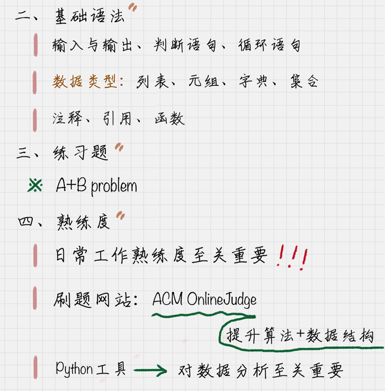

# 0103. Python 基础语法：开始你的 Python 之旅
> 陈旸 2018-12-20

上一节课我跟你分享了数据挖掘的最佳学习路径，相信你对接下来的学习已经心中有数了。今天我们继续预习课，我会用三篇文章，分别对 Python 的基础语法、NumPy 和 Pandas 进行讲解，带你快速入门 Python 语言。如果你已经有 Python 基础了，那先恭喜你已经掌握了这门简洁而高效的语言，这几节课你可以跳过，或者也可以当作复习，自己查漏补缺，你还可以在留言区分享自己的 Python 学习和使用心得。

好了，你现在心中是不是有个问题，要学好数据分析，一定要掌握 Python 吗？

我的答案是，想学好数据分析，你最好掌握 Python 语言。为什么这么说呢？

首先，在一份关于开发语言的调查中，使用过 Python 的开发者，80% 都会把 Python 作为自己的主要语言。Python 已经成为发展最快的主流编程语言，从众多开发语言中脱颖而出，深受开发者喜爱。其次，在数据分析领域中，使用 Python 的开发者是最多的，远超其他语言之和。最后，Python 语言简洁，有大量的第三方库，功能强大，能解决数据分析的大部分问题，这一点我下面具体来说。

Python 语言最大的优点是简洁，它虽然是 C 语言写的，但是摒弃了 C 语言的指针，这就让代码非常简洁明了。同样的一行 Python 代码，甚至相当于 5 行 Java 代码。我们读 Python 代码就像是读英文一样直观，这就能让程序员更好地专注在问题解决上，而不是在语言本身。

当然除了 Python 自身的特点，Python 还有强大的开发者工具。在数据科学领域，Python 有许多非常著名的工具库：比如科学计算工具 NumPy 和 Pandas 库，深度学习工具 Keras 和 TensorFlow，以及机器学习工具 Scikit-learn，使用率都非常高。

总之，如果你想在数据分析、机器学习等数据科学领域有所作为，那么掌握一项语言，尤其是 Python 语言的使用是非常有必要的，尤其是我们刚提到的这些工具，熟练掌握它们会让你事半功倍。

## 01. 安装及 IDE 环境

了解了为什么要学 Python，接下来就带你快速开始你的第一个 Python 程序，所以我们先来了解下如何安装和搭建 IDE 环境。

### 1. Python 的版本选择

Python 主要有两个版本： 2.7.x 和 3.x。两个版本之间存在一些差异，但并不大，它们语法不一样的地方不到 10%。

另一个事实就是：大部分 Python 库都同时支持 Python 2.7.x 和 3.x 版本。虽然官方称 Python2.7 只维护到 2020 年，但是我想告诉你的是：千万不要忽视 Python2.7，它的寿命远不止到 2020 年，而且这两年 Python2.7 还是占据着 Python 版本的统治地位。一份调查显示：在 2017 年的商业项目中 2.7 版本依然是主流，占到了 63.7%，即使这两年 Python3.x 版本使用的增速较快，但实际上 Python3.x 在 2008 年就已经有了。

那么你可能会问：这两个版本该如何选择呢？

版本选择的标准就是看你的项目是否会依赖于 Python2.7 的包，如果有依赖的就只能使用 Python2.7，否则你可以用 Python 3.x 开始全新的项目。

### 2. Python IDE 推荐

确定了版本问题后，怎么选择 Python IDE 呢？有众多优秀的选择，这里推荐几款。

#### 1.  PyCharm

这是一个跨平台的 Python 开发工具，可以帮助用户在使用 Python 时提升效率，比如：调试、语法高亮、代码跳转、自动完成、智能提示等。

#### 2.  Sublime Text

SublimeText 是个著名的编辑器，Sublime Text3 基本上可以 1 秒即启动，反应速度很快。同时它对 Python 的支持也很到位，具有代码高亮、语法提示、自动完成等功能。

#### 3.  Vim

Vim 是一个简洁、高效的工具，速度很快，可以做任何事，从来不崩溃。不过 Vim 相比于 Sublime Text 上手有一定难度，配置起来有些麻烦。

#### 4.  Eclipse+PyDev

习惯使用 Java 的人一定对 Eclipse 这个 IDE 不陌生，那么使用 Eclipse+PyDev 插件会是一个很好的选择，这样熟悉 Eclipse 的开发者可以轻易上手。

如果上面这些 IDE 你之前都没有怎么用过，那么推荐你使用 Sublime Text，上手简单，反应速度快。

## 02. Python 基础语法

环境配置好后，我们就来快速学习几个 Python 必会的基础语法。我假设你是 Python 零基础，但已经有一些其他编程语言的基础。下面我们一一来看。

### 1. 输入与输出

```
name = raw_input("What's your name?")
sum = 100+100
print ('hello,%s' %name)
print ('sum = %d' %sum)
```

raw_input 是 Python2.7 的输入函数，在 python3.x 里可以直接使用 input，赋值给变量 name，print 是输出函数，%name 代表变量的数值，因为是字符串类型，所以在前面用的 %s 作为代替。

这是运行结果：

### 2. 判断语句：if … else …

if … else … 是经典的判断语句，需要注意的是在 if expression 后面有个冒号，同样在 else 后面也存在冒号。

另外需要注意的是，Python 不像其他语言一样使用 {} 或者 begin…end 来分隔代码块，而是采用代码缩进和冒号的方式来区分代码之间的层次关系。所以代码缩进在 Python 中是一种语法，如果代码缩进不统一，比如有的是 tab 有的是空格，会怎样呢？会产生错误或者异常。相同层次的代码一定要采用相同层次的缩进。

### 3. 循环语句：for … in

for 循环是一种迭代循环机制，迭代即重复相同的逻辑操作。如果规定循环的次数，我们可以使用 range 函数，它在 for 循环中比较常用。range (11) 代表从 0 到 10，不包括 11，也相当于 range (0,11)，range 里面还可以增加步长，比如 range (1,11,2) 代表的是 [1,3,5,7,9]。

### 4. 循环语句: while

1 到 10 的求和也可以用 while 循环来写，这里 while 控制了循环的次数。while 循环是条件循环，在 while 循环中对于变量的计算方式更加灵活。因此 while 循环适合循环次数不确定的循环，而 for 循环的条件相对确定，适合固定次数的循环。

### 5. 数据类型：列表、元组、字典、集合

列表：[]

列表是 Python 中常用的数据结构，相当于数组，具有增删改查的功能，我们可以使用 len () 函数获得 lists 中元素的个数；使用 append () 在尾部添加元素，使用 insert () 在列表中插入元素，使用 pop () 删除尾部的元素。

元组 (tuple)

元组 tuple 和 list 非常类似，但是 tuple 一旦初始化就不能修改。因为不能修改所以没有 append (), insert () 这样的方法，可以像访问数组一样进行访问，比如 tuples [0]，但不能赋值。

字典 {dictionary}

字典其实就是 {key, value}，多次对同一个 key 放入 value，后面的值会把前面的值冲掉，同样字典也有增删改查。增加字典的元素相当于赋值，比如 score [‘zhaoyun’] = 98，删除一个元素使用 pop，查询使用 get，如果查询的值不存在，我们也可以给一个默认值，比如 score.get (‘yase’,99)。

集合：set

集合 set 和字典 dictory 类似，不过它只是 key 的集合，不存储 value。同样可以增删查，增加使用 add，删除使用 remove，查询看某个元素是否在这个集合里，使用 in。

### 6. 注释：#

注释在 python 中使用 #，如果注释中有中文，一般会在代码前添加 # -\*- coding: utf-8 -*。

如果是多行注释，使用三个单引号，或者三个双引号，比如：

### 7. 引用模块 / 包：import

Python 语言中 import 的使用很简单，直接使用 import module_name 语句导入即可。这里 import 的本质是什么呢？import 的本质是路径搜索。import 引用可以是模块 module，或者包 package。

针对 module，实际上是引用一个.py 文件。而针对 package，可以采用 from … import … 的方式，这里实际上是从一个目录中引用模块，这时目录结构中必须带有一个 \__init__.py 文件。

### 8. 函数：def

函数代码块以 def 关键词开头，后接函数标识符名称和圆括号，在圆括号里是传进来的参数，然后通过 return 进行函数结果得反馈。

上面的讲的这些基础语法，我们可以用 sumlime text 编辑器运行 Python 代码。另外，告诉你一个相当高效的方法，你可以充分利用一个刷题进阶的网址：[ZOJ](https://zoj.pintia.cn/home)，这是浙江大学 ACM 的 OnlineJudge。

什么是 OnlineJudge 呢？它实际上是一个在线答题系统，做题后你可以在后台提交代码，然后 OnlineJudge 会告诉你运行的结果，如果结果正确就反馈：Accepted，如果错误就反馈：Wrong Answer。

不要小看这样的题目，也会存在编译错误、内存溢出、运行超时等等情况。所以题目对编码的质量要求还是挺高的。下面我就给你讲讲这道 A+B 的题目，你可以自己做练习，然后在后台提交答案。

### 题目：A+B

输入格式：有一系列的整数对 A 和 B，以空格分开。

输出格式：对于每个整数对 A 和 B，需要给出 A 和 B 的和。

输入输出样例：

针对这道题，我给出了下面的答案：

当然每个人可以有不同的解法，官方也有 Python 的答案，这里给你介绍这个 OnlineJudge 是因为：

1. 可以在线得到反馈，提交代码后，系统会告诉你对错。而且你能看到每道题的正确率，和大家提交后反馈的状态；

2. 有社区论坛可以进行交流学习；

3. 对算法和数据结构的提升大有好处，当然对数据挖掘算法的灵活运用和整个编程基础的提升都会有很大的帮助。

## 总结



现在我们知道，Python 毫无疑问是数据分析中最主流的语言。今天我们学习了这么多 Python 的基础语法，你是不是体会到了它的简洁。如果你有其他编程语言基础，相信你会非常容易地转换成 Python 语法的。那到此，Python 我们也就算入门了。有没有什么方法可以在此基础上快速提升 Python 编程水平呢？给你分享下我的想法。

在日常工作中，我们解决的问题都不属于高难度的问题，大部分人做的都是开发工作而非科研项目。所以我们要提升的主要是熟练度，而通往熟练度的唯一路径就是练习、练习、再练习！

如果你是第一次使用 Python，不用担心，最好的方式就是直接做题。把我上面的例子都跑一遍，自己在做题中体会。

如果你想提升自己的编程基础，尤其是算法和数据结构相关的能力，因为这个在后面的开发中都会用到。那么 ACM Online Judge 是非常好的选择，勇敢地打开这扇大门，把它当作你进阶的好工具。

你可以从 Accepted 比率高的题目入手，你做对的题目数越多，你的排名也会越来越往前，这意味着你的编程能力，包括算法和数据结构的能力都有了提升。另外这种在社区中跟大家一起学习，还能排名，就像游戏一样，让学习更有趣味，从此不再孤独。

我在文章中多次强调练习的作用，这样可以增加你对数据分析相关内容的熟练度。所以我给你出了两道练习题，你可以思考下如何来做，欢迎把答案放到评论下面，我也会和你一起在评论区进行讨论。

如果我想在 Python 中引用 scikit-learn 库该如何引用？

求 1+3+5+7+…+99 的求和，用 Python 该如何写？

## 精选留言

### 01

作者回复: oj 的难度确实会略高一些，也可以从其他网站做起，比如你说的 leetcode，或者 pythontip。

2018-12-30

### 02

方法一：sum 函数

print(sum(range(1,100,2)))

方法二：if 迭代

方法三：while 循环

2018-12-20

### 03

sklearn 库是机器学习领域好用到哭的一个库，数据清洗，各种机器学习算法都给写好了，我们可以直接使用，学习 sklearn 感觉最好的方式就是通过官方文档学习：https://scikit-learn.org/stable/，但是在这之前最好先跟着教程过一遍 sklearn，至少知道什么问题应该用什么算法等，然后再通过查阅文档进行补充。使用的时候也很简单，pip install 安装，然后 import sklearn 或者 from sklearn import 模块等。关于学习 Python，我觉得可以找一个简单的教程（B 站上好多）跟一遍，掌握基础的语法和使用，然后就是刷题或者项目中提高代码编程能力，在这个途中遇到不懂得可以查阅 Python 的官方文档进行知识补充。我觉得官方文档是最好的学习方式。

2020-01-23