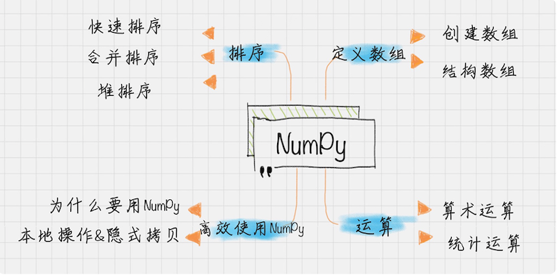

# 0104. Python 科学计算：用 NumPy 快速处理数据
> 陈旸 2018-12-21

上一节我讲了 Python 的基本语法，今天我来给你讲下 Python 中一个非常重要的第三方库 NumPy。

它不仅是 Python 中使用最多的第三方库，而且还是 SciPy、Pandas 等数据科学的基础库。它所提供的数据结构比 Python 自身的「更高级、更高效」，可以这么说，NumPy 所提供的数据结构是 Python 数据分析的基础。

我上次讲到了 Python 数组结构中的列表 list，它实际上相当于一个数组的结构。而 NumPy 中一个关键数据类型就是关于数组的，那为什么还存在这样一个第三方的数组结构呢？

实际上，标准的 Python 中，用列表 list 保存数组的数值。由于列表中的元素可以是任意的对象，所以列表中 list 保存的是对象的指针。虽然在 Python 编程中隐去了指针的概念，但是数组有指针，Python 的列表 list 其实就是数组。这样如果我要保存一个简单的数组 [0,1,2]，就需要有 3 个指针和 3 个整数的对象，这样对于 Python 来说是非常不经济的，浪费了内存和计算时间。

## 01. 使用 NumPy 让你的 Python 科学计算更高效

为什么要用 NumPy 数组结构而不是 Python 本身的列表 list？这是因为列表 list 的元素在系统内存中是分散存储的，而 NumPy 数组存储在一个均匀连续的内存块中。这样数组计算遍历所有的元素，不像列表 list 还需要对内存地址进行查找，从而节省了计算资源。

另外在内存访问模式中，缓存会直接把字节块从 RAM 加载到 CPU 寄存器中。因为数据连续的存储在内存中，NumPy 直接利用现代 CPU 的矢量化指令计算，加载寄存器中的多个连续浮点数。另外 NumPy 中的矩阵计算可以采用多线程的方式，充分利用多核 CPU 计算资源，大大提升了计算效率。

当然除了使用 NumPy 外，你还需要一些技巧来提升内存和提高计算资源的利用率。一个重要的规则就是：避免采用隐式拷贝，而是采用就地操作的方式。举个例子，如果我想让一个数值 x 是原来的两倍，可以直接写成 x\*=2，而不要写成 y=x*2。

这样速度能快到 2 倍甚至更多。

既然 NumPy 这么厉害，你该从哪儿入手学习呢？在 NumPy 里有两个重要的对象：ndarray（N-dimensional array object）解决了多维数组问题，而 ufunc（universal function object）则是解决对数组进行处理的函数。下面，我就带你一一来看。

## 02. ndarray 对象

ndarray 实际上是多维数组的含义。在 NumPy 数组中，维数称为秩（rank），一维数组的秩为 1，二维数组的秩为 2，以此类推。在 NumPy 中，每一个线性的数组称为一个轴（axes），其实秩就是描述轴的数量。下面，你来看 ndarray 对象是如何创建数组的，又是如何处理结构数组的呢？

### 1. 创建数组

```
import numpy as np
a = np.array([1, 2, 3])
b = np.array([[1, 2, 3], [4, 5, 6], [7, 8, 9]])
b[1,1]=10
print a.shape
print b.shape
print a.dtype
print b
```

创建数组前，你需要引用 NumPy 库，可以直接通过 array 函数创建数组，如果是多重数组，比如示例里的 b，那么该怎么做呢？你可以先把一个数组作为一个元素，然后嵌套起来，比如示例 b 中的 [1,2,3] 就是一个元素，然后 [4,5,6][7,8,9] 也是作为元素，然后把三个元素再放到 [] 数组里，赋值给变量 b。

当然数组也是有属性的，比如你可以通过函数 shape 属性获得数组的大小，通过 dtype 获得元素的属性。如果你想对数组里的数值进行修改的话，直接赋值即可，注意下标是从 0 开始计的，所以如果你想对 b 数组，九宫格里的中间元素进行修改的话，下标应该是 [1,1]。

### 2. 结构数组

如果你想统计一个班级里面学生的姓名、年龄，以及语文、英语、数学成绩该怎么办？当然你可以用数组的下标来代表不同的字段，比如下标为 0 的是姓名、下标为 1 的是年龄等，但是这样不显性。

实际上在 C 语言里，可以定义结构数组，也就是通过 struct 定义结构类型，结构中的字段占据连续的内存空间，每个结构体占用的内存大小都相同，那在 NumPy 中是怎样操作的呢？

```
import numpy as np
persontype = np.dtype({
    'names':['name', 'age', 'chinese', 'math', 'english'],
    'formats':['S32','i', 'i', 'i', 'f']})
peoples = np.array([("ZhangFei",32,75,100, 90),("GuanYu",24,85,96,88.5),
       ("ZhaoYun",28,85,92,96.5),("HuangZhong",29,65,85,100)],
    dtype=persontype)
ages = peoples[:]['age']
chineses = peoples[:]['chinese']
maths = peoples[:]['math']
englishs = peoples[:]['english']
print np.mean(ages)
print np.mean(chineses)
print np.mean(maths)
print np.mean(englishs)
```

你看下这个例子，首先在 NumPy 中是用 dtype 定义的结构类型，然后在定义数组的时候，用 array 中指定了结构数组的类型 dtype=persontype，这样你就可以自由地使用自定义的 persontype 了。比如想知道每个人的语文成绩，就可以用 chineses = peoples [:][‘chinese’]，当然 NumPy 中还有一些自带的数学运算，比如计算平均值使用 np.mean。

### 3. 连续数组的创建

NumPy 可以很方便地创建连续数组，比如我使用 arange 或 linspace 函数进行创建：

```
x1 = np.arange(1,11,2)
x2 = np.linspace(1,9,5)
```

np.arange 和 np.linspace 起到的作用是一样的，都是创建等差数组。这两个数组的结果 x1,x2 都是 [1 3 5 7 9]。结果相同，但是你能看出来创建的方式是不同的。

arange () 类似内置函数 range ()，通过指定初始值、终值、步长来创建等差数列的一维数组，默认是不包括终值的。

linspace 是 linear space 的缩写，代表线性等分向量的含义。linspace () 通过指定初始值、终值、元素个数来创建等差数列的一维数组，默认是包括终值的。

## 03. 运算

### 1. ufunc 运算

ufunc 是 universal function 的缩写，是不是听起来就感觉功能非常强大？确如其名，它能对数组中每个元素进行函数操作。NumPy 中很多 ufunc 函数计算速度非常快，因为都是采用 C 语言实现的。

### 2. 算数运算

通过 NumPy 可以自由地创建等差数组，同时也可以进行加、减、乘、除、求 n 次方和取余数。

```
x1 = np.arange(1,11,2)
x2 = np.linspace(1,9,5)
print np.add(x1, x2)
print np.subtract(x1, x2)
print np.multiply(x1, x2)
print np.divide(x1, x2)
print np.power(x1, x2)
print np.remainder(x1, x2)
```

我还以 x1, x2 数组为例，求这两个数组之间的加、减、乘、除、求 n 次方和取余数。在 n 次方中，x2 数组中的元素实际上是次方的次数，x1 数组的元素为基数。

在取余函数里，你既可以用 np.remainder (x1, x2)，也可以用 np.mod (x1, x2)，结果是一样的。

### 3. 统计函数

如果你想要对一堆数据有更清晰的认识，就需要对这些数据进行描述性的统计分析，比如了解这些数据中的最大值、最小值、平均值，是否符合正态分布，方差、标准差多少等等。它们可以让你更清楚地对这组数据有认知。

下面我来介绍下在 NumPy 中如何使用这些统计函数。

#### 01. 计数组 / 矩阵中的最大值函数 amax ()，最小值函数 amin ()

```
import numpy as np
a = np.array([[1,2,3], [4,5,6], [7,8,9]])
print np.amin(a)
print np.amin(a,0)
print np.amin(a,1)
print np.amax(a)
print np.amax(a,0)
print np.amax(a,1)
```

amin () 用于计算数组中的元素沿指定轴的最小值。对于一个二维数组 a，amin (a) 指的是数组中全部元素的最小值，amin (a,0) 是延着 axis=0 轴的最小值，axis=0 轴是把元素看成了 [1,4,7], [2,5,8], [3,6,9] 三个元素，所以最小值为 [1,2,3]，amin (a,1) 是延着 axis=1 轴的最小值，axis=1 轴是把元素看成了 [1,2,3], [4,5,6], [7,8,9] 三个元素，所以最小值为 [1,4,7]。同理 amax () 是计算数组中元素沿指定轴的最大值。

#### 02. 统计最大值与最小值之差 ptp ()

对于相同的数组 a，np.ptp (a) 可以统计数组中最大值与最小值的差，即 9-1=8。同样 ptp (a,0) 统计的是沿着 axis=0 轴的最大值与最小值之差，即 7-1=6（当然 8-2=6,9-3=6，第三行减去第一行的 ptp 差均为 6），ptp (a,1) 统计的是沿着 axis=1 轴的最大值与最小值之差，即 3-1=2（当然 6-4=2, 9-7=2，即第三列与第一列的 ptp 差均为 2）。

```
a = np.array([[1,2,3], [4,5,6], [7,8,9]])
print np.ptp(a)
print np.ptp(a,0)
print np.ptp(a,1)
```

#### 03. 统计数组的百分位数 percentile()

```
a = np.array([[1,2,3], [4,5,6], [7,8,9]])
print np.percentile(a, 50)
print np.percentile(a, 50, axis=0)
print np.percentile(a, 50, axis=1)
```

同样，percentile () 代表着第 p 个百分位数，这里 p 的取值范围是 0-100，如果 p=0，那么就是求最小值，如果 p=50 就是求平均值，如果 p=100 就是求最大值。同样你也可以求得在 axis=0 和 axis=1 两个轴上的 p% 的百分位数。

#### 04. 统计数组中的中位数 median ()、平均数 mean ()

```
a = np.array([[1,2,3], [4,5,6], [7,8,9]])
#求中位数
print np.median(a)
print np.median(a, axis=0)
print np.median(a, axis=1)
#求平均数
print np.mean(a)
print np.mean(a, axis=0)
print np.mean(a, axis=1)
```

你可以用 median () 和 mean () 求数组的中位数、平均值，同样也可以求得在 axis=0 和 1 两个轴上的中位数、平均值。你可以自己练习下看看运行结果。

#### 05. 统计数组中的加权平均值 average ()

```
a = np.array([1,2,3,4])
wts = np.array([1,2,3,4])
print np.average(a)
print np.average(a,weights=wts)
```

average () 函数可以求加权平均，加权平均的意思就是每个元素可以设置个权重，默认情况下每个元素的权重是相同的，所以 np.average (a)=(1+2+3+4)/4=2.5，你也可以指定权重数组 wts=[1,2,3,4]，这样加权平均 np.average (a,weights=wts)=(1\*1+2\*2+3\*3+4*4)/(1+2+3+4)=3.0。

#### 06. 统计数组中的标准差 std ()、方差 var ()

```
a = np.array([1,2,3,4])
print np.std(a)
print np.var(a)
```

方差的计算是指每个数值与平均值之差的平方求和的平均值，即 mean ((x - x.mean ())** 2)。标准差是方差的算术平方根。在数学意义上，代表的是一组数据离平均值的分散程度。所以 np.var (a)=1.25, np.std (a)=1.118033988749895。

## 04. NumPy 排序

排序是算法中使用频率最高的一种，也是在数据分析工作中常用的方法，计算机专业的同学会在大学期间的算法课中学习。

```
a = np.array([[4,3,2],[2,4,1]])
print np.sort(a)
print np.sort(a, axis=None)
print np.sort(a, axis=0)  
print np.sort(a, axis=1)  
```

那么这些排序算法在 NumPy 中实现起来其实非常简单，一条语句就可以搞定。这里你可以使用 sort 函数，sort (a, axis=-1, kind=‘quicksort’, order=None)，默认情况下使用的是快速排序；在 kind 里，可以指定 quicksort、mergesort、heapsort 分别表示快速排序、合并排序、堆排序。同样 axis 默认是 -1，即沿着数组的最后一个轴进行排序，也可以取不同的 axis 轴，或者 axis=None 代表采用扁平化的方式作为一个向量进行排序。另外 order 字段，对于结构化的数组可以指定按照某个字段进行排序。

## 总结



在 NumPy 学习中，你重点要掌握的就是对数组的使用，因为这是 NumPy 和标准 Python 最大的区别。在 NumPy 中重新对数组进行了定义，同时提供了算术和统计运算，你也可以使用 NumPy 自带的排序功能，一句话就搞定各种排序算法。

当然要理解 NumPy 提供的数据结构为什么比 Python 自身的「更高级、更高效」，要从对数据指针的引用角度进行理解。

我今天重点讲了 NumPy 的数据结构，你能用自己的话说明一下为什么要用 NumPy 而不是 Python 的列表 list 吗？除此之外，你还知道那些数据结构类型？

练习题：统计全班的成绩

假设一个团队里有 5 名学员，成绩如下表所示。你可以用 NumPy 统计下这些人在语文、英语、数学中的平均成绩、最小成绩、最大成绩、方差、标准差。然后把这些人的总成绩排序，得出名次进行成绩输出。


