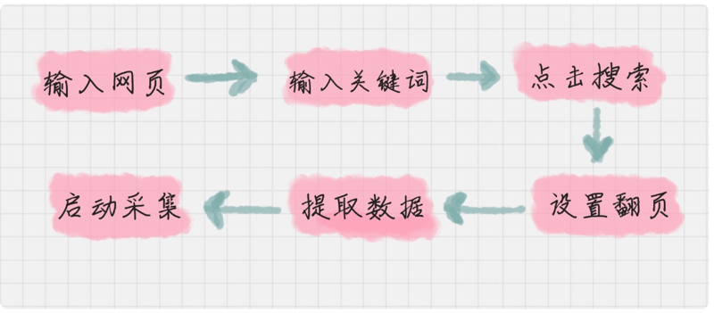
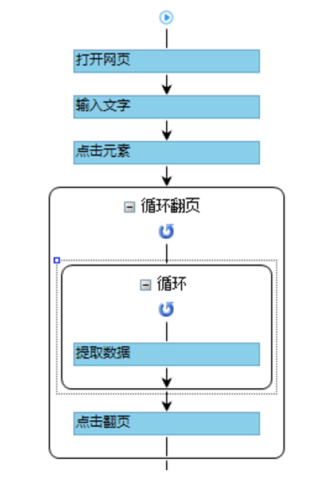
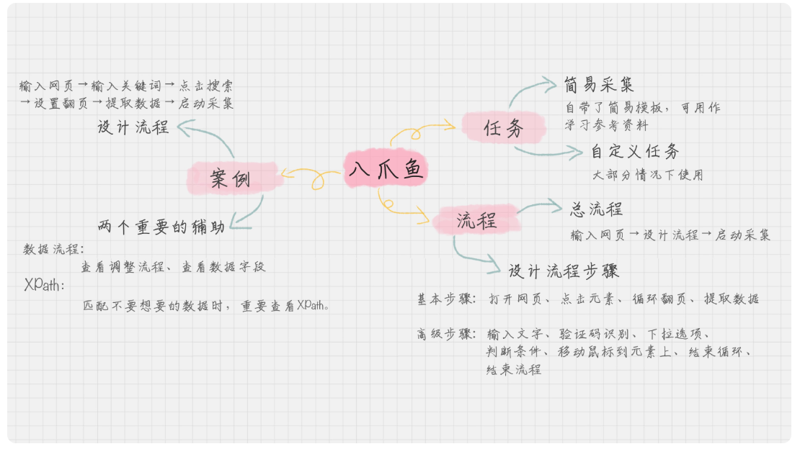

# 0109. 数据采集：如何用八爪鱼采集微博上的「D&G」评论
> 陈旸 2019-01-02

上一讲我给你讲了数据采集的来源，其中有一个很关键的工具叫做八爪鱼，今天我们就用八爪鱼实战模拟一下如何进行数据采集。

在文末你可以看到我操作的流程视频。

## 01. 八爪鱼的基本操作

在开始操作前，我先来介绍下今天要讲的主角「八爪鱼」工具。相比使用 Python 进行爬虫，八爪鱼的使用更加简便，因为是所见即所得的方式，基本上不需要编写代码，除了在正则表达式匹配的时候会用到 XPath。

这里简单介绍下 XPath，XPath 的英文是 XML Path Language，也就是 XML 的路径语言，用来在 XML 文件中寻找我们想要的元素。所以八爪鱼可以使用 XPath 帮我们更灵活地定位我们想要找的元素。

### 自定义任务 VS 简易采集

如果你想要采集数据就需要新建一个任务，在建任务的时候，八爪鱼会给你一个提示，是使用八爪鱼自带的「简易采集」，还是自定义一个任务。

简易采集集成了一些热门的模板，也就是我们经常访问的一些网站。它可以帮助我们轻松地实现采集，只需要我们告诉工具两个信息即可，一个是需要采集的网址，另一个是登录网站的账号和密码。

虽然简易采集比较方便快捷，但通常还是推荐使用自定义任务的方式，这样可以更灵活地帮我们提取想要的信息，比如你只想采集关于「D&G」的微博评论。

## 02. 流程步骤

八爪鱼的采集共分三步：

1、输入网页：每个采集需要输入你想要采集的网页。在新建任务的时候，这里是必填项。

2、设计流程：这个步骤最为关键，你需要告诉八爪鱼，你是如何操作页面的、想要提取页面上的哪些信息等。因为数据条数比较多，通常你还需要翻页，所以要进行循环翻页的设置。在设计流程中，你可以使用简易采集方式，也就是八爪鱼自带的模板，也可以采用自定义的方式。

3、启动采集：当你设计好采集流程后，就可以启动采集任务了，任务结束后，八爪鱼会提示你保存采集好的数据，通常是 xlsx 或 csv 格式。

如果你使用的是自定义采集，就需要自己来设计采集流程，也就是采集流程中的第二步。八爪鱼的流程步骤有两类，可以划分为基本步骤和高级步骤。

基本步骤就是最常用的步骤，每次采集都会用到，一共分为 4 步，分别是打开网页、点击元素、循环翻页、提取数据。

高级步骤是辅助步骤，可以帮我们更好地对数据进行提取，比如我们想要某个关键词的数据，就需要在网页输入框中输入对应的文字。有时候源网页的系统会提示需要输入验证码，我们就可以采用验证码识别的模块帮我们解决。有时候我们需要用下拉选项帮我们筛选想要的数据，或者某些判断条件下（比如存在某个关键词）才触发的采集等。这些操作可以更精细化地提取想要的数据。

下面我来介绍下基本步骤：

1.  打开网页。所有的采集默认第一项都是打开网页。所以在新建任务之后，系统会提示你输入网址。当你输入之后，八爪鱼就会自动建立一个「打开网页」的流程。

2. 点击元素。这里元素的定义比较广泛，它可以是某个按钮，或者某个链接，也或者是某个图片或文字。使用这个步骤是你在搜索或者提交某个请求。当你点击元素后，八爪鱼会提示你想要达到的目的：点击该按钮、采集该元素文本、还是鼠标移到该链接上。然后再选择「点击该按钮」进行确认即可。如果我们点击某个元素的目的是循环翻页，或者提取数据，那么在点击之后，八爪鱼会确认你的目的，你只要点击相关的按钮即可。

3. 循环翻页。很多数据都存在翻页的情况，通常你需要找到翻页的位置，比如网页底部的「下一页」按钮，点击它，会提示你「循环点击下一页」、「采集该链接文本」还是「点击该链接」。你需要确认这里是进行的「循环点击下一页」。

4. 提取数据。在网页上选择你想要提取的页面范围，鼠标移动到页面上会呈现蓝色的阴影面积，它表明了你想提取的数据范围。然后点击鼠标后，在右侧选择「采集数据」即可。

这 4 个基本操作就像它们的名称一样简单直接，这里我给你一些使用的建议：

1. 尽量使用用户操作视角进行模拟的方式进行操作，而不是在「流程视图」中手动创建相应的步骤。因为八爪鱼最大的特点就是所见即所得，所以一切就按照用户使用的流程进行操作即可。

2. 使用「流程视图」方便管理和调整。右侧有「流程视图」的按钮，点击之后进入到流程视图，会把你之前的操作以流程图的方式展示出来。我会在文章下面详细介绍一下。

为什么要这么做呢？这样的话每个步骤流程清晰可见，而且你还可以调整每个步骤的参数，比如你之前的网址写错了想要修改，或者之前输入的文字需要调整等。

另外很多时候需要账号登录后才能采集数据，我们可以提前在八爪鱼工具里登录，这样再进行抓取的时候就是登录的状态，直接进行采集就可以了。

## 03. 采集微博上的「Dolce&Gabbana」评论

在了解基本步骤之后，我们就可以自己动手采集内容了。比如说我想要采集微博上关于「D&G」的评论，那么我可以先在浏览器上，人工操作下整个流程，梳理出来以下的步骤。

这几个流程具体是怎么做的呢？我来给你一一梳理一下。

1.  输入网页。对应基本步骤「打开网页」，我们输入微博搜索的地址：[微博搜索](https://s.weibo.com/)。

2.  输入关键词。对应「输入文本」，我把鼠标移动到输入框中，点击后会在右侧进行操作目的的确认，选择「输入文本」即可，然后输入我们想要搜索的内容「D&G」。

3.  点击搜索。对应「点击元素」，我们点击「搜索按钮」，然后确认操作目的是「点击元素」。

4.  设置翻页。因为我们想要采集全量数据，因此需要先设置翻页。这里特别注意下，翻页的操作要在数据提取之前，因为翻页是个循环的命令，就像我们平时写 for 语句一样，一定是先设置 for 循环，然后在循环中进行数据提取。

5.  提取数据。提取数据的时候，我们需要提取多个字段，比如，用户、微博内容、发表时间、该微博网址。而且一个页面上会有多个微博，都需要进行采集。所以你需要先选择单条内容的最大的目标区域，在确认目的时，会发现里面有子元素，这里目的选择为「选中子元素」。因为我们要对子元素内容进行采集，方便把内容按照字段进行划分。这时会提示页面中还有 20 个相同元素时，选择「选中全部」即可。

6.  启动采集。都选择好之后，系统会给出三个提示，分别是「启动本地采集」、「启动云采集」和「设置定时采集」。数据量不大的时候，我们选择「启动本地采集」即可。你可以看出，这整个过程比较简便，但中间有一些细节你可能会出错，比如说你忘记了先翻页，再选取你想提取的元素。这样如果遇到了问题，有两个重要的工具一定要用好：流程视图和 XPath。

### 1. 流程视图

流程视图我在上面提到过，这里详细介绍一下。流程视图应该是在可视化中应用最多的场景，我们可以使用流程视图查看创建流程，调整顺序，或者删掉不想要的步骤。另外我们还能在视图中查看数据提取的字段。选中「提取数据」步骤，可以看到该步骤提取的字段都有哪些。一般都会出现很多冗余的字段，因为 HTML 代码段中有很多隐藏的内容也会被提取到，这里你可以删掉没用的字段，把保留的字段名称进行备注修改。

这里有张图，是我通过八爪鱼可视化操作采集微博评论时，自动生成的流程视图。

### 2. XPath

介绍完流程视图之后，我们再来说一下 XPath。在八爪鱼工具中内置了 XPath 引擎，所以在我们用可视化方式选择元素的时候，会自动生成相应的 XPath 路径。当然我们也可以查看这些元素的 XPath，方便对它们进行精细地控制。

为什么有了可视化操作，还需要自己来定义 XPath 呢？

这是因为有时候我们采集的网站页面是不规律的，比如你可以看到微博搜索结果页中，第一页和第二页的 HTML 排版是不同的，这样的话，可视化操作得到的 XPath 可能不具备通用性。这种情况下，如果你用搜索结果第一页提取数据得到的 XPath，就无法匹配搜索结果页第二页的数据。

在八爪鱼工具中，很多控件都有 XPath，最常用的还是循环和提取数据中的 XPath，下面我来一一简单介绍下。

### 3. 循环中的 XPath

在微博采集这个例子中，我们用到了两种循环方式，一种是「循环翻页」，一种是「循环列表」。

在「循环翻页」中，你可以在「流程视图」中点击「循环翻页」的控件，看到右侧的「高级选项」中的 XPath。在微博采集这个例子中，循环翻页的 XPath 是 //A [@class=‘next’]。

在「循环列表」中，我在提取数据的时候，出现了页面提示「还有 20 个相同元素」，这时我选择「选中全部」。相当于出现了 20 个元素的循环列表。所以你在流程视图中，可以会看到提取数据外层嵌套了个循环列表。同样我们可以看到循环列表的 XPath 是 //DIV [@class=‘card-feed’]。

### 4. 提取数据的 XPath

当我们点击流程中的「提取数据」，可以看到有很多字段名称，XPath 实际上定位到了这些要采集的字段。所以你需要选中一个字段，才能看到它的 XPath。

现在你知道了，八爪鱼的匹配是基于 XPath 的，那么你也可以自己来调整 XPath 参数。这样当匹配不到想要的数据的时候，可以检查下是不是 XPath 参数设置的问题，可以手动调整，从而抓取到正确的元素。

## 总结

今天我给你讲了八爪鱼的使用，然后带你实现了一个微博采集的例子。你可能会想问，我为什么要讲一个八爪鱼这样的第三方工具呢？

这里讲下我的一些心得体会。

我们的工作流程通常很长，所以更应该专注工作的核心，比如说数据分析这块，所有的辅助都可以采用第三方工具来做。如果老板让你统计微博上的评论，实际上老板最想知道的不是采集的过程，而是整体的概况，比如说影响了多少人，评论如何，是否有 KOL 关注等等。

如果你之前没有数据采集的经验，那么第三方工具，以及采用可视化的方式来进行采集应该是你的首选。可视化的方式可以让你迅速上手，了解到整个数据采集的过程。

我们应该从基础步骤开始，遇到特定需求的时候再学习了解高级步骤。这篇文章只介绍了基本的流程，但你可以上手操作了。在实际操作中，你可能会遇到各种问题，这个时候再对高级步骤进行学习，如果要进阶的话，还需要你掌握 XPath 的使用。

好了，我来总结一下今天的内容。今天我讲了八爪鱼的任务建立、流程设计，还有一个实操的案例。具体的内容概要可以看我整理的下面这张图。

虽然八爪鱼工具提供了各种简易采集的方式，我更建议你把它作为参考模板，可以看下别人是如何建立的，这样多做案例，你上手会更快。

下面是我操作八爪鱼的流程，你可以看一下这个视频，更直观一些。最后给你留个练习题吧。如何通过八爪鱼抓取豆瓣网站中关于《海王》的电影评论呢？你不妨上手练习一下，这样会有更深的体会。

## 精选留言

### 01

老师能不能推荐一两个 Mac 上能用的爬虫工具呢？只有集搜客有 Mac 版但是是付费的。

推荐一款 mac 上 和八爪鱼类似的采集器 —— 后羿采集器，下载地址：http://www.houyicaiji.com，智能采集模式和八爪鱼的新建任务采集一样的操作流程，还提供了另外一种流程图采集模式，自己设计流程图采集。与八爪鱼类似的是自带了防屏蔽功能，不同的是在采集过程中可以直接设置去除重复数据。这节课的所有练习都是在这款软件上完成的。

用后裔采集器采集到海王短评 220 条，看介绍说的是 549089 条，但是我只抓到了 220 条，开始以为是后页的循环操作设置的不对，然后设置 XPath 来识别下一页，但数据跑了三遍仍旧是 220 条，最后无奈自己去网站上点击了一下，发现确实最后还没加载完全就没有后一页了，看来豆瓣也没有把全部数据放出来。

2019-01-13

### 02

随着知识付费越来越普及，优质的数据源越来越难通过简单爬取的方式获得，现在屯着数据，将来会不会很值钱？

作者回复：需求永远是第一位的。如果你了解市场的需求，在低价的时候进入数据，在高位的时候卖出，是可以获利的。关键还是对市场需求的把握。我有个朋友是做教育行业的，就通过低买高卖的方式挣了第一桶金。

2019-01-02

### 03

爬着爬着，好像 ip 被封了。

作者回复：可以一次少爬一些，或者切换 IP。

2019-01-11

### 04

Mac 没有比较好用的爬虫工具，用 Scrapy 写了一个：[chochinlu/spiders: Spider exercises.](https://github.com/chochinlu/spiders)。

2019-01-11

### 05

刚开始尝试用八爪鱼去在当前页列表勾选 ajax 去爬那个「展开」，发现不好使。后来想，不用专门去采集当前页面的展开，而且直接点进去标题，然后从新页面去爬正文的全文，这样就好了。梳理起来就是两个循环：外层循环负责翻页，内层循环负责点击当页列表的每一个标题，使其进入正文页面，顺势提取数据。

作者回复：对的，点击标题进去再爬取全文 是一种不错的方式。

2019-01-04

