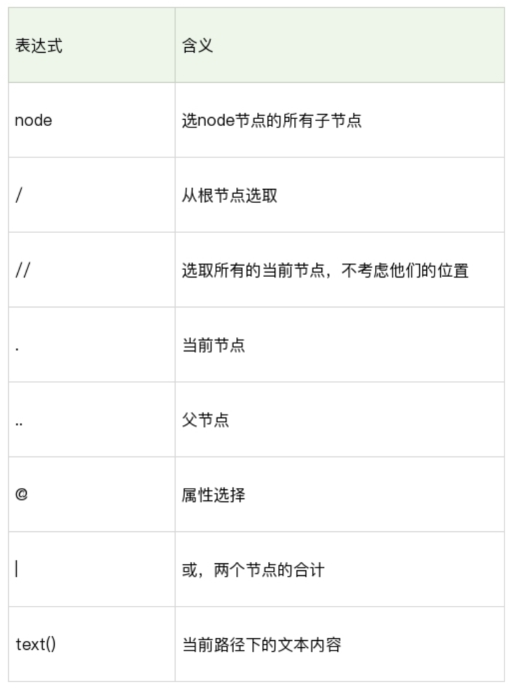
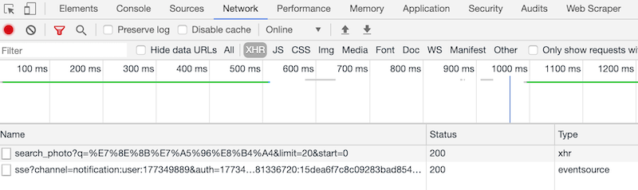
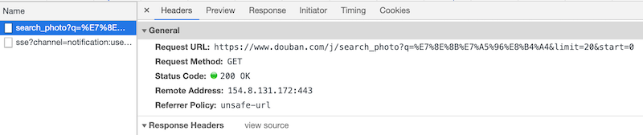
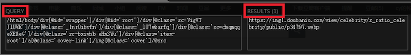
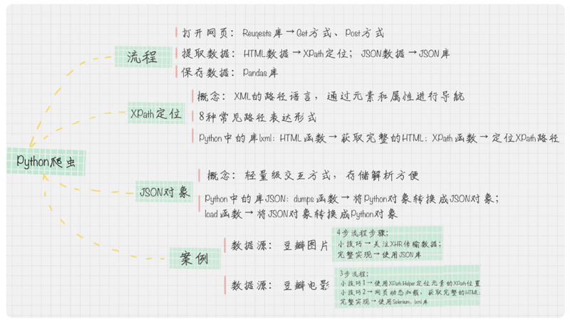

# 0110. Python 爬虫：如何自动化下载王祖贤海报？
> 陈旸 2019-01-04

上一讲中我给你讲了如何使用八爪鱼采集数据，对于数据采集刚刚入门的人来说，像八爪鱼这种可视化的采集是一种非常好的方式。它最大的优点就是上手速度快，当然也存在一些问题，比如运行速度慢、可控性差等。相比之下，爬虫可以很好地避免这些问题，今天我来分享下如何通过编写爬虫抓取数据。

## 01. 爬虫的流程

相信你对「爬虫」这个词已经非常熟悉了，爬虫实际上是用浏览器访问的方式模拟了访问网站的过程，整个过程包括三个阶段：打开网页、提取数据和保存数据。

在 Python 中，这三个阶段都有对应的工具可以使用。

在「打开网页」这一步骤中，可以使用 Requests 访问页面，得到服务器返回给我们的数据，这里包括 HTML 页面以及 JSON 数据。

在「提取数据」这一步骤中，主要用到了两个工具。针对 HTML 页面，可以使用 XPath 进行元素定位，提取数据；针对 JSON 数据，可以使用 JSON 进行解析。

在最后一步「保存数据」中，我们可以使用 Pandas 保存数据，最后导出 CSV 文件。

下面我来分别介绍下这些工具的使用。

### 1. Requests 访问页面

Requests 是 Python HTTP 的客户端库，编写爬虫的时候都会用到，编写起来也很简单。它有两种访问方式：Get 和 Post。这两者最直观的区别就是：Get 把参数包含在 url 中，而 Post 通过 request body 来传递参数。

假设我们想访问豆瓣，那么用 Get 访问的话，代码可以写成下面这样的：

    r = requests.get('http://www.douban.com')

代码里的「r」就是 Get 请求后的访问结果，然后我们可以使用 r.text 或 r.content 来获取 HTML 的正文。

如果我们想要使用 Post 进行表单传递，代码就可以这样写：

    r = requests.post('http://xxx.com', data = {'key':'value'})

这里 data 就是传递的表单参数，data 的数据类型是个字典的结构，采用 key 和 value 的方式进行存储。

### 2. XPath 定位

XPath 是 XML 的路径语言，实际上是通过元素和属性进行导航，帮我们定位位置。它有几种常用的路径表达方式。



我来给你简单举一些例子：

xpath (‘node’) 选取了 node 节点的所有子节点；

xpath (’/div’) 从根节点上选取 div 节点；

xpath (’//div’) 选取所有的 div 节点；

xpath (’./div’) 选取当前节点下的 div 节点；

xpath (’…’) 回到上一个节点；

xpath (’//@id’) 选取所有的 id 属性；

xpath (’//book [@id]’) 选取所有拥有名为 id 的属性的 book 元素；

xpath (’//book [@id=「abc」]’) 选取所有 book 元素，且这些 book 元素拥有 id= "abc" 的属性；

xpath (’//book/title | //book/price’) 选取 book 元素的所有 title 和 price 元素。

上面我只是列举了 XPath 的部分应用，XPath 的选择功能非常强大，它可以提供超过 100 个内建函数，来做匹配。我们想要定位的节点，几乎都可以使用 XPath 来选择。

使用 XPath 定位，你会用到 Python 的一个解析库 lxml。这个库的解析效率非常高，使用起来也很简便，只需要调用 HTML 解析命令即可，然后再对 HTML 进行 XPath 函数的调用。

比如我们想要定位到 HTML 中的所有列表项目，可以采用下面这段代码。

```
from lxml import etree
html = etree.HTML(html)
result = html.xpath('//li')
```

### 3. JSON 对象

JSON 是一种轻量级的交互方式，在 Python 中有 JSON 库，可以让我们将 Python 对象和 JSON 对象进行转换。为什么要转换呢？原因也很简单。将 JSON 对象转换成为 Python 对象，我们对数据进行解析就更方便了。


这是一段将 JSON 格式转换成 Python 对象的代码，你可以自己运行下这个程序的结果。

```
import json
jsonData = '{"a":1,"b":2,"c":3,"d":4,"e":5}';
input = json.loads(jsonData)
print input
```

接下来，我们就要进行实战了，我会从两个角度给你讲解如何使用 Python 爬取海报，一个是通过 JSON 数据爬取，一个是通过 XPath 定位爬取。

## 02. 如何使用 JSON 数据自动下载王祖贤的海报

我在上面讲了 Python 爬虫的基本原理和实现的工具，下面我们来实战一下。如果想要从豆瓣图片中下载王祖贤的海报，你应该先把我们日常的操作步骤整理下来：

1. 打开网页；

2. 输入关键词「王祖贤」；

3. 在搜索结果页中选择「图片」；

4. 下载图片页中的所有海报。

这里你需要注意的是，如果爬取的页面是动态页面，就需要关注 XHR 数据。因为动态页面的原理就是通过原生的 XHR 数据对象发出 HTTP 请求，得到服务器返回的数据后，再进行处理。XHR 会用于在后台与服务器交换数据。

你需要使用浏览器的插件查看 XHR 数据，比如在 Chrome 浏览器中使用开发者工具。

在豆瓣搜索中，我们对「王祖贤」进行了模拟，发现 XHR 数据中有一个请求是这样的：

    https://www.douban.com/j/search_photo?q=%E7%8E%8B%E7%A5%96%E8%B4%A4&limit=20&start=0

[https://www.douban.com/j/search_photo?q=王祖贤&limit=20&start=0](https://www.douban.com/j/search_photo?q=%E7%8E%8B%E7%A5%96%E8%B4%A4&limit=20&start=0)

1『

这里正常打开的 URL 是「https://www.douban.com/search?cat=1025&q=%E7%8E%8B%E7%A5%96%E8%B4%A4」，需要进 Chrome 的开发者工具（快捷键 option+command+I），在 Network 里，在过滤器 Filter 里选 XHR，刷新网页。Name 里会出现结果，点第一个进去，可以看到 XHR 数据对象发出 HTTP 请求时的 URL。





』

url 中的乱码正是中文的 url 编码，打开后，我们看到了很清爽的 JSON 格式对象，展示的形式是这样的：

```
{"images":
       [{"src": …, "author": …, "url":…, "id": …, "title": …, "width":…, "height":…},
    …
   {"src": …, "author": …, "url":…, "id": …, "title": …, "width":…, "height":…}],
 "total":22471,"limit":20,"more":true}
```
 
从这个 JSON 对象中，我们能看到，王祖贤的图片一共有 22471 张，其中一次只返回了 20 张，还有更多的数据可以请求。数据被放到了 images 对象里，它是个数组的结构，每个数组的元素是个字典的类型，分别告诉了 src、author、url、id、title、width 和 height 字段，这些字段代表的含义分别是原图片的地址、作者、发布地址、图片 ID、标题、图片宽度、图片高度等信息。

有了这个 JSON 信息，你很容易就可以把图片下载下来。当然你还需要寻找 XHR 请求的 url 规律。

如何查看呢，我们再来重新看下这个网址本身。

[https://www.douban.com/j/search_photo?q=王祖贤&limit=20&start=0](https://www.douban.com/j/search_photo?q=%E7%8E%8B%E7%A5%96%E8%B4%A4&limit=20&start=0)

你会发现，网址中有三个参数：q、limit 和 start。start 实际上是请求的起始 ID，这里我们注意到它对图片的顺序标识是从 0 开始计算的。所以如果你想要从第 21 个图片进行下载，你可以将 start 设置为 20。

王祖贤的图片一共有 22471 张，你可以写个 for 循环来跑完所有的请求，具体的代码如下：

```
# coding:utf-8
import requests
import json
query = '王祖贤'
''' 下载图片 '''
def download(src, id):
  dir = './' + str(id) + '.jpg'
  try:
    pic = requests.get(src, timeout=10)
    fp = open(dir, 'wb')
    fp.write(pic.content)
    fp.close()
  except requests.exceptions.ConnectionError:
    print('图片无法下载')
            
''' for 循环 请求全部的 url '''
for i in range(0, 22471, 20):
  url = 'https://www.douban.com/j/search_photo?q='+query+'&limit=20&start='+str(i)
  html = requests.get(url).text    # 得到返回结果
  response = json.loads(html,encoding='utf-8') # 将 JSON 格式转换成 Python 对象
  for image in response['images']:
    print(image['src']) # 查看当前下载的图片网址
    download(image['src'], image['id']) # 下载一张图片
```

## 03. 如何使用 XPath 自动下载王祖贤的电影海报封面

如果你遇到 JSON 的数据格式，那么恭喜你，数据结构很清爽，通过 Python 的 JSON 库就可以解析。

但有时候，网页会用 JS 请求数据，那么只有 JS 都加载完之后，我们才能获取完整的 HTML 文件。XPath 可以不受加载的限制，帮我们定位想要的元素。

比如，我们想要从豆瓣电影上下载王祖贤的电影封面，需要先梳理下人工的操作流程：

1. 打开网页[豆瓣电影](https://movie.douban.com/)；

2. 输入关键词「王祖贤」；

3. 下载图片页中的所有电影封面。

这里你需要用 XPath 定位图片的网址，以及电影的名称。

一个快速定位 XPath 的方法就是采用浏览器的 XPath Helper 插件，使用 Ctrl+Shift+X 快捷键的时候，用鼠标选中你想要定位的元素，就会得到类似下面的结果。



XPath Helper 插件中有两个参数，一个是 Query，另一个是 Results。Query 其实就是让你来输入 XPath 语法，然后在 Results 里看到匹配的元素的结果。

我们看到，这里选中的是一个元素，我们要匹配上所有的电影海报，就需要缩减 XPath 表达式。你可以在 Query 中进行 XPath 表达式的缩减，尝试去掉 XPath 表达式中的一些内容，在 Results 中会自动出现匹配的结果。

经过缩减之后，你可以得到电影海报的 XPath（假设为变量 src_xpath）：

    //div[@class='item-root']/a[@class='cover-link']/img[@class='cover']/@src

以及电影名称的 XPath（假设为变量 title_xpath）：

    //div[@class='item-root']/div[@class='detail']/div[@class='title']/a[@class='title-text']

但有时候当我们直接用 Requests 获取 HTML 的时候，发现想要的 XPath 并不存在。这是因为 HTML 还没有加载完，因此你需要一个工具，来进行网页加载的模拟，直到完成加载后再给你完整的 HTML。

在 Python 中，这个工具就是 Selenium 库，使用方法如下：

```
from selenium import webdriver
driver = webdriver.Chrome()
driver.get(request_url)
```

Selenium 是 Web 应用的测试工具，可以直接运行在浏览器中，它的原理是模拟用户在进行操作，支持当前多种主流的浏览器。

这里我们模拟 Chrome 浏览器的页面访问。

你需要先引用 Selenium 中的 WebDriver 库。WebDriver 实际上就是 Selenium 2，是一种用于 Web 应用程序的自动测试工具，提供了一套友好的 API，方便我们进行操作。

然后通过 WebDriver 创建一个 Chrome 浏览器的 drive，再通过 drive 获取访问页面的完整 HTML。

当你获取到完整的 HTML 时，就可以对 HTML 中的 XPath 进行提取，在这里我们需要找到图片地址 srcs 和电影名称 titles。这里通过 XPath 语法匹配到了多个元素，因为是多个元素，所以我们需要用 for 循环来对每个元素进行提取。

```
srcs = html.xpath(src_xpath)
titles = html.xpath(title_path)
for src, title in zip(srcs, titles):
  download(src, title.text)
```  

然后使用上面我编写好的 download 函数进行图片下载。

## 总结



好了，这样就大功告成了，程序可以源源不断地采集你想要的内容。这节课，我想让你掌握的是：

1. Python 爬虫的流程；

2. 了解 XPath 定位，JSON 对象解析；

3. 如何使用 lxml 库，进行 XPath 的提取；

4. 如何在 Python 中使用 Selenium 库来帮助你模拟浏览器，获取完整的 HTML。

其中，Python + Selenium + 第三方浏览器可以让我们处理多种复杂场景，包括网页动态加载、JS 响应、Post 表单等。因为 Selenium 模拟的就是一个真实的用户的操作行为，就不用担心 cookie 追踪和隐藏字段的干扰了。

当然，Python 还给我们提供了数据处理工具，比如 lxml 库和 JSON 库，这样就可以提取想要的内容了。

最后，你不妨来实践一下，你最喜欢哪个明星？如果想要自动下载这个明星的图片，该如何操作呢？

## 精选留言

### 01

老师请问一下：如果是需要用户登陆后才能爬取的数据该怎么用 python 来实现呢？

作者回复：你可以使用 python+selenium 的方式完成账户的自动登录，因为 selenium 是个自动化测试的框架，使用 selenium 的 webdriver 就可以模拟浏览器的行为。找到输入用户名密码的地方，输入相应的值，然后模拟点击即可完成登录（没有验证码的情况下）。另外你也可以使用 cookie 来登录网站，方法是你登录网站时，先保存网站的 cookie，然后用下次访问的时候，加载之前保存的 cookie，放到 request headers 中，这样就不需要再登录网站了。

2019-01-04

### 02

说明两点问题：

1、留言里有人评论说用 XPath 下载的图片打不开，其原因是定义的下载函数保存路径后缀名为 '.jpg'，但是用 XPath 下载获得的图片 url 为 'https://img3.doubanio.com/view/celebrity/s_ratio_celebrity/public/p616.webp'，本身图片为 webp 格式，所以若保存为 jpg 格式，肯定是打不开的。

2、老师在文章内讲的用 XPath 下载代码只能下载第一页的内容，并不是全部的数据，不知道大家有没有查看用 xpath 函数获得的数组，大家留言里的代码似乎和老师的一样，只能得到首页的内容，所以也是需要模拟翻页操作才能获得完整的数据。

以下是课后练习题：爬取宫崎骏的电影海报， Python3.6 IDLE

```
>>> import json
>>> import requests as req
>>> from lxml import etree
>>> from selenium import webdriver
>>> import os
>>> request_url = 'https://movie.douban.com/subject_search?search_text=宫崎骏&cat=1002'
>>> src_xpath = "//div[@class='item-root']/a[@class='cover-link']/img[@class='cover']/@src"
>>> title_xpath = "//div[@class='item-root']/div[@class='detail']/div[@class='title']/a[@class='title-text']"
>>> driver = webdriver.Chrome('/Users/apple/Downloads/chromedriver')
>>> driver.get(request_url)
>>> html = etree.HTML(driver.page_source)
>>> srcs = html.xpath(src_xpath)
>>> print (srcs) #大家可要看下打印出来的数据是否只是一页的内容，以及图片url的后缀格式
>>> picpath = '/Users/apple/Downloads/宫崎骏电影海报'
>>> if not os.path.isdir(picpath):
os.mkdir(picpath)
>>> def download(src, id):
dic = picpath + '/' + str(id) + '.webp'
try:
pic = req.get(src, timeout = 30)
fp = open(dic, 'wb')
fp.write(pic.content)
fp.close()
except req.exceptions.ConnectionError:
print ('图片无法下载')
>>> for i in range(0, 150, 15):
url = request_url + '&start=' + str(i)
driver.get(url)
html = etree.HTML(driver.page_source)
srcs = html.xpath(src_xpath)
titles = html.xpath(title_xpath)
for src,title in zip(srcs, titles):
download(src, title.text)
```

### 03

那些用 ChromeDriver 的出现报错的可能是没有安装 ChromeDriver，或者是没给出 ChromeDriver 的路径，具体可以看看下面这篇文章：[Python 用 ChromeDriver 实现登录和签到](https://mp.weixin.qq.com/s/UL0bcLr3KOb-qpI9oegaIQ)。

作者回复: 对的，主要是配置 ChromeDriver 的问题。有相同问题的人，可以看下这个留言。

### 04

```
#环境：Mac Python3
#pip install selenium
#下载chromedriver，放到项目路径下（https://npm.taobao.org/mirrors/chromedriver/2.33/）
# coding:utf-8
import requests
import json
import os
from lxml import etree
from selenium import webdriver

query = '张柏芝'
downloadPath = '/Users/yong/Desktop/Python/xpath/images/'

''' 下载图片 '''
def download(src, id):
    dir = downloadPath + str(id) + '.jpg'
    try:
        pic = requests.get(src, timeout=10)
    except requests.exceptions.ConnectionError:
    # print 'error, %d 当前图片无法下载', %id
        print('图片无法下载')
    if not os.path.exists(downloadPath):
        os.mkdir(downloadPath)
    if os.path.exists(dir):
        print('已存在:'+ id)
        return
    fp = open(dir, 'wb')
    fp.write(pic.content)
    fp.close()
 
def searchImages():
    ''' for 循环 请求全部的 url '''
    for i in range(0, 22471, 20):
        url = 'https://www.douban.com/j/search_photo?q='+query+'&limit=20&start='+str(i)
        html = requests.get(url).text # 得到返回结果
        print('html:'+html)
        response = json.loads(html,encoding='utf-8') # 将 JSON 格式转换成 Python 对象
        for image in response['images']:
            print(image['src']) # 查看当前下载的图片网址
            download(image['src'], image['id']) # 下载一张图片

def getMovieImages():
    url = 'https://movie.douban.com/subject_search?search_text='+ query +'&cat=1002'
    driver = webdriver.Chrome('/Users/yong/Desktop/Python/xpath/libs/chromedriver')
    driver.get(url)
    html = etree.HTML(driver.page_source)
    # 使用xpath helper, ctrl+shit+x 选中元素，如果要匹配全部，则需要修改query 表达式
    src_xpath = "//div[@class='item-root']/a[@class='cover-link']/img[@class='cover']/@src"
    title_xpath = "//div[@class='item-root']/div[@class='detail']/div[@class='title']/a[@class='title-text']"

    srcs = html.xpath(src_xpath)
    titles = html.xpath(title_xpath)
    for src, title in zip(srcs, titles):
        print('\t'.join([str(src),str(title.text)]))
        download(src, title.text)

    driver.close()

getMovieImages()
```

### 05

用 Scrapy 爬取数据更方便哈，请问老师怎么做一个通用的爬虫呢？比如要爬取文章标题和内容，不同的网站 Xpath 结构不一样，如果源少的话可以分别配置，但如果要爬取几百上千的网站数据，分别配置 Xpath 挺麻烦的。请问这个问题有什么解决方案吗？

作者回复: 网站的抓取和网页的 HTML 结构有很大关系，所以一般都是用 XPath 解析，如果你用第三方工具，比如八爪鱼，也是要个性化的把每个网站流程模拟出来，这样工具会自动定位 XPath。如果想要做一个通用的解决方案，自动识别文章的标题和内容。就需要先把 HTML 下载下来，然后将 HTML 解析为 DOM 树，再对每个节点做评估（文章标题还是内容的可能性）。这样做的好处是通用性强，缺点就是可能会出错。

### 06

[GeekTime/DataAnalysis at master · qinggeouye/GeekTime](https://github.com/qinggeouye/GeekTime/tree/master/DataAnalysis)

[qinggeouye/GeekTime: 数据结构与算法之美-程序员的数据基础课](https://github.com/qinggeouye/GeekTime)

```
# 10_crawl_xpath.py

import os
import requests
from lxml import etree
from selenium import webdriver

search_text = '王祖贤'
start = 0 # 请求 url 的 start 从 0 开始，每一页间隔 15，有 6 页
total = 90
limit = 15

# 电影海报图片地址
src_xpath = "//div[@class='item-root']/a[@class='cover-link']/img[@class='cover']/@src"
# 电影海报图片title
title_xpath = "//div[@class='item-root']/div[@class='detail']/div[@class='title']/a[@class='title-text']"

# 保存目录
pic_path = '10/xpath' # 相对目录
# WebDriver 创建一个 Chrome 浏览器的 drive
driver = webdriver.Chrome('./chromedriver') # MAC 版本

# 创建图片保存路径
def mk_save_path(pic_path_):
    if not os.path.exists(pic_path_):
        os.makedirs(pic_path_)
    return os.getcwd() + '/' + pic_path_ + '/'

# 下载图片
def download(src, pic_id, save_path_):
    directory = save_path_ + str(pic_id) + '.jpg'
    try:
        pic = requests.get(src, timeout=10)
        fp = open(directory, 'wb')
        fp.write(pic.content)
        fp.close()
    except requests.exceptions.ConnectionError:
        print('图片如无法下载')

def get_response_xpath():
    save_path = mk_save_path(pic_path)
    for i in range(start, total, limit):
        requests_url = 'https://search.douban.com/movie/subject_search?search_text=' + search_text + '&cat=1002' + \
                       '&start=' + str(i)
        driver.get(url=requests_url)
        html = etree.HTML(driver.page_source)
        src_list = html.xpath(src_xpath)
        title_list = html.xpath(title_xpath)
        for src, title in zip(src_list, title_list):
            download(src, title.text, save_path)

if __name__ == '__main__':
    get_response_xpath()
```


