# 0201. 决策树1：要不要去打篮球？决策树来告诉你
> 陈旸 2019-01-21

想象一下一个女孩的妈妈给她介绍男朋友的场景：

女儿：长的帅不帅？

妈妈：挺帅的。

女儿：有没有房子？

妈妈：在老家有一个。

女儿：收入高不高？

妈妈：还不错，年薪百万。

女儿：做什么工作的？

妈妈：IT 男，互联网公司做数据挖掘的。

女儿：好，那我见见。

在现实生活中，我们会遇到各种选择，不论是选择男女朋友，还是挑选水果，都是基于以往的经验来做判断。如果把判断背后的逻辑整理成一个结构图，你会发现它实际上是一个树状图，这就是我们今天要讲的决策树。

## 01. 决策树的工作原理

决策树基本上就是把我们以前的经验总结出来。我给你准备了一个打篮球的训练集。如果我们要出门打篮球，一般会根据「天气」、「温度」、「湿度」、「刮风」这几个条件来判断，最后得到结果：去打篮球？还是不去？

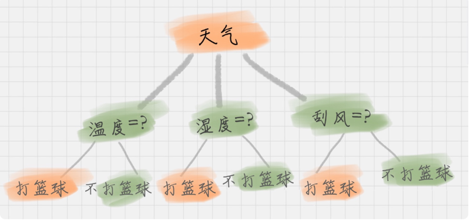

上面这个图就是一棵典型的决策树。我们在做决策树的时候，会经历两个阶段：构造和剪枝。

### 1. 构造

什么是构造呢？构造就是生成一棵完整的决策树。简单来说，构造的过程就是选择什么属性作为节点的过程，那么在构造过程中，会存在三种节点：

1. 根节点：就是树的最顶端，最开始的那个节点。在上图中，「天气」就是一个根节点；

2. 内部节点：就是树中间的那些节点，比如说「温度」、「湿度」、「刮风」；

3. 叶节点：就是树最底部的节点，也就是决策结果。

节点之间存在父子关系。比如根节点会有子节点，子节点会有子子节点，但是到了叶节点就停止了，叶节点不存在子节点。那么在构造过程中，你要解决三个重要的问题：

1. 选择哪个属性作为根节点；

2. 选择哪些属性作为子节点；

3. 什么时候停止并得到目标状态，即叶节点。

### 2. 剪枝

决策树构造出来之后是不是就万事大吉了呢？也不尽然，我们可能还需要对决策树进行剪枝。剪枝就是给决策树瘦身，这一步想实现的目标就是，不需要太多的判断，同样可以得到不错的结果。之所以这么做，是为了防止「过拟合」（Overfitting）现象的发生。

「过拟合」这个概念你一定要理解，它指的就是模型的训练结果「太好了」，以至于在实际应用的过程中，会存在「死板」的情况，导致分类错误。

欠拟合，和过拟合就好比是下面这张图中的第一个和第三个情况一样，训练的结果「太好」，反而在实际应用过程中会导致分类错误。

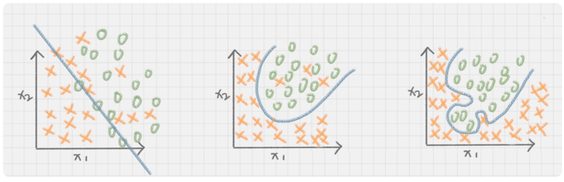

造成过拟合的原因之一就是因为训练集中样本量较小。如果决策树选择的属性过多，构造出来的决策树一定能够「完美」地把训练集中的样本分类，但是这样就会把训练集中一些数据的特点当成所有数据的特点，但这个特点不一定是全部数据的特点，这就使得这个决策树在真实的数据分类中出现错误，也就是模型的「泛化能力」差。

泛化能力指的分类器是通过训练集抽象出来的分类能力，你也可以理解是举一反三的能力。如果我们太依赖于训练集的数据，那么得到的决策树容错率就会比较低，泛化能力差。因为训练集只是全部数据的抽样，并不能体现全部数据的特点。

既然要对决策树进行剪枝，具体有哪些方法呢？一般来说，剪枝可以分为「预剪枝」（Pre-Pruning）和「后剪枝」（Post-Pruning）。

预剪枝是在决策树构造时就进行剪枝。方法是在构造的过程中对节点进行评估，如果对某个节点进行划分，在验证集中不能带来准确性的提升，那么对这个节点进行划分就没有意义，这时就会把当前节点作为叶节点，不对其进行划分。

后剪枝就是在生成决策树之后再进行剪枝，通常会从决策树的叶节点开始，逐层向上对每个节点进行评估。如果剪掉这个节点子树，与保留该节点子树在分类准确性上差别不大，或者剪掉该节点子树，能在验证集中带来准确性的提升，那么就可以把该节点子树进行剪枝。方法是：用这个节点子树的叶子节点来替代该节点，类标记为这个节点子树中最频繁的那个类。

## 02. 如何判断要不要去打篮球？

我给你准备了打篮球的数据集，训练数据如下：

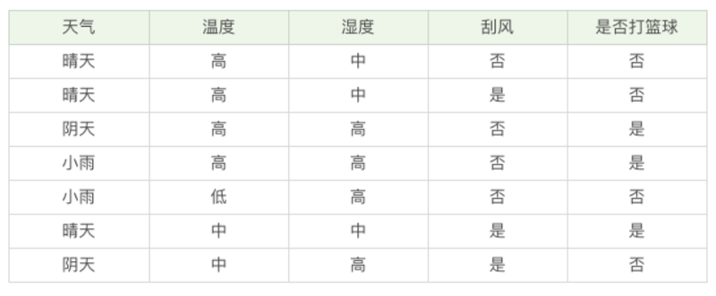

我们该如何构造一个判断是否去打篮球的决策树呢？再回顾一下决策树的构造原理，在决策过程中有三个重要的问题：将哪个属性作为根节点？选择哪些属性作为后继节点？什么时候停止并得到目标值？

显然将哪个属性（天气、温度、湿度、刮风）作为根节点是个关键问题，在这里我们先介绍两个指标：纯度和信息熵。

先来说一下纯度。你可以把决策树的构造过程理解成为寻找纯净划分的过程。数学上，我们可以用纯度来表示，纯度换一种方式来解释就是让目标变量的分歧最小。

我在这里举个例子，假设有 3 个集合：

- 集合 1：6 次都去打篮球；

- 集合 2：4 次去打篮球，2 次不去打篮球；

- 集合 3：3 次去打篮球，3 次不去打篮球。

按照纯度指标来说，集合 1> 集合 2> 集合 3。因为集合 1 的分歧最小，集合 3 的分歧最大。

然后我们再来介绍信息熵（entropy）的概念，它表示了信息的不确定度。

在信息论中，随机离散事件出现的概率存在着不确定性。为了衡量这种信息的不确定性，信息学之父香农引入了信息熵的概念，并给出了计算信息熵的数学公式：

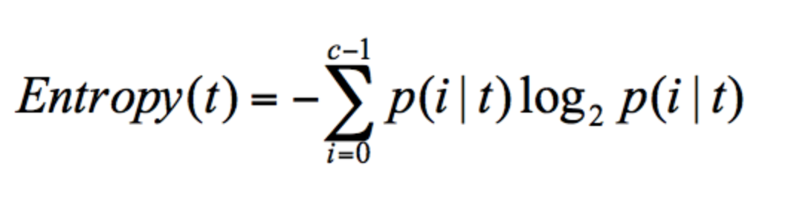

p (i|t) 代表了节点 t 为分类 i 的概率，其中 log2 为取以 2 为底的对数。这里我们不是来介绍公式的，而是说存在一种度量，它能帮我们反映出来这个信息的不确定度。当不确定性越大时，它所包含的信息量也就越大，信息熵也就越高。

我举个简单的例子，假设有 2 个集合：

- 集合 1：5 次去打篮球，1 次不去打篮球；

- 集合 2：3 次去打篮球，3 次不去打篮球。

在集合 1 中，有 6 次决策，其中打篮球是 5 次，不打篮球是 1 次。那么假设：类别 1 为「打篮球」，即次数为 5；类别 2 为「不打篮球」，即次数为 1。那么节点划分为类别 1 的概率是 5/6，为类别 2 的概率是 1/6，带入上述信息熵公式可以计算得出：

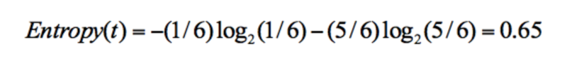

同样，集合 2 中，也是一共 6 次决策，其中类别 1 中「打篮球」的次数是 3，类别 2「不打篮球」的次数也是 3，那么信息熵为多少呢？我们可以计算得出：

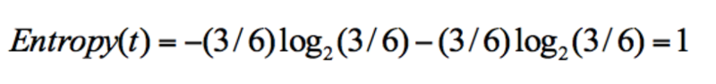

从上面的计算结果中可以看出，信息熵越大，纯度越低。当集合中的所有样本均匀混合时，信息熵最大，纯度最低。

我们在构造决策树的时候，会基于纯度来构建。而经典的「不纯度」的指标有三种，分别是信息增益（ID3 算法）、信息增益率（C4.5 算法）以及基尼指数（Cart 算法）。

我们先看下 ID3 算法。ID3 算法计算的是信息增益，信息增益指的就是划分可以带来纯度的提高，信息熵的下降。它的计算公式，是父亲节点的信息熵减去所有子节点的信息熵。在计算的过程中，我们会计算每个子节点的归一化信息熵，即按照每个子节点在父节点中出现的概率，来计算这些子节点的信息熵。所以信息增益的公式可以表示为：

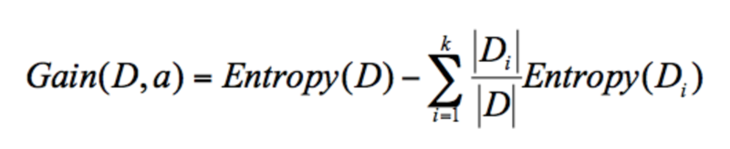

公式中 D 是父亲节点，Di 是子节点，Gain (D,a) 中的 a 作为 D 节点的属性选择。

假设「天气 = 晴」的时候，会有 5 次去打篮球，5 次不打篮球。其中 D1 刮风 = 是，有 2 次打篮球，1 次不打篮球。D2 刮风 = 否，有 3 次打篮球，4 次不打篮球。那么 a 代表节点的属性，即天气 = 晴。

你可以在下面的图例中直观地了解这几个概念。

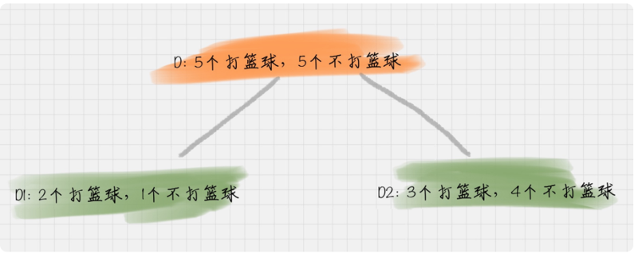

比如针对图上这个例子，D 作为节点的信息增益为：

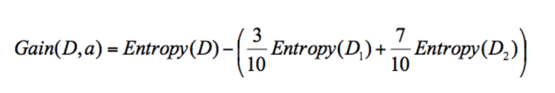

也就是 D 节点的信息熵 - 2 个子节点的归一化信息熵。2 个子节点归一化信息熵 = 3/10 的 D1 信息熵 + 7/10 的 D2 信息熵。

我们基于 ID3 的算法规则，完整地计算下我们的训练集，训练集中一共有 7 条数据，3 个打篮球，4 个不打篮球，所以根节点的信息熵是：

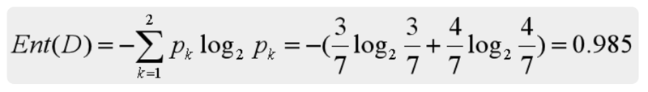

如果你将天气作为属性的划分，会有三个叶子节点 D1、D2 和 D3，分别对应的是晴天、阴天和小雨。我们用 + 代表去打篮球，- 代表不去打篮球。那么第一条记录，晴天不去打篮球，可以记为 1-，于是我们可以用下面的方式来记录 D1，D2，D3：

D1 (天气 = 晴天)={1-,2-,6+}

D2 (天气 = 阴天)={3+,7-}

D3 (天气 = 小雨)={4+,5-}

我们先分别计算三个叶子节点的信息熵：

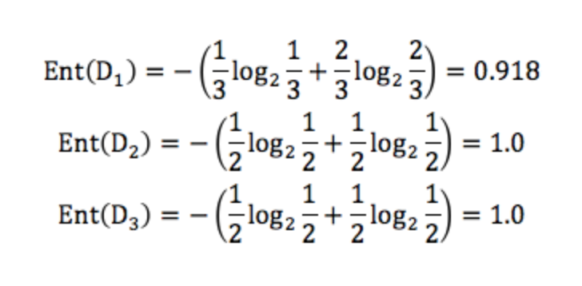

因为 D1 有 3 个记录，D2 有 2 个记录，D3 有 2 个记录，所以 D 中的记录一共是 3+2+2=7，即总数为 7。所以 D1 在 D（父节点）中的概率是 3/7，D2 在父节点的概率是 2/7，D3 在父节点的概率是 2/7。那么作为子节点的归一化信息熵 = 3/7\*0.918+2/7\*1.0+2/7*1.0=0.965。

因为我们用 ID3 中的信息增益来构造决策树，所以要计算每个节点的信息增益。

天气作为属性节点的信息增益为，Gain (D , 天气)=0.985-0.965=0.020。

同理我们可以计算出其他属性作为根节点的信息增益，它们分别为：

Gain (D , 温度)=0.128

Gain (D , 湿度)=0.020

Gain (D , 刮风)=0.020

我们能看出来温度作为属性的信息增益最大。因为 ID3 就是要将信息增益最大的节点作为父节点，这样可以得到纯度高的决策树，所以我们将温度作为根节点。其决策树状图分裂为下图所示：


然后我们要将上图中第一个叶节点，也就是 D1={1-,2-,3+,4+} 进一步进行分裂，往下划分，计算其不同属性（天气、湿度、刮风）作为节点的信息增益，可以得到：

Gain (D , 湿度)=1

Gain (D , 天气)=1

Gain (D , 刮风)=0.3115

我们能看到湿度，或者天气为 D1 的节点都可以得到最大的信息增益，这里我们选取湿度作为节点的属性划分。同理，我们可以按照上面的计算步骤得到完整的决策树，结果如下：

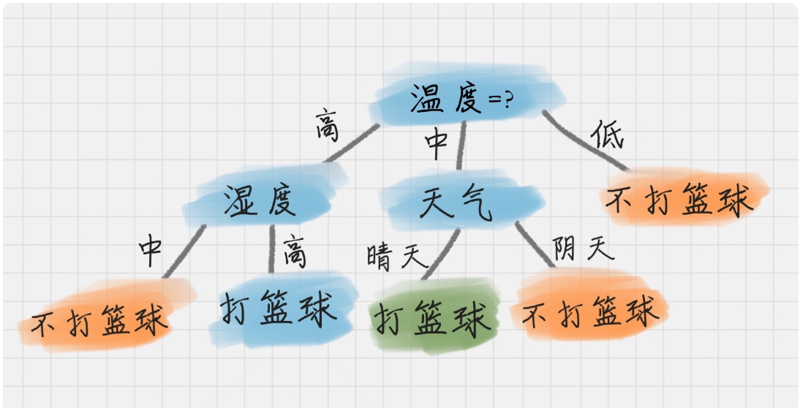

于是我们通过 ID3 算法得到了一棵决策树。ID3 的算法规则相对简单，可解释性强。同样也存在缺陷，比如我们会发现 ID3 算法倾向于选择取值比较多的属性。这样，如果我们把「编号」作为一个属性（一般情况下不会这么做，这里只是举个例子），那么「编号」将会被选为最优属性 。但实际上「编号」是无关属性的，它对「打篮球」的分类并没有太大作用。

所以 ID3 有一个缺陷就是，有些属性可能对分类任务没有太大作用，但是他们仍然可能会被选为最优属性。这种缺陷不是每次都会发生，只是存在一定的概率。在大部分情况下，ID3 都能生成不错的决策树分类。针对可能发生的缺陷，后人提出了新的算法进行改进。

## 03. 在 ID3 算法上进行改进的 C4.5 算法

那么 C4.5 都在哪些方面改进了 ID3 呢？

### 1. 采用信息增益率

因为 ID3 在计算的时候，倾向于选择取值多的属性。为了避免这个问题，C4.5 采用信息增益率的方式来选择属性。信息增益率 = 信息增益 / 属性熵，具体的计算公式这里省略。

当属性有很多值的时候，相当于被划分成了许多份，虽然信息增益变大了，但是对于 C4.5 来说，属性熵也会变大，所以整体的信息增益率并不大。

### 2. 采用悲观剪枝

ID3 构造决策树的时候，容易产生过拟合的情况。在 C4.5 中，会在决策树构造之后采用悲观剪枝（PEP），这样可以提升决策树的泛化能力。

悲观剪枝是后剪枝技术中的一种，通过递归估算每个内部节点的分类错误率，比较剪枝前后这个节点的分类错误率来决定是否对其进行剪枝。这种剪枝方法不再需要一个单独的测试数据集。

### 3. 离散化处理连续属性

C4.5 可以处理连续属性的情况，对连续的属性进行离散化的处理。比如打篮球存在的「湿度」属性，不按照「高、中」划分，而是按照湿度值进行计算，那么湿度取什么值都有可能。该怎么选择这个阈值呢，C4.5 选择具有最高信息增益的划分所对应的阈值。

### 4. 处理缺失值

针对数据集不完整的情况，C4.5 也可以进行处理。

假如我们得到的是如下的数据，你会发现这个数据中存在两点问题。第一个问题是，数据集中存在数值缺失的情况，如何进行属性选择？第二个问题是，假设已经做了属性划分，但是样本在这个属性上有缺失值，该如何对样本进行划分？

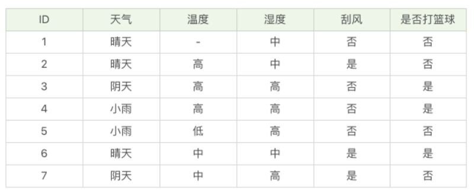

我们不考虑缺失的数值，可以得到温度 D={2-,3+,4+,5-,6+,7-}。温度 = 高：D1={2-,3+,4+} ；温度 = 中：D2={6+,7-}；温度 = 低：D3={5-} 。这里 + 号代表打篮球，- 号代表不打篮球。比如 ID=2 时，决策是不打篮球，我们可以记录为 2-。

针对将属性选择为温度的信息增为：

Gain (D′, 温度)=Ent (D′)-0.792=1.0-0.792=0.208

属性熵 =1.459, 信息增益率 Gain_ratio (D′, 温度)=0.208/1.459=0.1426。

D′的样本个数为 6，而 D 的样本个数为 7，所以所占权重比例为 6/7，所以 Gain (D′，温度) 所占权重比例为 6/7，所以：

Gain_ratio (D, 温度)=6/7*0.1426=0.122。

这样即使在温度属性的数值有缺失的情况下，我们依然可以计算信息增益，并对属性进行选择。

Cart 算法在这里不做介绍，我会在下一讲给你讲解这个算法。现在我们总结下 ID3 和 C4.5 算法。首先 ID3 算法的优点是方法简单，缺点是对噪声敏感。训练数据如果有少量错误，可能会产生决策树分类错误。C4.5 在 ID3 的基础上，用信息增益率代替了信息增益，解决了噪声敏感的问题，并且可以对构造树进行剪枝、处理连续数值以及数值缺失等情况，但是由于 C4.5 需要对数据集进行多次扫描，算法效率相对较低。

## 总结

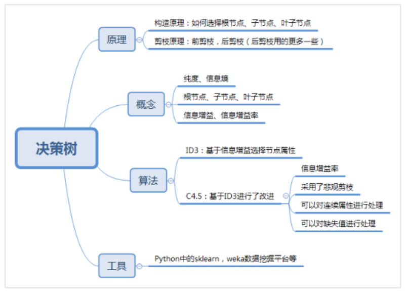

前面我们讲了两种决策树分类算法 ID3 和 C4.5，了解了它们的数学原理。你可能会问，公式这么多，在实际使用中该怎么办呢？实际上，我们可以使用一些数据挖掘工具使用它们，比如 Python 的 sklearn，或者是 Weka（一个免费的数据挖掘工作平台），它们已经集成了这两种算法。只是我们在了解了这两种算法之后，才能更加清楚这两种算法的优缺点。

我们总结下，这次都讲到了哪些知识点呢？

首先我们采用决策树分类，需要了解它的原理，包括它的构造原理、剪枝原理。另外在信息度量上，我们需要了解信息度量中的纯度和信息熵的概念。在决策树的构造中，一个决策树包括根节点、子节点、叶子节点。在属性选择的标准上，度量方法包括了信息增益和信息增益率。在算法上，我讲解了两种算法：ID3 和 C4.5，其中 ID3 是基础的决策树算法，C4.5 在它的基础上进行了改进，也是目前决策树中应用广泛的算法。然后在了解这些概念和原理后，强烈推荐你使用工具，具体工具的使用我会在后面进行介绍。

最后我们留一道思考题吧。请你用下面的例子来模拟下决策树的流程，假设好苹果的数据如下，请用 ID3 算法来给出好苹果的决策树。

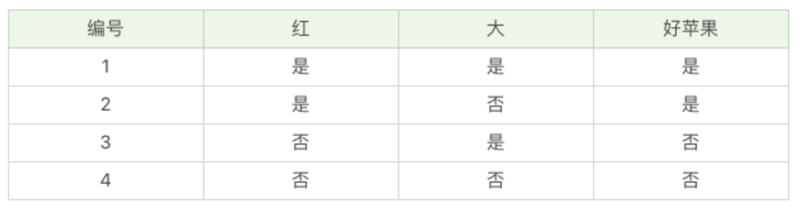

## 精选留言

### 01

决策树学习通常包括三个步骤：

1. 特征选择。选取最优特征来划分特征空间，用信息增益或者信息增益比来选择；

2. 决策树的生成。ID3、C4.5、CART；

3. 剪枝。

学习的时候发现了这两点错误：

1、Gain(D , 天气)=0 ---> 1

Gain(D , 湿度)=0 ----> 1

Gain(D , 刮风)=0.0615

2、针对将属性选择为温度的信息增益率为：

Gain(D′, 温度)=Ent(D′)-0.792=1.0-0.792=-0.208

这里算出来的还是信息增益，不是信息增益率，没有除以属性熵。

属性熵 = -3/6log3/6 - 1/6log1/6 - 2/6log2/6

作业：

```
经验熵 H(D) = -1/2log1/2 - 1/2log1/2 = 1
属性 红的信息增益：
g(D, A1) = H(D) - H(D|A1)
             = 1 - 1/2*0 - 1/2 * 0
             = 1
属性 大的信息增益：
g(D,A2) = 1 - 1/2*(-1/2log1/2-1/2log1/2)*2
             = 0
```

属性熵都是1，所以信息增益比跟信息增益一样。
特征选择 红作为最优特征，红的就是好苹果，不红的就是坏苹果。

2019-02-14

### 02

「红」的信息增益为：1

「大」的信息增益为：0

因此选择「红」的作为根节点，「大」作为子节点。接着再通过计算得出「大」作为子节点效果更差，故进行剪枝。因此最终的完整决策树就只有「红」一个节点：

红（是）---好苹果（是）

红（否）---好苹果（否）

通过使用sklearn来验证一下：

```
from sklearn import tree
import sys
import os
import graphviz
import numpy as np
os.environ["PATH"] += os.pathsep + 'D:/Program Files/Anaconda3/Library/bin/graphviz'

#创建数据[红，大]，1==是，0==否
data = np.array([[1,1],[1,0],[0,1],[0,0]])
#数据标注为，1==好苹果，0==坏苹果
target = np.array([1,1,0,0])

clf = tree.DecisionTreeClassifier() #创建决策树分类器模型
clf = clf.fit(data, target) #拟合数据

#最后利用graphviz库打印出决策树图
dot_data = tree.export_graphviz(clf,out_file=None)
graph = graphviz.Source(dot_data)
graph
```

2019-01-22

