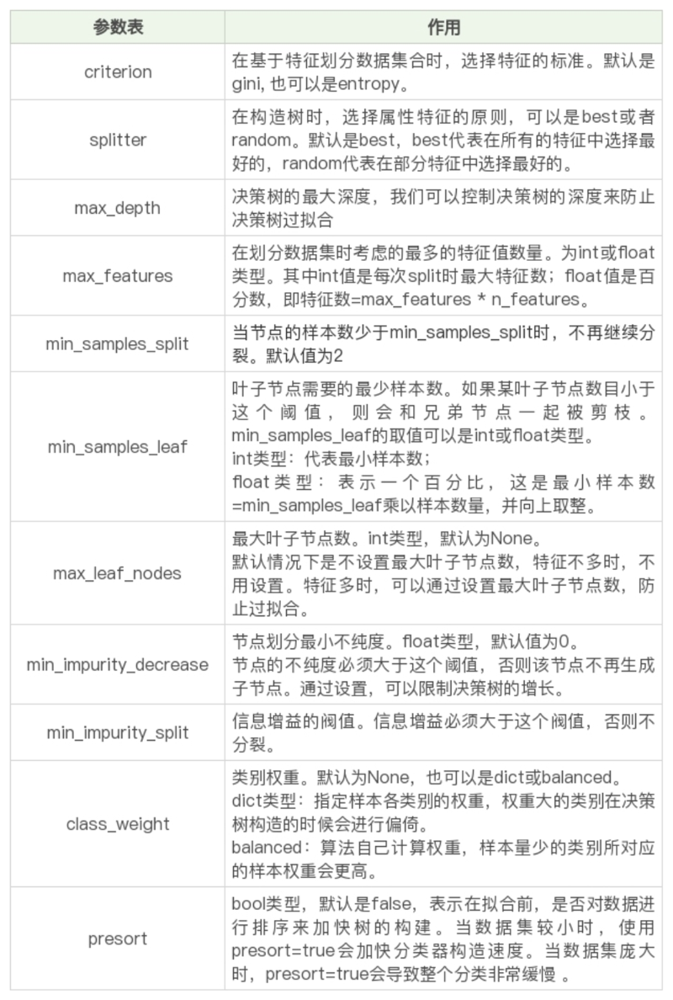
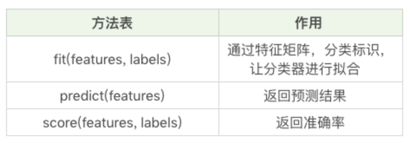
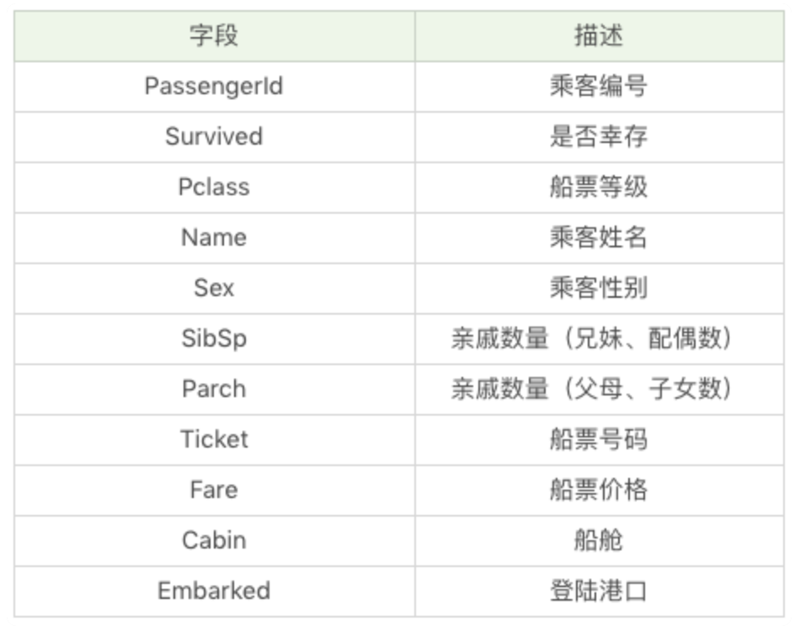
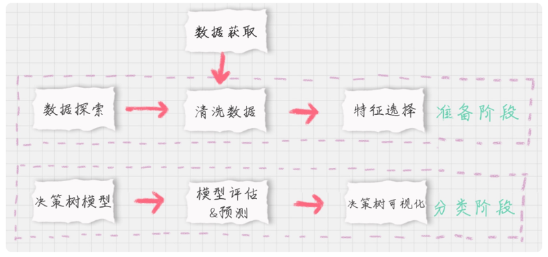
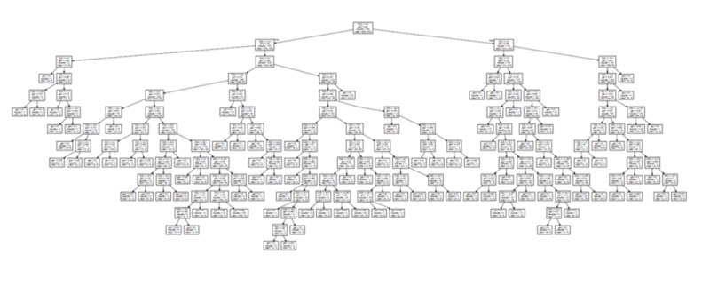
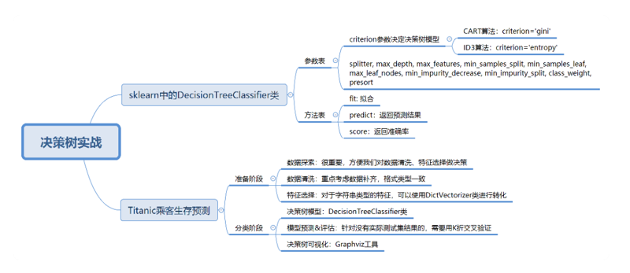

# 0203. 决策树 3：泰坦尼克乘客生存预测
> 陈旸 2019-01-25

在前面的两篇文章中，我给你讲了决策树算法。决策树算法是经常使用的数据挖掘算法，这是因为决策树就像一个人脑中的决策模型一样，呈现出来非常直观。基于决策树还诞生了很多数据挖掘算法，比如随机森林（Random forest）。

今天我来带你用决策树进行项目的实战。

决策树分类的应用场景非常广泛，在各行各业都有应用，比如在金融行业可以用决策树做贷款风险评估，医疗行业可以用决策树生成辅助诊断，电商行业可以用决策树对销售额进行预测等。

在了解决策树的原理后，今天我们用 sklearn 工具解决一个实际的问题：泰坦尼克号乘客的生存预测。

## 01. sklearn 中的决策树模型

首先，我们需要掌握 sklearn 中自带的决策树分类器 DecisionTreeClassifier，方法如下：

clf = DecisionTreeClassifier(criterion='entropy')

到目前为止，sklearn 中只实现了 ID3 与 CART 决策树，所以我们暂时只能使用这两种决策树，在构造 DecisionTreeClassifier 类时，其中有一个参数是 criterion，意为标准。它决定了构造的分类树是采用 ID3 分类树，还是 CART 分类树，对应的取值分别是 entropy 或者 gini：

entropy: 基于信息熵，也就是 ID3 算法，实际结果与 C4.5 相差不大；

gini：默认参数，基于基尼系数。CART 算法是基于基尼系数做属性划分的，所以 criterion=gini 时，实际上执行的是 CART 算法。

我们通过设置 criterion='entropy’ 可以创建一个 ID3 决策树分类器，然后打印下 clf，看下决策树在 sklearn 中是个什么东西？

```
DecisionTreeClassifier(class_weight=None, criterion='entropy', max_depth=None,
            max_features=None, max_leaf_nodes=None,
            min_impurity_decrease=0.0, min_impurity_split=None,
            min_samples_leaf=1, min_samples_split=2,
            min_weight_fraction_leaf=0.0, presort=False, random_state=None,
            splitter='best')
```

这里我们看到了很多参数，除了设置 criterion 采用不同的决策树算法外，一般建议使用默认的参数，默认参数不会限制决策树的最大深度，不限制叶子节点数，认为所有分类的权重都相等等。当然你也可以调整这些参数，来创建不同的决策树模型。

我整理了这些参数代表的含义：



在构造决策树分类器后，我们可以使用 fit 方法让分类器进行拟合，使用 predict 方法对新数据进行预测，得到预测的分类结果，也可以使用 score 方法得到分类器的准确率。

下面这个表格是 fit 方法、predict 方法和 score 方法的作用。



## 02. Titanic 乘客生存预测

### 1. 问题描述

泰坦尼克海难是著名的十大灾难之一，究竟多少人遇难，各方统计的结果不一。现在我们可以得到部分的数据，具体数据你可以从 GitHub 上下载：[cystanford/Titanic_Data: Titanic乘客生存预测](https://github.com/cystanford/Titanic_Data)。（完整的项目代码见：https://github.com/cystanford/Titanic_Data/blob/master/titanic_analysis.py 你可以跟着学习后自己练习）

其中数据集格式为 csv，一共有两个文件：

1. train.csv 是训练数据集，包含特征信息和存活与否的标签；

2. test.csv: 测试数据集，只包含特征信息。

现在我们需要用决策树分类对训练集进行训练，针对测试集中的乘客进行生存预测，并告知分类器的准确率。

在训练集中，包括了以下字段，它们具体为：



### 2. 生存预测的关键流程

我们要对训练集中乘客的生存进行预测，这个过程可以划分为两个重要的阶段：



1. 准备阶段：我们首先需要对训练集、测试集的数据进行探索，分析数据质量，并对数据进行清洗，然后通过特征选择对数据进行降维，方便后续分类运算；

2. 分类阶段：首先通过训练集的特征矩阵、分类结果得到决策树分类器，然后将分类器应用于测试集。然后我们对决策树分类器的准确性进行分析，并对决策树模型进行可视化。

下面，我分别对这些模块进行介绍。

#### 模块 1：数据探索

数据探索这部分虽然对分类器没有实质作用，但是不可忽略。我们只有足够了解这些数据的特性，才能帮助我们做数据清洗、特征选择。

那么如何进行数据探索呢？这里有一些函数你需要了解：

使用 info () 了解数据表的基本情况：行数、列数、每列的数据类型、数据完整度；

使用 describe () 了解数据表的统计情况：总数、平均值、标准差、最小值、最大值等；

使用 describe (include=[‘O’]) 查看字符串类型（非数字）的整体情况；

使用 head 查看前几行数据（默认是前 5 行）；

使用 tail 查看后几行数据（默认是最后 5 行）。

我们可以使用 Pandas 便捷地处理这些问题：

```
import pandas as pd
# 数据加载
train_data = pd.read_csv('./Titanic_Data/train.csv')
test_data = pd.read_csv('./Titanic_Data/test.csv')
# 数据探索
print(train_data.info())
print('-'*30)
print(train_data.describe())
print('-'*30)
print(train_data.describe(include=['O']))
print('-'*30)
print(train_data.head())
print('-'*30)
print(train_data.tail())
```

运行结果：

```
<class 'pandas.core.frame.DataFrame'>
RangeIndex: 891 entries, 0 to 890
Data columns (total 12 columns):
PassengerId    891 non-null int64
Survived       891 non-null int64
Pclass         891 non-null int64
Name           891 non-null object
Sex            891 non-null object
Age            714 non-null float64
SibSp          891 non-null int64
Parch          891 non-null int64
Ticket         891 non-null object
Fare           891 non-null float64
Cabin          204 non-null object
Embarked       889 non-null object
dtypes: float64(2), int64(5), object(5)
memory usage: 83.6+ KB
None
------------------------------
       PassengerId    Survived     ...           Parch        Fare
count   891.000000  891.000000     ...      891.000000  891.000000
mean    446.000000    0.383838     ...        0.381594   32.204208
std     257.353842    0.486592     ...        0.806057   49.693429
min       1.000000    0.000000     ...        0.000000    0.000000
25%     223.500000    0.000000     ...        0.000000    7.910400
50%     446.000000    0.000000     ...        0.000000   14.454200
75%     668.500000    1.000000     ...        0.000000   31.000000
max     891.000000    1.000000     ...        6.000000  512.329200

[8 rows x 7 columns]
------------------------------
                                          Name   Sex   ...       Cabin Embarked
count                                      891   891   ...         204      889
unique                                     891     2   ...         147        3
top     Peter, Mrs. Catherine (Catherine Rizk)  male   ...     B96 B98        S
freq                                         1   577   ...           4      644

[4 rows x 5 columns]
------------------------------
   PassengerId  Survived  Pclass    ...        Fare Cabin  Embarked
0            1         0       3    ...      7.2500   NaN         S
1            2         1       1    ...     71.2833   C85         C
2            3         1       3    ...      7.9250   NaN         S
3            4         1       1    ...     53.1000  C123         S
4            5         0       3    ...      8.0500   NaN         S

[5 rows x 12 columns]
------------------------------
     PassengerId  Survived  Pclass    ...      Fare Cabin  Embarked
886          887         0       2    ...     13.00   NaN         S
887          888         1       1    ...     30.00   B42         S
888          889         0       3    ...     23.45   NaN         S
889          890         1       1    ...     30.00  C148         C
890          891         0       3    ...      7.75   NaN         Q

[5 rows x 12 columns]
```

#### 模块 2：数据清洗

通过数据探索，我们发现 Age、Fare 和 Cabin 这三个字段的数据有所缺失。其中 Age 为年龄字段，是数值型，我们可以通过平均值进行补齐；Fare 为船票价格，是数值型，我们也可以通过其他人购买船票的平均值进行补齐。

具体实现的代码如下：

```
# 使用平均年龄来填充年龄中的nan值
train_data['Age'].fillna(train_data['Age'].mean(), inplace=True)
test_data['Age'].fillna(test_data['Age'].mean(),inplace=True)
# 使用票价的均值填充票价中的nan值
train_data['Fare'].fillna(train_data['Fare'].mean(), inplace=True)
test_data['Fare'].fillna(test_data['Fare'].mean(),inplace=True)
```

Cabin 为船舱，有大量的缺失值。在训练集和测试集中的缺失率分别为 77% 和 78%，无法补齐；Embarked 为登陆港口，有少量的缺失值，我们可以把缺失值补齐。

首先观察下 Embarked 字段的取值，方法如下：

    print(train_data['Embarked'].value_counts())

结果如下：

```
S    644
C    168
Q     77
```

我们发现一共就 3 个登陆港口，其中 S 港口人数最多，占到了 72%，因此我们将其余缺失的 Embarked 数值均设置为 S：

```
# 使用登录最多的港口来填充登录港口的nan值
train_data['Embarked'].fillna('S', inplace=True)
test_data['Embarked'].fillna('S',inplace=True)
```

#### 模块 3：特征选择

特征选择是分类器的关键。特征选择不同，得到的分类器也不同。那么我们该选择哪些特征做生存的预测呢？

通过数据探索我们发现，PassengerId 为乘客编号，对分类没有作用，可以放弃；Name 为乘客姓名，对分类没有作用，可以放弃；Cabin 字段缺失值太多，可以放弃；Ticket 字段为船票号码，杂乱无章且无规律，可以放弃。其余的字段包括：Pclass、Sex、Age、SibSp、Parch 和 Fare，这些属性分别表示了乘客的船票等级、性别、年龄、亲戚数量以及船票价格，可能会和乘客的生存预测分类有关系。具体是什么关系，我们可以交给分类器来处理。

因此我们先将 Pclass、Sex、Age 等这些其余的字段作特征，放到特征向量 features 里。

```
# 特征选择
features = ['Pclass', 'Sex', 'Age', 'SibSp', 'Parch', 'Fare', 'Embarked']
train_features = train_data[features]
train_labels = train_data['Survived']
test_features = test_data[features]
```

特征值里有一些是字符串，这样不方便后续的运算，需要转成数值类型，比如 Sex 字段，有 male 和 female 两种取值。我们可以把它变成 Sex=male 和 Sex=female 两个字段，数值用 0 或 1 来表示。

同理 Embarked 有 S、C、Q 三种可能，我们也可以改成 Embarked=S、Embarked=C 和 Embarked=Q 三个字段，数值用 0 或 1 来表示。

那该如何操作呢，我们可以使用 sklearn 特征选择中的 DictVectorizer 类，用它将可以处理符号化的对象，将符号转成数字 0/1 进行表示。具体方法如下：

```
from sklearn.feature_extraction import DictVectorizer
dvec=DictVectorizer(sparse=False)
train_features=dvec.fit_transform(train_features.to_dict(orient='record'))
```

你会看到代码中使用了 fit_transform 这个函数，它可以将特征向量转化为特征值矩阵。然后我们看下 dvec 在转化后的特征属性是怎样的，即查看 dvec 的 feature_names_ 属性值，方法如下：

    print(dvec.feature_names_)

运行结果：

    ['Age', 'Embarked=C', 'Embarked=Q', 'Embarked=S', 'Fare', 'Parch', 'Pclass', 'Sex=female', 'Sex=male', 'SibSp']

你可以看到原本是一列的 Embarked，变成了「Embarked=C」「Embarked=Q」「Embarked=S」三列。Sex 列变成了「Sex=female」「Sex=male」两列。

这样 train_features 特征矩阵就包括 10 个特征值（列），以及 891 个样本（行），即 891 行，10 列的特征矩阵。

#### 模块 4：决策树模型

刚才我们已经讲了如何使用 sklearn 中的决策树模型。现在我们使用 ID3 算法，即在创建 DecisionTreeClassifier 时，设置 criterion=‘entropy’，然后使用 fit 进行训练，将特征值矩阵和分类标识结果作为参数传入，得到决策树分类器。

```
from sklearn.tree import DecisionTreeClassifier
# 构造ID3决策树
clf = DecisionTreeClassifier(criterion='entropy')
# 决策树训练
clf.fit(train_features, train_labels)
```

#### 模块 5：模型预测 & 评估

在预测中，我们首先需要得到测试集的特征值矩阵，然后使用训练好的决策树 clf 进行预测，得到预测结果 pred_labels：

```
test_features=dvec.transform(test_features.to_dict(orient='record'))
# 决策树预测
pred_labels = clf.predict(test_features)
```

在模型评估中，决策树提供了 score 函数可以直接得到准确率，但是我们并不知道真实的预测结果，所以无法用预测值和真实的预测结果做比较。我们只能使用训练集中的数据进行模型评估，可以使用决策树自带的 score 函数计算下得到的结果：

```
# 得到决策树准确率
acc_decision_tree = round(clf.score(train_features, train_labels), 6)
print(u'score准确率为 %.4lf' % acc_decision_tree)
```

运行结果：

score 准确率为 0.9820

你会发现你刚用训练集做训练，再用训练集自身做准确率评估自然会很高。但这样得出的准确率并不能代表决策树分类器的准确率。

这是为什么呢？

因为我们没有测试集的实际结果，因此无法用测试集的预测结果与实际结果做对比。如果我们使用 score 函数对训练集的准确率进行统计，正确率会接近于 100%（如上结果为 98.2%），无法对分类器的在实际环境下做准确率的评估。

那么有什么办法，来统计决策树分类器的准确率呢？

这里可以使用 K 折交叉验证的方式，交叉验证是一种常用的验证分类准确率的方法，原理是拿出大部分样本进行训练，少量的用于分类器的验证。K 折交叉验证，就是做 K 次交叉验证，每次选取 K 分之一的数据作为验证，其余作为训练。轮流 K 次，取平均值。

K 折交叉验证的原理是这样的：

1. 将数据集平均分割成 K 个等份；

2. 使用 1 份数据作为测试数据，其余作为训练数据；

3. 计算测试准确率；

4. 使用不同的测试集，重复 2、3 步骤。

在 sklearn 的 model_selection 模型选择中提供了 cross_val_score 函数。cross_val_score 函数中的参数 cv 代表对原始数据划分成多少份，也就是我们的 K 值，一般建议 K 值取 10，因此我们可以设置 CV=10，我们可以对比下 score 和 cross_val_score 两种函数的正确率的评估结果：

```
import numpy as np
from sklearn.model_selection import cross_val_score
# 使用K折交叉验证 统计决策树准确率
print(u'cross_val_score准确率为 %.4lf' % np.mean(cross_val_score(clf, train_features, train_labels, cv=10)))
```

运行结果：

    cross_val_score 准确率为 0.7835

你可以看到，score 函数的准确率为 0.9820，cross_val_score 准确率为 0.7835。

这里很明显，对于不知道测试集实际结果的，要使用 K 折交叉验证才能知道模型的准确率。

#### 模块 6：决策树可视化

sklearn 的决策树模型对我们来说，还是比较抽象的。我们可以使用 Graphviz 可视化工具帮我们把决策树呈现出来。



安装 Graphviz 库需要下面的几步：

1. 安装 graphviz 工具，这里是它的下载地址：[Download](http://www.graphviz.org/download/)

2. 将 Graphviz 添加到环境变量 PATH 中；

3. 需要 Graphviz 库，如果没有可以使用 pip install graphviz 进行安装。

4. 这样你就可以在程序里面使用 Graphviz 对决策树模型进行呈现，最后得到一个决策树可视化的 PDF 文件，可视化结果文件 Source.gv.pdf 你可以在 GitHub 上下载：[cystanford/Titanic_Data: Titanic乘客生存预测](https://github.com/cystanford/Titanic_Data)

## 决策树模型使用技巧总结



今天我用泰坦尼克乘客生存预测案例把决策树模型的流程跑了一遍。在实战中，你需要注意一下几点：

1. 特征选择是分类模型好坏的关键。选择什么样的特征，以及对应的特征值矩阵，决定了分类模型的好坏。通常情况下，特征值不都是数值类型，可以使用 DictVectorizer 类进行转化；

2. 模型准确率需要考虑是否有测试集的实际结果可以做对比，当测试集没有真实结果可以对比时，需要使用 K 折交叉验证 cross_val_score；

3. Graphviz 可视化工具可以很方便地将决策模型呈现出来，帮助你更好理解决策树的构建。

我上面讲了泰坦尼克乘客生存预测的六个关键模块，请你用 sklearn 中的决策树模型独立完成这个项目，对测试集中的乘客是否生存进行预测，并给出模型准确率评估。数据从 GitHub 上下载即可。

最后给你留一个思考题吧，我在构造特征向量时使用了 DictVectorizer 类，使用 fit_transform 函数将特征向量转化为特征值矩阵。DictVectorizer 类同时也提供 transform 函数，那么这两个函数有什么区别？

## 精选留言

### 01

```
# 依赖包从 cmd中 pip install即可
import pandas as pd
import numpy as np
from sklearn.feature_extraction import DictVectorizer
from sklearn.tree import DecisionTreeClassifier
from sklearn.model_selection import cross_val_score
from sklearn import tree
import graphviz
# 数据加载
train_data = pd.read_csv('D:/workspace/study/python/Titanic_Data/train.csv')
test_data = pd.read_csv('D:/workspace/study/python/Titanic_Data/test.csv')
# 数据探索
print(train_data.info())
print('-'*30)
print(train_data.describe())
print('-'*30)
print(train_data.describe(include=['O']))
print('-'*30)
print(train_data.head())
print('-'*30)
print(train_data.tail())
# 数据清洗
# 使用平均年龄来填充年龄中的 nan 值
train_data['Age'].fillna(train_data['Age'].mean(), inplace=True)
test_data['Age'].fillna(test_data['Age'].mean(), inplace=True)
# 使用票价的均值填充票价中的 nan 值
train_data['Fare'].fillna(train_data['Fare'].mean(), inplace=True)
test_data['Fare'].fillna(test_data['Fare'].mean(), inplace=True)
# 使用登录最多的港口来填充登录港口的 nan 值
train_data['Embarked'].fillna('S', inplace=True)
test_data['Embarked'].fillna('S', inplace=True)
# 特征选择
features = ['Pclass', 'Sex', 'Age', 'SibSp', 'Parch', 'Fare', 'Embarked']
train_features = train_data[features]
train_labels = train_data['Survived']
test_features = test_data[features]
dvec = DictVectorizer(sparse=False)
train_features = dvec.fit_transform(train_features.to_dict(orient='record'))
print(dvec.feature_names_)
# 决策树模型
# 构造 ID3 决策树
clf = DecisionTreeClassifier(criterion='entropy')
# 决策树训练
clf.fit(train_features, train_labels)
# 模型预测 & 评估
test_features=dvec.transform(test_features.to_dict(orient='record'))
# 决策树预测
pred_labels = clf.predict(test_features)
# 决策树准确率
acc_decision_tree = round(clf.score(train_features, train_labels), 6)
print(u'score 准确率为 %.4lf' % acc_decision_tree)
# K 折交叉验证统计决策树准确率
print(u'cross_val_score 准确率为 %.4lf' % np.mean(cross_val_score(clf, train_features, train_labels, cv=10)))
# 决策树可视化
dot_data = tree.export_graphviz(clf, out_file=None)
graph = graphviz.Source(dot_data)
graph.view()
```

2019-01-30

### 02

fit 从一个训练集中学习模型参数，其中就包括了归一化时用到的均值，标准偏差等，可以理解为一个训练过程。

transform: 在fit的基础上，对数据进行标准化，降维，归一化等数据转换操作。

fit_transform: 将模型训练和转化合并到一起，训练样本先做fit，得到mean，standard deviation，然后将这些参数用于transform（归一化训练数据），使得到的训练数据是归一化的，而测试数据只需要在原先fit得到的mean，std上来做归一化就行了，所以用transform就行了。

编辑回复: 总结的很好。需要注意的是，transform 和fit_transform 虽然结果相同，但是不能互换。因为 fit_transform 只是 fit+transform 两个步骤合并的简写。而各种分类算法都需要先 fit，然后再进行 transform。所以如果把 fit_transform 替换为 transform 可能会报错。

### 03

Fare 似乎没有缺失值？

编辑回复: 训练集 train_data 中 Fare 没有缺失值，测试集 test_data 中 Fare 有缺失值。

通过 print(test_data.info()) 可以看到，所以 train_data 可以补用填充，而 test_data 需要对缺失值做处理。

### 04

还有个问题 决策树怎么读？ 就是每个方框内的数据都代表什么意思呢？

作者回复：你可以看下输出的决策树的图形，有几个数值你需要了解：

比如类似 X[7]<=0.5 这种就是告诉你这个节点，选择的属性是 X[7]，阈值是 0.5。

当<=0.5的时候，决策进入到左子树，当>0.5的时候，决策进入到右子树。

entropy 实际上代表了信息不纯度，这个数值越大，代表纯度越低。

samples 代表的是这个节点的样本数，比如 samples=891，就代表这个节点一般有 891 个样本。然后 value 这个数组会告诉你这个样本集是如何分布的，比如 value=[549,342]，即 891 个样本，有 549 个为 True，也就是 X[7]<=0.5，还有 342 个样本为 False，即这些样本的 X[7]>0.5

好了，然后继续上面的分裂过程，直到叶子节点，纯度越来越高，最终归为同一个类别时，纯度最高，entropy=0，此时样本都为同一个类别，也就是按照这条线路可以得到的最终分类结果。

所以你能看到：决策树的使用，就是从根节点开始，然后属性划分，当<=阈值时走左子树，>阈值时走右子树，最终在叶子节点可以得到分类的结果。你指的每个方框里的 entropy, samples, vale 都是中间的计算结果。

