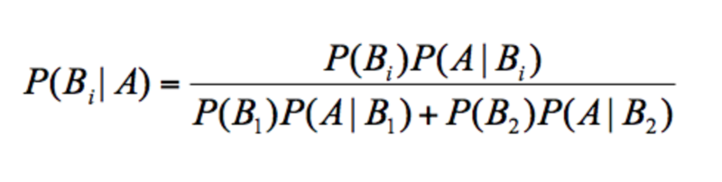
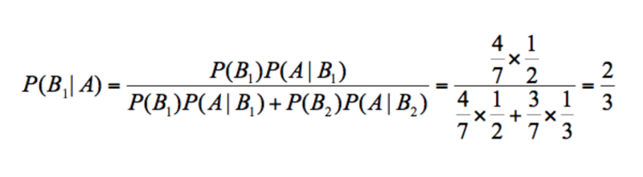
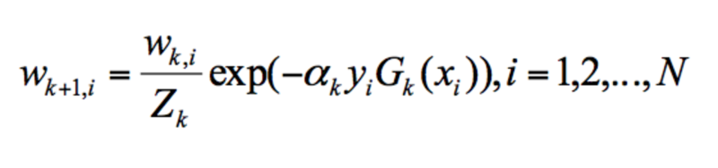
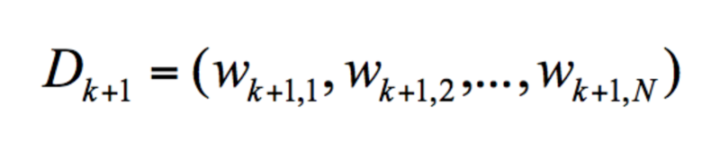
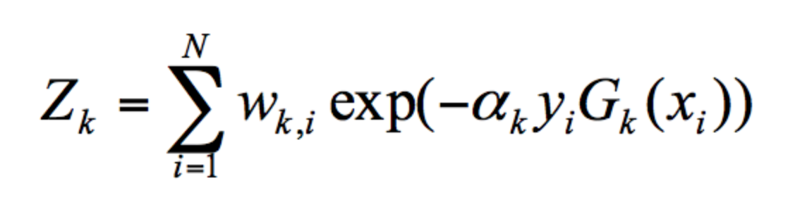
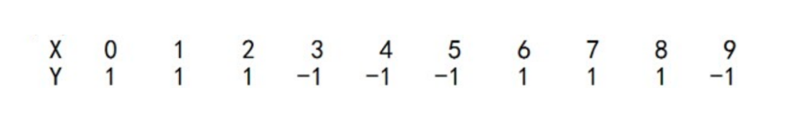

# 0220. 数据分析算法篇答疑

> 陈旸 2019-03-06

算法篇更新到现在就算结束了，因为这一模块比较难，所以大家提出了形形色色的问题。我总结了同学们经常遇到的问题，精选了几个有代表性的来作为答疑。没有列出的问题，我也会在评论区陆续解答。

## 17-19 篇：决策树

### Q&A01

答疑 1：在探索数据的代码中，print (boston.feature_names) 有什么作用？

boston 是 sklearn 自带的数据集，里面有 5 个 keys，分别是 data、target、feature_names、DESCR 和 filename。其中 data 代表特征矩阵，target 代表目标结果，feature_names 代表 data 对应的特征名称，DESCR 是对数据集的描述，filename 对应的是 boston 这个数据在本地的存放文件路径。

针对 sklearn 中自带的数据集，你可以查看下加载之后，都有哪些字段。调用方法如下：

```
boston=load_boston()
print(boston.keys())
```

通过 boston.keys () 你可以看到，boston 数据集的字段包括了 [‘data’, ‘target’, ‘feature_names’, ‘DESCR’, ‘filename’]。

### Q&A02

答疑 2：决策树的剪枝在 sklearn 中是如何实现的？

实际上决策树分类器，以及决策树回归器（对应 DecisionTreeRegressor 类）都没有集成剪枝步骤。一般对决策树进行缩减，常用的方法是在构造 DecisionTreeClassifier 类时，对参数进行设置，比如 max_depth 表示树的最大深度，max_leaf_nodes 表示最大的叶子节点数。

通过调整这两个参数，就能对决策树进行剪枝。当然也可以自己编写剪枝程序完成剪枝。

### Q&A03

答疑 3：对泰坦尼克号的乘客做生存预测的时候，Carbin 字段缺失率分别为 77% 和 78%，Age 和 Fare 字段有缺失值，是如何判断出来的？

首先我们需要对数据进行探索，一般是将数据存储到 DataFrame 中，使用 df.info () 可以看到表格的一些具体信息，代码如下：

```
# 数据加载
train_data = pd.read_csv('./Titanic_Data/train.csv')
test_data = pd.read_csv('./Titanic_Data/test.csv')
print(train_data.info())
print(test_data.info())
```

运行结果如下：

```
<class 'pandas.core.frame.DataFrame'>
RangeIndex: 891 entries, 0 to 890
Data columns (total 12 columns):
PassengerId    891 non-null int64
Survived       891 non-null int64
Pclass         891 non-null int64
Name           891 non-null object
Sex            891 non-null object
Age            714 non-null float64
SibSp          891 non-null int64
Parch          891 non-null int64
Ticket         891 non-null object
Fare           891 non-null float64
Cabin          204 non-null object
Embarked       889 non-null object
dtypes: float64(2), int64(5), object(5)
memory usage: 83.6+ KB
None
<class 'pandas.core.frame.DataFrame'>
RangeIndex: 418 entries, 0 to 417
Data columns (total 11 columns):
PassengerId    418 non-null int64
Pclass         418 non-null int64
Name           418 non-null object
Sex            418 non-null object
Age            332 non-null float64
SibSp          418 non-null int64
Parch          418 non-null int64
Ticket         418 non-null object
Fare           417 non-null float64
Cabin          91 non-null object
Embarked       418 non-null object
dtypes: float64(2), int64(4), object(5)
memory usage: 36.0+ KB
None
```

你可以关注下运行结果中 Carbin 的部分，你能看到在训练集中一共 891 行数据，Carbin 有数值的只有 204 个，那么缺失率为 1-204/891=77%，同样在测试集中一共有 418 行数据，Carbin 有数值的只有 91 个，那么缺失率为 1-91/418=78%。

同理你也能看到在训练集中，Age 字段有缺失值。在测试集中，Age 字段和 Fare 字段有缺失值。

### Q&A04

答疑 4：在用 pd.read_csv 时报错「UnicodeDecodeError utf-8 codec can’t decode byte 0xcf in position 15: invalid continuation byte」是什么问题？

一般在 Python 中遇到编码问题，尤其是中文编码出错，是比较常见的。有几个常用的解决办法，你可以都试一下：

将 read_csv 中的编码改为 gb18030，代码为：data = pd.read_csv (filename, encoding = ‘gb18030’)。

代码前添加 # -- coding: utf-8 --。

我说一下 gb18030 和 utf-8 的区别。utf-8 是国际通用字符编码，gb18030 是新出的国家标准，不仅包括了简体和繁体，也包括了一些不常见的中文，相比于 utf-8 更全，容错率更高。

为了让编辑器对中文更加支持，你也可以在代码最开始添加 # -- coding: utf-8 -- 的说明，再结合其他方法解决编码出错的问题。

## 第 20-21 篇：朴素贝叶斯

答疑 1：在朴素贝叶斯中，我们要统计的是属性的条件概率，也就是假设取出来的是白色的棋子，那么它属于盒子 A 的概率是 2/3。这个我算的是 3/5，跟老师的不一样，老师可以给一下详细步骤吗？

不少同学都遇到了这个问题，我来统一解答下。

这里我们需要运用贝叶斯公式（我在文章中也给出了），即：



假设 A 代表白棋子，B1 代表 A 盒，B2 代表 B 盒。带入贝叶斯公式，我们可以得到：



其中 P (B1) 代表 A 盒的概率，7 个棋子，A 盒有 4 个，所以 P (B1)=4/7。

P(B2) 代表 B 盒的概率，7 个棋子，B 盒有 3 个，所以 P (B2 )=3/7。

最终求取出来的是白色的棋子，那么它属于 A 盒的概率 P (B1|A)=2/3。

## 22-23 篇：SVM 算法

### Q&A01

答疑 1：SVM 多分类器是集成算法么？

SVM 算法最初是为二分类问题设计的，如果我们想要把 SVM 分类器用于多分类问题，常用的有一对一方法和一对多方法（我在文章中有介绍到）。

集成学习的概念你这样理解：通过构造和使用多个分类器完成分类任务，也就是我们所说的博取众长。

以上是 SVM 多分类器和集成算法的概念，关于 SVM 多分类器是否属于集成算法，我认为你需要这样理解。

在 SVM 的多分类问题中，不论是采用一对一，还是一对多的方法，都会构造多个分类器，从这个角度来看确实在用集成学习的思想，通过这些分类器完成最后的学习任务。

不过我们一般所说的集成学习，需要有两个基本条件：

每个分类器的准确率要比随机分类的好，即准确率大于 50%；

每个分类器应该尽量相互独立，这样才能博采众长，否则多个分类器一起工作，和单个分类器工作相差不大。

所以你能看出，在集成学习中，虽然每个弱分类器性能不强，但都可以独立工作，完成整个分类任务。而在 SVM 多分类问题中，不论是一对一，还是一对多的方法，每次都在做一个二分类问题，并不能直接给出多分类的结果。

此外，当我们谈集成学习的时候，通常会基于单个分类器之间是否存在依赖关系，进而分成 Boosting 或者 Bagging 方法。如果单个分类器存在较强的依赖关系，需要串行使用，也就是我们所说的 Boosting 方法。如果单个分类器之间不存在强依赖关系，可以并行工作，就是我们所说的 Bagging 或者随机森林方法（Bagging 的升级版）。

所以，一个二分类器构造成多分类器是采用了集成学习的思路，不过在我们谈论集成学习的时候，通常指的是 Boosing 或者 Bagging 方法，因为需要每个分类器（弱分类器）都有分类的能力。

## 26-27 篇：K-Means

### Q&A01

答疑 1：我在给 20 支亚洲球队做聚类模拟的时候，使用 K-Means 算法需要重新计算这三个类的中心点，最简单的方式就是取平均值，然后根据新的中心点按照距离远近重新分配球队的分类。对中心点的重新计算不太理解。

实际上是对属于这个类别的点的特征值求平均，即为新的中心点的特征值。

比如都属于同一个类别里面有 10 个点，那么新的中心点就是这 10 个点的中心点，一种简单的方式就是取平均值。比如文章中的足球队一共有 3 个指标，每个球队都有这三个指标的特征值，那么新的中心点，就是取这个类别中的这些点的这三个指标特征值的平均值。

## 28-29 篇：EM 聚类

### Q&A01

答疑 1：关于 EM 聚类初始参数设置的问题，初始参数随机设置会影响聚类的效果吗。会不会初始参数不对，聚类就出错了呢？

实际上只是增加了迭代次数而已。

EM 算法的强大在于它的鲁棒性，或者说它的机制允许初始化参数存在误差。

举个例子，EM 的核心是通过参数估计来完成聚类。如果你想要把菜平均分到两个盘子中，一开始 A 盘的菜很少，B 盘的菜很多，我们只要通过 EM 不断迭代，就会让两个盘子的菜量一样多，只是迭代的次数多一些而已。

另外多说一句，我们学的这些数据挖掘的算法，不论是 EM、Adaboost 还是 K-Means，最大的价值都是它们的思想。我们在使用工具的时候都会设置初始化参数，比如在 K-Means 中要选择中心点，即使一开始只是随机选择，最后通过迭代都会得到不错的效果。所以说学习这些算法，就是学习它们的思想。

## 30-31 篇：关联规则挖掘

### Q&A01

答疑 1：看不懂构造 FP 树的过程，面包和啤酒为什么会拆分呢？

FP-Growth 中有一个概念叫条件模式基。它在创建 FP 树的时候还用不上，我们主要通过扫描整个数据和项头表来构造 FP 树。条件模式基用于挖掘频繁项。通过找到每个项（item）的条件模式基，递归挖掘频繁项集。

### Q&A02

答疑 2：不怎么会找元素的 XPath 路径。

XPath 的作用大家应该都能理解，具体的使用其实就是经验和技巧的问题。

我的方法就是不断尝试，而且 XPath 有自己的规则，绝大部分的情况下都是以 // 开头，因为想要匹配所有的元素。我们也可以找一些关键的特征来进行匹配，比如 class='item-root’的节点，或者 id='root’都是很好的特征。通过观察 id 或 class，也可以自己编写 XPath，这样写的 XPath 会更短。总之，都是要不断尝试，才能找到自己想要找的内容，寻找 XPath 的过程就是一个找规律的过程。

答疑 3：最小支持度可以设置小一些，如果最小支持度小，那么置信度就要设置得相对大一点，不然即使提升度高，也有可能是巧合。这个参数跟数据量以及项的数量有关。理解对吗？

一般来说最小置信度都会大一些，比如 1.0，0.9 或者 0.8。最小支持度和数据集大小和特点有关，可以尝试一些数值来观察结果，比如 0.1，0.5。

## 34-35 篇：AdaBoost 算法

答疑 1：关于 Zk 和 yi 的含义。

第 k+1 轮的样本权重，是根据该样本在第 k 轮的权重以及第 k 个分类器的准确率而定，具体的公式为：



其中 Zk 和 yi 代表什么呢？

Zk 代表规范化因子，我们知道第 K+1 轮样本的权重为：



为了让样本权重之和为 1，我们需要除以规范化因子 Zk，所以：



yi 代表的是目标的结果，我在 AdaBoost 工作原理之后，列了一个 10 个训练样本的例子：



你能看到通常我们把 X 作为特征值，y 作为目标结果。在算法篇下的实战练习中，我们一般会把训练集分成 train_X 和 train_y，其中 train_X 代表特征矩阵，train_y 代表目标结果。

我发现大家对工具的使用和场景比较感兴趣，所以最后留两道思考题。

第一道题是，在数据挖掘的工具里，我们大部分情况下使用的是 sklearn，它自带了一些数据集，你能列举下 sklearn 自带的数据集都有哪些么？我在第 18 篇使用 print (boston.feature_names) 来查看 boston 数据集的特征名称（数据集特征矩阵的 index 名称），你能查看下其他数据集的特征名称都是什么吗？列举 1-2 个 sklearn 数据集即可。

第二个问题是，对于数据挖掘算法来说，基础就是数据集。Kaggle 网站之所以受到数据科学从业人员的青睐就是因为有众多比赛的数据集，以及社区间的讨论交流。你是否有使用过 Kaggle 网站的经历，如果有的话，可以分享下你的使用经验吗？如果你是个数据分析的新人，当看到 Kaggle 网站时，能否找到适合初学者的 kernels 么（其他人在 Kaggle 上成功运行的代码分享）？

## 精选留言

### 01

Kaggle 的 Python 数据分析入门教程：[Data ScienceTutorial for Beginners | Kaggle](https://www.kaggle.com/kanncaa1/data-sciencetutorial-for-beginners)。另外入门级别的 kernels 就是 Titanic 和房价预测：

1、[Titanic: Machine Learning from Disaster | Kaggle](https://www.kaggle.com/c/titanic)

2、[House Prices: Advanced Regression Techniques | Kaggle](https://www.kaggle.com/c/house-prices-advanced-regression-techniques)

编辑回复：对的，Kaggle 里很多数据集都不错，另外在专栏里也会讲到关于信用卡违约率分析和信用卡欺诈分析。下面整理了一些数据集，更多数据集，可以通过 https://www.kaggle.com/datasets 查找：

Titanic: Machine Learning from Disaster

Titanic 乘客生存预测

https://www.kaggle.com/c/titanic

House Prices-Advanced Regression Techniques

预测房价

https://www.kaggle.com/c/house-prices-advanced-regression-techniques

MNIST 手写数字识别

https://www.kaggle.com/scolianni/mnistasjpg

Passenger Satisfaction

乘客满意度，提供了美国航空公司 US Airline 乘客满意度数据

https://www.kaggle.com/johndddddd/customer-satisfaction

Bike Sharing Demand

自行车共享数据库，用于预测自行车的共享需求

https://www.kaggle.com/lakshmi25npathi/bike-sharing-dataset

San Francisco Building Permits

5 年时间，三藩市 20 万的建筑许可

https://www.kaggle.com/aparnashastry/building-permit-applications-data

San Francisco Crime Classification

12 年时间的三藩市的犯罪记录

https://www.kaggle.com/kaggle/san-francisco-crime-classification

2019-03-06

### 02

老师可以总结一下，这十个算法的应用场景、优缺点吗？

编辑回复：首先十个经典算法代表了十种数据挖掘思想，基于他们都有不少算法的变种和改进，对数据挖掘的影响是非常深远的。另外这十大经典算法，解决的问题也不同，按照解决问题来划分的话：

分类算法：C4.5，朴素贝叶斯（Naive Bayes），SVM，KNN，Adaboost，CART

聚类算法：K-Means，EM

关联分析：Apriori

连接分析：PageRank

所以这十大算法要解决的问题也不同，比如分类是一种有监督的学习方式，事先知道样本的类别，通过数据挖掘可以将不同类别的样本进行区别，从而对未知的物体进行分类。而聚类是一种无监督的学习方式，事先不知道样本的类别，而是通过相关属性分析，将具有类似属性的物体聚成一类。

所以对十大算法的理解，想要知道他们解决的是哪类问题。然后针对同一类问题，比如分类问题，也有不同种解法，比如 C4.5，朴素贝叶斯，SVM，KNN 等。

不同的算法实际上都有自己对这个问题分析的方式，很难说哪种算法更优，哪个算法不好。实际上这和我们的样本有很大关系，不同的样本属性，样本分布，特征值等，采用不同的算法结果都会有差别，最好的方式就是都做一遍，然后选择针对这个训练集 / 测试集最优的算法。所以你能看到，在后面的练习中，我们往往都在采用多种算法。

另外我想说的是，关于算法的研究，这十大算法是根基，很多人都会在这些算法基础上提出自己的模型，就类似于研究生期间发表论文，都是在这些算法（会有这个算法相应的参考文献）的基础上进行的改进。同时，也会给出自己所采用的的数据集，然后针对这个数据集，采用传统方法和改进方法进行对比，得出结论。所以：算法是可以改进的，采用哪个适合和数据集也有关系，很多时候都会做一遍然后选择适合的。

2019-03-07

### 03

sklearn 自带的小数据集（packageddataset）：sklearn.datasets.load_<name>

1) 鸢尾花数据集：load_iris（）：用于分类任务的数据集。

2) 手写数字数据集：load_digits（）: 用于分类任务或者降维任务的数据集。

3) 乳腺癌数据集 load_breast_cancer（）：简单经典的用于二分类任务的数据集。

4) 糖尿病数据集：load_diabetes（）：经典的用于回归认为的数据集，值得注意的是，这 10 个特征中的每个特征都已经被处理成 0 均值，方差归一化的特征值。

5) 波士顿房价数据集：load_boston（）：经典的用于回归任务的数据集。

6) 体能训练数据集：load_linnerud（）：经典的用于多变量回归任务的数据集。

体能训练数据集中的特征名称：linnerud.feature_names 为 ['Chins', 'Situps', 'Jumps']

鸢尾花数据集的特征名称：iris.feature_names 为 ['sepal length (cm)','sepal width (cm)','petal length (cm)','petal width (cm)']

2019-03-06

### 04

https://www.kaggle.com/learn/overview 页面里有分类好的比较简单的 kernel，可以 fork kernel 在 kaggle 上运行，也可以下载 ipynb 或者 rmd 文件在自己的电脑上运行。比较经典的 kaggle 竞赛有泰坦尼克预测，房价预测，数字识别等，刚起步时可以参考这些竞赛里的 kernel。另外，有一个开源组织 ApacheCN 有一些 kaggle 的培训，有很多相关的活动，也可以找同伴组队参加比赛。

编辑回复：可以看看 https://www.kaggle.com/learn/overview

2019-03-23

```
import sklearn.datasets as db
# help (db)# 可以查看文档，有很多的数据集
# 准备数据集
iris=db.load_iris()
print(iris.feature_names)
结果：
['sepal length (cm)', 'sepal width (cm)', 'petal length (cm)', 'petal width (cm)']
```

说来惭愧，到现在为止，都还没有注意到 Kaggle 的重要性。刚去看看了入门，发现这篇文章介绍的不错：[关于Kaggle入门，看这一篇就够了](http://www.360doc.com/content/18/0106/16/44422250_719580875.shtml#)。

一些摘要：

Kaggle 成立于 2010 年，是一个进行数据发掘和预测竞赛的在线平台。从公司的角度来讲，可以提供一些数据，进而提出一个实际需要解决的问题；从参赛者的角度来讲，他们将组队参与项目，针对其中一个问题提出解决方案，最终由公司选出的最佳方案可以获得 5K-10K 美金的奖金。

除此之外，Kaggle 官方每年还会举办一次大规模的竞赛，奖金高达一百万美金，吸引了广大的数据科学爱好者参与其中。从某种角度来讲，大家可以把它理解为一个众包平台，类似国内的猪八戒。但是不同于传统的低层次劳动力需求，Kaggle 一直致力于解决业界难题，因此也创造了一种全新的劳动力市场 —— 不再以学历和工作经验作为唯一的人才评判标准，而是着眼于个人技能，为顶尖人才和公司之间搭建了一座桥梁。

作者回复: kaggle 给数据分析师提供了非常好的数据集。

2019-03-06

### 05

在第 21 课朴素贝叶斯分类（下），对中文文档进行分类，老师可以提供完整代码吗？一直遇到对中文词组不支持的问题？

编辑回复：完整代码在 [cystanford/text_classification: 中文文档分类数据集](https://github.com/cystanford/text_classification)。

2019-03-06

### 06

有一个问题想请教一下老师，每次做算法模型训练，用训练集数据拟合一个模型后，如何把它保存下来，如果不保存拟合后的模型，每次要做新的预测时，难道都要用样本训练集重新拟合模型？

作者回复：可以使用 picke 工具

```
import pickle
# fp_lr_model 是模型保存的文件位置
pickle.dump(lr_model, open(fp_lr_model, 'wb'))
lr_model = pickle.load(open(fp_lr_model, 'rb'))
```

### 07

K-Means 的例子还是看不懂。

编辑回复：这里想说明的是 KMeans 计算的中心点，实际上是这个类别里所有点的属性值的平均值。然后作为这个新的中心点的属性值。

2019-07-07

### 08

预减枝就是在划分子树的时候不能带来准确度的提升，就不划分。后减枝就是试着减掉每一个叶子节点，看准确度是否有提升。

2019-04-23

### 09

为什么三个相关性大的特征只选一个呢？原理是什么？

编辑回复：首先特征选择是数据挖掘（机器学习）中的重要问题之一，一般来说对于数据特征空间大的数据集来说，我们需简要对特征进行选择，也就是选取有代表性的特征，来降低特征空间的冗余度，提升算法的效率。特征选择的过程，你可以理解是从 m 个特征中选择 n 个特征的过程，文章中从三个相关性大的特征只选择一个，目的是在于降低冗余信息，缩减特征维数。

2019-03-06

### 10

在第 21 课朴素贝叶斯分类（下）：

在模块 4: 生成朴素贝叶斯分类器，特征训练集的特征空间 train_features，以及训练集对应的分类 train_labels 是如何获取的。老师并没有讲清楚。

2019-03-06

