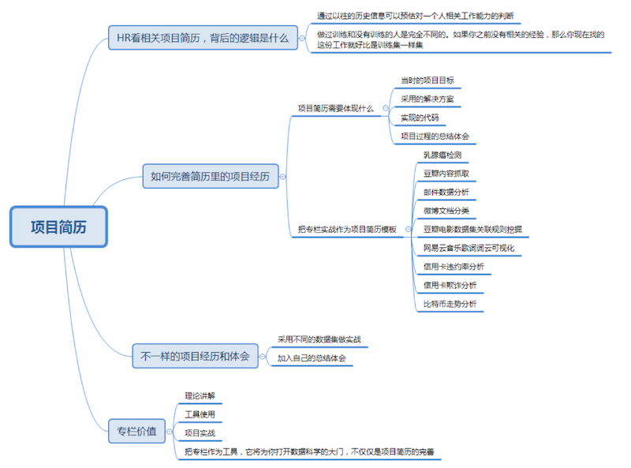

# 0402. 求职简历中没有相关项目经验，怎么办？
> 陈旸 2019-03-27

上节课我讲到了如何培养数据分析思维，它是一个重要但不紧急的事。在工作求职中，你可能会遇到各种又重要又紧急的事，比如填写求职简历中的项目经验。

它的重要性在于，HR 一般都会依据简历中的项目经验初步筛选候选人是否符合面试要求，紧急性在于求职找工作往往就是眼前的事，但简历中的项目经验又很难临时抱佛脚。项目经验一般没有弹性，一是一，二是二，一方面要保证真实性，是自己做过的项目，另一方面又很难在短时间内积攒这些经验。

如果没有项目经验，很多人就会感觉无从下手，这时候该怎么办呢？我自己面试过的技术人员少说也有上百人，我想以自己的经验做一些分享，在经验积累上和你分享以下三个需要注意的地方：

1. 我们求职找工作的时候，要理解 HR 看项目经验的逻辑是什么？

2. 明确要完善项目经验这个目标后，我们该如何快速定位要积累的内容，并通过实战和训练快速进行提升经验值？

3. 如何在项目经验中融入自己的心得体会，让你的经验显得与众不同？

## 01. HR 看相关项目简历，背后的逻辑是什么

上篇文章中我讲到过，HR 之所以要看相关的项目经验，是因为这些历史信息可以帮助他预估一个人相关的工作能力。

知识不等于项目经验，即使你对知识都了解了，在实际项目过程中，还是会遇到各种问题。比如工具包安装不上、中文编码错误、画图显示不出来、算法运行过慢、数据拟合结果不好等各种问题。项目经历相当于一种训练，当你得到了更好的训练之后，数据分析的模型能力也就会越强，然后在「新公司」这个测试集中，就越有可能发挥好的效果。

做过训练和没有训练的人是完全不同的。如果你没有相关的经验，那么你现在找的这份工作就好比是训练集一样，没有一个公司会把他们的项目当做是你练手的数据集。大家都期望你是已经训练好的模型，可以马上开展新的工作，并且产生价值。

所以在经验积累上，你要证明给 HR，我做过这样的项目，具备这样的能力。

你可能想问，项目从哪里来呢？第一个肯定是以往类似的工作经历，第二个就是自己做过类似的项目。但是在简历中呈现数据分析的项目也是需要技巧的，简历不是流水账，你需要重点把当时的项目目标、采用的解决方案、实现的代码以及项目过程的总结体会拿给 HR 看。

这样，即使你没有相关的工作经历，如果你能通过专栏实战积累上面的 4 点，对 HR 来说也是有说服力的，这样总比一张白纸要强得多。要知道 HR 背后的逻辑是要通过简历证明你是已经被训练过的模型，可以上手工作了，而不是把新公司当成训练集。

## 02. 如何完善简历里的项目经历

现在我们需要简历中有更多的项目经验。如果你跟着专栏从头到尾完整学习了，在爬虫、数据可视化、数据清洗和集成、数据挖掘算法、图像识别等多个维度进行了实战训练，那么恭喜你，实际上你已经具有数据分析相关的工作经验了。

这方面我来简单帮你总结下，梳理出一个项目简历的模板。但最根本的是，你需要自己跑一遍项目代码，完整了解项目目标和解决方案。只有这样，放到简历中的时候才会比较充实。

1、乳腺癌检测：采用 SVM 方法，对美国威斯康星州的乳腺癌诊断数据集进行分类，最终实现一个针对乳腺癌检测的分类器：[cystanford/breast_cancer_data: 乳腺癌检测分类数据](https://github.com/cystanford/breast_cancer_data)。

2、内容抓取：通过 Python 爬虫对豆瓣电影中的电影数据和海报等信息进行抓取：[cystanford/pachong: Python爬虫实例](https://github.com/cystanford/pachong)。

3、邮件数据分析：通过 PageRank 算法分析邮件中的人物关系图谱，并针对邮件数量较大的情况筛选出重要的人物，进行绘制：[cystanford/PageRank: PageRank算法实例-希拉里邮件PR分析](https://github.com/cystanford/PageRank)。

4、微博文档分类：采用朴素贝叶斯的方法，对微博的内容进行分类，最终实现一个简单的文档分类器：[cystanford/text_classification: 中文文档分类数据集](https://github.com/cystanford/text_classification)。

5、电影数据集关联规则挖掘：采用 Apriori 算法，分析电影数据集中的导演和演员信息，从而发现导演和演员之间的频繁项集及关联规则：[cystanford/Apriori: Apriori算法实例-挖掘电影导演的关联规则](https://github.com/cystanford/Apriori)。

6、歌词词云可视化：动态抓取指定明星的歌曲列表，保存歌词文件，去除歌词中的常用词，并对歌词进行词云展示，分析歌曲的作词风格：[cystanford/word_cloud: 词云生成](https://github.com/cystanford/word_cloud)。

7、信用卡违约率分析：针对台湾某银行信用卡的数据，构建一个分析信用卡违约率的分类器。采用 Random Forest 算法，信用卡违约率识别率在 80% 左右：[cystanford/credit_default: 信用卡违约率分析](https://github.com/cystanford/credit_default)。

8、信用卡欺诈分析：针对欧洲某银行信用卡交易数据，构建一个信用卡交易欺诈识别器。采用逻辑回归算法，通过数据可视化方式对混淆矩阵进行展示，统计模型的精确率，召回率和 F1 值，F1 值为 0.712，并绘制了精确率和召回率的曲线关系：[cystanford/credit_fraud: 信用卡欺诈分析](https://github.com/cystanford/credit_fraud)。

9、比特币走势分析：分析 2012 年 1 月 1 日到 2018 年 10 月 31 日的比特币价格数据，并采用时间序列方法，构建自回归滑动平均模型（ARMA 模型），预测未来 8 个月比特币的价格走势。预测结果表明比特币将在 8 个月内降低到 4000 美金左右，与实际比特币价格趋势吻合（实际最低降到 4000 美金以下）：[cystanford/bitcoin: 比特币走势分析](https://github.com/cystanford/bitcoin)。

## 03. 不一样的项目经历和体会

上面我整理了 9 个项目简历的示例，如果认真学习专栏，并且坚持练习的话，那么不用愁相关的项目经验。如果你希望有不一样的项目经历，那么能融入自己的项目体会和总结的话，就会更好。

比如分析比特币走势这一篇文章中，我还提供了沪市指数的历史数据（从 1990 年 12 月 19 日到 2019 年 2 月 28 日），你完全可以采用 ARMA 模型自己跑一遍，然后整理出相关的经历。

再或者，我们对毛不易歌词进行词云分析的时候，你也可以分析其他的歌手，或者某个歌手的某张专辑的词云。模型方法是相同的，但不同的数据集出来的结果是不同的。

另外你也可以在项目实战中，融入自己的心得体会。比如在预测比特币走势这个项目中，我们对原始数据进行了降维，按月为粒度进行了统计，实际预测结果与按天进行统计的结果相差并不大，但是数据量降到了 1/30，大大提升了效率。在这个过程中，你应该能体会到数据降维的作用。

在信用卡欺诈分析这个项目中，我们观察到数据集的分类样本是不平衡的，针对这种情况，我们到底该采用哪个评价标准呢？为什么采用准确率作为评价标准会有问题？有关这方面的经验总结你也可以简单做个说明，这样不光可以证明你具备这种项目的经验，也能证明针对这类的问题，你都找到了哪些规律。

总之自己的心得体会和总结能给项目经验加分不少。

## 总结

在专栏的讲解过程中，很多同学都反馈过他们正在找工作，但项目经历这块是自己的软肋。我们关键要弄明白 HR 招人背后的逻辑，把相关的训练经验总结下来写在简历中，最后拆解专栏的实战项目。

在这个过程中你需要：

1. 了解每个实战项目的目标；

2. 理解每个算法的原理；

3. 跑一遍项目代码，将运行结果放到 GitHub 上；

4. 做项目的心得总结。

当你自己把这些内容整理出来的时候，你发现自己会更有信心。简历的完善只是表象，实际上最重要的是自己的能力也得到了提升，这也是通过学习专栏，我希望你能收获的价值。

我在专栏里讲解了理论知识、工具方法和实战项目，希望你把专栏作为一个工具，带你走入数据科学的大门。掌握了这个工具之后，平时遇到问题的时候，你就可以用数据的视角来分析它，使用工具来做模拟，总结结果，进一步完善你的简历。

我在专栏中讲解了理论知识，工具使用和实战项目，在 Python 爬虫、数据可视化和数据挖掘算法这三个部分中，除了专栏中讲解到的项目，你还做过哪些项目或者练习（采用相同的算法模型用于不同的数据集也可以），欢迎你分享一下。

另外，简历是最好的工作梳理，通过专栏的学习，你是否已经开始完善你的项目简历了呢，还有哪些地方是可以完善的？

## 精选留言

### 01

通过学习老师的课程，自己真正做了一个数据分析项目，预测足球比赛结果。老师的课程犹如醍醐灌顶，但自己必须深入思考，现在准确率和召回率都较高达到 80% 左右，已经上传到 github。

[acredjb/FBP: 项目全称FootBallPrediction](https://github.com/acredjb/FBP)

2019-04-02

### 02

很好奇大型的爬虫是什么样子。

作者回复：使用 scrapy 框架，更主要是存储，还有 IP 切换。

2019-03-27

### 03

对于项目经验来讲。是不是必须要求工作项目经验？还是兴趣爱好类的项目经验也可以被 hr 考虑？比如 kaggle 之类的。

作者回复：如果有 kaggle 的经验当然好，现在找到好的工作越来越难了，首要是加强自己的竞争力。

2019-04-07

### 04

我从事私募基金量化对冲这行，想丰富些专业方面知识。

作者回复：你可以关注下 Fintech，或者量化交易这块。

2019-03-27