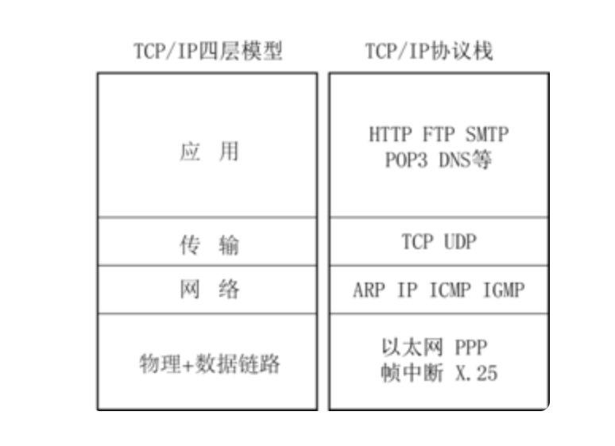
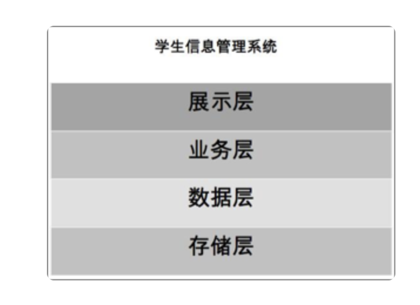
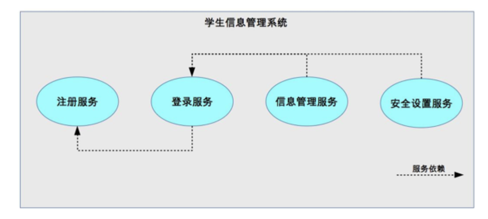
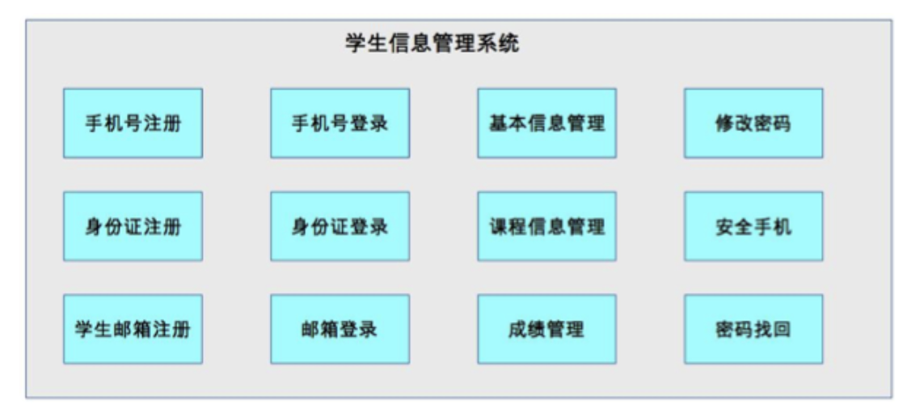

# 0401. 可扩展架构的基本思想和模式

李运华 2018-07-10

软件系统与硬件和建筑系统最大的差异在于软件是可扩展的，一个硬件生产出来后就不会再进行改变、一个建筑完工后也不会再改变其整体结构。例如，一颗 CPU 生产出来后装到一台 PC 机上，不会再返回工厂进行加工以增加新的功能；金字塔矗立千年历经风吹雨打，但其现在的结构和当时建成完工时的结构并无两样。相比之下，软件系统就完全相反，如果一个软件系统开发出来后，再也没有任何更新和调整，反而说明了这套软件系统没有发展、没有生命力。真正有生命力的软件系统，都是在不断迭代和发展的，典型的如 Windows 操作系统，从 Windows 3.0 到 Windows 95 到 Windows XP，直到现在的 Windows 10，一直在跟着技术的发展而不断地发展。

今天我们进入架构可扩展模式的学习，这部分内容包括分层架构、SOA 架构、微服务和微内核等，先来聊聊架构的可扩展模式。软件系统的这种天生和内在的可扩展的特性，既是魅力所在，又是难点所在。魅力体现在我们可以通过修改和扩展，不断地让软件系统具备更多的功能和特性，满足新的需求或者顺应技术发展的趋势。而难点体现在如何以最小的代价去扩展系统，因为很多情况下牵一发动全身，扩展时可能出现到处都要改，到处都要推倒重来的情况。这样做的风险不言而喻：改动的地方越多，投入也越大，出错的可能性也越大。因此，如何避免扩展时改动范围太大，是软件架构可扩展性设计的主要思考点。

## 1.1 可扩展的基本思想

幸运的是，可扩展性架构的设计方法很多，但万变不离其宗，所有的可扩展性架构设计，背后的基本思想都可以总结为一个字：拆！

拆，就是将原本大一统的系统拆分成多个规模小的部分，扩展时只修改其中一部分即可，无须整个系统到处都改，通过这种方式来减少改动范围，降低改动风险。说起来好像挺简单，毕竟「拆」我们见得太多了。一般情况下，我们要拆一个东西时，都是简单粗暴的。例如，用推土机拆房子、用剪刀拆快递包装、用手撕开包装袋等，反正拆完了这些东西就扔了。但面对软件系统，拆就没那么简单了，因为我们并不是要摧毁一个软件系统，而是要通过拆让软件系统变得更加优美（具备更好的可扩展性）。形象地说，软件系统中的「拆」是建设性的，因此难度要高得多。

按照不同的思路来拆分软件系统，就会得到不同的架构。常见的拆分思路有如下三种。1）面向流程拆分：将整个业务流程拆分为几个阶段，每个阶段作为一部分。2）面向服务拆分：将系统提供的服务拆分，每个服务作为一部分。3）面向功能拆分：将系统提供的功能拆分，每个功能作为一部分。

理解这三种思路的关键就在于如何理解「流程」「服务」「功能」三者的联系和区别。从范围上来看，从大到小依次为：流程 > 服务 > 功能，单纯从概念解释可能难以理解，但实际上看几个案例就很清楚了。我以 TCP/IP 协议栈为例，来说明「流程」「服务」「功能」的区别和联系。TCP/IP 协议栈和模型图如下图所示。

1、流程。对应 TCP/IP 四层模型，因为 TCP/IP 网络通信流程是：应用层 → 传输层 → 网络层 → 物理 + 数据链路层，不管最上层的应用层是什么，这个流程都不会变。

2、服务。对应应用层的 HTTP、FTP、SMTP 等服务，HTTP 提供 Web 服务，FTP 提供文件服务，SMTP 提供邮件服务，以此类推。

3、功能。每个服务都会提供相应的功能。例如，HTTP 服务提供 GET、POST 功能，FTP 提供上传下载功能，SMTP 提供邮件发送和收取功能。

1『上面关于流程、服务和功能的信息，收获很大，特别是意外获得了：HTTP 提供 Web 服务，FTP 提供文件服务，SMTP 提供邮件服务。拆分软件系统的思路，做一张主题卡片。』——已完成

我再以一个简单的学生信息管理系统为例（几乎每个技术人员读书时都做过这样一个系统），拆分方式是：

1、 面向流程拆分。展示层 → 业务层 → 数据层 → 存储层，各层含义是：1）展示层：负责用户页面设计，不同业务有不同的页面。例如，登录页面、注册页面、信息管理页面、安全设置页面等。2）业务层：负责具体业务逻辑的处理。例如，登录、注册、信息管理、修改密码等业务。3）数据层：负责完成数据访问。例如，增删改查数据库中的数据、记录事件到日志文件等。4）存储层：负责数据的存储。例如，关系型数据库 MySQL、缓存系统 Memcache 等。最终的架构如下：

2、面向服务拆分。将系统拆分为注册、登录、信息管理、安全设置等服务，最终架构示意图如下：

3、面向功能拆分。每个服务都可以拆分为更多细粒度的功能，例如：1）注册服务：提供多种方式进行注册，包括手机号注册、身份证注册、学生邮箱注册三个功能。2）登录服务：包括手机号登录、身份证登录、邮箱登录三个功能。3）信息管理服务：包括基本信息管理、课程信息管理、成绩信息管理等功能。4）安全设置服务：包括修改密码、安全手机、找回密码等功能。最终架构图如下：

通过学生信息管理系统的案例可以发现，不同的拆分方式，架构图差异很大。但好像无论哪种方式，最终都是可以实现的。既然如此，我们何必费尽心机去选择呢，随便挑选一个不就可以了？当然不能随便挑，否则架构设计就没有意义了，架构师也就要丢掉饭碗了。原因在于：不同的拆分方式，本质上决定了系统的扩展方式。

## 1.2 可扩展方式

当我们谈可扩展性时，很多同学都会有一个疑惑：就算是不拆分系统，只要在设计和写代码时做好了，同样不会出现到处改的问题啊？例如，在面向服务拆分的案例中，增加「学号注册」，就算是不拆分为服务，也可以控制修改的范围，那为何我们要大费周章地去拆分系统呢？

在一个理想的环境，你的团队都是高手，每个程序员都很厉害，对业务都很熟悉，新来的同事很快就知晓所有的细节…… 那确实不拆分也没有问题。但现实却是：团队有菜鸟程序员，到底是改 A 处实现功能还是改 B 处实现功能，完全取决于他觉得哪里容易改；有的程序员比较粗心；有的程序员某天精神状态不太好；新来的同事不知道历史上某行代码为何那么「恶心」，而轻易地将其改漂亮了一些…… 所有的这些问题都可能出现，这时候你就会发现，合理的拆分，能够强制保证即使程序员出错，出错的范围也不会太广，影响也不会太大。

下面是不同拆分方式应对扩展时的优势。

1、面向流程拆分。扩展时大部分情况只需要修改某一层，少部分情况可能修改关联的两层，不会出现所有层都同时要修改。例如学生信息管理系统，如果我们将存储层从 MySQL 扩展为同时支持 MySQL 和 Oracle，那么只需要扩展存储层和数据层即可，展示层和业务层无须变动。

2、面向服务拆分。对某个服务扩展，或者要增加新的服务时，只需要扩展相关服务即可，无须修改所有的服务。同样以学生管理系统为例，如果我们需要在注册服务中增加一种「学号注册」功能，则只需要修改「注册服务」和「登录服务」即可，「信息管理服务」和「安全设置」服务无须修改。

3、面向功能拆分。对某个功能扩展，或者要增加新的功能时，只需要扩展相关功能即可，无须修改所有的服务。同样以学生管理系统为例，如果我们增加「学号注册」功能，则只需要在系统中增加一个新的功能模块，同时修改「登录功能」模块即可，其他功能都不受影响。

不同的拆分方式，将得到不同的系统架构，典型的可扩展系统架构有：1）面向流程拆分：分层架构。2）面向服务拆分：SOA、微服务。3）面向功能拆分：微内核架构。当然，这几个系统架构并不是非此即彼的，而是可以在系统架构设计中进行组合使用的。以学生管理系统为例，我们最终可以这样设计架构：1）整体系统采用面向服务拆分中的「微服务」架构，拆分为「注册服务」「登录服务」「信息管理服务」「安全服务」，每个服务是一个独立运行的子系统。2）其中的「注册服务」子系统本身又是采用面向流程拆分的分层架构。3）「登录服务」子系统采用的是面向功能拆分的「微内核」架构。

专栏后面的内容我将详细阐述每种可扩展架构。

## 小结

今天我为你讲了可扩展架构的一些基本思想和方式，希望对你有所帮助。留一道思考题给你吧，规则引擎是常用的一种支持可扩展的方式，按照今天的分析，它属于哪一类？

## 黑板墙

面向流程、面向服务、面向功能，这三个的命名，面向服务和面向功能还可以，面向流程这个容易让人误解。面向流程，大概指的是数据移动的流程，而不是业务流程。分层架构的本质，就是固定的内核，移动的数据。规则引擎的扩展方式，可以用下排除法。首先，肯定不是分层架构，即不是面向流程的，因为规则引擎主要作用在业务层。其次，也不应该是面向服务的，因为规则引擎都是跨越多个服务的。规则引擎和插件式架构，解决的都是功能扩展的问题。微内核架构就是一种插件式架构。所以，规则引擎应该是面向功能的扩展方式。作者回复：思路很清晰，赞，面向流程这个说法确实不那么容易理解，但你对照 TCP/IP 那个图就很清晰了。2018-07-10

规则引擎由推理引擎发展而来，是一种嵌入在应用程序中的组件，实现了将业务决策从应用程序代码中分离出来，并使用预定义的语义模块编写业务决策。接受数据输入，解释业务规则，并根据业务规则做出业务决策。规则引擎是将业务决策与业务分离，它提供的还是决策功能，我觉得是面向功能，我没使用规则引擎的经验！不知道这样理解是否存在问题？作者回复：理解正确。2018-07-10

规则引擎是嵌入的一种功能组件，就像计算引擎一样，属于功能级的概念，应该属于面向功能的拆分。另一方面，即使把规则相关的部分做成服务，仅就规则引擎来讲，它也是功能级的概念，而非流程或者服务。2018-07-26

面向服务和面向功能，这两个概念感觉十分难以区分，某个功能也可以做成一个微服务，某个微服务也可以认为是一个功能，求教二者的差别。作者回复：可以理解服务是一组相似功能的集合，例如用户登录是服务，这个服务支持手机号登录，微信登录，QQ 登录 3 个登录功能，当然，如果你真的需要把手机号登录做成一个独立的服务也是可以的，不存在绝对的界限。2018-07-11

面向流程是否可以这样理解，比如电商网站下单的流程。登陆、浏览商品、加入购物车、结算、下单、支付、收货、评价等。拆完就是用户服务、商品服务、订单服务、评价服务等。谢谢华仔这么赞的所有章节！作者回复：是的，这就是面向流程拆分，同样是这个电商案例，如果按照男装，女装，电器拆分，就是面向服务拆分。2018-07-17

总结下今天所学到的内容。可拓展架构的基本思想就是拆，拆又分为流程拆分，服务拆分，功能拆分，三个粒度是越来越小。在工作中首先是按照业务流程拆分为不同的服务，小服务为了支持可拓展按流程拆分为合单、过滤拦截、冻结、查询库存、预售、寻仓等，再每个小流程按功能去拆分为不同的接口，再通过配置化实现这些接口的组装或者说调用链，来实现可配置化的支持业务。有新增业务，只需增加配置项和接口，不会影响到其他业务功能。2020-08-07

面向服务的拆分成独立的子系统，如文中所讲的学生管理系统，拆分为注册服务，登录服务，管理系统等子系统，请问老师，这些子系统是自己链接数据库的吗？实际项目都是怎么做的？作者回复：每个服务是独立的子系统，有各自独立的数据库，缓存，服务器。2018-07-10

规则引擎更多的是对变化比较频繁、参数比较多、条件组合比较多场景下的一种相对优雅的解决方法，可以归属为服务或功能层面，具体是功能还是服务要看切分的粒度。比如判断当前操作者是否为用户本人，可以采用规则引擎来实现，但这是一个服务还是功能就需要看具体的切分粒度和实现方式。作者回复：通常规则引擎还是按功能拆分更方便实施。2018-09-09

面向服务拆分的具体表现形式是每个服务部署为一个子系统，面向功能拆分的具体表现形式是怎样的呢，新功能一个 dll？作者回复：微内核，规则引擎。2018-07-16

感觉像是按功能拆分，一个模块可能之前只支持一两个规则，在有新的功能要加进来时可以只添加具体功能的实现，嵌入到原来的流程中。比如我们之前做的积分系统，各种活动获取积分时翻倍，新的活动规则都是用插件的方式添加的，不知道这个算不算。作者回复：是的，功能拆分。2018-07-10