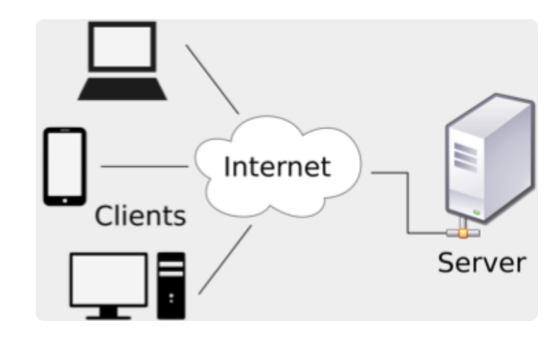
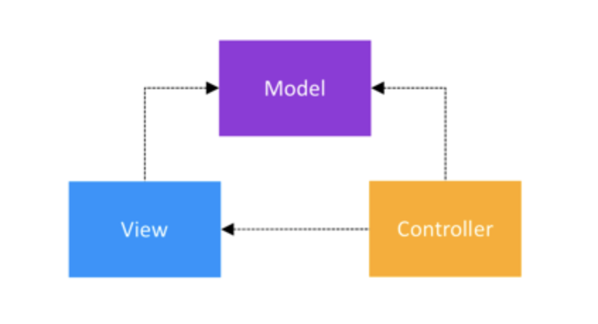
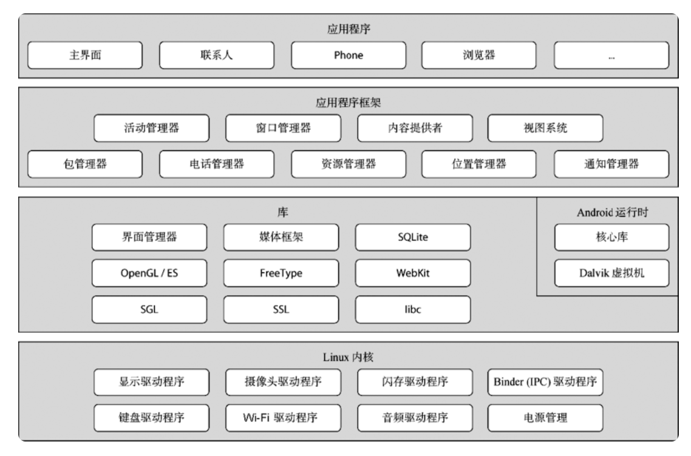
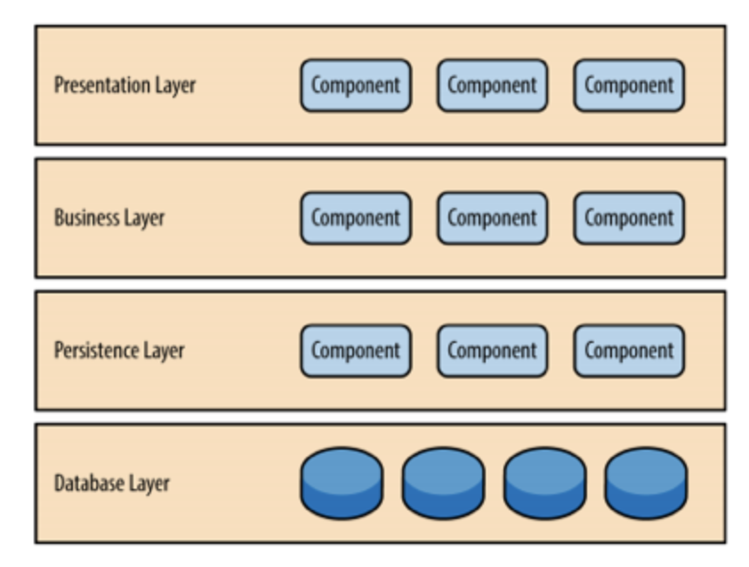
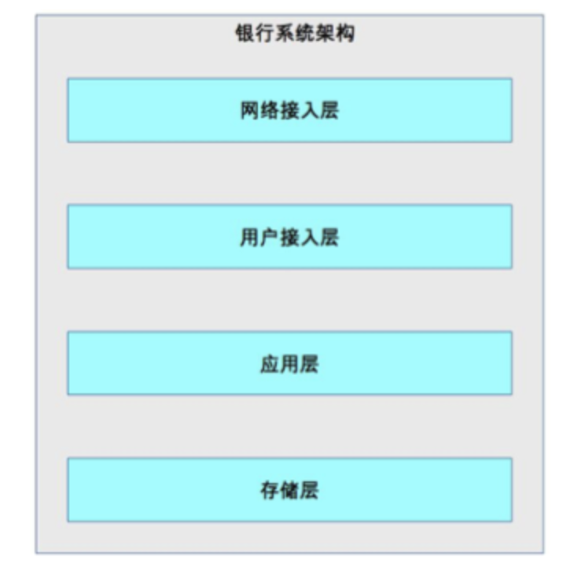
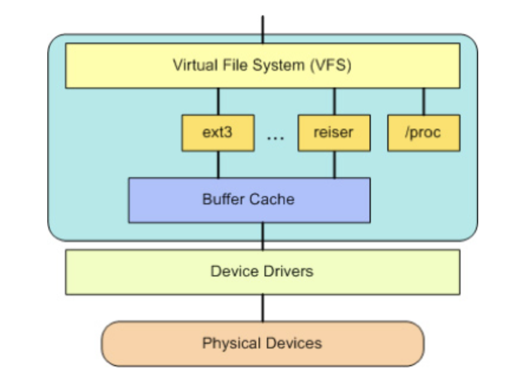
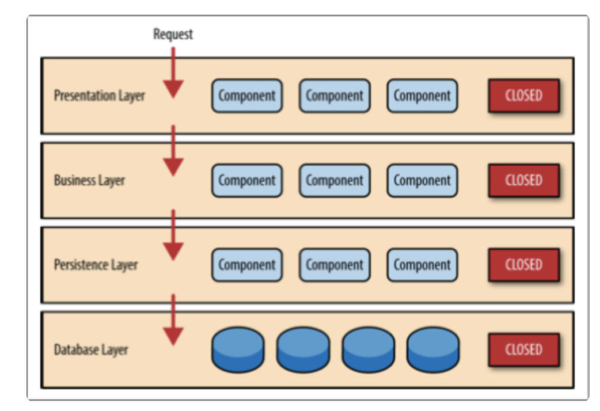
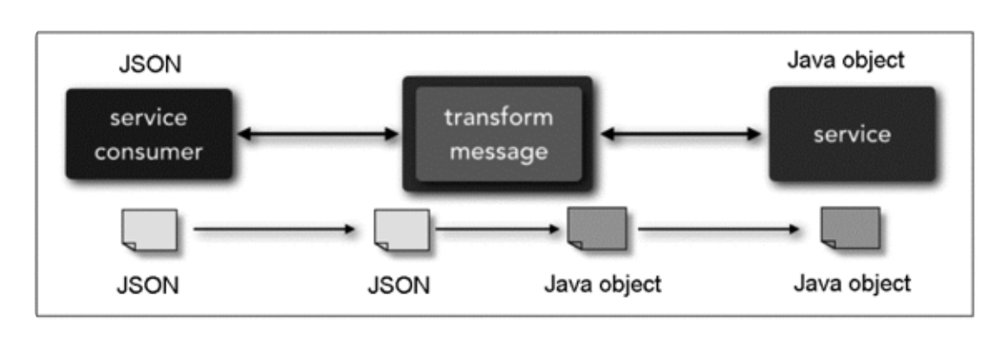
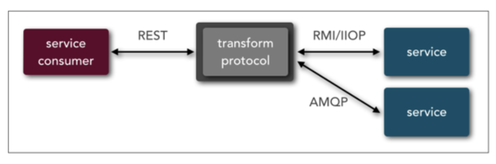

# 0402. 传统的可扩展架构模式：分层架构和 SOA

李运华 2018-07-12

相比于高性能、高可用架构模式在最近几十年的迅猛发展来说，可扩展架构模式的发展可以说是步履蹒跚，最近几年火热的微服务模式算是可扩展模式发展历史中为数不多的亮点，但这也导致了现在谈可扩展的时候必谈微服务，甚至微服务架构都成了架构设计的银弹，高性能也用微服务、高可用也用微服务，很多时候这样的架构设计看起来高大上，实际上是大炮打蚊子，违背了架构设计的「合适原则」和「简单原则」。为了帮助你在实践中更好的进行可扩展架构设计，我将分别介绍几种可扩展架构模式，指出每种架构模式的关键点和优缺点。今天我来介绍传统的可扩展模式，包括分层架构和 SOA，后面还会介绍微服务架构。

## 2.1 分层架构

分层架构是很常见的架构模式，它也叫 N 层架构，通常情况下，N 至少是 2 层。例如，C/S 架构、B/S 架构。常见的是 3 层架构（例如，MVC、MVP 架构）、4 层架构，5 层架构的比较少见，一般是比较复杂的系统才会达到或者超过 5 层，比如操作系统内核架构。按照分层架构进行设计时，根据不同的划分维度和对象，可以得到多种不同的分层架构。

1、C/S 架构、B/S 架构。划分的对象是整个业务系统，划分的维度是用户交互，即将和用户交互的部分独立为一层，支撑用户交互的后台作为另外一层。例如，下面是 C/S 架构结构图。



2、MVC 架构、MVP 架构。划分的对象是单个业务子系统，划分的维度是职责，将不同的职责划分到独立层，但各层的依赖关系比较灵活。例如，MVC 架构中各层之间是两两交互的：



3、逻辑分层架构。划分的对象可以是单个业务子系统，也可以是整个业务系统，划分的维度也是职责。虽然都是基于职责划分，但逻辑分层架构和 MVC 架构、MVP 架构的不同点在于，逻辑分层架构中的层是自顶向下依赖的。典型的有操作系统内核架构、TCP/IP 架构。例如，下面是 Android 操作系统架构图。



典型的 J2EE 系统架构也是逻辑分层架构，架构图如下：



针对整个业务系统进行逻辑分层的架构图如下：



无论采取何种分层维度，分层架构设计最核心的一点就是需要保证各层之间的差异足够清晰，边界足够明显，让人看到架构图后就能看懂整个架构，这也是分层不能分太多层的原因。否则如果两个层的差异不明显，就会出现程序员小明认为某个功能应该放在 A 层，而程序员老王却认为同样的功能应该放在 B 层，这样会导致分层混乱。如果这样的架构进入实际开发落地，则 A 层和 B 层就会乱成一锅粥，也就失去了分层的意义。

分层架构之所以能够较好地支撑系统扩展，本质在于隔离关注点（separation of concerns），即每个层中的组件只会处理本层的逻辑。比如说，展示层只需要处理展示逻辑，业务层中只需要处理业务逻辑，这样我们在扩展某层时，其他层是不受影响的，通过这种方式可以支撑系统在某层上快速扩展。例如，Linux 内核如果要增加一个新的文件系统，则只需要修改文件存储层即可，其他内核层无须变动。

当然，并不是简单地分层就一定能够实现隔离关注点从而支撑快速扩展，分层时要保证层与层之间的依赖是稳定的，才能真正支撑快速扩展。例如，Linux 内核为了支撑不同的文件系统格式，抽象了 VFS 文件系统接口，架构图如下：



如果没有 VFS，只是简单地将 ext2、ext3、reiser 等文件系统划为「文件系统层」，那么这个分层是达不到支撑可扩展的目的的。因为增加一个新的文件系统后，所有基于文件系统的功能都要适配新的文件系统接口；而有了 VFS 后，只需要 VFS 适配新的文件系统接口，其他基于文件系统的功能是依赖 VFS 的，不会受到影响。

对于操作系统这类复杂的系统，接口本身也可以成为独立的一层。例如，我们把 VFS 独立为一层是完全可以的。而对于一个简单的业务系统，接口可能就是 Java 语言上的几个 interface 定义，这种情况下如果独立为一层，看起来可能就比较重了。例如，经典的 J2EE 分层架构中，Presentation Layer 和 Business Layer 之间如果硬要拆分一个独立的接口层，则显得有点多余了。

分层结构的另外一个特点就是层层传递，也就是说一旦分层确定，整个业务流程是按照层进行依次传递的，不能在层之间进行跳跃。最简单的 C/S 结构，用户必须先使用 C 层，然后 C 层再传递到 S 层，用户是不能直接访问 S 层的。传统的 J2EE 4 层架构，收到请求后，必须按照下面的方式传递请求：



分层结构的这种约束，好处在于强制将分层依赖限定为两两依赖，降低了整体系统复杂度。例如，Business Layer 被 Presentation Layer 依赖，自己只依赖 Persistence Layer。但分层结构的代价就是冗余，也就是说，不管这个业务有多么简单，每层都必须要参与处理，甚至可能每层都写了一个简单的包装函数。我以用户管理系统最简单的一个功能「查看头像」为例。查看头像功能的实现很简单，只是显示一张图片而已，但按照分层分册架构来实现，每层都要写一个简单的函数。比如：

Presentation Layer：

```java
package layer;
   
  /**
   * Created by Liyh on 2017/9/18.
   */
  public class AvatarView {
     public void displayAvatar(int userId){
         String url = AvatarBizz.getAvatarUrl(userId);
   
         //此处省略渲染代码
         return;
     }
  }
```

Business Layer：

```java
package layer;
   
  /**
   * Created by Liyh on 2017/9/18.
   */
  public class AvatarBizz {
     public static String getAvatarUrl(int userId){
         return AvatarDao.getAvatarUrl(userId);
     }
  }
```

Persistence Layer：

```java
package layer;
   
  /**
   * Created by Liyh on 2017/9/18.
   */
  public class AvatarDao {
     public static String getAvatarUrl(int userId) {
       //此处省略具体实现代码，正常情况下可以从MySQL数据库中通过userId查询头像URL即可
         return "http://avatar.csdn.net/B/8/3/1_yah99_wolf.jpg";
     }
  }
```

可以看出 Business Layer 的 AvatarBizz 类的 getAvatarUrl 方法和 Persistence Layer 的 AvatarDao 类的 getAvatarUrl 方法，名称和参数都一模一样。既然如此，我们是否应该自由选择是否绕过分层的约束呢？例如，「查看头像」的示例中，直接让 AvatarView 类访问 AvatarDao 类，不就可以减少 AvatarBizz 的冗余实现了吗？

答案是不建议这样做，分层架构的优势就体现在通过分层强制约束两两依赖，一旦自由选择绕过分层，时间一长，架构就会变得混乱。例如，Presentation Layer 直接访问 Persistence Layer，Business Layer 直接访问 Database Layer，这样做就失去了分层架构的意义，也导致后续扩展时无法控制受影响范围，牵一发动全身，无法支持快速扩展。除此以外，虽然分层架构的实现在某些场景下看起来有些啰嗦和冗余，但复杂度却很低。例如，样例中 AvatarBizz 的 getAvatarUrl 方法，实现起来很简单，不会增加太多工作量。

分层架构另外一个典型的缺点就是性能，因为每一次业务请求都需要穿越所有的架构分层，有一些事情是多余的，多少都会有一些性能的浪费。当然，这里所谓的性能缺点只是理论上的分析，实际上分层带来的性能损失，如果放到 20 世纪 80 年代，可能很明显；但到了现在，硬件和网络的性能有了质的飞越，其实分层模式理论上的这点性能损失，在实际应用中，绝大部分场景下都可以忽略不计。

## 1.2 SOA

SOA 的全称是 Service Oriented Architecture，中文翻译为「面向服务的架构」，诞生于上世纪 90 年代，1996 年 Gartner 的两位分析师 Roy W. Schulte 和 Yefim V. Natis 发表了第一个 SOA 的报告。2005 年，Gartner 预言：到了 2008 年，SOA 将成为 80% 的开发项目的基础。历史证明这个预言并不十分靠谱，SOA 虽然在很多企业成功推广，但没有达到占有绝对优势的地步。SOA 更多是在传统企业（例如，制造业、金融业等）落地和推广，在互联网行业并没有大规模地实践和推广。互联网行业推行 SOA 最早的应该是亚马逊，得益于杰弗·贝索斯的远见卓识，亚马逊内部的系统都以服务的方式构造，间接地促使了后来的亚马逊云计算技术的出现。

SOA 出现的背景是企业内部的 IT 系统重复建设且效率低下，主要体现在：1）企业各部门有独立的 IT 系统，比如人力资源系统、财务系统、销售系统，这些系统可能都涉及人员管理，各 IT 系统都需要重复开发人员管理的功能。例如，某个员工离职后，需要分别到上述三个系统中删除员工的权限。2）各个独立的 IT 系统可能采购于不同的供应商，实现技术不同，企业自己也不太可能基于这些系统进行重构。3）随着业务的发展，复杂度越来越高，更多的流程和业务需要多个 IT 系统合作完成。由于各个独立的 IT 系统没有标准的实现方式（例如，人力资源系统用 Java 开发，对外提供 RPC；而财务系统用 C# 开发，对外提供 SOAP 协议），每次开发新的流程和业务，都需要协调大量的 IT 系统，同时定制开发，效率很低。

为了应对传统 IT 系统存在的问题，SOA 提出了 3 个关键概念。

1、服务。所有业务功能都是一项服务，服务就意味着要对外提供开放的能力，当其他系统需要使用这项功能时，无须定制化开发。服务可大可小，可简单也可复杂。例如，人力资源管理可以是一项服务，包括人员基本信息管理、请假管理、组织结构管理等功能；而人员基本信息管理也可以作为一项独立的服务，组织结构管理也可以作为一项独立的服务。到底是划分为粗粒度的服务，还是划分为细粒度的服务，需要根据企业的实际情况进行判断。

2、ESB。ESB 的全称是 Enterprise Service Bus，中文翻译为「企业服务总线」。从名字就可以看出，ESB 参考了计算机总线的概念。计算机中的总线将各个不同的设备连接在一起，ESB 将企业中各个不同的服务连接在一起。因为各个独立的服务是异构的，如果没有统一的标准，则各个异构系统对外提供的接口是各式各样的。SOA 使用 ESB 来屏蔽异构系统对外提供各种不同的接口方式，以此来达到服务间高效的互联互通。

3、松耦合。松耦合的目的是减少各个服务间的依赖和互相影响。因为采用 SOA 架构后，各个服务是相互独立运行的，甚至都不清楚某个服务到底有多少对其他服务的依赖。如果做不到松耦合，某个服务一升级，依赖它的其他服务全部故障，这样肯定是无法满足业务需求的。但实际上真正做到松耦合并没有那么容易，要做到完全后向兼容，是一项复杂的任务。

典型的 SOA 架构样例如下：


SOA 架构是比较高层级的架构设计理念，一般情况下我们可以说某个企业采用了 SOA 的架构来构建 IT 系统，但不会说某个独立的系统采用了 SOA 架构。例如，某企业采用 SOA 架构，将系统分为「人力资源管理服务」「考勤服务」「财务服务」，但人力资源管理服务本身通常不会再按照 SOA 的架构拆分更多服务，也不会再使用独立的一套 ESB，因为这些系统本身可能就是采购的，ESB 本身也是采购的，如果人力资源系统本身重构为多个子服务，再部署独立的 ESB 系统，成本很高，也没有什么收益。

SOA 解决了传统 IT 系统重复建设和扩展效率低的问题，但其本身也引入了更多的复杂性。SOA 最广为人诟病的就是 ESB，ESB 需要实现与各种系统间的协议转换、数据转换、透明的动态路由等功能。例如，下图中 ESB 将 JSON 转换为 Java（摘自《Microservices vs. Service-Oriented Architecture》）。



下图中 ESB 将 REST 协议转换为 RMI 和 AMQP 两个不同的协议：



ESB 虽然功能强大，但现实中的协议有很多种，如 JMS、WS、HTTP、RPC 等，数据格式也有很多种，如 XML、JSON、二进制、HTML 等。ESB 要完成这么多协议和数据格式的互相转换，工作量和复杂度都很大，而且这种转换是需要耗费大量计算性能的，当 ESB 承载的消息太多时，ESB 本身会成为整个系统的性能瓶颈。

当然，SOA 的 ESB 设计也是无奈之举。回想一下 SOA 的提出背景就可以发现，企业在应用 SOA 时，各种异构的 IT 系统都已经存在很多年了，完全重写或者按照统一标准进行改造的成本是非常大的，只能通过 ESB 方式去适配已经存在的各种异构系统。

## 小结

介绍了传统的可扩展架构模式，包括分层架构和 SOA 架构。

## 黑板墙

为什么互联网企业很少采用 SOA 架构？

SOA 是把多个系统整合，而微服务是把单个系统拆开来，方向正好相反。作者回复：言简意赅。2018-07-19

SOA 是集成的思想，是解决服务孤岛打通链条，是无奈之举。esb 集中化的管理带来了性能不佳，厚重等问题。也无法快速扩展。不适合互联网的业务特点。作者回复：赞同。2018-07-18

为什么互联网不用 SOA？1）互联网企业，通常比较年轻，没有那么多异构系统，技术是公司的关键；如果有整合或者服务化的需求，公司有人也有钱专门搞这个；拆到重做/重构很平常；相反的，传统企业，举个例子：某传统炼钢国企：有多个遗留 .net 系统，有几个实习生做的 java 系统，有基于数据库 procedure 的系统；有各种已经倒闭了的第三方企业的系统等等；企业领导不会有精力和想法全部推倒重来，只会花钱请第三方，成本越低越好；这个时候就需要 ESB 这种总线。2）传统企业 IT 追求的是「需求灵活，变更快」，而互联网企业追求性能，传统 soa 性能不佳。传统的 esb，说实话，使用 webservice 以及 soap 这种基于 xml 的技术；wsdl 这东西是真的难用，难学难用难维护；结构冗杂。3）soa 这个东西很多时候只是一个概念，而不是实践。个人觉得，现在的微服务，更像是 soa 思想的一个落地（相比 esb）。作者回复：分析的很好，微服务和 SOA 的关系后面会讲。2018-07-12

回答问题：文中也说了，soa 是特定历史条件下的产物，为了适配各种异构的 it 系统，而有如此多系统的自然是变化减少且稳定的传统企业。互联网企业的特点就是小，新，快。没有历史包袱，变化快，大部分是从单体演进到分布式，技术栈一脉相承或者在分布式之前已经从 php,ruby 等改造到 java 等了。而到了分布式之后，面对不断的耦合，系统复杂度的陡增，这时一个 soa 的特例微服务出现了。实际上 soa 的思想还在，只不过实现的方式不一样了。作者回复：关于 soa 和微服务的关系，我会特别讲述。2018-07-12

一直不明白 SOA 和微服务的具体区别，知道作者讲到了 ESB 的功能，原来就是适配各种协议，顿时明白了！SOA 是为了适配老系统。作者回复：是的，所以 SOA 不适合创新型的互联网企业，比较适合传统大企业。2019-10-25

在传统企业从原先的手工作业转为采用 IT 系统作业的过程中，大多是采用向外采购的方式逐步实现的，在这个过程中不同部门采购系统的实现语言、通信协议并不完全相同，但为提升运行效率又要能够做到企业内部信息互通、相互协作，这是 soa 诞生的背景。而互联网企业是新创的企业，没有这么多的历史包袱，同时出于快速迭代的要求，有时会自建所需的系统，即使是对外采购，也会选择和已有系统对接方便的系统，从根本上避免了相关问题，因而 soa 在互联网公司中使用不多。作者回复：赞同。2018-09-09

SOA 更像一种架构理念，不够具体。在传统企业的 IT 系统中落地为 ESB，主要是为了集成异构系统。因为传统企业特别是大型企业的历史长，在其发展过程中自己开发或采购了不少异构系统。而互联网企业历史都短（腾讯 98 年，阿里 99 年，百度 2000 年），很少有遗留异构系统（像阿里的系统绝大部分应该都是 Java 开发的吧？)。像阿里这种互联网大型企业的痛点是随着业务越来越多，整个系统成了个巨无霸（可能是数以千记的模块数），模块之间的调用像蜘蛛网，极大降低了开发、测试、部署、运维的效率，所以把庞大的业务逻辑层又切分成了业务更独立的应用层和公共功能模块组成服务层。接下来一是要提供应用层与服务层之间、服务层内部服务之间的高效通信机制，二是要对大量的服务进行治理，于是分布式服务框架出现了（阿里就出了 Dubbo 和 HSF 两个服务框架？）。感觉在大型互联网企业，SOA 实际是落地为分布式服务框架，它更像是微服务架构的一个雏形，服务框架提供的功能实际也是微服务架构里必不可少的功能。作者回复：确实也有人将 SOA 理解为一个思想，微服务理解为 SOA 的具体实现。2019-05-04

soa 解决的是资源的重复利用，它的拆分粒度比较大，比如财务系统跟 oa 系统的员工模块。互联网企业有几种情况：1）初创公司，这种公司一般会有试错的过程，需要技术快速实现业务落地，这种情况下使用 SOA 不适合快速敏捷迭代开发。2）对于成熟的互联网业务来说，需要解决的是是高并发，高性能和高存储等一系列问题，对于这类企业来说，使用 SOA 拆分不能解决太多问题，还得做更加细粒度的拆分。作者回复：分析到位。2018-08-21

其实，个人理解的传统 SOA 和 ESB 在互联网企业之所以不怎么使用主要原因就是中心化的 ESB 架构会逐渐成为性能、可用性、可扩展性的瓶颈。但是 SOA 的思想本身是没有什么问题的。互联网企业中用的微服务甚至最近很火的 Service Mesh 都可以看成是 SOA、ESB 的变形。比如 Service Mesh 也可以看成是一个去中心化的 ESB。作者回复：这也是一种理解方式吧，微服务基础设施做完，确实感觉是做了一个 ESB。2018-07-18

互联网行业很少采用 soa，感觉有两点原因：1）soa 主要是解决异构系统之间的集成，传统企业有大量的异构系统，而互联网属于新兴行业，不存在大量的异构系统需要集成，2）esb 存在性能的瓶颈和不易扩展的问题，无法应对互联网这种业务会快速增长场景。作者回复：赞同。2018-07-12

第一章说 MVC 是开发规范，本章节说 MVC 是分层架构，不太明白，这两 MVC 说的不是一个东西吗，还是出发点不同。作者回复：按照 MVC 开发规范的系统就是 MVC 架构，这个是逻辑上的架构。2019-02-15

ESB 太重了，一般的互联网企业无福消受，性价比低。作者回复：其实现在微服务全套搞下来，不见得比 ESB 简单了，ESB 的核心问题是所有东西都在一套系统里面。2020-03-30

感觉 ESB 就像一个集中式的网关一样…...作者回复：是的，不单是网关，是整个微服务基础组件都在里面。2020-02-23

我对 soa 一直是不太清楚，其中 ESB 是不是可以理解为我们用的 dubbo，soa 可不可以理解为把项目进行粗力度的拆分，通过 dubbo 或者 http 协议向外提供服务。作者回复: dubbo 不是 ESB，dubbo 是统一的协议，ESB 需要兼容和适配很多协议。soa 主要不是为了拆分，而是将已经存在的异构系统整合起来。2018-07-17

之前还以为 SOA 在互联网很流行呢，没想到根本不用啊。作者回复：用得少，都用微服务了。2018-07-17

不知道大家为什么总是提到 esb 的问题，从文章中可以看到 esb 的出现也是无奈之举，互联网完全可以做到统一，不需要 esb，而且 soa 只是在功能分解上面的发展，而按照功能分解实现是很早就开始的，所以，不明白为什么互联网公司 soa 比较少。作者回复：虽然是无奈，但确实太重量级了，互联网公司 soa 用的少，但微服务做到最后，复杂度和 ESB 其实也差不多了。2018-07-16