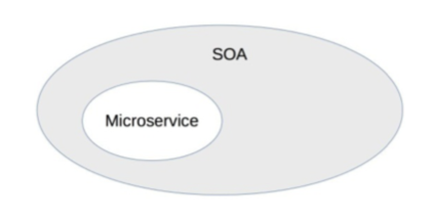
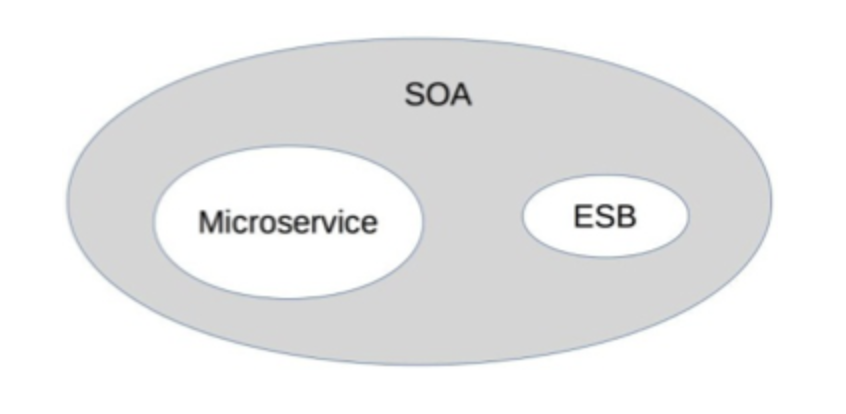
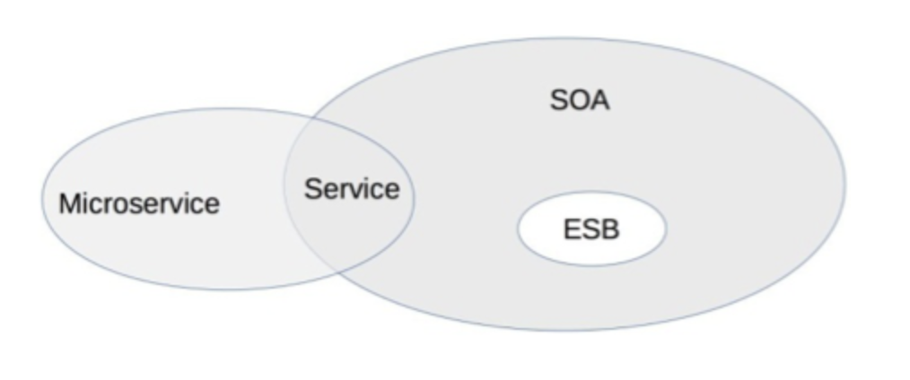
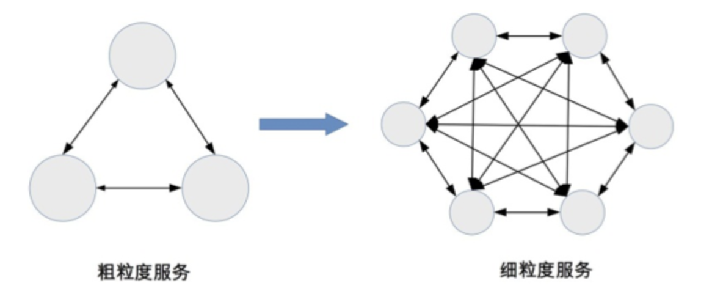
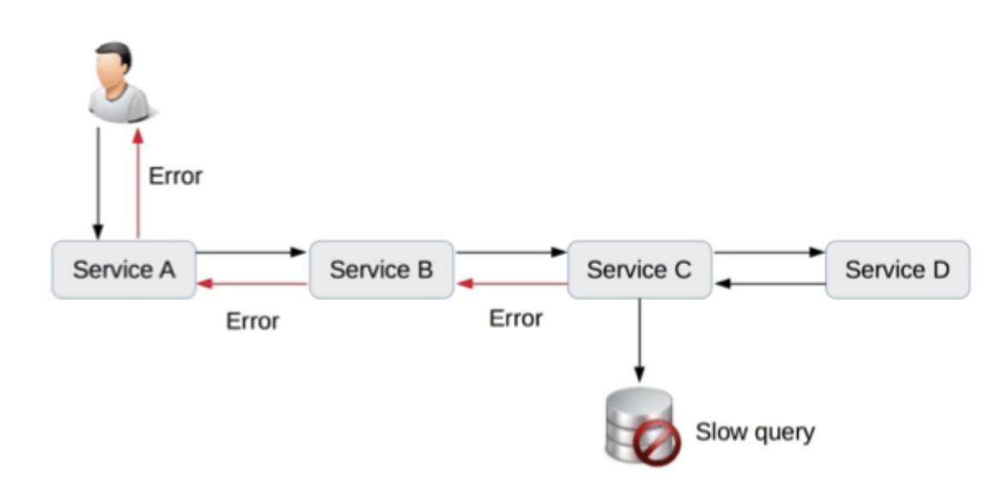
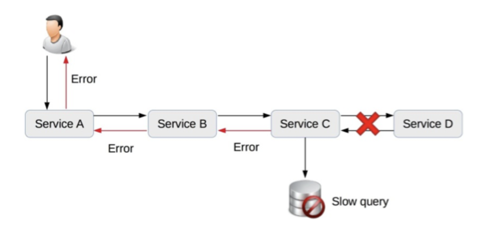

# 0403. 深入理解微服务架构：银弹 or 焦油坑？

李运华 2018-07-14

微服务是近几年非常火热的架构设计理念，大部分人认为是 Martin Fowler 提出了微服务概念，但事实上微服务概念的历史要早得多，也不是 Martin Fowler 创造出来的，Martin 只是将微服务进行了系统的阐述「[Microservices](https://martinfowler.com/articles/microservices.html)」。不过不能否认 Martin 在推动微服务起到的作用，微服务能火，Martin 功不可没。

微服务的定义相信你早已耳熟能详，参考维基百科，我就来简单梳理一下微服务的历史吧：

2005 年：Dr. Peter Rodgers 在 Web Services Edge 大会上提出了「Micro-Web-Services」的概念。

2011 年：一个软件架构工作组使用了「microservice」一词来描述一种架构模式。

2012 年：同样是这个架构工作组，正式确定用「microservice」来代表这种架构。

2012 年：ThoughtWorks 的 James Lewis 针对微服务概念在 QCon San Francisco 2012 发表了演讲。

2014 年：James Lewis 和 Martin Fowler 合写了关于微服务的一篇学术性的文章，详细阐述了微服务。

1-2『 2014 年的那篇文章就是前面的那个原文链接，一定要去研读。（2020-11-20）』——未完成

由于微服务的理念中也包含了「服务」的概念，而 SOA 中也有「服务」的概念，我们自然而然地会提出疑问：微服务与 SOA 有什么关系？有什么区别？为何有了 SOA 还要提微服务？这几个问题是理解微服务的关键，否则如果只是跟风拿来就用，既不会用，也用不好，用了不但没有效果，反而还可能有副作用。今天我们就来深入理解微服务，到底是银弹还是焦油坑。

## 3.1 微服务与 SOA 的关系

对于了解过 SOA 的人来说，第一次看到微服务这个概念肯定会有所疑惑：为何有了 SOA 还要提微服务呢？等到简单看完微服务的介绍后，可能很多人更困惑了：这不就是 SOA 吗？关于 SOA 和微服务的关系和区别，大概分为下面几个典型的观点。

1、微服务是 SOA 的实现方式。如下图所示，这种观点认为 SOA 是一种架构理念，而微服务是 SOA 理念的一种具体实现方法。例如，「微服务就是使用 HTTP、RESTful 协议来实现 ESB 的 SOA」「使用 SOA 来构建单个系统就是微服务」和「微服务就是更细粒度的 SOA」。

2、微服务是去掉 ESB 后的 SOA。如下图所示，这种观点认为传统 SOA 架构最广为人诟病的就是庞大、复杂、低效的 ESB，因此将 ESB 去掉，改为轻量级的 HTTP 实现，就是微服务。

3、微服务是一种和 SOA 相似但本质上不同的架构理念。如下图所示，这种观点认为微服务和 SOA 只是有点类似，但本质上是不同的架构设计理念。相似点在于下图中交叉的地方，就是两者都关注「服务」，都是通过服务的拆分来解决可扩展性问题。本质上不同的地方在于几个核心理念的差异：是否有 ESB、服务的粒度、架构设计的目标等。

以上观点看似都有一定的道理，但都有点差别，到底哪个才是准确的呢？单纯从概念上是难以分辨的，我来对比一下 SOA 和微服务的一些具体做法，再来看看到底哪一种观点更加符合实际情况。

1、服务粒度。整体上来说，SOA 的服务粒度要粗一些，而微服务的服务粒度要细一些。例如，对一个大型企业来说，「员工管理系统」就是一个 SOA 架构中的服务；而如果采用微服务架构，则「员工管理系统」会被拆分为更多的服务，比如「员工信息管理」「员工考勤管理」「员工假期管理」和「员工福利管理」等更多服务。

2、服务通信。SOA 采用了 ESB 作为服务间通信的关键组件，负责服务定义、服务路由、消息转换、消息传递，总体上是重量级的实现。微服务推荐使用统一的协议和格式，例如，RESTful 协议、RPC 协议，无须 ESB 这样的重量级实现。Martin Fowler 将微服务架构的服务通讯理念称为「Smart endpoints and dumb pipes」，简单翻译为「聪明的终端，愚蠢的管道」。之所以用「愚蠢」二字，其实就是与 ESB 对比的，因为 ESB 太强大了，既知道每个服务的协议类型（例如，是 RMI 还是 HTTP），又知道每个服务的数据类型（例如，是 XML 还是 JSON），还知道每个数据的格式（例如，是 2017-01-01 还是 01/01/2017），而微服务的「dumb pipes」仅仅做消息传递，对消息格式和内容一无所知。

3、服务交付。SOA 对服务的交付并没有特殊要求，因为 SOA 更多考虑的是兼容已有的系统；微服务的架构理念要求「快速交付」，相应地要求采取自动化测试、持续集成、自动化部署等敏捷开发相关的最佳实践。如果没有这些基础能力支撑，微服务规模一旦变大（例如，超过 20 个微服务），整体就难以达到快速交付的要求，这也是很多企业在实行微服务时踩过的一个明显的坑，就是系统拆分为微服务后，部署的成本呈指数上升。

4、应用场景。SOA 更加适合于庞大、复杂、异构的企业级系统，这也是 SOA 诞生的背景。这类系统的典型特征就是很多系统已经发展多年，采用不同的企业级技术，有的是内部开发的，有的是外部购买的，无法完全推倒重来或者进行大规模的优化和重构。因为成本和影响太大，只能采用兼容的方式进行处理，而承担兼容任务的就是 ESB。微服务更加适合于快速、轻量级、基于 Web 的互联网系统，这类系统业务变化快，需要快速尝试、快速交付；同时基本都是基于 Web，虽然开发技术可能差异很大（例如，Java、C++、.NET 等），但对外接口基本都是提供 HTTP、RESTful 风格的接口，无须考虑在接口层进行类似 SOA 的 ESB 那样的处理。

综合上述分析，我将 SOA 和微服务对比如下：

对比维度 | SOA | 微服务
|---|---|---|
| 服务粒度 | 粗 | 细 |
| 服务通信 | 重量级、ESB | 轻量级，如 RESTful |
| 服务交付 | 慢 | 快 |
| 应用场景 | 企业级 | 互联网 |

因此，我们可以看到，SOA 和微服务本质上是两种不同的架构设计理念，只是在「服务」这个点上有交集而已，因此两者的关系应该是上面第三种观点。其实，Martin Fowler 在他的微服务文章中，已经做了很好的提炼：

In short, the microservice architectural style is an approach to developing a single application as a suite of small services, each running in its own process and communicating with lightweight mechanisms, often an HTTP resource API. These services are built around business capabilities and independently deployable by fully automated deployment machinery.

上述英文的三个关键词分别是：small、lightweight、automated，基本上浓缩了微服务的精华，也是微服务与 SOA 的本质区别所在。

2『微服务，做一张术语卡片。』——已完成

通过前面的详细分析和比较，似乎微服务本质上就是一种比 SOA 要优秀很多的架构模式，那是否意味着我们都应该把架构重构为微服务呢？其实不然，SOA 和微服务是两种不同理念的架构模式，并不存在孰优孰劣，只是应用场景不同而已。我们介绍 SOA 时候提到其产生历史背景是因为企业的 IT 服务系统庞大而又复杂，改造成本很高，但业务上又要求其互通，因此才会提出 SOA 这种解决方案。如果我们将微服务的架构模式生搬硬套到企业级 IT 服务系统中，这些 IT 服务系统的改造成本可能远远超出实施 SOA 的成本。

## 3.2 微服务的陷阱

单纯从上面的对比来看，似乎微服务大大优于 SOA，这也导致了很多团队在实践时不加思考地采用微服务 —— 既不考虑团队的规模，也不考虑业务的发展，也没有考虑基础技术的支撑，只是觉得微服务很牛就赶紧来实施，以为实施了微服务后就什么问题都解决了，而一旦真正实施后才发现掉到微服务的坑里面去了。我们看一下微服务具体有哪些坑：

1、服务划分过细，服务间关系复杂。服务划分过细，单个服务的复杂度确实下降了，但整个系统的复杂度却上升了，因为微服务将系统内的复杂度转移为系统间的复杂度了。从理论的角度来计算，n 个服务的复杂度是 `n×(n-1)/2`，整体系统的复杂度是随着微服务数量的增加呈指数级增加的。下图形象了说明了整体复杂度：

粗粒度划分服务时，系统被划分为 3 个服务，虽然单个服务较大，但服务间的关系很简单；细粒度划分服务时，虽然单个服务小了一些，但服务间的关系却复杂了很多。

2、服务数量太多，团队效率急剧下降。微服务的「微」字，本身就是一个陷阱，很多团队看到「微」字后，就想到必须将服务拆分得很细，有的团队人员规模是 5-6 个人，然而却拆分出 30 多个微服务，平均每个人要维护 5 个以上的微服务。这样做给工作效率带来了明显的影响，一个简单的需求开发就需要涉及多个微服务，光是微服务之间的接口就有 6-7 个，无论是设计、开发、测试、部署，都需要工程师不停地在不同的服务间切换。1）开发工程师要设计多个接口，打开多个工程，调试时要部署多个程序，提测时打多个包。2）测试工程师要部署多个环境，准备多个微服务的数据，测试多个接口。3）运维工程师每次上线都要操作多个微服务，并且微服务之间可能还有依赖关系。

3、调用链太长，性能下降。由于微服务之间都是通过 HTTP 或者 RPC 调用的，每次调用必须经过网络。一般线上的业务接口之间的调用，平均响应时间大约为 50 毫秒，如果用户的一起请求需要经过 6 次微服务调用，则性能消耗就是 300 毫秒，这在很多高性能业务场景下是难以满足需求的。为了支撑业务请求，可能需要大幅增加硬件，这就导致了硬件成本的大幅上升。

4、调用链太长，问题定位困难。系统拆分为微服务后，一次用户请求需要多个微服务协同处理，任意微服务的故障都将导致整个业务失败。然而由于微服务数量较多，且故障存在扩散现象，快速定位到底是哪个微服务故障是一件复杂的事情。下面是一个典型样例。

Service C 的数据库出现慢查询，导致 Service C 给 Service B 的响应错误，Service B 给 Service A 的响应错误，Service A 给用户的响应错误。我们在实际定位时是不会有样例图中这么清晰的，最开始是用户报错，这时我们首先会去查 Service A。导致 Service A 故障的原因有很多，我们可能要花半个小时甚至 1 个小时才能发现是 Service B 返回错误导致的。于是我们又去查 Service B，这相当于重复 Service A 故障定位的步骤…… 如此循环下去，最后可能花费了几个小时才能定位到是 Service C 的数据库慢查询导致了错误。如果多个微服务同时发生不同类型的故障，则定位故障更加复杂，如下图所示。

Service C 的数据库发生慢查询故障，同时 Service C 到 Service D 的网络出现故障，此时到底是哪个原因导致了 Service C 返回 Error 给 Service B，需要大量的信息和人力去排查。

5、没有自动化支撑，无法快速交付。如果没有相应的自动化系统进行支撑，都是靠人工去操作，那么微服务不但达不到快速交付的目的，甚至还不如一个大而全的系统效率高。例如：1）没有自动化测试支撑，每次测试时需要测试大量接口。2）没有自动化部署支撑，每次部署 6-7 个服务，几十台机器，运维人员敲 shell 命令逐台部署，手都要敲麻。3）没有自动化监控，每次故障定位都需要人工查几十台机器几百个微服务的各种状态和各种日志文件。

6、没有服务治理，微服务数量多了后管理混乱。信奉微服务理念的设计人员总是强调微服务的 lightweight 特性，并举出 ESB 的反例来证明微服务的优越之处。但具体实践后就会发现，随着微服务种类和数量越来越多，如果没有服务治理系统进行支撑，微服务提倡的 lightweight 就会变成问题。主要问题有：1）服务路由：假设某个微服务有 60 个节点，部署在 20 台机器上，那么其他依赖的微服务如何知道这个部署情况呢？2）服务故障隔离：假设上述例子中的 60 个节点有 5 个节点发生故障了，依赖的微服务如何处理这种情况呢？3）服务注册和发现：同样是上述的例子，现在我们决定从 60 个节点扩容到 80 个节点，或者将 60 个节点缩减为 40 个节点，新增或者减少的节点如何让依赖的服务知道呢？如果以上场景都依赖人工去管理，整个系统将陷入一片混乱，最终的解决方案必须依赖自动化的服务管理系统，这时就会发现，微服务所推崇的「lightweight」，最终也发展成和 ESB 几乎一样的复杂程度。

## 黑板墙

你们的业务有采用微服务么？谈谈具体实践过程中有什么经验和教训。

我们公司的实践是比较粗粒度的子系统或服务，基本上没有太细粒度的微服务，以 webapi 为主。感觉更像微服务架构，只是服务粒度比较粗，从概念上算是 SOA 还是微服务架构呢？作者回复：我理解算微服务，千万不要理解为微服务就是将服务拆的很细，后面有具体实践技巧介绍这部分。2018-08-10

对于一个新事物的诞生，本能地套用已有的知识。特别是一个并不简单的东西，这算是一种高效的入门方法。微服务架构其实相当复杂，我是分成好几个阶段理解。1）第一阶段，微服务架构就是去掉了 ESB 的 SOA 架构，只不过是通信的方式和结构变了。对于初级的使用者而言，这样理解没有太大问题。2）第二阶段，没有了 ESB，原本很多由 ESB 组件做的事儿，转到服务的提供者和调用者这里了。他们需要考虑服务的拆分粒。大体仍然算是 SOA 架构。3）第三阶段，随着服务的数量大幅增加，服务的管理越来越困难，此时 DevOps 出现了。这个阶段的微服务架构，已经是跟 SOA 架构完全不同的东西了。

之前给一家大国企分享过一些经验。他们想从传统架构，转向微服务架构。1）建设好基础设施，RPC、服务治理、日志、监控、持续集成、持续部署、运维自动化是基本的，其它包括服务编排、分布式追踪等。2）要逐步演进和迭代，不要过于激进，更不要拆分过细，拆分的粒度，要与团队的架构相互匹配。（康威定律）3）微服务与数据库方面，是个很大的难点，可以深入了解下领域驱动设计，做好领域建模，特别是数据库要随着服务一起拆分。说完上面这些，他们的研发负责人说，我说的跟他们的架构师说的不一样，他们的架构师说，微服务就是各种拆分，不顾一切地拆分。作者回复：他们架构师是水货，你的理解和分析是对的，后一篇就讲了。2018-07-16

之前一家公司搞了一次完整的微服务改造，享受到了一些好处，但是文中说到的问题，大部分都碰上了。先说下好处，原来的单体应用都服务化了，扩容简单很多。功能隔离后之前一个 bug 导致系统挂掉的现象没了。问题责任定位划分的更清楚，比如之前大量慢 sql 无人管，现在通过监控快速找到开发责任人。再说下坏处，1）服务太多了，人不够啊。之前的架构师按照小的原则，把数据层，服务层，应用层严格拆分。一个人手上超过 10 几个服务。2）服务化不彻底，太多事手工干。服务监控只能监控一半指标，各种远程调用异常没人解决。运维只有打包发布做了自动化。可以想象下开发人员基本下改 bug 和发布的死循环中。服务网关没有，服务调用就是一张密密麻麻的网。3）培训不到位，直接上阵，开发人员对微服务理解不到位，服务质量可想而知。没有专职测试，自动化测试靠开发写脚本，谁有空啊，单元测试能写一个就算相当有觉悟了。总结下来，做服务化改造首先问自己这些问题，业务真的需要微服务来解决吗？真的所有模块的问题都要微服务来解决吗？技术人员的配置和水平达到要求了吗？2018-07-14

我们是一家社交公司，后端加厚的演变符合 dubbo 官网的那张图，在 Mvc 架构坚持了一年后，业务越来越大，工程越来越臃肿。后面我们一致同意进行服务话，开始用了 dubbo。后面由于决策层的原因没有上，后面来了个架构师，又重启了服务拆分，到现在已经用于生产。我们使用的是 Spring cloud，现在拆分暴露了很多问题：1）个别服务没有熔断出来，出现过雪崩效应。2）服务拆分过细，服务调用链过长。3）开发人员能力不一样，代码水平不一样。4）没有监控措施。5）每个服务部署多台，日志查询就会死人的感觉。6）开发过程中经常出现访问不到该访问的接口，这是因为开发人员经常启动本地服务，就会导致 30% 的概率访问不到。7）使用了不合理的持久层框架，使用了 JPA 访问。大概就有上面的问题，总之微服务不是银弹，用得不好会发现无穷无尽的坑。当然，出现问题解决问题就是了。唯一的就像 CEO 说的：你们他妈的是完全在拿用户当小白鼠使用。2018-07-16

我们目前全部微服务，踩坑踩了不少，拆分服务同时要把自动化运维系统和多维度监控系统，包括问题定位跟踪系统建立起来，要不然拆了就是噩梦。作者回复：感同身受啊。2018-08-17

说到微服务，切分的粒度和基础设施都致关重要。经历的项目有创业初期的单体服务，也有不太完善的服务切分的系统，也有微服务基础设施相对完善的公司。单体服务致命就致命在随着项目的发展，项目会越来越臃肿，越不利于扩展开发。微服务过程怕就怕基础不完善，人员配备不够盲目切分，导致工程师开发和维护的战线拉长，特别疲惫和泄气，容易产生一种抱怨的大气氛，从而导致微服务失败，重新合并一部分服务。

微服务做的好的，也有所经历，公司的基础设施完全云化和统一管理，申请几台机器，一套缓存集群，一套 mq，sql/nosql…...特别容易，工程师愿意建独立的工程，因为很容易构建和部署。这种感觉有点像 svn 和 git，git 建分支特别轻量，大家都愿意用分支管理自己的代码，迭代开发，应急处理都能自由切换，得心应手。

现在遇到一个问题，就是微服务内部系统大多使用 rpc，但对接外部系统，或者跨外网传输到客户端就需要 http-rest 类的协议。也就是我们常说的网关，如果是纯 http 就很容易做到通用的转发机制，但是 http 转 rpc 就不知道有什么方式可以做到通用转发了，内部每增加一个 rpc，网关就需要增加一个对应的服务处理逻辑。不知道，这个问题，有没有好的解决办法？作者回复：把 HTTP 转 RPC 做成规则，别硬编码每个接口，例如，规定 HTTP URL 为 `/service/interface/method?para1=xxx&para2=yyy`。2018-07-16

我们公司的平台就是使用微服务架构，十多二十个微服务，但是没有自动化部署，监控，自动化测试这些，而且每次报错日志也特别难找，但是我们那架构师却不重视这些，只想继续升级平台的功能。2018-07-15

我们项目之前是把数据采集，和展示都是我们 Java 组去写的。后面公司为了统一，把采集部分交给了.net 组。我们 Java 只负责数据展示。但是我们这边又按照领导的要求把整个业务拆分为模板解析层 —> api 层 —> 终端层。现在每次最烦的事就是找 bug。一直感觉现阶段我们的任务和目标没有这么庞大，这与架构中的简单和合适原则想违背。搞的整个项目组一直在反复的开发工作中。都很心累。2018-09-18

我们的业务也算是微服务吧，接手项目时，已经有好多服务，主要采用的语言有 java，php，nodejs，存在以下问题：1）没有一个统一的网关服务，前端请求后端服务都需要后端的服务 A 来充当安全校验，权限校验等，A 服务充当了多重职责，变的职责不明确了，后来抽出网关系统，负责平台统一的流量入口。在构建微服务网关系统是至关重要的。2）监控系统不完善，调用链跟踪，异常报警都不完善，对微服务是巨坑，查找问题如同一场噩梦，调用链很长，一旦发生异常不知道到底哪里出现问题，得一个一个去找。后来慢慢完善，变得好了很多，问题很快定位。3）加入网关后，没有一个统一的服务发现注册中心，网关的路由依靠人工手动配置，变的很麻烦，也很容易出错。后来引入 consul，得到改善。作者回复：spring 全家桶，你值得拥有。2018-07-14

16 年时，架构师引入了微服务架构，架构设计分为三层：网关层、业务处理层、数据处理层（getaway —> ls —> ds），自上而下依赖，业务层之间也互相依赖，构建过程中发现引入了分布式事务和调用链长（调用链的消耗时间无法接受），经常无故报错，定位问题慢，测试复杂等问题，而我们的大多数业务相对简单，所以重新划分服务粒度，分为两层：1）网关层：提供路由功能，2）业务处理层：处理请求，业务层中间可以相互调用，当出现有出现分布式事务时，采取 MQ 或者更新状态的方式解决，如果是充值 + 业务订单的这种会直接在一个事务里处理（其实这里就混乱一点了），层与层之间没有完全隔离，但是将调用链缩短，我觉得采用微服务架构确实解决了单体应用的一些问题，如资源问题（但消耗资源是比以前多的）、耦合问题、快速迭代问题，服务与服务的职责更加清晰，不同的服务粒度设计的系统是天差地别的。作者回复：是的，粒度太重要了。2018-12-11

我个人比较认同康威定律，微服务的拆分粒度一定要和组织结构匹配起来，组织结构和开发管理模式是微服务粒度的最重要参考指标之一。作者回复：是的，康威定律和微服务拆分是相关的。2018-11-08

个人觉得 SOA 只是提出了面向服务的编程，到但没有对服务粒度的定义，以及服务的治理问题做深入的分析。提出微服务主要是为了解决面向服务架构后如何能够在实际工程中带来真正的红利。微服务对 SOA 的技术关键点给出了指导意见。微服务对分布式服务的诱惑力的确很大，但做但微服务都不会免费的，需要很多的基础设施来做铺垫和基石，才有可能搞定。除了基础设施还有很多设计思想需要学习，我觉得 DDD 就是微服务的绝配。作者回复：SOA 是完整的解决方案哦，IBM 等公司卖 ESB 都卖了好多钱。2018-08-09

我弄微服务遇到最大的坑，就是 jvm 与 docker 兼容性不好，导致每个微服务会消耗过多不必要的内存，我感觉从资源消耗上来说，java 开发的微服务都不能算是微服务了，最近在转向 go 来改造。作者回复：这还真是第一次听说 jvm 与 docker 不兼容，看看是不是有 bug。2018-07-14

我记得有一次做业务，当时不知道什么原因，整体使用微服务，当时是个新业务，完全从 0 开始，没有任何用户基础，当时按照业务把服务拆成了 7.8 个微服务，但没有自动化，服务还是部署在一台机器上，服务之间也没有服务治理，服务之间的调用链很长，开发就 4.5 个人，定位问题花费时间长，典型的基础服务也跟不上。现在想想，当时团队不知道咋想的，觉得微服务比较新就上了，完全没有考虑到产生的问题。还好后来这块业务黄了。要不然估计坑更多。对于创业公司来说，刚开始的时候，其实一个服务就够了，真等用户上来了，业务有希望了，那时候再上其他架构模式也不迟，忌讳一开始就求新求全，说到底，对于大部分公司来说。技术是为业务服务的。作者回复：你们缺少一个真正的架构师。2018-08-21

dubbo 和 motan 这类 rpc 框架，是微服务框架？作者回复：dubbo 可以算微服务基础设施的一部分，主要承担服务注册发现等。2018-07-15。我们用的是 dubbo。最开始系统要快速上线，所以服务拆分的不彻底。订单，商品，店铺等这些服务都没有进行拆分。就把支付和营销两个服务拆分出来了。服务拆分不彻底经常导致一个业务有问题。整个系统都用不了。作者回复：不是拆分有问题，是配套基础设施有问题。2018-07-15

我家公司之前在满足现有业务增长规模的情况下，也涉足微服务领域了，其实遇到的问题跟大家也差不多：1）业务拆分问题，大家对服务的理解类似于某个技术框架，让这个技术框架适配现有业务流程和架构就好了，这就有点新瓶装旧酒的味道，对于怎么拆分，大家各执一词，争论不休，尤其在数据库规划上，更是举步维艰，很难有进展，后来才找到一种方法，领域驱动设计（DDD），算是解了燃眉之急。2）技术栈在应对微服务架构的时候，显得心有余而力不足，传统技术栈不会包括服务发现，服务治理，以及调用链分析，在微服务架构上知识结构体系是不全的。3）整个微服务环境甚至文化处于原始阶段，大家都觉得微服务只是一个点上面的事情，比如只是后台的事情，而事实上，这个关乎测试（自动化测试）还有运维（持续集成，持续部署，监控）等，也就是华哥在回复区提到的基础架构部分。4）研发部门的尴尬，由于公司一向偏向于 c++，没有人熟悉 java，所以在落地的时候，就没有 spring 全家桶就能解决所有事情的那种小幸运，而要选择不同的服务组件来满足微服务架构的需求。作者回复：c++ 确实没有合适的全家桶，自己搞投入还是很大的。2020-03-10

我们现有的服务也算是微服务了，也是逐渐演进过来的，微服务不单单是服务的拆分解耦。还包含 devops 自动化部署，自动化监控，服务编排以及各类方便开发人员聚焦到开发上的工具，不要把精力都消耗在那些重复工作中。作者回复：嗯，微服务必须要有基础设施配套，不然很蛋疼。2019-12-12

微服务遇到的坑，不知道算不算。第一个是到底满足什么条件才能算一个微服务，往往是为了拆分而拆分，比如将一个服务拆分成了 ABC 三个微服务，BC 仅仅是为 A 提供服务不具有独立的能力，接口也只是内部接口，对外完全不可见。第二个是微服务内部是有状态的，这就导致了其它访问的时候必须请求到那个实例，对伸缩和可靠性带来了不利的影响。第三个是扩缩容依赖，服务 A 需要扩充一倍，依赖的服务要扩充多少呢？这个往往很难评估准确，曾出现过由于扩充的比例不对导致现网紧急变更。最后是分布式一致性，微服务之间往往需要互相配合来完成某个业务功能，但是由于网络故障或其它原因经常处理不一致。然后通过各种系统定时任务去清理或修正，系统越来越难以理解。作者回复：都算，尤其是最后一个，查起来很麻烦。2019-09-20

非常认同老师的微服务没有基础的治理平台是非常坑的观点，我就亲身经历过，上一家公司是个只有七八个人的小团队，一切都是从零开始，项目经理也挺喜欢研究技术的，当时就是使用 spring 的全家桶来搭建的微服务，开发、测试、部署、运维真是非常费劲。一台机器从编译到部署完启动起来就需要半天功夫，什么都是人肉来处理，效率相当慢。目前的公司基础技术服务比较完善，RPC、MQ、缓存、监控、部署等等都有专门的团队来维护，基本是自研或二次开发，上线部署轻松简单，上几百台也是很轻松容易的，时间主要花费在业务验证上，有一套流程要走。基础服务的使用也比较简单，他们来运维，有需求也可以提。微服务是把双刃剑，用好了能杀敌，用不好会伤己。2019-09-02

服务拆分的粒度太小，造成了一个业务的修改涉及的系统太多，引入了很多系统复杂度，但是又缺少人手，经常造成开发工作量太大，需要同时上线多个服务，缺乏自动化部署，每次测试都要涉及多个系统接口的测试。最大问题是服务无法实现事务的原子性（实现分布式事务代价太高没有采用），造成一个业务异常无法回滚，频繁需要修改数据。服务没有实现治理，造成发生问题时，没有及时发现问题。2019-08-30

我们公司拆分的原因主要是基于现有遗留的老系统太过于庞大，代码结构比较混乱，每次新的需求过来的时候，都会牵一发而动全身，从而有了服务拆分的想法，但是对于当时的服务拆分的粒度，受限于人员数量以及对微服务的理解，根据业务模块做了服务的拆分，但是有一个问题是还是共用的一个库，而且链路监控以及服务治理都还在预研阶段，并没有落地，现在都是哪边遇到坑就去填坑，数据库的拆分以及数据迁移在后面也是一个不得不头痛的问题，请求老师现在的这个情况，您这边有什么好的建议么？作者回复：先完善基础设施。2019-04-18

我在想如果启动一个服务进程 服务里有多线程 每个线程启动一个 vm 虚拟机去执行脚本 一个脚本的 vm 去对应一个微服务 这个部署只需启动一个进程服务器就可以啦 另外一个 vm 对应一个 actor 实体 对应一个微服务 然后用每个 actor 处理自己的消息，通过 rpc 调用是不是可以？部署从外部看是一个整体 从内部看是众多的服务（每个服务对应一个 actor 个体实现相应的功能）。作者回复：akka 框架就是做这事的，但很复杂。2018-12-14

我想问问 HTTP 和 RPC 的调用方式，目前对外接口采用 http，内部服务间调用采用 RPC，不知道有没有问题。作者回复：这是最常见的做法，你可以思考一下为什么对外用 HTTP 对内用 RPC，而不是反过来。2018-11-12

文中说的问题深有体会！服务与服务之间调用失败难以定位，因为这个问题我们也做了服务调用链路日志监控，但还不完善。因为服务拆分数据存储在不同的库，导致统计报表，一些实时查询缓慢。部署耗时 3 个环境，多个服务简直是蛋疼。目前没有自动化部署，自动化测试，后端开发 3 人。因为是新产品试用阶段，根据用户反馈不断修改增加功能。因为没控制好拆分和架构师的指导目前项目显得有点臃肿。基于一路走过来的坑，我感觉新项目开始，需要不明确，功能逻辑反复推翻，未有一套完整的微服务架构。基础设施不完善的情况下不要实施微服务，前期实施单体，业务功能稳定后有一定的微服务经验才实施微服务。作者回复：你们应该是过度设计了。2018-09-26

之前公司把业务是分为几个大系统，通过 hessian 进行通信，请问老师这算是什么架构，这个架构师是支付宝过来的。还有系统间可以直接调用，什么情况下需要 esb，它究竟有什么用？作者回复：你可以这么理解，每个系统对外提供的接口协议都是一样的就是服务拆分，每个系统的接口协议不同，需要中间件来转换，那就是 ESB。2018-08-26

像我们公司这种：产品划分为几个大应用，每个应用暴露出来一系列 rpc 接口，部分公共逻辑拆分为小应用，也是暴露 rpc 接口。系统之间就通过 rpc 交互，中间加个 nginx 做负载均衡；没有服务发现和配置中心，因为接口不是很多，都靠配置文件手工管理。算不算是比较 low 的微服务？作者回复：合适就好，太高逼格可能问题更多，参考架构设计的其中一条原则。2018-08-25

App 后台设计了用户、LBS、商品、UGC、订单 & 支付、活动等微服务，然后由 API 根据不同功能模块串联提供给客户端。服务之间通过 rpc 通信。优点：1）独立部署，性能优化容易。2）便于分工，实现相互独立 & 透明。缺点：1）需求开发沟通成本高（尤其当新增终端时）。2）线上排查问题慢（链路长，多机部署）。作者回复：需要微服务基础设施来解决你的问题。2018-08-03

http 转 rpc 我们卡在了怎么去掉模型和接口这两个骨架代码这里，有没有办法可以不加入骨架代码，按照既定的 url 自动解析，然后转发？或者说只能使用协议解析实现？我们用的 thrift，回头我需要确认一下 thrift 的 protocol 在编解码的时候，有没有写入模型的类型信息，如果没有的话，实现起来感觉不会太复杂，如果包含模型的类型信息，就和骨架代码强耦合了。阿里如何处理的这种情况呢？作者回复：HTTP 协议解析很简单的呀，可以试试，阿里也有 MTOP 承担类似职责。2018-07-17

按照这样说，用 Web API 方式构造的服务，也是属于微服务吗？作者回复：不一定，微服务不单单是将 ESB 改为 HTTP，后面会深入阐述。2018-07-17
