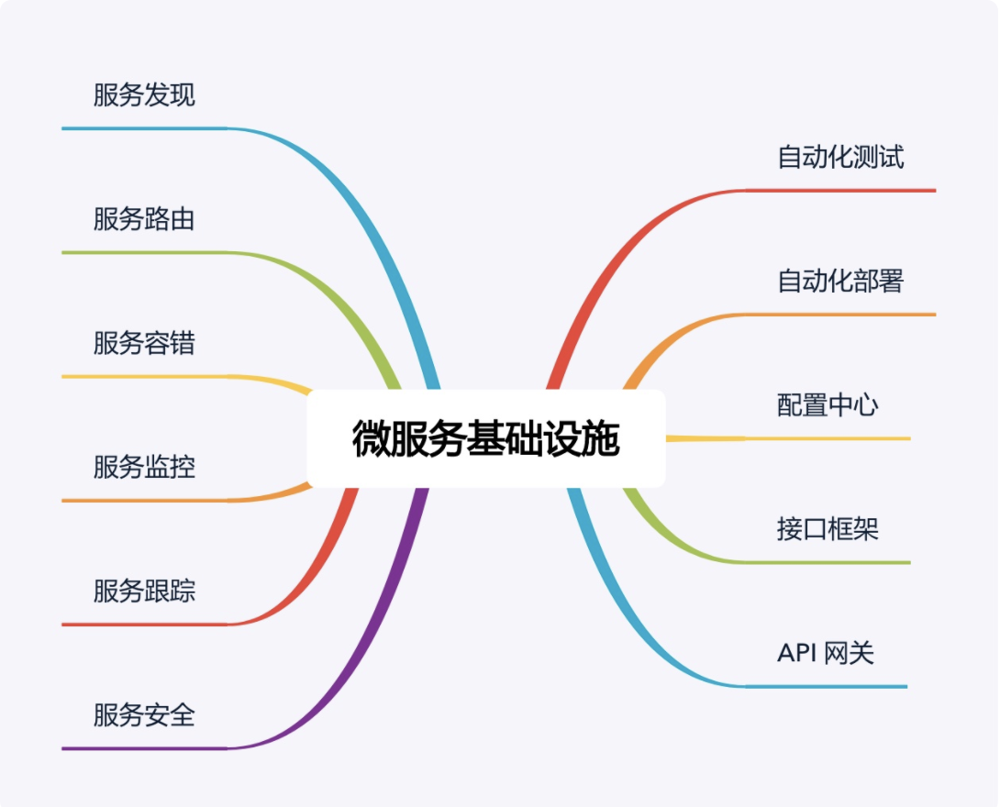

# 0404. 微服务架构最佳实践 —— 方法篇

李运华 2018-07-17

专栏上一期，我谈了实施微服务需要避免踩的陷阱，简单提炼为：1）微服务拆分过细，过分强调「small」。2）微服务基础设施不健全，忽略了「automated」。3）微服务并不轻量级，规模大了后，「lightweight」不再适应。针对这些问题，今天我们看看微服务最佳实践应该如何去做。我会分两期介绍这部分内容，今天是微服务架构最佳实践的方法篇，下一期是基础设施篇。

## 4.1 服务粒度

针对微服务拆分过细导致的问题，我建议基于团队规模进行拆分，类似贝索斯在定义团队规模时提出的「两个披萨」理论（每个团队的人数不能多到两张披萨都不够吃的地步），分享一个我认为微服务拆分粒度的「三个火枪手」原则，即一个微服务三个人负责开发。当我们在实施微服务架构时，根据团队规模来划分微服务数量，如果业务规继续发展，团队规模扩大，我们再将已有的微服务进行拆分。例如，团队最初有 6 个人，那么可以划分为 2 个微服务，随着业务的发展，业务功能越来越多，逻辑越来越复杂，团队扩展到 12 个人，那么我们可以将已有的 2 个微服务进行拆分，变成 4 个微服务。为什么是 3 个人，不是 4 个，也不是 2 个呢？

首先，从系统规模来讲，3 个人负责开发一个系统，系统的复杂度刚好达到每个人都能全面理解整个系统，又能够进行分工的粒度；如果是 2 个人开发一个系统，系统的复杂度不够，开发人员可能觉得无法体现自己的技术实力；如果是 4 个甚至更多人开发一个系统，系统复杂度又会无法让开发人员对系统的细节都了解很深。

其次，从团队管理来说，3 个人可以形成一个稳定的备份，即使 1 个人休假或者调配到其他系统，剩余 2 个人还可以支撑；如果是 2 个人，抽调 1 个后剩余的 1 个人压力很大；如果是 1 个人，这就是单点了，团队没有备份，某些情况下是很危险的，假如这个人休假了，系统出问题了怎么办？

最后，从技术提升的角度来讲，3 个人的技术小组既能够形成有效的讨论，又能够快速达成一致意见；如果是 2 个人，可能会出现互相坚持自己的意见，或者 2 个人经验都不足导致设计缺陷；如果是 1 个人，由于没有人跟他进行技术讨论，很可能陷入思维盲区导致重大问题；如果是 4 个人或者更多，可能有的参与的人员并没有认真参与，只是完成任务而已。

「三个火枪手」的原则主要应用于微服务设计和开发阶段，如果微服务经过一段时间发展后已经比较稳定，处于维护期了，无须太多的开发，那么平均 1 个人维护 1 个微服务甚至几个微服务都可以。当然考虑到人员备份问题，每个微服务最好都安排 2 个人维护，每个人都可以维护多个微服务。

## 4.2 拆分方法

基于「三个火枪手」的理论，我们可以计算出拆分后合适的服务数量，但具体怎么拆也是有技巧的，并不是快刀砍乱麻随便拆分成指定数量的微服务就可以了，也不是只能按照业务来进行拆分，而是可以根据目的的不同灵活地选取不同的拆分方式。接下来我一一介绍常见的拆分方式。

### 4.2.1 基于业务逻辑拆分

这是最常见的一种拆分方式，将系统中的业务模块按照职责范围识别出来，每个单独的业务模块拆分为一个独立的服务。基于业务逻辑拆分虽然看起来很直观，但在实践过程中最常见的一个问题就是团队成员对于「职责范围」的理解差异很大，经常会出现争论，难以达成一致意见。例如：假设我们做一个电商系统，第一种方式是将服务划分为「商品」「交易」「用户」3 个服务，第二种方式是划分为「商品」「订单」「支付」「发货」「买家」「卖家」6 个服务，哪种方式更合理，是不是划分越细越正确？

导致这种困惑的主要根因在于从业务的角度来拆分的话，规模粗和规模细都没有问题，因为拆分基础都是业务逻辑，要判断拆分粒度，不能从业务逻辑角度，而要根据前面介绍的「三个火枪手」的原则，计算一下大概的服务数量范围，然后再确定合适的「职责范围」，否则就可能出现划分过粗或者过细的情况，而且大部分情况下会出现过细的情况。

例如：如果团队规模是 10 个人支撑业务，按照「三个火枪手」规则计算，大约需要划分为 4 个服务，那么「登录、注册、用户信息管理」都可以划到「用户服务」职责范围内；如果团队规模是 100 人支撑业务，服务数量可以达到 40 个，那么「用户登录」就是一个服务了；如果团队规模达到 1000 人支撑业务，那「用户连接管理」可能就是一个独立的服务了。

1『不是很赞同作者按人头拆服务的思路，目前还是觉得按「领域」划分，按领域驱动开发的思想来。但有点得承认，要用好 DDD 的门槛是很高的，必须团队里的人都懂业务。（2020-11-21）』

### 4.2.2 基于可扩展拆分

将系统中的业务模块按照稳定性排序，将已经成熟和改动不大的服务拆分为稳定服务，将经常变化和迭代的服务拆分为变动服务。稳定的服务粒度可以粗一些，即使逻辑上没有强关联的服务，也可以放在同一个子系统中，例如将「日志服务」和「升级服务」放在同一个子系统中；不稳定的服务粒度可以细一些，但也不要太细，始终记住要控制服务的总数量。

这样拆分主要是为了提升项目快速迭代的效率，避免在开发的时候，不小心影响了已有的成熟功能导致线上问题。

### 4.2.3 基于可靠性拆分

将系统中的业务模块按照优先级排序，将可靠性要求高的核心服务和可靠性要求低的非核心服务拆分开来，然后重点保证核心服务的高可用。具体拆分的时候，核心服务可以是一个也可以是多个，只要最终的服务数量满足「三个火枪手」的原则就可以。

这样拆分带来下面几个好处：1）避免非核心服务故障影响核心服务。例如，日志上报一般都属于非核心服务，但是在某些场景下可能有大量的日志上报，如果系统没有拆分，那么日志上报可能导致核心服务故障；拆分后即使日志上报有问题，也不会影响核心服务。2）核心服务高可用方案可以更简单。核心服务的功能逻辑更加简单，存储的数据可能更少，用到的组件也会更少，设计高可用方案大部分情况下要比不拆分简单很多。3）能够降低高可用成本。将核心服务拆分出来后，核心服务占用的机器、带宽等资源比不拆分要少很多。因此，只针对核心服务做高可用方案，机器、带宽等成本比不拆分要节省较多。

### 4.2.4 基于性能拆分

基于性能拆分和基于可靠性拆分类似，将性能要求高或者性能压力大的模块拆分出来，避免性能压力大的服务影响其他服务。常见的拆分方式和具体的性能瓶颈有关，可以拆分 Web 服务、数据库、缓存等。例如电商的抢购，性能压力最大的是入口的排队功能，可以将排队功能独立为一个服务。

以上几种拆分方式不是多选一，而是可以根据实际情况自由排列组合，例如可以基于可靠性拆分出服务 A，基于性能拆分出服务 B，基于可扩展拆分出 C/D/F 三个服务，加上原有的服务 X，最后总共拆分出 6 个服务（A/B/C/D/F/X）。

## 4.3 基础设施

大部分人主要关注的是微服务的「small」和「lightweight」特性，但实际上真正决定微服务成败的，恰恰是那个被大部分人都忽略的「automated」。为何这样说呢？因为服务粒度即使划分不合理，实际落地后如果团队遇到麻烦，自然会想到拆服务或者合服务；如果「automated」相关的基础设施不健全，那微服务就是焦油坑，让研发、测试、运维陷入我上一期讲的各种微服务陷阱中。微服务基础设施如下图所示：

1-2『微服务基础设置内容，上面图内的信息提取：服务发现、服务内容、服务容错、服务监控、服务跟踪、服务安全、自动化测试、自动化部署、配置中心、接口框架、API 网关。做一张术语卡片。』——已完成

看到上面这张图，相信很多人都会倒吸一口凉气，说好的微服务的「轻量级」呢？都这么多基础设施还好意思说自己是「轻量级」，感觉比 ESB 还要复杂啊？

确实如此，微服务并不是很多人认为的那样又简单又轻量级。要做好微服务，这些基础设施都是必不可少的，否则微服务就会变成一个焦油坑，让业务和团队在里面不断挣扎且无法自拔。因此也可以说，微服务并没有减少复杂度，而只是将复杂度从 ESB 转移到了基础设施。你可以看到，「服务发现」「服务路由」等其实都是 ESB 的功能，只是在微服务中剥离出来成了独立的基础系统。

虽然建设完善的微服务基础设施是一项庞大的工程，但也不用太过灰心，认为自己团队小或者公司规模不大就不能实施微服务了。第一个原因是已经有开源的微服务基础设施全家桶了，例如大名鼎鼎的 Spring Cloud 项目，涵盖了服务发现、服务路由、网关、配置中心等功能；第二个原因是如果微服务的数量并不是很多的话，并不是每个基础设施都是必须的。

1『原来这就是之前作者在黑板墙里说的 Spring 全家桶，哈哈。（2020-11-21）』

通常情况下，我建议按照下面优先级来搭建基础设施：1）服务发现、服务路由、服务容错：这是最基本的微服务基础设施。2）接口框架、API 网关：主要是为了提升开发效率，接口框架是提升内部服务的开发效率，API 网关是为了提升与外部服务对接的效率。3）自动化部署、自动化测试、配置中心：主要是为了提升测试和运维效率。4）服务监控、服务跟踪、服务安全：主要是为了进一步提升运维效率。

以上 3 和 4 两类基础设施，其重要性会随着微服务节点数量增加而越来越重要，但在微服务节点数量较少的时候，可以通过人工的方式支撑，虽然效率不高，但也基本能够顶住。

## 黑板墙

参考文章中提到的方法，思考一下你所在的业务微服务架构是否还有可以改进和提升的空间？

感谢老师对微服务解读，有 3 个问题：目前公司有个在线交易系统，大概几百个表的单体服务项目，其他业务前端都远程调用这个项目，现在想做微服务的改造。1）实施微服务按业务职责划分后，是否对应模块的数据库也必须要独立？2）若为每个微服务项目都拆出来新的数据库，原来各业务间的数据依赖（单库的时候 Join 查询就 ok 了），拆分多个项目后，有何好的处理办法？3）团队开发时的问题，由于每小团队负责一个微服务，但开发时需要访问其他微服务，应该有个开发环境负责集成大家提交的代码，构建新版本供其他团队调用和调试，即：开发团队都可以作为消费者访问服务器上微服务（互通），但是开发人员本机启动调试时，不能注册到这台服务器（隔离），这块如何能很好解决？

作者回复：1）需要，微服务需要独立部署独立运行，数据库不拆分做不到这点。2）参考专栏前面分库分表内容。3）开发环境也可以搭建微服务，我们是三套环境：开发，测试，线上。2018-07-18

三个火枪手分前后端吗？作者回复：一般指后端人员，前端人员是多服务公用的，如果用 node 之类的系统，本身可以算一个独立的微服务。2018-07-18

使用 dubbo 体系，开发微服务。那么一个微服务是指一个部署单元 (jar or war) 还是指一个暴露的接口？我的答案是部署单元。作者回复：一个可以独立部署和运行的子系统。2018-07-17

那么对于像 kafka，rabbitmq 这样的对应的消费者服务的消费地址是否应该放置到配置中心动态配置？还是不建议动态修改？作者回复：任何配置都可以放配置中心，区别只是动态配置还是需要重启，中间件也不例外。2018-10-24

看来小企业还是不太适合微服务架构，尤其是开发人员少的？作者回复：是的，等业务发展，人员规模大了再重构，90% 以上的新业务还没发展就挂掉了。2018-07-17

请问「接口框架」是指什么？有无成熟产品可以借鉴，它的作用是什么？API 网关是指通用网关，比如支付宝开放平台网关，还是业务网关呢？我理解的业务网关的职责应该包括协议转换（比如外网的 HTTP 转内部 Dubbo）和业务逻辑。作者回复：下一课就讲了。2018-10-05

咨询老师一个问题：在服务切分的时候会存两个系统间数据发生交集的情况，比如一个是设备系统，另一个是用户系统，用户的各项操作必然发生在设备上，这样就会存在设备和用户的各种关系和操作记录，像这样的数据设备系统和用户系统都希望以自己为准，而后对外提供相应的服务。如果是数据存储两份，设备系统存储设备和用户的关系，用户系统存储用户和设备的关系，那么在数据一致性和调用链路上就会变得复杂；如果只存储一份，放在那个系统上另一个系统都会有意见。对于此种情况，有什么比较好的解法？作者回复：其实你这句话已经包含了答案「用户操作必然发生在设备上」，这就是说设备是基础数据，用户和设备对应关系应该是用户系统管理的。还有一种判断标准是设备数据还可以给其它业务用，如果设备系统存储用户和设备对应关系，这个数据不是通用的，违背了设备系统的职责。2018-09-15

为什么说配置中心可以提升测试和运维的效率，这里不是太理解。作者回复：不用去几十台服务器几百个节点手工修改配置文件。2019-03-28

问一下关于配置中心的问题，配置中心修改配置，然后通知对应的微服务，那么收到通知的微服务怎么使新的配置生效，我这里特别指的是那些通过配置有创建长生命周期对象的那种。比如 mysql 连接池，redis-client。比如数据库配置修改了，怎么使新的配置生效？作者回复：通常这类配置需要重启生效，一般改动频率也低，改动的时候由运维人工参与是可以的。2018-10-24

我们项目正好相反，将系统拆分了多个子系统，但是同一个库，子系统之间没有相互调用，而是直接对相同库中的表进行操作。在开发过程中发现每个系统中多少会有些重复的代码。该系统是校级系统，目前没发现其它弊端。作者回复：正常来说这样有很大隐患，我们之前有后台管理系统这样做，每周都需要安排人力排查线上数据错乱问题，因为数据写入有两个源。2018-07-19

感觉应该还可以按照领域模型中数据一致性的维度来拆分。比如对实时一致性要求比较高的业务，尽量避免散落在太多服务中，增加分布式事务管理的复杂度。还有，感觉现在各种服务治理的架构其实还是造名词多一些，本质上都应该算是 SOA 思想的延伸或者变形。比如现在很火的 Service Mesh 本质上就是借鉴了通信领域的控制面数据面分离思想做出的去中心化的 ESB。作者回复：1）这也是一种思路。2）微服务基础设施做完，复杂度和 ESB 类似。2018-07-18

我所在工作单位系统基本都是外部采购，大概有 100 多个，开发、测试人员大部分是各个公司的外包人员，开发和运维部门又相对比较独立。请问实施微服务是否是一个明智的选择？代价会有多大？领导觉得 SOA 的 ESB 太重，又没有使用。希望华仔帮忙给些架构方面的建议。作者回复：采用微服务不明智，你们这种是典型的 SOA 应用场景，因为基本都是采购的。2018-07-18

这里面服务容错是比较容易被忽视的，见过太多的开发问，服务好好的怎么会出错呢？我做开发 2、3 年了也没见过数据库数据损坏。关于 api 网关请教下，什么时候应该考虑加网关层，以微服务数量来评估吗？还有现在讨论的比较多的 service mesh，单独把通信层解耦出来，感觉对于一般的中型互联网公司也没有必要吧。作者回复：1）网关的场景和设计关键点下一章节会讲。2）service mesh 目前并不算成熟，中小公司没有必要用。2018-07-17

目前 Spring Cloud 哪个版本更稳定些？作者回复：通常用 GA 版本就可以。2018-07-17

请问老师，到底项目进展到什么程度，才需要做微服务架构的拆分，可不可以在业务最初设计时就做简单的微服务拆分设计？（在满足人员需求时）作者回复：可以的，一般最开始拆分几个粗一点的。2019-03-13

老师请教一个问题，如果一个业务需要由多个微服务参与。如果在调用链中一部分已经成功，数据已提交数据库，此时某服务失败，那么此时如何保证所有服务上的数据一致性呢？作者回复：要精确保证的话需要引入 zookeeper 之类的系统，不需要精确保证的话可以通过定时校验来做。2018-12-06

请问 api 网关的职责是什么？只负责协议转码参数校验，不包含业务逻辑吗？另外，有没有线下沟通的微信群呢？作者回复：不包含业务逻辑，只负责编解码，路由，安全这些功能。2018-09-30

目前业务中只使用了网关，为什么首先使用网关呢？因为想对一批互不关联的服务进行统一认证、限流等。这样的话，这批服务就不是微服务了，因为服务间没有关联。面对这种场景，认为不能完全照搬微服务的一些设施，具体问题还得具体分析。由于服务间不存在互相调用，所以一些微服务的设施可以不使用。比如：1）服务追踪，服务发现、路由，容错。2）配置中心。作者回复：你们这个算不上微服务，微服务是业务相关的，肯定有依赖关系和调用关系。2018-08-25

我的团队有 20 个人，但有二十多个服务模块，目前是采用人员复用的方式，比如甲乙丙负责 A 服务，乙丙丁负责 B 服务，从长远来看，有没有好的建议？加人？合并服务？作者回复：缩减服务数量到 6-10 个最好。2018-07-23

微服务的基础设施非常重要，希望后续老师可以花比较多的篇幅来把这块讲透。作者回复：微服务基础设施全部讲透的内容足够开另外一个专栏了，极客时间已有类似的专栏，我主要提炼关键设计点。2018-07-17

3 个人负责开发一个微服务，每个微服务由 2 个人负责维护，的确是一个很好的人力资源配置标准。微服务可以按照业务逻辑（其实是按照团队规模？）以及可扩展、高可用、高性能（架构设计三原则？）来拆分。微服务所需要的基础设施确实比较多，但是搭建了微服务基础设施之后，应该是可以重复利用的 —— 一次搭建，多处使用。文中给出的微服务基础设施优先级很有帮助，而且老师似乎是比较推崇 Spring Cloud 全家桶的，不知道还有没有其他的微服务开发框架？作者回复：用最成熟的非 Spring 莫属。2020-10-11

DDD 也算是微服务划分的利器了。作者回复：是的，但是 DDD 既想搞定业务服务划分，又想搞定实际代码编写，很多人看不清什么时候该用哪一部分。2020-09-23

如果在网关做协议转换，比如 htpp 到 grpc 的转换，没有办法做的自动转换的，我知想到了两个思路，一个是一大堆的 reflect 操作，一个是动态生成代码去映射，但都觉得好麻烦。目前有一个思路就是提供 sdk 给每个微服务端，然后在微服务端提供接口去做协议的转换和映射，不知道我这个想法对不对？作者回复：你这个思路是说网关通过 http 访问微服务，微服务来完成转换？这样性能太低了。通常的做法是制定标准，然后按照标准转化，网关不应该理解实际的接口含义。2020-06-20

道理都是相通的，虽然是华仔自己思考和总结的，不过和胡忠想老师讲的异曲同工，并且他讲的更加细致，专栏定位不同吧！老师所提的这些基础服务目前的公司基本都有，要说提升自己到是需要多多提升，因为有人运维和和研发，作为业务开发时间多花在了业务开发的细节上了，这也是公司这么安排的目的，不过作为业务研发再出去找工作就处于劣势位置了，中间件是各种使用都 OK，不过里面的实现细节却不太清楚。另外，压测时是有痛点的，特别是微服务的使用赖外部服务较多的接口压测时疼得更厉害。不能压到其他系统，但又不得不依赖 ，只能自己模拟一下外部接口。所以，每逢大促必压测必痛一次。不知老师针对这种情况，有什么更好的方式？作者回复：全链路压测呀，但是成本高。2019-09-02

服务粒度控制有内在的划分方法，如果加入团队人数去指导划分会不会出现自相矛盾。比如按照业务、可扩展来划分的话有 5 个服务。但是人只有 9 个人，是不是要把原来的 5 个服务压缩成 3 个？作者回复：按照业务可以分的很细，不一定是 5 个。2019-05-13

我们现在的微服务是基于业务进行拆分的，基本是一个人对接 3-4 个微服务项目，当时拆的时候根本没有考虑人员的实际情况，目前的微服务已经开始有烂的迹象了（三个火枪手的原则现在来看确实是太形象生动）！看了下老师这篇文章，感觉现在要么是招人（人月神话中添加人手指不定是好是坏），要么是需要对服务进行整理合并，另外基础设施目前只接入了 1 和 2 两个。请问老师现在这种情况您这边有什么好的建议么？作者回复：合并微服务是最有效的。2019-04-18

构建一个微服务作为消息处理中心，客户端先发送消息到 kafka，然后消息处理中心根据配置消费 Kafka 集群消息，并以 http 形式投递消息到真实的消费端，消息中心会对消费失败的消息进行重新投递，请问这个有意义吗？相比消费端直接对接 Kafka 集群消费消息有什么不同？作者回复：不是很明白这么做要解决什么问题，本来消息队列就有消费确认的功能，消费端可以直接消费成功后确认。2018-09-01

这种每个服务都是分开的库，数据 join 一般如何做？作者回复：没法在数据库层面做，只能自己代码做，或者冗余数据来做 join，例如统计报表类系统。2018-08-28

接口框架是什么作用，有开源项目可以直接用的嘛？作者回复：可以基于 gRPC 之类的制定自己的数据规范就是接口框架了。2018-07-21

能否讲一下 app 多版本共存问题和解决思路呢。作者回复：没有太好方法，要么接口后向兼容，要么接口加版本号。2018-07-18

多个微服务会共用一个数据库实例吗，还是每个微服务都有独立的数据库绑定？作者回复：可以共用实例，别共用库。2018-07-17