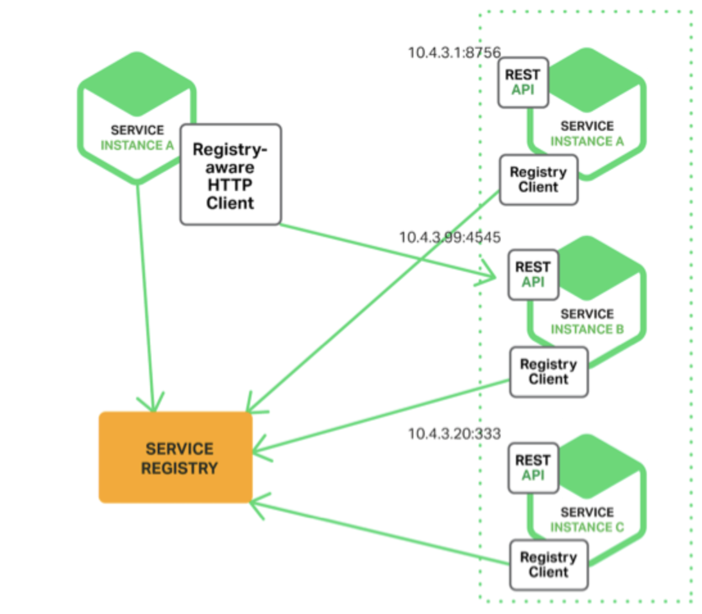
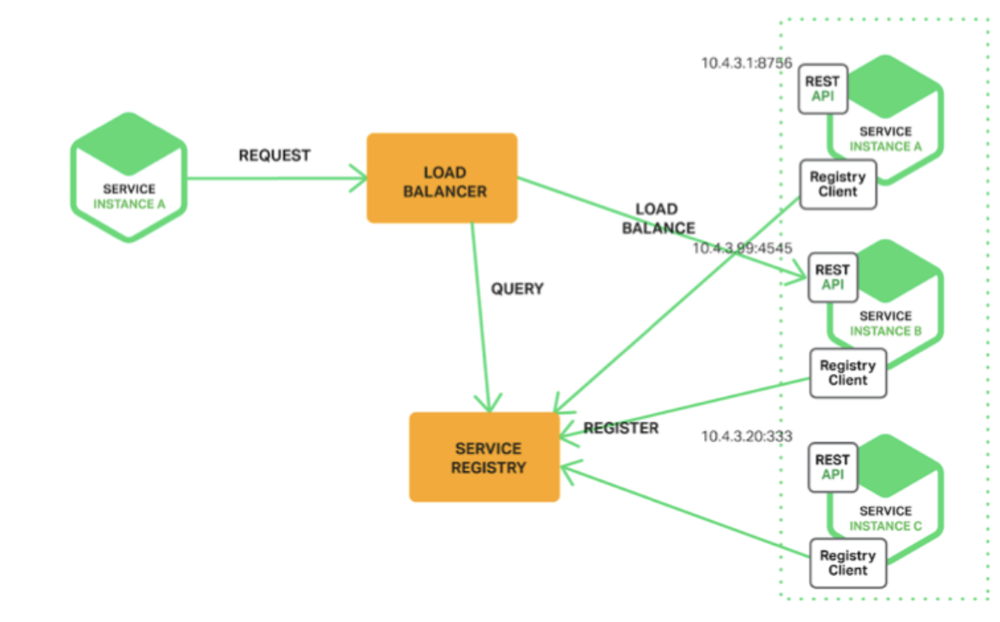
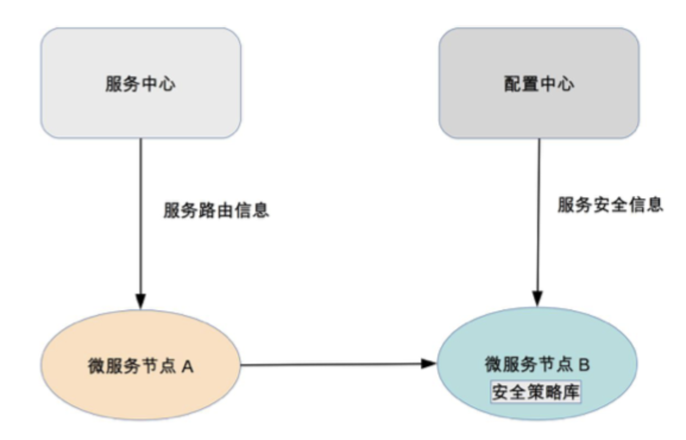

# 0405. 微服务架构最佳实践 —— 基础设施篇

李运华 2018-07-19

每项微服务基础设施都是一个平台、一个系统、一个解决方案，如果要自己实现，其过程和做业务系统类似，都需要经过需求分析、架构设计、开发、测试、部署上线等步骤，专栏里我来简单介绍一下每个基础设施的主要作用，更多详细设计你可以参考 Spring Cloud 的相关资料（[Spring Cloud](https://spring.io/projects/spring-cloud)）。下面进入今天的内容，微服务架构最佳实践的基础设施篇。

## 5.1 自动化测试

微服务将原本大一统的系统拆分为多个独立运行的「微」服务，微服务之间的接口数量大大增加，并且微服务提倡快速交付，版本周期短，版本更新频繁。如果每次更新都靠人工回归整个系统，则工作量大，效率低下，达不到「快速交付」的目的，因此必须通过自动化测试系统来完成绝大部分测试回归的工作。

自动化测试涵盖的范围包括代码级的单元测试、单个系统级的集成测试、系统间的接口测试，理想情况是每类测试都自动化。如果因为团队规模和人力的原因无法全面覆盖，至少要做到接口测试自动化。

## 5.2 自动化部署

相比大一统的系统，微服务需要部署的节点增加了几倍甚至十几倍，微服务部署的频率也会大幅提升（例如，我们的业务系统 70% 的工作日都有部署操作），综合计算下来，微服务部署的次数是大一统系统部署次数的几十倍。这么大量的部署操作，如果继续采用人工手工处理，需要投入大量的人力，且容易出错，因此需要自动化部署的系统来完成部署操作。

自动化部署系统包括版本管理、资源管理（例如，机器管理、虚拟机管理）、部署操作、回退操作等功能。

## 5.3 配置中心

微服务的节点数量非常多，通过人工登录每台机器手工修改，效率低，容易出错。特别是在部署或者排障时，需要快速增删改查配置，人工操作的方式显然是不行的。除此以外，有的运行期配置需要动态修改并且所有节点即时生效，人工操作是无法做到的。综合上面的分析，微服务需要一个统一的配置中心来管理所有微服务节点的配置。

配置中心包括配置版本管理（例如，同样的微服务，有 10 个节点是给移动用户服务的，有 20 个节点给联通用户服务的，配置项都一样，配置值不一样）、增删改查配置、节点管理、配置同步、配置推送等功能。

## 5.4 接口框架

微服务提倡轻量级的通信方式，一般采用 HTTP/REST 或者 RPC 方式统一接口协议。但在实践过程中，光统一接口协议还不够，还需要统一接口传递的数据格式。例如，我们需要指定接口协议为 HTTP/REST，但这还不够，还需要指定 HTTP/REST 的数据格式采用 JSON，并且 JSON 的数据都遵循如下规范。

```json
{
    "requestId": 10086,
    "time": "2017-01-01 00:00:00",
    "caller": "tencent",
    "param": {
        "userId": 13800138
    },
    "sign": "074hfg48723hjsg2723ksyje83"
}
```

如果我们只是简单指定了 HTTP/REST 协议，而不指定 JSON 和 JSON 的数据规范，那么就会出现这样混乱的情况：有的微服务采用 XML，有的采用 JSON，有的采用键值对；即使同样都是 JSON，JSON 数据格式也不一样。这样每个微服务都要适配几套甚至几十套接口协议，相当于把曾经由 ESB 做的事情转交给微服务自己做了，这样做的效率显然是无法接受的，因此需要统一接口框架。

接口框架不是一个可运行的系统，一般以库或者包的形式提供给所有微服务调用。例如，针对上面的 JSON 样例，可以由某个基础技术团队提供多种不同语言的解析包（Java 包、Python 包、C 库等）。

## 5.5 API 网关

系统拆分为微服务后，内部的微服务之间是互联互通的，相互之间的访问都是点对点的。如果外部系统想调用系统的某个功能，也采取点对点的方式，则外部系统会非常「头大」。因为在外部系统看来，它不需要也没办法理解这么多微服务的职责分工和边界，它只会关注它需要的能力，而不会关注这个能力应该由哪个微服务提供。

除此以外，外部系统访问系统还涉及安全和权限相关的限制，如果外部系统直接访问某个微服务，则意味着每个微服务都要自己实现安全和权限的功能，这样做不但工作量大，而且都是重复工作。

综合上面的分析，微服务需要一个统一的 API 网关，负责外部系统的访问操作。API 网关是外部系统访问的接口，所有的外部系统接⼊系统都需要通过 API 网关，主要包括接入鉴权（是否允许接入）、权限控制（可以访问哪些功能）、传输加密、请求路由、流量控制等功能。

## 5.6 服务发现

微服务种类和数量很多，如果这些信息全部通过手工配置的方式写入各个微服务节点，首先配置工作量很大，配置文件可能要配几百上千行，几十个节点加起来后配置项就是几万几十万行了，人工维护这么大数量的配置项是一项灾难；其次是微服务节点经常变化，可能是由于扩容导致节点增加，也可能是故障处理时隔离掉一部分节点，还可能是采用灰度升级，先将一部分节点升级到新版本，然后让新老版本同时运行。不管哪种情况，我们都希望节点的变化能够及时同步到所有其他依赖的微服务。如果采用手工配置，是不可能做到实时更改生效的。因此，需要一套服务发现的系统来支撑微服务的自动注册和发现。

服务发现主要有两种实现方式：自理式和代理式。

1、自理式。自理式结构如下：



自理式结构就是指每个微服务自己完成服务发现。例如，图中 SERVICE INSTANCE A 访问 SERVICE REGISTRY 获取服务注册信息，然后直接访问 SERVICE INSTANCE B。自理式服务发现实现比较简单，因为这部分的功能一般通过统一的程序库或者程序包提供给各个微服务调用，而不会每个微服务都自己来重复实现一遍；并且由于每个微服务都承担了服务发现的功能，访问压力分散到了各个微服务节点，性能和可用性上不存在明显的压力和风险。

2、代理式。代理式结构如下：



代理式结构就是指微服务之间有一个负载均衡系统（图中的 LOAD BALANCER 节点），由负载均衡系统来完成微服务之间的服务发现。代理式的方式看起来更加清晰，微服务本身的实现也简单了很多，但实际上这个方案风险较大。第一个风险是可用性风险，一旦 LOAD BALANCER 系统故障，就会影响所有微服务之间的调用；第二个风险是性能风险，所有的微服务之间的调用流量都要经过 LOAD BALANCER 系统，性能压力会随着微服务数量和流量增加而不断增加，最后成为性能瓶颈。因此 LOAD BALANCER 系统需要设计成集群的模式，但 LOAD BALANCER 集群的实现本身又增加了复杂性。

不管是自理式还是代理式，服务发现的核心功能就是服务注册表，注册表记录了所有的服务节点的配置和状态，每个微服务启动后都需要将自己的信息注册到服务注册表，然后由微服务或者 LOAD BALANCER 系统到服务注册表查询可用服务。

## 5.7 服务路由

有了服务发现后，微服务之间能够方便地获取相关配置信息，但具体进行某次调用请求时，我们还需要从所有符合条件的可用微服务节点中挑选出一个具体的节点发起请求，这就是服务路由需要完成的功能。

服务路由和服务发现紧密相关，服务路由一般不会设计成一个独立运行的系统，通常情况下是和服务发现放在一起实现的。对于自理式服务发现，服务路由是微服务内部实现的；对于代理式服务发现，服务路由是由 LOAD BALANCER 系统实现的。无论放在哪里实现，服务路由核心的功能就是路由算法。常见的路由算法有：随机路由、轮询路由、最小压力路由、最小连接数路由等。

## 5.8 服务容错

系统拆分为微服务后，单个微服务故障的概率变小，故障影响范围也减少，但是微服务的节点数量大大增加。从整体上来看，系统中某个微服务出故障的概率会大大增加。专栏第 34 期我在分析微服务陷阱时提到微服务具有故障扩散的特点，如果不及时处理故障，故障扩散开来就会导致看起来系统中很多服务节点都故障了，因此需要微服务能够自动应对这种出错场景，及时进行处理。否则，如果节点一故障就需要人工处理，投入人力大，处理速度慢；而一旦处理速度慢，则故障就很快扩散，所以我们需要服务容错的能力。

常见的服务容错包括请求重试、流控和服务隔离。通常情况下，服务容错会集成在服务发现和服务路由系统中。

## 5.9 服务监控

系统拆分为微服务后，节点数量大大增加，导致需要监控的机器、网络、进程、接口调用数等监控对象的数量大大增加；同时，一旦发生故障，我们需要快速根据各类信息来定位故障。这两个目标如果靠人力去完成是不现实的。举个简单例子：我们收到用户投诉说业务有问题，如果此时采取人工的方式去搜集、分析信息，可能把几十个节点的日志打开一遍就需要十几分钟了，因此需要服务监控系统来完成微服务节点的监控。

服务监控的主要作用有：1）实时搜集信息并进行分析，避免故障后再来分析，减少了处理时间。2）服务监控可以在实时分析的基础上进行预警，在问题萌芽的阶段发觉并预警，降低了问题影响的范围和时间。3）通常情况下，服务监控需要搜集并分析大量的数据，因此建议做成独立的系统，而不要集成到服务发现、API 网关等系统中。

## 5.10 服务跟踪

服务监控可以做到微服务节点级的监控和信息收集，但如果我们需要跟踪某一个请求在微服务中的完整路径，服务监控是难以实现的。因为如果每个服务的完整请求链信息都实时发送给服务监控系统，数据量会大到无法处理。

服务监控和服务跟踪的区别可以简单概括为宏观和微观的区别。例如，A 服务通过 HTTP 协议请求 B 服务 10 次，B 通过 HTTP 返回 JSON 对象，服务监控会记录请求次数、响应时间平均值、响应时间最高值、错误码分布这些信息；而服务跟踪会记录其中某次请求的发起时间、响应时间、响应错误码、请求参数、返回的 JSON 对象等信息。目前无论是分布式跟踪还是微服务的服务跟踪，绝大部分请求跟踪的实现技术都基于 Google 的 Dapper 论文《Dapper, a Large-Scale Distributed Systems Tracing Infrastructure》。

## 5.11 服务安全

系统拆分为微服务后，数据分散在各个微服务节点上。从系统连接的角度来说，任意微服务都可以访问所有其他微服务节点；但从业务的角度来说，部分敏感数据或者操作，只能部分微服务可以访问，而不是所有的微服务都可以访问，因此需要设计服务安全机制来保证业务和数据的安全性。

服务安全主要分为三部分：接入安全、数据安全、传输安全。通常情况下，服务安全可以集成到配置中心系统中进行实现，即配置中心配置微服务的接入安全策略和数据安全策略，微服务节点从配置中心获取这些配置信息，然后在处理具体的微服务调用请求时根据安全策略进行处理。由于这些策略是通用的，一般会把策略封装成通用的库提供给各个微服务调用。基本架构如下：



## 黑板墙

这一期的思考题很特别，给你一个由 10 位 Java 高级软件工程师组成的开发团队，采用自研的方式，完成所有的微服务基础设施开发，你预测需要多长时间？理由是什么呢？

文章中一共列了 11 个部分，但只有 10 个人，很明显是不可能是同时开工的，即使能够同时开工也是需要经过几轮迭代才能达到一个比较完善的状态。依据简单原则和演化原则以及「三个火枪手」的人员分配原则，首先可以做 API 网关、配置中心、服务发现、服务路由这 4 部分，经过一个月的开发 + 半个月的联调的先让基础框架搭建起来，业务能够运行起来。业务上线后，为了保证用户体验和问题跟踪，在保留一两个留守同学的情况下，开始服务容错、服务监控、服务跟踪这几部分的开发，因为这个阶段中可能还要回头修改已完成的部分让这几个部分配合的更好，联调的工作量也多了不少，这个过程大概要 2.5 月。而后随着业务逐渐增多，流量逐渐增加，为避免被黑产「薅羊毛」需要把服务安全部分给完成，同时为了快速响应新的业务需要把接口框架给完成，但此时有些同学会被已完成部分的日常维护、修 bug 等，这些初步需要两个月时间。在这里都完成后，可以开始自动化测试、自动化部署这部分，也按照两个月的时间，这样一轮下来总体需要 8 个月时间。经过第一轮后微服务的基础实施是有了，但要真正的运作起来还需要经过几轮的迭代才可以，但此时面对老系统的维护新系统的开发整体的进度会变慢不少，这样一个合格的比较完善的微服务基础设施差不多要两年时间了。作者回复：你是第一个认真分析且抓住重点的同学。2018-09-18

很多人把 oauth2 的鉴权放到了网关，这个你怎么看。作者回复：不符合网关的定位，因为有的业务要鉴权有的不要，放在网关就相当于网关要和业务耦合了。2018-07-20

之前看您留言提到过 service mesh 不成熟，中小公司不建议使用。请问看起来最近 gcp 云平台，主推的 k8s 加上 Istio/envoy 实现服务治理，您认为未来方向如何，这个是试用中小型团队的方案吗？作者回复：我没有 service mesh 具体实践经验，主要信息来源于网上资料，意见供参考。1）Istio 刚发布 1.0 版本，spring cloud 成熟很多。2）service mesh 中文为服务网格，很形象，说明了更加适合非常多的服务节点，简单来说，如果你只有一两个服务没必要用微服务架构，你只有几十个微服务节点可能也不需要 service mesh。3）service mesh 对程序无侵入，这点非常好，但随着 spring cloud 之类的方案成熟，侵入问题其实不是主要问题。因此，我认为大部分中小公司目前不需要 service mesh，能把微服务做好已经很不错了。2018-08-12

自己写的话肯定坑太多，也没有经过太多实践上的检验。感觉真正稳定下来需要躺过很多坑才行，当然成长也是成倍的，最终苦了公司，系统天天挂。2018-11-29

汇总：1）自动化测试（代码级单元测试，单个系统级系统测试，接口间接口测试）。2）自动化部署（版本管理，资源管理（机器管理，虚拟机管理），部署操作，回退操作）。3）配置中心（配置版本管理，节点管理，配置同步，配置推送，增删查改操作）。4）服务监控（宏观，考察请求次数，响应平均时间，响应最高值，减少故障处理时间，针对故障提前预警）。5）服务跟踪（微观，某次请求的发起请求记录，响应时间，响应错误码，请求参数等）。6）服务安全（接入安全，数据安全，传输安全）。7）接口框架（对外用 http/json 方式，对内用 rpc 方式）。8）api 网关（唯一提供外部访问的，接入鉴权（是否接入），权限控制（是否能访问），流量控制，请求路由，传输加密）。9）服务发现（自主式（每个微服务之间自己完成服务发现），代理式（每个微服务之间借助负载均衡系统完成服务发现）。10）服务路由（随机，轮询，最小压力，最小连接）。11）服务容错（请求重试，流式和服务隔离）

根据简单和演化原则，自研项目可以从最简单的开始，比如从服务发现，服务路由，服务容错，以及接口框架和 api 网关出发，等迭代完毕后再跟进自动化测试，自动化部署，配置中心，服务监控，服务跟踪，服务安全，按照逐步迭代，不断演化的思路。至于预测时间，真不好预测，之前做一个基于旧业务的新框架翻新，前前后后花了半年多才出雏形，后面再花半年才稳定下来。还不包括踩坑什么的。

作者回复：差不多，半年落地，半年稳定。2020-03-12

看了这么久第一次留言，老师你好，刚看你说网关层不建议做鉴权！但是如果这样的话，那内部微服务之间如何进行通信呢？我的理解是网关做与 url 有关的权限处理！而具体的业务服务里面做与数据相关的权限鉴别！这样职业分开！然后内部进行通信的话就可以采用 rpc 进行高效的交互，而且都是可信的！作者回复：这样是可以的，网关鉴权仅限于和用户相关的登录态，登录环境等，业务权限还是要业务做。2019-01-03

按照以往了解的基础架构部的开发速度来看，而且文中涉及的基础设施都有开源实现可以借鉴，一个基础设施从调研（开源系统代码 review），到设计，再到开发，再到小流量接入，全公司推广，一个基础设施 3 个人大概 5 到 6 个月时间，如果去掉小流量和推广阶段，估计也需要 3 到 4 个月。文中说到的前 10 个微服务，按照单个 3*3 人月算下来的话，理想情况下，需要 9 个月。当然，这里没有考虑严格的测试和压力测试，否则每个系统，需要增加至少一个人月的周期。作者回复：这类微服务做出基本功能 9 个月可以，做完善需要耗时更长。2018-07-19

其实在微服务的 11 个基础设施里面，我觉得自动化测试和自动化部署反而是比较基础的，并且需要开发人员能够适应并且投入。不知道国内有多少团队能够做到单元测试，或者是自动化测试；自动化部署因为有 Jenkins，可能会好一点。如果按照上一章节的优先级顺序，应该从服务发现、服务路由和服务容错起步，然后再做接口框架和 API 网关；最后是服务监控、服务跟踪和服务安全。10 位 Java 高手，自研微服务基础设施，如果采用 3 个人一组的方式，3 个月（9 人月）完成一项基础设施，那么大概 1 年左右应该有小成。假设 Java 高手的月薪在 50K 左右，那么 1 年的人力成本不少于 600 万。为什么要自研呢？很多基础设施已经是现成的轮子了。同样 10 位高手，采用开源软件，选型、搭建全套的微服务基础设施，可能 2 个月应该就可以跑的很流畅了吧。作者回复：基本正确，但是在大厂如果能自己做，晋升会比较容易。2020-10-11

我们将原有系统从传统架构调整为为服务，基本按照 spring boot 全家桶来搞，拆分成了接近 20 个微服务，做的过程中微服务尤其表的划分以及互相之间调用，十分头疼。涉及代码 100 万。整个开发加测试耗时 10 个月，人员 100 人左右。作者回复：这个投入还是很大的。2020-03-15

请问一下 json 数据格式规范，主要是约定公共字段名吗？还有其它要定义的内容吗？作者回复：主要是这个。2020-01-25。你在文章中提到的「即使同样都是 JSON，JSON 数据格式也不一样。」想请教 json 数据格式规范具体指什么？此规范要约定那些内容？作者回复：json 里面的字段不一样。2020-01-05

请教一个问题，微服务本身要实现请求鉴权，这个功能和网关相同，如果一个外部请求通过网关访问，它将要进行两次验证，有点重复呀，是这样吗？作者回复：网关可以做鉴权，也可以不做，由应用自己来做，不要重复做两次。2020-01-25

请问：服务间的安全策略通过配置中心下发给各节点，一般采用那些安全策略？我了解到的有黑白名单（根据服务名、IP），这个方案比较容易伪造（服务名和 IP），还有其它策略吗？作者回复：内部网络需要与外部隔离，因此内部反而一般黑白名单用的少，因为机器会经常变，黑白名单管理比较麻烦；通常是给每个服务分配服务名称 + 服务访问密码之类的做法。2020-01-05

你说 API 网关的主要包括接入鉴权、权限控制，然后在留言中又说不应该把 oauth2 的鉴权放到网关。我觉得前后矛盾了，是我对鉴权和权限控制哪里理解的还不到位吗？作者回复：oauth2 是第三方授权，API 网关是二方授权，二方是公司内不同业务部门的请求方和调用方，第三方授权是外部系统，内部系统，用户这三方。2019-06-11

基础设施为啥要自研呢？有没有现成的成熟框架？如果有，不知道后面作者会不会有对比分析？作者回复：小厂用 spring 全家桶，大厂为了可控和按需定制，一般会自己做。2019-06-02

关于绕过网关进行接口调用的问题，如果通过 SDK 的方式提供给业务方使用，那是不是业务方也需要登录鉴权了，和网关功能重复了呢。作者回复：都封装在 SDK 里面。2019-05-31

用了网关后，如何避免服务调用不会绕过网关直接调用接口？作者回复：封装 SDK 给业务用。2019-03-02

上面一共提到 11 个功能，每个功能按照业务职责去分可以分成 11 个服务，但按照三个火枪手原则来拆分服务大概是 4 个服务，拆分如下。按照业务拆分：分为三类：1）构建微服务的的内部依赖：接口框架、服务路由、服务容错、服务安全。2）构建微服务的外部依赖：配置中心、api 网关、服务发现、服务可持续集成、监控相关。3）与服务间无强关联的：自动化测试、自动化部署、服务监控、服务追踪。按照服务性能 + 可靠性拆分为两类，性能要求低，对内部应用提供服务：配置中心、服务发现，性能要求高，对外部请求提供服务，保证性能要求高的处理速率和高可用：api 网关，如果网关宕机则整个系统无法对外提供服务。最后拆分为 4 个服务：1）接口框架、服务路由、服务容错、服务安全。2）配置中心、服务发现。3）api 网关。4）自动化测试、自动化部署、服务监控、服务追踪。2018-12-13

接上一问题，微服务提倡无状态，那就必须有一个认证授权服务存在，我的理解是在 APIGateway 下层，存在一个同级服务来提供验证授权，或者说结合 API 网关提供全面安全机制，这样既可以在 APIGateway 层过滤部分非法请求，又在下层提供更细粒度安全控制，整体来说压到服务节点的流量被有效降低了，不知道这样子理解正确否。作者回复：可以这样做，网关依赖安全服务。2018-10-29

请教个问题：API 网关提供认证授权功能，那请求穿透 API 网关这一层之后，后续的业务流程依然会涉及在多个子服务之间交互，此时如何授权呢？难道需要反向去 API 网关查询吗？作者回复：网关是针对外部系统的认证授权，内部系统如果要做权限控制，一般放在配置中心做，因为独立做内部的认证系统代价比较高。2018-10-29

代理式服务发现，代理还负责转发请求消息响应消息对吗。作者回复：是的，和网关类似。2018-08-09

请问微服务架构中的网关和 soa 架构中的 esb 有什么区别？难道网关不会成为整体架构中的性能瓶颈吗？作者回复：网关的功能只是 esb 中的其中一个职责。2018-07-22

老师关于服务发现主要有两种实现方式：自理式和代理式，我没有听明白。我理解两种方式的服务注册都是一样的，都是需要服务实例自己去注册，对比两种服务发现方式代理方式的负载均衡通过图示感觉多过了一道。没有任何意义。不知道负载均衡的意义何在？作者回复：注册都是要自己注册的，但是服务发现和路由处理不一样，一个是服务自己完成发现和路由，一个是代理去完成发现和路由。2018-07-20

我想问下是不是有服务统一调度的模块，比如一个基本的银行转账业务，我们把该业务的调度流程参数化到表中，比如第一步要调用存款服务的转账功能，第二步调用会计服务的流水登记功能，假设调度表中对于活期转账已经配置了两个步骤，那调度模块就根据配置依次顺序调用微服务 a 存款服务和 b 会计服务，那调度模块是放在 api 网关做总体调度还是让微服务 a 自发去调用微服务 b 吗？哪种合理？还是说调度参数化这种设计不好？在服务 a 中写死调用服务 b？作者回复：网关不要有业务逻辑，因此你说的调度模块不适合放到网关，应该放到 a 服务去调用 b 服务。至于流程设计，a 服务可以采用规则引擎，或者有一个独立的服务 c 基于规则引擎配置业务逻辑，然后根据逻辑调用 a 或者 b 服务。2018-07-19