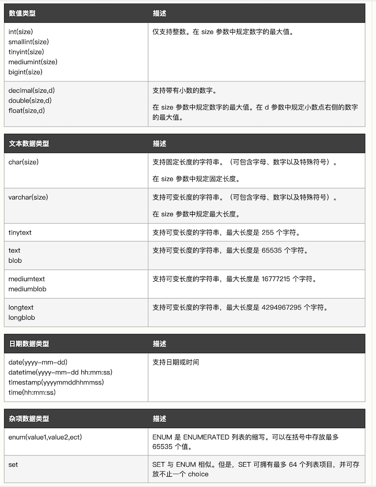

# 0401 PHP 数据库

[PHP MySQL 简介](https://www.w3school.com.cn/php/php_mysql_intro.asp)

[PHP MySQL 简介 | 菜鸟教程](https://www.runoob.com/php/php-mysql-intro.html)

## 01. PHP MySQL 连接数据库

免费的 MySQL 数据库通常是通过 PHP 来使用的。

连接到一个 MySQL 数据库。在您能够访问并处理数据库中的数据之前，您必须创建到达数据库的连接。在 PHP 中，这个任务通过 mysql_connect() 函数完成。

    mysql_connect(servername,username,password);

servername，可选。规定要连接的服务器。默认是 "localhost:3306"。

username，可选。规定登录所使用的用户名。默认值是拥有服务器进程的用户的名称。

password，可选。规定登录所用的密码。默认是 ""。

注释：虽然还存在其他的参数，但上面列出了最重要的参数。请访问 W3School 提供的 PHP MySQL 参考手册，获得更多的细节信息：[PHP MySQL 函数](https://www.w3school.com.cn/php/php_ref_mysql.asp)。

在下面的例子中，我们在一个变量中 (\$con) 存放了在脚本中供稍后使用的连接。如果连接失败，将执行 "die" 部分：

```
<?php
$con = mysql_connect("localhost","peter","abc123");
if (!$con)
  {
  die('Could not connect: ' . mysql_error());
  }

// some code

?>
```

关闭连接。脚本一结束，就会关闭连接。如需提前关闭连接，请使用 mysql_close() 函数。

```
<?php
$con = mysql_connect("localhost","peter","abc123");
if (!$con)
  {
  die('Could not connect: ' . mysql_error());
  }

// some code

mysql_close($con);
?>
```

## 02. PHP MySQL 创建数据库和表

数据库存有一个或多个表。

创建数据库。CREATE DATABASE 语句用于在 MySQL 中创建数据库。

    CREATE DATABASE database_name

为了让 PHP 执行上面的语句，我们必须使用 mysql_query() 函数。此函数用于向 MySQL 连接发送查询或命令。

在下面的例子中，我们创建了一个名为 "my_db" 的数据库：

```
<?php
$con = mysql_connect("localhost","peter","abc123");
if (!$con)
  {
  die('Could not connect: ' . mysql_error());
  }

if (mysql_query("CREATE DATABASE my_db",$con))
  {
  echo "Database created";
  }
else
  {
  echo "Error creating database: " . mysql_error();
  }

mysql_close($con);
?>
```

创建表。CREATE TABLE 用于在 MySQL 中创建数据库表。

```
CREATE TABLE table_name
(
column_name1 data_type,
column_name2 data_type,
column_name3 data_type,
.......
)
```

为了执行此命令，我必须向 mysql_query() 函数添加 CREATE TABLE 语句。下面的例子展示了如何创建一个名为 "Persons" 的表，此表有三列。列名是 "FirstName", "LastName" 以及 "Age"：

```
<?php
$con = mysql_connect("localhost","peter","abc123");
if (!$con)
  {
  die('Could not connect: ' . mysql_error());
  }

// Create database
if (mysql_query("CREATE DATABASE my_db",$con))
  {
  echo "Database created";
  }
else
  {
  echo "Error creating database: " . mysql_error();
  }

// Create table in my_db database
mysql_select_db("my_db", $con);
$sql = "CREATE TABLE Persons 
(
FirstName varchar(15),
LastName varchar(15),
Age int
)";
mysql_query($sql,$con);

mysql_close($con);
?>
```

重要事项：在创建表之前，必须首先选择数据库。通过 mysql_select_db() 函数选取数据库。

注释：当您创建 varchar 类型的数据库字段时，必须规定该字段的最大长度，例如：varchar(15)。

MySQL 数据类型。下面的可使用的各种 MySQL 数据类型：



主键和自动递增字段。每个表都应有一个主键字段。主键用于对表中的行进行唯一标识。每个主键值在表中必须是唯一的。此外，主键字段不能为空，这是由于数据库引擎需要一个值来对记录进行定位。主键字段永远要被编入索引。这条规则没有例外。你必须对主键字段进行索引，这样数据库引擎才能快速定位给予该键值的行。

下面的例子把 personID 字段设置为主键字段。主键字段通常是 ID 号，且通常使用 AUTO_INCREMENT 设置。AUTO_INCREMENT 会在新记录被添加时逐一增加该字段的值。要确保主键字段不为空，我们必须向该字段添加 NOT NULL 设置。

```
$sql = "CREATE TABLE Persons 
(
personID int NOT NULL AUTO_INCREMENT, 
PRIMARY KEY(personID),
FirstName varchar(15),
LastName varchar(15),
Age int
)";

mysql_query($sql,$con);
```

## 03. PHP MySQL Insert Into

INSERT INTO 语句用于向数据库表中插入新记录。

向数据库表插入数据。INSERT INTO 语句用于向数据库表添加新记录。

```
INSERT INTO table_name
VALUES (value1, value2,....)
```

您还可以规定希望在其中插入数据的列：

```
INSERT INTO table_name (column1, column2,...)
VALUES (value1, value2,....)
```

注释：SQL 语句对大小写不敏感。INSERT INTO 与 insert into 相同。

1『这个很好，要么以后都小写，哈哈』

为了让 PHP 执行该语句，我们必须使用 mysql_query() 函数。该函数用于向 MySQL 连接发送查询或命令。

在前面的章节，我们创建了一个名为 "Persons" 的表，有三个列："Firstname", "Lastname" 以及 "Age"。我们将在本例中使用同样的表。下面的例子向 "Persons" 表添加了两个新记录：

```
<?php
$con = mysql_connect("localhost","peter","abc123");
if (!$con)
  {
  die('Could not connect: ' . mysql_error());
  }

mysql_select_db("my_db", $con);

mysql_query("INSERT INTO Persons (FirstName, LastName, Age) 
VALUES ('Peter', 'Griffin', '35')");

mysql_query("INSERT INTO Persons (FirstName, LastName, Age) 
VALUES ('Glenn', 'Quagmire', '33')");

mysql_close($con);
?>
```

把来自表单的数据插入数据库。现在，我们创建一个 HTML 表单，这个表单可把新记录插入 "Persons" 表。这是这个 HTML 表单：

```
<html>
<body>

<form action="insert.php" method="post">
Firstname: <input type="text" name="firstname" />
Lastname: <input type="text" name="lastname" />
Age: <input type="text" name="age" />
<input type="submit" />
</form>

</body>
</html>
```

当用户点击上例中 HTML 表单中的提交按钮时，表单数据被发送到 "insert.php"。"insert.php" 文件连接数据库，并通过 \$_POST 变量从表单取回值。然后，mysql_query() 函数执行 INSERT INTO 语句，一条新的记录会添加到数据库表中。

下面是 "insert.php" 页面的代码：

```
<?php
$con = mysql_connect("localhost","peter","abc123");
if (!$con)
  {
  die('Could not connect: ' . mysql_error());
  }

mysql_select_db("my_db", $con);

$sql="INSERT INTO Persons (FirstName, LastName, Age)
VALUES
('$_POST[firstname]','$_POST[lastname]','$_POST[age]')";

if (!mysql_query($sql,$con))
  {
  die('Error: ' . mysql_error());
  }
echo "1 record added";

mysql_close($con)
?>
```


