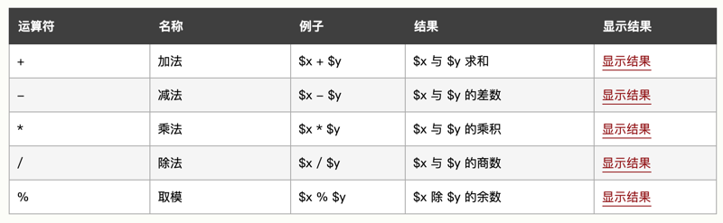
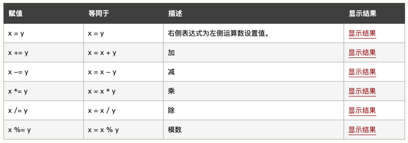
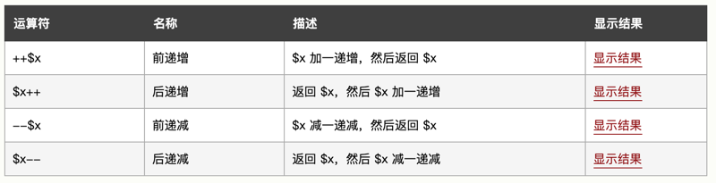
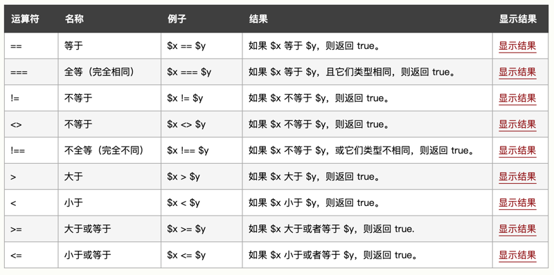

# 0101 基础教程

[PHP 简介](https://www.w3school.com.cn/php/php_intro.asp)

## 09. PHP 运算符

本节展示了可用于 PHP 脚本中的各种运算符。

PHP 算数运算符。下例展示了使用不同算数运算符的不同结果：



```
<?php 
$x=17; 
$y=8;
echo ($x + $y); // 输出 25
echo ($x - $y); // 输出 9
echo ($x * $y); // 输出 136
echo ($x / $y); // 输出 2.125
echo ($x % $y); // 输出 1
?>
```

PHP 赋值运算符。PHP 赋值运算符用于向变量写值。PHP 中基础的赋值运算符是 "="。这意味着右侧赋值表达式会为左侧运算数设置值。



下例展示了使用不同赋值运算符的不同结果：

```
<?php 
$x=17; 
echo $x; // 输出 17

$y=17; 
$y += 8;
echo $y; // 输出 25

$z=17;
$z -= 8;
echo $z; // 输出 9

$i=17;
$i *= 8;
echo $i; // 输出 136

$j=17;
$j /= 8;
echo $j; // 输出 2.125

$k=17;
$k %= 8;
echo $k; // 输出 1
?>
```

PHP 字符串运算符。


下例展示了使用字符串运算符的结果：

```
<?php
$a = "Hello";
$b = $a . " world!";
echo $b; // 输出 Hello world!

$x="Hello";
$x .= " world!";
echo $x; // 输出 Hello world!
?>
```

PHP 递增 / 递减运算符。



下例展示了使用不同递增 / 递减运算符的不同结果：

```
<?php
$x=17; 
echo ++$x; // 输出 18

$y=17; 
echo $y++; // 输出 17

$z=17;
echo --$z; // 输出 16

$i=17;
echo $i--; // 输出 17
?>
```

PHP 比较运算符。



PHP 比较运算符用于比较两个值（数字或字符串）：

下例展示了使用某些比较运算符的不同结果：

```
<?php
$x=17; 
$y="17";

var_dump($x == $y);
echo "<br>";
var_dump($x === $y);
echo "<br>";
var_dump($x != $y);
echo "<br>";
var_dump($x !== $y);
echo "<br>";

$a=17;
$b=8;

var_dump($a > $b);
echo "<br>";
var_dump($a < $b);
?>
```

PHP 逻辑运算符。


PHP 数组运算符。


PHP 数组运算符用于比较数组：

下例展示了使用不同数组运算符的不同结果：

```
<?php
$x = array("a" => "apple", "b" => "banana"); 
$y = array("c" => "orange", "d" => "peach"); 
$z = $x + $y; // $x 与 $y 的联合
var_dump($z);
var_dump($x == $y);
var_dump($x === $y);
var_dump($x != $y);
var_dump($x <> $y);
var_dump($x !== $y);
?>
```

## 10. PHP if...else...elseif 语句

条件语句用于基于不同条件执行不同的动作。

PHP 条件语句。在您编写代码时，经常会希望为不同的决定执行不同的动作。您可以在代码中使用条件语句来实现这一点。在 PHP 中，我们可以使用以下条件语句：1）if 语句 —— 如果指定条件为真，则执行代码；2）if...else 语句 —— 如果条件为 true，则执行代码；如果条件为 false，则执行另一端代码；3）if...elseif....else 语句 —— 根据两个以上的条件执行不同的代码块；4）switch 语句 —— 选择多个代码块之一来执行。

PHP —— if 语句。if 语句用于在指定条件为 true 时执行代码。

```
if (条件) {
  当条件为 true 时执行的代码;
}
```

下例将输出 "Have a good day!"，如果当前时间 (HOUR) 小于 20：

```
<?php
$t=date("H");

if ($t<"20") {
  echo "Have a good day!";
}
?>
```

PHP - if...else 语句。请使用 if....else 语句在条件为 true 时执行代码，在条件为 false 时执行另一段代码。

```
if (条件) {
  条件为 true 时执行的代码;
} else {
  条件为 false 时执行的代码;
}
```

如果当前时间 (HOUR) 小于 20，下例将输出 "Have a good day!"，否则输出 "Have a good night!"：

```
<?php
$t=date("H");

if ($t<"20") {
  echo "Have a good day!";
} else {
  echo "Have a good night!";
}
?>
```

PHP - if...elseif....else 语句。请使用 if....elseif...else 语句来根据两个以上的条件执行不同的代码。

```
if (条件) {
  条件为 true 时执行的代码;
} elseif (condition) {
  条件为 true 时执行的代码;
} else {
  条件为 false 时执行的代码;
}
```

如果当前时间 (HOUR) 小于 10，下例将输出 "Have a good morning!"，如果当前时间小于 20，则输出 "Have a good day!"。否则将输出 "Have a good night!"：

```
<?php
$t=date("H");

if ($t<"10") {
  echo "Have a good morning!";
} elseif ($t<"20") {
  echo "Have a good day!";
} else {
  echo "Have a good night!";
}
?>
```

## 11. PHP Switch 语句

switch 语句用于基于不同条件执行不同动作。

Switch 语句。如果您希望有选择地执行若干代码块之一，请使用 Switch 语句。使用 Switch 语句可以避免冗长的 if..elseif..else 代码块。

```
switch (expression)
{
case label1:
  expression = label1 时执行的代码 ;
  break;  
case label2:
  expression = label2 时执行的代码 ;
  break;
default:
  表达式的值不等于 label1 及 label2 时执行的代码;
}
```

工作原理：1）对表达式（通常是变量）进行一次计算；2）把表达式的值与结构中 case 的值进行比较；3）如果存在匹配，则执行与 case 关联的代码；4）代码执行后，break 语句阻止代码跳入下一个 case 中继续执行；5）如果没有 case 为真，则使用 default 语句。

```
<?php
$favfruit="orange";

switch ($favfruit) {
   case "apple":
     echo "Your favorite fruit is apple!";
     break;
   case "banana":
     echo "Your favorite fruit is banana!";
     break;
   case "orange":
     echo "Your favorite fruit is orange!";
     break;
   default:
     echo "Your favorite fruit is neither apple, banana, or orange!";
}
?>
```

## 12. PHP while 循环

PHP while 循环在指定条件为 true 时执行代码块。

PHP 循环。在您编写代码时，经常需要反复运行同一代码块。我们可以使用循环来执行这样的任务，而不是在脚本中添加若干几乎相等的代码行。

在 PHP 中，我们有以下循环语句：1）while —— 只要指定条件为真，则循环代码块；2）do...while —— 先执行一次代码块，然后只要指定条件为真则重复循环；3）for —— 循环代码块指定次数；4）foreach —— 遍历数组中的每个元素并循环代码块。

PHP while 循环。只要指定的条件为真，while 循环就会执行代码块。

```
while (条件为真) {
  要执行的代码;
}
```

下例首先把变量 \$x 设置为 1（\$x=1）。然后执行 while 循环，只要 \$x 小于或等于 5。循环每运行一次，\$x 将递增 1：

```
<?php 
$x=1; 

while($x<=5) {
  echo "这个数字是：$x <br>";
  $x++;
} 
?>
```

PHP do...while 循环。do...while 循环首先会执行一次代码块，然后检查条件，如果指定条件为真，则重复循环。

```
do {
  要执行的代码;
} while (条件为真);
```

下面的例子首先把变量 \$x 设置为 1（\$x=1）。然后，do while 循环输出一段字符串，然后对变量 \$x 递增 1。随后对条件进行检查（\$x 是否小于或等于 5）。只要 \$x 小于或等于 5，循环将会继续运行：

```
<?php 
$x=1; 

do {
  echo "这个数字是：$x <br>";
  $x++;
} while ($x<=5);
?>
```

请注意，do while 循环只在执行循环内的语句之后才对条件进行测试。这意味着 do while 循环至少会执行一次语句，即使条件测试在第一次就失败了。下面的例子把 \$x 设置为 6，然后运行循环，随后对条件进行检查：

```
<?php 
$x=6;

do {
  echo "这个数字是：$x <br>";
  $x++;
} while ($x<=5);
?>
```

运行实例下一节会讲解 for 循环和 foreach 循环。

## 13. PHP for 循环

PHP for 循环执行代码块指定的次数。如果您已经提前确定脚本运行的次数，可以使用 for 循环。

```
for (init counter; test counter; increment counter) {
  code to be executed;
}
```

参数：1）init counter：初始化循环计数器的值；2）test counter：: 评估每个循环迭代。如果值为 TRUE，继续循环。如果它的值为 FALSE，循环结束；3）increment counter：增加循环计数器的值。

下面的例子显示了从 0 到 10 的数字：

```
<?php 
for ($x=0; $x<=10; $x++) {
  echo "数字是：$x <br>";
} 
?>
```

PHP foreach 循环。foreach 循环只适用于数组，并用于遍历数组中的每个键 / 值对。

```
foreach ($array as $value) {
  code to be executed;
}
```

每进行一次循环迭代，当前数组元素的值就会被赋值给 \$value 变量，并且数组指针会逐一地移动，直到到达最后一个数组元素。

下面的例子演示的循环将输出给定数组（\$colors）的值：

```
<?php 
$colors = array("red","green","blue","yellow"); 

foreach ($colors as $value) {
  echo "$value <br>";
}
?>
```

在稍后的章节，您将学到更多有关数组的知识。

## 14. PHP 函数

PHP 的真正力量来自它的函数：它拥有超过 1000 个内建的函数。

PHP 用户定义函数：1）除了内建的 PHP 函数，我们可以创建我们自己的函数。2）函数是可以在程序中重复使用的语句块。3）页面加载时函数不会立即执行。4）函数只有在被调用时才会执行。

在 PHP 创建用户定义函数。用户定义的函数声明以单词 "function" 开头：

```
function functionName() {
  被执行的代码;
}
```

注释：函数名能够以字母或下划线开头（而非数字）。函数名对大小写不敏感。

提示：函数名应该能够反映函数所执行的任务。

在下面的例子中，我们创建名为 "writeMsg ()" 的函数。打开的花括号（{）指示函数代码的开始，而关闭的花括号（}）指示函数的结束。此函数输出 "Hello world!"。如需调用该函数，只要使用函数名即可：

```
<?php
function sayHi() {
  echo "Hello world!";
}

sayhi(); // 调用函数
?>
```

PHP 函数参数。可以通过参数向函数传递信息。参数类似变量。参数被定义在函数名之后，括号内部。您可以添加任意多参数，只要用逗号隔开即可。

下面的例子中的函数有一个参数（\$fname）。当调用 familyName () 函数时，我们同时要传递一个名字（例如 Bill），这样会输出不同的名字，但是姓氏相同：

```
<?php
function familyName($fname) {
  echo "$fname Zhang.<br>";
}

familyName("Li");
familyName("Hong");
familyName("Tao");
familyName("Xiao Mei");
familyName("Jian");
?>
```

下面的例子中的函数有两个参数（\$fname 和 \$year）：

```
<?php
function familyName($fname,$year) {
  echo "$fname Zhang. Born in $year <br>";
}

familyName("Li","1975");
familyName("Hong","1978");
familyName("Tao","1983");
?>
```

PHP 默认参数值。下面的例子展示了如何使用默认参数。如果我们调用没有参数的 setHeight () 函数，它的参数会取默认值：

```
<?php
function setHeight($minheight=50) {
  echo "The height is : $minheight <br>";
}

setHeight(350);
setHeight(); // 将使用默认值 50
setHeight(135);
setHeight(80);
?>
```

PHP 函数 —— 返回值。如需使函数返回值，请使用 return 语句：

```
<?php
function sum($x,$y) {
  $z=$x+$y;
  return $z;
}

echo "5 + 10 = " . sum(5,10) . "<br>";
echo "7 + 13 = " . sum(7,13) . "<br>";
echo "2 + 4 = " . sum(2,4);
?>
```

## 15. PHP 数组

数组能够在单独的变量名中存储一个或多个值。

数组在单个变量中存储多个值：

```
<?php
$cars=array("porsche","BMW","Volvo");
echo "I like " . $cars[0] . ", " . $cars[1] . " and " . $cars[2] . ".";
?>
```

什么是数组？数组是特殊的变量，它可以同时保存一个以上的值。如果您有一个项目列表（例如汽车品牌列表），在单个变量中存储这些品牌名称是这样的：

```
$cars1="porsche";
$cars2="BMW";
$cars3="Volvo";
```

不过，假如您希望对变量进行遍历并找出特定的那个值？或者如果您需要存储 300 个汽车品牌，而不是 3 个呢？解决方法是创建数组！

数组能够在单一变量名中存储许多值，并且您能够通过引用索引号来访问某个值。

在 PHP 中创建数组。在 PHP 中，array () 函数用于创建数组：

    array();

在 PHP 中，有三种数组类型：1）索引数组 —— 带有数字索引的数组；2）关联数组 —— 带有指定键的数组；3）多维数组 —— 包含一个或多个数组的数组。

PHP 索引数组。有两种创建索引数组的方法：1）索引是自动分配的（索引从 0 开始）：

    $cars=array("porsche","BMW","Volvo");

或者也可以手动分配索引：

```
$cars[0]="porsche";
$cars[1]="BMW";
$cars[2]="Volvo";
```

下面的例子创建名为 \$cars 的索引数组，为其分配三个元素，然后输出包含数组值的一段文本：

```
<?php
$cars=array("porsche","BMW","Volvo");
echo "I like " . $cars[0] . ", " . $cars[1] . " and " . $cars[2] . ".";
?>
```

获得数组的长度 —— count () 函数。count () 函数用于返回数组的长度（元素数）：

```
<?php
$cars=array("porsche","BMW","Volvo");
echo count($cars);
?>
```

遍历索引数组。如需遍历并输出索引数组的所有值，您可以使用 for 循环，就像这样：

```
<?php
$cars=array("porsche","BMW","Volvo");
$arrlength=count($cars);

for($x=0;$x<$arrlength;$x++) {
  echo $cars[$x];
  echo "<br>";
}
?>
```

PHP 关联数组。关联数组是使用您分配给数组的指定键的数组。有两种创建关联数组的方法：

    $age=array("Bill"=>"35","Steve"=>"37","Elon"=>"43");

或者：

```
$age['Bill']="63";
$age['Steve']="56";
$age['Elon']="47";
```

随后可以在脚本中使用指定键：

```
<?php
$age=array("Bill"=>"63","Steve"=>"56","Elon"=>"47");
echo "Elon is " . $age['Elon'] . " years old.";
?>
```

遍历关联数组。如需遍历并输出关联数组的所有值，您可以使用 foreach 循环，就像这样：

```
<?php
$age=array("Bill"=>"63","Steve"=>"56","Elon"=>"47");

foreach($age as $x=>$x_value) {
  echo "Key=" . $x . ", Value=" . $x_value;
  echo "<br>";
}
?>
```

多维数组。我们将在 PHP 高级教程中讲解多维数组。

如需完整的数组函数参考手册，请访问我们的 PHP 数组参考手册。该参考手册包含每个函数的简要描述、使用示例：[PHP Array 函数](https://www.w3school.com.cn/php/php_ref_array.asp)。

## 16. PHP 数组排序

数组中的元素能够以字母或数字顺序进行升序或降序排序。

PHP —— 数组的排序函数。在本节中，我们将学习如下 PHP 数组排序函数：1）sort () —— 以升序对数组排序。2）rsort () —— 以降序对数组排序。3）asort () —— 根据值，以升序对关联数组进行排序。4）ksort () —— 根据键，以升序对关联数组进行排序。5）arsort () —— 根据值，以降序对关联数组进行排序。6）krsort () —— 根据键，以降序对关联数组进行排序。7）对数组进行升序排序 —— sort ()。

下面的例子按照字母升序对数组 \$cars 中的元素进行排序：

```
<?php
$cars=array("porsche","BMW","Volvo");
sort($cars);
?>
```

下面的例子按照数字升序对数组 \$numbers 中的元素进行排序：

```
<?php
$numbers=array(3,5,1,22,11);
sort($numbers);
?>
```

对数组进行降序排序 —— rsort ()。下面的例子按照字母降序对数组 \$cars 中的元素进行排序：

```
<?php
$cars=array("porsche","BMW","Volvo");
rsort($cars);
?>
```

下面的例子按照数字降序对数组 \$numbers 中的元素进行排序：

```
<?php
$numbers=array(3,5,1,22,11);
rsort($numbers);
?>
```

根据值对数组进行升序排序—— asort ()。下面的例子根据值对关联数组进行升序排序：

```
<?php
$age=array("Bill"=>"63","Steve"=>"56","Elon"=>"47");
asort($age);
?>
```

根据键对数组进行升序排序 —— ksort ()。下面的例子根据键对关联数组进行升序排序：

```
<?php
$age=array("Bill"=>"63","Steve"=>"56","Elon"=>"47");
ksort($age);
?>
```

根据值对数组进行降序排序 —— arsort ()。下面的例子根据值对关联数组进行降序排序：

```
<?php
$age=array("Bill"=>"63","Steve"=>"56","Elon"=>"47");
arsort($age);
?>
```

根据键对数组进行降序排序 —— krsort ()。下面的例子根据键对关联数组进行降序排序：

```
<?php
$age=array("Bill"=>"63","Steve"=>"56","Elon"=>"47");
krsort($age);
?>
```

如需完整的数组函数参考手册，请访问我们的 PHP 数组参考手册。该参考手册包含每个函数的简要描述、使用示例：[PHP Array 函数](https://www.w3school.com.cn/php/php_ref_array.asp)

## 17. PHP 全局变量 —— 超全局变量

超全局变量在 PHP 4.1.0 中引入，是在全部作用域中始终可用的内置变量。

PHP 全局变量 —— 超全局变量。PHP 中的许多预定义变量都是「超全局的」，这意味着它们在一个脚本的全部作用域中都可用。在函数或方法中无需执行 global \$variable; 就可以访问它们。

这些超全局变量是：

```
$GLOBALS
$_SERVER
$_REQUEST
$_POST
$_GET
$_FILES
$_ENV
$_COOKIE
$_SESSION
```

本节会介绍一些超全局变量，并会在稍后的章节讲解其他的超全局变量。

\$GLOBALS —— 引用全局作用域中可用的全部变量。\$GLOBALS 这种全局变量用于在 PHP 脚本中的任意位置访问全局变量（从函数或方法中均可）。PHP 在名为 \$GLOBALS [index] 的数组中存储了所有全局变量。变量的名字就是数组的键。下面的例子展示了如何使用超级全局变量 \$GLOBALS：

```
<?php 
$x = 75; 
$y = 25;
 
function addition() { 
  $GLOBALS['z'] = $GLOBALS['x'] + $GLOBALS['y']; 
}
 
addition(); 
echo $z; 
?>
```

在上面的例子中，由于 z 是 \$GLOBALS 数组中的变量，因此在函数之外也可以访问它。

\$_SERVER 这种超全局变量保存关于报头、路径和脚本位置的信息。

下面的例子展示了如何使用 \$_SERVER 中的某些元素：

```
<?php 
echo $_SERVER['PHP_SELF'];
echo "<br>";
echo $_SERVER['SERVER_NAME'];
echo "<br>";
echo $_SERVER['HTTP_HOST'];
echo "<br>";
echo $_SERVER['HTTP_REFERER'];
echo "<br>";
echo $_SERVER['HTTP_USER_AGENT'];
echo "<br>";
echo $_SERVER['SCRIPT_NAME'];
?>
```

下表列出了您能够在 \$_SERVER 中访问的最重要的元素：


PHP \$_REQUEST 用于收集 HTML 表单提交的数据。

下面的例子展示了一个包含输入字段及提交按钮的表单。当用户通过点击提交按钮来提交表单数据时，表单数据将发送到 \<form> 标签的 action 属性中指定的脚本文件。在这个例子中，我们指定文件本身来处理表单数据。如果您需要使用其他的 PHP 文件来处理表单数据，请修改为您选择的文件名即可。然后，我们可以使用超级全局变量 \$_REQUEST 来收集 input 字段的值：

```
<html>
<body>

<form method="post" action="<?php echo $_SERVER['PHP_SELF'];?>">
Name: <input type="text" name="fname">
<input type="submit">
</form>

<?php 
$name = $_REQUEST['fname']; 
echo $name; 
?>

</body>
</html>
```

PHP \$_POST 广泛用于收集提交 method="post" 的 HTML 表单后的表单数据。

\$_POST 也常用于传递变量。

下面的例子展示了一个包含输入字段和提交按钮的表单。当用户点击提交按钮来提交数据后，表单数据会发送到 \<form> 标签的 action 属性中指定的文件。在本例中，我们指定文件本身来处理表单数据。如果您希望使用另一个 PHP 页面来处理表单数据，请用更改为您选择的文件名。然后，我们可以使用超全局变量 \$_POST 来收集输入字段的值：

```
<html>
<body>

<form method="post" action="<?php echo $_SERVER['PHP_SELF'];?>">
Name: <input type="text" name="fname">
<input type="submit">
</form>

<?php 
$name = $_POST['fname'];
echo $name; 
?>

</body>
</html>
```

PHP \$_GET 也可用于收集提交 HTML 表单 (method="get") 之后的表单数据。

\$_GET 也可以收集 URL 中的发送的数据。

假设我们有一张页面含有带参数的超链接：

```
<html>
<body>

<a href="test_get.php?subject=PHP&web=W3school.com.cn">测试 $GET</a>

</body>
</html>
```

当用户点击链接 "测试 \$GET"，参数 "subject" 和 "web" 被发送到 "test_get.php"，然后您就能够通过 \$_GET 在 "test_get.php" 中访问这些值了。

下面的例子是 "test_get.php" 中的代码：

```
<html>
<body>

<?php 
echo "在 " . $_GET['web'] . " 学习 " . $_GET['subject'];
?>

</body>
</html>
```

提示：您将在 PHP 表单 这一节中学到更多有关 \$_POST 和 \$GET 的知识。


## 18. PHP EOF(heredoc) 使用说明

PHP EOF(heredoc) 是一种在命令行 shell（如 sh、csh、ksh、bash、PowerShell 和 zsh）和程序语言（像 Perl、PHP、Python和Ruby）里定义一个字符串的方法。

使用概述：1）必须后接分号，否则编译通不过。2）EOF 可以用任意其它字符代替，只需保证结束标识与开始标识一致。3）结束标识必须顶格独自占一行（即必须从行首开始，前后不能衔接任何空白和字符）。4）开始标识可以不带引号或带单双引号，不带引号与带双引号效果一致，解释内嵌的变量和转义符号，带单引号则不解释内嵌的变量和转义符号。5）当内容需要内嵌引号（单引号或双引号）时，不需要加转义符，本身对单双引号转义，此处相当与 q 和 qq 的用法。

```
<?php
echo <<<EOF
        <h1>我的第一个标题</h1>
        <p>我的第一个段落。</p>
EOF;
// 结束需要独立一行且前后不能空格
?>
```

注意：1）以 <<<EOF 开始标记开始，以 EOF 结束标记结束，结束标记必须顶头写，不能有缩进和空格，且在结束标记末尾要有分号 。2）开始标记和结束标记相同，比如常用大写的 EOT、EOD、EOF 来表示，但是不只限于那几个（也可以用：JSON、HTML等），只要保证开始标记和结束标记不在正文中出现即可。3）位于开始标记和结束标记之间的变量可以被正常解析，但是函数则不可以。在 heredoc 中，变量不需要用连接符 . 或 , 来拼接，如下：

```
<?php
$name="runoob";
$a= <<<EOF
        "abc"$name
        "123"
EOF;
// 结束需要独立一行且前后不能空格
echo $a;
?>
```

3『

PHP 定界符 EOF 的作用就是按照原样，包括换行格式什么的，输出在其内部的东西；在 PHP 定界符 EOF 中的任何特殊字符都不需要转义。

补充一下上一个笔记的内容，EOF 中是会解析 html 格式内容的，并且在双引号内的内容也有转义效果。具体见下面例子:

```
<?php
$name="变量会被解析";
$a=<<<EOF
$name<br><a>html格式会被解析</a><br/>双引号和Html格式外的其他内容都不会被解析
"双引号外所有被排列好的格式都会被保留"
"但是双引号内会保留转义符的转义效果,比如table:\t和换行：\n下一行"
EOF;
echo $a;
?>  
```

加不加引号转义字符都有效。

』

## 19. PHP 魔术常量

PHP 向它运行的任何脚本提供了大量的预定义常量。不过很多常量都是由不同的扩展库定义的，只有在加载了这些扩展库时才会出现，或者动态加载后，或者在编译时已经包括进去了。有八个魔术常量它们的值随着它们在代码中的位置改变而改变。例如 \__LINE__ 的值就依赖于它在脚本中所处的行来决定。这些特殊的常量不区分大小写，如下：

1『扩展库的概念类似于 Python 的包？』

\__LINE__，文件中的当前行号。

```
<?php
echo '这是第 " '  . __LINE__ . ' " 行';
?>
```

以上实例输出结果为：

这是第 “ 2 ” 行

\__FILE\__，文件的完整路径和文件名。如果用在被包含文件中，则返回被包含的文件名。自 PHP 4.0.2 起，\__FILE__ 总是包含一个绝对路径（如果是符号连接，则是解析后的绝对路径），而在此之前的版本有时会包含一个相对路径。

```
<?php
echo '该文件位于 " '  . __FILE__ . ' " ';
?>
```

以上实例输出结果为：

该文件位于 “E:\wamp\www\test\index.php”

\__DIR\__，文件所在的目录。如果用在被包括文件中，则返回被包括的文件所在的目录。它等价于 dirname(\__FILE__)。除非是根目录，否则目录中名不包括末尾的斜杠。（PHP 5.3.0中新增）

```
<?php
echo '该文件位于 " '  . __DIR__ . ' " ';
?>
```

以上实例输出结果为：

该文件位于 “E:\wamp\www\test”

\__FUNCTION__，函数名称（PHP 4.3.0 新加）。自 PHP 5 起本常量返回该函数被定义时的名字（区分大小写）。在 PHP 4 中该值总是小写字母的。

```
<?php
function test() {
    echo  '函数名为：' . __FUNCTION__ ;
}
test();
?>
```

以上实例输出结果为：

函数名为：test

\__CLASS\__，类的名称（PHP 4.3.0 新加）。自 PHP 5 起本常量返回该类被定义时的名字（区分大小写）。在 PHP 4 中该值总是小写字母的。类名包括其被声明的作用区域（例如 Foo\Bar）。注意自 PHP 5.4 起 \__CLASS__ 对 trait 也起作用。当用在 trait 方法中时，__CLASS__ 是调用 trait 方法的类的名字。

```
<?php
class test {
    function _print() {
        echo '类名为：'  . __CLASS__ . "<br>";
        echo  '函数名为：' . __FUNCTION__ ;
    }
}
$t = new test();
$t->_print();
?>
```

以上实例输出结果为：

```
类名为：test
函数名为：_print
```

\__TRAIT__，Trait 的名字（PHP 5.4.0 新加）。自 PHP 5.4.0 起，PHP 实现了代码复用的一个方法，称为 traits。Trait 名包括其被声明的作用区域（例如 Foo\Bar）。从基类继承的成员被插入的 SayWorld Trait 中的 MyHelloWorld 方法所覆盖。其行为 MyHelloWorld 类中定义的方法一致。优先顺序是当前类中的方法会覆盖 trait 方法，而 trait 方法又覆盖了基类中的方法。

```
<?php
class Base {
    public function sayHello() {
        echo 'Hello ';
    }
}
 
trait SayWorld {
    public function sayHello() {
        parent::sayHello();
        echo 'World!';
    }
}
 
class MyHelloWorld extends Base {
    use SayWorld;
}

$o = new MyHelloWorld();
$o->sayHello();
?>
```

以上例程会输出：

Hello World!

\__METHOD__，类的方法名（PHP 5.0.0 新加）。返回该方法被定义时的名字（区分大小写）。

```
<?php
function test() {
    echo  '函数名为：' . __METHOD__ ;
}
test();
?>
```

以上实例输出结果为：

函数名为：test

\__NAMESPACE__，当前命名空间的名称（区分大小写）。此常量是在编译时定义的（PHP 5.3.0 新增）。

```
<?php
namespace MyProject;
 
echo '命名空间为："', __NAMESPACE__, '"'; // 输出 "MyProject"
?>
```

以上实例输出结果为：

命名空间为："MyProject"

## 20. PHP 命名空间（namespace）

PHP 命名空间（namespace）是在 PHP 5.3 中加入的，如果你学过 C# 和 Java，那命名空间就不算什么新事物。 不过在 PHP 当中还是有着相当重要的意义。

PHP 命名空间可以解决以下两类问题：1）用户编写的代码与 PHP 内部的类/函数/常量或第三方类/函数/常量之间的名字冲突。2）为很长的标识符名称（通常是为了缓解第一类问题而定义的）创建一个别名（或简短）的名称，提高源代码的可读性。

1、定义命名空间。默认情况下，所有常量、类和函数名都放在全局空间下，就和 PHP 支持命名空间之前一样。命名空间通过关键字 namespace 来声明。如果一个文件中包含命名空间，它必须在其它所有代码之前声明命名空间。语法格式如下；

```
<?php  
// 定义代码在 'MyProject' 命名空间中  
namespace MyProject;  
 
// ... 代码 ...  
```

你也可以在同一个文件中定义不同的命名空间代码，如：

```
<?php  
namespace MyProject;

const CONNECT_OK = 1;
class Connection { /* ... */ }
function connect() { /* ... */  }

namespace AnotherProject;

const CONNECT_OK = 1;
class Connection { /* ... */ }
function connect() { /* ... */  }
?>  
```

不建议使用这种语法在单个文件中定义多个命名空间。建议使用下面的大括号形式的语法。

```
<?php
namespace MyProject {
    const CONNECT_OK = 1;
    class Connection { /* ... */ }
    function connect() { /* ... */  }
}

namespace AnotherProject {
    const CONNECT_OK = 1;
    class Connection { /* ... */ }
    function connect() { /* ... */  }
}
?>
```

将全局的非命名空间中的代码与命名空间中的代码组合在一起，只能使用大括号形式的语法。全局代码必须用一个不带名称的 namespace 语句加上大括号括起来，例如：

```
<?php
namespace MyProject {

const CONNECT_OK = 1;
class Connection { /* ... */ }
function connect() { /* ... */  }
}

namespace { // 全局代码
session_start();
$a = MyProject\connect();
echo MyProject\Connection::start();
}
?>
```

在声明命名空间之前唯一合法的代码是用于定义源文件编码方式的 declare 语句。所有非 PHP 代码包括空白符都不能出现在命名空间的声明之前。

```
<?php
declare(encoding='UTF-8'); //定义多个命名空间和不包含在命名空间中的代码
namespace MyProject {

const CONNECT_OK = 1;
class Connection { /* ... */ }
function connect() { /* ... */  }
}

namespace { // 全局代码
session_start();
$a = MyProject\connect();
echo MyProject\Connection::start();
}
?>
```

以下代码会出现语法错误：

```
<html>
<?php
namespace MyProject; // 命名空间前出现了“<html>” 会致命错误 -　命名空间必须是程序脚本的第一条语句
?>
```

2、子命名空间。与目录和文件的关系很像，PHP 命名空间也允许指定层次化的命名空间的名称。因此，命名空间的名字可以使用分层次的方式定义：

```
<?php
namespace MyProject\Sub\Level;  //声明分层次的单个命名空间

const CONNECT_OK = 1;
class Connection { /* ... */ }
function Connect() { /* ... */  }

?>
```

上面的例子创建了常量 MyProject\Sub\Level\CONNECT_OK，类 MyProject\Sub\Level\Connection 和函数 MyProject\Sub\Level\Connect。

3、命名空间使用。PHP 命名空间中的类名可以通过三种方式引用：1）非限定名称，或不包含前缀的类名称，例如 \$a=new foo(); 或 foo::staticmethod();。如果当前命名空间是 currentnamespace，foo 将被解析为 currentnamespace\foo。如果使用 foo 的代码是全局的，不包含在任何命名空间中的代码，则 foo 会被解析为 foo。警告：如果命名空间中的函数或常量未定义，则该非限定的函数名称或常量名称会被解析为全局函数名称或常量名称。2）限定名称，或包含前缀的名称，例如 \$a = new subnamespace\foo(); 或 subnamespace\foo::staticmethod();。如果当前的命名空间是 currentnamespace，则 foo 会被解析为 currentnamespace\subnamespace\foo。如果使用 foo 的代码是全局的，不包含在任何命名空间中的代码，foo 会被解析为 subnamespace\foo。3）完全限定名称，或包含了全局前缀操作符的名称，例如， \$a = new \currentnamespace\foo(); 或 \currentnamespace\foo::staticmethod();。在这种情况下，foo 总是被解析为代码中的文字名 (literal name)currentnamespace\foo。

下面是一个使用这三种方式的实例：

file1.php 文件代码

```
<?php
namespace Foo\Bar\subnamespace; 

const FOO = 1;
function foo() {}
class foo
{
    static function staticmethod() {}
}
?>
```

file2.php 文件代码
```
<?php
namespace Foo\Bar;
include 'file1.php';

const FOO = 2;
function foo() {}
class foo
{
    static function staticmethod() {}
}

/* 非限定名称 */
foo(); // 解析为函数 Foo\Bar\foo
foo::staticmethod(); // 解析为类 Foo\Bar\foo ，方法为 staticmethod
echo FOO; // 解析为常量 Foo\Bar\FOO

/* 限定名称 */
subnamespace\foo(); // 解析为函数 Foo\Bar\subnamespace\foo
subnamespace\foo::staticmethod(); // 解析为类 Foo\Bar\subnamespace\foo,
                                  // 以及类的方法 staticmethod
echo subnamespace\FOO; // 解析为常量 Foo\Bar\subnamespace\FOO
                                  
/* 完全限定名称 */
\Foo\Bar\foo(); // 解析为函数 Foo\Bar\foo
\Foo\Bar\foo::staticmethod(); // 解析为类 Foo\Bar\foo, 以及类的方法 staticmethod
echo \Foo\Bar\FOO; // 解析为常量 Foo\Bar\FOO
?>
```

注意访问任意全局类、函数或常量，都可以使用完全限定名称，例如 \strlen() 或 \Exception 或 \INI_ALL。

在命名空间内部访问全局类、函数和常量：

```
<?php
namespace Foo;

function strlen() {}
const INI_ALL = 3;
class Exception {}

$a = \strlen('hi'); // 调用全局函数strlen
$b = \INI_ALL; // 访问全局常量 INI_ALL
$c = new \Exception('error'); // 实例化全局类 Exception
?>
```

4、命名空间和动态语言特征。PHP 命名空间的实现受到其语言自身的动态特征的影响。因此，如果要将下面的代码转换到命名空间中，动态访问元素。

example1.php 文件代码：

```
<?php
class classname
{
    function __construct()
    {
        echo __METHOD__,"\n";
    }
}
function funcname()
{
    echo __FUNCTION__,"\n";
}
const constname = "global";

$a = 'classname';
$obj = new $a; // prints classname::__construct
$b = 'funcname';
$b(); // prints funcname
echo constant('constname'), "\n"; // prints global
?>
```

必须使用完全限定名称（包括命名空间前缀的类名称）。注意因为在动态的类名称、函数名称或常量名称中，限定名称和完全限定名称没有区别，因此其前导的反斜杠是不必要的。动态访问命名空间的元素。

```
<?php
namespace namespacename;
class classname
{
    function __construct()
    {
        echo __METHOD__,"\n";
    }
}
function funcname()
{
    echo __FUNCTION__,"\n";
}
const constname = "namespaced";

include 'example1.php';

$a = 'classname';
$obj = new $a; // 输出 classname::__construct
$b = 'funcname';
$b(); // 输出函数名
echo constant('constname'), "\n"; // 输出 global

/* 如果使用双引号，使用方法为 "\\namespacename\\classname"*/
$a = '\namespacename\classname';
$obj = new $a; // 输出 namespacename\classname::__construct
$a = 'namespacename\classname';
$obj = new $a; // 输出 namespacename\classname::__construct
$b = 'namespacename\funcname';
$b(); // 输出 namespacename\funcname
$b = '\namespacename\funcname';
$b(); // 输出 namespacename\funcname
echo constant('\namespacename\constname'), "\n"; // 输出 namespaced
echo constant('namespacename\constname'), "\n"; // 输出 namespaced
?>
```

5、namespace 关键字和 \__NAMESPACE__常量。

PHP 支持两种抽象的访问当前命名空间内部元素的方法，\__NAMESPACE__  魔术常量和 namespace 关键字。常量 \__NAMESPACE__ 的值是包含当前命名空间名称的字符串。在全局的，不包括在任何命名空间中的代码，它包含一个空的字符串。

\__NAMESPACE__ 示例，在命名空间中的代码：

```
<?php
namespace MyProject;

echo '"', __NAMESPACE__, '"'; // 输出 "MyProject"
?>
```

\__NAMESPACE__ 示例，全局代码：

```
<?php

echo '"', __NAMESPACE__, '"'; // 输出 ""
?>
```

常量  __NAMESPACE__ 在动态创建名称时很有用，例如：

使用 \__NAMESPACE__ 动态创建名称。

```
<?php
namespace MyProject;

function get($classname)
{
    $a = __NAMESPACE__ . '\\' . $classname;
    return new $a;
}
?>
```

关键字 namespace 可用来显式访问当前命名空间或子命名空间中的元素。它等价于类中的 self 操作符。

namespace 操作符，命名空间中的代码:

```
<?php
namespace MyProject;

use blah\blah as mine; // see "Using namespaces: importing/aliasing"

blah\mine(); // calls function blah\blah\mine()
namespace\blah\mine(); // calls function MyProject\blah\mine()

namespace\func(); // calls function MyProject\func()
namespace\sub\func(); // calls function MyProject\sub\func()
namespace\cname::method(); // calls static method "method" of class MyProject\cname
$a = new namespace\sub\cname(); // instantiates object of class MyProject\sub\cname
$b = namespace\CONSTANT; // assigns value of constant MyProject\CONSTANT to $b
?>
```

namespace 操作符，全局代码：

```
<?php

namespace\func(); // calls function func()
namespace\sub\func(); // calls function sub\func()
namespace\cname::method(); // calls static method "method" of class cname
$a = new namespace\sub\cname(); // instantiates object of class sub\cname
$b = namespace\CONSTANT; // assigns value of constant CONSTANT to $b
?>
```

6、使用命名空间：别名/导入。PHP 命名空间支持，有两种使用别名或导入方式：1）为类名称使用别名，2）或为命名空间名称使用别名。在 PHP 中，别名是通过操作符 use 来实现的。下面是一个使用所有可能的三种导入方式的例子：

1）使用 use 操作符导入 / 使用别名。

```
<?php
namespace foo;
use My\Full\Classname as Another;

// 下面的例子与 use My\Full\NSname as NSname 相同
use My\Full\NSname;

// 导入一个全局类
use \ArrayObject;

$obj = new namespace\Another; // 实例化 foo\Another 对象
$obj = new Another; // 实例化 My\Full\Classname　对象
NSname\subns\func(); // 调用函数 My\Full\NSname\subns\func
$a = new ArrayObject(array(1)); // 实例化 ArrayObject 对象
// 如果不使用 "use \ArrayObject" ，则实例化一个 foo\ArrayObject 对象
?>
```

2） 一行中包含多个 use 语句。

```
<?php
use My\Full\Classname as Another, My\Full\NSname;

$obj = new Another; // 实例化 My\Full\Classname 对象
NSname\subns\func(); // 调用函数 My\Full\NSname\subns\func
?>
```

导入操作是在编译执行的，但动态的类名称、函数名称或常量名称则不是。

3）导入和动态名称。

```
<?php
use My\Full\Classname as Another, My\Full\NSname;

$obj = new Another; // 实例化一个 My\Full\Classname 对象
$a = 'Another';
$obj = new $a;      // 实际化一个 Another 对象
?>
```

另外，导入操作只影响非限定名称和限定名称。完全限定名称由于是确定的，故不受导入的影响。

4）导入和完全限定名称。

```
<?php
use My\Full\Classname as Another, My\Full\NSname;

$obj = new Another; // 实例化 My\Full\Classname 类
$obj = new \Another; // 实例化 Another 类
$obj = new Another\thing; // 实例化 My\Full\Classname\thing 类
$obj = new \Another\thing; // 实例化 Another\thing 类
?>
```

7、使用命名空间：后备全局函数 / 常量。在一个命名空间中，当 PHP 遇到一个非限定的类、函数或常量名称时，它使用不同的优先策略来解析该名称。类名称总是解析到当前命名空间中的名称。因此在访问系统内部或不包含在命名空间中的类名称时，必须使用完全限定名称，例如：

1）在命名空间中访问全局类。

```
<?php
namespace A\B\C;
class Exception extends \Exception {}

$a = new Exception('hi'); // $a 是类 A\B\C\Exception 的一个对象
$b = new \Exception('hi'); // $b 是类 Exception 的一个对象

$c = new ArrayObject; // 致命错误, 找不到 A\B\C\ArrayObject 类
?>
```

对于函数和常量来说，如果当前命名空间中不存在该函数或常量，PHP 会退而使用全局空间中的函数或常量。

2）命名空间中后备的全局函数 / 常量。

```
<?php
namespace A\B\C;

const E_ERROR = 45;
function strlen($str)
{
    return \strlen($str) - 1;
}

echo E_ERROR, "\n"; // 输出 "45"
echo INI_ALL, "\n"; // 输出 "7" - 使用全局常量 INI_ALL

echo strlen('hi'), "\n"; // 输出 "1"
if (is_array('hi')) { // 输出 "is not array"
    echo "is array\n";
} else {
    echo "is not array\n";
}
?>
```

8、全局空间。如果没有定义任何命名空间，所有的类与函数的定义都是在全局空间，与 PHP 引入命名空间概念前一样。在名称前加上前缀 \ 表示该名称是全局空间中的名称，即使该名称位于其它的命名空间中时也是如此。使用全局空间说明如下：

```
<?php
namespace A\B\C;

/* 这个函数是 A\B\C\fopen */
function fopen() { 
     /* ... */
     $f = \fopen(...); // 调用全局的fopen函数
     return $f;
} 
?>
```

9、命名空间的顺序。自从有了命名空间之后，最容易出错的该是使用类的时候，这个类的寻找路径是什么样的了。

```
<?php
namespace A;
use B\D, C\E as F;

// 函数调用

foo();      // 首先尝试调用定义在命名空间"A"中的函数foo()
            // 再尝试调用全局函数 "foo"

\foo();     // 调用全局空间函数 "foo" 

my\foo();   // 调用定义在命名空间"A\my"中函数 "foo" 

F();        // 首先尝试调用定义在命名空间"A"中的函数 "F" 
            // 再尝试调用全局函数 "F"

// 类引用

new B();    // 创建命名空间 "A" 中定义的类 "B" 的一个对象
            // 如果未找到，则尝试自动装载类 "A\B"

new D();    // 使用导入规则，创建命名空间 "B" 中定义的类 "D" 的一个对象
            // 如果未找到，则尝试自动装载类 "B\D"

new F();    // 使用导入规则，创建命名空间 "C" 中定义的类 "E" 的一个对象
            // 如果未找到，则尝试自动装载类 "C\E"

new \B();   // 创建定义在全局空间中的类 "B" 的一个对象
            // 如果未发现，则尝试自动装载类 "B"

new \D();   // 创建定义在全局空间中的类 "D" 的一个对象
            // 如果未发现，则尝试自动装载类 "D"

new \F();   // 创建定义在全局空间中的类 "F" 的一个对象
            // 如果未发现，则尝试自动装载类 "F"

// 调用另一个命名空间中的静态方法或命名空间函数

B\foo();    // 调用命名空间 "A\B" 中函数 "foo"

B::foo();   // 调用命名空间 "A" 中定义的类 "B" 的 "foo" 方法
            // 如果未找到类 "A\B" ，则尝试自动装载类 "A\B"

D::foo();   // 使用导入规则，调用命名空间 "B" 中定义的类 "D" 的 "foo" 方法
            // 如果类 "B\D" 未找到，则尝试自动装载类 "B\D"

\B\foo();   // 调用命名空间 "B" 中的函数 "foo" 

\B::foo();  // 调用全局空间中的类 "B" 的 "foo" 方法
            // 如果类 "B" 未找到，则尝试自动装载类 "B"

// 当前命名空间中的静态方法或函数

A\B::foo();   // 调用命名空间 "A\A" 中定义的类 "B" 的 "foo" 方法
              // 如果类 "A\A\B" 未找到，则尝试自动装载类 "A\A\B"

\A\B::foo();  // 调用命名空间 "A" 中定义的类 "B" 的 "foo" 方法
              // 如果类 "A\B" 未找到，则尝试自动装载类 "A\B"
?>
```

名称解析遵循下列规则：

1. 对完全限定名称的函数，类和常量的调用在编译时解析。例如 new \A\B 解析为类 A\B。

2. 所有的非限定名称和限定名称（非完全限定名称）根据当前的导入规则在编译时进行转换。例如，如果命名空间 A\B\C 被导入为 C，那么对 C\D\e() 的调用就会被转换为 A\B\C\D\e()。

3. 在命名空间内部，所有的没有根据导入规则转换的限定名称均会在其前面加上当前的命名空间名称。例如，在命名空间 A\B 内部调用 C\D\e()，则 C\D\e() 会被转换为 A\B\C\D\e() 。

4. 非限定类名根据当前的导入规则在编译时转换（用全名代替短的导入名称）。例如，如果命名空间 A\B\C 导入为C，则 new C() 被转换为 new A\B\C() 。

5. 在命名空间内部（例如A\B），对非限定名称的函数调用是在运行时解析的。例如对函数 foo() 的调用是这样解析的：1）在当前命名空间中查找名为 A\B\foo() 的函数。2）尝试查找并调用 全局(global) 空间中的函数 foo()。

6. 在命名空间（例如A\B）内部对非限定名称或限定名称类（非完全限定名称）的调用是在运行时解析的。下面是调用 new C() 及 new D\E() 的解析过程： new C() 的解析：1）在当前命名空间中查找 A\B\C 类。2）尝试自动装载类A\B\C。new D\E() 的解析:1）在类名称前面加上当前命名空间名称变成：A\B\D\E，然后查找该类。2）尝试自动装载类 A\B\D\E。为了引用全局命名空间中的全局类，必须使用完全限定名称 new \C()。

可以把非限定名称类比为文件名（例如 comment.php）、.限定名称类比为相对路径名（例如 ./article/comment.php）、完全限定名称类比为绝对路径名（例如 /blog/article/comment.php），这样可能会更容易理解。再添一例：

```
<?php 
//创建空间Blog
namespace Blog;
class Comment { }
//非限定名称，表示当前Blog空间
//这个调用将被解析成 Blog\Comment();
$blog_comment = new Comment();
//限定名称，表示相对于Blog空间
//这个调用将被解析成 Blog\Article\Comment();
$article_comment = new Article\Comment(); //类前面没有反斜杆\
//完全限定名称，表示绝对于Blog空间
//这个调用将被解析成 Blog\Comment();
$article_comment = new \Blog\Comment(); //类前面有反斜杆\
//完全限定名称，表示绝对于Blog空间
//这个调用将被解析成 Blog\Article\Comment();
$article_comment = new \Blog\Article\Comment(); //类前面有反斜杆\

//创建Blog的子空间Article
namespace Blog\Article;
class Comment { }
?>
```

## 21. PHP 面向对象

在面向对象的程序设计（英语：Object-oriented programming，缩写：OOP）中，对象是一个由信息及对信息进行处理的描述所组成的整体，是对现实世界的抽象。在现实世界里我们所面对的事情都是对象，如计算机、电视机、自行车等。

对象的主要三个特性：1）对象的行为：可以对对象施加那些操作，开灯，关灯就是行为。2）对象的形态：当施加那些方法是对象如何响应，颜色，尺寸，外型。3）对象的表示：对象的表示就相当于身份证，具体区分在相同的行为与状态下有什么不同。

比如 Animal（动物）是一个抽象类，我们可以具体到一只狗跟一只羊，而狗跟羊就是具体的对象，他们有颜色属性，可以写，可以跑等行为状态。

1、面向对象内容。

1. 类 —— 定义了一件事物的抽象特点。类的定义包含了数据的形式以及对数据的操作。

2. 对象 —— 是类的实例。

3. 成员变量 —— 定义在类内部的变量。该变量的值对外是不可见的，但是可以通过成员函数访问，在类被实例化为对象后，该变量即可称为对象的属性。

4. 成员函数 —— 定义在类的内部，可用于访问对象的数据。

5. 继承 —— 继承性是子类自动共享父类数据结构和方法的机制，这是类之间的一种关系。在定义和实现一个类的时候，可以在一个已经存在的类的基础之上来进行，把这个已经存在的类所定义的内容作为自己的内容，并加入若干新的内容。

6. 父类 —— 一个类被其他类继承，可将该类称为父类，或基类，或超类。

7. 子类 —— 一个类继承其他类称为子类，也可称为派生类。

8. 多态 —— 多态性是指相同的函数或方法可作用于多种类型的对象上并获得不同的结果。不同的对象，收到同一消息可以产生不同的结果，这种现象称为多态性。

9. 重载 —— 简单说，就是函数或者方法有同样的名称，但是参数列表不相同的情形，这样的同名不同参数的函数或者方法之间，互相称之为重载函数或者方法。

10. 抽象性 —— 抽象性是指将具有一致的数据结构（属性）和行为（操作）的对象抽象成类。一个类就是这样一种抽象，它反映了与应用有关的重要性质，而忽略其他一些无关内容。任何类的划分都是主观的，但必须与具体的应用有关。

11. 封装 —— 封装是指将现实世界中存在的某个客体的属性与行为绑定在一起，并放置在一个逻辑单元内。

12. 构造函数 —— 主要用来在创建对象时初始化对象，即为对象成员变量赋初始值，总与 new 运算符一起使用在创建对象的语句中。

13. 析构函数 —— 析构函数（destructor）与构造函数相反，当对象结束其生命周期时（例如对象所在的函数已调用完毕），系统自动执行析构函数。析构函数往往用来做「清理善后」的工作（例如在建立对象时用 new 开辟了一片内存空间，应在退出前在析构函数中用 delete 释放）。

下图中我们通过 Car 类创建了三个对象：Mercedes、Bmw 和 Audi。

```
$mercedes = new Car ();
$bmw = new Car ();
$audi = new Car ();
```

2、PHP 类定义。PHP 定义类通常语法格式如下：

```
<?php
class phpClass {
  var $var1;
  var $var2 = "constant string";
  
  function myfunc ($arg1, $arg2) {
     [..]
  }
  [..]
}
?>
```

解析如下：1）类使用 class 关键字后加上类名定义。2）类名后的一对大括号 {} 内可以定义变量和方法。3）类的变量使用 var 来声明，变量也可以初始化值。4）函数定义类似 PHP 函数的定义，但函数只能通过该类及其实例化的对象访问。

```
<?php
class Site {
  /* 成员变量 */
  var $url;
  var $title;
  
  /* 成员函数 */
  function setUrl($par){
     $this->url = $par;
  }
  
  function getUrl(){
     echo $this->url . PHP_EOL;
  }
  
  function setTitle($par){
     $this->title = $par;
  }
  
  function getTitle(){
     echo $this->title . PHP_EOL;
  }
}
?>
```

变量 \$this 代表自身的对象。PHP_EOL 为换行符。

1『\$this 是指实例化时的对象，\$this->url 是指实例化时该对象的 url 属性。』

3、PHP 中创建对象。类创建后，我们可以使用 new 运算符来实例化该类的对象；以上代码我们创建了三个对象，三个对象各自都是独立的，接下来我们来看看如何访问成员方法与成员变量。调用成员方法。在实例化对象后，我们可以使用该对象调用成员方法，该对象的成员方法只能操作该对象的成员变量：

// 调用成员函数，设置标题和 URL

```
// 调用成员函数，设置标题和URL
$runoob->setTitle( "菜鸟教程" );
$taobao->setTitle( "淘宝" );
$google->setTitle( "Google 搜索" );

$runoob->setUrl( 'www.runoob.com' );
$taobao->setUrl( 'www.taobao.com' );
$google->setUrl( 'www.google.com' );

// 调用成员函数，获取标题和URL
$runoob->getTitle();
$taobao->getTitle();
$google->getTitle();

$runoob->getUrl();
$taobao->getUrl();
$google->getUrl();
```

4、构造函数是一种特殊的方法。主要用来在创建对象时初始化对象，即为对象成员变量赋初始值，在创建对象的语句中与 new 运算符一起使用。PHP 5 允许开发者在一个类中定义一个方法作为构造函数，语法格式如下：

    void __construct ([ mixed $args [, $... ]] )

在上面的例子中我们就可以通过构造方法来初始化 \$url 和 \$title 变量：

```
function __construct( $par1, $par2 ) {
   $this->url = $par1;
   $this->title = $par2;
}
```

现在我们就不需要再调用 setTitle 和 setUrl 方法了：

```
$runoob = new Site('www.runoob.com', '菜鸟教程');
$taobao = new Site('www.taobao.com', '淘宝');
$google = new Site('www.google.com', 'Google 搜索');

// 调用成员函数，获取标题和URL
$runoob->getTitle();
$taobao->getTitle();
$google->getTitle();

$runoob->getUrl();
$taobao->getUrl();
$google->getUrl();
```

5、析构函数。析构函数 (destructor) 与构造函数相反，当对象结束其生命周期时（例如对象所在的函数已调用完毕），系统自动执行析构函数。PHP 5 引入了析构函数的概念，这类似于其它面向对象的语言，其语法格式如下：

    void __destruct ( void )

```
<?php
class MyDestructableClass {
   function __construct() {
       print "构造函数\n";
       $this->name = "MyDestructableClass";
   }

   function __destruct() {
       print "销毁 " . $this->name . "\n";
   }
}

$obj = new MyDestructableClass();
?>
```

执行以上代码，输出结果为：

```
构造函数
销毁 MyDestructableClass
```

6、继承。PHP 使用关键字 extends 来继承一个类，PHP 不支持多继承，格式如下：

```
class Child extends Parent {
   // 代码部分
}
```

实例中 Child_Site 类继承了 Site 类，并扩展了功能：

```
<?php 
// 子类扩展站点类别
class Child_Site extends Site {
   var $category;

    function setCate($par){
        $this->category = $par;
    }
  
    function getCate(){
        echo $this->category . PHP_EOL;
    }
}
```

7、方法重写。如果从父类继承的方法不能满足子类的需求，可以对其进行改写，这个过程叫方法的覆盖（override），也称为方法的重写。实例中重写了 getUrl 与 getTitle 方法：

```
function getUrl() {
   echo $this->url . PHP_EOL;
   return $this->url;
}
   
function getTitle(){
   echo $this->title . PHP_EOL;
   return $this->title;
}
```

8、访问控制。PHP 对属性或方法的访问控制，是通过在前面添加关键字 public（公有），protected（受保护）或 private（私有）来实现的。1）public（公有）：公有的类成员可以在任何地方被访问。2）protected（受保护）：受保护的类成员则可以被其自身以及其子类和父类访问。3）private（私有）：私有的类成员则只能被其定义所在的类访问。

属性的访问控制。类属性必须定义为公有，受保护，私有之一。如果用 var 定义，则被视为公有。

```
<?php
/**
 * Define MyClass
 */
class MyClass
{
    public $public = 'Public';
    protected $protected = 'Protected';
    private $private = 'Private';

    function printHello()
    {
        echo $this->public;
        echo $this->protected;
        echo $this->private;
    }
}

$obj = new MyClass();
echo $obj->public; // 这行能被正常执行
echo $obj->protected; // 这行会产生一个致命错误
echo $obj->private; // 这行也会产生一个致命错误
$obj->printHello(); // 输出 Public、Protected 和 Private

/**
 * Define MyClass2
 */
class MyClass2 extends MyClass
{
    // 可以对 public 和 protected 进行重定义，但 private 而不能
    protected $protected = 'Protected2';

    function printHello()
    {
        echo $this->public;
        echo $this->protected;
        echo $this->private;
    }
}

$obj2 = new MyClass2();
echo $obj2->public; // 这行能被正常执行
echo $obj2->private; // 未定义 private
echo $obj2->protected; // 这行会产生一个致命错误
$obj2->printHello(); // 输出 Public、Protected2 和 Undefined

?>
```

方法的访问控制。类中的方法可以被定义为公有，私有或受保护。如果没有设置这些关键字，则该方法默认为公有。

```
<?php
/**
 * Define MyClass
 */
class MyClass
{
    // 声明一个公有的构造函数
    public function __construct() { }

    // 声明一个公有的方法
    public function MyPublic() { }

    // 声明一个受保护的方法
    protected function MyProtected() { }

    // 声明一个私有的方法
    private function MyPrivate() { }

    // 此方法为公有
    function Foo()
    {
        $this->MyPublic();
        $this->MyProtected();
        $this->MyPrivate();
    }
}

$myclass = new MyClass;
$myclass->MyPublic(); // 这行能被正常执行
$myclass->MyProtected(); // 这行会产生一个致命错误
$myclass->MyPrivate(); // 这行会产生一个致命错误
$myclass->Foo(); // 公有，受保护，私有都可以执行


/**
 * Define MyClass2
 */
class MyClass2 extends MyClass
{
    // 此方法为公有
    function Foo2()
    {
        $this->MyPublic();
        $this->MyProtected();
        $this->MyPrivate(); // 这行会产生一个致命错误
    }
}

$myclass2 = new MyClass2;
$myclass2->MyPublic(); // 这行能被正常执行
$myclass2->Foo2(); // 公有的和受保护的都可执行，但私有的不行

class Bar 
{
    public function test() {
        $this->testPrivate();
        $this->testPublic();
    }

    public function testPublic() {
        echo "Bar::testPublic\n";
    }
    
    private function testPrivate() {
        echo "Bar::testPrivate\n";
    }
}

class Foo extends Bar 
{
    public function testPublic() {
        echo "Foo::testPublic\n";
    }
    
    private function testPrivate() {
        echo "Foo::testPrivate\n";
    }
}

$myFoo = new foo();
$myFoo->test(); // Bar::testPrivate 
                // Foo::testPublic
?>
```

9、接口。使用接口（interface），可以指定某个类必须实现哪些方法，但不需要定义这些方法的具体内容。接口是通过 interface 关键字来定义的，就像定义一个标准的类一样，但其中定义所有的方法都是空的。接口中定义的所有方法都必须是公有，这是接口的特性。要实现一个接口，使用 implements 操作符。类中必须实现接口中定义的所有方法，否则会报一个致命错误。类可以实现多个接口，用逗号来分隔多个接口的名称。

```
<?php

// 声明一个'iTemplate'接口
interface iTemplate
{
    public function setVariable($name, $var);
    public function getHtml($template);
}

// 实现接口
class Template implements iTemplate
{
    private $vars = array();
  
    public function setVariable($name, $var)
    {
        $this->vars[$name] = $var;
    }
  
    public function getHtml($template)
    {
        foreach($this->vars as $name => $value) {
            $template = str_replace('{' . $name . '}', $value, $template);
        }
 
        return $template;
    }
}
```

10、常量。可以把在类中始终保持不变的值定义为常量。在定义和使用常量的时候不需要使用 \$ 符号。常量的值必须是一个定值，不能是变量，类属性，数学运算的结果或函数调用。自 PHP 5.3.0 起，可以用一个变量来动态调用类。但该变量的值不能为关键字（如 self，parent 或 static）。

```
<?php
class MyClass
{
    const constant = '常量值';

    function showConstant() {
        echo  self::constant . PHP_EOL;
    }
}

echo MyClass::constant . PHP_EOL;

$classname = "MyClass";
echo $classname::constant . PHP_EOL; // 自 5.3.0 起

$class = new MyClass();
$class->showConstant();

echo $class::constant . PHP_EOL; // 自 PHP 5.3.0 起
?>
```

11、抽象类。任何一个类，如果它里面至少有一个方法是被声明为抽象的，那么这个类就必须被声明为抽象的。定义为抽象的类不能被实例化。被定义为抽象的方法只是声明了其调用方式（参数），不能定义其具体的功能实现。继承一个抽象类的时候，子类必须定义父类中的所有抽象方法；另外，这些方法的访问控制必须和父类中一样（或者更为宽松）。例如某个抽象方法被声明为受保护的，那么子类中实现的方法就应该声明为受保护的或者公有的，而不能定义为私有的。

```
<?php
abstract class AbstractClass
{
 // 强制要求子类定义这些方法
    abstract protected function getValue();
    abstract protected function prefixValue($prefix);

    // 普通方法（非抽象方法）
    public function printOut() {
        print $this->getValue() . PHP_EOL;
    }
}

class ConcreteClass1 extends AbstractClass
{
    protected function getValue() {
        return "ConcreteClass1";
    }

    public function prefixValue($prefix) {
        return "{$prefix}ConcreteClass1";
    }
}

class ConcreteClass2 extends AbstractClass
{
    public function getValue() {
        return "ConcreteClass2";
    }

    public function prefixValue($prefix) {
        return "{$prefix}ConcreteClass2";
    }
}

$class1 = new ConcreteClass1;
$class1->printOut();
echo $class1->prefixValue('FOO_') . PHP_EOL;

$class2 = new ConcreteClass2;
$class2->printOut();
echo $class2->prefixValue('FOO_') . PHP_EOL;
?>
```

执行以上代码，输出结果为：

```
ConcreteClass1
FOO_ConcreteClass1
ConcreteClass2
FOO_ConcreteClass2
```

此外，子类方法可以包含父类抽象方法中不存在的可选参数。例如，子类定义了一个可选参数，而父类抽象方法的声明里没有，则也是可以正常运行的。

```
<?php
abstract class AbstractClass
{
    // 我们的抽象方法仅需要定义需要的参数
    abstract protected function prefixName($name);

}

class ConcreteClass extends AbstractClass
{

    // 我们的子类可以定义父类签名中不存在的可选参数
    public function prefixName($name, $separator = ".") {
        if ($name == "Pacman") {
            $prefix = "Mr";
        } elseif ($name == "Pacwoman") {
            $prefix = "Mrs";
        } else {
            $prefix = "";
        }
        return "{$prefix}{$separator} {$name}";
    }
}

$class = new ConcreteClass;
echo $class->prefixName("Pacman"), "\n";
echo $class->prefixName("Pacwoman"), "\n";
?>
```

输出结果为：

```
Mr. Pacman
Mrs. Pacwoman
```

12、Static 关键字。声明类属性或方法为 static (静态)，就可以不实例化类而直接访问。静态属性不能通过一个类已实例化的对象来访问（但静态方法可以）。由于静态方法不需要通过对象即可调用，所以伪变量 \$this 在静态方法中不可用。静态属性不可以由对象通过 -> 操作符来访问。自 PHP 5.3.0 起，可以用一个变量来动态调用类。但该变量的值不能为关键字 self，parent 或 static。

```
<?php
class Foo {
  public static $my_static = 'foo';
  
  public function staticValue() {
     return self::$my_static;
  }
}

print Foo::$my_static . PHP_EOL;
$foo = new Foo();

print $foo->staticValue() . PHP_EOL;
?>   
```

执行以上程序，输出结果为：

```
foo
foo
```

13、Final 关键字。PHP 5 新增了一个 final 关键字。如果父类中的方法被声明为 final，则子类无法覆盖该方法。如果一个类被声明为 final，则不能被继承。以下代码执行会报错：

```
<?php
class BaseClass {
   public function test() {
       echo "BaseClass::test() called" . PHP_EOL;
   }
   
   final public function moreTesting() {
       echo "BaseClass::moreTesting() called"  . PHP_EOL;
   }
}

class ChildClass extends BaseClass {
   public function moreTesting() {
       echo "ChildClass::moreTesting() called"  . PHP_EOL;
   }
}
// 报错信息 Fatal error: Cannot override final method BaseClass::moreTesting()
?>
```

14、调用父类构造方法。PHP 不会在子类的构造方法中自动的调用父类的构造方法。要执行父类的构造方法，需要在子类的构造方法中调用 parent::__construct () 。

```
<?php
class BaseClass {
   function __construct() {
       print "BaseClass 类中构造方法" . PHP_EOL;
   }
}
class SubClass extends BaseClass {
   function __construct() {
       parent::__construct();  // 子类构造方法不能自动调用父类的构造方法
       print "SubClass 类中构造方法" . PHP_EOL;
   }
}
class OtherSubClass extends BaseClass {
    // 继承 BaseClass 的构造方法
}

// 调用 BaseClass 构造方法
$obj = new BaseClass();

// 调用 BaseClass、SubClass 构造方法
$obj = new SubClass();

// 调用 BaseClass 构造方法
$obj = new OtherSubClass();
?>
```

执行以上程序，输出结果为：

```
BaseClass 类中构造方法
BaseClass 类中构造方法
SubClass 类中构造方法
BaseClass 类中构造方法
```
