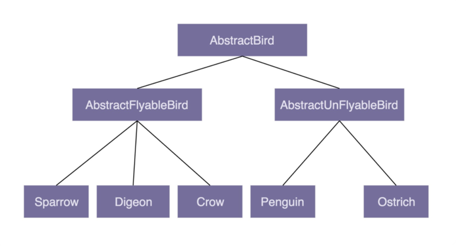
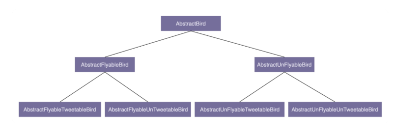

# 0107. 理论七：为何说要多用组合少用继承？如何决定该用组合还是继承？

王争 2019-11-25

在面向对象编程中，有一条非常经典的设计原则，那就是：组合优于继承，多用组合少用继承。为什么不推荐使用继承？组合相比继承有哪些优势？如何判断该用组合还是继承？今天，我们就围绕着这三个问题，来详细讲解一下这条设计原则。

## 7.1 为什么不推荐使用继承？

继承是面向对象的四大特性之一，用来表示类之间的 is-a 关系，可以解决代码复用的问题。虽然继承有诸多作用，但继承层次过深、过复杂，也会影响到代码的可维护性。所以，对于是否应该在项目中使用继承，网上有很多争议。很多人觉得继承是一种反模式，应该尽量少用，甚至不用。为什么会有这样的争议？我们通过一个例子来解释一下。

假设我们要设计一个关于鸟的类。我们将「鸟类」这样一个抽象的事物概念，定义为一个抽象类 AbstractBird。所有更细分的鸟，比如麻雀、鸽子、乌鸦等，都继承这个抽象类。我们知道，大部分鸟都会飞，那我们可不可以在 AbstractBird 抽象类中，定义一个 fly() 方法呢？答案是否定的。尽管大部分鸟都会飞，但也有特例，比如鸵鸟就不会飞。鸵鸟继承具有 fly() 方法的父类，那鸵鸟就具有「飞」这样的行为，这显然不符合我们对现实世界中事物的认识。当然，你可能会说，我在鸵鸟这个子类中重写（override）fly() 方法，让它抛出 UnSupportedMethodException 异常不就可以了吗？具体的代码实现如下所示：

```java
public class AbstractBird {
  //...省略其他属性和方法...
  public void fly() { //... }
}

public class Ostrich extends AbstractBird { //鸵鸟
  //...省略其他属性和方法...
  public void fly() {
    throw new UnSupportedMethodException("I can't fly.'");
  }
}
```

这种设计思路虽然可以解决问题，但不够优美。因为除了鸵鸟之外，不会飞的鸟还有很多，比如企鹅。对于这些不会飞的鸟来说，我们都需要重写 fly() 方法，抛出异常。这样的设计，一方面，徒增了编码的工作量；另一方面，也违背了我们之后要讲的最小知识原则（Least Knowledge Principle，也叫最少知识原则或者迪米特法则），暴露不该暴露的接口给外部，增加了类使用过程中被误用的概率。

你可能又会说，那我们再通过 AbstractBird 类派生出两个更加细分的抽象类：会飞的鸟类 AbstractFlyableBird 和不会飞的鸟类 AbstractUnFlyableBird，让麻雀、乌鸦这些会飞的鸟都继承 AbstractFlyableBird，让鸵鸟、企鹅这些不会飞的鸟，都继承 AbstractUnFlyableBird 类，不就可以了吗？具体的继承关系如下图所示：



从图中我们可以看出，继承关系变成了三层。不过，整体上来讲，目前的继承关系还比较简单，层次比较浅，也算是一种可以接受的设计思路。我们再继续加点难度。在刚刚这个场景中，我们只关注「鸟会不会飞」，但如果我们还关注「鸟会不会叫」，那这个时候，我们又该如何设计类之间的继承关系呢？

是否会飞？是否会叫？两个行为搭配起来会产生四种情况：会飞会叫、不会飞会叫、会飞不会叫、不会飞不会叫。如果我们继续沿用刚才的设计思路，那就需要再定义四个抽象类（AbstractFlyableTweetableBird、AbstractFlyableUnTweetableBird、AbstractUnFlyableTweetableBird、AbstractUnFlyableUnTweetableBird）。



如果我们还需要考虑「是否会下蛋」这样一个行为，那估计就要组合爆炸了。类的继承层次会越来越深、继承关系会越来越复杂。而这种层次很深、很复杂的继承关系，一方面，会导致代码的可读性变差。因为我们要搞清楚某个类具有哪些方法、属性，必须阅读父类的代码、父类的父类的代码…… 一直追溯到最顶层父类的代码。另一方面，这也破坏了类的封装特性，将父类的实现细节暴露给了子类。子类的实现依赖父类的实现，两者高度耦合，一旦父类代码修改，就会影响所有子类的逻辑。

总之，继承最大的问题就在于：继承层次过深、继承关系过于复杂会影响到代码的可读性和可维护性。这也是为什么我们不推荐使用继承。那刚刚例子中继承存在的问题，我们又该如何来解决呢？

## 7.2 组合相比继承有哪些优势？

实际上，我们可以利用组合（composition）、接口、委托（delegation）三个技术手段，一块儿来解决刚刚继承存在的问题。我们前面讲到接口的时候说过，接口表示具有某种行为特性。针对「会飞」这样一个行为特性，我们可以定义一个 Flyable 接口，只让会飞的鸟去实现这个接口。对于会叫、会下蛋这些行为特性，我们可以类似地定义 Tweetable 接口、EggLayable 接口。我们将这个设计思路翻译成 Java 代码的话，就是下面这个样子：

```java
public interface Flyable {
  void fly();
}
public interface Tweetable {
  void tweet();
}
public interface EggLayable {
  void layEgg();
}
public class Ostrich implements Tweetable, EggLayable {//鸵鸟
  //... 省略其他属性和方法...
  @Override
  public void tweet() { //... }
  @Override
  public void layEgg() { //... }
}
public class Sparrow impelents Flayable, Tweetable, EggLayable {//麻雀
  //... 省略其他属性和方法...
  @Override
  public void fly() { //... }
  @Override
  public void tweet() { //... }
  @Override
  public void layEgg() { //... }
}
```

不过，我们知道，接口只声明方法，不定义实现。也就是说，每个会下蛋的鸟都要实现一遍 layEgg() 方法，并且实现逻辑是一样的，这就会导致代码重复的问题。那这个问题又该如何解决呢？我们可以针对三个接口再定义三个实现类，它们分别是：实现了 fly() 方法的 FlyAbility 类、实现了 tweet() 方法的 TweetAbility 类、实现了 layEgg() 方法的 EggLayAbility 类。然后，通过组合和委托技术来消除代码重复。具体的代码实现如下所示：

```java
public interface Flyable {
  void fly()；
}
public class FlyAbility implements Flyable {
  @Override
  public void fly() { //... }
}
//省略Tweetable/TweetAbility/EggLayable/EggLayAbility

public class Ostrich implements Tweetable, EggLayable {//鸵鸟
  private TweetAbility tweetAbility = new TweetAbility(); //组合
  private EggLayAbility eggLayAbility = new EggLayAbility(); //组合
  //... 省略其他属性和方法...
  @Override
  public void tweet() {
    tweetAbility.tweet(); // 委托
  }
  @Override
  public void layEgg() {
    eggLayAbility.layEgg(); // 委托
  }
}
```

我们知道继承主要有三个作用：表示 is-a 关系，支持多态特性，代码复用。而这三个作用都可以通过其他技术手段来达成。比如 is-a 关系，我们可以通过组合和接口的 has-a 关系来替代；多态特性我们可以利用接口来实现；代码复用我们可以通过组合和委托来实现。所以，从理论上讲，通过组合、接口、委托三个技术手段，我们完全可以替换掉继承，在项目中不用或者少用继承关系，特别是一些复杂的继承关系。

## 7.3 如何判断该用组合还是继承？

尽管我们鼓励多用组合少用继承，但组合也并不是完美的，继承也并非一无是处。从上面的例子来看，继承改写成组合意味着要做更细粒度的类的拆分。这也就意味着，我们要定义更多的类和接口。类和接口的增多也就或多或少地增加代码的复杂程度和维护成本。所以，在实际的项目开发中，我们还是要根据具体的情况，来具体选择该用继承还是组合。

如果类之间的继承结构稳定（不会轻易改变），继承层次比较浅（比如，最多有两层继承关系），继承关系不复杂，我们就可以大胆地使用继承。反之，系统越不稳定，继承层次很深，继承关系复杂，我们就尽量使用组合来替代继承。除此之外，还有一些设计模式会固定使用继承或者组合。比如，装饰者模式（decorator pattern）、策略模式（strategy pattern）、组合模式（composite pattern）等都使用了组合关系，而模板模式（template pattern）使用了继承关系。

前面我们讲到继承可以实现代码复用。利用继承特性，我们把相同的属性和方法，抽取出来，定义到父类中。子类复用父类中的属性和方法，达到代码复用的目的。但是，有的时候，从业务含义上，A 类和 B 类并不一定具有继承关系。比如，Crawler 类和 PageAnalyzer 类，它们都用到了 URL 拼接和分割的功能，但并不具有继承关系（既不是父子关系，也不是兄弟关系）。仅仅为了代码复用，生硬地抽象出一个父类出来，会影响到代码的可读性。如果不熟悉背后设计思路的同事，发现 Crawler 类和 PageAnalyzer 类继承同一个父类，而父类中定义的却只是 URL 相关的操作，会觉得这个代码写得莫名其妙，理解不了。这个时候，使用组合就更加合理、更加灵活。具体的代码实现如下所示：

```java
public class Url {
  //...省略属性和方法
}

public class Crawler {
  private Url url; // 组合
  public Crawler() {
    this.url = new Url();
  }
  //...
}

public class PageAnalyzer {
  private Url url; // 组合
  public PageAnalyzer() {
    this.url = new Url();
  }
  //..
}
```

还有一些特殊的场景要求我们必须使用继承。如果你不能改变一个函数的入参类型，而入参又非接口，为了支持多态，只能采用继承来实现。比如下面这样一段代码，其中 FeignClient 是一个外部类，我们没有权限去修改这部分代码，但是我们希望能重写这个类在运行时执行的 encode() 函数。这个时候，我们只能采用继承来实现了。

```java
public class FeignClient { // Feign Client框架代码
  //...省略其他代码...
  public void encode(String url) { //... }
}

public void demofunction(FeignClient feignClient) {
  //...
  feignClient.encode(url);
  //...
}

public class CustomizedFeignClient extends FeignClient {
  @Override
  public void encode(String url) { //...重写encode的实现...}
}

// 调用
FeignClient client = new CustomizedFeignClient();
demofunction(client);
```

尽管有些人说，要杜绝继承，100% 用组合代替继承，但是我的观点没那么极端！之所以「多用组合少用继承」这个口号喊得这么响，只是因为，长期以来，我们过度使用继承。还是那句话，组合并不完美，继承也不是一无是处。只要我们控制好它们的副作用、发挥它们各自的优势，在不同的场合下，恰当地选择使用继承还是组合，这才是我们所追求的境界。

## 重点回顾

到此，今天的内容就讲完了。我们一块儿来回顾一下，你需要重点掌握的知识点。

1、为什么不推荐使用继承？继承是面向对象的四大特性之一，用来表示类之间的 is-a 关系，可以解决代码复用的问题。虽然继承有诸多作用，但继承层次过深、过复杂，也会影响到代码的可维护性。在这种情况下，我们应该尽量少用，甚至不用继承。

2、组合相比继承有哪些优势？继承主要有三个作用：表示 is-a 关系，支持多态特性，代码复用。而这三个作用都可以通过组合、接口、委托三个技术手段来达成。除此之外，利用组合还能解决层次过深、过复杂的继承关系影响代码可维护性的问题。

3、如何判断该用组合还是继承？尽管我们鼓励多用组合少用继承，但组合也并不是完美的，继承也并非一无是处。在实际的项目开发中，我们还是要根据具体的情况，来选择该用继承还是组合。如果类之间的继承结构稳定，层次比较浅，关系不复杂，我们就可以大胆地使用继承。反之，我们就尽量使用组合来替代继承。除此之外，还有一些设计模式、特殊的应用场景，会固定使用继承或者组合。

## 黑板墙

我们在基于 MVC 架构开发 Web 应用的时候，经常会在数据库层定义 Entity，在 Service 业务层定义 BO（Business Object），在 Controller 接口层定义 VO（View Object）。大部分情况下，Entity、BO、VO 三者之间的代码有很大重复，但又不完全相同。我们该如何处理 Entity、BO、VO 代码重复的问题呢？

### 01

我的观点比较极端，用接口、组合和委托代替继承。原因如下：1）人无法预知未来，现在比较稳定的类继承关系将来未必稳定。2）两种设计之间的选择耗费资源，每次都要为这个问题拿捏一下，甚至争论一下，不如把争论放在业务逻辑的实现上。3）相对于接口 + 组合 + 委托增加的复杂度，代码统一成接口 + 组合 + 委托带来的好处更多，利于阅读和交流，毕竟读代码的次数大于写的次数，读一种类型的代码的难度远低于读两种类型。4）新的编程语言让接口 + 组合 + 委托变得容易，例如 Kotlin 就有专门的语法糖支持，消除了很多模板代码。5）接口 + 组合 + 委托符合矢量化思想，那就是将物体特征分成不同的维度，每个维度独立变化。继承则是将物体分类，抽取共性，处理共性，操作的灵活性大打折扣，毕竟现实中的物体特征多，共性少。2019-11-25

### 02

课堂讨论 answer：Entity，Bo，Vo 三者之间，显然并不存在 is-a 关系，首先排除使用继承。其次三者间也并非是严格的 has-a 关系，half measure 之一是考虑使用组合（composition） + 委托（delegation）的方式解决代码重复的问题，但并不是我心中的最佳答案。我的答案是不解决三者间的代码重复问题。Value Class 就只是 Value Class，代码重复并不是业务上的代码重复，那就让它重复吧。2019-11-25

### 03

VO、BO、DO 表示什么前面都说过了，我觉得得换一个思路去看待这种模型转换的问题。这里我们将 BO 看做 ddd 里面的核心域中的实体。那么这个对象的变化应该对 VO 或者 DO 隐藏起来，VO 是对外的模型，为什么需要感知到内部业务的变化，DO 是具体的存储方式，这是由实现决定的，在业务逻辑中也不应该关心。重要的是隔离，让这三者独立变化。所以我的结论是，既不应该用继承，也不应该使用组合，使用防腐层，模型转换层隔离这种变化才是最好的。但是实际上在很多业务中 BO 和 DO 是差不多的，于是就混用了，在业务不复杂的时候，也没太大关系。业务运行的很好，也不难理解。追求完美，却不可能处处完美。2019-11-26

### 04

看下来对组合跟委托两个概念表示不太明白，看了代码后才，以及网上查阅后才明白。1）继承 (Inheritance)：利用 extends 来扩展一个基类。is-a 的关系。2）组合 (composition)：一个类的定义中使用其他对象。has-a 的关系。3）委托 (delegation)：一个对象请求另一个对象的功能，捕获一个操作并将其发送到另一个对象。有 uses-a、owns-a、has-a 三种关系。2019-11-25

### 05

理解或总结如下：1）「比如 is-a 关系，我们可以通过组合和接口的 has-a 关系来替代」，我的理解为：is-a 意味着 has-muilti-a's 或者 has-all-needed-a's。故而需要实现多个接口，而接口抽象的是操作或者方法而非数据（数据和方法的抽象由抽象类来完成），所以具体的操作要由被组合进来的类对象来完成，站在类间关系的角度来看，外部类和被组合类之间的关系被称为「委托」。2）这里面，被组合类的代码被抽象到了接口中，或者反过来说接口的具体操作下沉到了被组合类中，这就是「代码复用我们可以通过组合和委托来实现」的含义，代码被不同的被组合类「分门（类）别类」的复用了。3）「多态特性我们可以利用接口来实现」，因为接口代表了某种契约，而多态就是用子类代替父类。只要实现了某种接口，按照契约，自然就可以在某些方面或某种程度上代替父类。所以我觉得接口是「更细粒度更多控制的更有节制的继承」。

回到本课的问题。之前的课说到 VO、BO、Entity 是典型的面向过程的编码，里面基本都是数据，没有方法。那么自然不可以用接口来减少代码的重复，只能用继承了。但是 MVC 的结构，我理解它是一种分层客户端服务器架构，Layered Client-Server，每一层为其之上的层服务，并使用其之下的层所提供的服务。为了减少层之间的耦合，必要的重复是可以的。2019-11-25

### 06

汇总：1）VO、BO、Entity 三个命名在现在面向服务而非页面的后端编程，并不合适。2）这里最好用组合。entity 是最小的实体单元，bo 可能面对多个 entity 聚合，vo 可能面对多个 bo 聚合，这种场景下，显然组合更适合。虽然也存在 entity 和 bo 一对一的场景，或者 bo 中只有一个主 entity 的场景，这种场景用继承倒也不为过。但是，为了套路单一，减少阅读思考，统一组合便是，没必要再引入继承。3）老项目里面，代码已经高度耦合，而且不是面相接口写的代码，那么整体改动成本会很大。这种情况下用继承实现多态我觉得挺合适。4）Java1.8 提供接口的方法默认实现后，我觉得继承的处境真的挺尴尬，新项目反正能用继承实现的用组合也可以。所以除非父子关系特别明显（继承不深其实比组合直观），不然没什么必要用继承了。2019-11-25

### 07

目前一项目中使用 SpringBoot 开发，其中对象定义为入参为 DTO，数据库实现为 Entity，业务返回结果为 VO，三者对象完全独立，其中大部分属性相同，在 DTO 对象添加 convertToEntity 方法，Entity 添加 convertToVO 方法，实现对象属性拷贝。同时在 DTO 和 VO 中使用组合方式，有很少数的继承。2019-11-28

### 08

VO 就是用来指定对外暴露的字段，跟 DO 不算是 is-a 关系，稳定性也不高，所以个人认为不需要处理和 DO 的重复代码。2019-11-26

### 09

可以使用组合 + 继承来解决代码重复的问题，但实际项目中我更倾向于不同层次之间的冗余（前提是 MVC 框架），因为我理解的优秀的代码是服务于优秀的设计架构的，也就是说不通层次之间的代码中肯定会有冗余，因为数据是在不同层次中流转的。不过在同一个层次中的代码冗余就有优化的必要了。2019-11-27

### 10

我们现在采用 entity 实现，VO 和 BO 都去继承它，减少代码重复。看了专栏后，我认为可以通过讲 VO 和 BO 组合成 Entity 实现，不知道这样做，是不是合适？作者回复：好像不合适，怎么通过 vo 和 bo 组合成 entity 呢？2019-11-25

### 11

个人观点：我们变成是围绕着数据打桩的，BO、VO、Entity，核心是需要持久化的 Entity，BO 为了更好的进行业务处理在 VO 上进行扩展，VO 则是为了展示在 Entity 上的扩展。当然 VO、BO 各自也有属于自己层面的属性，需要做到暴露「共有」属性，隐藏「特有」属性。BO、VO 可以扩展（继承）Entity，又各自「特有」属性。可以借鉴组合的思路，BO、VO 各自一些属于自己逻辑层的特有属性。2020-03-21

### 12

Entity、BO、VO 这个重复代码问题也纠结过，BO，VO 不需要 Entity 的所有属性，所以继承不大合适。用组合的话要套个其他实例单独写方法，麻烦。现在都是直接单独写，重复就重复了，而且一般也不会有复杂的逻辑，就重复属性和 getter/setter。特别想知道这个问题合适的做法。希望老师能在下节讲下上一节的问题，再布置下下节的问题，个人感觉这种方式比放到统一答疑章节要好很多。2019-11-26

### 13

因为 Entity，BO，VO 都是描述对象的，只不过是用于不同目的的对象，这些对象之间会有很多重复的元素定义，针对这样的重复定义，我倒是感觉可以使用继承，将重复的那些元素都提取出来作为父类，然后 entity，VO，BO 去继承这个父类，在实现自己独有的元素。而接口主要是针对不同能能的复用，用在 E，B，V 身上并不合适。2019-11-25

### 14

继承的优点是可以提高代码的复用，但过渡复杂的继承会影响代码可读性和维护性。组合的优点是提高代码的复用，降低业务结构的复杂度，但会增加分支结构导致需要更细粒度的设计。继承类似于多线程的 synchronized 关键字，不能细粒度控制可能导致性能问题。组合类似于 Lock 锁，可以进行更细粒度的控制，但使用复杂度可能会提高。所以我们应该根据具体的业务选择合适的方案。2020-03-17

### 15

今天主要讲组合和继承的使用，总结一下就是结构稳定继承层次浅（不超过两层）可以使用继承，否则使用组合 + 接口 + 委托单位方式。我的倾向是有共同结构或者业务上是同一类的优先使用继承，否则使用组合的方式。仍然回归定义，接口是行为的抽象，与行为相关的代码逻辑优先使用组合，在定义接口的时候要考虑得行为的通用性，也就是符合单一职责。下面说下思考题，entity、vo、bo 本身就是不同层面的业务对象，entity 是数据层对象，vo 是展示层对象，bo 是业务层对象，如果三者之间有通用的属性就各自定义好了，如果多种业务都有一些公共的属性则可以单独定义这么个 bo、vo，然后使用组合的方式拿过来就好了。而且从业务看这不是重复代码，感觉问题可以更具体点。2020-02-23

### 16

对于这个问题，在实际开发中，我们经常使用 Beans 这个工具类其中的 copproperties() 方法去解决代码重复赋值问题，但是经过了这几天的学习，发现经常使用的 mvc 是一个面向过程的贫血模型，所以我给出的解决答案是使用接口、组合以及委托这种方式去替换它，这是我学完这节课的一个设想，但这三者之间并没有什么直接的关系，我认为这三者没必要去解决他们的代码重复问题，他们三个本身来说就应该是相对独立的，不然有这么多代码重复，我们为什么不将其放到一个对象里面了？在整个 MVC 三层之间都共用一个对象。2020-02-19

### 17

老师，我理解继承的核心目标是提供一种更符合人类思维模式的代码组织手段，除了代码复用也可以提高代码的可读性。只不过这个技术很难运用得恰当，容易造成过度设计或者结构腐化，所以需要慎重使用。您举的鸟的例子就能体现，其实鸟类概念的定义本身就没有飞翔的属性，所以不能提供 fly 方法。这种场景就像在代码开发中很多人最开始对一个类的边界理解有些许偏差导致设计问题，后续调整继承关系的成本很高。所以说与其说继承一无是处，不如说使用继承特性十分危险。2020-02-14

### 18

个人认为，那些 xO 还是各自独立的好，因为属于不同层面的对象，从建模角度讲，他们之间不是相同领域的对象，只是恰好大部分字段相同，如果数据转换时有太多 target.setXxx (source.getXxx ())，仅仅为了方便和减少代码量，可以考虑采用小工具的方式，如 copyProperties、字段 mapping 等手段来实现。2020-01-12

### 19

关于思考的问题，DO、VO、BO、DTO 等，属于不同领域，各自的职责不一样，所以无所谓相同的属性。比如 DTO 做为参数的入参对象，会在属性上加一些校验注解或者在加一些 swagger API 接扣文档注解，而其他的 O 并不需要，尊从单一职责原则。2020-01-09

### 20

VO、BO、Entity 我最近在重写一个 mvc web 项目，（原有项目结构是 Bo extends Entity 在后台数据层 mybatis 和 controller 共用了 Bo） 我改的策略是废弃了 bo extends Bo 增加了 Vo 以及复杂查询的 Query ，query 与 Vo 不关心后续结构只关心定制化内容，前端小伙伴完全对照参数录入。Bo 层可能有一些特殊处理与定制。我没有完全去想集成或者组合，我的目标只是想把他们职责更清晰一点，干净一点。改完之后就是感觉许多出要 transform 比较多但可以借助一些 copy 技术的机制。我也不知道有没有更好的办法来处理这些，设计模式没怎么学过，DDD 只听说过。2019-12-05

### 21

业务开发常见问题，解决办法看具体场景而定。主要方式：1）继承，适用在 VO、BO 与 ENTITY 很接近，基本对应数据库字段，直接继承可以复用代码。但是需要能够容忍某些冗余的字段出现。2）组合，使用 ENTITY 组合作为 VO、BO 的成员属性，需要能容忍冗余字段。3）继承 + 组合，将 VO 和 BO 公共部分提取成为单独的类，再通过继承或组合完成复用。定义最为准确，业务和 ENTITY 分离，个人最推荐方式。2019-11-29
