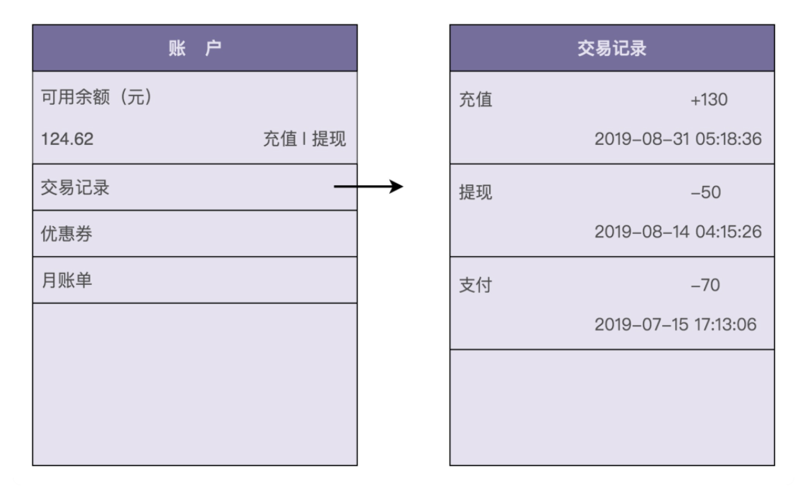
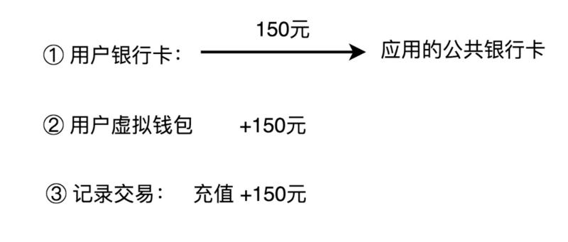
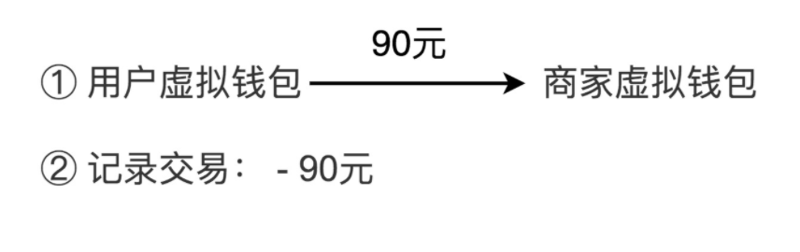
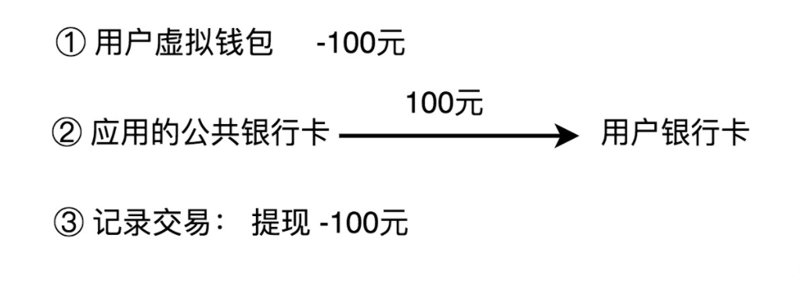
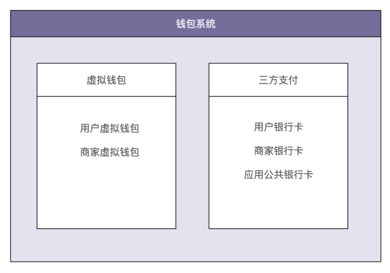
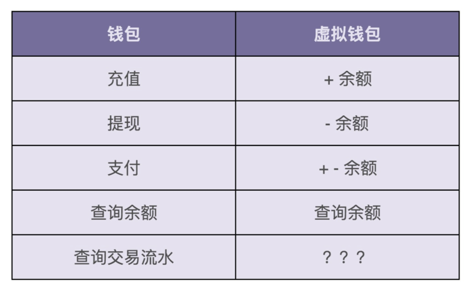
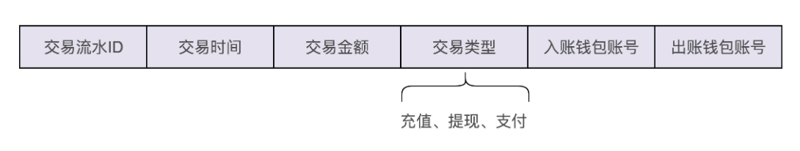
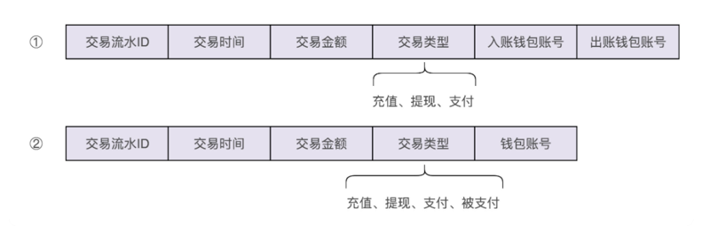
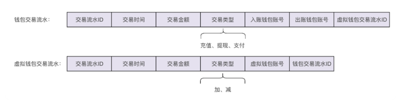

# 0109. 实战1：如何利用基于充血模型的 DDD 开发一个虚拟钱包系统？

王争 2019-11-29

上一节课，我们做了一些理论知识的铺垫性讲解，讲到了两种开发模式，基于贫血模型的传统开发模式，以及基于充血模型的 DDD 开发模式。今天，我们正式进入实战环节，看如何分别用这两种开发模式，设计实现一个钱包系统。

## 9.1 钱包业务背景介绍

很多具有支付、购买功能的应用（比如淘宝、滴滴出行、极客时间等）都支持钱包的功能。应用为每个用户开设一个系统内的虚拟钱包账户，支持用户充值、提现、支付、冻结、透支、转赠、查询账户余额、查询交易流水等操作。下图是一张典型的钱包功能界面，你可以直观地感受一下。



一般来讲，每个虚拟钱包账户都会对应用户的一个真实的支付账户，有可能是银行卡账户，也有可能是三方支付账户（比如支付宝、微信钱包）。为了方便后续的讲解，我们限定钱包暂时只支持充值、提现、支付、查询余额、查询交易流水这五个核心的功能，其他比如冻结、透支、转赠等不常用的功能，我们暂不考虑。为了让你理解这五个核心功能是如何工作的，接下来，我们来一块儿看下它们的业务实现流程。

1、充值。用户通过三方支付渠道，把自己银行卡账户内的钱，充值到虚拟钱包账号中。这整个过程，我们可以分解为三个主要的操作流程：第一个操作是从用户的银行卡账户转账到应用的公共银行卡账户；第二个操作是将用户的充值金额加到虚拟钱包余额上；第三个操作是记录刚刚这笔交易流水。



2、支付。用户用钱包内的余额，支付购买应用内的商品。实际上，支付的过程就是一个转账的过程，从用户的虚拟钱包账户划钱到商家的虚拟钱包账户上。除此之外，我们也需要记录这笔支付的交易流水信息。



3、提现。除了充值、支付之外，用户还可以将虚拟钱包中的余额，提现到自己的银行卡中。这个过程实际上就是扣减用户虚拟钱包中的余额，并且触发真正的银行转账操作，从应用的公共银行账户转钱到用户的银行账户。同样，我们也需要记录这笔提现的交易流水信息。



4、查询余额。查询余额功能比较简单，我们看一下虚拟钱包中的余额数字即可。

5、查询交易流水。查询交易流水也比较简单。我们只支持三种类型的交易流水：充值、支付、提现。在用户充值、支付、提现的时候，我们会记录相应的交易信息。在需要查询的时候，我们只需要将之前记录的交易流水，按照时间、类型等条件过滤之后，显示出来即可。

## 9.2 钱包系统的设计思路

根据刚刚讲的业务实现流程和数据流转图，我们可以把整个钱包系统的业务划分为两部分，其中一部分单纯跟应用内的虚拟钱包账户打交道，另一部分单纯跟银行账户打交道。我们基于这样一个业务划分，给系统解耦，将整个钱包系统拆分为两个子系统：虚拟钱包系统和三方支付系统。



为了能在有限的篇幅内，将今天的内容讲透彻，我们接来下只聚焦于虚拟钱包系统的设计与实现。对于三方支付系统以及整个钱包系统的设计与实现，我们不做讲解。你可以自己思考下。现在我们来看下，如果要支持钱包的这五个核心功能，虚拟钱包系统需要对应实现哪些操作。我画了一张图，列出了这五个功能都会对应虚拟钱包的哪些操作。注意，交易流水的记录和查询，我暂时在图中打了个问号，那是因为这块比较特殊，我们待会再讲。



从图中我们可以看出，虚拟钱包系统要支持的操作非常简单，就是余额的加加减减。其中，充值、提现、查询余额三个功能，只涉及一个账户余额的加减操作，而支付功能涉及两个账户的余额加减操作：一个账户减余额，另一个账户加余额。现在，我们再来看一下图中问号的那部分，也就是交易流水该如何记录和查询？我们先来看一下，交易流水都需要包含哪些信息。我觉得下面这几个信息是必须包含的。



从图中我们可以发现，交易流水的数据格式包含两个钱包账号，一个是入账钱包账号，一个是出账钱包账号。为什么要有两个账号信息呢？这主要是为了兼容支付这种涉及两个账户的交易类型。不过，对于充值、提现这两种交易类型来说，我们只需要记录一个钱包账户信息就够了，所以，这样的交易流水数据格式的设计稍微有点浪费存储空间。

实际上，我们还有另外一种交易流水数据格式的设计思路，可以解决这个问题。我们把「支付」这个交易类型，拆为两个子类型：支付和被支付。支付单纯表示出账，余额扣减，被支付单纯表示入账，余额增加。这样我们在设计交易流水数据格式的时候，只需要记录一个账户信息即可。我画了一张两种交易流水数据格式的对比图，你可以对比着看一下。



那以上两种交易流水数据格式的设计思路，你觉得哪一个更好呢？答案是第一种设计思路更好些。因为交易流水有两个功能：一个是业务功能，比如，提供用户查询交易流水信息；另一个是非业务功能，保证数据的一致性。这里主要是指支付操作数据的一致性。

支付实际上就是一个转账的操作，在一个账户上加上一定的金额，在另一个账户上减去相应的金额。我们需要保证加金额和减金额这两个操作，要么都成功，要么都失败。如果一个成功，一个失败，就会导致数据的不一致，一个账户明明减掉了钱，另一个账户却没有收到钱。

保证数据一致性的方法有很多，比如依赖数据库事务的原子性，将两个操作放在同一个事务中执行。但是，这样的做法不够灵活，因为我们的有可能做了分库分表，支付涉及的两个账户可能存储在不同的库中，无法直接利用数据库本身的事务特性，在一个事务中执行两个账户的操作。当然，我们还有一些支持分布式事务的开源框架，但是，为了保证数据的强一致性，它们的实现逻辑一般都比较复杂、本身的性能也不高，会影响业务的执行时间。所以，更加权衡的一种做法就是，不保证数据的强一致性，只实现数据的最终一致性，也就是我们刚刚提到的交易流水要实现的非业务功能。

对于支付这样的类似转账的操作，我们在操作两个钱包账户余额之前，先记录交易流水，并且标记为「待执行」，当两个钱包的加减金额都完成之后，我们再回过头来，将交易流水标记为「成功」。在给两个钱包加减金额的过程中，如果有任意一个操作失败，我们就将交易记录的状态标记为「失败」。我们通过后台补漏 Job，拉取状态为「失败」或者长时间处于「待执行」状态的交易记录，重新执行或者人工介入处理。

如果选择第二种交易流水的设计思路，使用两条交易流水来记录支付操作，那记录两条交易流水本身又存在数据的一致性问题，有可能入账的交易流水记录成功，出账的交易流水信息记录失败。所以，权衡利弊，我们选择第一种稍微有些冗余的数据格式设计思路。

现在，我们再思考这样一个问题：充值、提现、支付这些业务交易类型，是否应该让虚拟钱包系统感知？换句话说，我们是否应该在虚拟钱包系统的交易流水中记录这三种类型？

答案是否定的。虚拟钱包系统不应该感知具体的业务交易类型。我们前面讲到，虚拟钱包支持的操作，仅仅是余额的加加减减操作，不涉及复杂业务概念，职责单一、功能通用。如果耦合太多业务概念到里面，势必影响系统的通用性，而且还会导致系统越做越复杂。因此，我们不希望将充值、支付、提现这样的业务概念添加到虚拟钱包系统中。

但是，如果我们不在虚拟钱包系统的交易流水中记录交易类型，那在用户查询交易流水的时候，如何显示每条交易流水的交易类型呢？从系统设计的角度，我们不应该在虚拟钱包系统的交易流水中记录交易类型。从产品需求的角度来说，我们又必须记录交易流水的交易类型。听起来比较矛盾，这个问题该如何解决呢？

我们可以通过记录两条交易流水信息的方式来解决。我们前面讲到，整个钱包系统分为两个子系统，上层钱包系统的实现，依赖底层虚拟钱包系统和三方支付系统。对于钱包系统来说，它可以感知充值、支付、提现等业务概念，所以，我们在钱包系统这一层额外再记录一条包含交易类型的交易流水信息，而在底层的虚拟钱包系统中记录不包含交易类型的交易流水信息。为了让你更好地理解刚刚的设计思路，我画了一张图，你可以对比着我的讲解一块儿来看。



我们通过查询上层钱包系统的交易流水信息，去满足用户查询交易流水的功能需求，而虚拟钱包中的交易流水就只是用来解决数据一致性问题。实际上，它的作用还有很多，比如用来对账等。限于篇幅，这里我们就不展开讲了。整个虚拟钱包的设计思路到此讲完了。接下来，我们来看一下，如何分别用基于贫血模型的传统开发模式和基于充血模型的 DDD 开发模式，来实现这样一个虚拟钱包系统？

## 9.3 基于贫血模型的传统开发模式

实际上，如果你有一定 Web 项目的开发经验，并且听明白了我刚刚讲的设计思路，那对你来说，利用基于贫血模型的传统开发模式来实现这样一个系统，应该是一件挺简单的事情。不过，为了对比两种开发模式，我还是带你一块儿来实现一遍。

这是一个典型的 Web 后端项目的三层结构。其中，Controller 和 VO 负责暴露接口，具体的代码实现如下所示。注意，Controller 中，接口实现比较简单，主要就是调用 Service 的方法，所以，我省略了具体的代码实现。

```java
public class VirtualWalletController {
  // 通过构造函数或者IOC框架注入
  private VirtualWalletService virtualWalletService;
  
  public BigDecimal getBalance(Long walletId) { ... } //查询余额
  public void debit(Long walletId, BigDecimal amount) { ... } //出账
  public void credit(Long walletId, BigDecimal amount) { ... } //入账
  public void transfer(Long fromWalletId, Long toWalletId, BigDecimal amount) { ...} //转账
}
```

Service 和 BO 负责核心业务逻辑，Repository 和 Entity 负责数据存取。Repository 这一层的代码实现比较简单，不是我们讲解的重点，所以我也省略掉了。Service 层的代码如下所示。注意，这里我省略了一些不重要的校验代码，比如，对 amount 是否小于 0、钱包是否存在的校验等等。

```java
public class VirtualWalletBo {//省略getter/setter/constructor方法
  private Long id;
  private Long createTime;
  private BigDecimal balance;
}

public class VirtualWalletService {
  // 通过构造函数或者IOC框架注入
  private VirtualWalletRepository walletRepo;
  private VirtualWalletTransactionRepository transactionRepo;
  
  public VirtualWalletBo getVirtualWallet(Long walletId) {
    VirtualWalletEntity walletEntity = walletRepo.getWalletEntity(walletId);
    VirtualWalletBo walletBo = convert(walletEntity);
    return walletBo;
  }
  
  public BigDecimal getBalance(Long walletId) {
    return walletRepo.getBalance(walletId);
  }
  
  public void debit(Long walletId, BigDecimal amount) {
    VirtualWalletEntity walletEntity = walletRepo.getWalletEntity(walletId);
    BigDecimal balance = walletEntity.getBalance();
    if (balance.compareTo(amount) < 0) {
      throw new NoSufficientBalanceException(...);
    }
    walletRepo.updateBalance(walletId, balance.subtract(amount));
  }
  
  public void credit(Long walletId, BigDecimal amount) {
    VirtualWalletEntity walletEntity = walletRepo.getWalletEntity(walletId);
    BigDecimal balance = walletEntity.getBalance();
    walletRepo.updateBalance(walletId, balance.add(amount));
  }
  
  public void transfer(Long fromWalletId, Long toWalletId, BigDecimal amount) {
    VirtualWalletTransactionEntity transactionEntity = new VirtualWalletTransactionEntity();
    transactionEntity.setAmount(amount);
    transactionEntity.setCreateTime(System.currentTimeMillis());
    transactionEntity.setFromWalletId(fromWalletId);
    transactionEntity.setToWalletId(toWalletId);
    transactionEntity.setStatus(Status.TO_BE_EXECUTED);
    Long transactionId = transactionRepo.saveTransaction(transactionEntity);
    try {
      debit(fromWalletId, amount);
      credit(toWalletId, amount);
    } catch (InsufficientBalanceException e) {
      transactionRepo.updateStatus(transactionId, Status.CLOSED);
      ...rethrow exception e...
    } catch (Exception e) {
      transactionRepo.updateStatus(transactionId, Status.FAILED);
      ...rethrow exception e...
    }
    transactionRepo.updateStatus(transactionId, Status.EXECUTED);
  }
}
```

以上便是利用基于贫血模型的传统开发模式来实现的虚拟钱包系统。尽管我们对代码稍微做了简化，但整体的业务逻辑就是上面这样子。其中大部分代码逻辑都非常简单，最复杂的是 Service 中的 transfer() 转账函数。我们为了保证转账操作的数据一致性，添加了一些跟 transaction 相关的记录和状态更新的代码，理解起来稍微有点难度，你可以对照着之前讲的设计思路，自己多思考一下。

## 9.4 基于充血模型的 DDD 开发模式

刚刚讲了如何利用基于贫血模型的传统开发模式来实现虚拟钱包系统，现在，我们再来看一下，如何利用基于充血模型的 DDD 开发模式来实现这个系统？在上一节课中，我们讲到，基于充血模型的 DDD 开发模式，跟基于贫血模型的传统开发模式的主要区别就在 Service 层，Controller 层和 Repository 层的代码基本上相同。所以，我们重点看一下，Service 层按照基于充血模型的 DDD 开发模式该如何来实现。

在这种开发模式下，我们把虚拟钱包 VirtualWallet 类设计成一个充血的 Domain 领域模型，并且将原来在 Service 类中的部分业务逻辑移动到 VirtualWallet 类中，让 Service 类的实现依赖 VirtualWallet 类。具体的代码实现如下所示：

```java
public class VirtualWallet { // Domain领域模型(充血模型)
  private Long id;
  private Long createTime = System.currentTimeMillis();;
  private BigDecimal balance = BigDecimal.ZERO;
  
  public VirtualWallet(Long preAllocatedId) {
    this.id = preAllocatedId;
  }
  
  public BigDecimal balance() {
    return this.balance;
  }
  
  public void debit(BigDecimal amount) {
    if (this.balance.compareTo(amount) < 0) {
      throw new InsufficientBalanceException(...);
    }
    this.balance.subtract(amount);
  }
  
  public void credit(BigDecimal amount) {
    if (amount.compareTo(BigDecimal.ZERO) < 0) {
      throw new InvalidAmountException(...);
    }
    this.balance.add(amount);
  }
}

public class VirtualWalletService {
  // 通过构造函数或者IOC框架注入
  private VirtualWalletRepository walletRepo;
  private VirtualWalletTransactionRepository transactionRepo;
  
  public VirtualWallet getVirtualWallet(Long walletId) {
    VirtualWalletEntity walletEntity = walletRepo.getWalletEntity(walletId);
    VirtualWallet wallet = convert(walletEntity);
    return wallet;
  }
  
  public BigDecimal getBalance(Long walletId) {
    return walletRepo.getBalance(walletId);
  }
  
  public void debit(Long walletId, BigDecimal amount) {
    VirtualWalletEntity walletEntity = walletRepo.getWalletEntity(walletId);
    VirtualWallet wallet = convert(walletEntity);
    wallet.debit(amount);
    walletRepo.updateBalance(walletId, wallet.balance());
  }
  
  public void credit(Long walletId, BigDecimal amount) {
    VirtualWalletEntity walletEntity = walletRepo.getWalletEntity(walletId);
    VirtualWallet wallet = convert(walletEntity);
    wallet.credit(amount);
    walletRepo.updateBalance(walletId, wallet.balance());
  }
  
  public void transfer(Long fromWalletId, Long toWalletId, BigDecimal amount) {
    //...跟基于贫血模型的传统开发模式的代码一样...
  }
}
```

看了上面的代码，你可能会说，领域模型 VirtualWallet 类很单薄，包含的业务逻辑很简单。相对于原来的贫血模型的设计思路，这种充血模型的设计思路，貌似并没有太大优势。你说得没错！这也是大部分业务系统都使用基于贫血模型开发的原因。不过，如果虚拟钱包系统需要支持更复杂的业务逻辑，那充血模型的优势就显现出来了。比如，我们要支持透支一定额度和冻结部分余额的功能。这个时候，我们重新来看一下 VirtualWallet 类的实现代码。

```java
public class VirtualWallet {
  private Long id;
  private Long createTime = System.currentTimeMillis();;
  private BigDecimal balance = BigDecimal.ZERO;
  private boolean isAllowedOverdraft = true;
  private BigDecimal overdraftAmount = BigDecimal.ZERO;
  private BigDecimal frozenAmount = BigDecimal.ZERO;
  
  public VirtualWallet(Long preAllocatedId) {
    this.id = preAllocatedId;
  }
  
  public void freeze(BigDecimal amount) { ... }
  public void unfreeze(BigDecimal amount) { ...}
  public void increaseOverdraftAmount(BigDecimal amount) { ... }
  public void decreaseOverdraftAmount(BigDecimal amount) { ... }
  public void closeOverdraft() { ... }
  public void openOverdraft() { ... }
  
  public BigDecimal balance() {
    return this.balance;
  }
  
  public BigDecimal getAvailableBalance() {
    BigDecimal totalAvaliableBalance = this.balance.subtract(this.frozenAmount);
    if (isAllowedOverdraft) {
      totalAvaliableBalance += this.overdraftAmount;
    }
    return totalAvaliableBalance;
  }
  
  public void debit(BigDecimal amount) {
    BigDecimal totalAvaliableBalance = getAvailableBalance();
    if (totoalAvaliableBalance.compareTo(amount) < 0) {
      throw new InsufficientBalanceException(...);
    }
    this.balance.subtract(amount);
  }
  
  public void credit(BigDecimal amount) {
    if (amount.compareTo(BigDecimal.ZERO) < 0) {
      throw new InvalidAmountException(...);
    }
    this.balance.add(amount);
  }
}
```

领域模型 VirtualWallet 类添加了简单的冻结和透支逻辑之后，功能看起来就丰富了很多，代码也没那么单薄了。如果功能继续演进，我们可以增加更加细化的冻结策略、透支策略、支持钱包账号（VirtualWallet id 字段）自动生成的逻辑（不是通过构造函数经外部传入 ID，而是通过分布式 ID 生成算法来自动生成 ID）等等。VirtualWallet 类的业务逻辑会变得越来越复杂，也就很值得设计成充血模型了。

## 9.5 辩证思考与灵活应用

对于虚拟钱包系统的设计与两种开发模式的代码实现，我想你应该有个比较清晰的了解了。不过，我觉得还有两个问题值得讨论一下。

第一个要讨论的问题是：在基于充血模型的 DDD 开发模式中，将业务逻辑移动到 Domain 中，Service 类变得很薄，但在我们的代码设计与实现中，并没有完全将 Service 类去掉，这是为什么？或者说，Service 类在这种情况下担当的职责是什么？哪些功能逻辑会放到 Service 类中？区别于 Domain 的职责，Service 类主要有下面这样几个职责。

1、Service 类负责与 Repository 交流。在我的设计与代码实现中，VirtualWalletService 类负责与 Repository 层打交道，调用 Respository 类的方法，获取数据库中的数据，转化成领域模型 VirtualWallet，然后由领域模型 VirtualWallet 来完成业务逻辑，最后调用 Repository 类的方法，将数据存回数据库。

这里我再稍微解释一下，之所以让 VirtualWalletService 类与 Repository 打交道，而不是让领域模型 VirtualWallet 与 Repository 打交道，那是因为我们想保持领域模型的独立性，不与任何其他层的代码（Repository 层的代码）或开发框架（比如 Spring、MyBatis）耦合在一起，将流程性的代码逻辑（比如从 DB 中取数据、映射数据）与领域模型的业务逻辑解耦，让领域模型更加可复用。

2、Service 类负责跨领域模型的业务聚合功能。VirtualWalletService 类中的 transfer() 转账函数会涉及两个钱包的操作，因此这部分业务逻辑无法放到 VirtualWallet 类中，所以，我们暂且把转账业务放到 VirtualWalletService 类中了。当然，虽然功能演进，使得转账业务变得复杂起来之后，我们也可以将转账业务抽取出来，设计成一个独立的领域模型。

3、Service 类负责一些非功能性及与三方系统交互的工作。比如幂等、事务、发邮件、发消息、记录日志、调用其他系统的 RPC 接口等，都可以放到 Service 类中。

第二个要讨论问题是：在基于充血模型的 DDD 开发模式中，尽管 Service 层被改造成了充血模型，但是 Controller 层和 Repository 层还是贫血模型，是否有必要也进行充血领域建模呢？

答案是没有必要。Controller 层主要负责接口的暴露，Repository 层主要负责与数据库打交道，这两层包含的业务逻辑并不多，前面我们也提到了，如果业务逻辑比较简单，就没必要做充血建模，即便设计成充血模型，类也非常单薄，看起来也很奇怪。尽管这样的设计是一种面向过程的编程风格，但我们只要控制好面向过程编程风格的副作用，照样可以开发出优秀的软件。那这里的副作用怎么控制呢？

就拿 Repository 的 Entity 来说，即便它被设计成贫血模型，违反面向对象编程的封装特性，有被任意代码修改数据的风险，但 Entity 的生命周期是有限的。一般来讲，我们把它传递到 Service 层之后，就会转化成 BO 或者 Domain 来继续后面的业务逻辑。Entity 的生命周期到此就结束了，所以也并不会被到处任意修改。

我们再来说说 Controller 层的 VO。实际上 VO 是一种 DTO（Data Transfer Object，数据传输对象）。它主要是作为接口的数据传输承载体，将数据发送给其他系统。从功能上来讲，它理应不包含业务逻辑、只包含数据。所以，我们将它设计成贫血模型也是比较合理的。

## 重点回顾

今天的内容到此就讲完了。我们一块来总结回顾一下，你应该重点掌握的知识点。

基于充血模型的 DDD 开发模式跟基于贫血模型的传统开发模式相比，主要区别在 Service 层。在基于充血模型的开发模式下，我们将部分原来在 Service 类中的业务逻辑移动到了一个充血的 Domain 领域模型中，让 Service 类的实现依赖这个 Domain 类。

在基于充血模型的 DDD 开发模式下，Service 类并不会完全移除，而是负责一些不适合放在 Domain 类中的功能。比如，负责与 Repository 层打交道、跨领域模型的业务聚合功能、幂等事务等非功能性的工作。

基于充血模型的 DDD 开发模式跟基于贫血模型的传统开发模式相比，Controller 层和 Repository 层的代码基本上相同。这是因为，Repository 层的 Entity 生命周期有限，Controller 层的 VO 只是单纯作为一种 DTO。两部分的业务逻辑都不会太复杂。业务逻辑主要集中在 Service 层。所以，Repository 层和 Controller 层继续沿用贫血模型的设计思路是没有问题的。

## 黑板墙

这两节课中对于 DDD 的讲解，都是我的个人主观看法，你可能会有不同看法。

### 01

我对 DDD 的看法就是，它可以把原来最重的 service 逻辑拆分并且转移一部分逻辑，可以使得代码可读性略微提高，另一个比较重要的点是使得模型充血以后，基于模型的业务抽象在不断的迭代之后会越来越明确，业务的细节会越来越精准，通过阅读模型的充血行为代码，能够极快的了解系统的业务，对于开发来说能说明显的提升开发效率。在维护性上来说，如果项目新进了开发人员，如果是贫血模型的 service 代码，无论代码如何清晰，注释如何完备，代码结构设计得如何优雅，都没有办法第一时间理解系统的核心业务逻辑，但是如果是充血模型，直接阅读充血模型的行为方法，起码能够很快理解 70% 左右的业务逻辑，因为充血模型可以说是业务的精准抽象，我想，这就是领域模型驱动能够达到「驱动」效果的由来吧。2019-11-29

### 02

理解 OOP，我们就不难理解 DDD。1）DDD 第一原则：将数据和操作结合。（贫血模型将数据和操作分离，违反 OOP 的原则。）2）DDD 第二原则：界限上下文。这是将「单一指责」应用于我们的领域模型。DDD is nothing more than OOP applied to business models. DDD 其实就是把 OOP 应用于业务模型。实现：1）使用通用语言（Ubiquitous Language）：类、方法、字段的命名，要符合业务。使用业务语言命名，以后在和客户或者其他团队交流时能够更顺畅。2）理解系统业务：例如做一个理财系统，要亲自去和银行卖理财产品的人聊聊或者买个理财产品之后，那些数据库中对你来说毫无意义的字段才变得有血有肉。介绍一篇博客吧：[DDD 101 — The 5-Minute Tour. I like crazy challenges. | by Gérald Croës | The Coding Matrix | Medium](https://medium.com/the-coding-matrix/ddd-101-the-5-minute-tour-7a3037cf53b8)。2019-11-29

### 03

看到这里，感觉才真正理解充血模型的作用：真正的业务逻辑都放在充血的领域对象中，与具体使用什么框架（比如 Spring，MyBatis），具体使用什么数据库无关。这样有利于保护领域对象中的数据，比如钱包中的余额，当有入账和出账操作时，余额在领域对象中自动执行加减操作，而不是将余额暴露在 Service 中直接操作（这样很容易出错可能导致帐不平衡，余额应该封装保护起来），当然「余额自动增减」这只是一个简单的业务逻辑例子，业务逻辑越复杂就越应该封装到领域对象中。

1、Service 层只是一个中间层，起到连接和组合作用。用于支持领域模型层和 Repository 层的交互（连接作用），利用各种领域对象执行业务逻辑（组合作用）。比如通过 Repository 查出数据，将数据转换为领域模型对象，利用领域模型对象执行业务逻辑（核心），然后调用 Repository 更新领域模型中的数据。

2、Service 类还负责一些非功能性及与三方系统交互的工作。比如幂等、事务、发邮件、发消息、记录日志、调用其他系统的 RPC 接口等。不允许 Service 中的逻辑过于复杂，如果 Service 中的组合的业务逻辑过于复杂，我们就要将这业务逻辑抽取出一个新的领域对象进行封装，通过调用这个领域对象来进行这些复杂的操作。由于 controller 和 Repository 层中本身没有什么业务逻辑，controller 中的 Vo 对象实际上只是传输数据使用（数据从系统传输数据到外部调用方），Repository 中的 Entity 本质上也只是传输数据（数据从数据库中传输数据到系统），所以用贫血模型不会带来副作用，是没有问题的。2019-11-30

### 04

这两天一直在思考 ddd，就等课程更新，这样一说就理解了，domain 模型使用充血模型设计，使之具备独立性，而业务无关的 vo，po 就可以使用贫血模型进行设计，因为不涉及具体复杂业务，如果 control 层需要调用多个领域模型，则把相关的领域服务组合在一起，这里有个小问题，就是 do 转为 dto 这个过程，应该是在应用层完成还是领域层完成，如果在应用层完成，好像属于把领域模型暴露出去了，希望老师可以在指点一下。2019-11-29

### 05

汇总：1）DDD 真正的价值在于战略设计，对业务模型到领域模型的建模时需要重点关注的有哪些，比如确定核心服务（核心域、通用域、支撑域）、微服务边界（领域、子域）、领域边界（限界上下文），功能归类（聚合）等等。而战略设计最终的目的仍然是说过来说过去的那些，高内聚、低耦合、面向对象设计、职责单一、易扩展、易维护、易拆分、易演进。2）DDD 战术设计是一种实施的方法论，但是因为他是看的见、摸得着（有真正所谓的代码结构可以参考）的，吸引了更多的关注点，如果没有背后的战略设计的思想，生搬硬套，甚至可能会适得其反。3）DDD 最重要的还是设计思想，也就是战略设计，而不是他的模式或者分层方式，也就是战术设计！2019-11-30

### 06

看了老师的这篇文章让我对 entity，bo，vo 有了一个更清晰的认识。我是这样理解的，entity 是对数据库的映射，vo 是前端展示的映射，bo 在 DDD 充血模型中我看到了他的用处，看起来他是将 entity 的一些逻辑业务分离了出来做了一个解耦（在我看来貌似没有 bo 或者说 Domain 类似 加余额减余额的逻辑也可以写在 entity 中，只是这样做对于专注于数据库的 entity 来说逻辑更复杂了，维护起来会很困难 ），同时也解决了 entity 暴露过多 getter setter 方法的问题。不知道我这样理解有没有问题，欢迎老师指正。

同时我有如下几个疑问：1）具体上 domain 和 entity 属性和结构上有哪些不同呢？（在我看来好像能写成一样的）2）在贫血模型下 bo 的作用好像没有那么明显了，多写一层 bo 能给我们带来什么好处呢？3）entity bo vo 类属性上好像有很多重合，貌似在实际编写的过程会出现很多重复代码，并且要为每一层编写转换代码，代码量好像又增加了，对于这种情况应该怎么优化和权衡呢？2019-11-29

### 07

两个问题：1）Entity 转换成 Domain 的代码应该在哪一层实现？感觉在 Service 层不大合适，因为可能多个 Service 会使用到。2）如果涉及到表单的保存，入参是一个保存全量数据的对象 (比如，创建一个新用户的所有用户数据，但部分属性还是要计算得到的，比如年龄等)。这个对象是属于 VO 吗？这时的 Domain 怎么设计呢？数据模型间的转换怎么处理呢？VO -> BO -> Entity 感觉就是在写各种赋值语句啊，所以我以前在传统开发模式是合并 VO、BO、Entity 的，一个大而全的东西也是很尴尬。2019-11-29

### 08

有一个人问题不太懂，数据持久的话，没有 set、get 方法，如何进行持久化？作者回复：如果你用 orm 框架持久化，必须有 get、set，那就要妥协。2019-12-18

### 09

总结（直接忽略案例）：1）充血模型把业务逻辑放到 Domain 中处理，满足了 OOP 的规则，数据和行为封装为一体。类似于 CPU 主管计算，而对于数据转换之类的工作不应该交由 Domain 去做。把外围事务交给 Service 管理，比如接口传入的数据封装，底层数据库数据的读写，就好像 CPU 从来不关心 IO 的差异；比如把日志和消息幂等性等工作交给 Service 处理，CPU 也从来不负责监控和容错。2）自己的感受：这种业务相关性和业务无关性的分离，其实就是遵循了高内聚、低耦合，保证了业务和框架的独立性和重用性。3）问题：无论 vo 还是 Entity 在我看来都是 dto ，这么多 dto 会不会导致类爆炸？大概 4、5 年前，我用过两天 aws 的 sdk ，我记得所有的接口都会有对应的 dto ，所以这种类爆炸是必要的类爆炸，还是也是要自己权衡？类似关联查询返回的结果也算是 Entity 吧，Entity 未必和表一一对应吧（额，感觉不应该在这章提问）？2019-12-03

### 10

看完自己实现的时候有个疑问，每次实例化 VirtualWallet 时候他的 balance 都会被初始化为 0，我又不想把 balance set 的方法暴露出来，但是如果 Domain 不跟 Repository 层交互的话，就无法获取到当前其中的余额。请问下老师是否只能在构造函数中传入这一种办法？作者回复：可以放到构造函数中。2019-12-02

### 11

私以为在实践中 Wallet 调用 Repo 会让代码更简洁，老师担忧的与具体框架耦合的问题，可以让模型依赖仓储的抽象，从设计上并没有对模型产生污染，只是需要在利用切面或其他手段对持久层接口进行实现，这样看来虽然是必须依赖某种框架技术才能将整个模型跑起来，但实践中，只要是大规模系统，IoC/AOP 这种东西都是很基础的吧，总不能一个系统全都用 rt.jar 里的东西来实现，所有代码全都是一层层规规矩矩的对象创建和方法调用吧。service（负责编排 domain） -> domain（负责业务逻辑） -> repo（负责持久化），这样的三层单向调用不是更简洁么？我对 DDD 理解不深，不知道这样的看法对不对。2020-01-12

### 12

个人认为充血模型的好处有如下：1）数据与操作结合，而不是隔离，符合 oop 原则，而非数据驱动。2）关注点分离，或者说单一原则。充血模型包含的逻辑就是与该模型紧密相关的。3）领域模型是系统最为稳定的一层，当系统复杂后，也是作为微服务拆分的依据。因此模型的服用度很高。但是充血模型的难点是：业务复杂后，什么样的逻辑最适合放到模型中？一旦不符合规范，那么充血模型就会变成胀血模型，难以维护。还有一种设计方式：充血模型对外提供的是领域服务（充血的领域模型如果是聚合根的话），而文中的 service 实际上是应用服务，串联多个领域服务以及其他组件功能，实现完整业务逻辑。实际上我们可以抽出 biz-service 业务服务，和 core-service 领域服务。将充血模型的大部分逻辑放到 core-service。这样也很清晰，不至于模型内部的逻辑过于复杂。老师怎么看呢？2019-12-10

### 13

看完这篇对 DDD 也有了初步的认识了，区别了贫血模式的开发，DDD 应用 OOP 的设计实现提高了封装性，在业务对象类 VirtualWallet 中封装数据和基本的数据处理过程，service 使用业务对象类暴露的方法过程以完成完整的功能。实现上业务对象类具备的封装，单一职责等特性，这样在易用，易维护，易扩展，易读等方面较之贫血模型都会有提高。

另外有两个问题请教下老师：1）贫血模型的 service 中有 VirtualWalletRepository，VirtualWalletTransactionRepository 两个 repository，看字面应该是区分是否带事务，不太明白这样写的好处或用意？因为我现在一般是直接在 service 上直接加事务。2）钱包交易流水和虚拟钱包的交易流水的功能区分还不是特别清楚，示例代码也没有体现。事物一致性的日子记录不能直接用钱包交易流水线吗？作者回复: 1、transaction 能处理分布式事务。2、再看遍文章吧，都有讲到。2019-12-03

### 14

看了下项目代码，service 里的方法多数都是获取对象列表，对象入库，删除，很多方法都不是具体某个对象的某个动作，不像余额加减一样，是一个动作，对应某个属性的变化。感觉是不是用不上 DDD 啊。作者回复：简单的业务确实用不上 ddd。2019-12-03

### 15

iOS 端是否可以这样理解：MVVM 中 VM 层相当于 Domain，就 V 层中控制器的业务逻辑抽到了 VM 中，M 层负责数据和数据库操作，因为 M 层数据是对外暴露的依然是贫血。V 层中的 View 相当于文中的 Controller 对外展示数据，只做展示功能，所以可以继续贫血，VM 和 V 双向绑定。因为没有 BO 这种，所以更多的是对控制器数据和业务逻辑的抽离到 VM。而 MVP 也 MVVM 也蛮相似。所以我可以理解 MVVM 和 MVP 算是运用到了充血模型吗？2019-12-02

### 16

对于前端同学而言、DDD 是不是类似于 MVVM 啊？只是没有数据绑定的业务映射。作者回复：是的。2019-12-02

### 17

之前对领域模型有重大误解，把他做成了类似 repository。现在的理解应该是 domain 是 service 层中抽取出来的一些职责单一的点，数据与行为一体的充血领域类。看到阿里编程规范里面的 manager 层应该就是领域模型层了，controller、service 、manager、dao。不知道我现在的理解是否对了，希望老师指点迷津。作者回复：理解的没问题，不过阿里编程规范里的 manager 我不是很清楚是不是就是 domain 层。2020-06-12

### 18

DDD 带来的改善还是体现在复杂业务逻辑上，在简单业务逻辑上的程序能带来的提升很小。其中的思想也是「分久必合，合久必分」。service 类应付简单的业务逻辑时，开发效率高，所有业务逻辑放在一起也没多少行，多于业务逻辑的修改也快。当业务逻辑复杂到一定程度，service 类变得巨大且臃肿，这时必然会带来服务细粒度上的难以重用，复杂的耦合交互。此时意识到可以将服务中的一部分功能定义为领域（Domin）属性，固化相关属性至领域模型中，使得 service 类在调用时的粒度放大，业务逻辑变得更加简单，易读性和可维护性增强。2020-04-28

### 19

其实 DDD 的核心思想就是，对象要负责自己状态的维护，因为 BO 的状态比较复杂，同时，BO 的状态其实是一组业务逻辑的映射，所以对于 Service 这一层，在业务相对复杂的时候采用充血模型是比较理想的，而 Controller 和 Repository 层只涉及数据的获取和传输（理想状态下，大部分时候，Controller 层可能要做一些适配前端数据结构的工作，而 Repository 可能就是单纯的获取数据和存储数据），所以没有必要在这两层上采用充血模型。2020-03-14

### 20

我感觉 service 层的主要作用还是面向接口编程，用于协议约束，遵循这个协议的 domain 可以任意替换，正常的业务都是在修改的过程中发现某一层变的太厚了，维护性越来越差，这个时候就是需要瘦身了，明确责任，不管怎么改，都不会有最佳实践的，都是最满足当下需求的实践。2020-03-10