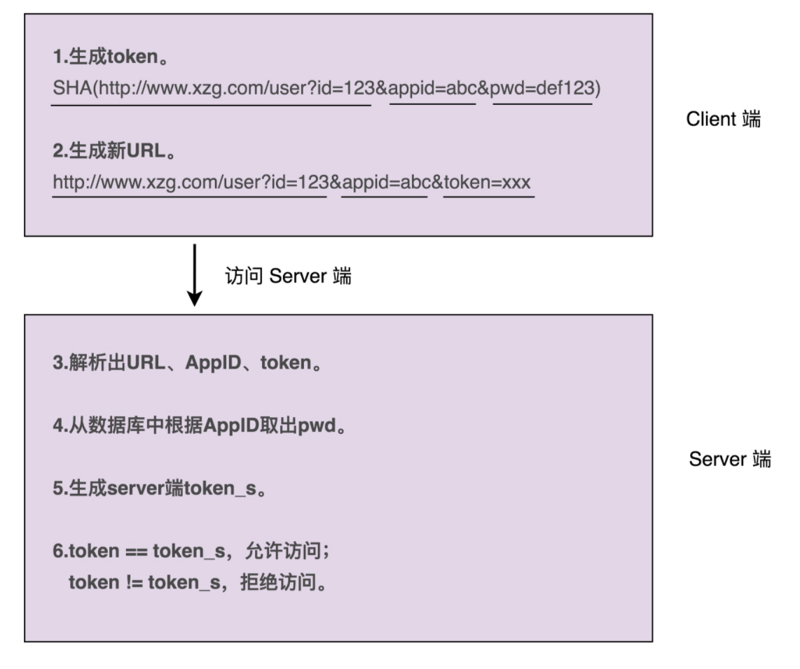

# 0110. 实战2：如何对接口鉴权这样一个功能开发做面向对象分析？

王争 2019-12-02

面向对象分析（OOA）、面向对象设计（OOD）、面向对象编程（OOP），是面向对象开发的三个主要环节。在前面的章节中，我对三者的讲解比较偏理论、偏概括性，目的是让你先有一个宏观的了解，知道什么是 OOA、OOD、OOP。不过，光知道「是什么」是不够的，我们更重要的还是要知道「如何做」，也就是，如何进行面向对象分析、设计与编程。

在过往的工作中，我发现，很多工程师，特别是初级工程师，本身没有太多的项目经验，或者参与的项目都是基于开发框架填写 CRUD 模板似的代码，导致分析、设计能力比较欠缺。当他们拿到一个比较笼统的开发需求的时候，往往不知道从何入手。

对于「如何做需求分析，如何做职责划分？需要定义哪些类？每个类应该具有哪些属性、方法？类与类之间该如何交互？如何组装类成一个可执行的程序？」等等诸多问题，都没有清晰的思路，更别提利用成熟的设计原则、思想或者设计模式，开发出具有高内聚低耦合、易扩展、易读等优秀特性的代码了。所以，我打算用两节课的时间，结合一个真实的开发案例，从基础的需求分析、职责划分、类的定义、交互、组装运行讲起，将最基础的面向对象分析、设计、编程的套路给你讲清楚，为后面学习设计原则、设计模式打好基础。

## 10.1 案例介绍和难点剖析

假设，你正在参与开发一个微服务。微服务通过 HTTP 协议暴露接口给其他系统调用，说直白点就是，其他系统通过 URL 来调用微服务的接口。有一天，你的 leader 找到你说，「为了保证接口调用的安全性，我们希望设计实现一个接口调用鉴权功能，只有经过认证之后的系统才能调用我们的接口，没有认证过的系统调用我们的接口会被拒绝。我希望由你来负责这个任务的开发，争取尽快上线。」

leader 丢下这些话就走了。这个时候，你该如何来做呢？有没有脑子里一团浆糊，一时间无从下手的感觉呢？为什么会有这种感觉呢？我个人觉得主要有下面两点原因。

1、需求不明确。leader 给到的需求过于模糊、笼统，不够具体、细化，离落地到设计、编码还有一定的距离。而人的大脑不擅长思考这种过于抽象的问题。这也是真实的软件开发区别于应试教育的地方。应试教育中的考试题目，一般都是一个非常具体的问题，我们去解答就好了。而真实的软件开发中，需求几乎都不是很明确。

我们前面讲过，面向对象分析主要的分析对象是「需求」，因此，面向对象分析可以粗略地看成「需求分析」。实际上，不管是需求分析还是面向对象分析，我们首先要做的都是将笼统的需求细化到足够清晰、可执行。我们需要通过沟通、挖掘、分析、假设、梳理，搞清楚具体的需求有哪些，哪些是现在要做的，哪些是未来可能要做的，哪些是不用考虑做的。

2、缺少锻炼。相比单纯的业务 CRUD 开发，鉴权这个开发任务，要更有难度。鉴权作为一个跟具体业务无关的功能，我们完全可以把它开发成一个独立的框架，集成到很多业务系统中。而作为被很多系统复用的通用框架，比起普通的业务代码，我们对框架的代码质量要求要更高。

开发这样通用的框架，对工程师的需求分析能力、设计能力、编码能力，甚至逻辑思维能力的要求，都是比较高的。如果你平时做的都是简单的 CRUD 业务开发，那这方面的锻炼肯定不会很多，所以，一旦遇到这种开发需求，很容易因为缺少锻炼，脑子放空，不知道从何入手，完全没有思路。

## 10.2 对案例进行需求分析

实际上，需求分析的工作很琐碎，也没有太多固定的章法可寻，所以，我不打算很牵强地罗列那些听着有用、实际没用的方法论，而是希望通过鉴权这个例子，来给你展示一下，面对需求分析的时候，我的完整的思考路径是什么样的。希望你能自己去体会，举一反三地类比应用到其他项目的需求分析中。

尽管针对框架、组件、类库等非业务系统的开发，我们一定要有组件化意识、框架意识、抽象意识，开发出来的东西要足够通用，不能局限于单一的某个业务需求，但这并不代表我们就可以脱离具体的应用场景，闷头拍脑袋做需求分析。多跟业务团队聊聊天，甚至自己去参与几个业务系统的开发，只有这样，我们才能真正知道业务系统的痛点，才能分析出最有价值的需求。不过，针对鉴权这一功能的开发，最大的需求方还是我们自己，所以，我们也可以先从满足我们自己系统的需求开始，然后再迭代优化。

现在，我们来看一下，针对鉴权这个功能的开发，我们该如何做需求分析？实际上，这跟做算法题类似，先从最简单的方案想起，然后再优化。所以，我把整个的分析过程分为了循序渐进的四轮。每一轮都是对上一轮的迭代优化，最后形成一个可执行、可落地的需求列表。

1、第一轮基础分析。对于如何做鉴权这样一个问题，最简单的解决方案就是，通过用户名加密码来做认证。我们给每个允许访问我们服务的调用方，派发一个应用名（或者叫应用 ID、AppID）和一个对应的密码（或者叫秘钥）。调用方每次进行接口请求的时候，都携带自己的 AppID 和密码。微服务在接收到接口调用请求之后，会解析出 AppID 和密码，跟存储在微服务端的 AppID 和密码进行比对。如果一致，说明认证成功，则允许接口调用请求；否则，就拒绝接口调用请求。

2、第二轮分析优化。不过，这样的验证方式，每次都要明文传输密码。密码很容易被截获，是不安全的。那如果我们借助加密算法（比如 SHA），对密码进行加密之后，再传递到微服务端验证，是不是就可以了呢？实际上，这样也是不安全的，因为加密之后的密码及 AppID，照样可以被未认证系统（或者说黑客）截获，未认证系统可以携带这个加密之后的密码以及对应的 AppID，伪装成已认证系统来访问我们的接口。这就是典型的「重放攻击」。

提出问题，然后再解决问题，是一个非常好的迭代优化方法。对于刚刚这个问题，我们可以借助 OAuth 的验证思路来解决。调用方将请求接口的 URL 跟 AppID、密码拼接在一起，然后进行加密，生成一个 token。调用方在进行接口请求的的时候，将这个 token 及 AppID，随 URL 一块传递给微服务端。微服务端接收到这些数据之后，根据 AppID 从数据库中取出对应的密码，并通过同样的 token 生成算法，生成另外一个 token。用这个新生成的 token 跟调用方传递过来的 token 对比。如果一致，则允许接口调用请求；否则，就拒绝接口调用请求。

这个方案稍微有点复杂，我画了一张示例图，来帮你理解整个流程。

3、第三轮分析优化。不过，这样的设计仍然存在重放攻击的风险，还是不够安全。每个 URL 拼接上 AppID、密码生成的 token 都是固定的。未认证系统截获 URL、token 和 AppID 之后，还是可以通过重放攻击的方式，伪装成认证系统，调用这个 URL 对应的接口。

为了解决这个问题，我们可以进一步优化 token 生成算法，引入一个随机变量，让每次接口请求生成的 token 都不一样。我们可以选择时间戳作为随机变量。原来的 token 是对 URL、AppID、密码三者进行加密生成的，现在我们将 URL、AppID、密码、时间戳四者进行加密来生成 token。调用方在进行接口请求的时候，将 token、AppID、时间戳，随 URL 一并传递给微服务端。

微服务端在收到这些数据之后，会验证当前时间戳跟传递过来的时间戳，是否在一定的时间窗口内（比如一分钟）。如果超过一分钟，则判定 token 过期，拒绝接口请求。如果没有超过一分钟，则说明 token 没有过期，就再通过同样的 token 生成算法，在服务端生成新的 token，与调用方传递过来的 token 比对，看是否一致。如果一致，则允许接口调用请求；否则，就拒绝接口调用请求。

优化之后的认证流程如下图所示。

4、第四轮分析优化。不过，你可能会说，这样还是不够安全啊。未认证系统还是可以在这一分钟的 token 失效窗口内，通过截获请求、重放请求，来调用我们的接口啊！

你说得没错。不过，攻与防之间，本来就没有绝对的安全。我们能做的就是，尽量提高攻击的成本。这个方案虽然还有漏洞，但是实现起来足够简单，而且不会过度影响接口本身的性能（比如响应时间）。所以，权衡安全性、开发成本、对系统性能的影响，这个方案算是比较折中、比较合理的了。

实际上，还有一个细节我们没有考虑到，那就是，如何在微服务端存储每个授权调用方的 AppID 和密码。当然，这个问题并不难。最容易想到的方案就是存储到数据库里，比如 MySQL。不过，开发像鉴权这样的非业务功能，最好不要与具体的第三方系统有过度的耦合。

针对 AppID 和密码的存储，我们最好能灵活地支持各种不同的存储方式，比如 ZooKeeper、本地配置文件、自研配置中心、MySQL、Redis 等。我们不一定针对每种存储方式都去做代码实现，但起码要留有扩展点，保证系统有足够的灵活性和扩展性，能够在我们切换存储方式的时候，尽可能地减少代码的改动。

5、最终确定需求。到此，需求已经足够细化和具体了。现在，我们按照鉴权的流程，对需求再重新描述一下。如果你熟悉 UML，也可以用时序图、流程图来描述。不过，用什么描述不是重点，描述清楚才是最重要的。考虑到在接下来的面向对象设计环节中，我会基于文字版本的需求描述，来进行类、属性、方法、交互等的设计，所以，这里我给出的最终需求描述是文字版本的。

最终需求：1）调用方进行接口请求的时候，将 URL、AppID、密码、时间戳拼接在一起，通过加密算法生成 token，并且将 token、AppID、时间戳拼接在 URL 中，一并发送到微服务端。2）微服务端在接收到调用方的接口请求之后，从请求中拆解出 token、AppID、时间戳。3）微服务端首先检查传递过来的时间戳跟当前时间，是否在 token 失效时间窗口内。如果已经超过失效时间，那就算接口调用鉴权失败，拒绝接口调用请求。4）如果 token 验证没有过期失效，微服务端再从自己的存储中，取出 AppID 对应的密码，通过同样的 token 生成算法，生成另外一个 token，与调用方传递过来的 token 进行匹配；如果一致，则鉴权成功，允许接口调用，否则就拒绝接口调用。

这就是我们需求分析的整个思考过程，从最粗糙、最模糊的需求开始，通过「提出问题 - 解决问题」的方式，循序渐进地进行优化，最后得到一个足够清晰、可落地的需求描述。

## 重点回顾

针对框架、类库、组件等非业务系统的开发，其中一个比较大的难点就是，需求一般都比较抽象、模糊，需要你自己去挖掘，做合理取舍、权衡、假设，把抽象的问题具象化，最终产生清晰的、可落地的需求定义。需求定义是否清晰、合理，直接影响了后续的设计、编码实现是否顺畅。所以，作为程序员，你一定不要只关心设计与实现，前期的需求分析同等重要。

需求分析的过程实际上是一个不断迭代优化的过程。我们不要试图一下就能给出一个完美的解决方案，而是先给出一个粗糙的、基础的方案，有一个迭代的基础，然后再慢慢优化，这样一个思考过程能让我们摆脱无从下手的窘境。

## 黑板墙

除了工作中我们会遇到需求不明确的开发任务，实际上，在面试中，我们也经常遇到一些开放性的设计问题，对于这类问题，你是如何解答的？有哪些好的经验可以分享给大家呢？

### 01

工作中遇到非 crud 的需求我就会想尽一切办法让他通用，基本需求分析和需求设计的时间占用百分之五十，开发和重构到自认为最优占用百分之五十。比如最简单的验证码功能，几乎每个项目都有，我就封装一套验证码服务，主要功能有你在配置文件里配置好需要被验证码拦截的路径，这里还要考虑到通配符，空格等等细节和可扩展的点，内置图片验证码，极验证，手机验证以及自定义验证码等等，总之我认为如果有机会遇到非 crud 的需求，一定要好好珍惜，好好把握，把他打造成属于自己的产品，这样会让自己下意识的去想尽一切办法把他做到最优，亲儿子一样的待遇，再也不会无脑 cv，连变量名可能都要认真的重构一两遍。2019-12-02

### 02

一句话：使用进化算法的思想，提出一个 MVP（最小可行性产品），逐步迭代改进。拿到这个需求，假设我们不了解接口鉴权，需求又不明确，我会我自己如下问题：1）什么叫接口鉴权？搞清基本概念。2）接口鉴权最佳实践是什么？技术调研。3）appid 和 secret key 从哪里来？用户自己申请还是我们授权？用户申请是以什么方式申请（网页还是邮件？申请的网页有人做了么？）追问下去。4）appid secretkey 存储在什么地方呢？数据存储。5）用户如何使用？需要为用户提供接口鉴权使用手册和文档，及示例代码。写用户手册，文档。6）这个功能如何测试？提前想好如何测试。7）接口鉴权功能何时上线？估计工期。8）鉴权成功或失败返回码和信息定义？约定返回结果。关于防止重放攻击：请求参数中还可以加入 nonce（随机正整数），两次请求的 nonce 不能重复，timestamp 和 nonce 结合进一步防止重放攻击。2019-12-02

### 03

OAuth 2.0 + 网关（如 Zuul）+ 认证中心 + AOP 可以实现。极客时间《微服务架构实战 160 讲》里介绍了 OAuth 2.0 企业级的解决方案，小争哥的方案适合快速落地。实际业务中如果安全等级没这么高，直接生成 Token 鉴权就可以。通过业务模型规避风险：1）充值类业务，就算对方篡改接口，最终结果可以通调用证金融机构的接口验证是否有效，不会给公司带来损失。2）如果安全等级非常高，比如提现、转账可以通过发送手机短信，确保是本人操作。3）如果是商品信息查询类接口，防止第三方爬取数据，可以在调用一定次数后加入「人机验证」（输入图片识别码、拼图）。4）根据 IP 限制访问次数。5）服务器间调用可以绑定 mac 地址、IP。6）服务器、客户端通过架设私有 VPN 进行通信，将安全问题转移到 VPN 上，降低业务复杂度的同时还可以避免加解密带来的性能损耗，提升性能。7）调用接口时通过付费方式（如实名认证、银行四要素验证这些调用一次都是要收费的），防止恶意调用。8）通过独立加密硬件（如 U 盾）+ 独立密码验证器（Google 验证器）+ 语音识别 + 面部识别（刷脸支付） + 指纹 + 多人同时输入动态秘钥（核打击时发射程序）。9）安全性会降低系统性能适可而止。极客时间《左耳听风》专栏中介绍了亚马逊在设计开发微服务时，就已经做好了随时对外网开放的准备，由于没有阅读完整个专栏，不知道后面有没有详细介绍。2019-12-03

### 04

光拼 url 是不够的，只能覆盖如 HTTP GET 一类参数在 url 中的请求，对于如 POST 和 PUT 一类的请求，因为参数通常在 body 中，就没有参与 token 的生成。又因为这样的方案存在允许重放请求的时间间隔，就可能导致的情况是中间人截获了请求，在允许重放的时间间隔内任意修改 body 中的参数后发送，让接口鉴权形同虚设。

### 05

这个需求去年我就做过，给自己系统的对外接口开发一个鉴权的功能。因为之前了解过 oauth2，当时就直接想到了 oauth2 鉴权来实现，就去学习了下，然后选择了「客户端模式」来实现，给各个应用分配 appid 和 appsecrete，客户端拿 appid 和 appsecrete 请求有一定时效的 token，应用拿到 token 后再跟 appid 和 appsecrete 一起来请求接口，服务端鉴权通过后即可调用。老师的例子是客户端定开始时间，我做的是服务端定开始时间。不过当时分析的时候没有意识去一步步分析，就是一下子想起来就去做了，也没有去想着做什么优化，以后在遇到这种问题，应该多去分析，思考，才能让设计更优。2019-12-02

### 06

像今天的例子中，如果老板给我这样的需求，我第一反应就是去想怎么实现，用什么技术实现，有什么现成的框架，而不是去先思考「用户名密码登录验证」这最基础的第一步。刚开始脑子就一团浆糊，知道完成也是在便实现便理思路，这样浪费时间而且最后也没有自己完整的思路过程。以后还是要先理清思路，理清需求再去考虑每一小需求实现的技术。2019-12-02

### 07

一般遇到这种需求不是特别明确的，先自己理解第一遍需求，有一个大概的思路，然后在和产品经理确认是不是这样。需求确认之前在按照争哥说的需求分析，对需求做任务分解，将需求分解成一个个小的任务点，每个小任务都是很容易执行的。就算开发过程中被打断了，也不要紧。任务分解的尽量小，这样重新回到开发状态也就越容易。2019-12-02

### 08

防止重放攻击的方案在老师的基础做进一步的迭代设计：1）要求客户端生成一个唯一的请求 id，如以 uuid 方式。2）客户端在以 sha 等加密哈希方式生成 token 时，也将请求 id 加入其中。3）客户端也要将请求 id 作为参数传递到服务端，如果是 rest api 就是也要将请求 id 拼接到 url 参数中。4）服务端检查服务端的缓存中 (可以是 redis) 是否有客户端传递的请求 id，如果有，则判定为重放攻击，拒绝请求。如果没有，则将请求 id 放到缓存中同时设置在 token 失效的时间窗内缓存的请求 id 自动失效（如 redis key 的 TTL）。

这个实现思路是：在时间窗内的重放攻击，以服务端在时间缓存了在时间窗内的所有请求 id 的形式来防护，而在时间窗外的重放攻击就是老师的方案中检查客户端传过来的时间 (时间戳) 和服务端当前时间 (时间戳) 相减的绝对值不能超过时间窗的长度来实现。另外，时间戳、请求 id 等都 hash 在了 token 中，所有客户端是无法篡改的。

这个实现思路的缺点是：改实现方案要求客户端的时间和服务端的时间之间的差距不能超过时间窗，如果时间窗设置为 1 分钟这种比较小的，则要求客户端时间和服务端时间不能超过 1 分钟，这个有点苛刻，比如客户端如 app 所在的手机的时间不准确了，但就差 1 分钟，将无法访问接口。如果时间窗设置过长，如 30 分钟，则要求服务端缓存中缓存最近 30 分钟的请求 id，如果接口的访问并发挺大的话，缓存占用空间也将很大，需要评估。2019-12-05

### 09

我们公司有个重构项目，也是要最客户端鉴权，但是旧客户端没有做 token 之类的鉴权传 token，但现在要做，如何做到兼容旧客户端做鉴权呢？作者回复：后端可以对没有传递 token 的不做校验。2019-12-02

### 10

有个问题：通过同样的 token 生成算法，在服务端生成新的 token，与调用方传递过来的 token 比对。这个做法是不是有点多余？ 能把 token 解密难道不能说明 token 没有问题么？作者回复: token 是单向加密算法生成的，无法解密的。2019-12-02

### 11

这个鉴权功能需求分析的很好，但是和面向对象分析没有多大关系吧。作者回复：我理解的面向对象分析，就是需求分析。2019-12-04

### 12

时间戳要不要拼接在 url 里产生 token 应该都可以吧？服务端反正是按照 url 里解析的时间戳去过滤的。作者回复：放到里面的目的是让每次生成的 token 都不一样。2019-12-02

### 13

client 端生成的 token 在时间窗口内，假如用户在操作中停留了 1 分钟（时间窗口），那 token 就过期了吗？作者回复：是要发送请求到服务器的时候才生成 token。2019-12-02

### 14

本次以接口鉴权展示乐面向对象编程的一般流程：也就是进行面向对象得需求分析，将模糊的需求细化为可落地的具体的需求，可以按照最小可行性产品思维思考，到底是什么才是该需求要解决问题，需要哪些功能，分别用来做什么的，如果有专业术语也要搞清楚与需求本身的联系，逐步讲抽象的描述具体化流程化。要提醒自己，你理解的需求和 PD 写的需求可能不是同一个东西，一定要多沟通确认清楚，随着业务复杂度的增加，我们需要深入理解业务，业务都理解不清楚妄谈领域驱动设计是毫无意义的，画图是一个很好理解业务的方法，大部分时候我们可能只负责某一个模块，但是如果跳出来主动去看整个业务链路你理解的深度也会加深。2020-02-27

### 15

我记得我之前面试一家公司的时候，面试官曾经出过一个问题，如何保证在一台电脑上不同的浏览器，只要有一个浏览器登陆的账号，其他浏览器在登录的时候也可以做到直接登陆呢。针对这种比较笼统的需求的时候，我一开始给出的想法是请求服务端的时候利用请求者的 IP 地址，如果他的 IP 地址在我们的数据库中存储了，那么就直接进行登录，如果发现了异地存储，再利用手机号验证这种方式，将数据库里面的登录 IP 改为新的 IP，但是这样的话，无法防止攻击者伪装他人的 IP 地址进行登录，于是乎我联想一下我能不能在本机上，保存一个文件，然后每次无论什么浏览器去访问的时候都去读取这个文件，并且带的文件上面的信息去直接请求，直白说就是账号密码，后来我想到了 host 文件，因为一般来说 host 的文件都是将网站名和网站的真实 IP 进行相映射的，那么我们可以在用户登录的时候去读取 host 文件，当然再过于具体的实现我没有给出，这只是我的一个思路，后来面试官说这也算是一种实现思路，不过就是比较流氓。也不知道大家有什么更好的实现思路。2020-02-20