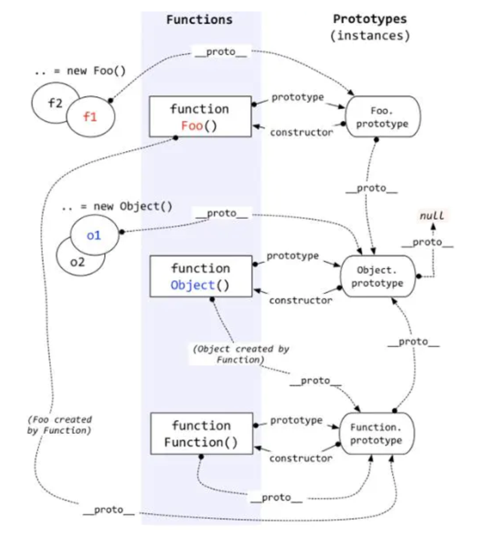
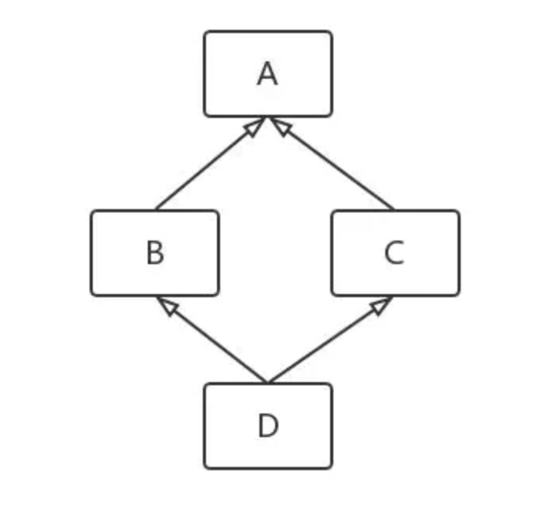
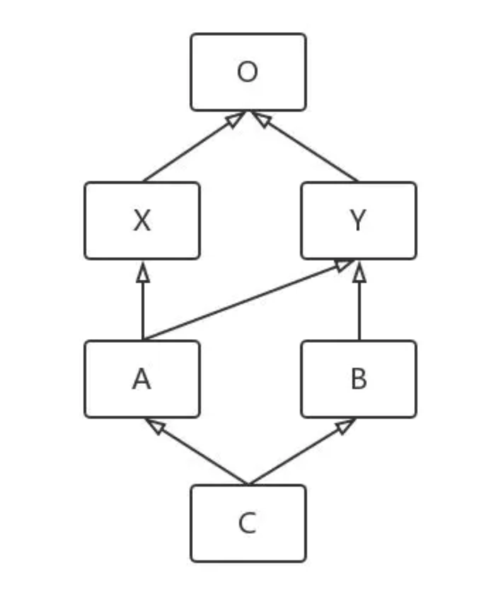

# 0121附件：JavaScript中的多继承

2018-04-04

[JavaScript中的多继承 - 前端 - 掘金](https://juejin.im/entry/6844903587546431502)

原文链接： [JavaScript中的多继承 - 知乎](https://zhuanlan.zhihu.com/p/34693209)

首先 JavaScript 中不存在多继承，并且也不推荐使用继承。如果你也这么认为的话，那笔者的观点也就写完啦 233333…. 如果还想回顾下 JavaScript 中「继承」的前世今生，以及对「多继承」的讨论，不妨慢慢看下去。

## 01. 苦苦追求的语法糖

在 ES6 出现以前，在还没有使用 React、Vue 等框架之前，我们在做稍复杂的前端页面和组件时，会经常用模块化的思想去封装一些可复用的逻辑，会想着给 JavaScript 提供「类」的支持，再结合一些设计模式，就可以做出各种灵活的代码结构。我们知道 JavaScript 中并不存在 class，存在的只是原型链，都是通过函数和 prototype 去封装一些东西来模拟「类」。可以说任何一个函数都可以被视为一个「类」，只要你愿意。

关于 prototype 不是本文的重点，笔者一直收藏了这张图经常用来给自己复习。



图 1-JavaScript 原型链

1『上面的图需要好好消化。』

那些年，我们一直在等待「类」的语法糖。。。

### 1.1 模拟一个类

在强类型的语言中，类是为了面向对象，就不得不提其三大特性：封装、继承、多态。

```js
var Book = (function() {
  // 私有静态属性
  var privateStaticAttribute = 0;
  // 私有静态方法
  var privateStaticMethod = function() {};
  // 构造函数
  return function(props) {
    // 私有属性
    var title;
    // 私有方法
    this.getTitle = function() { return title; };
    this.setTitle = function(title) {};
  }
})();
// 公有静态方法
Book.staticMethod = function() {};
// 公有方法
Book.prototype.publicSharedMethod = function() {};
```

这样的代码想必都很面熟，借鉴了强类型语言中的「类」的概念，既然是类，它除了封装一些属性和方法，还需要做到可见性的控制。由于 JavaScript 中没有可见性修饰符，只能用闭包来模拟 public 与 private。虽然比起 Java / C++ 中的类还有很多不足，但至少做到了一些封装，而且通常我们还可以建立命名规范，约定下划线开头的属性名或方法名为私有的。

有了「封装」之后，我们就要考虑「继承」了。然而 JavaScript 也没有继承的机制，都是使用 prototype 去模拟，实现方式有很多，出现了各种各样的「继承」方法。原型式继承、类式继承，甚至模拟 super 关键字，提供 Class.extend()、this.super() 等便利的用法，都是运用闭包和 prototype 实现的 Syntactic sugar。这也就是过去 Prototype.js 这样的库对前端产生的影响。

而至于「多态」，这是只在强类型语言中需要考虑的，当无法在编译时确定一个对象的类型时，只能在运行时确定一个函数要从哪儿去获取。常见的应用场景是：用父类型的引用去接收子类型的对象，使用父类型中定义的函数去统一操作不同子类的对象，并且子类中可以覆盖父类中的函数。正巧 JavaScript 的弱类型特征，不存在编译时要确定类型，天然支持多态。

1『 JS 天然支持多态，何解？』

### 1.2 到了 ES5 后

ES5 有了 Object.create()，让我们更便捷地使用原型继承，Object.getPrototypeOf、Object.setPrototypeOf 可以更自由地操控原型链。

```js
var Book = function(title) {
  Object.defineProperty(this, 'title', {
    writable: false,
    value: title
  });
};
Book.prototype.getTitle = function() { return this.title; };

var EBook = function(link) {
  Object.defineProperty(this, 'link', {
    writable: false,
    value: link
  });
};
EBook.prototype = Object.create(Book.prototype, {
  download: {
    writable: false,
    value: function() { console.log('Start...'); }
  }
});
// 一定要修正 constructor
EBook.prototype.constructor = EBook;

// testing
var jsorz = new EBook('https://zhuanlan.zhihu.com/ElemeFE');
console.log(jsorz instanceof Book);
console.log(jsorz instanceof EBook);
console.log(jsorz.constructor === EBook);
console.log(jsorz.hasOwnProperty('getTitle') === false);
console.log(Object.getPrototypeOf(jsorz) === EBook.prototype);
console.log(Object.getPrototypeOf(jsorz).constructor === EBook);
```

注：Object.getPrototypeOf 返回的即「图1」中 \_\_proto__ 的指向。

### 1.3 ES6 中的继承

在 ES2015 中有了 class 语法糖，有了 extends、super、static 这样的关键字，更像强类型语言中的「类」了。

```js
class Book {
  constructor(props) {
    this._title = props.title;
  }
  get title() { return this._title; }
  static staticMethod() {}
  toString() { return `Book_${ this._title }`; }
}

class EBook extends Book {
  constructor(props) {
    super(props);
    this._link = props.link;
  }
  set link(val) { this._link = val; }
  toString() { return `Book_${ this._link }`; }
}
```

上面的语法确实清晰简单了，我们再看下编译成 ES5 后的代码是怎样的。

```js
var Book = function () {
  function Book(props) {
    _classCallCheck(this, Book);
    this._title = props.title;
  }
  _createClass(Book, [{
    key: "toString",
    // 省略...
  }, {
    key: "title",
    // 省略...
  }], [{
    key: "staticMethod",
    // 省略...
  }]);
  return Book;
}();

var EBook = function (_Book) {
  function EBook(props) {
    // 省略...
  }
  _inherits(EBook, _Book);
  _createClass(EBook, [{
    key: "toString",
    // 省略...
  }, {
    key: "link",
    // 省略...
  }]);
  return EBook;
}(Book);
```

示例生成的代码可以用 Babel REPL 查看，可以看到 ES6 提供的 class 语法真的是 Syntactic sugar，本质上与我们用 ES5 甚至更早时模拟的「类」与「继承」如出一辙。

### 1.4 小结

JavaScript 很容易模拟一个「类」，并且可以一定程度上做到面向对象中的三大特性：封装、继承、多态。从最初去模拟一个「类」，到 ES5 提供更便捷的原型操控 API，到 ES6 中提供更多「类」相关的关键字，都是在帮我们减小 JavaScript 中面向对象的使用成本。

虽然 JavaScript 中的「继承」并不是真正的继承，「类」也不是真正的「类」，相比 Java 肯定还有很多实现不了的地方，比如 abstract class、Interface 等，只能通过一些 tricky 的办法去模拟。因此 JavaScript 中所谓的「继承」，是为了方便程序员用面向对象的方式来组织代码。

## 02. 试试多继承

贪心是人之常情，有了「继承」后，我们就会想要「多继承」。即使在后端语言中，也没有几个语言能真正实现多继承，笔者只知道 C++ 和 python 提供了多继承的语法，而像 Java 只允许继承一个父类，但可以同时 implements 多个接口类，也算一种变相的多继承吧。

### 2.1 多继承要考虑的问题

多继承并没有想象的那么美好，首先是对 instanceof 提出了更高的要求。

```js
class A {}
class B {}
// 假定有支持多继承的语法
class C extends A, B {}
// 那么 C 的实例对象，应该同时也是 A 和 B 的 instance
let c = new C()
c instanceof C  // true
c instanceof A  // true
c instanceof B  // true
```

如上示例，在多继承中必须将所有的父类标识记录在子类中，才能让 instanceof 实现上面的效果。而 JavaScript 中只有 prototype 链，该死的还约束了一个对象只能指定一个 prototype，所以还得另外想办法去模拟 instanceof。

这还不算啥，请看下一张图



图 2-Diamond Problem

1『钻石问题这个名字原来是来自上面的这张图，赞。』

这是多继承中典型的问题，称为 Diamond Problem，当 A、B、C 中都定义了一个相同名称的函数时，而在 D 的实例对象中调用这个函数时，究竟应该去执行谁。

### 2.2 间接多继承

先退而求其次，我们借鉴了 Java 中的思路，实际只继承一个类，通过其他方式将其他类的功能融入。Java 中可以用 Interface 约束一个类应该拥有的行为，当然 JavaScript 也可以这么做，实现 interface 的语法糖，检查「类」中有没有重写 interface 中的所有函数。但这样的话，interface 除了做校验之用，没有实际意义，不如直接 mixin 的方式来的实在。

```js
const mixinClass = (base, ...mixins) => {
  const mixinProps = (target, source) => {
    Object.getOwnPropertyNames(source).forEach(prop => {
      if (/^constructor$/.test(prop)) { return; }
      Object.defineProperty(target, prop, Object.getOwnPropertyDescriptor(source, prop));
    })
  };

  let Ctor;
  if (base && typeof base === 'function') {
    Ctor = class extends base {
      constructor(...props) {
        super(...props);
      }
    };
    mixins.forEach(source => {
      mixinProps(Ctor.prototype, source.prototype);
    });
  } else {
    Ctor = class {};
  }
  return Ctor;
};

class A {
  methodA() {}
}
class B {
  methodB() {}
}
class C extends mixinClass(A, B) {
  methodA() { console.log('methodA in C'); }
  methodC() {}
}

let c = new C();
c instanceof C  // true
c instanceof A  // true
c instanceof B  // false
```

这样就简单模拟了间接多继承，通过构造一个中间类，让中间类直接继承 A，并且 mixin 了 B 的原型成员，然后再让 C 去继承这个中间类。由于 B 是通过 mixin 方式浅拷贝了一份，B.prototype 并不在 C 的原型链上（C.\_\_proto\_\_.\_\_proto__），所以 c instanceof B 为 false。

要想修正 instanceof，只能自己另外实现一套 isInstanceOf() 的逻辑，在继承时将所有的父类引用记录下来，再去比对。

### 2.3 MRO算法

针对多继承考虑的第 2 个问题，前面提到的 Diamond Problem，需要引入一个定义。

Method Resolution Order（MRO）指的是在继承结构中确定类的线性顺序，例如 C => B => A 表示 C 继承 B，B 继承 A，那么 C 的 MRO 就是 C B A，也就意味着当调用 C 实例中的一个函数时，会按照 C B A 的优先级顺序去「寻找」该函数。在单继承的结构中自然没有问题，而在多继承中 MRO 发挥着其作用。常用的 C3 算法就是用来计算 MRO，在 python 文档中有对其的完整描述，这里用一个例子简述下算法流程。

假设现在有这样的多继承结构：



图 3-多继承示例结构

首先引入类的线性顺序的表示方法，在上图中可以看到 B => Y => O 这一部分是单继承的结构，显然 B 的 MRO 为 B Y O，记为 L(B) = BYO。然后还要引入几个符号，在 MRO 的线性顺序中，用 head 表示第一个元素，用 tail 表示余下部分。例如，B Y O 中的 head 就是 B，tail 则是 Y O。MRO 中只有一个元素，如图 3 中的 O 元素，head 为O，tail 则是空。

接下来是最关键的，图中 A 的 MRO 记为 L(A(X, Y))，A(X, Y) 表示 A 同时继承了 X 和 Y，那么：

```
L(A(X, Y)) = A + merge(L(X), L(Y), XY)
```

其中 merge 的规则如下：

```
取出第一个序列的 head
如果，该 head 不在其它序列的 tail 中
     则把这个 head 添加到结果中并从所有的序列中移除它
否则，用下一个序列的 head 重复上一步
直到所有序列中的所有元素都被移除（或者无法找到一个符合的 head）
```

最后我们来计算下图 3 中各个类的线性顺序：

```
L(O) = O
L(X) = X + L(O) = XO
L(Y) = Y + L(O) = YO
L(A) = A + merge(L(X), L(Y), XY)
     = A + merge(XO, YO, XY)
     = AX + merge(O, YO, Y)
     = AXY + merge(O, O)
     = AXYO
L(B) = B + L(Y) = BYO
L(C) = C + merge(L(A), L(B), AB)
     = C + merge(AXYO, BYO, AB)
     = CA + merge(XYO, BYO, B)
     = CAX + merge(YO, BYO, B)
     = CAXB + merge(YO, YO)
     = CAXBYO
```

上述多继承结构的 python 示例可参见 glot.io/snippets/ez… 输出了 C 这个类的 MRO 即 C A X B Y O。

当然 C3 算法也有 bad case，会导致上述的 merge 在中途失败，也就是无法求出 MRO 的 case。关于 MRO 的更多细节可参考 [The Python 2.3 Method Resolution Order | Python.org](https://www.python.org/download/releases/2.3/mro/) 总之不推荐设计出过于复杂的多继承结构。

### 2.4 模拟多继承

有了上面的基础后，我们来模拟实现下多继承：

为每个「类」提供独立的 isInstanceOf() 函数以解决 instanceof 的问题。同时引入 Method Resolution Order (MRO) 的 C3 算法，将每个「类」的 MRO 线性序列存入 meta 数据中。将多继承中的第一个父类，使用原型链的方式继承，而剩下的父类则使用 mixin 的方式。

```js
const mixinProps = (target, source) => {
  Object.getOwnPropertyNames(source).forEach(prop => {
    if (/^(?:constructor|isInstanceOf)$/.test(prop)) { return; }
    Object.defineProperty(target, prop, Object.getOwnPropertyDescriptor(source, prop));
  })
};

const mroMerge = (list) => {
  if (!list || !list.length) {
    return [];
  }
  for (let items of list) {
    let item = items[0];
    let valid = true;
    for (let items2 of list) {
      if (items2.indexOf(item) > 0) {
        valid = false;
        break;
      }
    }

    if (valid) {
      let nextList = [];
      for (let items3 of list) {
        let _index = items3.indexOf(item);
        if (_index > -1) {
          items3.splice(_index, 1);
        }
        items3.length && nextList.push(items3);
      }
      return [item, ...mroMerge(nextList)];
    }
  }
  throw new Error('Unable to merge MRO');
};

const c3mro = (ctor, bases) => {
  if (!bases || !bases.length) {
    return [ctor];
  }
  let list = bases.map(b => b._meta.bases.slice());
  list = list.concat([bases]);
  let res = mroMerge(list);
  return [ctor, ...res];
};

const createClass = (parents, props) => {
  const isMulti = parents && Array.isArray(parents);
  const superCls = isMulti ? parents[0] : parents;
  const mixins = isMulti ? parents.slice(1) : [];

  const Ctor = function(...args) {
    // TODO: call each parent's constructor
    if (props.constructor) {
      props.constructor.apply(this, args);
    }
  };

  // save c3mro into _meta
  let bases = [superCls, ...mixins].filter(item => !!item);
  Ctor._meta = { bases: c3mro(Ctor, bases) };

  // inherit first parent through proto chain
  if (superCls && typeof superCls === 'function') {
    Ctor.prototype = Object.create(superCls.prototype);
    Ctor.prototype.constructor = Ctor;
  }

  // mix other parents into prototype according to [Method Resolution Order]
  // NOTE: Ctor._meta.bases[0] always stands for the Ctor itself
  if (Ctor._meta.bases.length > 1) {
    let providers = Ctor._meta.bases.slice(1).reverse();
    providers.forEach(provider => {
      // TODO: prototype of superCls is already inherited by __proto__ chain
      (provider !== superCls) && mixinProps(Ctor.prototype, provider.prototype);
    });
  }
  mixinProps(Ctor.prototype, props);

  Ctor.prototype.isInstanceOf = function(cls) {
    let bases = this.constructor._meta.bases;
    return bases.some(item => item === cls) || (this instanceof cls);
  }
  return Ctor;
};
```

接着来测试一下如图 3 中的多继承结构：

```js
const O = createClass(null, {});
const X = createClass([O], {});
const Y = createClass([O], {
  methodY() { return 'Y'; }
});
const A = createClass([X, Y], {
  testName() { return 'A'; }
});
const B = createClass([Y], {
  testName() { return 'B'; }
});
const C = createClass([A, B], {
  constructor() {
    this._name = 'custom C';
  }
});

let obj = new C();
console.log(obj.isInstanceOf(O)); // true
console.log(obj.isInstanceOf(X)); // true
console.log(obj.isInstanceOf(Y)); // true
console.log(obj.isInstanceOf(A)); // true
console.log(obj.isInstanceOf(B)); // true
console.log(obj.isInstanceOf(C)); // true
console.log(obj.testName());
console.log(obj.methodY());
```

以上代码仅供学习，还有很多不足，比如构造函数中只能调用自身的 constructor 函数，无法调用父类的 constructor。这是由于 JavaScript 限制了无法通过 XX.prototype.constructor.apply() 的方式调用其他类的构造函数（constructor 只能在 new 的时候被调用）。想绕开这个问题的话，只能换个函数名，叫 initializtion、init 之类的名字都行。

demo 代码在这里，多改变下参数试试，尝试理解前面所说的 C3 MRO 算法。

### 2.5 存在的问题

上面的代码，为了模拟多继承，只将第一个父类放入了子类的原型链中，而其他父类只能通过 mixin 的方式将其 prototype 中的属性拷贝到子类的 prototype 中。这受限于 JavaScript 原型链的机制，即图 1 中 \_\_proto__ 只能指向一个目标。所以既然这样实现的，肯定是与真正的多继承相悖的，像 C++ 中有虚函数表的机制，在多继承中调用函数时，会去查表找出真正的函数地址。而我们模拟出的 JavaScript 多继承，是将所有父类中的函数都揉到了一个 prototype 中（只不过按照 MRO 优先级顺序来依次揉入）。

仔细看上面代码的话会发现，c.testName() 输出的与 Method Resolution Order 中所述的算法不符。在那一节中，我们知道 C 的 MRO 应该为 C A X B Y O，示例代码中按理来说应该优先调用 A 中的 testName() 函数，实际却输出了 “B”……卧槽，这代码有毒的吧？？

```js
// inherit first parent through proto chain
if (superCls && typeof superCls === 'function') {
  Ctor.prototype = Object.create(superCls.prototype);
  Ctor.prototype.constructor = Ctor;
}
// mix other parents into prototype according to [Method Resolution Order]
// NOTE: Ctor._meta.bases[0] always stands for the Ctor itself
if (Ctor._meta.bases.length > 1) {
  let providers = Ctor._meta.bases.slice(1).reverse();
  providers.forEach(provider => {
    // TODO: prototype of superCls is already inherited by __proto__ chain
    (provider !== superCls) && mixinProps(Ctor.prototype, provider.prototype);
  });
}
```

注意代码里有句 (provider !== superCls) 的过滤，你可以把它去了再试下 demo。

笔者这里也纠结，因为 superCls 是第一个父类，已经在原型链上继承了，而在根据 MRO 顺序 mixin 其他父类时，按理应该将第一个父类过滤掉。然而一旦加上了 (provider !== superCls) 条件后，其他父类 prototype 上的属性都被拷贝到了 Ctor.prototype 上，而第一个父类中的原型却在 Ctor 的原型链上，显然 Ctor.prototype 上的函数优先级更高。

那我们将这个条件干掉！然而仍有 bad case。。因为它将所有父类中的 prototype 都拷贝到了自己身上（它明明不应该有的），而当别人再继承它时，别人会误以为它定义了那么多函数，也会出现函数覆盖时的顺序与 MRO 计算出的顺序不一致的问题。

归根到底还是「没有查函数表」的锅！或者我们在使用方式上做强约束，多继承中的所有函数调用都必须经过统一的形如 invoke(methodName, args) 的接口，在 invoke 时根据 MRO 的优先级顺序，依次查找有无 methodName 的函数，再执行真正调用。

## 03. 为什么不建议继承

说了那么多，笔者的体会是不要想着继承，不要想着继承，不要想着继承。JavaScript 本身就不是面向对象的语言，干嘛要让它做它不擅长的事情。虽然语法糖已经提供了「类」的支持，那是照顾有面向对象想法的人，但它本质上不同于其他语言中的继承。不要把他人的宽容当作放任的理由，能模拟继承就不错了，就别再惦记「多继承」了。

再回过头来想一想，我们为什么需要继承？继承是一种强耦合关系，到底是否有必要用继承，可以考虑下在应用场景中是否需要用父类型去接收子类型的实例，即子类向父类的向上转型。在 JavaScript 中不会出现这样的需求，应该更多使用组合的方式以代替继承，以及函数式编程也许是更好的方案。

## 04. 总结

本文从 JavaScript 语言机制出发，回顾了随着语言的进步，「类」与「继承」在 JavaScript 中变得越来越方便。然后讨论了「多继承」时需要考虑的问题，介绍了 Method Resolution Order（MRO）和 C3 算法，并尝试在 JavaScript 中模拟「多继承」。

然而，JavaScript 本质上不存在「类」的概念，也不存在真正意义上的继承。这种通过 prototype 模拟出来的「多继承」必然不会太完美，体验上比原生支持继承的语言要差的多。因此不要想着多继承，JavaScript 中也不建议频繁使用继承。

## 参考资料

You Don't Know JS: this & Object Prototypes

[Polymorphism (The Java™ Tutorials > Learning the Java Language > Interfaces and Inheritance)](https://docs.oracle.com/javase/tutorial/java/IandI/polymorphism.html)

[The Python 2.3 Method Resolution Order | Python.org](https://www.python.org/download/releases/2.3/mro/)

C3 linearization

[dojo/declare.js at master · dojo/dojo](https://github.com/dojo/dojo/blob/master/_base/declare.js#L554)