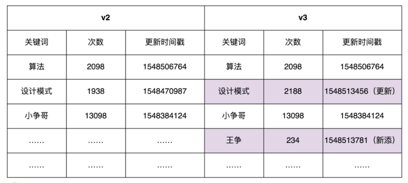
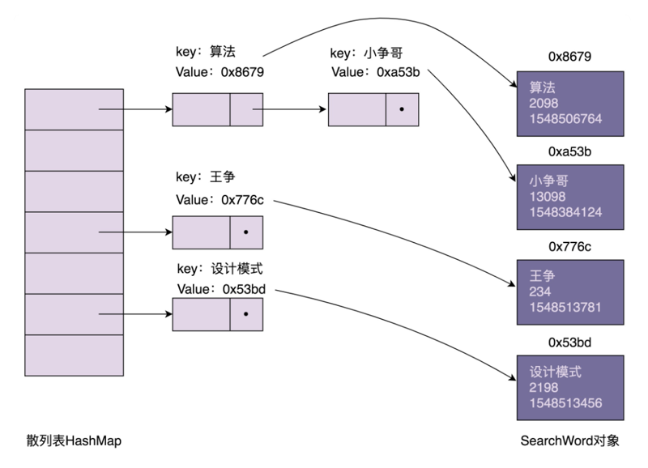
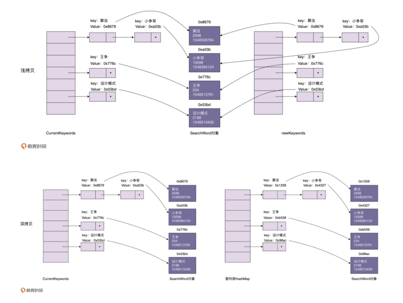

# 0407. 原型模式：如何最快速地 clone 一个 HashMap 散列表？

王争 2020-02-19

对于创建型模式，前面我们已经讲了单例模式、工厂模式、建造者模式，今天我们来讲最后一个：原型模式。对于熟悉 JavaScript 语言的前端程序员来说，原型模式是一种比较常用的开发模式。这是因为，有别于 Java、C++ 等基于类的面向对象编程语言，JavaScript 是一种基于原型的面向对象编程语言。即便 JavaScript 现在也引入了类的概念，但它也只是基于原型的语法糖而已。不过，如果你熟悉的是 Java、C++ 等这些编程语言，那在实际的开发中，就很少用到原型模式了。

今天的讲解跟具体某一语言的语法机制无关，而是通过一个 clone 散列表的例子带你搞清楚：原型模式的应用场景，以及它的两种实现方式：深拷贝和浅拷贝。虽然原型模式的原理和代码实现非常简单，但今天举的例子还是稍微有点复杂的，你要跟上我的思路，多动脑思考一下。

## 7.1 原型模式的原理与应用

如果对象的创建成本比较大，而同一个类的不同对象之间差别不大（大部分字段都相同），在这种情况下，我们可以利用对已有对象（原型）进行复制（或者叫拷贝）的方式来创建新对象，以达到节省创建时间的目的。这种基于原型来创建对象的方式就叫作原型设计模式（Prototype Design Pattern），简称原型模式。

那何为「对象的创建成本比较大」？实际上，创建对象包含的申请内存、给成员变量赋值这一过程，本身并不会花费太多时间，或者说对于大部分业务系统来说，这点时间完全是可以忽略的。应用一个复杂的模式，只得到一点点的性能提升，这就是所谓的过度设计，得不偿失。

但是，如果对象中的数据需要经过复杂的计算才能得到（比如排序、计算哈希值），或者需要从 RPC、网络、数据库、文件系统等非常慢速的 IO 中读取，这种情况下，我们就可以利用原型模式，从其他已有对象中直接拷贝得到，而不用每次在创建新对象的时候，都重复执行这些耗时的操作。

这么说还是比较理论，接下来，我们通过一个例子来解释一下刚刚这段话。

假设数据库中存储了大约 10 万条「搜索关键词」信息，每条信息包含关键词、关键词被搜索的次数、信息最近被更新的时间等。系统 A 在启动的时候会加载这份数据到内存中，用于处理某些其他的业务需求。为了方便快速地查找某个关键词对应的信息，我们给关键词建立一个散列表索引。

如果你熟悉的是 Java 语言，可以直接使用语言中提供的 HashMap 容器来实现。其中，HashMap 的 key 为搜索关键词，value 为关键词详细信息（比如搜索次数）。我们只需要将数据从数据库中读取出来，放入 HashMap 就可以了。

不过，我们还有另外一个系统 B，专门用来分析搜索日志，定期（比如间隔 10 分钟）批量地更新数据库中的数据，并且标记为新的数据版本。比如，在下面的示例图中，我们对 v2 版本的数据进行更新，得到 v3 版本的数据。这里我们假设只有更新和新添关键词，没有删除关键词的行为。



为了保证系统 A 中数据的实时性（不一定非常实时，但数据也不能太旧），系统 A 需要定期根据数据库中的数据，更新内存中的索引和数据。

我们该如何实现这个需求呢？

实际上，也不难。我们只需要在系统 A 中，记录当前数据的版本 Va 对应的更新时间 Ta，从数据库中捞出更新时间大于 Ta 的所有搜索关键词，也就是找出 Va 版本与最新版本数据的「差集」，然后针对差集中的每个关键词进行处理。如果它已经在散列表中存在了，我们就更新相应的搜索次数、更新时间等信息；如果它在散列表中不存在，我们就将它插入到散列表中。按照这个设计思路，我给出的示例代码如下所示：

```java
public class Demo {
  private ConcurrentHashMap<String, SearchWord> currentKeywords = new ConcurrentHashMap<>();
  private long lastUpdateTime = -1;

  public void refresh() {
    // 从数据库中取出更新时间>lastUpdateTime的数据，放入到currentKeywords中
    List<SearchWord> toBeUpdatedSearchWords = getSearchWords(lastUpdateTime);
    long maxNewUpdatedTime = lastUpdateTime;
    for (SearchWord searchWord : toBeUpdatedSearchWords) {
      if (searchWord.getLastUpdateTime() > maxNewUpdatedTime) {
        maxNewUpdatedTime = searchWord.getLastUpdateTime();
      }
      if (currentKeywords.containsKey(searchWord.getKeyword())) {
        currentKeywords.replace(searchWord.getKeyword(), searchWord);
      } else {
        currentKeywords.put(searchWord.getKeyword(), searchWord);
      }
    }

    lastUpdateTime = maxNewUpdatedTime;
  }

  private List<SearchWord> getSearchWords(long lastUpdateTime) {
    // TODO: 从数据库中取出更新时间>lastUpdateTime的数据
    return null;
  }
}
```

不过，现在，我们有一个特殊的要求：任何时刻，系统 A 中的所有数据都必须是同一个版本的，要么都是版本 a，要么都是版本 b，不能有的是版本 a，有的是版本 b。那刚刚的更新方式就不能满足这个要求了。除此之外，我们还要求：在更新内存数据的时候，系统 A 不能处于不可用状态，也就是不能停机更新数据。

那我们该如何实现现在这个需求呢？

实际上，也不难。我们把正在使用的数据的版本定义为「服务版本」，当我们要更新内存中的数据的时候，我们并不是直接在服务版本（假设是版本 a 数据）上更新，而是重新创建另一个版本数据（假设是版本 b 数据），等新的版本数据建好之后，再一次性地将服务版本从版本 a 切换到版本 b。这样既保证了数据一直可用，又避免了中间状态的存在。

按照这个设计思路，我给出的示例代码如下所示：

```java
public class Demo {
  private HashMap<String, SearchWord> currentKeywords=new HashMap<>();

  public void refresh() {
    HashMap<String, SearchWord> newKeywords = new LinkedHashMap<>();

    // 从数据库中取出所有的数据，放入到newKeywords中
    List<SearchWord> toBeUpdatedSearchWords = getSearchWords();
    for (SearchWord searchWord : toBeUpdatedSearchWords) {
      newKeywords.put(searchWord.getKeyword(), searchWord);
    }

    currentKeywords = newKeywords;
  }

  private List<SearchWord> getSearchWords() {
    // TODO: 从数据库中取出所有的数据
    return null;
  }
}
```

不过，在上面的代码实现中，newKeywords 构建的成本比较高。我们需要将这 10 万条数据从数据库中读出，然后计算哈希值，构建 newKeywords。这个过程显然是比较耗时。为了提高效率，原型模式就派上用场了。

我们拷贝 currentKeywords 数据到 newKeywords 中，然后从数据库中只捞出新增或者有更新的关键词，更新到 newKeywords 中。而相对于 10 万条数据来说，每次新增或者更新的关键词个数是比较少的，所以，这种策略大大提高了数据更新的效率。

按照这个设计思路，我给出的示例代码如下所示：

```java
public class Demo {
  private HashMap<String, SearchWord> currentKeywords=new HashMap<>();
  private long lastUpdateTime = -1;

  public void refresh() {
    // 原型模式就这么简单，拷贝已有对象的数据，更新少量差值
    HashMap<String, SearchWord> newKeywords = (HashMap<String, SearchWord>) currentKeywords.clone();

    // 从数据库中取出更新时间>lastUpdateTime的数据，放入到newKeywords中
    List<SearchWord> toBeUpdatedSearchWords = getSearchWords(lastUpdateTime);
    long maxNewUpdatedTime = lastUpdateTime;
    for (SearchWord searchWord : toBeUpdatedSearchWords) {
      if (searchWord.getLastUpdateTime() > maxNewUpdatedTime) {
        maxNewUpdatedTime = searchWord.getLastUpdateTime();
      }
      if (newKeywords.containsKey(searchWord.getKeyword())) {
        SearchWord oldSearchWord = newKeywords.get(searchWord.getKeyword());
        oldSearchWord.setCount(searchWord.getCount());
        oldSearchWord.setLastUpdateTime(searchWord.getLastUpdateTime());
      } else {
        newKeywords.put(searchWord.getKeyword(), searchWord);
      }
    }

    lastUpdateTime = maxNewUpdatedTime;
    currentKeywords = newKeywords;
  }

  private List<SearchWord> getSearchWords(long lastUpdateTime) {
    // TODO: 从数据库中取出更新时间>lastUpdateTime的数据
    return null;
  }
}
```

这里我们利用了 Java 中的 clone () 语法来复制一个对象。如果你熟悉的语言没有这个语法，那把数据从 currentKeywords 中一个个取出来，然后再重新计算哈希值，放入到 newKeywords 中也是可以接受的。毕竟，最耗时的还是从数据库中取数据的操作。相对于数据库的 IO 操作来说，内存操作和 CPU 计算的耗时都是可以忽略的。

不过，不知道你有没有发现，实际上，刚刚的代码实现是有问题的。要弄明白到底有什么问题，我们需要先了解另外两个概念：深拷贝（Deep Copy）和浅拷贝（Shallow Copy）。

## 7.2 原型模式的实现方式：深拷贝和浅拷贝

我们来看，在内存中，用散列表组织的搜索关键词信息是如何存储的。我画了一张示意图，大致结构如下所示。从图中我们可以发现，散列表索引中，每个结点存储的 key 是搜索关键词，value 是 SearchWord 对象的内存地址。SearchWord 对象本身存储在散列表之外的内存空间中。



浅拷贝和深拷贝的区别在于，浅拷贝只会复制图中的索引（散列表），不会复制数据（SearchWord 对象）本身。相反，深拷贝不仅仅会复制索引，还会复制数据本身。浅拷贝得到的对象（newKeywords）跟原始对象（currentKeywords）共享数据（SearchWord 对象），而深拷贝得到的是一份完完全全独立的对象。具体的对比如下图所示：



在 Java 语言中，Object 类的 clone () 方法执行的就是我们刚刚说的浅拷贝。它只会拷贝对象中的基本数据类型的数据（比如，int、long），以及引用对象（SearchWord）的内存地址，不会递归地拷贝引用对象本身。

在上面的代码中，我们通过调用 HashMap 上的 clone () 浅拷贝方法来实现原型模式。当我们通过 newKeywords 更新 SearchWord 对象的时候（比如，更新「设计模式」这个搜索关键词的访问次数），newKeywords 和 currentKeywords 因为指向相同的一组 SearchWord 对象，就会导致 currentKeywords 中指向的 SearchWord，有的是老版本的，有的是新版本的，就没法满足我们之前的需求：currentKeywords 中的数据在任何时刻都是同一个版本的，不存在介于老版本与新版本之间的中间状态。

现在，我们又该如何来解决这个问题呢？

我们可以将浅拷贝替换为深拷贝。newKeywords 不仅仅复制 currentKeywords 的索引，还把 SearchWord 对象也复制一份出来，这样 newKeywords 和 currentKeywords 就指向不同的 SearchWord 对象，也就不存在更新 newKeywords 的数据会导致 currentKeywords 的数据也被更新的问题了。那如何实现深拷贝呢？总结一下的话，有下面两种方法。

第一种方法：递归拷贝对象、对象的引用对象以及引用对象的引用对象…… 直到要拷贝的对象只包含基本数据类型数据，没有引用对象为止。根据这个思路对之前的代码进行重构。重构之后的代码如下所示：

```java
public class Demo {
  private HashMap<String, SearchWord> currentKeywords=new HashMap<>();
  private long lastUpdateTime = -1;

  public void refresh() {
    // Deep copy
    HashMap<String, SearchWord> newKeywords = new HashMap<>();
    for (HashMap.Entry<String, SearchWord> e : currentKeywords.entrySet()) {
      SearchWord searchWord = e.getValue();
      SearchWord newSearchWord = new SearchWord(
              searchWord.getKeyword(), searchWord.getCount(), searchWord.getLastUpdateTime());
      newKeywords.put(e.getKey(), newSearchWord);
    }

    // 从数据库中取出更新时间>lastUpdateTime的数据，放入到newKeywords中
    List<SearchWord> toBeUpdatedSearchWords = getSearchWords(lastUpdateTime);
    long maxNewUpdatedTime = lastUpdateTime;
    for (SearchWord searchWord : toBeUpdatedSearchWords) {
      if (searchWord.getLastUpdateTime() > maxNewUpdatedTime) {
        maxNewUpdatedTime = searchWord.getLastUpdateTime();
      }
      if (newKeywords.containsKey(searchWord.getKeyword())) {
        SearchWord oldSearchWord = newKeywords.get(searchWord.getKeyword());
        oldSearchWord.setCount(searchWord.getCount());
        oldSearchWord.setLastUpdateTime(searchWord.getLastUpdateTime());
      } else {
        newKeywords.put(searchWord.getKeyword(), searchWord);
      }
    }

    lastUpdateTime = maxNewUpdatedTime;
    currentKeywords = newKeywords;
  }

  private List<SearchWord> getSearchWords(long lastUpdateTime) {
    // TODO: 从数据库中取出更新时间>lastUpdateTime的数据
    return null;
  }

}
```

第二种方法：先将对象序列化，然后再反序列化成新的对象。具体的示例代码如下所示：

```java
public Object deepCopy(Object object) {
  ByteArrayOutputStream bo = new ByteArrayOutputStream();
  ObjectOutputStream oo = new ObjectOutputStream(bo);
  oo.writeObject(object);
  
  ByteArrayInputStream bi = new ByteArrayInputStream(bo.toByteArray());
  ObjectInputStream oi = new ObjectInputStream(bi);
  
  return oi.readObject();
}
```

刚刚的两种实现方法，不管采用哪种，深拷贝都要比浅拷贝耗时、耗内存空间。针对我们这个应用场景，有没有更快、更省内存的实现方式呢？

我们可以先采用浅拷贝的方式创建 newKeywords。对于需要更新的 SearchWord 对象，我们再使用深度拷贝的方式创建一份新的对象，替换 newKeywords 中的老对象。毕竟需要更新的数据是很少的。这种方式即利用了浅拷贝节省时间、空间的优点，又能保证 currentKeywords 中的中数据都是老版本的数据。具体的代码实现如下所示。这也是标题中讲到的，在我们这个应用场景下，最快速 clone 散列表的方式。

```java
public class Demo {
  private HashMap<String, SearchWord> currentKeywords=new HashMap<>();
  private long lastUpdateTime = -1;

  public void refresh() {
    // Shallow copy
    HashMap<String, SearchWord> newKeywords = (HashMap<String, SearchWord>) currentKeywords.clone();

    // 从数据库中取出更新时间>lastUpdateTime的数据，放入到newKeywords中
    List<SearchWord> toBeUpdatedSearchWords = getSearchWords(lastUpdateTime);
    long maxNewUpdatedTime = lastUpdateTime;
    for (SearchWord searchWord : toBeUpdatedSearchWords) {
      if (searchWord.getLastUpdateTime() > maxNewUpdatedTime) {
        maxNewUpdatedTime = searchWord.getLastUpdateTime();
      }
      if (newKeywords.containsKey(searchWord.getKeyword())) {
        newKeywords.remove(searchWord.getKeyword());
      }
      newKeywords.put(searchWord.getKeyword(), searchWord);
    }

    lastUpdateTime = maxNewUpdatedTime;
    currentKeywords = newKeywords;
  }

  private List<SearchWord> getSearchWords(long lastUpdateTime) {
    // TODO: 从数据库中取出更新时间>lastUpdateTime的数据
    return null;
  }
}
```

## 重点回顾

总结：

1、什么是原型模式？如果对象的创建成本比较大，而同一个类的不同对象之间差别不大（大部分字段都相同），在这种情况下，我们可以利用对已有对象（原型）进行复制（或者叫拷贝）的方式，来创建新对象，以达到节省创建时间的目的。这种基于原型来创建对象的方式就叫作原型设计模式，简称原型模式。

2、原型模式的两种实现方法。1）原型模式有两种实现方法，深拷贝和浅拷贝。浅拷贝只会复制对象中基本数据类型数据和引用对象的内存地址，不会递归地复制引用对象，以及引用对象的引用对象…… 而深拷贝得到的是一份完完全全独立的对象。所以，深拷贝比起浅拷贝来说，更加耗时，更加耗内存空间。2）如果要拷贝的对象是不可变对象，浅拷贝共享不可变对象是没问题的，但对于可变对象来说，浅拷贝得到的对象和原始对象会共享部分数据，就有可能出现数据被修改的风险，也就变得复杂多了。除非像我们今天实战中举的那个例子，需要从数据库中加载 10 万条数据并构建散列表索引，操作非常耗时，比较推荐使用浅拷贝，否则，没有充分的理由，不要为了一点点的性能提升而使用浅拷贝。

## 黑板墙

在今天的应用场景中，如果不仅往数据库中添加和更新关键词，还删除关键词，这种情况下，又该如何实现呢？在第 7 讲中，为了让 ShoppingCart 的 getItems () 方法返回不可变对象，我们如下来实现代码。当时，我们指出这样的实现思路还是有点问题。因为当调用者通过 ShoppingCart 的 getItems () 获取到 items 之后，我们还是可以修改容器中每个对象（ShoppingCartItem）的数据。学完本节课之后，现在你有没有解决方法了呢？

```java
public class ShoppingCart {
  // ...省略其他代码...
  public List<ShoppingCartItem> getItems() {
    return Collections.unmodifiableList(this.items);
  }
}

// Testing Code in main method:
ShoppingCart cart = new ShoppingCart();
List<ShoppingCartItem> items = cart.getItems();
items.clear();//try to modify the list
// Exception in thread "main" java.lang.UnsupportedOperationExceptio 

ShoppingCart cart = new ShoppingCart();
cart.add(new ShoppingCartItem(...));
List<ShoppingCartItem> items = cart.getItems();
ShoppingCartItem item = items.get(0);
item.setPrice(19.0); // 这里修改了item的价格属性
```

### 01

关键字如果支持删除，最简单高效的方法就是在数据表里加一个 delete bool 类型的字段，占用空间不多，但是很方便程序识别最近更新的数据里面，有哪条是需要删除的。不过这样会带来一个问题，就是插入新关键字的时候，要先检查一下是否存在同名的关键字，有的话要把 delete 字段修改为 false, 所以还需要对关键字建立索引，这样可以高效查找出是否存在同名关键字。2020-02-21

### 02

方法一：新旧的数据取交集，可以删除旧 map 中的删除关键字，之后的逻辑就和文章中一样了。方法二：逻辑删除，当 map 的 size 中已删除占比过高时，resize map。争哥说：这里我们利用了 Java 中的 clone() 语法来复制一个对象。如果你熟悉的语言没有这个语法，那把数据从 currentKeywords 中一个个取出来，然后再重新计算哈希值，放入到 newKeywords 中也是可以接受的。Java HashMap 的 clone 方法就把数据取出来，计算 hash 值，在放回去的。clone 方法中，调用了 putMapEntries 方法，其中有一关键的一行，克隆重新计算了 hash 值：

```java
putVal(hash(key), key, value, false, evict);

文章中的深复制：为什么SearchWord不重写clone方法呢？
@Override
protected Object clone() throws CloneNotSupportedException {
  SearchWord newWord = new SearchWord(this.keyWord, this.times, this.tmstamp);
  return newWord;
}
```

2020-02-19

### 03

看了几遍才明白第一次的浅拷贝问题在哪，在遍历的时候就已经替换了其中一些旧对象；而最后浅拷贝和深拷贝结合的方式，是先把浅拷贝得到的索引（引用）删除，然后再添加新的对象到浅拷贝中，最后在遍历结束后一并替换原型。2020-04-06

### 04

我在实际工作中就用到了类似的代码，这就是一个关键词识别模块，第一次在学习专栏中看到如此契合生产的代码，很赞。问题1：数据库中新增一个字段标识逻辑删除。问题2：深拷贝出去，不过为啥我外部需要一个深拷贝的对象呢，还没理解。2020-02-22

### 05

汇总：1）考虑到删除关键词，那么最好数据库使用软删除，这样可以知道哪些关键词是被删除的，那么拿到这些被删除的关键词就可以在 clone 出来的 newKeywords 基础上，直接 remove 掉已经删除的哪些关键词就可以了。反之如果不是使用的软删除，那么就不好使用原型模式，需要获取新版本全量数据，然后和旧版本数据一一比对，看哪些数据是被删除的了。2）代码如下，将原来的 items deep clone 一份，这样就切断了与原来 items 的联系。

```java
public class ShoppingCart {
// ...省略其他代码...
public List<ShoppingCartItem> getItems() {
  List<ShoppingCartItem> tmpShoppingCartItems = new ArrayList<>();
  tmpShoppingCartItems.addAll(this.items);
  return Collections.unmodifiableList(tmpShoppingCartItems);
}
}
```
2020-02-19

### 06

再一次感受到计算机原理都是想通的：1）老师举的例子中，使用的原型模式思想，和 Linux 的 CopyonWrite 一模一样。联想到 Redis 的 RDS 备份时，就是采用的这种思路。2）在 Python 里面有一个 copy 模块，copy 模块有 copy 函数，也有 deepcopy 函数，其中 copy 用来浅拷贝，deepcopy 是用来实现深拷贝。2020-06-16

### 07

深拷贝的总结：1）递归拷贝数据。2）使用序列化 + 反序列化。3）优化： 可以先采用浅拷贝的方式创建 newKeywords。对于需要更新的 SearchWord 对象，我们再使用深度拷贝的方式创建一份新的对象，替换 newKeywords 中的老对象。毕竟需要更新的数据是很少的。这种方式即利用了浅拷贝节省时间、空间的优点，又能保证 currentKeywords 中的中数据都是老版本的数据。2020-05-29

### 08

想起了以前的一个项目，由于原始大对象需要缓存下来，因此使用深拷贝进行对象复制，通过 Gson 序列化再反序列化，因此非常消耗 CPU，线上专门堆了好几台服务器，今天学了才发现可以使用原型模式直接复制对象内存，不禁流下了悔恨的泪水....2020-04-29

### 09

第一个问题应该要看是否允许加字段标记删除。允许的话和更改的逻辑相似。如果不允许，那整行数据都删除掉了，只能全扫描数据库中的主键，然后和 map 中的数据比较。第二个问题大家都说是返回深拷贝，这个是可以。不过我好奇工作中真的这么写代码吗？因为很返回一个 list 之类的时候还是很多的。感觉都是靠编程习惯，就是不去更改输入，要更改也是自己 copy 一份新的对象。这个自己也不是很熟，确实是需要向有经验的学习一下。希望大家多说说实际经验。2020-03-14

### 10

汇总：1）对于删除来说，我们需要保证版本一直，还要保证一定效率的时候，如果按照之前的实现，我们就必须进行反查找，也就是获取到所有数据库中的数据，然后利用我们现有的 Map 去比对数据库中，查看哪些已经不再存在了，这样效率极其的低下，所以建议是在数据库中加入一个 del_flag 的字段，来表示逻辑删除，并利用逻辑删除来进行相关的更新操作。2）对于 2，能不能返回一个流对象，让调用者去反序列化，或者进行第一种方式的递归拷贝，获取新的对象。2020-03-10