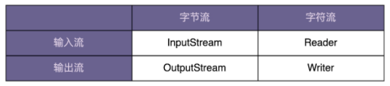

# 0503. 装饰器模式：通过剖析 Java IO 类库源码学习装饰器模式

王争 2020-02-26

上一节课我们学习了桥接模式，桥接模式有两种理解方式。第一种理解方式是「将抽象和实现解耦，让它们能独立开发」。这种理解方式比较特别，应用场景也不多。另一种理解方式更加简单，类似「组合优于继承」设计原则，这种理解方式更加通用，应用场景比较多。不管是哪种理解方式，它们的代码结构都是相同的，都是一种类之间的组合关系。今天，我们通过剖析 Java IO 类的设计思想，再学习一种新的结构型模式，装饰器模式。它的代码结构跟桥接模式非常相似，不过，要解决的问题却大不相同。

## 3.1 Java IO 类的「奇怪」用法

Java IO 类库非常庞大和复杂，有几十个类，负责 IO 数据的读取和写入。如果对 Java IO 类做一下分类，我们可以从下面两个维度将它划分为四类。具体如下所示：



针对不同的读取和写入场景，Java IO 又在这四个父类基础之上，扩展出了很多子类。具体如下所示：

在我初学 Java 的时候，曾经对 Java IO 的一些用法产生过很大疑惑，比如下面这样一段代码。我们打开文件 test.txt，从中读取数据。其中，InputStream 是一个抽象类，FileInputStream 是专门用来读取文件流的子类。BufferedInputStream 是一个支持带缓存功能的数据读取类，可以提高数据读取的效率。

```java
InputStream in = new FileInputStream("/user/wangzheng/test.txt");
InputStream bin = new BufferedInputStream(in);
byte[] data = new byte[128];
while (bin.read(data) != -1) {
  //...
}
```

初看上面的代码，我们会觉得 Java IO 的用法比较麻烦，需要先创建一个 FileInputStream 对象，然后再传递给 BufferedInputStream 对象来使用。我在想，Java IO 为什么不设计一个继承 FileInputStream 并且支持缓存的 BufferedFileInputStream 类呢？这样我们就可以像下面的代码中这样，直接创建一个 BufferedFileInputStream 类对象，打开文件读取数据，用起来岂不是更加简单？

```java
InputStream bin = new BufferedFileInputStream("/user/wangzheng/test.txt");
byte[] data = new byte[128];
while (bin.read(data) != -1) {
  //...
}
```

## 3.2 基于继承的设计方案

如果 InputStream 只有一个子类 FileInputStream 的话，那我们在 FileInputStream 基础之上，再设计一个孙子类 BufferedFileInputStream，也算是可以接受的，毕竟继承结构还算简单。但实际上，继承 InputStream 的子类有很多。我们需要给每一个 InputStream 的子类，再继续派生支持缓存读取的子类。

除了支持缓存读取之外，如果我们还需要对功能进行其他方面的增强，比如下面的 DataInputStream 类，支持按照基本数据类型（int、boolean、long 等）来读取数据。

```java
FileInputStream in = new FileInputStream("/user/wangzheng/test.txt");
DataInputStream din = new DataInputStream(in);
int data = din.readInt();
```

在这种情况下，如果我们继续按照继承的方式来实现的话，就需要再继续派生出 DataFileInputStream、DataPipedInputStream 等类。如果我们还需要既支持缓存、又支持按照基本类型读取数据的类，那就要再继续派生出 BufferedDataFileInputStream、BufferedDataPipedInputStream 等 n 多类。这还只是附加了两个增强功能，如果我们需要附加更多的增强功能，那就会导致组合爆炸，类继承结构变得无比复杂，代码既不好扩展，也不好维护。这也是我们在第 10 节中讲的不推荐使用继承的原因。

## 3.3 基于装饰器模式的设计方案

在第 10 节中，我们还讲到「组合优于继承」，可以「使用组合来替代继承」。针对刚刚的继承结构过于复杂的问题，我们可以通过将继承关系改为组合关系来解决。下面的代码展示了 Java IO 的这种设计思路。不过，我对代码做了简化，只抽象出了必要的代码结构，如果你感兴趣的话，可以直接去查看 JDK 源码。

```java
public abstract class InputStream {
  //...
  public int read(byte b[]) throws IOException {
    return read(b, 0, b.length);
  }
  
  public int read(byte b[], int off, int len) throws IOException {
    //...
  }
  
  public long skip(long n) throws IOException {
    //...
  }

  public int available() throws IOException {
    return 0;
  }
  
  public void close() throws IOException {}

  public synchronized void mark(int readlimit) {}
    
  public synchronized void reset() throws IOException {
    throw new IOException("mark/reset not supported");
  }

  public boolean markSupported() {
    return false;
  }
}

public class BufferedInputStream extends InputStream {
  protected volatile InputStream in;

  protected BufferedInputStream(InputStream in) {
    this.in = in;
  }
  
  //...实现基于缓存的读数据接口...  
}

public class DataInputStream extends InputStream {
  protected volatile InputStream in;

  protected DataInputStream(InputStream in) {
    this.in = in;
  }
  
  //...实现读取基本类型数据的接口
}
```

看了上面的代码，你可能会问，那装饰器模式就是简单的「用组合替代继承」吗？当然不是。从 Java IO 的设计来看，装饰器模式相对于简单的组合关系，还有两个比较特殊的地方。

第一个比较特殊的地方是：装饰器类和原始类继承同样的父类，这样我们可以对原始类「嵌套」多个装饰器类。比如，下面这样一段代码，我们对 FileInputStream 嵌套了两个装饰器类：BufferedInputStream 和 DataInputStream，让它既支持缓存读取，又支持按照基本数据类型来读取数据。

```java
InputStream in = new FileInputStream("/user/wangzheng/test.txt");
InputStream bin = new BufferedInputStream(in);
DataInputStream din = new DataInputStream(bin);
int data = din.readInt();
```

第二个比较特殊的地方是：装饰器类是对功能的增强，这也是装饰器模式应用场景的一个重要特点。实际上，符合「组合关系」这种代码结构的设计模式有很多，比如之前讲过的代理模式、桥接模式，还有现在的装饰器模式。尽管它们的代码结构很相似，但是每种设计模式的意图是不同的。就拿比较相似的代理模式和装饰器模式来说吧，代理模式中，代理类附加的是跟原始类无关的功能，而在装饰器模式中，装饰器类附加的是跟原始类相关的增强功能。

1『原来代理模式、桥接模式、装饰器模式，都是对「组合优于继承」的应用。』

```java
// 代理模式的代码结构(下面的接口也可以替换成抽象类)
public interface IA {
  void f();
}
public class A impelements IA {
  public void f() { //... }
}
public class AProxy impements IA {
  private IA a;
  public AProxy(IA a) {
    this.a = a;
  }
  
  public void f() {
    // 新添加的代理逻辑
    a.f();
    // 新添加的代理逻辑
  }
}

// 装饰器模式的代码结构(下面的接口也可以替换成抽象类)
public interface IA {
  void f();
}
public class A impelements IA {
  public void f() { //... }
}
public class ADecorator impements IA {
  private IA a;
  public ADecorator(IA a) {
    this.a = a;
  }
  
  public void f() {
    // 功能增强代码
    a.f();
    // 功能增强代码
  }
}
```

实际上，如果去查看 JDK 的源码，你会发现，BufferedInputStream、DataInputStream 并非继承自 InputStream，而是另外一个叫 FilterInputStream 的类。那这又是出于什么样的设计意图，才引入这样一个类呢？

我们再重新来看一下 BufferedInputStream 类的代码。InputStream 是一个抽象类而非接口，而且它的大部分函数，比如 read()、available() 都有默认实现，按理来说，我们只需要在 BufferedInputStream 类中重新实现那些需要增加缓存功能的函数就可以了，其他函数继承 InputStream 的默认实现。但实际上，这样做是行不通的。

对于即便是不需要增加缓存功能的函数来说，BufferedInputStream 还是必须把它重新实现一遍，简单包裹对 InputStream 对象的函数调用。具体的代码示例如下所示。如果不重新实现，那 BufferedInputStream 类就无法将最终读取数据的任务，委托给传递进来的 InputStream 对象来完成。这一部分稍微有点不好理解，你自己多思考一下。

```java
public class BufferedInputStream extends InputStream {
  protected volatile InputStream in;

  protected BufferedInputStream(InputStream in) {
    this.in = in;
  }
  
  // f()函数不需要增强，只是重新调用一下InputStream in对象的f()
  public void f() {
    in.f();
  }  
}
```

实际上，DataInputStream 也存在跟 BufferedInputStream 同样的问题。为了避免代码重复，Java IO 抽象出了一个装饰器父类 FilterInputStream，代码实现如下所示。InputStream 的所有的装饰器类（BufferedInputStream、DataInputStream）都继承自这个装饰器父类。这样，装饰器类只需要实现它需要增强的方法就可以了，其他方法继承装饰器父类的默认实现。

```java
public class FilterInputStream extends InputStream {
  protected volatile InputStream in;

  protected FilterInputStream(InputStream in) {
    this.in = in;
  }

  public int read() throws IOException {
    return in.read();
  }

  public int read(byte b[]) throws IOException {
    return read(b, 0, b.length);
  }
   
  public int read(byte b[], int off, int len) throws IOException {
    return in.read(b, off, len);
  }

  public long skip(long n) throws IOException {
    return in.skip(n);
  }

  public int available() throws IOException {
    return in.available();
  }

  public void close() throws IOException {
    in.close();
  }

  public synchronized void mark(int readlimit) {
    in.mark(readlimit);
  }

  public synchronized void reset() throws IOException {
    in.reset();
  }

  public boolean markSupported() {
    return in.markSupported();
  }
}
```

## 重点回顾

装饰器模式主要解决继承关系过于复杂的问题，通过组合来替代继承。它主要的作用是给原始类添加增强功能。这也是判断是否该用装饰器模式的一个重要的依据。除此之外，装饰器模式还有一个特点，那就是可以对原始类嵌套使用多个装饰器。为了满足这个应用场景，在设计的时候，装饰器类需要跟原始类继承相同的抽象类或者接口。

## 黑板墙

在上节课中，我们讲到，可以通过代理模式给接口添加缓存功能。在这节课中，我们又通过装饰者模式给 InputStream 添加缓存读取数据功能。那对于「添加缓存」这个应用场景来说，我们到底是该用代理模式还是装饰器模式呢？你怎么看待这个问题？

### 01

你是一个优秀的歌手，只会唱歌这一件事，不擅长找演唱机会，谈价钱，搭台，这些事情你可以找一个经纪人帮你搞定，经纪人帮你做好这些事情你就可以安稳的唱歌了，让经纪人做你不关心的事情这叫代理模式。你老爱记错歌词，歌迷和媒体经常吐槽你没有认真对待演唱会，于是你想了一个办法，买个高端耳机，边唱边提醒你歌词，让你摆脱了忘歌词的诟病，高端耳机让你唱歌能力增强，提高了基础能力这叫装饰者模式。2020-02-26

### 02

对于添加缓存这个应用场景使用哪种模式，要看设计者的意图，如果设计者不需要用户关注是否使用缓存功能，要隐藏实现细节，也就是说用户只能看到和使用代理类，那么就使用 proxy 模式；反之，如果设计者需要用户自己决定是否使用缓存的功能，需要用户自己新建原始对象并动态添加缓存功能，那么就使用 decorator 模式。2020-02-26

### 03

汇总：1）有意思，关于代理模式和装饰者模式，各自应用场景和区别刚好也想过。2）代理模式和装饰者模式都是代码增强这一件事的落地方案。前者个人认为偏重业务无关，高度抽象，和稳定性较高的场景（性能其实可以抛开不谈）。后者偏重业务相关，定制化诉求高，改动较频繁的场景。3）缓存这件事一般都是高度抽象，全业务通用，基本不会改动的东西，所以一般也是采用代理模式，让业务开发从缓存代码的重复劳动中解放出来。但如果当前业务的缓存实现需要特殊化定制，需要揉入业务属性，那么就该采用装饰者模式。因为其定制性强，其他业务也用不着，而且业务是频繁变动的，所以改动的可能也大，相对于动代，装饰者在调整（修改和重组）代码这件事上显得更灵活。2020-02-26

### 04

补充关于 Proxy Pattern 和 Decorator Pattern 的一点区别：1）Decorator 关注为对象动态的添加功能，Proxy 关注对象的信息隐藏及访问控制。2）Decorator 体现多态性，Proxy 体现封装性。参考：[oop - Differences between Proxy and Decorator Pattern - Stack Overflow](https://stackoverflow.com/questions/18618779/differences-between-proxy-and-decorator-pattern)。2020-02-26

### 05

对于为什么中间要多继承一个 FilterInputStream 类，我的理解是这样的：假如说 BufferedInputStream 类直接继承自 InputStream 类且没有进行重写，只进行了装饰。创建一个 InputStream is = new BufferedInputStream (new FileInputStream (FilePath)); 此时调用 is 的没有重写方法（如 read 方法）时调用的是 InputStream 类中的 read 方法，而不是 FileInputStream 中的 read 方法，这样的结果不是我们想要的。所以要将方法再包装一次，从而有 FilterInputStream 类，也是避免代码的重复，多个装饰器只用写一遍包装代码即可。2020-02-26

### 06

作业：正如文中所说，装饰器是对原有功能的扩展，代理是增加并不相关的功能。所以问题就变成使用者认为「缓存」是否扩展了原功能。1）比如说需要把想把所有的网络信息都加上缓存，提高一些查询效率，这时候应该使用代理模式；2）如果我在设计网络通信框架，需要把提供「缓存」作为一种扩展能力，这时应该用装饰器模式。现实中，大部分的网络缓存都以代理模式被实现。另外，缓存（Cache）与缓冲（Buffer）是不同的概念，这里也可以区分一下。感受：到了具体模式的课程，有一个明显的特点：一句话感觉看懂了，反复读才能发现有更多的信息在里面，坦白讲，很多模式编程中没有用过，与单纯地读原理和特征相比，我想真正用的时候才能理解更深入的东西。2020-03-07

### 07

我觉得应该用代理模式，当然这个是要看场景的。代理模式是在原有功能之外增加了其他的能力，而装饰器模式则在原功能的基础上增加额外的能力。一个是增加，一个是增强，就好比一个是在手机上增加了一个摄像头用于拍照，而另一个则是在拍照这个功能的基础上把像素从 800W 提升到 1600W。我觉得通过这样的方式区分的话，大家互相沟通起来理解会统一一些。2020-02-27

### 08

通过将原始类以组合的方式注入到装饰器类中，以增强原始类的功能，而不是使用继承，避免维护复杂的继承关系。另外，装饰器类通常和原始类实现相同的接口，如果方法不需要增强，重新调用原始类的方法即可。2020-02-26

### 09

关于 BufferedInputStream 为什么不能直接继承 InputStream 这个问题，我的理解是因为 InputStream 是抽象方法，继承他就得默认重写内部的抽象逻辑，而装饰器模式需要解决的最主要的问题是用任意组合的方式拼接业务的各个功能特性，这也就表示本身业务特性很多，业务特性之间的关联还比较弱（否则将关联度比较大的几个特性单独实现然后组合在 InputStream 中，然后直接替代 FilterInputStream 的角色即可），那么每个特性增强的子类都需要重写调用 super.method，重复代码就会很多，所以这里就加了一个 FilterInputStream 装饰器父类，把需要重写调用的 super.method 方法在里面实现，具体的业务增强子类只需要继承 FilterInputStream 类，并编写自己的业务增强子类即可。同时，也没有打破所有实现类都是 InputStream 这个基础，也即依然可以实现多个组合嵌套，以最少的代码实现了最多特性的组合增强。最后，说一下思考题，代理模式和装饰器模式两者在目的上没啥区别，都是对已有业务的一种增强，但前者是业务无关的独立的，而且增强的特性不多；后者是业务相关，增强特性支持更多；实现上，前者既可以基于继承，也可以基于接口，还能实现动态代理；后者只能基于抽象类的继承，且不太适合实现动态，因为没法动态增强业务相关的功能特性。2020-08-03

### 10

能不能把 BufferedInputStream 这些可以叠加的功能做成 interface，然后定义一些内部的类。作者回复：你的意思是，定义很多不同的 interface 对吧。这样也可以，但用起来就没有现在的好用了。2020-07-11

### 11

缓存用代理还是装饰？二者都是对方法进行扩展，所以本质要考虑怎么对方法进行扩展，如果对方法的扩展，只是在该方法前后增加逻辑，这部分增加的逻辑对方法本身没有丝毫影响，加不加这部分逻辑，该方法执行结果一样，那就用代理；相反，如果增加的逻辑，会影响这个方法的执行结果，就用装饰；缓存这个东西，对原方法的执行是没影响的，你加不加缓存，也就是走不走缓存，原先的方法该怎么执行还是怎么执行，所以个人认为用代理较好；其实仔细想下，不管代理还是装饰，在这个增加缓存功能上，代码基本是一样的，只是名字不一样，名字不一样，就是让你知道扩展的意图。你可以叫他代理，也可以叫装饰。2020-07-02

### 12

如何理解 FilterInputStream，为什么继承这个类？个人感觉老师应该用接口和实现的方式来讲好理解；如果对类中的某个方式进行扩展，用装饰模式，可以用装饰类实现这个被扩展类实现的接口，进行功能扩展，但是需求是只需要扩展一个方法，但是实现接口需要的是把接口中的所有接口都实现，否则语法 都通不过，现实中，有的接口中方法上百个，这样扩展必定带来很多麻烦。所以 java 中，还有很多模板类，以 Template 结尾命名的类，之前见过，但是忘记是啥类了，这里的模板类就是实现了接口的类，这里模板类似 FilterInputStream ，如果扩展功能，只在这个模板类上扩展；避免实现其他不需要扩展的方法；2020-07-02

### 13

终于明白代理模式和装饰模式的区别了：1）装饰器类和原始类继承同样的父类，这样我们可以对原始类「嵌套」多个装饰器类。2）装饰器类是对功能的增强，这也是装饰器模式应用场景的一个重要特点。3）装饰器与代理模式的区别：代理模式中，代理类附加的是跟原始类 ** 无关 ** 的功能，而在装饰器模式中，装饰器类附加的是跟原始类「相关」的增强功能。4）装饰器主要的作用是给原始类添加增强功能。5）装饰器可以对原始类嵌套使用多个装饰器。为了满足这个应用场景，在设计的时候，装饰器类需要跟原始类继承相同的抽象类或者接口。2020-06-30

### 14

在 Python 里面，一般用装饰器来实现缓存和打印日志的功能。不管是代理模式还是装饰器模式，最终的目的就是将业务和不相关的逻辑解耦，让代码更加清晰、可读。2020-06-16

### 15

原始类：InputStream；共同父类：FileInputStream；装饰器类：BufferedInputStream、DataInputStream。是这关系吗？作者回复：是的。2020-05-28