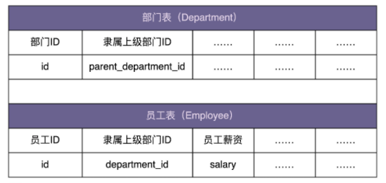

# 0506. 组合模式：如何设计实现支持递归遍历的文件系统目录树结构？

王争 2020-03-04

结构型设计模式就快要讲完了，还剩下两个不那么常用的：组合模式和享元模式。今天，我们来讲一下组合模式（Composite Design Pattern）。组合模式跟我们之前讲的面向对象设计中的「组合关系」（通过组合来组装两个类），完全是两码事。这里讲的「组合模式」，主要是用来处理树形结构数据。这里的「数据」，你可以简单理解为一组对象集合，待会我们会详细讲解。

正因为其应用场景的特殊性，数据必须能表示成树形结构，这也导致了这种模式在实际的项目开发中并不那么常用。但是，一旦数据满足树形结构，应用这种模式就能发挥很大的作用，能让代码变得非常简洁。

## 6.1 组合模式的原理与实现

在 GoF 的《设计模式》一书中，组合模式是这样定义的：

Compose objects into tree structure to represent part-whole hierarchies. Composite lets client treat individual objects and compositions of objects uniformly.

翻译成中文就是：将一组对象组织（Compose）成树形结构，以表示一种「部分 - 整体」的层次结构。组合让客户端（在很多设计模式书籍中，「客户端」代指代码的使用者。）可以统一单个对象和组合对象的处理逻辑。接下来，对于组合模式，我举个例子来给你解释一下。

假设我们有这样一个需求：设计一个类来表示文件系统中的目录，能方便地实现下面这些功能：1）动态地添加、删除某个目录下的子目录或文件；2）统计指定目录下的文件个数；3）统计指定目录下的文件总大小。

我这里给出了这个类的骨架代码，如下所示。其中的核心逻辑并未实现，你可以试着自己去补充完整，再来看我的讲解。在下面的代码实现中，我们把文件和目录统一用 FileSystemNode 类来表示，并且通过 isFile 属性来区分。

```java
public class FileSystemNode {
  private String path;
  private boolean isFile;
  private List<FileSystemNode> subNodes = new ArrayList<>();

  public FileSystemNode(String path, boolean isFile) {
    this.path = path;
    this.isFile = isFile;
  }

  public int countNumOfFiles() {
    // TODO:...
  }

  public long countSizeOfFiles() {
    // TODO:...
  }

  public String getPath() {
    return path;
  }

  public void addSubNode(FileSystemNode fileOrDir) {
    subNodes.add(fileOrDir);
  }

  public void removeSubNode(FileSystemNode fileOrDir) {
    int size = subNodes.size();
    int i = 0;
    for (; i < size; ++i) {
      if (subNodes.get(i).getPath().equalsIgnoreCase(fileOrDir.getPath())) {
        break;
      }
    }
    if (i < size) {
      subNodes.remove(i);
    }
  }
}
```

实际上，如果你看过我的《数据结构与算法之美》专栏，想要补全其中的 countNumOfFiles() 和 countSizeOfFiles() 这两个函数，并不是件难事，实际上这就是树上的递归遍历算法。对于文件，我们直接返回文件的个数（返回 1）或大小。对于目录，我们遍历目录中每个子目录或者文件，递归计算它们的个数或大小，然后求和，就是这个目录下的文件个数和文件大小。我把两个函数的代码实现贴在下面了，你可以对照着看一下。

```java
  public int countNumOfFiles() {
    if (isFile) {
      return 1;
    }
    int numOfFiles = 0;
    for (FileSystemNode fileOrDir : subNodes) {
      numOfFiles += fileOrDir.countNumOfFiles();
    }
    return numOfFiles;
  }

  public long countSizeOfFiles() {
    if (isFile) {
      File file = new File(path);
      if (!file.exists()) return 0;
      return file.length();
    }
    long sizeofFiles = 0;
    for (FileSystemNode fileOrDir : subNodes) {
      sizeofFiles += fileOrDir.countSizeOfFiles();
    }
    return sizeofFiles;
  }
```

单纯从功能实现角度来说，上面的代码没有问题，已经实现了我们想要的功能。但是，如果我们开发的是一个大型系统，从扩展性（文件或目录可能会对应不同的操作）、业务建模（文件和目录从业务上是两个概念）、代码的可读性（文件和目录区分对待更加符合人们对业务的认知）的角度来说，我们最好对文件和目录进行区分设计，定义为 File 和 Directory 两个类。按照这个设计思路，我们对代码进行重构。重构之后的代码如下所示：

```java
public abstract class FileSystemNode {
  protected String path;

  public FileSystemNode(String path) {
    this.path = path;
  }

  public abstract int countNumOfFiles();
  public abstract long countSizeOfFiles();

  public String getPath() {
    return path;
  }
}

public class File extends FileSystemNode {
  public File(String path) {
    super(path);
  }

  @Override
  public int countNumOfFiles() {
    return 1;
  }

  @Override
  public long countSizeOfFiles() {
    java.io.File file = new java.io.File(path);
    if (!file.exists()) return 0;
    return file.length();
  }
}

public class Directory extends FileSystemNode {
  private List<FileSystemNode> subNodes = new ArrayList<>();

  public Directory(String path) {
    super(path);
  }

  @Override
  public int countNumOfFiles() {
    int numOfFiles = 0;
    for (FileSystemNode fileOrDir : subNodes) {
      numOfFiles += fileOrDir.countNumOfFiles();
    }
    return numOfFiles;
  }

  @Override
  public long countSizeOfFiles() {
    long sizeofFiles = 0;
    for (FileSystemNode fileOrDir : subNodes) {
      sizeofFiles += fileOrDir.countSizeOfFiles();
    }
    return sizeofFiles;
  }

  public void addSubNode(FileSystemNode fileOrDir) {
    subNodes.add(fileOrDir);
  }

  public void removeSubNode(FileSystemNode fileOrDir) {
    int size = subNodes.size();
    int i = 0;
    for (; i < size; ++i) {
      if (subNodes.get(i).getPath().equalsIgnoreCase(fileOrDir.getPath())) {
        break;
      }
    }
    if (i < size) {
      subNodes.remove(i);
    }
  }
}
```

文件和目录类都设计好了，我们来看，如何用它们来表示一个文件系统中的目录树结构。具体的代码示例如下所示：

```java
public class Demo {
  public static void main(String[] args) {
    /**
     * /
     * /wz/
     * /wz/a.txt
     * /wz/b.txt
     * /wz/movies/
     * /wz/movies/c.avi
     * /xzg/
     * /xzg/docs/
     * /xzg/docs/d.txt
     */
    Directory fileSystemTree = new Directory("/");
    Directory node_wz = new Directory("/wz/");
    Directory node_xzg = new Directory("/xzg/");
    fileSystemTree.addSubNode(node_wz);
    fileSystemTree.addSubNode(node_xzg);

    File node_wz_a = new File("/wz/a.txt");
    File node_wz_b = new File("/wz/b.txt");
    Directory node_wz_movies = new Directory("/wz/movies/");
    node_wz.addSubNode(node_wz_a);
    node_wz.addSubNode(node_wz_b);
    node_wz.addSubNode(node_wz_movies);

    File node_wz_movies_c = new File("/wz/movies/c.avi");
    node_wz_movies.addSubNode(node_wz_movies_c);

    Directory node_xzg_docs = new Directory("/xzg/docs/");
    node_xzg.addSubNode(node_xzg_docs);

    File node_xzg_docs_d = new File("/xzg/docs/d.txt");
    node_xzg_docs.addSubNode(node_xzg_docs_d);

    System.out.println("/ files num:" + fileSystemTree.countNumOfFiles());
    System.out.println("/wz/ files num:" + node_wz.countNumOfFiles());
  }
}
```

我们对照着这个例子，再重新看一下组合模式的定义：

将一组对象（文件和目录）组织成树形结构，以表示一种「部分 - 整体」的层次结构（目录与子目录的嵌套结构）。组合模式让客户端可以统一单个对象（文件）和组合对象（目录）的处理逻辑（递归遍历）。

实际上，刚才讲的这种组合模式的设计思路，与其说是一种设计模式，倒不如说是对业务场景的一种数据结构和算法的抽象。其中，数据可以表示成树这种数据结构，业务需求可以通过在树上的递归遍历算法来实现。

## 6.2 组合模式的应用场景举例

刚刚我们讲了文件系统的例子，对于组合模式，我这里再举一个例子。搞懂了这两个例子，你基本上就算掌握了组合模式。在实际的项目中，遇到类似的可以表示成树形结构的业务场景，你只要「照葫芦画瓢」去设计就可以了。

假设我们在开发一个 OA 系统（办公自动化系统）。公司的组织结构包含部门和员工两种数据类型。其中，部门又可以包含子部门和员工。在数据库中的表结构如下所示：



我们希望在内存中构建整个公司的人员架构图（部门、子部门、员工的隶属关系），并且提供接口计算出部门的薪资成本（隶属于这个部门的所有员工的薪资和）。部门包含子部门和员工，这是一种嵌套结构，可以表示成树这种数据结构。计算每个部门的薪资开支这样一个需求，也可以通过在树上的遍历算法来实现。所以，从这个角度来看，这个应用场景可以使用组合模式来设计和实现。

这个例子的代码结构跟上一个例子的很相似，代码实现我直接贴在了下面，你可以对比着看一下。其中，HumanResource 是部门类（Department）和员工类（Employee）抽象出来的父类，为的是能统一薪资的处理逻辑。Demo 中的代码负责从数据库中读取数据并在内存中构建组织架构图。

```java
public abstract class HumanResource {
  protected long id;
  protected double salary;

  public HumanResource(long id) {
    this.id = id;
  }

  public long getId() {
    return id;
  }

  public abstract double calculateSalary();
}

public class Employee extends HumanResource {
  public Employee(long id, double salary) {
    super(id);
    this.salary = salary;
  }

  @Override
  public double calculateSalary() {
    return salary;
  }
}

public class Department extends HumanResource {
  private List<HumanResource> subNodes = new ArrayList<>();

  public Department(long id) {
    super(id);
  }

  @Override
  public double calculateSalary() {
    double totalSalary = 0;
    for (HumanResource hr : subNodes) {
      totalSalary += hr.calculateSalary();
    }
    this.salary = totalSalary;
    return totalSalary;
  }

  public void addSubNode(HumanResource hr) {
    subNodes.add(hr);
  }
}

// 构建组织架构的代码
public class Demo {
  private static final long ORGANIZATION_ROOT_ID = 1001;
  private DepartmentRepo departmentRepo; // 依赖注入
  private EmployeeRepo employeeRepo; // 依赖注入

  public void buildOrganization() {
    Department rootDepartment = new Department(ORGANIZATION_ROOT_ID);
    buildOrganization(rootDepartment);
  }

  private void buildOrganization(Department department) {
    List<Long> subDepartmentIds = departmentRepo.getSubDepartmentIds(department.getId());
    for (Long subDepartmentId : subDepartmentIds) {
      Department subDepartment = new Department(subDepartmentId);
      department.addSubNode(subDepartment);
      buildOrganization(subDepartment);
    }
    List<Long> employeeIds = employeeRepo.getDepartmentEmployeeIds(department.getId());
    for (Long employeeId : employeeIds) {
      double salary = employeeRepo.getEmployeeSalary(employeeId);
      department.addSubNode(new Employee(employeeId, salary));
    }
  }
}
```

我们再拿组合模式的定义跟这个例子对照一下：

将一组对象（员工和部门）组织成树形结构，以表示一种「部分 - 整体」的层次结构（部门与子部门的嵌套结构）。组合模式让客户端可以统一单个对象（员工）和组合对象（部门）的处理逻辑（递归遍历）。

## 重点回顾

组合模式的设计思路，与其说是一种设计模式，倒不如说是对业务场景的一种数据结构和算法的抽象。其中，数据可以表示成树这种数据结构，业务需求可以通过在树上的递归遍历算法来实现。组合模式，将一组对象组织成树形结构，将单个对象和组合对象都看做树中的节点，以统一处理逻辑，并且它利用树形结构的特点，递归地处理每个子树，依次简化代码实现。使用组合模式的前提在于，你的业务场景必须能够表示成树形结构。所以，组合模式的应用场景也比较局限，它并不是一种很常用的设计模式。

## 黑板墙

在文件系统那个例子中，countNumOfFiles() 和 countSizeOfFiles() 这两个函数实现的效率并不高，因为每次调用它们的时候，都要重新遍历一遍子树。有没有什么办法可以提高这两个函数的执行效率呢（注意：文件系统还会涉及频繁的删除、添加文件操作，也就是对应 Directory 类中的 addSubNode() 和 removeSubNode() 函数）？

### 01

实质是「递归代码要警惕重复计算」问题！可以用散列表存储每个 (path, size)，通过路径直接返回对应的 size，删除或者添加的时候，维护这个 size 即可。参看争哥《数据结构与算法之美》第十讲：为了避免重复计算，我们可以通过一个数据结构（比如散列表）来保存已经求解过的 f(k)。当递归调用到 f(k) 时，先看下是否已经求解过了。如果是，则直接从散列表中取值返回，不需要重复计算，这样就能避免刚讲的问题了。2020-03-06

### 02

汇总：1）可以把计算文件数量和大小的逻辑抽出来，定义两个成员变量文件大小和文件数量；2）在每次 addSubNode() 和 removeSubNode() 的时候去调用计算逻辑，更新文件大小和文件数量；3）这样在调用 countNumOfFiles 和 countSizeOfFiles 的时候直接返回我们的成员变量就好了；4）当然如果这么做的话，那 countNumOfFiles 和 countSizeOfFiles 这两个方法的名字也不合适了，应该叫 numOfFiles 和 sizeOfFiles。2020-03-04

### 03

把计算逻辑放在 addSubNode 和 removeSubNode 里面。2020-03-04

### 04

我想的一个思路是：每个节点新增一个 field: parent，父链接指向它的上层节点，同时增加字段 numOfFiles，sizeOfFiles。对于 File 节点：numOfFiles=1，sizeOfFiles = 它自己的大小。对于 Directory 节点，是其子节点的和。删除、增加 subnode 时，只需要从下向上遍历一个节点的 parent link，修改 numOfFiles 和 sizeOfFiles。这样的话删除、新增 subnode 修改值的复杂度为树的深度，查询返回 numOfFiles 和 sizeOfFiles 复杂度为 O(1)。2020-03-04

### 05

tomcat 的多层容器也是使用了组合模式。只需要调用最外层容器 Server 的 init 方法，整个程序就起来了。客户端只需要处理最外层的容器，就把整个系统拎起来了。组合模式使用了树形的数据结构以及递归算法，这里也可以看出知识的相通性（算法和设计模式）。想到这方面的另外一个例子就是责任链模式，责任链模式就是使用了数据结构中的链表和递归算法。2020-03-25

### 06

真的是没有最适合，只有更适合。实际工作中碰到过一个场景需要抽象出条件和表达式来解决的。一个表达式可以拥有 N 个子表达式以及条件，这个表达式还有一个属性 and、or 来决定所有子表达式 / 条件是全部成立还是只要有一个成立，这个表达式就成立。当时做的时候真是各种绕，这种场景真的非常适合组合模式，能大大简化代码的实现难度，提高可读、可维护性。2020-03-04

### 07

作业：可以做文件数和文件大小的缓存，更新缓存时要考虑实时性与性能的平衡。感想：今天的内容，联想到 Linux「一切皆文件」的设计思想。好像天然就觉得应该这样做，但是，还能怎么做呢？还能把 Directory 和 File 设计成不想关的两个类，这样又有什么问题呢？不过是 Directory 维护两个 List (file/directory)，维护两套方法，add/removeFile、add/removeDirectory。这当然没有以前简洁，但也没有特别复杂吧。后面又想到，如果 File 还分很多类型: TxtFile/ImageFile/ExeFile/...,Directory（这里是广义的集合）也可以有多种: LinearDirectory/GridDirectory/CircleDirectory/......这样会不会导致处理逻辑的爆炸，你会说：当然不会啊，所有的类型最终会抽象为 File 和 Directory 两种类型啊！既然都抽象了，何不彻底一点，把 File 和 Directory 也抽象为一种类型：Everything is a File。2020-03-15

### 08

汇总：1）查询多而修改少的话那么我们可以维持三个属性，分别是数量、大小、父节点，那么在修改的时候，先递归向下的修改，修改到底（例如删除的情况）, 并且依次返回修改的大小和数量，在递归向上的时候，依次修改父类的数量和大小，直到没有父类，这样无论查询那一个，都能快速查找到。2）修改多而查询少的情况，则简单些，只需要定义两个属性，数量和大小，查找的时候，递归统计所有的子目录这个信息即可。2020-03-11

### 09

Directory 中缓存子节点数量和大小的信息，每次 addSubNode 和 removeSubNode 时，失效缓存的节点数量和大小的信息，这样每次查询的时候，如果缓存的信息有效，那么就直接返回，反之就遍历一遍，有点类似于数据库和 cache 数据同步的 cache-aside 方式，另外如果 file 本身大小如果有变化，也要有办法去失效 Directory 中的缓存信息，这就需要实现新的接口通知机制。2020-03-04

### 10

将 countNumOfFiles() 和 countSizeOfFiles() 的结果保存为临时变量，初始化的时候生成，待后期 add 和 delete 的时候，进行修改（会涉及到整条路径），以后获取结果的时候直接从临时变量中获取。使用方式适合写多读少的场景。2020-03-09

### 11

尝试将方法动态返回改为静态返回变量，然后在添加数据时动态更新变量值。思想：1）是用空间换时间，占用了两个成员变量，但是返回时无需计算。2）是把部分操作打散到每一步去，从而减少返回数量的数值。（有点像是，数据结构之美中讲过的，集合在边长时，数据迁移的操作描述）但是，其实还是存在问题。文件数量是用变量写死的，而不是由方法动态统计。则会存在数据不一致的问题。例如并发问题。再或者，通过程序外删除文件后，就无法保证返回值的正确性。我还有一种折衷的解决方案，也类似于成员变量控制。就是 ——引入缓存概念。获取文件数量时，把文件数量存入缓存，更新或者删除文件时，再清空缓存。同样，也可以手动清空或者定期清空。在文件未做更新操作时，获取文件数量，直接从缓存中获取即可，在做文件插入或者更新操作后，将缓存清空。这种情况，如果额外人为手动删除了文件，也可以手动清空缓存来使得下一次重新计算文件数量，也可以手动定期清空，以保证大部分时候，返回的文件数量都正确。其实并不算一个新方法，只是对动态获取的一种改良。但是适用场景有限，只适用于读频率，大幅度高于写频率的场景。毕竟缓存的思想嘛。另一方面是，未命中缓存的查询性能会很差。引入缓存的概念，需要考虑的因素太多。是否有点得不偿失？或者还有没有更佳的方式？2020-06-09

### 12

第一种方式是对每个文件（注意不是目录）缓存其大小。这样每次递归就可以方便返回，而不用从文件头读取。第二种方式采用散列表，存储 path 和对应的 size。当删除或添加文件的时候，从文件散列表删除相关 path 以及 size。这样每次获取大小就很快了。组合模式很适合能转化成树形结构的场景。比如星系，再比如世界、国家、省、市、县、镇、村......2020-03-21