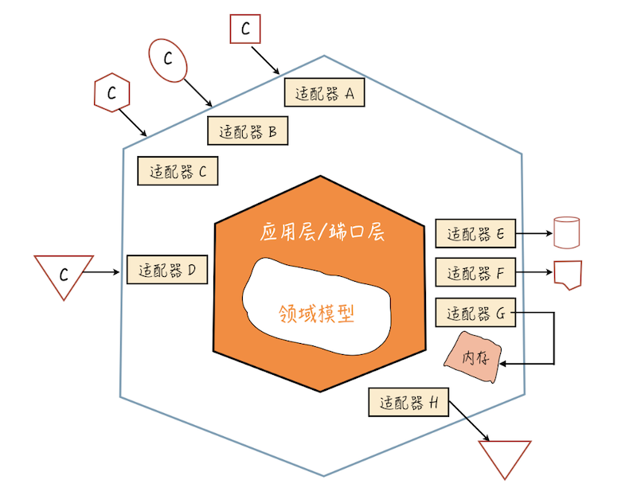

# 0407. 总是在说 MVC 分层架构，但你真的理解分层吗？

郑晔 2019-04-01

作为程序员，你一定听说过分层，比如，最常见的 Java 服务端应用的三层结构，在《15 | 一起练习：手把手带你分解任务》中，我曾提到过：

数据访问层，按照传统的说法，叫 DAO（Data Access Object，数据访问对象），按照领域驱动开发的术语，称之为 Repository；

服务层，提供应用服务；

资源层，提供对外访问的资源，采用传统做法就是 Controller。

这几乎成为了写 Java 服务的标准模式。但不知道你有没有想过，为什么要分层呢？

## 7.1 设计上的分解

其实，分层并不是一个特别符合直觉的做法，符合直觉的做法应该是直接写在一起。

在编程框架还不是特别流行的时候，人们就是直接把页面和逻辑混在一起写的。如果你有机会看看写得不算理想的 PHP 程序，这种现象还是大概率会出现的。

即便像 Java 这个如此重视架构的社区，分层也是很久之后才出现的，早期的 JSP 和 PHP 并没有什么本质区别。

那为什么要分层呢？原因很简单，当代码复杂到一定程度，人们维护代码的难度就急剧上升。一旦出现任何问题，在所有一切都混在一起的代码中定位问题，本质上就是一个「大海捞针」的活。

前面讲任务分解的时候，我不断在强调的观点就是，人们擅长解决的是小问题，大问题怎么办？拆小了就好。

分层架构，实际上，就是一种在设计上的分解。

回到前面所说的三层架构，这是行业中最早普及的一种架构模式，最开始是 MVC，也就是 Model、View 和 Controller。

MVC 的概念起源于 GUI （Graphical User Interface，图形用户界面）编程，人们希望将图形界面上展示的部分（View）与 UI 的数据模型（Model）分开，它们之间的联动由 Controller 负责。这个概念在 GUI 编程中是没有问题的，但也仅限于在与 UI 有交互的部分。

很多人误以为这也适合服务端程序，他们就把模型部分误解成了数据库里的模型，甚至把它理解成数据库访问。于是，你会看到有人在 Controller 里访问数据库。

不知道你是不是了解 Ruby on Rails，这是当年改变了行业认知的一个 Web 开发框架，带来很多颠覆性的做法。它采用的就是这样一种编程模型。当年写 Rails 程序的时候我发现，当业务复杂到了一定规模，代码就开始难以维护了。我想了好久，终于发现，在 Rails 的常规做法中少了服务层（Service）的设计。

这个问题在 Java 领域，爆发得要比 Rails 里早，因为 Ruby 语言的优越性，Rails 实现的数据访问非常优雅。正是因为 Rails 的数据访问实在太容易了，很多服务实际上写到 Model 层里。在代码规模不大时，代码看上去是不复杂的，甚至还有些优雅。

而那时的 Java 可是要一行一行地写数据访问，所以，代码不太可能放在 Model 层，而放在 Controller 里也会让代码变复杂，于是，为业务逻辑而生的 Service 层就呼之欲出了。

至此，常见的 Java 服务端开发的基础就全部成型了，只不过，由于后来 REST 服务的兴起，资源层替代了 Controller 层。

到这里，我给你讲了常见的 Java 服务三层架构的来龙去脉。但实际上，在软件开发中，分层几乎是无处不在的，因为好的分层往往需要有好的抽象。

## 7.2 无处不在的分层

作为程序员，我们几乎每天都在与分层打交道。比如说，程序员都对网络编程模型很熟悉，无论是 ISO 的七层还是 TCP/IP 的五层。

但不知道你有没有发现，虽然学习的时候，你要学习网络有那么多层，但在使用的时候，大多数情况下，你只要了解最上面的那层，比如，HTTP。

很多人对底层的协议的理解几乎就停留在「学过」的水平上，因为在大多数情况下，除非你要写协议栈，不然你很难用得到。即便偶尔用到，90% 的问题靠搜索引擎就解决了，你也很少有动力去系统学习。

之所以你可以这么放心大胆地「忽略」底层协议，一个关键点就在于，网络模型的分层架构实现得太好了，好到你作为上层的使用者几乎可以忽略底层。而这正是分层真正的价值：构建一个良好的抽象。

这种构建良好的抽象在软件开发中随处可见，比如，你作为一个程序员，每天写着在 CPU 上运行的代码，但你读过指令集吗？你之所以可以不去了解，是因为已经有编译器做好了分层，让你可以只用它们构建出的「抽象」—— 编程语言去思考问题。

比如，每天写着 Java 程序的程序员，你知道 Java 程序是如何管理内存的吗？这可是令很多 C/C++ 程序员寝食难安的问题，而你之所以不用关心这些，正是托了 Java 这种「抽象」的福。对了，你甚至可能没有注意到编程语言也是一种抽象。

## 7.3 有抽象有发展

只有构建起抽象，人们才能在此基础上做出更复杂的东西。如果今天的游戏依然是面向显示屏的像素编程，那么，精彩的游戏视觉效果就只能由极少数真正的高手来开发。我们今天的大部分游戏应该依然停留在《超级玛丽》的水准。

同样，近些年前端领域风起云涌，但你是否想过，为什么 Web 的概念早就出现了，但前端作为一个专门的职位，真正的蓬勃发展却是最近十年的事？

2009 年，Ryan Dahl 发布了 Node.js，人们才真正认识到，原来 JavaScript 不仅仅可以用于浏览器，还能做服务器开发。

于是，JavaScript 社区大发展，各种在其他社区已经很流行的工具终于在 JavaScript 世界中发展了起来。正是有了这些工具的支持，人们才能用 JavaScript 构建更复杂的工程，前端领域才能得到了极大的发展。

如今，JavaScript 已经发展成唯一一门全平台语言，当然，发展最好的依然是在它的大本营：前端领域。前端程序员才有了今天幸福的烦恼：各种前端框架层出不穷。

在这里，Node.js 的出现让 JavaScript 成为了一个更好的抽象。

## 7.4 构建你的抽象

理解了分层实际上是在构建抽象，你或许会关心，我该怎么把它运用在自己的工作中。

构建抽象，最核心的一步是构建出你的核心模型。什么是核心模型呢？就是表达你业务的那部分代码，换句话说，别的东西都可以变，但这部分不能变。

这么说可能还是有点抽象，我们回到前面的三层架构。

在前面介绍三层架构的演变时，提到了一个变迁：REST 服务的兴起，让 Controller 逐渐退出了历史舞台，资源层取而代之。

换句话说，访问服务的方式可能会变。放到计算机编程的发展中，这种趋势就更明显了，从命令行到网络，从 CS（Client-Server） 到 BS（Browser-Server），从浏览器到移动端。所以，怎么访问不应该是你关注的核心。

同样，关系型数据库也不是你关注的核心，它只是今天的主流而已。从前用文件，今天还有各种 NoSQL。

如此说来，三层架构中的两层重要性都不是那么高，那重要的是什么？答案便呼之欲出了，没错，就是剩下的部分，我们习惯上称之为服务层，但这个名字其实不能很好地反映它的作用，更恰当的说法应该可以叫领域模型（Domain Model）。

它便是我们的核心模型，也是我们在做软件设计时，真正应该着力的地方。

为什么叫「服务层」不是一个好的说法呢？这里会遗漏领域模型中一个重要的组成部分：领域对象。

很多人理解领域对象有一个严重的误区，认为领域对象属于数据层。数据存储只是领域对象的一种用途，它更重要的用途还是用在各种领域服务中。

由此还能引出另一个常见的设计错误，领域对象中只包含数据访问，也就是常说的 getter 和 setter，而没有任何逻辑。

如果只用于数据存储，只有数据访问就够了，但如果是领域对象，就应该有业务逻辑。比如，给一个用户修改密码，用户这个对象上应该有一个 changePassword 方法，而不是每次去 setPassword。

严格地说，领域对象和存储对象应该是两个类，只不过它俩实在太像了，很多人经常使用一个类，这还是个小问题。但很多人却把这种内部方案用到了外部，比如，第三方集成。

为数不少的团队都在自己的业务代码中直接使用了第三方代码中的对象，第三方的任何修改都会让你的代码跟着改，你的团队就只能疲于奔命。

解决这个问题最好的办法就是把它们分开，你的领域层只依赖于你的领域对象，第三方发过来的内容先做一次转换，转换成你的领域对象。这种做法称为防腐层。

当我们把领域模型看成了整个设计的核心，看待其他层的视角也会随之转变，它们只不过是适配到不同地方的一种方式而已，而这种理念的推广，就是一些人在说的六边形架构。

怎么设计好领域模型是一个庞大的主题，推荐你去了解一下领域驱动设计（Domain Driven Design，DDD），这个话题我们后面还会再次提到。

讨论其实还可以继续延伸下去，已经构建好的领域模型怎么更好地提供给其他部分使用呢？一个好的做法是封装成领域特定语言（Domain Specific Language，DSL）。当然，这也是一个庞大的话题，就不继续展开了。

## 总结时刻

我从最常见的服务端三层架构入手，给你讲了它们的来龙去脉。分层架构实际是一种设计上的分解，将不同的内容放在不同的地方，降低软件开发和维护的成本。

分层，更关键的是，提供抽象。这种分层抽象在计算机领域无处不在，无论是编程语言，还是网络协议，都体现着分层抽象的价值。有了分层抽象，人们才能更好地在抽象的基础上构建更复杂的东西。

在日常工作中，我们应该把精力重点放在构建自己的领域模型上，因为它才是工作最核心、不易变的东西。

如果今天的内容你只能记住一件事，那请记住：构建好你的领域模型。

最后我想请你思考一下，你还知道哪些技术是体现分层抽象的思想吗？

## 精选留言

### 01

万维钢有期节目里提到芯片设计时讲到了分层以及模型的概念。分层或模型，实质是因为人的认知能力有限不得已而为之的。学习计算机，我们都知道晶体管，即便早就忘了它的原理。实际上晶体管涉及非常深奥的物理学知识，这是绝大多数人一辈子都不需要了解的物理学。抛开复杂艰深的物理学，晶体管的本质却很简单，它就是一个包含通和不通两个状态的开关，这就是它构建的模型。

在开关的模型基础之上，信息论的创立者香农用一篇硕士论文构建了逻辑门这层。他证明了可以用最简单的开关，实现所有逻辑运算。

逻辑运算层次之上，就是我们所知道的 CPU 模型。再往上，就是我们所熟悉的信息世界。

作者回复：同是精英日课的读者，这篇内容还真的是受到万老师的影响写下的。

2019-04-01

### 02

分享一下自己的经历，best practices 其实在不同时期有不同的理解，有时候甚至变化很大，我自己也有迷惑的时候。我是做 ror 出身的，rails 就是标准的 MVC，再加上一个 helper 目录；初入行时候接触的项目，controller 都很臃肿，后来，提倡的是 thin controller, fat model, 于是大家又把逻辑搬到 model 里面；于是 model 又变得非常臃肿，里面包括了很多业务逻辑，耦合太高，写起测试来非常痛苦；另外，原本 helper 只应该放关于 view 的 method，却很快变成了垃圾桶，很多不是 view 相关的方法都扔在了 helper 目录下，甚至很多 controller 要 include 其他 controller 对应的 helper，只是因为那里定义了一个可以用到的方法。

再后来，有了 presenter 的概念，helper 目录基本就不用了；每个 controller 都有对应都 presenter，再有，就是建立了 service 的目录，把业务逻辑从 model 里面抽离处理； 这样的结构稍微清洁了一点，测试也好写了很多。但是在我看来，我们项目 presenter/services 这种分层没有什么标准，有些同事还是把这种分层当作万能垃圾桶，什么都建一个，甚至业务 / 运算都扔在 presenter 里面；services 的分层也是一个问题，很多只是根据 model 的来分，而不是业务； 最近有看了一下 elixir 对应的 phoenix ，它引入了 context 的概念，更偏重于业务划分，我感觉这是一个比 rails 更合理的分层。

PS：非常喜欢老师的这个课程，收益良多，能否建立微信群 /slack/ 小密圈 之类的以便课程结束后能继续与老师和各位同行交流。谢谢

作者回复：多谢你的分享！后续的安排看编辑怎么协调吧。

2019-04-04

### 03

老师提到的直接把第三方类库的字段直接使用，导致 bug 层出不穷，这个真的是深受其害，线上程序莫名 bug，原来是第三方修改或者擅自把字段等出现问题，改来改去，最后还是用类似老师提出那种转化本地对象再使用，最后做了类似一个防腐层那种解决问题。实际才出的坑总结到这么个东西，就是类似老师提出的模型概念。

作者回复：道理很简单，痛过才知道。

2019-04-01

### 04

请问老师，在 jdk 的集合框架中常常会在实现类内部维护一个内部类，比如 HashMap 内部有个 Node 内部类，这算领域对象么？

作者回复：在通常的讨论中，这是不算的。

2019-09-02

### 05

学了 REST 和 DDD，感觉两者有相通的地方：两者都以数据（一个是资源，另外一个是领域对象）为中心，并制定一套标准的数据操作（一个是 HTTP Verb，另外一个我项目主要用 JPA 这一套）；而核心是业务建模。

作者回复：你的理解很棒！

2019-04-02

### 06

老师你好，就是我现在在开发的时候有些困惑，我将界面逻辑层（界面数据显示）、业务逻辑层（具体业务逻辑功能实现）分出来后，但像支持这些业务的一些服务，比如通讯服务，数据缓存服务，这些算是工具，还是说也可以分为一些单独的层，还有像界面显示的数据我需要给界面单独提供一些界面显示的数据结构，还是直接使用逻辑层里面的数据结构，还是说这些数据结构单独拆分出来也可以作为一层。

作者回复：看六边形架构的图，通信服务属于六边形架构的适配器。

2019-04-01

### 07

对项目中变化代码和稳定代码的拆分。按特性归类成变化层和稳定层，中间用门面或适配器对接。针对变化层提炼出抽象层用装饰者模式或抽象工厂实现多态。

作者回复：学习 DDD，建立模型概念，你就不纠结于这里的设计模式了。

2019-04-01

### 08

分层是为了更好的抽象，区分出程序中的不变点与与易变点，集中精力优化抽象不变点，以便更好的复用不变点逻辑。尽可能的快速添加和修改易变逻辑响应业务变更需求。个人认为：分层设计有点像代码设计模式里的模板设计模式。但分层设计更像是代码组织的模板，功能和交互层面的分组的模板。分层设计不但做到代码的分层也促进了分工合作，从而达到快速，简单，高效开发的目的。

2019-10-01

### 09

文章有些地方看不懂，不太懂领域对象什么的。

作者回复：核心模型，就是当你的软件去掉它，就不是这个软件了。比如，如果没有商品和订单，电商就玩不转了，但如果它不支持高并发，其实没什么影响。

2019-09-15

### 10

很多技术都是吧，都是为了把一些通用的基础的功能抽象出来，Robot 框架也是，提供了很多实现基础功能的类库，通过这些基础的关键字可以组成新的关键字，再由关键字组成更复杂的关键字，我们只用关心怎么实现功能，而这些关键字怎么调用，编译，log 和结果怎么一层层展示，这些都由框架实现了。

2019-09-15

### 11

分层架构设计的目的：

1. 提炼抽象，构建好领域模型。

2. 降低软件开发和维护成本。

3. 扩展性更好。

2019-04-10

### 12

跟过一段时间微软的 silverlight，一开始听说是 wpf 的子集，后来又有人辟谣说除了使用 xaml 等形似之处外差别很大的。自己也看过两者的源码，就抽象能力和程度看还是正宗 wpf 强大，虽然不是业务框架，但从开发工具角度来看，它的基于自身定位及领域的体系设计还是值得称道的。曾经有一段时间里 java 和.net 相互 diss 的厉害，现在看来在道的层面是可以和谐共处的，只是术上各有各的呈现罢了。

2019-04-06

### 13

微服务中的数据访问层，有可能跟访问数据库一点关系都没有，而只是一层调用 http 请求去访问其他微服务的封装，但它的原理其实跟传统的分层结构应该是一致的。

2019-04-05

### 14

产品，开发，测试，运维，运营等岗位也属于分层，不同技术栈的人，组成完备技术体系。

作者回复：这个理解比较…… 跨界。

2019-04-04