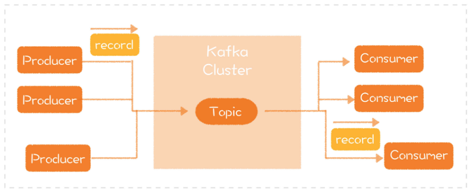

# 0104. Kafka：如何分析一个软件的实现？

郑晔 2020-06-08

上一讲，我们学习了如何看接口，今天我们进入第三个部分 —— 看实现。在一个系统中，模型和接口是相对稳定的部分。但是，同样的模型和接口，如果采用不同的实现，稳定性、可扩展性和性能等诸多方面相差极大。而且，只有了解实现，你才有改动代码的基础。但是，不得不说，「看实现」是一个很大的挑战，因为有无数的细节在那里等着你。所以，在很多团队里，一个新人甚至会用长达几个月的时间去熟悉代码中的这些细节。

面对这种情况，我们该怎么办呢？首先，你要记住一件事，你不太可能记住真实项目的所有细节，甚至到你离开项目的那一天，你依然会有很多细节不知道，可这并不妨碍你的工作。但是，如果你心中没有一份关于项目实现的地图，你就一定会迷失。

像我前面所说的新人，他们用几个月的时间熟悉代码，就是在通过代码一点点展开地图，但是，这不仅极其浪费时间，也很难形成一个整体认知。所以我建议，你应该直接把地图展开。怎么展开呢？你需要找到两个关键点：软件的结构和关键的技术。

可能你还不太理解我的意思，下面我就以开源软件 Kafka 为例，给你讲一下如何把地图展开，去看一个软件的实现。按照我们之前讲过的思路，了解一个软件设计的步骤是「先模型，再接口，最后看实现」。所以，我们要先了解 Kafka 的模型和接口。

## 4.1 消息队列的模型与接口

Kafka 是这么自我介绍的：Kafka 是一个分布式流平台。这是它现在的发展方向，但在更多人的心目中，Kafka 的角色是一个消息队列。可以说，消息队列是 Kafka 这个软件的核心模型，而流平台显然是这个核心模型存在之后的扩展。所以，我们要先把焦点放在 Kafka 的核心模型 —— 消息队列上。简单地说，消息队列（Messaging Queue）是一种进程间通信的方式，发消息的一方（也就是生产者）将消息发给消息队列，收消息的一方（也就是消费者）将队列中的消息取出并进行处理。

站在看模型的角度上，消息队列是很简单的，无非是生产者发消息，消费者消费消息。而且消息队列通常还会有一个 topic 的概念，用以区分发给不同目标的消息。消息队列的基本接口也很简单。以 Kafka 为例，生产者是这样发消息的：

```java
producer.send(new KafkaRecord<>("topic", new Message()));
```

而消费者收消息是这样的：

```java
ConsumerRecords<String, Message> records = consumer.poll(1000);
```

有了对模型和接口的基本了解，我们会发现，消息队列本身并不难。但我们都知道，消息队列的实现有很多，Kafka 只是其中一种，还有诸如 ActiveMQ、RabbitMQ 等的实现。为什么会有这么多不同的消息队列实现呢？因为每个消息队列的实现都会有所侧重，不同的消息队列有其适用的场景。

消息队列还有一个最常见的特性是，它会提供一定的消息存储能力。这样的话，当生产者发消息的速度快于消费者处理消息的速度时，消息队列可以起到一定的缓冲作用。所以，有一些系统会利用消息队列的这个特性做「削峰填谷」，也就是在消息量特别大时，先把消息收下来，慢慢处理，以减小系统的压力。Kafka 之所以能从一众消息队列实现中脱颖而出，一个重要的原因就是，它针对消息写入做了优化，它的生产者写入速度特别快。从整体的表现上看，就是吞吐能力特别强。

好，我们已经对 Kafka 的能力有了一个初步的认识。显然，介绍接口和模型不足以将它与其他消息队列实现区分开来。所以，我们必须拉开大幕，开始去了解它的实现。

## 4.2 软件的结构

前面我提到，当我们想去看一个软件的实现时，有两件事特别重要：软件的结构和关键的技术。

我们先来看软件的结构。软件的结构其实也是软件的模型，只不过，它不是整体上的模型，而是展开实现细节之后的模型。我在第 1 讲也说过，模型是分层的。对于每个软件来说，当你从整体的角度去了解它的时候，它是完整的一块。但当你打开它的时候，它就变成了多个模块的组合，这也是所谓「分层」的意义所在。而上一层只要使用下一层提供给它的接口就好。所以，当我们打开了一个层次，了解它的实现时，也要先从大处着手。最好的办法就是我们能够找到一张结构图，准确地了解它的结构。

如果你能够找到这样一张图，你还是很幸运的。因为在真实的项目中，你可能会碰到各种可能性：1）结构图混乱：你找到一张图，上面包含了各种内容。比如，有的是模块设计，有的是具体实现，更有甚者，还包括了一些流程；2）结构图复杂：一个比较成熟的项目，图上画了太多的内容。确实，随着项目的发展，软件解决的问题越来越多，它必然包含了更多的模块。但对于初次接触这个项目的我们而言，它就过于复杂了；3）无结构图：这是最糟糕的情况，你最好先想办法画出一张图来。

无论遇到上述的哪种情况，你了解项目都不会很顺利。所以，你还是要先了解模型和接口，因为它们永远是你的主线，可以帮你从混乱的局面中走出来。那么，假设现在你有了一张结构图，在我们继续前进之前，我想先问一个问题：现在你有了一张结构图，你打算做什么？你可能会问，难道不是了解它的结构吗？是，但不够。我们不仅要知道一个设计的结果，最好还要推断出设计的动因。

所以，一种更好的做法是，带着问题上路。我们不妨假设自己就是这个软件的设计者，问问自己要怎么做。然后再去对比别人的设计，你就会发现，自己的想法和别人想法的相同或不同之处。对于理解 Kafka 而言，第一个问题就是如果你来设计一个消息队列，你会怎么做呢？

如果在网上搜索 Kafka 的架构图，你会搜到各种各样的图，上面包含了不同的信息。有的告诉你分区（Partition）的概念，有的告诉你 Zookeeper。根据前面对模型的介绍，我特意挑了一张看上去最简单的架构图，因为它最贴近消息队列的基础模型：



那么，从这个图中，你能看到什么呢？你能看到，Kafka 的生产者一端将消息发送给 Kafka 集群，然后，消费者一端将消息取出来进行处理。这样的结构和你想的是不是一样的呢？如果让你负责进一步设计，你会怎么做呢？1）生产者端封装出一个 SDK，负责消息的发送；2）消费者端封装出一个 SDK，负责消息的接收；3）设计一个集群系统，作为生产者和消费者之间的连接。

然后，你就可以问自己更多的问题：1）生产端如果出现网络抖动，消息没有成功发送，它要怎么重试呢？2）消费端处理完的消息，怎样才能保证集群不会重复发送呢？3）为什么要设计一个集群呢？要防止出现单点的故障，而一旦有了集群，就会牵扯到下一个问题，集群内的节点如何保证消息的同步呢？4）消息在集群里是怎么存储的？5）生产端也好，消费端也罢，如果一个节点彻底掉线，集群该怎么处理呢？……

你有了更多的问题之后，你就会在代码里进行更深入地探索。你可以根据需要，打开对应模块，进一步了解里面的实现。比如，消息重发的问题，你就可以看看生产端是怎么解决这些问题的。当问题细化到具体实现时，我们就可以打开对应的源码，去里面寻找答案。

从结构上来说，Kafka 不是一个特别复杂的系统。所以，如果你的项目更复杂，层次更多，我建议你把各个层次逐一展开，先把整体结构放在心中，再去做细节的探索。

## 4.3 关键的技术

我们再来看看理解实现的另一个重要方面：关键技术。

什么算是关键技术呢？就是能够让这个软件的「实现」与众不同的地方。了解关键技术可以保证一点，就是我们对代码的调整不会使项目出现明显的劣化。幸运的是，大多数项目都会愿意把自己的关键技术讲出来，所以，找到这些信息并不难。以 Kafka 为例，前面说过，它针对写入做了优化，使得它的整体吞吐能力特别强。那它是怎么做到的呢？

消息队列实现消息存储的方式通常是把它写入到磁盘中，而 Kafka 的不同之处在于，它利用了磁盘顺序读写的特性。对于普通的机械硬盘而言，如果是随机写，需要按照机械硬盘的方式去寻址，然后磁头做机械运动，写入速度就会慢得多。但顺序写的话，会大幅度减少磁头的运动，效率自然就得到了大幅度的提高。

之所以可以这样实现，是充分利用了消息队列本身的特性：有序。它是技术实现与需求完美结合的产物。有了这个基础，就可以有进一步的优化。比如，利用内存映射文件减少用户空间到内核空间复制的开销。如果站在了解实现的角度，你会觉得非常地自然。但要想从设计的角度学到更多，我们还是应该带着问题上路，多问自己一个问题，为什么其他的消息队列之前不这么做呢？这是一个值得深思的问题。Kafka 这个实现到底是哪里不容易想到呢？答案是软硬结合。

之前的消息队列实现也会把消息写入到文件里，但文件对它们来说，只是一个通用的接口。开发者并没有想过利用硬件的特性做开发。而 Kafka 的开发者突破了这个限制，把硬件特性利用了起来，从而取得了更好的结果。一旦理解了这一点，我们再来看其他的一些设计，就能学到更多的东西。比如，有一个著名的开源项目 LMAX Disruptor，它号称是最强劲的线程通信库。它有一段非常奇怪的代码，类似这样：

```java
protected long p1, p2, p3, p4, p5, p6, p7;
```

以正常程序员的标准，这简直是无厘头的低劣代码。而想要理解这段代码，你必须理解 CPU 缓存行的机制，这也是一种软硬结合的思路。

对于习惯写「软」件的程序员而言，在软件上投入的努力到达极限时，软硬结合是一种思路上的突破。当然，这种突破的前提是要对硬件的机制有所了解，这往往是很多程序员在基本功上欠缺的，可以学习一下计算机组成原理之类的课程。如果你有时间去学习，《深入理解计算机系统》一书值得一读。

## 总结时刻

今天是了解设计的第三部分：看实现。理解一个实现，是以对模型和接口的理解为前提的。每个系统的实现都有非常多的细节，我们不可能一上来就把所有的细节吃透。如果想了解一个系统的实现，应该从软件结构和关键技术两个方面着手。无论是软件结构，还是关键技术，我们都需要带着自己的问题入手，而问题的出发点就是我们对模型和接口的理解。了解软件的结构，其实，就是把分层的模型展开，看下一层的模型。一方面，你要知道这个层次给你提供了怎样的模型，另一方面，你要带着自己的问题去了解这些模型为什么要这么设计。最后，我借着 Kafka 的关键技术还给你讲了软硬结合的思路，在系统优化之路上寻求突破时，可以增加你选择的道路。不过，实现都是有约束的，比如，Kafka 的实现主要是针对机械硬盘做的优化，现在的 SSD 硬盘越来越多，成本越来越低，这个立意的出发点已经不像以前那样稳固了。

至此，了解设计的三步我们已经全部走完了。接下来，我们就要开始自己的设计历程了。首先，我们需要掌握一些关于设计的基础知识。下一讲，我们就从最基础的部分入手，我们来谈谈程序设计语言。如果今天的内容你只能记住一件事，那请记住：理解实现，带着自己的问题，了解软件的结构和关键的技术。

## 黑板墙

最后，我想请你来思考一下，在项目上学习的哪些东西对你个人在实现思路上有了一个极大的突破。

### 01

旁外话：我的能力只能做到描述自己的理解。我描述自己的理解是希望能从栏主和其他学员处获得反馈，从而调整个人认知。我的身边缺少在软件设计上有追求的队友，很感谢有这个平台可以让我试错，交流，调整。

1、我认为软件的结构和核心技术应该是分开的。kafka 之所以是消息队列，看的是对消息队列这个模型的实现。kafka 之所以是 kafka 看的是其消息存储这一核心技术的实现。所以，如果我是想通过看 kafka 了解消息队列，那么就没必要也不该去看存储实现，我该看的是，路由信息管理，消息生产，消息消费这 3 块核心业务的骨干，以及其旁支功能的选择（限制消息大小，故障节点延后，延迟消费）；如果我想知道 kafka 为什么在 mq 中间件中如此突出，那么我就得了解其核心技术的实现，也就这里所说的「软硬结合的存储设计」。

2、谈谈对模型的理解。模型是一个抽象的概念，被抽象的对象可以是某个聚合实体（订单中心中的订单），也可以是某个流程或功能（java 内存模型中的主存与缓存同步的规则）。分层对模型来说是实现层面的东西，是一种水平方向的拆分，是一个实现上的规范；模型的细粒度拆分（父模型，子模型），应该是一种垂直维度的拆分，子模型的功能要高内聚，其复杂性不该发散到外部。

3、protected long p1, p2, p3, p4, p5, p6, p7; 这个玩意是 Disruptor 的缓存行填充中的填充字段。Disruptor 中的一个元素是一个 volatile 的 long 类型，占用 8 字节。一但一个元素被修改，则与其出于同个缓存行的所有元素的缓存都会失效。这就导致变更索引位 1 的元素，会导致索引位 0 的元素缓存也失效（操作时需要重新从主内存加载）。故而 Disruptor 做了一个缓存行填充的优化，在目标元素的前后都加了 7 个类型字段，两边都占据掉 56 个字节。故而保证每个元素都独占缓存行。是一种用空间换时间的优化。

4、04 讲说过要拿个开源项目来分析，刚好我拿的也是 mq，就借当前这个篇幅补充下。我看的是 RocketMq，目前看完了路由信息管理中心，消息生产端和消息存储的逻辑。拿路由信息管理中心 NameServer 来说。被抽象的模型对象是路由信息管理中心，既包含路由信息也包含路由信息的管理。路由信息由 QueueData，Broker，TopicRouteData 三个实体承载，路由信息管理由 BrokerLiveInfo 和 RouteInfoManager 负责。提供了路由注册，路由发现和路由删除三个接口。1）路由注册的接口触发是以 Nameserver 处理 Broker 的心跳包的方式接入的，具体代码见 RouteInfoManager#registerBroker。2）路由发现的接口触发 Nameserver 不管，由客户端定时请求获取路由信息，具体看 DefaultRequestProcessor#getRouteInfoByTopic。3）路由删除接口的触发是由 Nameserver 定时 10S 扫一遍 brokerLiveTable。将超时 120s 的 broker 信息全部剔除。或者 broker 正常关闭会来调用。具体见 RouteInfoManager#scanNotActiveBroker 和 unregisterBroker。

评价：作为路由信息中心，功能相对简单，所以技术设计上就没太多好说的。比较突出的就是 NameServer 节点间不做信息同步，每个 NameServer 都单独接收 broker 的心跳维护路由信息。这样的设计无疑极大降低了 NameServer 实现的复杂度，毕竟集群内消息同步一直是个头疼的事情。但是这样的方式，在 NameServer 节点过多和 broker 节点过多的场景下感觉都会有性能瓶颈（单位时间心跳的次数增多和需要心跳通知的节点增多）。可是这样的设计依旧抗住了大规模集群的场景，用实践案例打了我理论感观的脸。

但作为一个 apache 开源项目，其代码实现风格实在令人难受。违反单一职责原则，NamesrvController 做了外放接口，存储数据，启动定时等等一系列事情。且因为涵盖数据容器的职责，所以还需要再其他类中传递。违反依赖倒置原则，接口都找不到，就不用提啥基于接口而非实现编程了。如果要说这个项目的风格或者说代码设计偏好，那么就是没有原则，甚至都看不到阿里巴巴编程规范的影子。而这个问题不仅是在 NameServer 一个子模块中，而是在整个 rocketMq 模块都普遍存在。于此带来的就是，这个项目的新老交接，持续迭代，成本都会比较高。

限于篇幅，其他部分就不表了。rocketMq 是个很优秀很成功的产品，但也因为它的光辉，目前其背后的代码实现才越显得格格不入。作者回复：感谢你的分享，其他人可以从中学习到新的知识。2020-06-08

### 02

看一个项目的实现，主要是去看软件结构和关键技术。类似于 Kafka 这样的「网红」开源项目，可以找到的结构图和相关资料不少，特别是官方资料还是比较权威的，比平时工作中接触到的那些陈旧代码要好很多。文中对于 Kafka 的生产者消费者模型的初步提问，并不难以想到，生产者、消费者、集群连接；而后续问出更多的问题 —— 网络抖动、集群…… 这个就比较需要功力了。Kafka 的关键技术在于利用了磁盘顺序读写的特性，这个和 Disruptor 利用缓存填充技术颇有异曲同工之妙。而我前两天刚好在「数据结构和算法之美」的打卡活动里面，看过 Disruptor，印象颇深。顺路去看了「深入浅出计算机组成原理」中关于 Kafka 的章节，还试读了两篇「Kafka 核心技术与实战」，确实应该认真的学习一下 Kafka，这个号称薪资排名比较靠前的技能。我也好奇，面对 SSD 硬盘，Kafka 怎么办？作者回复：其实也不需要怎么办，享受硬件升级带来的好处就好了，性能自然就提升了。2020-06-08

### 03

相同的功能可能要不同的软件产品。他们的接口与模型都是差不多的，不同之处就在于实现。所以理解这些产品族以及他们的差异就该从实现入手。就像 LinkedList 和 ArrayList 都可以提供 List 的功能，但是实现的不同决定了他们各自不同的特性。使用时的选型还是要根据业务场景的需求来的。作者回复：这取决于你的模型是什么，如果是 List，LinkedList 和 ArrayList 就是实现。如果是具体类，它们就是各自的模型了。2020-06-08

### 04

先后看了 php 的源代码和 laravel，CI，Tp 等框架的源码。从从组件到接口，从组件到模型，最后从模型到实现，走完一整个生命周期，学习到了很多优雅的设计，以及扩展如何接入，不过并不真的为什么会这么设计，设计的时候会解决什么样的问题，以及应用场景，当时还是在大学，所以实战经验不是特别丰富，于是自己想动手实现一下框架，看看为什么框架可以引用于不同的架构，逐步扩展，发现思想虽然相同，但是实现的优雅程度还是不可比拟。作者回复：还有一个原因，你没有面对那个问题。所有的代码只是设计的结果，一些东西变复杂通常都是有原因的。2020-06-10