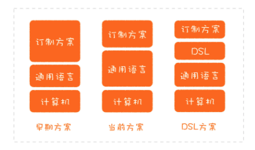

# 0204. DSL：你也可以设计一门自己的语言

郑晔 2020-06-17

在前面，我们花了三讲的篇幅探讨程序设计语言，一方面是为了增进我们对程序设计语言的理解，另一方面，也希望从中学习到软件设计方面做得好的地方。除了借鉴一些语言特性之外，我们还能怎样应用程序语言，来帮我们做设计呢？

讲到程序设计语言模型时，我说过，程序设计语言的发展趋势，就是离计算机本身越来越远，而离要解决的问题越来越近。但通用程序设计语言无论怎样逼近要解决的问题，它都不可能走得离问题特别近，因为通用程序设计语言不可能知道具体的问题是什么。

这给具体的问题留下了一个空间，如果我们能把设计做到极致，它就能成为一门语言，填补这个空间。注意，我这里用的并不是比喻，而是真的成为一门语言，一门解决一个特定问题的语言。



这种语言就是领域特定语言（Domain Specific Language，简称 DSL），它是一种用于某个特定领域的程序设计语言。这种特定于某个领域是相对于通用语言而言的，通用语言可以横跨各个领域，我们熟悉的大多数程序设计语言都是通用语言。

我在第 8 讲说过，它们都是图灵完备的，但 DSL 不必做到图灵完备，它只要做到满足特定领域的业务需求，就足以缩短问题和解决方案之间的距离，降低理解的门槛。虽然大多数程序员并不会真正地实现一个通用程序设计语言，但实现一个 DSL，我们还是有机会的。这一讲我们就来谈谈 DSL，看看我们可以怎样设计自己的语言。

## 4.1 领域特定语言

不过，一说起设计一门语言，很多人直觉上会有畏惧心理。但实际上，你可能已经在各种场合接触过一些不同的 DSL 了。程序员最熟悉的一种 DSL 就是正则表达式了，没错，也许已经习惯使用正则表达式的你都不知道，但它确实就是一种 DSL，一种用于文本处理这个特定领域的 DSL。

如果你觉得正则表达式有点复杂，还有一种更简单的 DSL，就是配置文件。你可能真的不把配置文件当作一种 DSL，但它确实是在实现某个特定领域的需求，而且可以根据你的需求对软件的行为进行定制。一个典型的例子是 Ngnix。无论你是用它单独做 Web 服务器也好，做反向代理也罢，抑或是做负载均衡，只要通过 Ngnix 的配置文件，你都能实现。配合 OpenResty，你甚至可以完成一些业务功能。这么一说，你是不是觉得 DSL 的门槛不像听上去那么高了。

经过前面几讲的学习，你应该知道了，语法只是一种接口。很多人说到设计 DSL，脑子里实际想的也只是设计一种语法。所以，从软件设计的角度看，DSL 最终呈现出来的语法只是一种接口，但最重要的是它包裹的模型。

Martin Fowler 在他的《领域特定语言》这本书中，将这个模型称为语义模型（Semantic Model）。不过，在我看来，Martin Fowler 起这个名字是站在语言开发的角度，毕竟语义这个词，只有学过编译原理的人才好理解。所以，这里真正的重点是模型。

想要实现一个 DSL，可以这么说，DSL 的语法本身都是次要的，模型才是第一位的。当你有了模型之后，所谓的构建 DSL，就相当于设计一个接口，将模型的能力暴露出来。当把 DSL 理解成接口，我们接受 DSL 的心理负担就小了很多。你可以想一想，它和你熟悉的 REST API 其实没有什么本质的不同。

既然是接口，形式就可以有很多种，我们经常能接触到的 DSL 主要有两种：外部 DSL 和内部 DSL。Martin Fowler 在他的书中还提到了语言工作台（Language Workbench），不过，这种做法在实际工作中用到的不多，我们暂且忽略。

外部 DSL 和内部 DSL 的区别就在于，DSL 采用的是不是宿主语言（Host Language）。你可以这么理解，假设你的模型主要是用 Java 写的，如果 DSL 用的就是 Java 语言，它就是内部 DSL，如果 DSL 用的不是 Java，比如，你自己设计了一种语法，那它就是外部 DSL。

把概念说清楚了，一些问题便迎刃而解了。这也可以解释为什么 DSL 让有些人畏惧了，原因就是说起 DSL，这些人想到的就是自己设计语法的外部的 DSL。其实，即便是外部 DSL，也不一定要设计一门语法，我们甚至可以借助已有的语法来完成。比如，很多程序员熟悉的一种语法：XML。

如果你是一个 Java 程序员，XML 就再熟悉不过了。从 Ant 到 Maven，从 Servlet 到 Spring，曾经的 XML 几乎是无处不在的。如果你有兴趣，可以去找一些使用 Ant 做构建工具的项目，项目规模稍微大一点，其 XML 配置文件的复杂程度就不亚于普通的源代码。

因为它本质上就是一种用于构建领域的 DSL，只不过，它的语法是 XML 而已。正是因为这种 DSL 越来越复杂，后来，一种新的趋势渐渐兴起，就是用全功能语言（也就是真正的程序设计语言）做 DSL，这是后来像 Gradle 这种构建工具逐渐流行的原因，它们只是用内部 DSL 替换了外部 DSL。

从复杂度而言，自己设计一种外部 DSL 语法，大于利用一种现有语法做外部 DSL，二者之间的差别在于谁来开发解析器。而外部 DSL 的复杂度要大于内部 DSL，因为内部 DSL 连解析的过程都省略了。从实用性的角度，更好地挖掘内部 DSL 的潜力对我们的实际工作助益更多。

## 4.2 代码的表达性

你或许会有一个疑问，内部 DSL 听上去就是一个程序库啊！你这个理解是没错的。我们前面说过，语言设计就是程序库设计，程序库设计就是语言设计。当一个程序库只能用在某个特定领域时，它就是一个内部 DSL，这个内部 DSL 的语法就是这个程序库的用法。我先用一个例子让你感受一下内部 DSL，它来自 Martin Fowler 的《领域特定语言》。我们要创建一个 Computer 的实例，如果用普通风格的代码写出来，应该是这个样子：

```java
Processor p = new Processor(2, 2500, Processor.Type.i386); Disk d1 = new Disk(150, Disk.UNKNOWN_SPEED, null);
Disk d2 = new Disk(75, 7200, Disk.Interface.SATA);
return new Computer(p, d1, d2);
```

而用内部 DSL 写出来，则是这种风格：

```java
computer() 
  .processor()
    .cores(2) 
    .speed(2500) 
    .i386()
  .disk()
    .size(150)
  .disk()
   .size(75)
   .speed(7200) 
   .sata()
.end();
```

如果这是一段普通的 Java 代码，我们看到一连串的方法调用，一定会说，这段代码糟糕至极！但在这个场景下，和前面的代码相比，这段代码省去了好多变量，反而是清晰了。这其中的差别在哪里呢？之所以我们会觉得这种一连串的方法调用可以接受，一个重要的原因是，这段代码并不是在做动作，而是在进行声明。做动作是在说明怎么做（How），而声明的代码则是在说做什么（What）。

二者的抽象级别是不同的，「怎么做」是一种实现，而「做什么」则体现着意图。将意图与实现分离开来，是内部 DSL 与普通的程序代码一个重要的区别，同样，这也是一个好设计的考虑因素。

Martin Fowler 在讨论 DSL 定义时，提到了 DSL 的 4 个关键元素：1）计算机程序设计语言（Computer programming language）；2）语言性（Language nature）；3）受限的表达性（Limited expressiveness）；4）针对领域（Domain focus）。

其中，语言性强调的就是 DSL 要有连贯的表达能力。也就是说，你设计自己的 DSL 时，重点是要体现出意图。抛开是否要实现一个 DSL 不说，的确，程序员在写代码时应该关注代码的表达能力，而这也恰恰是很多程序员忽略的，同时也是优秀程序员与普通程序员拉开差距的地方。普通程序员的关注点只在于功能如何实现，而优秀的程序员会懂得将不同层次的代码分离开来，将意图和实现分离开来，而实现可以替换。

说到这里，你就不难理解学习内部 DSL 的价值了，退一步说，你不一定真的要自己设计一个内部 DSL，但学会将意图与实现分离开，这件事对日常写代码也是有极大价值的。有了这个意识，你就可以很好地理解程序设计语言的一个重要发展趋势：声明式编程。现在一些程序设计语言的语法就是为了方便进行声明式编程，典型的例子就是 Java 的 Annotation。正是它的出现，Spring 原来基于 XML 的外部 DSL 就逐步转向了今天常用的内部 DSL 了，也就是很多人熟悉的 Java Config。

你会发现，虽然我在这说的是写代码，但分离意图和实现其实也是一个重要的设计原则，是的，想写好代码，一定要懂得设计。

## 总结时刻

我们讨论了领域特定语言，这是针对某个特定领域的程序设计语言。DSL 在软件开发领域中得到了广泛的应用。要实现一个 DSL，首先要构建好模型。常见的 DSL 主要是外部 DSL 和内部 DSL。二者的主要区别在于，DSL 采用的是不是宿主语言。相对于外部 DSL，内部 DSL 的开发成本更低，与我们的日常工作结合得更加紧密。内部 DSL 体现更多的是表达能力，相对于传统的代码编写方法而言，这种做法很好地将作者的意图体现了出来。即便我们不去设计一个内部 DSL，这种写代码的方式也会对我们代码质量的提高大有助益。关于语言，已经讲了四讲，我们先告一段落。下一讲，我们要来讨论编程范式，也就是做设计的时候，我们可以利用的元素有哪些。如果今天的内容你只能记住一件事，那请记住：好的设计要迈向 DSL，我们可以从编写有表达性的代码起步。

## 黑板墙

我想请你分享一下，你还能举出哪些 DSL 的例子呢？

### 01

SQL 也是一种 DSL，他屏蔽了计算机存储的底层实现，提供了易于操作数据的接口。一些 ORM 框架对 SQL 这些 DSL 进行了进一步的封装提供了声明式注解，相当于构建在 DSL 之上的 DSL 翻译器。面向对象编程将面向关系的 DSL 进行更高层次的封装，使得在编程这个特定领域更加易于使用。作者回复：很好的分享！2020-06-17

### 02

我觉得 markdown 应该算一个。作者回复：嗯，好有趣的角度！2020-06-17

汇总：1）k8s 和 docker-compose 的 yml 文件，就是声明试编程。算是外部 dsl。2）本章疑问： dsl 和接口有何异同点？首先 dsl 和接口都做了一件事，就是意图和实现的分离。但是 dsl 的语义（意图）是可以灵活组织的，而接口的语义基本靠接口命名和方法命名来阐述，在灵活性上明显是不足的。如何去实现 dsl？第一感觉就是建造者模式。这里实现就有分支。第一种是将要执行的业务逻辑（实现）写在 dsl 实体 bean 内部。在所有业务功能都由实体内部属性决定时，这是可行的（领域模型的行为）；第二种是将执行的业务功能注入要创建的 dsl 实体，然后回调。毕竟复杂业务流程的组织不该是单个实体能够囊括的，而且我们的功能代码大部分还是面向过程的（java 就是一个 service 注入一个 service，然后嵌套调用）；第三种就是将 dsl 实体作为入参传入接口方法，然后通过其属性调整业务流向，控制代码逻辑。这种方式我认为是开发维护成本最低的（面向过程不好，但他简单呀，不需要什么设计知识背书，懂语法就能看懂），但是我在某本书看到过，「程序的逻辑不该由入参去控制」。是定制多个接口方法。还是提供统一方法由入参调度逻辑，真的不好说孰好孰劣。作者回复：后面我们就来谈结构化编程和面向对象编程。2020-06-17

### 03

drone.io 用的.drone.yml，jenkins 用的 pipefile 都算是轻量级的 dsl。uml 算不算是一种重量级的 dsl 呢？作者回复: UML 可能不算，因为它不能执行。2020-06-17

### 04

DSL 是为了解决某个特定领域的程序设计语言。作为一个客户端 APP 开发者，最常用到的莫过于 gradle。现在 JAVA 后端程序主要是通过 pom 配置构建，它其实就是通过 xml 来实现 DSL，我觉得后端程序通过 gradle 构建也将会成为主流。它比 xml 更加灵活，表达性更强要设计一个 DSL 就要构建一个模型，通过接口将能力暴露出来。如何暴露接口就可以分为内部 DSL 和外部 DSL，内部 DSL 使用编程语言如 JAVA 来实现，外部则使用类似 xml 语言来实现，或者自己设计语法实现内部 DSL 要将意图与实现区分开，这在程序设计中一个重要的原则。作者回复：非常好的总结！2020-06-17

### 05

我还没有到「设计一个 DSL」的高度，而且可能日常工作中遇到的问题也没有需要一门新的 DSL 来解决。正则表达式、配置文件和 SQL 都可以算作 DSL，这些都是受众比较广泛的，如果是自己设计一个，使用的人没有那么多，还有意义么？看了内部 DSL 的 Computer 的例子，感觉 DSL 不那么可怕了；顺便理解了为什么这「一连串的方法调用」可以被接受 —— 因为这是一段声明 What。反之，如果是一连串的动作，就应该避免了。虽然短时间内估计不会有设计 DSL 的机会，不过「编写有表达性的代码」，「分离意图和实现」是我可以追求的目标。看到留言里面有同学说可以把 Markdown 也当做一种 DSL，那么其针对的领域是什么呢，排版？作者回复: Markdown 并不能执行。2020-06-18

### 06

lambda，网络协议描述算不算是 dsl 呢？作者回复: DSL 首先是一门语言，能够执行的那种。单独的 Lambda 和协议都是不可执行的。2020-06-17

### 07

普通程序员的关注点只在于功能如何实现，而优秀的程序员会懂得将不同层次的代码分离开来，将意图和实现分离开来，而实现可以替换。意图和实现具体指什么还是不太明白，作者回复：意图，做什么，实现，怎么做。意图可以理解成方法命名，实现可以理解成方法里的每行代码。意图可以理解成接口定义，实现可以理解成实现类。2020-06-28

### 08

汇总：1）redis 的指令应该不算是 dsl，而只是接口吧。2）linux 的 awk 应该算是一种 dsl。作者回复：AWK 已经是一门正经的语言了。2020-06-22

### 09

全文读完就感觉 DSL 其实就是个间接层，为什么要有这个间接层，为了就是能更简单的更快捷的解决问题。作者回复：是的，接口也很重要。2020-06-19

### 10

如果这么说，移动端开发常用的 Cocoapods 也是一种 DSL。作者回复：嗯，也算。2020-06-17

### 11

Quartz 等调度框架常用的 Cron 表达式也是一种 DSL 吧。作者回复：嗯，还真是。2020-07-01

### 12

ansible-playbooks 的 yml 文件应该也能看成 dsl。作者回复：某种程度上，算。2020-06-23