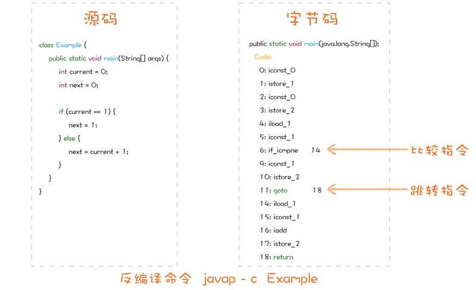
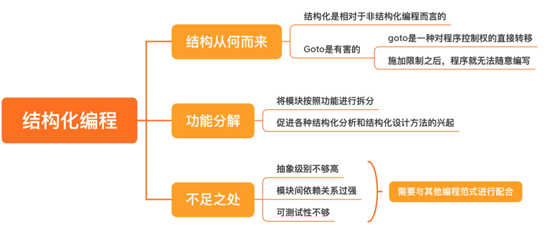

# 0302. 结构化编程：为什么做设计时仅有结构化编程是不够的？

郑晔 2020-06-24

上一讲，我们讲到了编程范式，现在开发的一个重要趋势就是多种编程范式的融合，显然，这就要求我们对各种编程范式都有一定的理解。从这一讲开始，我们就展开讨论一下几个主要的编程范式。首先，我们来讨论程序员们最熟悉的编程范式：结构化编程。

很多人学习编程都是从 C 语言起步的，C 语言就是一种典型的结构化编程语言。C 的结构化编程也渗透进了后来的程序设计语言之中，比如，C++、Java、C# 等等。说起结构化编程，你一定会想起那些典型的控制结构，比如：顺序结构、选择结构和循环结构，还会想到函数（如果用术语讲，应该叫 subroutine）和代码块（block）。这几乎是程序员们每天都在使用的东西，对于这些内容，你已经熟悉得不能再熟悉了。

但是，不知道你是否想过这样一个问题？面向对象编程之所以叫面向对象，是因为其中主要的概念是对象，而函数式编程主要的概念是函数。可结构化编程为什么叫结构化呢，难道它的主要概念是结构？这好像也不太对。其实，所谓结构化，是相对于非结构化编程而言的。所以，要想真正了解结构化编程，就要回到非结构化的古老年代，看看那时候是怎么写程序的。也就是说，只有了解结构化编程的发展历程，你才能更好地认清结构化编程的不足。没错，正是因为你太熟悉结构化编程了，我反而要说说它的不足，告诉你在今天做设计，仅仅有结构化编程已经不够了。好，我们就先从结构化编程的演化讲起。

## 2.1 结构从何而来

你一定知道，结构化编程中的顺序结构就是代码按照编写的顺序执行，选择结构就是 if/else，而循环结构就是 do/while。这几个关键字一出，是不是就有一股亲切感扑面而来？但是，你有没有想过，这些结构是怎么来的呢？

我们都知道，今天的编程语言都是高级语言，那对应着就应该有低级语言。就今天这个讨论而言，比高级语言低级的就是汇编语言。如果你去了解汇编指令，你会发现，它的编程模式与我们习惯的高级语言的编程模式有着很大的差异。使用汇编写代码，你面对的是各种寄存器和内存地址。那些我们在高级语言中经常面对的变量，需要我们自己想办法解决，而类型，则统统没有。至于前面提及的那些控制结构，除了顺序结构之外，在汇编层面也是不存在的。

连 if/else 和 do/while 都没有，让我怎么写程序啊？别急，在汇编里有个 goto，它可以让代码跳转到另外一个地方继续执行。还有几个比较指令，让你可以比较两个值。

我们先想一下，if 语句做的是什么呢？执行一个表达式，然后，根据这个表达式返回值是真是假，决定执行 if 后面的代码，还是 else 后面的代码。好，如果我们这么写汇编代码，就是先执行一段代码，把执行结果和 0 比较。如果不等于 0 就接着执行，等于 0 就跳转到另外一个地方执行，这不就和 if 语句的执行逻辑是一样的吗？没错，如果你尝试反汇编一段有 if 语句的 C 代码，也会看到类似的汇编代码。如果你是一个 Java 程序员，也可以通过 javap 反汇编一段 Java 类，也可以看到类似的字节码，因为字节码在 Java 里就相当于汇编。

有了对 if 语句的理解，再来理解 do/while 就容易了，就是在判断之后，是决定跳到另外一个地方，还是继续执行下面的代码。如果执行下面的代码，执行到后面就会有一个 goto 让我们跳回来，再作一次判断。了解这些，再加上汇编语言本身的顺序执行，你最熟悉的控制结构就都回来了。所以，即便是用汇编，你依然可以放心地以原来的方式写代码了。

对于已经有了编程基础的你而言，理解这些内容并不难。但你有没有想过，以前的程序员真的就是用这样的控制结构写程序的吗？并不是。原来的程序员面对的的确是这些汇编指令，但是他们是站在直接使用指令的角度去思考。所以，他们更习惯按照自己的逻辑去写，这其中最方便的写法当然就是需要用到哪块逻辑，就 goto 到哪里执行一段代码，然后，再 goto 到另外一个地方。

这种写起来自由自在的方式，在维护起来却会遇到极大的挑战，因为你很难预测代码的执行结果。有人可能只是图个方便，就 goto 到一个地方继续执行。可只要代码规模稍微一大，就几乎难以维护了，这便是非结构化的编程方式。

## 2.2 Goto 是有害的

于是，有人站了出来，提出编程要有结构，不能这么肆无忌惮，结构化编程的概念应运而生。这其中有个重要人物，你一定听说过，叫迪杰斯特拉（Dijkstra），他是 1972 年的图灵奖的获得者。学习算法的时候，你肯定学过以他名字命名的最短路算法；学习操作系统时，你肯定学过 PV 原语，PV 原语这个名字之所以看起来有些奇怪，主要因为 Dijkstra 是荷兰人。

1968 年，他在 ACM 通讯上发表了一篇文章，题目叫做《Goto 是有害的》（Go To Statement Considered Harmful），这篇文章引起了轩然大波。不是所有人都会接受这种新想法，那些习惯了自由放纵的程序员对 Dijkstra 进行了无情的冷嘲热讽。他们认为，按照结构化的方法写效率太低。今天的你可能很难想象，C 语言初问世之际，遭到最大的质疑是效率低。对，你没听错，C 语言被质疑效率低，和 Java 面世之初遇到的挑战如出一辙。提出这种质疑的人只看到了新生事物初生时的不足，却忽略了它们强大的可能性。他们不知道，一旦构建起新的模型，底层实现是可以不断优化的。

更重要的是，有了新的更高级却也更简单的模型，入门门槛就大幅度降低了，更多的人就可以加入进来，进一步促进这门语言的发展。程序员数量的增多，就可以证明这一点。现在的很多程序员其实对底层知识的了解并不多，但丝毫不妨碍他们完成基本的业务功能。只要使用的人足够多，人们就会有更强的驱动力去优化底层实现。时至今日，已经很少有人敢说自己手写的汇编性能一定优于编译器优化后的结果。最终这场争论逐渐平息，新的结构逐渐普及，也证明了 Dijkstra 是对的。goto 语句的重要性逐渐降低，一些现代程序设计语言干脆在设计上就把 goto 语句拿掉了。

## 2.3 功能分解

你可能没有想过，这种结构化编程的思想最初是为了证明程序正确性而诞生的。Dijkstra 很早就得出一个结论：编程是一项难度很大的活动。因为一个程序会包含非常多的细节，远超一个人的认知能力范围，任何一个细微的错误都会导致整个程序出现问题。

所以，他提出 goto 语句是有害的，还有一个重要的原因是，Dijkstra 为了证明程序的正确性，在借助数学推导的方法，将大问题拆分成小问题，逐步递归下去，拆分成更小的、可证明的单元时，他发现 goto 语句的存在影响了问题的递归拆分，导致问题无法被拆分。

你也许看出来了，我要说的就是结构化编程另一个重要的方面：功能分解。功能分解就是将模块按照功能进行拆分。这样一来，一个大问题就会被拆解成一系列高级函数的组合，而这些高级函数各自再进一步拆分，拆分成一系列的低一级的函数，如此一步步拆分下去，每一个函数都需要按照结构化编程的方式进行开发。这一思想符合人们解决问题的直觉，对软件开发产生了深远的印象。

以此为基础，后来出现各种结构化分析和结构化设计的方法。将大型系统拆分成模块和组件，这些模块和组件再做进一步的拆分，这些都是来自结构化编程的设计思想。在今天看来，这一切简直再正常不过了，几乎融入了每个程序员的日常话语体系之中。好，说完了结构化编程的发展历程，我们自然也就能看出它的不足之处了。

虽然，结构化编程是比汇编更高层次的抽象，程序员们有了更强大的工具，但人们从来不会就此满足，随之而来的是，程序规模越来越大。这时，结构化编程就显得力不从心了。用一个设计上的说法形容结构编程就是「抽象级别不够高」。

这就好比你拿着一个显微镜去观察，如果你观察的目标是细菌，它能够很好地完成工作，但如果用它观察一个人，你恐怕就很难去掌握全貌了。结构化编程是为了封装低层的指令而生的，而随着程序规模的膨胀，它组织程序的方式就显得很僵硬，因为它是自上而下进行分解的。

一旦需求变动，经常是牵一发而动全身，关联的模块由于依赖关系的存在都需要变动，无法有效隔离变化。显然，如何有效地组织这么大规模的程序并不是它的强项，所以，结构化编程注定要成为其它编程范式的基石。如果站在今天的角度看，结构化编程还存在一个问题，就是可测试性不够，道理和上面是一样的，它的依赖关系太强，很难拆出来单独测试一个模块。所以，仅仅会结构化编程，并不足以让我们做出好的设计，必须把它与其他编程范式结合起来，才能应对已经日益膨胀的软件规模。

## 总结时刻

今天我们讲了程序员们最熟悉的编程范式：结构化编程。其实，从编程范式的角度，大概每个程序员都能够比较熟练地使用结构化编程提供给我们的编程元素。今天这一讲，我主要带着你回顾了一下结构化编程的由来，让你知道即便是我们已经非常熟悉的一些控制结构，也是前人经过不断努力得来的。除了知道结构化编程给我们提供了什么，我们还要看到它限制了什么，也就是 goto 语句。goto 语句实际上就是一种对程序控制权的直接转移，它可以让程序跑到任何地方去执行。而对它施加限制之后，程序就不再是随意编写的了。结构化编程带来的另一个重要方面是功能分解，也就是将大问题拆分成可以解决的小问题，这一思想影响深远，是我们做设计的根基所在。我还给你讲了结构化编程的不足，主要就是在结构化编程中，各模块的依赖关系太强，不能有效地将变化隔离开来。所以，它还需要与其他的编程范式进行配合。下一讲，我们就来讲讲现在最主流的组织程序的方式：面向对象编程。如果今天的内容你只能记住一件事，那请记住：结构化编程不能有效地隔离变化，需要与其他编程范式配合使用。

## 思考题

Dijkstra 在结构化编程这件事上的思考远远大于我们今天看到的样子。你是否也有这样的经历，你在学习哪门技术时，了解到其背后思想之后，让你觉得受到了很大的震撼。

### 01

1、结构化编程 / 过程式编程，感觉栏主漏了一个很重要的点，贫血模型。结构化编程里面有结构体（自定义的类型）的概念，站 java 角度看，这其实这就是一个「类」，但这个类只承接属性却不会有行为。也就是说过程式编程里面，行为和数据是完全分离的（我不认为这是坏处，毕竟这样代码实现和阅读都相对简单）。并且结合对过程的抽象（这里应该算得上函数了）, 可以定义各种复杂的指令，以便达到复用和隔离复杂性的效果。（这些特性也是导致大部分开发都面向过程编程的主要原因）

2、既然结构化编程能做到复用和隔离复杂性，那么还要面向对象干嘛？或者说面向对象相较于结构化编程优秀在哪里？我认为至少有两点优秀的地方，1）易用。2）更好的复杂性隔离。易用，某种带有数据结构的「类」，其具备哪些行为一目了然 （打点可见）。而不像过程式编程，数据与过程的关系是松散的（java 开发可以理解为所有代码都以静态方法 + 贫血模型实现）; 更好的复杂性隔离，这主要依托于面向对象的一个特性，封装。面向对象不主张绕过对象的使用接口侵入到对象的内部实现细节，如此一来对象内部的变动与所有使用方就隔离了，换句话说，只有在对象内部才能变更对象的属性，变更点全部收敛。（封装其实是一种约束，让代码没办法那么灵活。但这个约束对于代码的可读和可维护却有着深远的价值）

3、学习 ddd 让我受到了很大的震撼。起初，我看了一遍领域驱动设计实战那本号称比较好理解的「红皮佳作」。然并软，看了一遍基本不理解各中缘由，也就拿着专业名称跟别人瞎应付几句，表示自己也学过。但后来，深入去学习设计原则与设计模式，面向对象思想，并做了大量的重构（期间经常会翻到「红皮佳作」的某些章节思考）。对于 ddd 为啥这么做有了自己的见解。1）为什么依赖倒置，基础层要在最上层。因为这样做技术相关代码可以从应用层和领域层抽离，保证应用层和领域层业务代码的干净（技术组件可以单独升级）。2）为什么要封装充血模型？为了更好的复用以及隔离复杂性。3）为什么要分应用层和领域层？将基础的领域服务代码和上层的应用服务代码隔离，将不同的领域服务代码相隔离，将不同的应用服务代码相隔离。做到，虽然将多个模型（基础模型和应用模型）写在一个包里，但以目录和编程规范的方式将之间的代码隔离，为后续业务拓展后的调整铺平道路。（也包含去重的理念）4）为什么要制定规范，为什么要抽象系统模型图？为了降低认知差异（同规范下，相互间代码可读性自然会更好），提高共识度（没办法产品技术一体两面，就在业务逻辑和代码实现间再架设一层中间语言，方便两者沟通。是不是有点 IR「高级语言与机器语言的中间表达式」的味道）。等等。。。作者回复：我还真的不把贫血模型的讨论放在结构化编程里，它更多的属于 OO 部分。你的 DDD 理解很有道理，但有一些内容其实属于 OO，比如依赖倒置，后面会讲到。2020-06-24

### 02

看了一下 Edgar Dijkstra 的那篇 Go To Statement Considered Harmful，其中说到，go to statements should be abolished from all「higer level」programming languages. 论文里面提到两个 remark，一个是说一旦程序被编写完成，那么程序的控制权就交给了机器；第二个是说，程序员（人）对于静态关系掌控和动态过程视觉化都有一定的局限，所以要尽量减少静态程序代码和动态过程的「认知鸿沟」。专栏里面提到了「非结构化编程」，结合 Dijkstra 的论文，感觉使用 go to 语句的非结构化编程更像是一种「线性编程」，在一个很长的代码文件上给出了几个索引（标签），然后使用 go to 语句来跳转。如果不怕重复，把所有的 go to 都展开，那么应该就是更长的一段代码。

而使用了 if/else、do/while 的结构化编程，感觉是把一条线变成了一棵树，从一维坐标到二维坐标（？）。从认知的角度，更有利于程序员去开发程序 —— 其实也就是前面 Dijkstra 说的，程序的复杂度超出了程序员的控制，所以需要结构化编程来降低认知的难度。1969 年阿波罗 11 号登月的时候，使用的编程语言应该是汇编吧，即没有结构化也没有面向对象。后来看到了左耳朵耗子在酷壳上的一片文章《50 年前的登月程序和程序员有多硬核》，确实 hardcore。最早学的也是 C 语言，然后学到面向对象的时候（C#）的时候，看到那些小猫小狗、继承多态的例子，感觉也很震撼，后来才发现在实际的工作中，面向对象的分析并不简单，面向对象的落地也不容易。作者回复：理解是一个难度，设计是一个难度，所以，Dijkstra 能拿到图灵奖。2020-06-24

### 03

刚开始接触函数式编程时，就被它背后的数学理论所震到，之前一直把计算机看成是工程学。后来看到它的不变性天生适合并发时，又深深体会到它的美感。作者回复：震撼的感觉是非常爽的，让人找到了新的前进方向。2020-06-24

### 04

在学习机器学习和深度学习编程的过程中，被其背后的数学思想所震撼，这是第一次觉得数学离编程这么近且不可或缺。作者回复：机器学习和深度学习，终于让数学走近了程序员。2020-06-29

### 05

汇编的 goto 特性使得编程不可控，不受约束，为了约束编程行为，结构式编程应运而生，其自上而下的编程方法使得程序易于编写和理解，但由于自上而下，每行代码紧密相连，下层代码的运行依赖于上层代码，耦合度太高，约束性太强，一旦代码变动，所有相关连的代码可能都得变动，灵活度太低，于是面向对象编程横空出世，就拿 java 来说，其强大的语言特性使得代码灵活性大大提高，与汇编的 goto 特性相比，java 的 if else ，for 循环等对程序的行为起到了约束作用，这些结构类代码将原本不受约束的代码行为控制在了结构代码内，它的各种访问修饰符所带来的封装特性对代码的行为也起到了约束作用，同时也一定程度提高了代码的安全性。继承特性的出现使得重复使用的代码变得可复用，减少了大量冗余代码，还能在继承之外添加自己的功能行为，多态的出现在继承的基础上进一步加强了这一行为，使代码的灵活性更高。为了进一步增强代码的灵活性，反射机制出现了，与结构化编程的按步骤执行不同，它能在代码的运行阶段操控代码，可以说，面向对象的编程范式通过对象模型的映射，配合其特性，极大地提高了代码的灵活性，减少了大量冗余的代码。不知道以上理解对不对？作者回复：大部分理解是对的，但是，继承，我们很快就会说到，到时候，你再来看。2020-06-24

### 06

flutter 一切皆 widget 的思考，远大于我们能看见的表面。作者回复：很好的分享！2020-06-24

### 07

相信很多人一开始学习 c 编程语言入门的，这时教材上会告诉这是结构化编程编程语言。学习了体系结构和汇编相关知识之后，会发现底层语言是非结构化的，这给编码效率带来不便，于是出现结构化编程，也出现了更高层次的分层与封装。结构化编程符合人类的思维。当我们开发系统时，分解各个小系统，小系统分解成模块，模块分解为组件，组件分解类，类分解为功能函数。一步一步下来，完成整体的功能拆分。当然结构化编程不是银弹，它也有缺点，比如高层依赖底层模块强，不容易测试等，这些需要其它编程范式一起解决。作者回复：结构化何止不是银弹，现在作为普通的工具，能力都是不够的。简言之，现在打仗不能只靠弓箭和马匹了，而结构化编程大概就是这么个级别的东西，冷兵器时代的产物。2020-06-24
