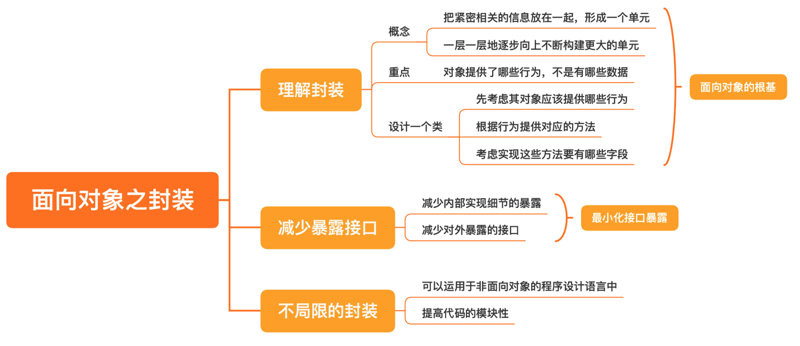

# 0303. 面向对象之封装：怎样的封装才算是高内聚？

郑晔 2020-06-26

上一讲，我讲了你最熟悉的编程范式：结构化编程。结构化编程有效地解决了过去的很多问题，它让程序员们解决问题的规模得以扩大。随着程序规模的逐渐膨胀，结构化编程在解决问题上的局限也越发凸显出来。因为在它提供的解决方案中，各模块的依赖关系太强，不能有效地将变化隔离开来。这时候，面向对象编程登上了大舞台，它为我们提供了更好的组织程序的方式。

在一些从结构化编程起步的程序员的视角里，面向对象就是数据加函数。虽然这种理解不算完全错误，但理解的程度远远不够。结构化编程的思考方式类似于用显微镜看世界，这种思考方式会让人只能看到局部。而想要用好面向对象编程，则需要我们有一个更宏观的视角。谈到面向对象，你可能会想到面向对象的三个特点：封装、继承和多态。在接下来的三讲，我们就分别谈谈面向对象的这三个特点。

也许你会觉得，学面向对象程序设计语言的时候，这些内容都学过，没什么好讲的。但从我接触过的很多程序员写程序的风格来看，大多数人还真的不太理解这三个特点。还记得我们在第 12 讲中提到的那个故事吗？小李之所以被老赵批评，主要就是因为他虽然用了面向对象的语言，代码里却没有体现出面向对象程序的特点，没有封装，更遑论继承和多态。嘴上说得明明白白，代码写得稀里糊涂，这就是大多数人学习面向对象之后的真实情况。所以，虽然看上去很简单，但还是有必要聊聊这些特点。

## 3.1 理解封装

我们知道，面向对象是解决更大规模应用开发的一种尝试，它提升了程序员管理程序的尺度。封装，则是面向对象的根基。它把紧密相关的信息放在一起，形成一个单元。如果这个单元是稳定的，我们就可以把这个单元和其他单元继续组合，构成更大的单元。然后，我们再用这个组合出来的新单元继续构建更大的单元。由此，一层一层地逐步向上。

为了让你更好地理解这个过程，我们先回到面向对象的最初。「面向对象」这个词是由 Alan Kay 创造的，他是 2003 年图灵奖的获得者。在他最初的构想中，对象就是一个细胞。当细胞一点一点组织起来，就可以组成身体的各个器官，再一点一点组织起来，就构成了人体。而当你去观察人的时候，就不用再去考虑每个细胞是怎样的。所以，面向对象给了我们一个更宏观的思考方式。但是，这一切的前提是，每个对象都要构建好，也就是封装要做好，这就像每个细胞都有细胞壁将它与外界隔离开来，形成了一个完整的个体。

在 Alan Kay 关于面向对象的描述中，他强调对象之间只能通过消息来通信。如果按今天程序设计语言的通常做法，发消息就是方法调用，对象之间就是靠方法调用来通信的。但这个方法调用并不是简单地把对象内部的数据通过方法暴露。在 Alan Kay 的构想中，他甚至想把数据去掉。

因为，封装的重点在于对象提供了哪些行为，而不是有哪些数据。也就是说，即便我们把对象理解成数据加函数，数据和函数也不是对等的地位。函数是接口，而数据是内部的实现，正如我们一直说的那样，接口是稳定的，实现是易变的。

理解了这一点，我们来看一个很多人都有的日常编程习惯。他们编写一个类的方法是，把这个类有哪些字段写出来，然后，生成一大堆 getter 和 setter，将这些字段的访问暴露出去。这种做法的错误就在于把数据当成了设计的核心，这一堆的 getter 和 setter，就等于把实现细节暴露了出去。

一个正确的做法应该是，我们设计一个类，先要考虑其对象应该提供哪些行为。然后，我们根据这些行为提供对应的方法，最后才是考虑实现这些方法要有哪些字段。请注意，方法的命名，体现的是你的意图，而不是具体怎么做。所以，getXXX 和 setXXX 绝对不是一个好的命名。举个例子，设计一个让用户修改密码的功能，有些人直觉的做法可能是这样：

```java

class User {
  private String username;
  private String password;
  
  ...
  
  // 修改密码
  public void setPassword(final String password) {
    this.password = password;
  }
}
```

但我们鼓励的做法是，把意图表现出来：

```java

class User {
  private String username;
  private String password;
  
  ...
  
  // 修改密码
  public void changePassword(final String password) {
    this.password = password;
  }
}
```

这两段代码相比，只是修改密码的方法名变了，但二者更重要的差异是，一个在说做什么，一个在说怎么做。将意图与实现分离开来，这是一个优秀设计必须要考虑的问题。不过，在真实的项目中，有时确实需要暴露一些数据，所以，等到你确实需要暴露的时候，再去写 getter 也不迟，你一定要问问自己为什么要加 getter。至于 setter，首先，大概率是你用错了名字，应该用一个表示意图的名字；其次，setter 通常意味着修改，这是我们不鼓励的。

我后面讲函数式编程时，会讲到不变性，可变的对象会带来很多的问题，到时候我们再来更具体地讨论。所以，设计中更好的做法是设计不变类。

## 3.2 减少暴露接口

之所以我们需要封装，就是要构建一个内聚的单元。所以，我们要减少这个单元对外的暴露。这句话的第一层含义是减少内部实现细节的暴露，它还有第二层含义，减少对外暴露的接口。

一般面向对象程序设计语言都支持 public、private 这样的修饰符。程序员在日常开发中，经常会很草率地给一个方法加上 public，从而不经意间将一些本来应该是内部实现的部分暴露出去。举个例子，一个服务要停下来的时候，你可能要把一些任务都停下来，代码可能会这样写：

```java
class Service {
  public void shutdownTimerTask() {
    // 停止定时器任务
  }
  
  public void shutdownPollTask() {
    // 停止轮询服务
  }
}
```

别人调用时，可能会这样调用这段代码：

```java
class Application {
  private Service service;
  
  public void onShutdown() {
    service.shutdownTimerTask();
    service.shutdownPollTask();
  }
}
```

突然有一天，你发现，停止轮询任务必须在停止定时器任务之前，你就不得不要求别人改代码。而这一切就是因为我们很草率地给那两个方法加上了 public，让别人有机会看到了这两个方法。从设计的角度来说，我们必须谨慎地问一下，这个方法真的有必要暴露出去吗？就这个例子而言，我们可以仅仅暴露一个方法：

```java
class Service {
  private void shutdownTimerTask() {
    // 停止定时器任务
  }
  
  private void shutdownPollTask() {
    // 停止轮询服务
  }
  
  public void shutdown() {
    this.shutdownTimerTask();
    this.shutdownPollTask();
  }
}
```

我们调用代码也会简单很多：

```java
class Application {
  private Service service;
  
  public void onShutdown() {
    service.shutdown();
  }
}
```

尽可能减少接口暴露，这个原则不仅仅适用于类的设计，同样适用于系统设计。在我的职业生涯中，看到了很多团队非常随意地在系统里面添加接口，一个看似不那么复杂的系统里，随随便便就有成百上千个接口。如果你想改造系统去掉一些接口时，很有可能会造成线上故障，因为你根本不知道哪个团队在什么时候用到了它。所以，在软件设计中，暴露接口需要非常谨慎。关于这一点，你可以有一个统一的原则：最小化接口暴露。也就是，每增加一个接口，你都要找到一个合适的理由。

## 3.3 不局限于面向对象的封装

虽说封装是面向对象的一个重要特征，但是，当理解了封装之后，你同样可以把它运用于非面向对象的程序设计语言中，把代码写得更具模块性。比如，我们知道 C 语言有头文件（.h 文件）和定义文件（.c 文件），在通常的理解中，头文件放的是各种声明：函数声明、结构体等等。很多 C 程序员甚至有一个函数就在头文件里加一个声明。

有了今天对于封装的讲解，再来看 C 语言的头文件，我们可以让它扮演接口的角色，而定义文件就成了实现。根据今天的内容，既然，接口只有相当于 public 接口的函数才可以放到头文件里，那么，在头文件里声明一个函数时，我们首先要问的就是，它需要成为一个公开的函数吗？C 语言没有 public 和 private 这样的修饰符，但我曾在一些 C 的项目上加入了自己的定义：

```c
#define PUBLIC
#define PRIVATE static
```

然后，我们规定头文件里只能放公有接口，而在实现文件中的每个函数前面，加上了 PUBLIC 和 PRIVATE，以示区分。这里将 PRIVATE 定义成了 static，是利用了 C 语言 static 函数只能在一个文件中可见的特性。我们还可以把一个头文件和一个定义文件合在一起，把它们看成一个类，不允许随意在头文件中声明不相关的函数。比如，下面是我在一个头文件里定义了一个点（Point）：

```c
struct Point;
struct Point* makePoint(double x, double y);
double distance(struct Point* x, struct Point* y);
```

你可能注意到了，Point 这个结构体我只给了声明，没有给定义。因为我并不希望给它的用户访问其字段的权限，结构体的具体定义是实现，应该被隐藏起来。对应的定义文件很简单，就不在这里罗列代码了。说到这里，你也许发现了，C 语言的封装做得更加彻底。如果用 Java 或 C++ 定义 Point 类的话，必然会给出具体的字段。从某种程度上来说，Java 和 C++ 的做法削弱了封装性。

讲到这里，你应该已经感受到面向对象和结构化编程在思考问题上的一些差异了。有了封装，对象就成了一个个可以组合的单元，也形成了一个个可以复用的单元。面向对象编程的思考方式就是组合这些单元，完成不同的功能。同结构化编程相比，这种思考问题的方式站在了一个更宏观的视角上。

## 总结时刻



今天我们学习了面向对象编程，它是一种以对象为编程元素的编程范式。面向对象有三个特点：封装、继承和多态。1）封装，是面向对象的根基。面向对象编程就是要设计出一个一个可以组合，可以复用的单元。然后，组合这些单元完成不同的功能。2）封装的重点在于对象提供了哪些行为，而不是有哪些数据。即便我们把对象理解成数据加函数，数据和函数也不是对等的地位。函数是接口，应该是稳定的；数据是实现，是易变的，应该隐藏起来。设计一个类的方法，先要考虑其对象应该提供哪些行为，然后，根据这些行为提供对应的方法，最后才是考虑实现这些方法要有哪些字段。getter 和 setter 是暴露实现细节的，尽可能不提供，尤其是 setter。封装，除了要减少内部实现细节的暴露，还要减少对外接口的暴露。一个原则是最小化接口暴露。有了对封装的理解，即便我们用的是 C 语言这样非面向对象的语言，也可以按照这个思路把程序写得更具模块性。理解了封装，下一讲，我们再来看面向对象另外一个特征：继承。如果今天的内容你只能记住一件事，那请记住：基于行为进行封装，不要暴露实现细节，最小化接口暴露。

## 思考题

最后，我想请你了解一下迪米特法则（Law of Demeter），结合今天的课程，分享一下你对迪米特法则的理解。

### 01

我平时用 java 语言开发，java 语言的特点就是一切皆对象。我自己的理解是，java 中对象的概念跟面向对象中对象的概念是不一样的。前者是语言的特性，后者跟作者说的一样，是一种编程范式。在具体的编码实践中，哪些属于对象，哪些不属于对象，应该是程序员掌控的。比如 DDD 中的领域实体，就是对象，需要仔细设计其行为接口。至于平时说的一些 POJO 的对象，可以看成是数据载体，是可以加 getter、setter 的（没有这些默认的 getter、setter，很多第三方的数据转化都很不方便，比如 json，sql 等）。在使用的时候，不归结为对象就可以了。作者回复：能分清楚面向对象和 Java 语言，这就是一个很好的区分。能分清楚传输数据和业务对象，这就是一个很好的区分。2020-06-28

### 02

针对本章：1）说封装往往会提到复用。但实际编码后，我认为这个提高复用是个假象。因为如果我不封装，将函数和属性分离，函数的实现依赖入参属性。那么站在调用方角度。是使用领域实体打点空参数方法，还是从实体中拿取属性调一个有参数的接口。在复用这件事上，效果是一样的。2）封装是为了屏蔽实现，属性是实现的一部分。调用方只需要知道自己要做什么。不需要关心实体内部有多少属性，以及属性间的交互。（降低调用方的复杂度，也是松耦合和 lod 的体现）。3）封装可能会导致类的肿大，在接口隔离上会有矛盾。有时我们需要为实体定义多个接口，不同的调用方调用不同的接口，以实现接口隔离。（至于类内部代码行数过多的问题，我没有什么更好的方法，因为复杂性需要收敛在内部。也只能是加一些分隔线或则构建内部类，尽量去为它分割代码）

课后题：1）lod 是一个通用的概念，既可以放在类与类，也可以放在模块和系统。2）lod 是面向关系的，首先，面向外部要尽量减少一级关联的建立。其次，只与一级关联发生关系。比如，放在代码层面。首先要尽量减少一个类中一级关联的类的数量（实例中属性上注入的其他实例，本地方法中创建的实例，这些都算一级关联。而比如注入的实例打点返回一个新的实例，这就是二级关联）。其次只使用注入的实体，创建的实体和自己本身的方法。（说白点就是不要 chain，链试调用，链中节点返回的实体都不一样时）3）lod 是不稳定的。随着软件的发展，关系是不停在变化的，所以要坚守 lod，代码实现，模块划分，系统组合都需要随着变动。（相对来说，接口隔离和单一职责就比较稳定，因为关注的都是自身）2020-06-26

### 03

经常听说一句话，程序设计应该关注数据结构，设计好了数据结构，工作就完成了一半。今天的封装更偏向能力（方法），内部数据甚至可以去掉。不知道这两个原则是否冲突呢？作者回复：不矛盾，模型和实现的差别。模型关心能力，实现关心怎么做。如果还不会做，先弄明白怎么做，模型考虑的是如何组织这些元素。2020-06-26

### 04

首先，Demeter 不是一个人，而是一个项目，项目主页 http://www.ccs.neu.edu/research/demeter/。最早提到迪米特法则的论文出版于 1989 年，Assuring good style for object-oriented programs。还有一本书，1996 年出版，Adaptive Object-Oriented Software: The Demeter Method with Propagation Patterns。没有看过。Demeter 是希腊神话中的大地和丰收女神，也叫做德墨忒尔。迪米特法则简单的说，分为两个部分：不该有直接依赖关系的类之间，不要有依赖；有依赖关系的类之间，尽量只依赖必要的接口。其实如果用另一个名字「最小知识原则」可能更容易理解一些，这个也算是程序员的「黑话」吧。虽然接触面向对象编程已经很久了，也知道封装、继承和多态，不过写程序的时候，似乎还是习惯「一个对象一张表」的方式，也没有太多的考虑过封装的问题。整个类里面都是 getter、setter 的事情也做过，有点像是用「面向对象的语言写面向过程的代码」。软件设计的大部分原则都耳熟能详，但是如何在写代码的时候「落地」，就不是特别清楚了，缺练。作者回复：关于迪米特法则的回答，很赞！2020-06-28

### 05

面向对象的基本原则第一个就是封装。日常开发中最常用到的封装莫过于函数了，一个函数实现一个最小的功能单元，然后将各个函数与属性组织起来，就成了类。一个类又可视为最小的模块。如何更好暴露接口是编码实践中的技能，时刻要思考着这个接口是否需要暴露以及最小化暴露的接口。最近我也在思考项目需要重构模块，我发现重构是一种软件进化，在杂乱的代码中理清逻辑，重新组织结构。2020-06-26

### 06

后续的文章能不能说下取方法名 / 变量的技巧。作者回复: 《代码整洁之道》（Clean Code）第二章讲的都是命名的技巧，你可以去看一下。2020-06-26

### 07

好奇老师怎么看待 Lombok，所有字段生成 getter/setter 不是一个好的实践，Java Bean 的概念是不是也不该被提倡？作者回复: Lombok 很好，可以少写很多代码，但必须限制它的使用，像 Data 和 Setter 都是不应该用的。Java Bean 本来也不是应该用在所有情况下的技术，太多误用了。2020-06-28

### 08

前段时间修改一个模块，我试图将第三方接口进行 wrap 后产生了新接口以 private 封装该模块内中。在提交给 AR 做 code review 时，他建议去掉从类中去掉新接口，理由也很简单，不属于这个类的行为，给出建议以静态局部函数放在 CPP 里使用。想来 AR 给建议还是很中肯的，类对外的行为要尽可能清晰不变；另外，在后续重构中，这些静态局部函数也可以考虑划分到合适的类中，且进行封装。2020-06-26

### 10

我对于老师举的 shutdown 的例子有一个问题，如果按照我的想法，我会把两个 shutdown 方法都暴露出去，caller 自己去组合，所以除非方法的实现需要变更，否则 callee 是不需要去更改的，但是老师说的是把两个方法封装一下，再暴露出一个封装好的方法，那么就好像老师说的，如果这两个方法需要改变顺序，caller 就要改，这怎么理解？作者回复：注意，这里的关键在于，原来的那两个方法变成了私有的。只对外暴露了一个方法，就是 shutdown。2020-06-26

### 11

"I made up the term "object-oriented," and I can tell you I did not have C++ in mind." --Alan Kay

"Java and C++ make you think that the new ideas are like the old ones. Java is the most distressing thing to hit computing since MS-DOS." --Alan Kay

