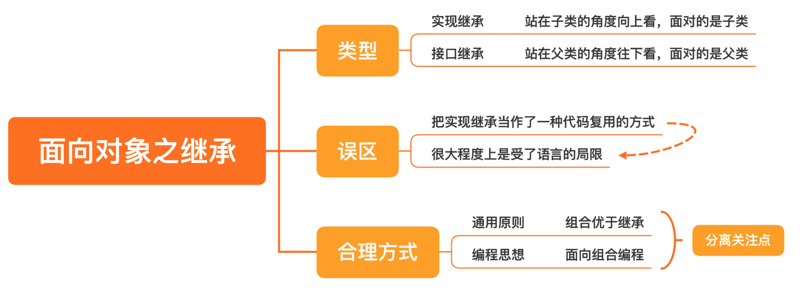

# 0304. 面向对象之继承：继承是代码复用的合理方式吗？

郑晔 2020-06-29

上一讲，我们讨论了面向对象的第一个特点：封装。这一讲，我们继续来看面向对象的第二个特点：继承。

首先，你对继承的第一印象是什么呢？说到继承，很多讲面向对象的教材一般会这么讲，给你画一棵树，父类是根节点，而子类是叶子节点，显然，一个父类可以有许多个子类。

父类是干什么用的呢？就是把一些公共代码放进去，之后在实现其他子类时，可以少写一些代码。讲程序库的时候，我们说过，设计的职责之一就是消除重复，代码复用。所以，在很多人的印象中，继承就是一种代码复用的方式。如果我们把继承理解成一种代码复用方式，更多地是站在子类的角度向上看。在客户端代码使用的时候，面对的是子类，这种继承叫实现继承：

```java
Child object = new Child();
```

其实，还有一种看待继承的角度，就是从父类的角度往下看，客户端使用的时候，面对的是父类，这种继承叫接口继承：

```java
Parent object = new Child();
```

不过，接口继承更多是与多态相关，我们暂且放一放，留到下一讲再来讨论。这一讲，我们还是主要来说说实现继承。其实，实现继承并不是一种好的做法。也就是说，把实现继承当作一种代码复用的方式，并不是一种值得鼓励的做法。一方面，继承是很宝贵的，尤其是 Java 这种单继承的程序设计语言。每个类只能有一个父类，一旦继承的位置被实现继承占据了，再想做接口继承就很难了。另一方面，实现继承通常也是一种受程序设计语言局限的思维方式，有很多程序设计语言，即使不使用继承，也有自己的代码复用方式。可能这么说你还不太理解，接下来，我就用一个例子来帮你更好地理解继承。

## 4.1 代码复用

假设，我要做一个产品报表服务，其中有个服务是要查询产品信息，这个查询过程是通用的，别的服务也可以用，所以，我把它放到父类里面。这就是代码复用的做法，代码用 Java 写出来是这样的：

```java
class BaseService {
  // 获取相应的产品信息
  protected List<Product> getProducts(List<String> product) {
    ...
  }
}

// 生成报表服务
class ReportService extends BaseService {
  public void report() {
    List<Product> product = getProduct(...);
    // 生成报表
    ...
  }
}
```

如果采用 Ruby 的 mixin 机制，我们还可以这样实现，先定义一个模块（module）：

```ruby
module ProductFetcher
  # 获取相应的产品信息
  def getProducts(products)
    ...
  end 
end
```

然后，在自己的类定义中，将它包含（include）进来：

```ruby
# 生成报表服务
class ReportService
  include ProductFetcher
  
  def report
    products = getProducts(...)
    # 生成报表
    ..
  end
end
```

在这个例子中，ReportService 并没有继承任何类，获取产品信息的代码也是可以复用的，也就是这里的 ProductFetcher 这个模块。这样一来，如果我需要有一个获取产品信息的地方，它不必非得是一个什么服务，无需继承任何类。这是 Ruby 的做法，类似的语言特性还有 Scala 里的 trait。在 C++ 中，虽然语法并没有严格地区分实现继承，但《Effective C++》这本行业的名著，给出了一个实用的建议：实现继承采用私有继承的方式实现：

```c
class ReportService: private ProductFetcher {
  ...
}
```

请注意，在这个实现里，我的私有继承类名是 ProductFetcher。是的，它并不需要和这个报表服务有什么直接的关系，使用私有继承，就是为了复用它的代码。从前面的分析中，我们也不难看出，获取产品信息和生成报表其实是两件事，只是因为在生成报表的过程中，需要获取产品信息，所以，它有了一个基类。其实，在 Java 里面，我们不用继承的方式也能实现，也许你已经想到了，代码可以写成这样：

```java
class ProductFetcher {
  // 获取相应的产品信息
  public List<Product> getProducts(List<String> product) {
    ...
  }
}

// 生成报表服务
class ReportService {
  private ProductFetcher fetcher;
  
  public void report() {
    List<Product> product = fetcher.getProducts(...);
    // 生成报表
    ...
  }
}
```

这种实现方案叫作组合，也就是说 ReportService 里组合进一个 ProductFetcher。在设计上，有一个通用的原则叫做：组合优于继承。也就是说，如果一个方案既能用组合实现，也能用继承实现，那就选择用组合实现。好，到这里你已经清楚了，代码复用并不是使用继承的好场景。所以，要写继承的代码时，先问自己，这是接口继承，还是实现继承？如果是实现继承，那是不是可以写成组合？

## 4.2 面向组合编程

之所以可以用组合的方式实现，本质的原因是，获取产品信息和生成报表服务本来就是两件事。还记得我们在第 3 讲里讲过的「分离关注点」吗？如果你能看出它们是两件事，就不会把它们放到一起了。我还讲过，分解是设计的第一步，而且分解的粒度越小越好。当你可以分解出来多个关注点，每一个关注点就应该是一个独立的模块。最终的类是由这些一个一个的小模块组合而成，这种编程的方式就是面向组合编程。它相当于换了一个视角：类是由多个小模块组合而成。

还以前面的报表服务为例，如果使用 Java，按照面向组合的思路写出来，大概是下面这样的。其中，为了增加复杂度，我增加了一个报表生成器（ReportGenerator），在获取产品信息之后，还要生成报表：

```java
class ReportService {
  private ProductFetcher fetcher;
  private ReportGenerator generator;
  
  public void report() {
    List<Product> product = fetcher.getProducts(...);
    // 生成报表
    generator.generate(product);
  }
}
```

请注意，我在前面的表述中，故意用了模块这个词，而不是类。因为 ProductFetcher 和 ReportGenerator 只是因为我们用的是 Java，才写成了类；如果用 Ruby，它们的表现形式就会是一个 module；而在 Scala 里，就会成为一个 trait。我们再用 Ruby 示意一下：

```ruby
class ReportService
  include ProductFetcher
  include ReportGenerator
  
  def report
    products = getProducts(...)
    # 生成报表
    generateReport(products)
  end
end
```

而使用 C++ 的话，表现形式则会是私有继承：

```cpp
class ReportService: private ProductFetcher, private ReportGenerator {
  ... 
}
```

C++ 本身支持宏定义，所以，我们可以自定义一些宏，将这些不同的概念区分开来：

```cpp
#define MODULE(module) class module
#define INCLUDE(module) private module
```

上面的类定义就可以变成更有表达性的写法：

```cpp
MODULE(ProductFetcher) {
  ...
}

MODULE(ReportGenerator) {
  ...
}

class ReportService: 
  INCLUDE(ProductFetcher), 
  INCLUDE(ReportGenerator) {
  ...
}
```

我有一个 C++ 的高手朋友，把这种做法称之为「小类大对象」，这里面的小类就是一个一个的模块，而最终的大对象是最终组合出来的类生成的对象。

2-3『[小类，大对象 - 简书](https://www.jianshu.com/p/a830d2261392)，这篇文章好好消化。』

关于面向对象，有一点我们还没有说，就是面向对象面向的是「对象」，不是类。很多程序员习惯把对象理解成类的附属品，但在 Alan Kay 的理解中，对象本身就是一个独立的个体。所以，有些程序设计语言可以直接支持在对象上进行操作。

3『上面的观点与 JS 中，基于原型的面向对象串起来了。』

还是前面的例子，我想给报表服务增加一个接口，对产品信息做一下处理。用 Ruby 写出来会是这样：

```ruby
module ProductEnhancer
  def enhance
    # 处理一下产品信息
  end
end

service = ReportService.new
# 增加了 ProductEnhancer
service.extend(ProductEnhancer)

# 可以调用 enhance 方法
service.enhance
```

这样的处理只会影响这里的一个对象，而同样是这个 ReportService 的其他实例，则完全不受影响。这样做的好处是，我们不必写那么多类，而是根据需要在程序运行时组合出不同的对象。

在这里，相信你再一次意识到了要学习多种程序设计语言的重要性。Java 只有类这种组织方式，所以，很多有差异的概念只能用类这一个概念表示出来，思维就会受到限制，而不同的语言则提供了不同的表现形式，让概念更加清晰。

前面只是讲了面向组合编程在思考方式的转变，下面我们再来看设计上的差异。举个例子，我们有个字体类（Font），现在的需求是，字体能够加粗（Bold）、能够有下划线（Underline）、还要支持斜体（Italic），而且这些能力之间是任意组合的。

如果采用继承的方式，那就要有 8 个类（原文里有张列表）。而采用组合的方式，我们的字体类（Font）只要有三个独立的维度，也就是是否加粗（Bold）、是否有下划线（Underline）、是否是斜体（Italic）。这还不是终局，如果再来一种其他的要求，由 3 种要求变成 4 种，采用继承的方式，类的数量就会膨胀到 16 个类，而组合的方式只需要再增加一个维度就好。我们把一个 M*N 的问题，通过设计转变成了 M+N 的问题，复杂度的差别一望便知。

虽然我们一直在说，Java 在面向组合编程方面能力比较弱，但 Java 社区也在尝试不同的方式。早期的尝试有 Qi4j，后来 Java 8 加入了 default method，在一定程度上也可以支持面向组合的编程。这里我们只是讲了面向对象社区在组合方面的探索，后面讲函数式编程时，还会讲到函数式编程在这方面的探索。

## 总结时刻



今天我们学习了面向对象的第二个特点：继承。继承分为两种，实现继承和接口继承。实现继承是站在子类的视角看问题，接口继承则是站在父类的视角。很多程序员把实现继承当作了一种代码复用的方式，但实际上，实现继承并不是一个好的代码复用的方式，之所以这种方式很常见，很大程度上是受了语言的局限。Ruby 的 mixin 机制，Scala 提供的 trait 以及 C++ 提供的私有继承都是代码复用的方式。即便只使用 Java，也可以通过组合而非继承的方式进行代码复用。

今天我们还讲到这些复用方式背后的编程思想：面向组合编程。它给我们提供了一个不同的视角，但支撑面向组合编程的是分离关注点。将不同的关注点分离出来，每一个关注点成为一个模块，在需要的时候组装起来。面向组合编程，在设计本身上有很多优秀的地方，可以降低程序的复杂度，更是思维上的转变。

现在你已经知道了，在继承树上从下往上看，并不是一个好的思考方式，那从上往下看呢？下一讲，我们就来讲讲继承的另外一个方向，接口继承，也就是面向对象的第三个特点：多态。如果今天的内容你只能记住一件事，那请记住：组合优于继承。

## 思考题

最后，我想请你去了解一下一种叫 DCI （Data，Context 和 Interaction）的编程思想，结合今天的课程，分享一下你对 DCI 的理解。

### 01

回答：1）DCI 和小类大对象的理念，在实现手法上很像。2）先说看好的点，DCI 模式在单一职责上能做到更好（ddd 的充血模型很容易肿成上帝对象）。一个 data 在不同的 context 具有不同的 interface 方法，这样的划分，在隔离变化（调用方依赖抽象接口实现功能）和复杂性隔离（只关心当前 context 需要关心的行为）都又不错的效果。3）再说不看好的，DCI 的数据和行为分离不敢苟同。是先有行为再有数据还是先有数据再有行为，这是一个问题。但可以确定的是，行为和数据的关联是密切的，以至于傻傻分不清楚。所以我还是偏向于，抽象模型时，行为和数据应该是一个整体。4）总结，DCI 还是扩展了我的认知。DDD 在封装充血模型时有一个很蛋疼的点，为了复用部分属性和行为，而为充血模型加入了新的属性和行为。多次迭代后，充血模型就很容易肿大，边界模糊（涵盖的面广了也就模糊了）。而 DCI 和小类大对象的思考方式很好的做了补充。大致都是在特定的 context 里，用不同的小类组成特定的领域对象，既能做到复用也能隔离复杂性。5）C++ 有多继承的方式来实现这种组合模式。但 java 语法特性上就不支持。那么无论是小类大对象还是 DCI 都无法用合适的代码结构来描述（我认为，哪怕用回调函数 + 接口实现的写法，也不能很好描述这个语义）。栏主觉得 java 该怎么办？2020-06-29

### 02

所谓组合就是类的引用吧，面向对象编程时，如果不是继承关系，那大概率就是引用类来实现功能的组合吧。作者回复：Java 的类引用可以表达很多概念，属性和组合都是通过同样的概念表示出来的。好处就是简单，坏处就不清楚。2020-06-29

### 03

老师，我有个概念上的疑惑，分离的关注点是一个个独立的模块，然后由一个个小模块组合出类，这个类就指的是「大对象」吗？上面的一个个小模块，其实也是类，只不过是小类，对于 C++ 就是 class 的实现手法，Ruby 可以是 module 的实现手法，是这样的吗？DCI 关注的是数据在 context 中的交互行为，我的理解大概就是数据在不同的 context，扮演不同的角色，这些角色的属性，是数据内组合上下文需要的特性实现的。作者回复：你的理解是对的，因为在 Java/C++ 这类语言中只有类这一个概念，所以，我们不得不用类表示所有的东西，之所以，要讲不同语言的做法，就是希望大家知道，自己写代码时，这个「类」扮演了什么角色。2020-06-30

### 04

组合优于继承，可以使用继承的地方几乎都可以用组合替换的，那是不是说继承这个特性在现代编程语言中没有什么作用了（接口继承实力上就是多态）。作者回复：先看看现代程序设计语言的设计，比如，Go 和 Rust。2020-07-04

### 05

继承是面向对象的基本原则之一，但在编码实践中能用组合来实现尽量使用组合。DCI 也是一种编码规范，它是对面向对象编程的一种补充，其实核心思想也是关注点分离。作者回复：很好的理解！2020-06-29

### 06

```ruby
MODULE(ProductFetcher) {
  ...
}

MODULE(ReportGenerator) {
  ...
}

class ReportService:
  INCLUDE(ProductFetcher),
  INCLUDE(ReportGenerator) {
  ...
}
```

这段代码，为什么不用组合呢？作者回复：你说的字段的组合方式吧，可以用。但如果有更有语义的表示方式，选择更好的表示方式是一个更好的选择。2020-06-29