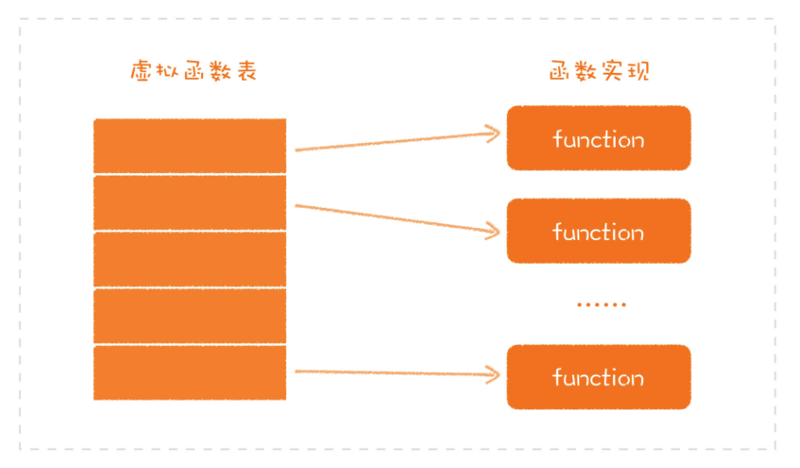
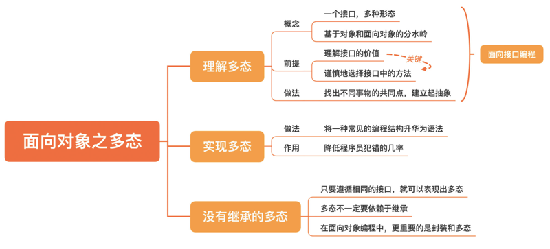

# 0305. 面向对象之多态：为什么「稀疏平常」的多态，是软件设计的大杀器？

郑晔 2020-07-01

前面两讲，我们讲了面向对象的两个特点：封装和继承，但真正让面向对象华丽蜕变的是它的第三个特点：多态。有一次，我在一个 C++ 的开发团队里做了一个小调查。问题很简单：你用过 virtual 吗？下面坐着几十个 C++ 程序员，只有寥寥数人举起了手。

在 C++ 里，virtual 表示这个函数是在父类中声明的，然后在子类中改写（Override）过。或许你已经发现了，这不就是多态吗？没错，这就是多态。这个调查说明了一件事，很多程序员虽然在用支持面向对象的程序设计语言，但根本没有用过多态。

只使用封装和继承的编程方式，我们称之为基于对象（Object Based）编程，而只有把多态加进来，才能称之为面向对象（Object Oriented）编程。也就是说，多态是一个分水岭，将基于对象与面向对象区分开来，可以说，没写过多态的代码，就是没写过面向对象的代码。

对于面向对象而言，多态至关重要，正是因为多态的存在，软件设计才有了更大的弹性，能够更好地适应未来的变化。我们说，软件设计是一门关注长期变化的学问，只有当你开始理解了多态，你才真正踏入应对长期变化的大门。这一讲，我们就谈谈多态。

## 5.1 理解多态

多态（Polymorphism），顾名思义，一个接口，多种形态。同样是一个绘图（draw）的方法，如果以正方形调用，则绘制出一个正方形；如果以圆形调用，则画出的是圆形：

```java
interface Shape {
  // 绘图接口
  void draw();
}

class Square implements Shape {
  void draw() {
    // 画一个正方形
  }
}

class Circle implements Shape {
  void draw() {
    // 画一个圆形
  }
}
```

上一讲，我们说过，继承有两种，实现继承和接口继承。其中，实现继承尽可能用组合的方式替代继承。而接口继承，主要是给多态用的。这里面的重点在于，这个继承体系的使用者，主要考虑的是父类，而非子类。就像下面这段代码里，我们不必考虑具体的形状是什么，只要调用它的绘图方法即可。

```
Shape shape = new Squre();
shape.draw();
```

1-2『实现继承是站在子类的视角，少用，能用组合实现就别用「实现继承」；多态是站在父类视角的，通过「接口继承」来实现，多用。这就是经常听到的「面向接口编程，而非面向实现编程」。做一张术语卡片。』——已完成

这种做法的好处就在于，一旦有了新的变化，比如，需要将正方形替换成圆形，除了变量初始化，其他的代码并不需要修改。不过，这是任何一本面向对象编程的教科书上都会讲的内容。那么，问题来了。既然多态这么好，为什么很多程序员不能在自己的代码中很好地运用多态呢？因为多态需要构建出一个抽象。

构建抽象，需要找出不同事物的共同点，而这是最有挑战的部分。而遮住程序员们双眼的，往往就是他们眼里的不同之处。在他们眼中，鸡就是鸡，鸭就是鸭。寻找共同点这件事，地基还是在分离关注点上。只有你能看出来，鸡和鸭都有羽毛，都养在家里，你才有机会识别出一个叫做「家禽」的概念。这里，我们又一次强调了分离关注点的重要性。

我们构建出来的抽象会以接口的方式体现出来，强调一点，这里的接口不一定是一个语法，而是一个类型的约束。所以，在这个关于多态的讨论中，接口、抽象类、父类等几个概念都是等价的，为了叙述方便，我这里统一采用接口的说法。在构建抽象上，接口扮演着重要的角色。首先，接口将变的部分和不变的部分隔离开来。不变的部分就是接口的约定，而变的部分就是子类各自的实现。

在软件开发中，对系统影响最大的就是变化。有时候需求一来，你的代码就要跟着改，一个可能的原因就是各种代码混在了一起。比如，一个通信协议的调整需要你改业务逻辑，这明显就是不合理的。对程序员来说，识别出变与不变，是一种很重要的能力。

其次，接口是一个边界。无论是什么样的系统，清晰界定不同模块的职责是很关键的，而模块之间彼此通信最重要的就是通信协议。这种通信协议对应到代码层面上，就是接口。

很多程序员在接口中添加方法显得很随意，因为在他们心目中，并不存在实现者和使用者之间的角色差异。这也就造成了边界意识的欠缺，没有一个清晰的边界，其结果就是模块定义的随意，彼此之间互相影响也就在所难免。后面谈到 Liskov 替换法则的时候，我们还会再谈到这一点。所以，要想理解多态，首先要理解接口的价值，而理解接口，最关键的就是在于谨慎地选择接口中的方法。

至此，你已经对多态和接口有了一个基本的认识。你就能很好地理解一个编程原则了：面向接口编程。面向接口编程的价值就根植于多态，也正是因为有了多态，一些设计原则，比如，开闭原则、接口隔离原则才得以成立，相应地，设计模式才有了立足之本。这些原则你可能都听说过，但在编码的细节上，你可能会有一些忽略的细节，比如，下面这段代码是很多人经常写的：

```java
ArrayList<> list = new ArrayList<String>();
```

这么简单的代码也有问题，是的，因为它没有面向接口编程，一个更好的写法应该是这样：

```java
List<> list = new ArrayList<String>();
```

二者之间的差别就在于变量的类型，是面向一个接口，还是面向一个具体的实现类。相对于封装和继承而言，多态对程序员的要求更高，需要你有长远的眼光，看到未来的变化，而理解好多态，也是程序员进阶的必经之路。

## 5.2 实现多态

还记得我们在编程范式那一讲留下的一个问题吗？面向对象编程，会限制使用函数指针，它是对程序控制权的间接转移施加了约束。理解这一点，就要理解多态是怎么实现的。讲多范式编程时，我举了 Linux 文件系统的例子，它是用 C 实现了面向对象编程，而它的做法就是用了函数指针。再来回顾一下：

```c
struct file_operations {
  loff_t (*llseek) (struct file *, loff_t, int);
  ssize_t (*read) (struct file *, char __user *, size_t, loff_t *);
  ssize_t (*write) (struct file *, const char __user *, size_t, loff_t *);
  int (*open) (struct inode *, struct file *);
  int (*flush) (struct file *, fl_owner_t id);
  int (*release) (struct inode *, struct file *);
  ...
}
```

假设你写一个 HelloFS，那你可以这样给它赋值：

```c
const struct file_operations hellofs_file_operations = {
    .read = hellofs_read,
    .write = hellofs_write,
};
```

只要给这个结构体赋上不同的值，就可以实现不同的文件系统。但是，这种做法有一个非常不安全的地方。既然是一个结构体的字段，那我就有可能改写了它，像下面这样：

```c
void silly_operation(struct file_operations* operations) {
  operations.read = sillyfs_read;
}
```

如此一来，本来应该在 hellofs\_read 运行的代码，就跑到了 sillyfs\_read 里，程序很容易就崩溃了。对于 C 这种非常灵活的语言来说，你根本禁止不了这种操作，只能靠人为的规定和代码检查。到了面向对象程序设计语言这里，这种做法由一种编程结构变成了一种语法。给函数指针赋值的操作下沉到了运行时去实现。如果你了解运行时的实现，它就是一个查表的过程，如下图所示：



一个类在编译时，会给其中的函数在虚拟函数表中找到一个位置，把函数指针地址写进去，不同的子类对应不同的虚拟表。当我们用接口去调用对应的函数时，实际上完成的就是在对应的虚拟函数表的一个偏移，不管现在面对的是哪个子类，都可以找到相应的实现函数。

还记得我在开头提的那个问题吗？问 C++ 程序员是否用过 virtual。在 C++ 这种比较注重运行时消耗的语言中，只有 virtual 的函数会出现在虚拟函数表里，而普通函数就是直接的函数调用，以此减少消耗。对于 Java 程序员而言，你可以通过给无需改写的方法添加 final 帮助运行时做优化。当多态成了一种语法，函数指针的使用就得到了限制，犯错误的几率就大大降低了，程序行为的可预期性就大大提高了。

## 5.3 没有继承的多态

回到 Alan Kay 关于面向对象的思考中，他考虑过封装，考虑过多态。至于继承，却不是一个必然的选项。只要能够遵循相同的接口，就可以表现出来多态，所以，多态并不一定要依赖于继承。比如，在动态语言中，有一个常见的说法，叫 Duck Typing，就是说，如果走起来像鸭子，叫起来像鸭子，那它就是鸭子。两个类可以不在同一个继承体系之下，但是，只要有同样的方法接口，就是一种多态。像下面这段代码，Duck 和 FakeDuck 并不在一棵继承树上，但 make\_quack 调用的时候，它们俩都可以传进去。

```ruby
class Duck
  def quack
    # 鸭子叫
  end
end

class FakeDuck
  def quack
    # 模拟鸭子叫
  end
end

def make_quack(quackable)
  quackable.quack
end

make_quack(Duck.new)
make_quack(FakeDuck.new)
```

我们都知道，很多软件都有插件能力，而插件结构本身就是一种多态的表现。比如，著名的开源图形处理软件 GIMP（[GIMP - GNU Image Manipulation Program](https://www.gimp.org/)），它自身是用 C 开发的，为它编写插件就需要按照它规定的结构去编写代码：

```c
struct GimpPlugInInfo
{
  /* GIMP 应用初始启动时调用 */
  GimpInitProc  init_proc;

  /* GIMP 应用退出时调用 */
  GimpQuitProc  quit_proc;

  /* GIMP 查询插件能力时调用 */
  GimpQueryProc query_proc;

  /* 插件安装之后，开始运行时调用*/
  GimpRunProc   run_proc;
};
```

我们所需做的就是按照这个结构声明出 PLUG\_IN\_INFO，这是隐藏的名字，将插件的能力注册给 GIMP 这个应用：

```c
GimpPlugInInfo PLUG_IN_INFO = {
  init,
  quit,
  query,
  run
};
```

你看，这里用到的是 C 语言，一种连面向对象都不支持的语言，但它依然能够很好地表现出多态。现在你应该理解了，多态依赖于继承，这只是某些程序设计语言自身的特点。你也看出来了，在面向对象本身的体系之中，封装和多态才是重中之重，而继承则处于一个很尴尬的位置。

我们花了三讲的篇幅讲了面向对象编程的特点，在这三讲中，我们不仅仅以 Java 为基础讲了传统的面向对象实现的一些方法，也讲到了不同语言在解决同样问题上的不同做法。正如我们在讲程序设计语言时所说，一定要跳出单一语言的局限，这样，才能对各种编程思想有更本质的认识。

在这里，你也看到了面向对象编程的三个特点也有不同的地位：1）封装是面向对象的根基，软件就是靠各种封装好的对象逐步组合出来的；2）继承给了继承体系内的所有对象一个约束，让它们有了统一的行为；3）多态让整个体系能够更好地应对未来的变化。后面我们还会讲到面向对象的设计原则，而这些原则的出发点就是面向对象的这些特点，所以，理解面向对象的这些特点，是我们后面把设计做好的基础。

## 总结时刻

今天我们讲到了面向对象的第三个特点：多态，它是基于对象和面向对象的分水岭。多态，需要找出不同事物的共同点，建立起抽象，这也是很多程序员更好地运用多态的阻碍。而我们找出共同点，前提是要分离关注点。理解多态，还要理解好接口。它是将变的部分和不变的部分隔离开来，在二者之间建立起一个边界。一个重要的编程原则就是面向接口编程，这是很多设计原则的基础。我们今天还讨论了多态的实现，它通过将一种常见的编程结构升华为语法，降低程序员犯错的几率。最后，我们说了，多态不一定要依赖于继承实现。在面向对象编程中，更重要的是封装和多态。

结构化编程也好，面向对象编程也罢，这些都是大多数程序员都还是比较熟悉的，而下面我们要讲到的编程范式已经成为一股不可忽视的力量。然而，很多人却对它无知无觉，这就是函数式编程。下一讲，我们就来说说函数式编程。如果今天的内容你只能记住一件事，那请记住：建立起恰当的抽象，面向接口编程。



## 思考题

最后，我想请你去了解一下 Go 语言或 Rust 语言是如何支持多态的。

### 01

自己理解总结：多态就是接口一样，实现不同。其前提是构建抽象，找出事物的共同点。让程序员更着眼未来的变化。作者回复：这个理解很对。2020-07-01

### 02

某系统需要对普通用户增删改查，后来加了超级管理员用户也需要增删改查。把用户的操作抽象成接口方法，让普通用户和管理员用户实现接口方法…… 那么问题来了，这些接口方法的出入参没法完全共用，比如查询用户信息接口，普通用户和超级管理员用户的返回体信息字段不同。所以没法抽象，请问一下老师这种应不应该抽象呢？如果应该做成抽象需要怎么分离变的部分呢。作者回复：应该分，因为管理员和普通用户的关注点是不同的。管理员和普通用户可以分别提供接口，分别提供相应的内容。如果说非要二者共用，可以考虑在服务层共用，在接口层面分开，在接口层去适配不同的接口。2020-07-01

### 03

这几讲下来终于体会到多学几门语言的妙处了。对于 Java 和 C++，总是有用树形关系在考虑多态（大概就是继承引导的思维吧），下来看了 Go 和 Rust 对于多态的支持，虽然理解不深，但给我的初步印象就是通过组合接口来实现多态。建立起抽象确实不是件一蹴而就的事情，往往伴随着在某一领域下，对需求认识和理解的不断加深。作者回复：日拱一卒，体会设计之美。2020-07-02

### 04

go 就是文中所述的 Duck Typing。只是用来写算法题和小玩意。不是很注意。Duck Typing 的话，能通过 ide 便捷的找到所有实现吗？这是个问题。作者回复：与工具结合起来的时候，太灵活的动态语言，优势就不那么明显了。2020-07-01

### 05

react 可以说是，大多数情况下基于组件编程吗？作者回复: React 是基于组件编程的。2020-07-01

### 06

使用多态，首先要构建抽象，而抽象就是从不同的对象中找出共同的部分，根本就是要注意分离关注点。然后将抽象出部分使用接口表现出来，所以封装和多态是面向对象最重要的原则。在实际工作上我们的 APP 因为需要支持各种设备和硬件负载，每个设备和负载的数据和 UI 界面也有可能是不大一样的交互，随着业务的发展，需要在一个 APP 中适配和兼容，这给开发和测试带来极大的不便。我的一个想法是利用利用封装将不同设备和负载抽象相同出相同的部分，将不同的部分使用接口分离出来。不知道大佬有没有更好的想法，可以参考？2020-07-01