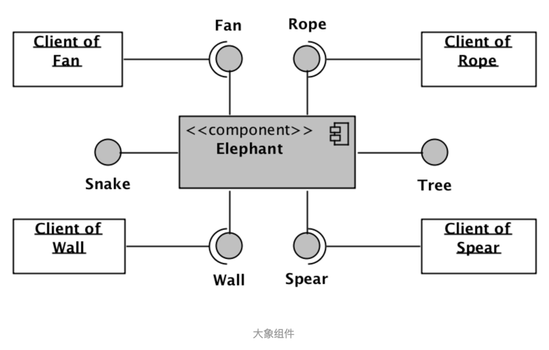
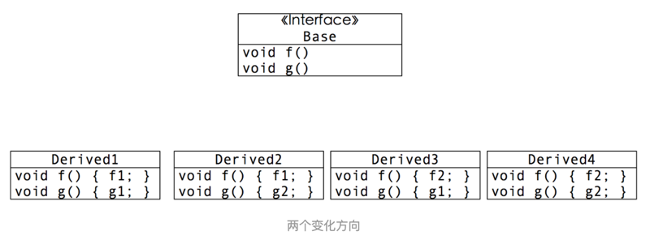
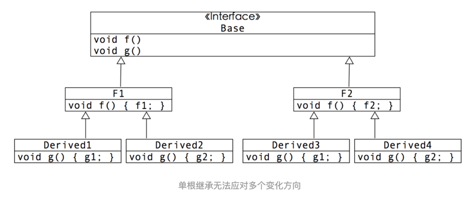

# 小类，大对象

[小类，大对象 - 简书](https://www.jianshu.com/p/a830d2261392)

## 01

一群盲人被带到一头大象面前，让他们摸摸大象像什么。一个瞎子摸到了大象的腿，说大象像一棵树；另一个瞎子摸到了大象的耳朵，说大象像一个扇子；第三个摸着大象的身体，说它像一堵墙；第四个瞎子则拽着大象的尾巴说，它分明像一根绳子......这就是我们熟知的《盲人摸象》的寓言。它主要是用来讽刺：我们不应该只看到一个事物的侧面，就匆忙给出结论，这样我们就与瞎子无异。

## 02

正如万事只要换个坐标系，就可能会得出不同结论一样；回到我们软件设计领域，重新衡量这个问题，会发现盲人摸象的效果恰恰是我们所苦苦追求的。假设我们拥有一头大象。如果现在有人需要一把扇子，我们就让他使用大象的耳朵来扇会儿风；如果有人需要一把长茅，就让他把象牙当作武器；而如果有人需要一根绳子，我们则可以把大象尾巴借他当绳子用会儿……

总而言之，对于不同个体，需要的是更加具体的服务，而不是一头大象，因而他也并不关心为他服务的事物背后是否是一头大象。而大象，是个完整的个体，不可分割（这很重要）。它很大，大到可以为外部提供多种功能的服务。而对于每种不同的服务需要者，它就扮演不同的角色。

1『我去啊，这个大象的思想实在是太 NB 了，完全是从另一个角度（正面）来看盲人摸象，做一张反常识卡片。』——已完成

如果我们将刚才的描述映射到软件的组件技术，就可以用下图来展现：



大象是一个不可分割的完整组件，但对外提供不同的服务。不同类型的客户使用不同的服务，完全无需知道其它服务的存在，也无需知道背后是谁再为自己提供服务。而这种方式，无疑降低了客户与服务提供者之间的耦合：1）一方面，每个服务背后的具体提供者都可以自由替换，而不用担心客户代码受到影响（但要遵从里氏替换原则，即要遵从客户与服务之间的契约）；2）另一方面：作为服务提供者 —— 大象 —— 不会强迫客户依赖它无需依赖的东西，而只依赖自己特定需要的服务接口；3）同时，由于你没有把整只大象呈现在客户面前，这就约束了客户随意使用大象提供的其它接口所带来的不必要的耦合。

如果回到具体程序设计上，一种可能的实现则会如下：

```java
public interface Fan
{
  // Fan related methods.
}

public interface Rope
{
  // Rope related methods.
}

public interface Snake
{
  // Snake related methods.
}

public interface Tree
{
  // Tree related methods.
}

public interface Wall
{
  // Wall related methods.
}

public interface Spear
{
  // Spear related methods
}


class Elephant implements Fan, Rope, Snake, Tree, Wall, Spear
{
  // Implementation of Fan related methods.
  
  // Implementation of Rope related methods.
  
  // Implementation of Snake related methods.
  
  // Implementation of Tree related methods.
  
  // Implementation of Wall related methods.
  
  // Implementation of Spear related methods.
  
  // all Elephant Data.
}

```

在这个 Java 版本的实现方式中，所有接口的具体实现都集中在 Elephant 类里。当接口足够多，实现足够复杂时，这毫无疑问会形成上帝类。不过，这貌似没有太大问题。毕竟，大象本来就是个大块头。

## 03

组件化的设计方式，某种程度也是一种多角色对象设计方式。我们每个人在生活中都扮演不止一个角色：1）在孩子面前，我们是父母；2）在父母面前，我们是子女；3）职场上，在上司面前，我们是下属；4）在下属面前，你是上司...

不同角色，要求履行的职责也不同：1）作为父母：我们要给孩子讲故事，陪他们玩游戏，哄它们睡觉；2）作为子女：我们则要孝敬父母，听取他们的人生建议；3）作为下属：在老板面前，我们需要听从其工作安排；4）作为上司：需要安排下属工作，并进行培养和激励...

所有这些角色，或者有所关联，或者风马牛不相及，但却可以很好的集中于一个人身上。

2『这个隐喻也实在太 NB 了，必须得挖作者更多的文章。（2020-07-13）』

## 04

每一个角色，都有其存在的上下文（Context），或称为环境。比如：你不会回到家里去扮演上司的角色；也不会在公司环境下扮演父母的角色。

对某个人来说，如果一个上下文并不存在，或者已经脱离了某个上下文，那么对他而言，对应的角色也就不会或不再存在。比如，如果一个人还没有孩子，那他就不会扮演父母这个角色；一旦一个人离开职场，那他就无需再承担与职场有关的角色。类似的，一个人也会由于上下文的变化而承担他过去无需承担的责任。比如，当有了孩子之后，他就要开始承担作为父母的责任；而一旦被提拔为管理者，就需要开始承担上司的职责。因而，每个人需要承担的角色，都在随着环境的变化而变化。

对于软件开发而言，环境对应的是 Use Case，对应的是需求。需求的变化，对于很多系统而言是很频繁的。这就意味着我们之前在一个类里实现所有角色相关代码所得到的上帝类，在频繁变化的需求面前，由于角色变更而导致的变化也是很频繁的。

## 05

在频繁的变化面前，上帝类的修改，往往并不是简单的增加或删除某个角色相关代码那么简单。我们已经知道，OO 的主要作用是为了模块化，通过将关联紧密的元素放到一个类中，然后通过封装手段将易于变化的细节隐藏起来，只暴露更为抽象，更为稳定的接口，从而降低模块间耦合。最终达到让软件在变化面前，局部化影响，容易修改的目的。与之相反的是，毫无边界控制的全局数据访问，从而造成大面积无规则的对于实现细节的依赖。这样的做法，在初次实现时，一定是最快速简单的。但同时也是在变化面前最为脆弱的。

而类，在 OOPL 里，是不可再分割的最小模块。而在类的内部，没有边界访问控制，对于类内部的一切实现细节的访问均是自由的。因而，在一个类内部，所有的成员变量都相当于全局变量，所有的函数，都相当于全局函数。而在类内部，没有任何强制手段可以阻止对这些「全局变量」和「全局函数」的自由访问。

如果一个类很小，职责单一，那么内部的高耦合所造成的影响就会很小（所谓高内聚，正是要把关联紧密的事物放在一起，从而将变化带来的影响控制在类内部）。但高内聚的另外一面是：只有关联紧密的事才应该被放在一起。对于一个多重职责的上帝类，内部的各个元素之间的关联紧密程度几乎可以肯定是不一致的。

在这种情况下，没有任何边界访问控制的类内部，就会很容易导致本不该有的高耦合。如果还是觉得难以理解，就不妨想象一下，把整个系统都放到单个类里，这样的设计会导致怎样的耦合度。

## 06

2003 年，伴随着 Eric Evans 出版了《领域驱动设计》，Martin Fowler 很快发表了一篇文章《Anemic Domain Model》(《贫血领域模型》)，对那些只有数据，没有有价值行为的所谓领域对象进行了强烈的批评。这篇文章引起了社区很大的反响。但却并没有阻挡住社区依然在大量使用贫血模型的脚步，Service，而不是 Domain Object，被当作表达业务逻辑的核心场所。

但这也不全是这些团队的错。其根本原因在于，当大家尝试使用充血模型时，发现在易于变化的业务逻辑面前，那些领域类很容易就变成了上帝类，然后随着业务的变化不断修改。完全无法达到局部化影响的效果。大家都是要解决问题的，不能为了充血而充血不是？因而，很多团队在实践 DDD 时，继续纠结的披着面向对象的外衣，行着面向过程之实。

## 07

在单一类里实现所有角色所得到的上帝类，被称作水平上帝类（或横向上帝类）。水平上帝类带来的问题，除了像所有上帝类一样，造成了不必要的高耦合之外，还会导致难以复用的问题。现在我们定义几个不同的 class，用来表现不同类型的人。通过这些 class，可以实例化一个个不同的对象：具体的人。

首先是 A 类型人的实现：

```java
struct TypeAPerson
   : Parent
   , Child
   , Underling
{ 
  // 父母角色相关接口
  void tellStory() {...}
  void playGameWithChild() {...} 
  // ... 

  // 子女角色相关接口
  void getAdviceFromParent() {...}
  // ... 
 
  // 下属角色相关接口 
  void acceptTask() {...}
  void reportStatus() {...}
  // ... 

private:
  // 所有角色所需的数据成员都放置于此 
  // ... 
};
```

下面是 B 类型人的实现：

```java
struct TypeBPerson
   : Parent
   , Boss
   , Underling
{ 
  // 父母角色相关接口
  void tellStory() {...}
  void playGameWithChild() {...} 
  // ... 

  // 老板角色相关接口 
  void assignTask() {...}
  void motivate() {...} 
  // ... 
 
  // 下属角色相关接口 
  void acceptTask() {...}
  void reportStatus() {...}
  // ... 

private:
  // 所有角色所需的数据成员都放置于此 
  // ... 
};
```

对于 TypeAPerson 和 TypeBPerson，他们都扮演了 Parent 和 Underling 的角色，并且这两个角色的实现方式也完全相同。同时，他们也各自扮演了对方不具备的角色：TypeAPerson 扮演了 Child，而 TypeBPerson 则扮演了 Boss。这就造成了这两个类之间是有部分重复代码的。但这的重复根本难不倒我们，将两者重合的角色代码提取到一个基类中即可。

```java
struct BaseTypePerson
   : Parent
   , Underling
{ 
  // 父母角色相关接口
  void tellStory() {...}
  void playGameWithChild() {...} 
  // ... 

  // 下属角色相关接口 
  void acceptTask() {...}
  void reportStatus() {...}
  // ... 
  
private:
  // 其它成员:数据成员和私有函数 
  // ... 
};
```

然后，让两个类都从此它继承:

```java
struct TypeAPerson
  : BaseTypePerson
  , Child 
{
  // 子女角色相关接口
  void getAdviceFromParent() {...}
  // ... 
};

struct TypeBPerson 
  : BaseTypePerson
  , Boss 
{ 
  // 老板角色相关接口 
  void assignTask() {...}
  void motivate() {...}
  // ... 
};
```

到目前为止，一切都好。此时我们再增加一个新的类型，让角色的复用关系更加复杂。如下：

```java
class TypeCPerson
   : Child
   , Boss
{ 
  // 子女角色相关接口
  void getAdviceFromParent() {...}
  // ... 
 
  // 老板角色相关接口 
  void assignTask() {...}
  void motivate() {...} 
  // ... 
 
private:
  // 所有角色所需的数据成员都放置于此 
  // ... 
};
```

此时，再想通过单根继承来解决复用问题，将会变成一个不可能完成的任务。

1『已经接受到作者想要传达的信息了，如果从「继承」实现一步步演变成「组合」实现，哈哈。』

## 08

单根继承的最大问题在于：只能解决单个变化方向的问题，对于多个变化方向无能为力。比如，在下面的关系中，基类 Interface 存在两个抽象函数：f 和 g。这代表两个不同的变化方向。如果 f 和 g 各自存在两种不同的实现方式，则会存在 4 种不同的组合关系。



这种情况下，使用单根继承是无法消除掉所有重复代码的。比如，我们将 f1 和 f2 的重复代码各自提取到不同的中间类 F1 和 F2 中，却依然无法避免 g1 和 g2 的代码重复。



由此可以看出，当存在多个变化方向时，使用单根继承来消除重复，不仅会造成大量的仅仅为消除重复存在的中间类（比如本例子中的 F1 和 F2），却最终依然无法彻底消除重复。因而，为了解决我们之前所述的多角色对象的重复问题，我们必须另辟蹊径。

1『中间类，接着原文中的图看，非常直观，果然一图胜千言。』

## 09

七巧板，是大家熟知的一种其源自中国的古老智力游戏。由这么七块简单的小素材，可以拼出变化无穷的图案。受限的只是你的想象力。这个简单的游戏，蕴含这一种极具价值的设计思想：组合。因而，我们首先将四个角色相关的实现拆解为四个类：

```java
struct ConcreteChild : Child
{ 
  // 子女角色相关接口
  void getAdviceFromParent() {...}
  // ... 

private:
  // 子女角色所需的数据成员
  // ... 
};

struct ConcreteParent : Parent
   
{ 
  // 父母角色相关接口
  void tellStory() {...}
  void playGameWithChild() {...} 
  // ... 

private:
  // 父母角色所需的数据成员
  // ... 
};

struct ConcreteBoss : Boss
{ 
  // 老板角色相关接口 
  public void assignTask() {...}
  public void motivate() {...} 
  // ... 
  
private:
  // 老板角色所需的数据成员 
  // ... 
};

struct ConcreteUnderling : Underling
{ 
  // 下属角色相关接口 
  public void acceptTask() {...}
  public void reportStatus() {...}
  // ... 
  
private:
  // 下属角色所需的数据成员  
  // ... 
};
```

现在我们有了这四个「零件」，下一个问题就是如何把它们组合成我们最终所需的 TypeAPerson，TypeBPerson 和 TypeCPerson。在 C++ 下，对于这类问题，最好的组合方式是多重继承:

```cpp
struct TypeAPerson
  : ConcreteParent
  , ConcreteChild
  , ConcreteUnderling
{
};  

struct TypeBPerson
  : ConcreteParent
  , ConcreteUnderling
  , ConcreteBoss
{
};  

struct TypeCPerson
  : ConcreteChild
  , ConcreteBoss
{
};  
```

一旦转为组合的设计方式，其应对变化的能力将得到极大的增强。比如，TypeAPerson 随后便为管理者，则只需要简单的组合一个新的角色：ConcreteBoss:

```cpp
struct TypeAPerson
  : ConcreteParent
  , ConcreteChild
  , ConcreteUnderling
  , ConcreteBoss      // 新增角色
{
};  
```

而 TypeBPerson 退休，不再从事职场工作，则只需要将职场相关两个角色删除：

```cpp
struct TypeBPerson
  : ConcreteParent
  // , ConcreteUnderling // 删除角色
  // , ConcreteBoss      // 删除角色
{
};  
```

另外，虽然 TypeAPerson 和 TypeBPerson 都扮演了 Parent 的角色，但随后 TypeBPerson 的 Parent 角色的实现方式发生了变化，那么我们只需要增加一个新的 Parent 实现：

```java
struct ConcreteParent2 : Parent
{ 
  // 另一种父母角色相关接口实现
  void tellStory() {...}
  void playGameWithChild() {...} 
};
```

然后把 TypeBPerson 的 Parent 角色替换为新的实现：

```cpp
struct TypeBPerson
  : ConcreteParent2
{
};  
```

这种关系，正如下图所示：


所有那些角色的实现，正如七巧板的那些小组件一样，作为素材库，每一个对象的设计者只需要首先查看素材库，看里面是否有自己所需的角色实现。如果存在，则通过简单的组合方式来复用。如果不存在，则编写自己针对某个角色的特定实现，除了自己使用之外，也变成了素材库的一部分。

1『读到这里，感触到的最核心的是你要有能力进行拆解，有能力拆解出「合适」颗粒度的组件。』

## 10

面向对象方法学，在最初被创造出来时，更多的是希望通过用对象来模拟现实世界的问题域，从而让软件更容易理解。但是，遵从这个思路去使用面向对象，容易得到上帝对象。这种现象的背后，反映了这种方法论的本质缺陷 —— 它没有触及软件设计的真正挑战：软件设计如何才能让软件在需求变化面前容易变更。

我们现在知道，为了让软件能更容易的应对变化，则必须遵从高内聚低耦合原则，以封装和隔离变化。但这样会必然会导致一堆单一职责的小类。而这些类并非一定存在于领域的直接概念上，往往是为了设计的灵活性而由设计师创造出来的。而这些小类最后则实例化为诸多的小对象，而这些小对象，当然也不是能够直接映射到现实问题领域的。而它们的种类事实上要远多于领域概念中的对象数量。所以，这两种哲学的矛盾，一直无法让 OO 发挥其应有的威力：前者更容易理解，但得到的软件更难修改；后者更灵活，却模糊了现实与领域的映射。

之所以产生这种矛盾的原因是：很多人把 class 与 object 看作对等的的东西。class 无非是用来实例化 object 的模版。

但事实上，类与对象是完全两种不同的事物 —— 类的作用，是为了模块化，我们应该遵从高内聚低耦合的原则去划分类，那怕由此产生了远超领域实体概念数量的类，也无妨。让软件容易应对变化，是我们无论采取何种方法论都应该遵从的原则。而对象，是我们运行时承载了数据和行为的实体：它的种类和数量应该与领域的真实概念存在清晰、明确、直接的映射。因而，类应该是小的，对象应该是大的。上帝类是糟糕的，但上帝对象却恰恰是我们所期盼的。

1『哇塞哇塞，太有启发性了。小类大对象，类是为了模块化，在类里做接口，来隔离变化。对象是为了映射真实世界的事物，封装好行为和数据。』

而从类到对象，是一种多对一的关系：最终一个对象模版是由诸多单一职责的小类 —— 它们分别都可以有自己的数据和行为 —— 所构成。而将类映射到对象的过程，在 Ruby 中的 Mixin；在 Scala 中则通过 Traits；而 C++ 则通过多重继承。因而，自 Scala 以来，诸多新设计的语言都开始包含 Trait 这个语法特性。但是其中一些完全没理解 Trait 的真正价值，不允许 Trait 包含数据，因而它们也失去了发挥更强大威力的潜力。

1『在 PHP 里也是通过 Traits 来实现，小类映射到大对象。』

## 11

2011 年，我们在一个电信项目的重构和开发过程中，发现在一个概念上不可分割的领域对象上，其过多的变化方向上导致了大规模重复代码，从而导致代码极难理解和维护。而如果将其切分为很多小对象，可以将重复消除掉，但却会导致对于诸多小对象的管理问题，以及大量的内存浪费，当时那个项目内存优化也是一种重要的目标。

这逼迫我们对 OO 进行了更深入的思考，最终明确了小类，大对象的概念，也开始真正发挥 OO 的威力。由此，在那个项目上，我们得到了两全其美的解决方案：不仅大大增强了系统的可理解性和可维护性，也大幅降低内存占用（内存节省了 70%）。并且作为一种通用方法，在随后的项目中不断发挥其威力。

总而言之，通过将类和对象看作不同事物，现代 OO 方法学漂亮的解决了设计中最重要的两个问题（见《[简单设计 - 简书](https://www.jianshu.com/p/0228d2dd90fe)》）：1）类作为一种模块化手段，遵循高内聚，低耦合，让软件易于应对变化；让贫血模型和充血模型不再成为一个两难选择；2）对象作为一种领域对象的的直接映射，解决了过多的类带来的可理解性问题，让领域可以指导设计，设计真正反映领域，而这才是领域驱动设计的真正目的和精髓。

自此，已经没有人可以阻挡我们深信 OO 是一种非常有效的分析和设计方法论了。

2『消化吸收作者的文章「简单设计」，并也收录为附件「0322简单设计」。』——已完成