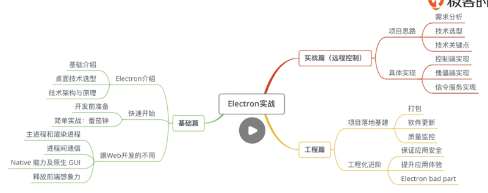

# 基础篇

[geektime-electron：极客时间视频课程《Electron开发实战》](https://gitee.com/geektime-geekbang/geektime-electron)

## 0101. 课程介绍

会遇到的问题：

1、技术栈多。可能会集成 C++ 或者 Rust 等第三方库。会涉及到多线程的概念。

2、工程化建设。Electron 基建在大部分公司里是比较匮乏的，依赖 web、手机端的业务没法满足 Electron 的业务。比如在 Mac 端打包的时候可以依赖 iOS 持续集成，但在 windows 上就不行。类似的场景还特别多。

3、如何充分利用好 Electron 的能力。一般 web 前端工程师在开发 Electron 应用时，会因为习惯而局限于浏览器开发的思维中，做出的交互和体验跟 web 应用一样。不知道如何释放自己的想象力和发挥客户端真正的作用。

课程的特点：1）偏于实践。2）着重工程化。讲述真实项目里遇到的坑和解放方案。我会以 web 前端工程师的视角来设计课程，web 的知识不是重点，重点是 Electron 的相关内容。分为三个部分讲述：

1、基础篇。介绍 Electron，深挖其原理，并与 web 开发做对比，针对不同之处去介绍 Electron 的开发。

2、项目实战篇。从 0 开始实现一个桌面控制软件。这是一个结合了 Electron、Node.js、WebRTC 技术的综合项目。

3、工程篇。我会逐步完成实战篇里的桌面控制项目，给你讲述在真实项目里做 Electron 的流程。工程化建设的关键点和坑。

### 黑板墙

#### 01

疑问 1：是不是说程序开发完成了，可以通过 electron 的打包工具将所有开发的代码打包起来，生产一个可点击文件，点击这个文件之后客户端窗口就打开了？

疑问 2：客户端是如何与服务端进行交互的？

疑问 3：客户端如何集成 angular？

作者回复：1）是的。最后可以打包成你想要的格式，比如exe、dmg。2）跟服务端交互的话，在页面上的跟浏览器一样。3）集成任何一个框架都很简单，跟你开发 web 差不多，第二章里有 react 的集成示范。

2020-02-07

在我以往的项目开发中都是做 B/S 开发，公司要开始做客户端开发，将以往的项目迁移到客户端展示。我对客户端的理解不深，这个客户端是指在桌面上写一个 APP，打开 app 访问就和直接访问浏览一样吗？

作者回复：嗯嗯，粗暴理解就是网页上包了一个壳子，壳子提供了很多东西，用户使用时就是桌面客户端。

#### 02

我发现我打包了在线系统的网页后，用客户端访问，导出以前的表格数据，excel 不知道下载到哪里去了，执行导出操作，感觉完全没反应。这个该这么设置呢？

作者回复：electron 没有浏览器那种下载的 GUI，需要我们自己写，你可以看看 electron session 模块。

#### 03

如果使用 electron 开发一个具有可扩展插件的软件？如 vscode，hbuilderx，atom 这样的具有插件系统的软件？

作者回复：可扩展软件就相对复杂了，主要是看架构设计了，你可以找一些插件系统的资料，比如你可以直接翻翻 Atom 源码，不多。也可以看一些文档，比如像：https://url.cn/5YAZVo7。

1『网页的链接过期了，后面用的时候直接 Googe 搜。（2021-04-10）』

#### 04

如果想实现修改主进程 main.js 自动 reload 应用的话，必须要装一个 nodemon 吗？还有没有其他的方法？

作者回复：可以试试 electron-reload。

## 0102. 内容综述

基础篇。1）Electron 的介绍。Electron 是什么？在什么时候用？有谁在用？为什么在用？以及怎么用？相比与 web 开发又有什么不同？2）快熟开始。带大家做一个小应用，番茄钟。

项目实战篇。带你写一个大家熟悉应用，远程控制。达到 3 个目的：1）完成一个实际的完整的项目，比如你可以在自己工作中远程 debug。2）更全面的了解 Electron 的开发。3）扩展你的技术视野。除了 Electron 自身外，我们还会讲到 WebSocket Server，然后 WebRTC、Node.js 等等。

工程篇。我会以一个真实线上项目的要求，为你讲解 Electron 项目工程化的关键点，以及实践技巧，包括项目必须得打包、软件更新、质量监控等等。以及近阶段如何保证应用的安全、提升体验的细节，如何使用 C++ 能力等。最后我们会看看 Electron 不好的一面以及应对的策略，与你一起畅想这门告诉发展技术的未来。

### 黑板墙

#### 01

我们在项目中正在开发一个流程编排的客户端，用到 Electron/vue/ts/websocket 等技术。前面自学，折腾了有 4 个月了。手机上推送这门课程之后，立马就购买了。来的很及时，实战后有很多需要解惑的点。

几个关键关注点：

1、跟 web 技术的技术栈结合，如 react/vue/angular。

2、多窗口通信；多窗口及多页面应用。

3、Electron 和 c++ 及第三方应用交互。（如果 Electron 不能很好调用原生能力，会限制很多）

4、当用到非传统 Web 技术时的框架管理，如 WebSocket。

5、大型桌面端性能优化等。

作者回复：大部分后面会提到，但侧重点会有不同，如果大家对某些知识点很感兴趣可以留言，我在课程完结前可能会有一些加餐。

2020-01-08

#### 02

我是一名后端开发者，我想问一下，Electron 可以与 golang 交互吗？

作者回复：有人做过。

2020-05-04

#### 03

我觉得Electron最不好的一点是编译生成的程序太大了。

作者回复：的确很大，这个最后也有讨论到。

2020-03-27

#### 04

问个技术问题啊，我用 electron 做了一个多窗口项目，当应用长时间不用，在打开一个窗口时，会超级慢，白屏很长时间，页面里就是一个简单的 html，我现在没办法，打开应用时，就把这个窗口创建隐藏了，使用时在显示，有没有更好的方法？electron 是 4.0。

作者回复：一般不会出现这种情况，你可以找找是不是有同步操作或者大量 IO。或者可以放个可复现的代码连接一起看看讨论。

2020-01-09

#### 05

不太懂软件工程的内容，最近公司想用 electron 做个桌面软件，正好看到这个课程，我想请问老师，electron 可以加载并调用起第三方硬件的 dll 里的方法么？

作者回复：可以，后面会涉及到，使用 node-ffi 即可调用 dll。

2020-01-09

#### 06

Electron 做一个滚动截长图的应用，老师认为难点在什么地方的？

作者回复：滚动截屏之类的已经有很多实现了，其实可以直接利用，比如 puppeteer。如果你想在 electron 实现截页面，可以使用 webContents.capturePage，难点的话可能就是需要一些细节吧，可以看一下这个讨论，会有一些 code 参考。

[scale factor error in webview/webcontents.capturePage · Issue #8314 · electron/electron](https://github.com/electron/electron/issues/8314)

2020-01-08

#### 07

不懂前端想做 Electron 桌面端怎么办？

作者回复：学基本的 js，html，css 就可以写，前端还是比较容易入门的。如果写复杂的页面，还是需要一门前端框架，类似 vue 和 react。

2020-01-08

## 0103. Electron 为什么这么火

