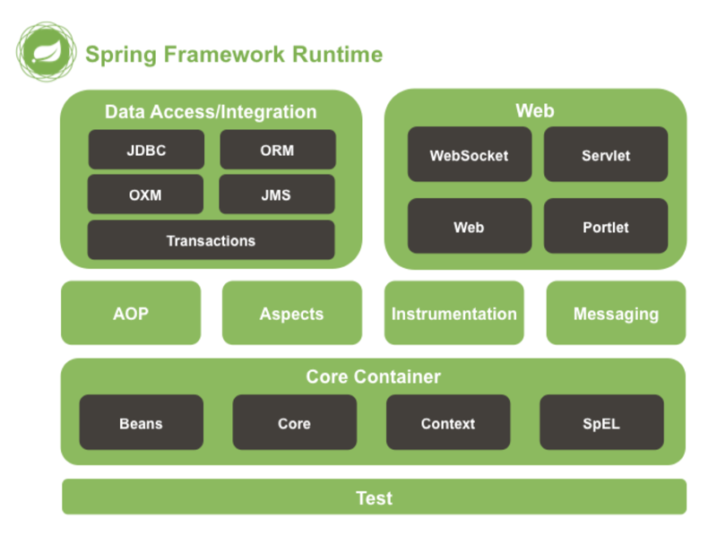
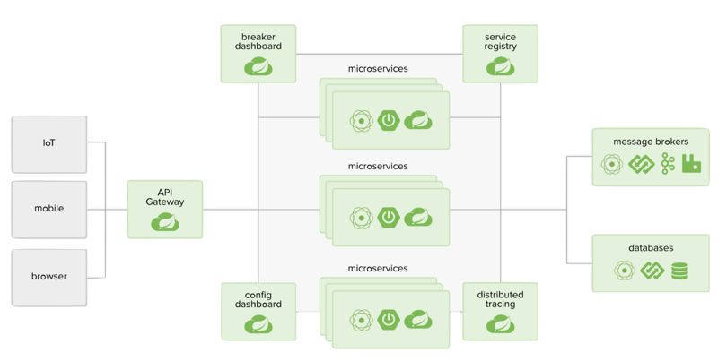

# 0101. 初识 Spring

## 1.1 大纲

1、初识 Spring：1）Spring 家族的主要成员。2）跟着 Spring 了解技术趋势。3）编写第一个 Spring 应用程序。

2、数据操作。1）JDBC 必知必会。2）O/R Mapping 实践。3）NoSQL 实践。4）数据访问进阶。

3、Web 开发。1）Spring MVC。2）Web 开发进阶。3）访问 Web 资源。这一部分里回去聊，RESTful Web Service 相关的内容，还有在 Spring 5 出现的 WebFlux 相关的东西，还有分布式 Session。

4、Spring Boot。1）自动配置原理及实现。2）起步依赖原理及定制。3）配置文件加载机制。4）获取运行状态。5）配置运行容器。6）可执行 Jar 背后的秘密。这一大部分里会去聊 Starter Dependancy，还有有它的一些自动配置是怎样实现的。也会聊一聊在 Spring Boot 中运维的一些点它是怎样考虑的。

5、Spring Cloud。1）云原生和微服务。2）服务注册、发现、熔断与配置。3）Spring Cloud Stream。4）服务链路追踪。这一部分会去聊它的服务发现、服务注册、还有熔断。

## 1.2 Spring 家族主要成员

1、诞生于 2002 年，成型于 2003 年，最早的作者为 Rod Johnson。

Expert One-on-one J2EE Design and Development

Expert One-on-one J2EE Development without EJB

2、目前已经发展到了 Spring5x 版本，支持 JDK8-11 及 Java EE8。

Spring 始于框架，但不限于框架。1）Spring Framework。2）Spring 相关项目。比如 Spring Data、Spring Boot、Spring Cloud，以及你可能不太熟悉的 Spring Social、Spring Kafka。3）整个 Spring 家族。

Spring Framework：用于构建企业级应用的轻量级一站式解決方案。

设计理念：1）力争让选择无处不在。2）体现海纳百川的精神。3）保持向后兼容性。4）专注 API 设计。5）追求严苛的代码质量。

Spring Framework

Spring Framework 非常着重的突出一个分层的设计，它争取在每一个层都让你有自己的选择，比方说我再旁边图上可以看到它的数据访问层，你可以选择 JDBC 也可以选择 ORM 这样的方式。另外，在这个层里面，我们选择了 ORM，Spring 也可以说你可以去用 Hibernate，也可以选择 iBatis 或者 Mybatis 这样的框架。所以说它其实把所有能够想到的这些主流的研发框架和这些工具支持都已经考虑在里面了。你完全可以说在选择时不必有心理负担，选择你熟悉的、选择你最好用的那个，Spring 一定会提供对它的支持。然后 Spring 也保持了一个非常好的向后兼容性，也有一个非常好的 API 的设计。这里要着重说一下 Sping 的核心的那些代码。其实在这么多年来说并没有一个太大的改变，比如说他的 IOC、它的 AOP 这样的一些部分，所以说这是一个非常厉害的地方。

最后是它的代码质量，Spring 的代码如果大家去它的 GitHub 上看，会发现其代码是非常整洁的，尤其是他的 JavaDoc 也非常的完备。我们会看到它的 JavaDoc 部分里，每一个类上面都会有很多的东西，写的非常清楚它是干什么的，在这一点上其实也非常值得大家去学习。

Spring Boot

Spring Boot：快速构建基于 Spring 的应⽤程序。1）快、很快、⾮常快。2）进可开箱即⽤，退可按需改动。3）提供各种⾮功能特性。4）不⽤⽣成代码，没有 XML 配置。

在本课程中，你还会看到：Spring Data、Spring MVC、Spring WebFlux……

目前很热的一个框架，它帮助大家用最少的时间和精力去构建一个基于 Spring 的应用程序，如果你对 Spring 的历史有一定的了解，或者说使用的时间比较长的话，你会知道还有一个叫 Spring Roo 的一个工具，它是帮助大家去生成那些 Spring 的骨架、它的代码、它的各个层的这样一个工具，那么现在 Spring Roo 已经慢慢被 Sping Boot 所淘汰掉了。在他们的理念中，如果这个东西是可以被生成的，那么它的存在价值就没有那么大，因为我可以把这些生成的东西去掉，囊括在代码里面，让框架来给你做这些事情，所以说 Spring Boot 的诞生也是一种开发趋势的改变。Spring Boot 里面提供了很多开箱即用的功能，比如说你从 start.spring.io 上面可以直接去下载一个骨架的程序，直接就能运行，它里面包括你需要的应用容器等等一系列的东西，然后如果你里面引入了数据库的连接的一个驱动，比如说 H2，比如说 MySQL，然后引入 JDBC 支持，它自动会帮你配置好相关的设置，这一点完全可以做到开箱即用。同时它也给你留了很多配置的空间，你可以完全去做你自己的定制，然后在 Spring 当中其实还有很多非功能性的东西，比如说它里面的安全性考虑了很多东西，它里面的监控替你考虑了很多东西，那么其实在平时的应用开发过程中，大家可能更多的去关注一个应用逻辑的实现，而且这些非功能性的考量可能并不足。Spring Boot 其实把业内的很多最佳实践都放到框架里面，让你可以更多的 focus on 你的业务逻辑上，而不用关心这些非功能性的点。

最后，即使我前面讲的，它不太需要去生成各种各样的东西了。在这个课程中，我们在 Spring Boot 的使用过程中也会去讲到它相关的 Spring Data、SpringMVC、Spring WebFlux 这样等等一系列的东西。

Spring Cloud

Spring Cloud：1）简化分布式系统的开发。2）配置管理。3）服务注册与发现。4）熔断。5）服务追踪。……

Spring Cloud 也是这几年诞生的比较热门的 Spring 成员，在里面它其实帮大家简化了分布式系统的开发，比方说我在分布式系统当中的服务注册和发现怎么去做，我的整个配置管理怎么去做，我的服务的熔断该怎么去做，那么在整个应用程序从单机向集群向发展的过程当中，Spring Cloud 帮助大家能够能快更好更轻松的去开发出一套基于云的应用程序。

### 黑板墙

作品中会有提到如何启动后动态初始化 spring bean嘛？作者回复：如果你说的是 Spring Boot 怎么做自动配置的，那在 Spring Boot 的自动配置相关的章节里会提到，如果你是说怎么做后置处理，有关于 Spring 的 BeanPostProcessor 和 BeanFactoryPostProcessor 的内容，在讲如何在 3.x 上实现自动配置时会讲到。如果你说的是如何动态创建 Bean，那在第 3 章讲 Repository 的创建时会提到。2019-02-12

作为一个前端开发者对 java 还没有那么的熟练，今年准备好好系统的学习下 Java 还有 Spring 全家桶的东西，除了您这个全家桶的视频，还有没有推荐的书籍呢？作者回复：《Spring实战》是大家看的比较多的，而且已经第五版了，可以考虑看看。另外，其实我更推荐看官方文档来学习。2020-04-13

Spring 的学习需要事先学习掌握 struts、jsp 等知识吗？作者回复：这倒是不需要，而且 Struts 现在也用的少。2019-02-27

有时间能否评价一下 spring cloud alibaba，及使用趋势。作者回复：Spring Cloud Alibaba 还是提供了不少阿里的实践经验的，这些设施还是经过考验的，但后续如果发展我不好评价，美好的愿望是其中的项目能发展为类似 Apache 顶级项目吧，只是愿望，不知道阿里的团队能不能坚持把这些开源项目维护下去。2019-02-20

如何高效的阅读源码，哪些部分的源码是一个开发者必须掌握的，哪些框架中的设计模式，会在实战中经常运用，AOP 的实战场景可以介绍下吗？作者回复：如果只是用代码做开发，其实完全可以不用看源码，阅读源码是帮你更好地掌握框架，在遇到问题时能更快地找到解决的思路。不用一下子想着把所有内容都读了，其实我也没把所有代码都看了，我是随着自己的使用在分段地阅读，自己用到了或者需要稍微改动一些东西时（后者不常见，除非你专门是做这个的），去读会更有效果。至于 AOP，其实 Spring 的事务就是基于 AOP 做的，还有通用的统一摘要日志等等。2019-02-12

我知道 Spring Cloud 主要搭建 rest 的 http 应用，在最后 Spring Cloud 图中显示，Web、iot、mobile 通过 api-gateway 访问系统，Spring Cloud 是不是支持出 http 以外的协议呢？Spring Cloud 是不是可以和 netty 结合呢？作者回复：这里的 Gateway 其实是指 Spring Cloud Gateway，之前也有用 Netflix 的 Zuul 的，但也是以 HTTP 形式居多的。你问可不可以与 Netty 结合，我只能说，只要想，总是有办法的，用 Spring Boot 写个程序里面用 Netty 启动监听个端口也是中方式，不是么，其实 WebFlux 就支持 Netty。但你说的官方是否支持非 HTTP 协议的网关，走 TCP 的，这个我的确没见到过。2019-02-20

## 1.3 跟着 Spring 了解技术趋势

不知道有多少同学回去看一些框架的 Release Notes，它的 Changelog 等等这样的一些信息。比方说我们可以看一下 Spring Framework 5.0 的它的一个 Release Notes，这里面我摘出了这么一些东西。

| 改变点 | 改变的意义 | 一些思考 |
| --- | --- | --- |
| Java 8+、Kotlin | 语⾔⻋车轮滚滚向前 | 还在⽤低版本的 Java 我该怎么办 |
| WebFlux | 异步编程模式的崛起 | 全⾯落地尚需时⽇ |
| 去掉了很多⽀持 | Portlet 过时了、Velocity 不维护了、 JasperReport 不流⾏了 | 库有千千万，我该怎么选？ |

关注语言新版本里的一些新特性，比如 Java 8 里的 lamba。

开始支持 Kotlin 了，这门语言既然得到了 Google 的支持，然后也得到了 Spring 的支持，那么说明至少我去了解一些它，也许它会给你带来一些新的思路。

01:11

